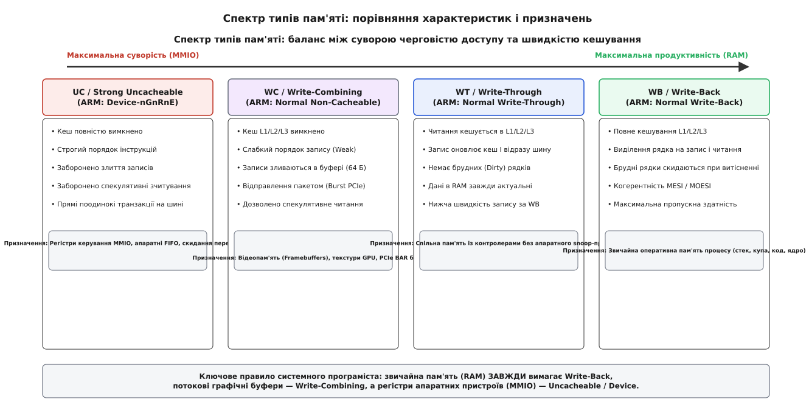
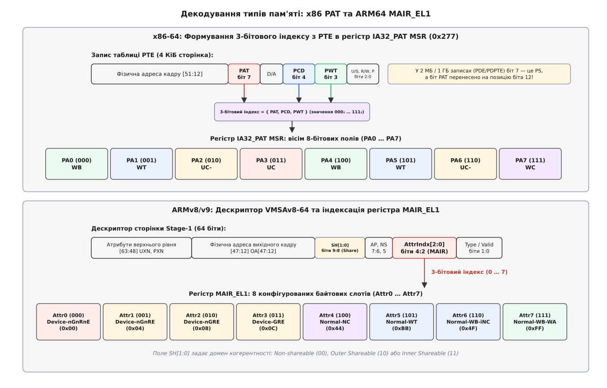
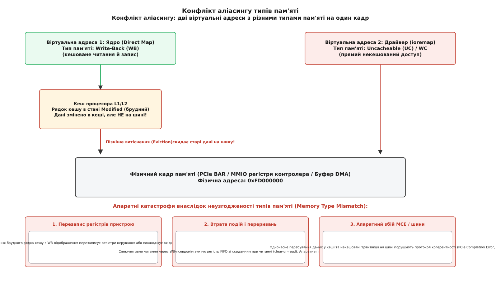

# Тип пам'яті в записі таблиці сторінок: кешованість, PAT і MAIR

<preknowlist>
- [Сторінки, таблиці сторінок і MMU](topic:sf-os/paging-and-mmu) — сторінки, кадри, деревоподібні таблиці перекладу та формат записів PTE.
- [Кеш](topic:hw-arch/cache) — рівні L1/L2/L3, рядки кешу, когерентність та політики запису.
- [Віртуальний адресний простір процесу](topic:sf-os/virtual-address-space) — організація адресного простору процесу та ядрові відображення.
- [Непослідовні відображення ядра (vmalloc)](topic:sys-unix/vmalloc-kernel-mappings) — виділення віртуальних діапазонів та відображення апаратної пам'яті.
</preknowlist>

Коли процесор зчитує 64-бітне число з оперативної пам'яті, кеш-пам'ять першого рівня підтягує із системної шини суцільний рядок розміром 64 байти. Наступне читання сусідньої змінної виконується вже за 4 такти ядра замість 200 тактів очікування DRAM. Проте якщо таку саму операцію читання спрямувати за адресою апаратного регістра мережевої карти, де лежить покажчик черги вхідних пакетів із прапорцем автоскидання при зчитуванні (*clear-on-read*), процесорний кеш і механізм спекулятивного випереджального читання витягнуть дані до того, як драйвер буде готовий їх обробити. Регістр скинеться, пакет вважатиметься прийнятим контролером, але процесор викине спекулятивно зчитаний результат через невірне передбачення розгалуження. Дані безповоротно втрачено, а мережеве з'єднання зависне.

Ця фундаментальна відмінність між поведінкою звичайної оперативної пам'яті та апаратних пристроїв вимагає від процесора знати не лише фізичну адресу сторінки, а й її **тип пам'яті** (англ. *memory type*) або **атрибути кешування**. Сучасні процесори архітектур x86-64 та ARM кодують ці властивості безпосередньо в дескрипторах таблиць сторінок через механізми **PAT** (Page Attribute Table) та **MAIR** (Memory Attribute Indirection Register).

## Фізика шини та природа апаратних бічних ефектів

Оперативна пам'ять (DRAM) є пасивною матрицею комірок. Її стан змінюється виключно тоді, коли центральний процесор або контролер прямого доступу до пам'яті (DMA) явно записує туди значення. Для неї діють три базові оптимізації сучасних процесорів:
1. **Кешування з відкладеним записом (Write-Back):** модифіковані дані утримуються в швидких кешах L1/L2/L3 і скидаються в DRAM лише тоді, коли рядок кешу витісняється новою інформацією.
2. **Спекулятивне читання та випереджальна вибірка (Speculative Prefetching):** апаратні блоки передбачення переходів аналізують шаблони звернень і заздалегідь завантажують наступні рядки пам'яті в кеш.
3. **Позачергове виконання та перевпорядкування (Out-of-Order Execution):** конвеєр процесора може переставити місцями читання та записи до незалежних адрес задля уникнення простою обчислювальних блоків.

Для регістрів периферійних пристроїв, відображених у пам'ять (MMIO, англ. *Memory-Mapped I/O*), усі три оптимізації є руйнівними. Відображений у пам'ять регістр — це вхідний або вихідний порт цифрової логіки контролера (наприклад, PCIe-контролера NVMe-накопичувача, мережевого адаптера або графічного процесора). Звернення до MMIO має **бічні ефекти** (англ. *side effects*):
* Читання з адреси буфера FIFO (англ. *First-In First-Out*) виштовхує черговий елемент із черги апаратного приймача.
* Запис за адресою «командного регістра» негайно ініціює апаратну дію (наприклад, передачу імпульсу на двигун або відправку пакета в кабель).
* Зміна порядку двох записів у регістри пристрою (наприклад, спочатку запис адреси дескриптора DMA, а потім біта запуску DMA) призведе до того, що контролер почне читати пам'ять за старим випадковим покажчиком.
* Скидання транзакцій на шині PCIe генерує пакети TLP (англ. *Transaction Layer Packet*). Для звичайного некешованого доступу кожен запис викликає окремий пакет Single DWORD MemWr, де на 4 корисних байти припадає 16–20 байтів службового заголовка пакета, що знижує корисну пропускну здатність шини на 80%.

Тому апаратна підсистема керування пам'яттю (MMU) повинна володіти чіткими правилами взаємодії процесорного ядра із системною шиною для кожної віртуальної сторінки.


*Спектр типів пам'яті: від абсолютно некешованого суворого доступу для керування пристроями до агресивно кешованого зворотного запису для оперативної пам'яті.*

## Спектр типів пам'яті: від Uncacheable до Write-Back

Архітектури сучасних процесорів виділяють кілька дискретних класів поведінки пам'яті, які відрізняються трьома параметрами: можливістю збереження даних у кеші, порядком виконання операцій запису та дозволом на об'єднання дрібних транзакцій у великі пакети.

### 1. Uncacheable (UC / Strong Uncacheable)
Найбільш суворий режим доступу:
* **Кешування:** повністю заборонене на всіх рівнях (L1, L2, L3).
* **Спекуляція:** заборонена. Процесор не має права зчитувати адресу доти, доки всі попередні інструкції не зафіксують свій результат у конвеєрі (на стадії *retire*).
* **Черговість:** суворий програмний порядок (*Program Order*). Записи та читання потрапляють на шину строго в тій послідовності, у якій вони записані в коді асемблера.
* **Злиття записів:** заборонене. Запис одного байта породжує 1-байтову шинну транзакцію.
* **Застосування:** Регістри конфігурації та керування контролерів (MMIO), апаратні таймери, контролери переривань (APIC, GIC).

### 2. Write-Combining (WC)
Спеціалізований високопродуктивний режим для виведення великих масивів даних:
* **Кешування:** вимкнено в L1/L2/L3. Дані не утримуються в кешах і не викликають витіснення інших рядків.
* **Буферизація та злиття:** записи перехоплюються внутрішніми апаратними **буферами заповнення рядка** (англ. *Line Fill Buffers / Write-Combining Buffers*), кожен із яких має розмір одного рядка кешу (64 байти).
* **Черговість:** слабка модель упорядкування (*Weakly-Ordered*). Процесор дозволяє довільне перевпорядкування записів усередині буфера злиття.
* **Шинна транзакція:** коли програма заповнює всі 64 байти буфера (або примусово скидає його інструкцією бар'єра пам'яті `sfence` чи `dmb`), буфер скидає весь блок у шину PCI Express за одну пакетну транзакцію (*PCIe burst write*).
* **Застосування:** Кадрові буфери відеокарт (англ. *framebuffers*), пам'ять текстур GPU, буфери передачі даних до прискорювачів обчислень.

### 3. Write-Through (WT)
Проміжний режим зі збереженням миттєвої синхронізації з основною пам'яттю:
* **Читання:** кешується в L1/L2/L3. При промаху завантажується 64-байтовий рядок.
* **Запис:** негайно записується в кеш І одночасно надсилається через чергу запису в системну пам'ять DRAM.
* **Стан рядка:** рядок у кеші ніколи не переходить у стан *Modified/Dirty* (брудний), оскільки копія в пам'яті завжди ідентична копії в кеші.
* **Застосування:** Відеопам'ять простих дисплеїв без апаратного протоколу когерентності, діагностичні буфери, де важливо зберегти стан навіть при раптовому вимкненні живлення процесора.

### 4. Write-Back (WB)
Стандартний режим функціонування для всієї звичайної оперативної пам'яті:
* **Читання й запис:** повністю кешуються з виділенням рядка при промаху (*Read-Allocate* та *Write-Allocate*).
* **Відкладений запис:** запис модифікує лише рядок у кеші L1, переводячи його в стан *Modified* за протоколом MESI/MOESI. Запис на системну шину відбувається лише тоді, коли цей рядок витісняється іншими даними або скидається примусово.
* **Пропускна здатність:** максимальна з можливих, оскільки 95–99% операцій пам'яті обробляються на частоті процесорних ядер без звернення до шини DRAM.
* **Застосування:** Код ядра, стек, купа процесу, файловий сторінковий кеш, анонімна пам'ять.

### 5. Write-Protected (WP) та Uncacheable-minus (UC-)
В архітектурі x86 існують додаткові службові типи:
* **Write-Protected (WP):** читання кешується, але операції запису оминають кеш і передаються на шину, паралельно інвалідуючи відповідний рядок у кешах інших ядер. Використовується для тіньової пам'яті BIOS (ROM Shadowing).
* **UC-minus (UC-):** ідентичний типу UC за винятком того, що він може бути перевизначений типом Write-Combining через застарілі регістри MTRR. Використовується ядром Linux як базовий некешований тип за замовчуванням для підтримки старих драйверів.

[Про те, як розвивалися апаратні механізми керування кешуванням від перших змінних регістрів MSR у Pentium Pro до повноцінного переходу на сторінкові таблиці PAT](topic:sys-unix/memory-types-and-page-attributes/hist-mtrr-to-pat.md), детально розповідає історичний огляд.

## MTRR: керування на рівні фізичних діапазонів

Історично першим способом налаштування типів пам'яті в архітектурі x86 стали регістри діапазонів **MTRR** (англ. *Memory Type Range Registers*), запроваджені в процесорах Intel Pentium Pro. 

MTRR працюють виключно з **фізичними адресами**. Процесор містить набір спеціальних машинно-залежних регістрів (MSR):
1. **Регістр за замовчуванням (`IA32_MTRR_DEF_TYPE`, MSR `0x2FF`):** визначає тип пам'яті для будь-якої фізичної адреси, що не потрапила в жоден явний діапазон (зазвичай встановлюється в `UC` або `WB`).
2. **Фіксовані MTRR (`IA32_MTRR_FIX64K_*`, `IA32_MTRR_FIX16K_*`, `IA32_MTRR_FIX4K_*`):** 11 регістрів, що покривають перші 1024 КіБ фізичного адресного простору розбитими на фіксовані шматки (відрізки по 64, 16 та 4 КіБ).
3. **Змінні MTRR (`IA32_MTRR_PHYSBASEn` та `IA32_MTRR_PHYSMASKn`, MSR `0x200` … `0x20F`):** пари регістрів, де `PHYSBASE` задає базову фізичну адресу та базовий тип пам'яті (у молодших 8 бітах), а `PHYSMASK` містить бітову маску розміру та прапорець валідності (біт 11).

Арифметика перевірки збігу з діапазоном MTRR виконується апаратно за один такт паралельно для всіх пар регістрів:

```
Збіг = ((Фізична_Адреса & Маска) == (База & Маска)) & Валідний
```

### Чому MTRR не вистачило для сучасних систем

Головною вадою MTRR стала їхня обмежена кількість. Типовий процесор x86-64 має лише **8 пар змінних MTRR**. При цьому діє жорстке апаратне правило: базовий адрес та розмір діапазону зобов'язані бути **степенями двійки** (`2ⁿ`).

Якщо відеокарта надає кадровий буфер розміром 768 МіБ, операційна система не може описати його одним записом MTRR. Їй доводиться розбивати буфер на суму двох степенів двійки: `512 МіБ + 256 МіБ`, спалюючи одразу дві пари цінних регістрів із восьми наявних. Якщо ж у системі працює кілька GPU, контролери швидких мереж 100GbE та прискорювачі AI, слоти MTRR миттєво закінчуються.

Крім того, MTRR діють глобально на фізичну пам'ять. Якщо операційна система хоче надати окремому користувацькому процесу прямий доступ до 4-кілобайтної сторінки у режимі Write-Combining, а сусідні сторінки залишити ядру як Write-Back, засобами MTRR це зробити неможливо: мінімальний діапазон MTRR вимагав би зміни атрибутів для великого неперервного фізичного блоку.

> 🔧 **Навіщо це.** Стан активних діапазонів MTRR у запущеній системі Linux можна перевірити через інтерфейс ядра `/proc/mtrr`:
> ```sh
> $ cat /proc/mtrr
> reg00: base=0x000000000 (    0MB), size= 2048MB, count=1: write-back
> reg01: base=0x080000000 ( 2048MB), size= 1024MB, count=1: write-back
> reg02: base=0x0e0000000 ( 3584MB), size=  512MB, count=1: write-combining
> ```
> Тут системний BIOS або відеодрайвер виділив діапазон `0xe0000000` (розміром 512 МіБ) під відеопам'ять із типом `write-combining`. Проте всі сучасні драйвери намагаються уникати прямих маніпуляцій із MTRR, перекладаючи керування на сторінковий механізм PAT.

## x86 PAT: таблиця атрибутів у кожному записі сторінки

Щоб подолати обмеження MTRR і перенести керування типами пам'яті на рівень індивідуальних 4-кілобайтних сторінок, архітектура x86 отримала механізм **PAT** (англ. *Page Attribute Table* — «таблиця атрибутів сторінок»).

PAT використовує три біти, присутні в записах ієрархічних таблиць сторінок:
1. **PWT (Page-level Write-Through, біт 3):** біт наскрізного запису.
2. **PCD (Page-level Cache Disable, біт 4):** біт вимкнення кешу.
3. **PAT (Page Attribute Table Index, біт 7 у PTE):** новий біт індексу таблиці.

Ці три біти об'єднуються процесором у 3-бітове двійкове число від `000₂` (0) до `111₂` (7). Отримане число слугує індексом у 64-бітному регістрі процесора **`IA32_PAT` MSR** (адреса `0x277`).


*Декодування типів пам'яті: об'єднання бітів PTE у 3-бітовий індекс до регістра IA32_PAT на x86 та пряма індексація регістра MAIR_EL1 через поле AttrIndx[2:0] на ARM64.*

### Архітектурна пастка великих сторінок (Huge Pages)

У стандартному записі останнього рівня таблиці сторінок для сторінки 4 КіБ (PTE, англ. *Page Table Entry*) біт PAT розташований на позиції **7**. 

Проте в записах каталогів сторінок (PDE для великих сторінок 2 МБ та PDPTE для гігабайтних сторінок 1 ГБ) біт 7 уже зайнятий прапорцем **PS (Page Size)**, який повідомляє MMU, що переклад закінчується тут і не спускається на нижчий рівень таблиць.

Щоб зберегти можливість вибору типу пам'яті для великих сторінок, розробники архітектури x86 перенесли біт PAT у записах PDE та PDPTE на позицію **біта 12** (наймолодший біт адреси кадру). Через це ядро операційної системи мусить використовувати різні бітові маски при формуванні прапорців для звичайних і великих сторінок:

```
Для 4 КіБ сторінки (PTE):        Індекс = (PTE[7]  << 2) | (PTE[4] << 1) | PTE[3]
Для 2 МБ / 1 ГБ (PDE / PDPTE):   Індекс = (PDE[12] << 2) | (PDE[4] << 1) | PDE[3]
```

### Конфігурація IA32_PAT в ядрі Linux

Регістр `IA32_PAT` MSR розбитий на вісім 8-бітних полів (`PA0` … `PA7`). Кожне поле містить числовий код типу пам'яті:
* `0x00` = `UC` (Strong Uncacheable)
* `0x01` = `WC` (Write-Combining)
* `0x04` = `WT` (Write-Through)
* `0x05` = `WP` (Write-Protected)
* `0x06` = `WB` (Write-Back)
* `0x07` = `UC-` (Uncacheable-minus)

Апаратні значення регістра за замовчуванням після скидання процесора (`0x0007040600070406`) забезпечують сумісність зі старими операційними системами, дублюючи першу четвірку у другій четвірці:

| Запис PAT | Біти {PAT, PCD, PWT} | Значення скидання процесора | Конфігурація ядра Linux |
| :--- | :--- | :--- | :--- |
| **PA0** | `000₂` (0) | `WB` (0x06) | `WB` (Write-Back) — стандартна пам'ять |
| **PA1** | `001₂` (1) | `WT` (0x04) | `WT` (Write-Through) |
| **PA2** | `010₂` (2) | `UC-` (0x07) | `UC-` (Uncacheable-minus) |
| **PA3** | `011₂` (3) | `UC` (0x00) | `UC` (Strong Uncacheable) |
| **PA4** | `100₂` (4) | `WB` (0x06) | `WB` (Write-Back) |
| **PA5** | `101₂` (5) | `WT` (0x04) | `WT` (Write-Through) |
| **PA6** | `110₂` (6) | `UC-` (0x07) | `UC-` (Uncacheable-minus) |
| **PA7** | `111₂` (7) | `UC` (0x00) | **`WC` (Write-Combining)** — налаштовано Linux |

Під час завантаження ядра Linux ініціалізує регістр `IA32_PAT` власним значенням `0x0107040600070406`, замінюючи `PA7` з `UC` на **`WC`**. Завдяки цьому встановлення комбінації бітів `PAT=1, PCD=1, PWT=1` у PTE миттєво вмикає режим Write-Combining для будь-якої віртуальної сторінки.

### Розв'язання конфліктів між MTRR та PAT

Якщо для фізичної адреси одночасно діє правило MTRR і правило PAT, процесор обчислює **ефективний тип пам'яті** (англ. *Effective Memory Type*) за жорсткою матрицею пріоритетів:

| Тип у PAT | Тип у MTRR: UC | Тип у MTRR: WC | Тип у MTRR: WT | Тип у MTRR: WB |
| :--- | :--- | :--- | :--- | :--- |
| **UC** | **UC** | **UC** | **UC** | **UC** |
| **UC-** | **UC** | **WC** | **UC** | **UC** |
| **WC** | **UC** | **WC** | *Невизначено / Збій* | **WC** |
| **WT** | **UC** | *Невизначено / Збій* | **WT** | **WT** |
| **WB** | **UC** | **WC** | **WT** | **WB** |

Головні правила розв'язання конфліктів:
1. Тип `UC` у MTRR має абсолютний пріоритет: якщо діапазон фізичної пам'яті позначений у MTRR як некешований, жодні прапорці в таблиці сторінок не зможуть увімкнути для нього кешування.
2. Якщо MTRR встановлено в `WB` (що є нормою для оперативної пам'яті), тип із запису сторінки PAT повністю визначає підсумковий режим.
3. Якщо PAT містить `UC-`, а MTRR встановлено у `WC`, результуючий тип стає `WC`. Саме тому ядро Linux використовує `UC-` для старих відеодрайверів: якщо в системі налаштовано діапазон MTRR WC, він успішно активується.

### Взаємодія з апаратною віртуалізацією (EPT / NPT)

У віртуалізованих середовищах (KVM / QEMU) таблиці сторінок процесу гостя транслюються двічі: спочатку гостьовим MMU (Guest Virtual → Guest Physical), а потім апаратним блоком Intel EPT (Extended Page Tables) або AMD NPT (Nested Page Tables) (Guest Physical → Host Physical).

Дескриптори EPT містять власні 3 біти типу пам'яті (EPT Memory Type). Фінальний ефективний тип пам'яті для віртуальної машини обчислюється суперпозицією типу гостьового PAT та типу EPT: якщо гіпервізор позначив фізичний діапазон пристрою як UC в EPT (наприклад, при прямому прокиданні пристрою через VFIO/IOMMU), гість ніколи не зможе увімкнути для нього кешування Write-Back, захищаючи хост-систему від апаратних збоїв шини.

## Модель пам'яті ARMv8/v9: регістр MAIR_EL1 та атрибути доступу

В архітектурі ARM (AArch64) підхід до типів пам'яті спроектовано з нуля без спадщини старих x86-регістрів. Пам'ять розділена на два фундаментальних класи: **Normal** (звичайна пам'ять) та **Device** (пам'ять пристроїв).

### Клас Device Memory та його чотиривимірні атрибути

Для пам'яті пристроїв ARM визначає три ортогональні властивості, комбінація яких утворює чотири стандартні підтипи:
1. **Gathering / Non-Gathering (G / nG):** Дозвіл на об'єднання кількох операцій доступу до сусідніх адрес в одну шинну транзакцію. Якщо вказано `nG`, процесор зобов'язаний виконати рівно стільки звернень до шини, скільки інструкцій виконав код.
2. **Reordering / Non-Reordering (R / nR):** Дозвіл на зміну порядку звернень до одного й того самого периферійного блоку. Якщо вказано `nR`, порядок транзакцій на шині строго повторює порядок інструкцій у програмі.
3. **Early Write Acknowledgement / Non-Early (E / nE):** Дозвіл проміжним мостам шини (наприклад, мосту AXI-to-APB) підтвердити завершення запису процесору до того, як дані фізично дійдуть до кінцевого регістра пристрою. Якщо вказано `nE`, процесор чекає відповіді від самого кінцевого периферійного блоку.

Звідси виникає чотири ієрархічні підтипи пам'яті пристроїв:
* **`Device-nGnRnE`:** Найсуворіший режим (аналог x86 Strong Uncacheable). Жодного об'єднання, жодного перевпорядкування, відповідь тільки від кінцевого пристрою. Використовується для контролерів переривань GIC та скидання сторожових таймерів.
* **`Device-nGnRE`:** Дозволено раннє підтвердження запису на системній шині. Стандартний тип пам'яті для більшості регістрів драйверів у Linux на ARM (відповідає виклику `ioremap()`).
* **`Device-nGRE`:** Дозволено раннє підтвердження та об'єднання записів, але збережено строгий порядок.
* **`Device-GRE`:** Дозволено всі оптимізації для пам'яті пристроїв.

### Клас Normal Memory та домени когерентності (Shareability)

Для звичайної пам'яті ARM визначає атрибути окремо для **внутрішнього кешу (Inner Cache)** — зазвичай кеш L1/L2 всередині процесорного кластера, та **зовнішнього кешу (Outer Cache)** — системний кеш L3 або кеш контролера пам'яті системного рівня (SLC).

Для кожного рівня задаються:
* **Політика кешування:** `Non-Cacheable`, `Write-Through`, `Write-Back`.
* **Політика виділення рядків:** `Read-Allocate` (виділяти при читанні), `Write-Allocate` (виділяти при записі).
* **Перехідність (Transient):** підказка кешу, що дані потрібні ненадовго й не повинні витісняти довгострокові рядки.

Крім типу кешування, дескриптор сторінки ARM64 містить 2-бітове поле **`SH[1:0]` (Shareability Domain)**:
* `00₂` = **Non-shareable:** пам'ять використовується тільки одним ядром. Кеші не синхронізуються між ядрами.
* `10₂` = **Outer Shareable:** когерентність підтримується між процесорними кластерами, GPU та зовнішніми DMA-майстрами.
* `11₂` = **Inner Shareable:** стандартний режим для симетричних багатоядерних систем SMP. Апаратний протокол когерентності забезпечує автоматичну синхронізацію кешів між усіма процесорними ядрами машини.

Цікаво, що атрибути кешування самих таблиць сторінок на ARM64 налаштовуються окремо в системному регістрі **`TCR_EL1`** (поля `ORGN0`/`IRGN0`/`SH0`), що дозволяє процесору обходити власні таблиці сторінок через кеш L2 без виходу на повільну системну шину DRAM.

### Регістр MAIR_EL1 та поле AttrIndx[2:0]

На відміну від x86, де 3-бітовий індекс розкиданий по різних бітах запису сторінки (`PAT`, `PCD`, `PWT`), в архітектурі ARM64 дескриптор сторінки Stage-1 містить компактне суцільне поле **`AttrIndx[2:0]`** у **бітах [4:2]**.

Це поле прямо індексує 64-бітний регістр **`MAIR_EL1`** (англ. *Memory Attribute Indirection Register* для рівня винятків EL1 ядра ОС). Регістр розбитий на 8 байтів (`Attr0` … `Attr7`).

Стандартне налаштування `MAIR_EL1` у ядрі Linux для архітектури AArch64:

```
MAIR_EL1 = 0x00_44_04_FF_00_00_00_00 (або розширений варіант з WT/GRE)
```

| Індекс `AttrIndx` | Байт у `MAIR_EL1` | Кодування атрибуту | Тип пам'яті в ядрі Linux |
| :--- | :--- | :--- | :--- |
| **0** (`000₂`) | `Attr0` | `0x00` | `Device-nGnRnE` (найстрогіший I/O) |
| **1** (`001₂`) | `Attr1` | `0x04` | `Device-nGnRE` (стандартний `ioremap`) |
| **2** (`010₂`) | `Attr2` | `0x08` | `Device-nGRE` |
| **3** (`011₂`) | `Attr3` | `0x0C` | `Device-GRE` |
| **4** (`100₂`) | `Attr4` | `0x44` | `Normal Non-Cacheable` (аналог Write-Combining) |
| **5** (`101₂`) | `Attr5` | `0xBB` | `Normal Write-Through Cacheable` |
| **6** (`110₂`) | `Attr6` | `0x4F` | `Normal Write-Back (Inner NC, Outer WB)` |
| **7** (`111₂`) | `Attr7` | `0xFF` | `Normal Write-Back Cacheable (Read/Write Allocate)` |

## Реалізація в ядрі Linux: pgprot_t та конфлікти аліасингу

Усі архітектурні тонкощі x86 PAT та ARM MAIR ядро Linux приховує за єдиною типізованою обгорткою **`pgprot_t`**.

Коли ядро створює запис таблиці сторінок, воно комбінує біти фізичної адреси з базовими масками прав доступу та типу кешування:
* `PAGE_KERNEL` — звичайна пам'ять ядра (`Write-Back`, `Inner Shareable`).
* `PAGE_KERNEL_IO` / `pgprot_noncached()` — некешована пам'ять пристроїв (`UC` на x86, `Device-nGnRE` на ARM64).
* `pgprot_writecombine()` — пам'ять із режимом злиття записів (`WC` на x86 через PAT, `Normal Non-Cacheable` на ARM64).
* `pgprot_writethrough()` — пам'ять із наскрізним записом (`WT`).

[Повний перелік ядрових функцій сімейства ioremap, макросів маніпуляції прапорцями pgprot_t та функцій зміни типів пам'яті set_memory_*](topic:sys-unix/memory-types-and-page-attributes/api-kernel-memory-types.md) наведено у довіднику ядрових інтерфейсів.

### Небезпека аліасингу типів пам'яті (Memory Aliasing Conflict)

Найбільш підступна проблема системного програмування низького рівня виникає тоді, коли **один і той самий фізичний кадр пам'яті відображається за двома різними віртуальними адресами з конфліктними типами кешування**.


*Конфлікт аліасингу типів пам'яті: одночасне відображення кадру як Write-Back та Uncacheable призводить до пошкодження даних при скиданні брудних рядків кешу або втрати переривань при спекулятивних читаннях.*

Розгляньмо типовий сценарій виникнення катастрофи:
1. Ядро Linux створює суцільне пряме відображення всієї доступної фізичної пам'яті (Direct Physical Map, `page_to_virt()`) з типом **Write-Back**.
2. Драйвер пристрою виділяє сторінку пам'яті для обміну даними з мережевою картою без підтримки апаратного snoop-кешу і створює друге віртуальне відображення через `ioremap_uc()` або `pgprot_noncached()` з типом **Uncacheable**.
3. Процесор виконує запис у буфер через некешований покажчик (Uncacheable). Дані напряму йдуть у DRAM через системну шину.
4. Проте в кеші L2 процесора ще з моменту ініціалізації ядра випадково залишився старий рядок цієї сторінки від першого відображення (Write-Back) у стані *Modified*.
5. Через деякий час фоновий механізм витіснення кешу скидає цей старий рядок у пам'ять. Старі дані з кешу затирають щойно записаний мережевий пакет у DRAM.
6. Контролер мережевої карти передає в мережу зіпсований пакет.

На деяких процесорах конфлікт аліасингу між кешованим та некешованим відображенням призводить до негайної апаратної паніки процесора — виклику винятку перевірки машини (MCE, англ. *Machine Check Exception*) через виявлення порушення протоколу когерентності шини.

### Як Linux захищає систему від аліасингу: підсистема PAT Tracking

Щоб унеможливити такі катастрофи, ядро Linux реалізує сувору підсистему відстеження типів фізичних сторінок:
1. **Таблиця типів сторінок (`memtype`):** ядро веде червоно-чорне дерево всіх фізичних діапазонів пам'яті, що мають відмінний від `WB` тип (`reserve_pfn_range()`).
2. **Перевірка сумісності:** перед створенням нового відображення через `ioremap` або `remap_pfn_range` ядро перевіряє, чи не існує вже для цього діапазону іншого типу відображення. Якщо знайдено несумісний запис, операція завершується помилкою `-EBUSY` або `-EINVAL`.
3. **Безпечна зміна типу (`set_memory_uc` / `set_memory_wb`):** якщо сторінку звичайної оперативної пам'яті необхідно перевести в некешований режим:
   * Ядро спочатку розбиває велику сторінку прямого відображення на 4-кілобайтні PTE.
   * Викликає апаратну інструкцію скидання та інвалідації кешу для цієї сторінки (`clflushopt` / `wbinvd` на x86 або `dc civac` на ARM).
   * Змінює біти PAT у записі PTE.
   * Розсилає міжпроцесорне переривання для скидання буферів трансляції TLB на всіх ядрах (TLB Shootdown).

## Продуктивність: чому Write-Combining рятує графіку

Різниця в пропускній здатності між типами пам'яті сягає сотень відсотків. Особливо яскраво це проявляється при роботі з кадровими буферами та передачі масивів геометрії на GPU.

При скалярному записі у звичайну пам'ять `Write-Back` процесор перед записом байта виконує транзакцію **RFO (Read For Ownership)**: він завантажує весь 64-байтовий рядок із шини в кеш L1, витрачаючи пропускну здатність шини на читання непотрібних даних.

При записі в пам'ять `Uncacheable (UC)` кожен запис 4 байтів стає окремою транзакцією на шині PCIe. Затримка підтвердження транзакції (*PCIe TLP header overhead*) обмежує реальну швидкість запису на рівні 20–50 МБ/с.

При використанні `Write-Combining (WC)` або векторних нетемпоральних інструкцій (наприклад `_mm256_stream_si256` / `VMOVNTDQ` на x86 чи `STNP` на ARM):
* Процесор не завантажує рядок з оперативної пам'яті (відсутній трафік RFO).
* Дані збираються у буфері злиття до повного 64-байтового рядка.
* Рядок викидається у шину одним безперервним пакетом із максимальною пропускною здатністю контролера шини (понад 35–40 ГБ/с на пам'яті DDR4/DDR5).

[Практичний бенчмарк на мовах C та C++, що порівнює швидкість скалярного запису, векторного кешованого запису та потокового запису Write-Combining із реальними вимірами та аналізом трафіку шини](topic:sys-unix/memory-types-and-page-attributes/proj-wc-buffer-benchmark.md), демонструє роботу цього механізму на практиці.

Правильне призначення типів пам'яті в таблицях сторінок — це непомітна, але критична основа роботи операційної системи, що відокремлює надійне функціонування апаратних драйверів від блискавичної продуктивності процесорних обчислень.
