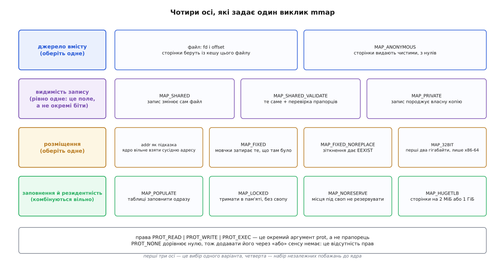
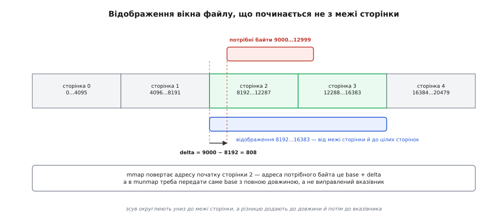

# 📋 Довідник відображень: підписи, прапорці, права й коди помилок

Тут зібрано точний контракт викликів, якими програма керує ділянками власного адресного простору: підписи, повний перелік прапорців із версіями ядра, поєднання, які ядро відхиляє одразу, кожен код помилки з його конкретною причиною і таблиці підказок `madvise`. Це довідка на ту мить, коли код уже пишеться і треба знати, що саме передати, чого не приймуть і що перевірити на поверненні.

## Підписи

```c
#define _GNU_SOURCE
#include <sys/mman.h>

/* створити ділянку й прибрати її */
void *mmap(void *addr, size_t length, int prot, int flags, int fd, off_t offset);
int   munmap(void *addr, size_t length);

/* змінити права вже наявної */
int   mprotect(void *addr, size_t length, int prot);
int   pkey_mprotect(void *addr, size_t length, int prot, int pkey);   /* Linux 4.9 */

/* пересунути або змінити розмір */
void *mremap(void *old_address, size_t old_size, size_t new_size, int flags,
             ... /* void *new_address — лише зі MREMAP_FIXED */);

/* винести зміни на пристрій і підказати ядру, як ділянкою користуватимуться */
int   msync(void *addr, size_t length, int flags);
int   madvise(void *addr, size_t length, int advice);

/* заборонити витіснення */
int   mlock(const void *addr, size_t length);
int   mlock2(const void *addr, size_t length, unsigned int flags);    /* Linux 4.4 */
int   munlock(const void *addr, size_t length);
int   mlockall(int flags);
int   munlockall(void);
```

Угод про невдачу тут дві, і плутають їх постійно:

| виклик | успіх | невдача |
|---|---|---|
| `mmap`, `mremap` | адреса ділянки | **`MAP_FAILED`**, тобто `(void *) -1` — **не** `NULL` |
| решта | `0` | `−1` |

Перевірка `if (p == NULL)` після `mmap` не спрацює ніколи: нуль тут не є ознакою невдачі, порівнювати треба саме з `MAP_FAILED`. `errno` ставлять усі виклики родини.

## Чотири осі одного виклику



*Аргумент `flags` виглядає однорідним «або», але насправді складається з полів різної природи: три вибори по одному варіанту й один набір незалежних побажань.*

Молодші чотири біти слова прапорців — не набір ознак, а **поле** з маскою `MAP_TYPE`, у якому лежить одне число:

```
MAP_SHARED           = 0x01
MAP_PRIVATE          = 0x02
MAP_SHARED_VALIDATE  = 0x03      ← Linux 4.15
MAP_TYPE             = 0x0f      маска цього поля
```

Звідси пастка, якої не видно очима. Вираз `MAP_SHARED | MAP_PRIVATE` — не «обидва» й не помилка компіляції, а число 3, тобто рівно `MAP_SHARED_VALIDATE`. На старому ядрі така описка чесно давала `EINVAL`; на ядрі 4.15 і новішому вона мовчки створює перевірене спільне відображення й нічим себе не виказує.

> 🔧 **Навіщо це.** Звичайний `MAP_SHARED` мовчки викидає прапорці, яких не знає. Програма, що просить `MAP_SYNC` заради гарантії довговічности запису, на старішому ядрі дістане звичайне відображення без жодної гарантії — і не дізнається про це, бо виклик успішний. `MAP_SHARED_VALIDATE` перевертає домовленість: невідомий прапорець дає `EOPNOTSUPP`, тобто чесне «я не вмію того, що ти просиш», замість мовчазної згоди на менше. Тому все нове, що додає до відображення обіцянку, доступне лише через цей тип.

## Права: аргумент prot

| значення | що дозволяє | примітка |
|---|---|---|
| `PROT_NONE` | нічого: будь-яке звертання дає `SIGSEGV` | дорівнює нулю, тож у виразі з «або» зникає безслідно |
| `PROT_READ` | читати | |
| `PROT_WRITE` | писати | на i386 тягне за собою й читання |
| `PROT_EXEC` | виконувати | |
| `PROT_SEM` (2.5.7) | атомарні операції над цією пам'яттю | на більшості архітектур не змінює нічого |
| `PROT_SAO` (2.6.26) | суворий порядок доступів | лише PowerPC, лише за апаратної підтримки |
| `PROT_GROWSDOWN`, `PROT_GROWSUP` (2.6.0) | поширити нові права до кінця ділянки, що росте | лише в `mprotect`; обидва разом — `EINVAL` |

Дві речі про права, яких із таблиці не вичитаєш.

**`PROT_NONE` — це не «прав немає», а робочий інструмент.** Ділянка з такими правами існує в списку, тримає діапазон адрес за собою й не дає нікому іншому туди відобразитися. Саме так роблять сторожові смуги між стеками потоків: сусідній стек не «перетече» в чужий, бо між ними лежить сторінка, звертання до якої гарантовано падає ([потоки в Linux](root:sys-unix/threads-as-tasks)).

**Права при створенні не є стелею.** `mprotect` може підняти їх пізніше — доти, доки це не суперечить джерелу. Для спільного відображення файлу, відкритого лише на читання, `mprotect(…, PROT_WRITE)` дає `EACCES`: дозвіл писати означав би дозвіл змінити файл. Для приватного відображення того самого файлу той самий виклик успішний, бо запис туди породить приватну копію й файлу не торкнеться ([копіювання при записі](root:sf-os/copy-on-write)).

## Прапорці mmap

Числа нижче — з узагальненого заголовка (`asm-generic/mman-common.h` і `asm-generic/mman.h`), яким користуються x86, ARM і більшість інших архітектур; alpha, MIPS, PA-RISC і xtensa частину прапорців нумерують по-своєму. Контракт — це ім'я сталої, а не число; числа наведено, щоб можна було читати чужі трасування ([трасування системних викликів](root:sys-unix/syscall-tracing)).

### Джерело й розміщення

| прапорець | значення | у ядрі з | що робить |
|---|---|---|---|
| `MAP_ANONYMOUS` | `0x20` | — | ділянка без файлу, сторінки видають зануленими; `fd` ігнорують (переносно передають `−1`), `offset` має бути нулем. Разом із `MAP_SHARED` працює з 2.4 |
| `MAP_FIXED` | `0x10` | POSIX.1-2001 | `addr` — вимога, а не підказка; усе, що вже лежить у цьому діапазоні, **мовчки прибирають** |
| `MAP_FIXED_NOREPLACE` | `0x100000` | 4.17 | те саме розміщення, але зіткнення з наявною ділянкою дає `EEXIST` замість затирання |
| `MAP_32BIT` | `0x40` | 2.4.20 | покласти в перші два гігабайти адресного простору; лише x86-64, ігнорується разом із `MAP_FIXED` |
| `MAP_GROWSDOWN` | `0x0100` | — | ділянка під стек: звертання до сторожової сторінки знизу подовжує її вниз |
| `MAP_STACK` | `0x020000` | 2.6.27 | «поклади там, де доречно для стека»; на всіх нинішніх архітектурах не робить нічого, але лишається обіцянкою на майбутнє |

### Заповнення й резидентність

| прапорець | значення | у ядрі з | що робить |
|---|---|---|---|
| `MAP_POPULATE` | `0x008000` | 2.5.46 | заповнити таблиці сторінок наперед; для файлу — запустити випереджальне читання. **Невдача заповнення не робить `mmap` невдалим** — сторінкові збої просто трапляться пізніше. Для приватних відображень працює з 2.6.23 |
| `MAP_NONBLOCK` | `0x010000` | 2.5.46 | лише разом із `MAP_POPULATE`: не читати наперед, а взяти те, що вже в пам'яті. З 2.6.23 фактично перетворює `MAP_POPULATE` на ніщо |
| `MAP_LOCKED` | `0x2000` | 2.5.37 | тримати сторінки в пам'яті, як `mlock`. Гарантія слабша: якщо заповнити не вдалося, `mmap` **не** повертає `ENOMEM`, тож важкі збої можливі згодом |
| `MAP_NORESERVE` | `0x4000` | — | не резервувати місця у свопі. Запис у сторінку, для якої фізичної пам'яті не знайшлося, дасть `SIGSEGV` замість очікування ([overcommit і OOM-killer](root:sys-unix/overcommit-and-oom)) |
| `MAP_HUGETLB` | `0x040000` | 2.6.32 | брати сторінки з пулу великих сторінок; зсув і довжину міряють великою сторінкою, а не звичайною ([великі сторінки](root:sys-unix/huge-pages-tlb-reach)) |
| `MAP_HUGE_2MB`, `MAP_HUGE_1GB` | `21 << 26`, `30 << 26` | 3.8 | вибрати конкретний розмір, коли система підтримує кілька: двійковий логарифм розміру пишуть у шість бітів зі зсувом `MAP_HUGE_SHIFT = 26` |
| `MAP_SYNC` | `0x080000` | 4.15 | запис у відображення потрапляє у файл незалежно від збою живлення. Лише зі `MAP_SHARED_VALIDATE` і лише на файлових системах із DAX — режимом, де сторінки лежать просто на енергонезалежній пам'яті, без проміжного кешу. У парі з простим `MAP_SHARED` **мовчки ігнорується**; на звичайній файловій системі — `EOPNOTSUPP` |
| `MAP_UNINITIALIZED` | `0x4000000` | 2.6.33 | не занулювати анонімні сторінки. Діє лише в ядрі, зібраному з `CONFIG_MMAP_ALLOW_UNINITIALIZED` — на звичайних системах вимкнено, бо це означало б віддавати програмі чужі дані |

### Прапорці, яких більше немає

| прапорець | стан |
|---|---|
| `MAP_DENYWRITE` | ігнорується. Історично забороняв іншим відкривати файл на запис — і виявився готовою зброєю для відмови в обслуговуванні |
| `MAP_EXECUTABLE` | ігнорується |
| `MAP_FILE` | нуль; лишився для сумісности зі старим кодом |
| `MAP_ANON` | синонім `MAP_ANONYMOUS` |

Про `ETXTBSY` варто сказати окремо, бо цю помилку часто приписують не тому механізмові. Відмова «текстовий файл зайнятий», яку дістає той, хто пробує переписати запущений виконуваний файл, приходить не від `mmap`, а від `execve`: саме він бере на файл заборону запису на весь час життя процесу ([exec: заміна образу](root:sys-unix/exec-semantics)). Рядок `ETXTBSY` у переліку помилок `mmap` лишився від `MAP_DENYWRITE` і сьогодні мертвий разом із ним.

## MAP_FIXED і його безпечний різновид

Без `MAP_FIXED` аргумент `addr` — лише побажання: ядро округлить його до межі сторінки й може віддати зовсім іншу адресу, не сказавши ні слова. З `MAP_FIXED` адреса стає вимогою, і тут починається небезпека: якщо в цьому діапазоні вже щось лежало, воно зникає без попередження. Затерти так можна власну купу, чужу бібліотеку або сторінку, яку саме зараз читає інший потік.

`MAP_FIXED_NOREPLACE` розв'язує це рівно й атомарно: зіткнення дає `EEXIST`, і з кількох потоків, що змагаються за той самий діапазон, успішним буде рівно один.

Пастка тут у сумісності, і вона підступніша за звичайну. Старе ядро не знає цього прапорця й тихо його викидає — а `MAP_FIXED_NOREPLACE` **не** містить у собі біта `MAP_FIXED`. Тому виклик перетворюється на звичайний, з підказкою: при зіткненні ядро не затре сусіда, а просто поверне іншу адресу. Тобто помилки не буде, але й обіцяного розміщення теж — і код, який на нього розраховував, піде далі з чужим вказівником. Звідси правило: після виклику з цим прапорцем адресу, яку повернули, порівнюють із тією, яку просили.

## Що ядро відхиляє одразу

| умова | помилка | чому саме так |
|---|---|---|
| у `flags` немає жодного з `MAP_SHARED`, `MAP_PRIVATE`, `MAP_SHARED_VALIDATE` | `EINVAL` | поле типу мусить мати значення; нуль значенням не є |
| `offset` не кратний розміру сторінки | `EINVAL` | менша одиниця в таблиці сторінок не виражається |
| `length` дорівнює нулю (з 2.6.12) | `EINVAL` | ділянка нульової довжини не має сенсу |
| `addr` не кратний сторінці разом із `MAP_FIXED` | `EINVAL` | вимога поставити початок ділянки не на межу сторінки нездійсненна |
| `MAP_SHARED` **і** `PROT_WRITE`, а `fd` відкритий не в `O_RDWR` | `EACCES` | запис у таку ділянку є записом у файл, тож дескриптор мусить дозволяти запис у файл |
| відображення файлу, а `fd` відкритий не на читання (`O_WRONLY`) | `EACCES` | перший же збій мусить **прочитати** сторінку з файлу — навіть щоб потім у неї писали |
| `MAP_SHARED` із `PROT_WRITE` на файлі, відкритому з `O_APPEND` | `EACCES` | режим дописування обіцяє, що запис завжди йде в кінець; спільне відображення такої обіцянки виконати не може (приватного це не стосується: воно у файл не пише) |
| `PROT_EXEC` на файлі з розділу, змонтованого з `noexec` | `EPERM` | заборона монтування сильніша за прохання ([монтування](root:sys-unix/mount-model)) |
| запис у файл, замкнений печаткою `F_SEAL_WRITE` | `EPERM` | печатка на те й ставиться, щоб її не можна було зняти |
| `MAP_HUGETLB` без `CAP_IPC_LOCK` і поза групою `sysctl_hugetlb_shm_group` | `EPERM` | великі сторінки беруть із заздалегідь зарезервованого пулу, тож доступ до нього обмежений ([можливості замість root](root:sys-unix/capabilities)) |
| `MAP_SYNC` на файловій системі без DAX | `EOPNOTSUPP` | гарантію нема на чому виконати |
| `MAP_FIXED_NOREPLACE` і діапазон зайнятий | `EEXIST` | у цьому й полягає різниця з `MAP_FIXED` |
| `fd` показує не на звичайний файл | `EACCES` або `ENODEV` | не кожен об'єкт має посторінкове джерело вмісту |

## Коди помилок mmap: повний перелік

| код | коли |
|---|---|
| `EACCES` | `fd` не звичайний файл; або файл відкритий не на читання; або `MAP_SHARED` із `PROT_WRITE` на дескрипторі не в режимі `O_RDWR`; або `MAP_SHARED` із `PROT_WRITE` на файлі, відкритому з `O_APPEND` |
| `EAGAIN` | на файл накладено замок; або перевищено дозволений обсяг заблокованої пам'яті |
| `EBADF` | `fd` не є чинним дескриптором, а `MAP_ANONYMOUS` не піднято ([файловий дескриптор](root:sys-unix/file-descriptor)) |
| `EEXIST` | `MAP_FIXED_NOREPLACE`, і діапазон перетинається з наявною ділянкою |
| `EINVAL` | не сподобалися `addr`, `length` чи `offset` (найчастіше — некратність сторінці); `length` дорівнює нулю; у `flags` немає жодного з трьох типів |
| `ENFILE` | вичерпано загальносистемну межу відкритих файлів |
| `ENODEV` | файлова система під цим файлом не вміє відображення |
| `ENOMEM` | пам'яті немає; або **перевищено дозволену кількість ділянок процесу**; або перевищено `RLIMIT_DATA` (з 4.7); або адреса виходить за межі адресного простору машини |
| `EOVERFLOW` | 32-бітна архітектура з 64-бітним `off_t`: сума сторінок `length` і `offset` не влазить в `unsigned long` |
| `EPERM` | `PROT_EXEC` на розділі з `noexec`; або файл замкнено печаткою; або `MAP_HUGETLB` без відповідних прав |
| `EOPNOTSUPP` | `MAP_SHARED_VALIDATE` і невідомий ядру прапорець; або `MAP_SYNC` не на DAX |
| `ETXTBSY` | мертвий рядок від `MAP_DENYWRITE`; сучасне ядро цієї помилки з `mmap` не повертає |

## Зсув, довжина, адреса



*Зсув округлюють униз до межі сторінки, різницю додають до довжини, а потім — до отриманого вказівника; у `munmap` повертають початкову адресу, а не виправлену.*

```
розмір сторінки   ps = sysconf(_SC_PAGE_SIZE)         зазвичай 4096
offset            мусить бути кратним ps              інакше EINVAL
length            ядро округлює вгору до цілих сторінок
addr без MAP_FIXED  ядро округлює вниз і має право не послухатися

вікно [off, off + len) → аргументи виклику:
  base_off = off − (off mod ps) = off & ~(ps − 1)
  delta    = off − base_off
  map_len  = len + delta

  off = 9000, len = 4000, ps = 4096
  base_off = 8192
  delta    = 808
  map_len  = 4808  →  ядро візьме дві сторінки, тобто 8192 байти
  потрібний байт лежить за адресою  base + delta
```

Зі `MAP_HUGETLB` мірка інша: зсув мусить бути кратним розміру **великої** сторінки, а довжину ядро вирівнює по ній само.

## munmap

Приймає адресу, кратну сторінці, і довжину, яку округлює вгору. Три властивості, через які найчастіше помиляються:

| властивість | наслідок |
|---|---|
| прибрати діапазон, у якому нічого не відображено, — **не помилка** | `munmap` на вже прибраній ділянці мовчки повертає нуль, тож подвійне звільнення тут не діагностується |
| прибрати можна середину ділянки | одна ділянка стає двома, і кількість записів у списку зростає, а не спадає |
| дескриптор і відображення не пов'язані | закриття `fd` нічого не прибирає, а `munmap` нічого не закриває |

Брудні сторінки спільного відображення при цьому не гинуть: вони лишаються в кеші й підуть у файл своєю чергою. Але **момент** запису на пристрій `munmap` не гарантує — гарантію дають лише `msync` чи `fsync` ([кеш сторінок, fsync і довговічність запису](root:sys-unix/page-cache-durability)).

Помилка одна: `EINVAL` — адреса не кратна сторінці, довжина нульова, або діапазон виходить за межі адресного простору.

## mprotect і pkey_mprotect

`prot` тут — **повний новий набір**, а не приріст: те, чого в ньому немає, буде відібрано. Діапазон може накрити частину ділянки або кілька ділянок одразу; ядро розріже їх так, щоб права збіглися з межами.

`pkey_mprotect` додає до цього ключ захисту пам'яті — апаратний номер (на x86-64 їх шістнадцять), записаний просто в запис таблиці сторінок. Права за ключем міняють записом у регістр, без системного виклику й без перебудови таблиць, тож заборонити доступ до цілого класу сторінок можна за одиниці наносекунд замість мікросекунд.

| код | коли |
|---|---|
| `EACCES` | запитаних прав дати не можна: наприклад, `PROT_WRITE` на спільному відображенні файлу, відкритого лише на читання |
| `EINVAL` | адреса не кратна сторінці; невідомі біти в `prot`; `PROT_GROWSUP` разом із `PROT_GROWSDOWN`; невиділений ключ у `pkey_mprotect` |
| `ENOMEM` | частина діапазону не відображена; або ядру забракло пам'яті на нові структури; або розрізання ділянок вийшло б за дозволену кількість |

## mremap

Єдиний спосіб змінити розмір ділянки, не втративши її вмісту. Дешевий, бо переносить не байти, а записи таблиці сторінок — саме на ньому тримається зростання буфера в алокаторах ([звідки алокатор бере пам'ять](root:sys-unix/allocator-and-kernel)).

| прапорець | у ядрі з | що робить |
|---|---|---|
| `MREMAP_MAYMOVE` | — | дозволяє ядру перенести ділянку на іншу віртуальну адресу, якщо на місці рости нема куди. Без нього єдиний варіант при браку місця — `ENOMEM` |
| `MREMAP_FIXED` | 2.3.31 | взяти адресу з п'ятого аргументу, прибравши все, що там лежало; вимагає `MREMAP_MAYMOVE` |
| `MREMAP_DONTUNMAP` | 5.7 | перенести сторінки на нове місце, **не** прибираючи стару ділянку: вона лишається з порожніми записами, і наступне звертання туди дає збій. Лише для приватних анонімних відображень, лише за незмінного розміру; вимагає `MREMAP_MAYMOVE` |

Окрема поведінка, про яку рідко знають: `old_size == 0` на спільному відображенні створює **ще одне** відображення тих самих сторінок, лишаючи старе жити.

| код | коли |
|---|---|
| `EAGAIN` | спроба розширити заблоковану ділянку понад `RLIMIT_MEMLOCK` |
| `EFAULT` | у діапазоні є невідображені адреси, або він накриває ділянки несумісних типів |
| `EINVAL` | адреса не кратна сторінці; невідомі прапорці; нульовий `new_size`; діапазони перетинаються; `MREMAP_DONTUNMAP` на не-приватній-анонімній ділянці або зі зміною розміру |
| `ENOMEM` | рости нема куди, а `MREMAP_MAYMOVE` не піднято; або пам'яті чи дозволених ділянок не вистачає |

## msync

Єдина гарантія довговічности для спільного відображення: запис у пам'ять сам собою лишає сторінку брудною в кеші, і момент її виносу на пристрій нічим не визначений.

| прапорець | що означає |
|---|---|
| `MS_SYNC` | почати запис і **дочекатися** завершення |
| `MS_ASYNC` | лише запланувати. На Linux із 2.6.19 не робить нічого: ядро й так стежить за брудними сторінками. Переносний код усе одно мусить передати `MS_SYNC` або `MS_ASYNC` |
| `MS_INVALIDATE` | скинути інші відображення цього файлу, щоб вони перечитали свіжий вміст |

Перші два взаємно виключні — разом вони дають `EINVAL`; третій за потреби додають до будь-якого з них.

| код | коли |
|---|---|
| `EBUSY` | `MS_INVALIDATE` на діапазоні, де є заблокована пам'ять |
| `EINVAL` | адреса не кратна сторінці; сторонні біти у `flags`; `MS_SYNC` і `MS_ASYNC` разом |
| `ENOMEM` | частина діапазону не відображена |

## madvise: підказки ядру

Підказка нічого не змінює в тому, **що** програма побачить; вона змінює лише те, коли й скільки роботи ядро зробить наперед. Виняток — три значення, які знищують дані; вони нижче окремо.

### Порядок доступу й випереджальне читання

| підказка | у ядрі з | що робить |
|---|---|---|
| `MADV_NORMAL` | — | типова поведінка |
| `MADV_SEQUENTIAL` | — | читатимуть підряд: читати наперед агресивніше, а пройдені сторінки звільняти раніше |
| `MADV_RANDOM` | — | читатимуть урозкид: читати наперед немає сенсу, беремо лише те, що просять |
| `MADV_WILLNEED` | — | ці сторінки скоро знадобляться: почати читати їх зараз, не чекаючи збою |

### Заповнення таблиць

| підказка | у ядрі з | що робить |
|---|---|---|
| `MADV_POPULATE_READ` | 5.14 | заповнити записи таблиці на читання, не роблячи звертань з програми |
| `MADV_POPULATE_WRITE` | 5.14 | те саме на запис: одразу розриває копіювання при записі |

Ці дві сильніші за `MAP_POPULATE` двома речами: працюють на вже наявній ділянці й **не ховають помилок** — брак пам'яті дає `ENOMEM`, а місце, читання якого дало б `SIGBUS`, дає `EFAULT`.

### Великі сторінки

| підказка | у ядрі з | що робить |
|---|---|---|
| `MADV_HUGEPAGE` | 2.6.38 | дозволити прозорі великі сторінки на цьому діапазоні. До 5.4 фоновий складач збирав їх лише з приватних анонімних сторінок; з 5.4 — і зі сторінок `tmpfs` та файлових, якщо файлова система це вміє (на звичайному приватному відображенні файлу воно здебільшого не вмикається) |
| `MADV_NOHUGEPAGE` | 2.6.38 | заборонити їх тут |
| `MADV_COLLAPSE` | 6.1 | зібрати велику сторінку **зараз і синхронно**, не чекаючи на фонового складача |

### Fork, дампи, злиття однакових сторінок

| підказка | у ядрі з | що робить |
|---|---|---|
| `MADV_DONTFORK` | 2.6.16 | не віддавати ці сторінки нащадкові після `fork`. Потрібне там, де по сторінках ходить контролер прямого доступу до пам'яті: копіювання при записі перенесло б сторінку в батька, а залізо писало б у стару ([DMA і відображення буферів](root:sys-unix/dma-and-buffers)) |
| `MADV_DOFORK` | 2.6.16 | скасувати попереднє |
| `MADV_WIPEONFORK` | 4.14 | нащадок дістає нулі замість вмісту — так криптографічний стан не переживає `fork` ([fork: розмноження процесу](root:sys-unix/fork-semantics)) |
| `MADV_KEEPONFORK` | 4.14 | скасувати попереднє |
| `MADV_DONTDUMP` | 3.4 | не класти ці сторінки в аварійний дамп ([аварійний дамп](root:sys-unix/core-dump)) |
| `MADV_DODUMP` | 3.4 | скасувати попереднє |
| `MADV_MERGEABLE` | 2.6.32 | дозволити ядру зливати однакові приватні анонімні сторінки в одну; потрібен `CONFIG_KSM` |
| `MADV_UNMERGEABLE` | 2.6.32 | розлити назад |

### Витіснення

| підказка | у ядрі з | що робить |
|---|---|---|
| `MADV_COLD` | 5.4 | позначити сторінки холодними — забиратимуть їх першими, але зараз не чіпають |
| `MADV_PAGEOUT` | 5.4 | забрати негайно: анонімні у своп, брудні файлові — на пристрій ([свопінг і витіснення](root:sys-unix/swap-and-reclaim)) |

### Апаратні збої (лише для випробувань)

`MADV_HWPOISON` (2.6.32) позначає сторінку зіпсованою, `MADV_SOFT_OFFLINE` (2.6.33) виводить її з обігу зі збереженням вмісту. Обидві потребують `CAP_SYS_ADMIN` і ядра з `CONFIG_MEMORY_FAILURE`; це інструмент перевірки, а не робочий режим.

### Сторожові смуги без окремих ділянок

`MADV_GUARD_INSTALL` і `MADV_GUARD_REMOVE` (6.13) роблять діапазон непрохідним: звертання дає `SIGSEGV`, але окрема ділянка при цьому не заводиться — а отже не витрачається запис зі списку, якого й так небагато. Межа версій тут свіжа: до 6.15 підказка діяла лише на приватних анонімних ділянках із правом запису, з 6.15 — і на файлових, зокрема на відображених лише для читання.

## DONTNEED, FREE і REMOVE: три різні «мені більше не треба»

Це найнебезпечніша частина `madvise`, бо два з трьох значень знищують дані, і роблять це по-різному залежно від виду ділянки.

**`MADV_DONTNEED`** прибирає записи таблиці сторінок і відпускає сторінки. Наступне звертання не падає — воно наново відповідає на питання «звідки взяти байти», і відповідь залежить від того, що записано в ділянці:

| вид ділянки | що станеться після `MADV_DONTNEED` |
|---|---|
| приватна анонімна | вміст знищено безповоротно; наступне читання дає нулі |
| приватна файлова | приватні копії викинуто; наступне читання знову показує **поточний вміст файлу** — тобто ваші зміни зникли |
| спільна файлова | дані не гинуть: брудні сторінки лишаються в кеші й підуть у файл; наступне звертання прочитає їх звідти |
| спільна анонімна, `tmpfs`, `shm` System V | те саме, що зі спільною файловою: вміст живе у файлі, з якого його й перечитають ([спільна пам'ять POSIX](root:sys-unix/posix-shared-memory)) |
| заблокована `mlock`, `MAP_HUGETLB` до 5.18, відображення заліза | `EINVAL` |

Отже правило коротке: на приватних ділянках `MADV_DONTNEED` — це знищення, на спільних — лише звільнення власного погляду.

**`MADV_FREE`** (4.5) працює тільки на приватних анонімних ділянках і відрізняється часом. Ядро не забирає сторінки одразу — воно лише позначає їх такими, що їх **дозволено** забрати під тиском на пам'ять. Запис у сторінку до того моменту скасовує дозвіл, і вміст лишається. Звідси дві незручні властивості. Читання після `MADV_FREE` віддасть або старий вміст, або нулі, і покластися не можна ні на що. Резидентний розмір процесу не спадає одразу, тож у моніторингу все виглядає так, ніби пам'ять не звільнили ([як міряти пам'ять процесу](root:sys-unix/memory-accounting)). Натомість платити за це не треба: сторінка лишається на місці, і повторне вживання цієї пам'яті не коштує ані збою, ані занулення. На системах без свопу до 4.12 сторінки звільнялися негайно.

**`MADV_REMOVE`** (2.6.16) — єдина з трьох, що чіпає сам файл: вона вибиває в ньому діру, як `fallocate` з `FALLOC_FL_PUNCH_HOLE` ([розріджені файли](root:sys-unix/sparse-files)). Потребує спільної ділянки з правом запису; спочатку працювала лише на `tmpfs`, з 3.5 — на будь-якій файловій системі, що вміє вибивати діри. Дані втрачають усі, хто цим файлом користується, а не тільки той, хто покликав.

| код | коли (найчастіше) |
|---|---|
| `EINVAL` | адреса не кратна сторінці; невідома підказка; підказка не для цього виду ділянки (`MADV_FREE` на файловій, `MADV_DONTNEED` на заблокованій, і так далі) |
| `ENOMEM` | у діапазоні є невідображені адреси; або заповнення не вдалося через брак пам'яті |
| `EIO` | `MADV_WILLNEED` вивів би процес за межу резидентного розміру |
| `EACCES` | `MADV_REMOVE` на ділянці, яка не є спільною й записуваною |
| `EPERM` | `MADV_HWPOISON` без `CAP_SYS_ADMIN` |
| `EFAULT` | `MADV_POPULATE_*` натрапило на місце, звертання до якого дало б `SIGBUS` |

## mlock: заборонити витіснення

| виклик і прапорець | у ядрі з | що робить |
|---|---|---|
| `mlock` | — | заблокувати діапазон: сторінки підвантажують негайно й не витісняють |
| `mlock2(…, 0)` | 4.4 | те саме |
| `mlock2(…, MLOCK_ONFAULT)` | 4.4 | заблокувати те, що вже в пам'яті, а решту — у міру появи; так резервують велику ділянку, не оплачуючи її наперед |
| `mlockall(MCL_CURRENT)` | — | усе, що відображено зараз |
| `mlockall(MCL_FUTURE)` | — | і все, що буде відображено далі |
| `mlockall(MCL_ONFAULT)` | 4.4 | модифікатор до двох попередніх; сам по собі — `EINVAL` |

Скільки дозволено, вирішує `RLIMIT_MEMLOCK`: з 2.6.9 непривілейований процес блокує в межах м'якого ліміту, а з `CAP_IPC_LOCK` межі немає ([ліміти ресурсів](root:sys-unix/resource-limits)). Помилки: `ENOMEM` — діапазон не відображений або перевищено ліміт; `EPERM` — бракує можливости; `EAGAIN` — заблокувати не вдалося; `EINVAL` — переповнення `addr + length` або невідомі прапорці.

## Скільки ділянок дозволено

Кожна ділянка — окремий запис у ядрі, і кількість їх обмежена:

```
/proc/sys/vm/max_map_count      типове значення 65530
перевищення                     mmap, mprotect, mremap, madvise → ENOMEM

скільки їх зараз:               wc -l < /proc/self/maps
```

Список росте не лише від `mmap`. Кожен виклик, що змінює права чи підказку **посеред** ділянки, ріже її на три частини замість однієї — і додає два записи. Те саме робить `munmap` середини. Тому програма, яка ставить `madvise` на кожен окремий буфер, упирається в межу задовго до того, як вичерпає пам'ять; зворотний рух — злиття сусідніх ділянок з однаковими властивостями — ядро робить само, але лише коли властивості справді збіглися.

## Мінімальний виклик, що працює

Найкоротший корисний зразок — вікно файлу з довільного зсуву, бо саме тут сходяться кратність сторінці, режим відкриття й правило про те, що віддавати в `munmap`.

```c
/* winmap.c — відобразити вікно файлу, що починається з довільного зсуву
 *   cc -O2 -Wall -o winmap winmap.c && ./winmap файл 9000 4000
 * Файл мусить бути щонайменше offset+length завдовжки: запис за кінець
 * файлу через відображення дає SIGBUS, а не подовжує файл.
 */
#define _GNU_SOURCE
#include <fcntl.h>
#include <stdio.h>
#include <stdlib.h>
#include <string.h>
#include <sys/mman.h>
#include <unistd.h>

struct window {
    void          *base;      /* що віддавати в munmap */
    size_t         map_len;   /* і з якою довжиною     */
    unsigned char *p;         /* а це вже потрібний байт */
};

static int window_open(struct window *w, const char *path, off_t off, size_t len)
{
    long   ps       = sysconf(_SC_PAGE_SIZE);
    off_t  base_off = off & ~((off_t)ps - 1);      /* униз до межі сторінки */
    size_t delta    = (size_t)(off - base_off);

    /* саме O_RDWR: MAP_SHARED разом із PROT_WRITE на O_RDONLY чи O_WRONLY
       дає EACCES — у першому випадку бракує права писати у файл,
       у другому ядру нізвідки взяти сторінку при першому збої */
    int fd = open(path, O_RDWR);
    if (fd < 0)
        return -1;

    w->map_len = len + delta;
    w->base    = mmap(NULL, w->map_len, PROT_READ | PROT_WRITE,
                      MAP_SHARED, fd, base_off);
    close(fd);                          /* ділянка тримає файл сама */
    if (w->base == MAP_FAILED)          /* саме MAP_FAILED, не NULL */
        return -1;

    w->p = (unsigned char *)w->base + delta;
    return 0;
}

int main(int argc, char **argv)
{
    if (argc != 4) {
        fprintf(stderr, "вжиток: %s файл зсув довжина\n", argv[0]);
        return 2;
    }
    off_t  off = strtoll(argv[2], NULL, 0);
    size_t len = strtoull(argv[3], NULL, 0);

    struct window w;
    if (window_open(&w, argv[1], off, len) < 0) { perror("window_open"); return 1; }

    memset(w.p, 'x', len);              /* звичайний запис у пам'ять */

    /* довговічність — окремим проханням, і саме від base */
    if (msync(w.base, w.map_len, MS_SYNC) < 0) perror("msync");
    if (munmap(w.base, w.map_len) < 0)         perror("munmap");
    return 0;
}
```

Три рядки цього коду варті окремої уваги: `base_off` округлює зсув униз (працює, бо розмір сторінки — степінь двійки), `w->p` виправляє вказівник на `delta`, а `munmap` дістає `w->base` — виправлений вказівник тут дав би `EINVAL`, бо він не кратний сторінці.

Другий зразок — переговори про гарантію, які показують, навіщо потрібен окремий тип відображення:

```c
int durable = 1;
void *p = mmap(NULL, len, PROT_READ | PROT_WRITE,
               MAP_SHARED_VALIDATE | MAP_SYNC, fd, 0);
if (p == MAP_FAILED && (errno == EOPNOTSUPP || errno == EINVAL)) {
    /* EOPNOTSUPP — файлова система без DAX або ядро не знає MAP_SYNC;
       EINVAL     — ядро старіше за 4.15: значення 3 у полі типу для нього
                    просто «і SHARED, і PRIVATE», тобто нісенітниця.       */
    p = mmap(NULL, len, PROT_READ | PROT_WRITE, MAP_SHARED, fd, 0);
    durable = 0;                    /* тепер довговічність — тільки через msync */
}
```

Просити те саме через звичайний `MAP_SHARED` було б гірше за відмову: виклик успішний, змінна `durable` лишилася б одиницею, а гарантії за нею не стояло б жодної.
