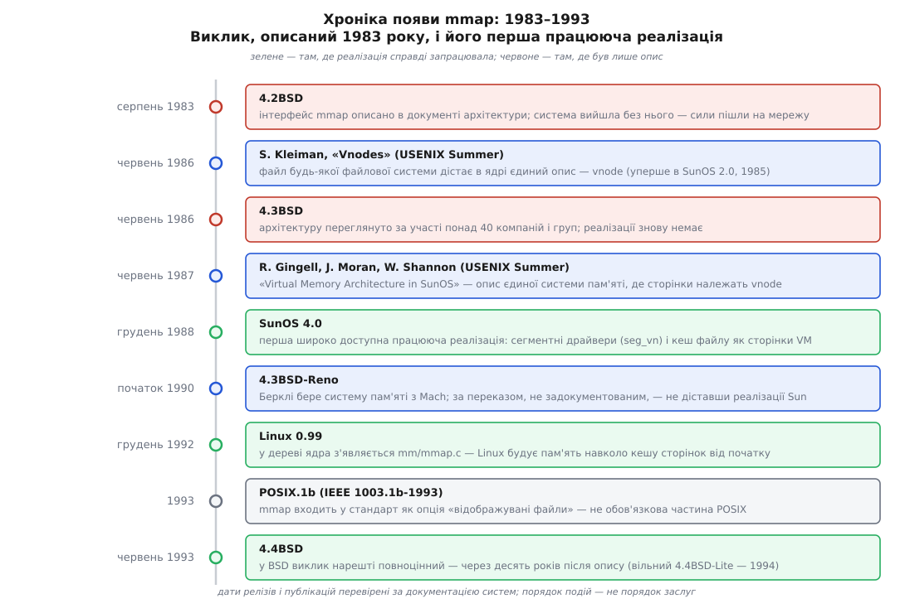
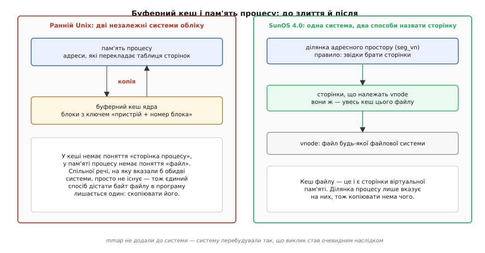

# 📜 Десять років між описом і реалізацією

Виклик `mmap` описали в документі архітектури 4.2BSD у серпні 1983 року, а працездатним у самій BSD він став аж у 4.4BSD, що вийшла в червні 1993-го; першою його широко доступною реалізацією стала система зовсім іншої компанії. Ця затримка варта розповіді, бо вона не про лінощі й не про брак рук: щоб дати програмі сторінку файлу без копії, недостатньо дописати ще один системний виклик — треба перебудувати те, як ядро взагалі тримає пам'ять.


*Опис інтерфейсу випередив першу працюючу реалізацію на п'ять років, а появу цієї реалізації в самій BSD — на десять.*

## Дві системи обліку, які нічим не перетиналися

Щоб зрозуміти, чому справа затяглася, треба глянути на ранній Unix зсередини й побачити там дві окремі, ніяк не поєднані машинерії.

Перша — буферний кеш. Коли ядро читало з диска, воно клало прочитане в буфери, які само й розподіляло. Ключем до буфера була пара «пристрій і номер блока»: не файл, не зсув у файлі, а фізичне місце на носії. Буфери жили в адресному просторі ядра й були ядерною власністю; програма не могла їх бачити навіть теоретично, бо в її таблиці сторінок не було й не могло бути запису, що вів би туди.

Друга — система пам'яті процесів. Вона знала про адресні простори, про свопінг, про те, як вивантажити образ процесу на диск і завантажити назад. Про файли вона не знала нічого: для неї «звідки взявся вміст сторінки» мало рівно дві відповіді — «зі свопу» або «нізвідки, тобто нулі».

Уся біда в тому, що ці дві системи не мали спільного поняття, на яке могли б обидві вказати. У буферному кеші не існувало поняття «сторінка процесу»; у пам'яті процесу не існувало поняття «файл». Отже, питання «чи можна віддати процесові ту саму сторінку, що вже лежить у кеші» навіть не мало як бути поставленим: не було речі, яку можна було б віддати. Копіювання з буфера в буфер програми було не неефективністю, яку забули прибрати, — воно було єдиним наявним містком між двома світами.


*Різниця не в наявності виклику, а в тому, чи існує в ядрі річ, на яку можуть указати і файлова система, і адресний простір.*

> 🔧 **Навіщо це.** Звідси видно, чому ця історія розтягнулася на десятиліття, тоді як інші виклики з'являлися за місяці. Додати виклик до наявного ядра — робота на тижні. Змінити відповідь на питання «що таке сторінка пам'яті й кому вона належить» — робота, після якої треба переписати файлові системи, свопінг, завантажувач програм і облік пам'яті. Тому реалізацію дала не та команда, яка першою придумала інтерфейс, а та, яка з іншої причини вже переробляла всю систему пам'яті.

## 4.2BSD: інтерфейс описали, систему випустили без нього

4.2BSD вийшла в серпні 1983 року. У документі архітектури Берклі — тому, що описував, якою системі належить бути, — підтримка великих розріджених адресних просторів, відображених файлів і спільної пам'яті стояла як **вимога**, і для неї було задано інтерфейс під іменем `mmap`.

Далі — те, що зазвичай губиться в переказі. Автори системи самі пояснили, чому реалізації не сталося. У «The Design and Implementation of the 4.4BSD Operating System» Кірк Мак-К'юзік (Kirk McKusick), Кіт Бостік (Keith Bostic), Майкл Карелс (Michael Karels) і Джон Квортерман (John Quarterman) пишуть про 4.2BSD прямо: систему випустили без інтерфейсу `mmap` **«через тиск зробити доступними інші можливості, як-от мережу»**. Тобто це був свідомий вибір пріоритету, зроблений у конкретних умовах: мережеву частину 4.2BSD чекала вся галузь, і саме вона визначила репутацію релізу.

Доказовий статус тут високий: це свідчення самих учасників у їхній власній книзі про систему, а не реконструкція. Причому свідчення нещадне до себе — воно фіксує розрив між заявленою вимогою й тим, що поїхало до користувачів.

## 4.3BSD: сорок компаній обговорили, реалізації знову немає

За три роки, у червні 1986-го, вийшла 4.3BSD. Інтерфейс за цей час не забули — навпаки, його переглянули, і, як свідчить та сама книга, в обговореннях переглянутої архітектури взяли участь понад сорок компаній і дослідницьких груп; результат ліг у «Berkeley Software Architecture Manual». Кілька компаній навіть реалізували переглянутий інтерфейс у себе. У самій 4.3BSD його знову не було — знову бракувало часу.

І тут книга називає справжню причину, глибшу за брак часу. Система віртуальної пам'яті BSD на той момент була майже десятирічною. Її проєктували, коли пам'ять була дефіцитом, а диски — дорогими, тож усі її рішення відповідали на протилежне за знаком питання. У ній сидів код, специфічний для VAX, який заважав переносити систему на інші машини. Багатопроцесорності вона не знала. Реалізувати `mmap` поверх такої системи означало прилаштувати вікно у файл до механізму, який про файли не знав нічого й не мав куди це знання покласти.

Тому Берклі зрештою вибрав не поліпшувати наявне, а замінити цілком. Але це рішення дозріло пізніше — і не в Берклі першими.

## Sun: не додали виклик, а перебудували пам'ять

Sun Microsystems ішла до того самого з іншого боку й з іншої потреби.

Перший крок зробили раніше й заради зовсім іншої мети — заради мережевої файлової системи. Щоб ядро могло однаково працювати з локальним файлом і з файлом на іншій машині, знадобився спільний опис файлу, незалежний від того, яка файлова система за ним стоїть. Такий опис назвали **vnode** (від *virtual node* — віртуальний вузол); Стів Клайман (Steve R. Kleiman) описав його в доповіді «Vnodes: An Architecture for Multiple File System Types in Sun UNIX» на літній конференції USENIX 1986 року (с. 238–247), а в системі механізм з'явився ще раніше, у SunOS 2.0 (1985). Саме звідси в Unix-системах узявся [спільний шар над файловими системами](root:sys-unix/vfs-layer) — рівень, який приймає операції в загальних поняттях і переадресовує їх конкретній файловій системі.

Другий крок — той, заради якого ця історія й розповідається. Роберт Джинджелл (R. Gingell), Джо Моран (J. Moran) і Вільям Шеннон (W. Shannon) описали нову архітектуру пам'яті SunOS у доповіді «Virtual Memory Architecture in SunOS» на літній конференції USENIX 1987 року. Її головна теза не «ми додали `mmap`», а значно радикальніша: **сторінка пам'яті належить не процесові, а джерелу вмісту**, і типове джерело — це vnode. Буферний кеш як окремий світ у такій системі просто зникає: сторінки, у яких лежить вміст файлу, і є сторінки віртуальної пам'яті, тільки поки що не приписані до жодного адресного простору.

Адресний простір процесу в цій архітектурі перестає бути «пам'яттю» й стає списком ділянок, кожна з яких обслуговується своїм **сегментним драйвером**. Ділянка, чиє джерело — файл, дістає драйвер `seg_vn`: він уміє на сторінковий збій піти до vnode й попросити потрібну сторінку. Ділянка анонімної пам'яті дістає той самий механізм із джерелом-заглушкою, що видає нулі. Різниця між «пам'яттю» і «відображеним файлом» зводиться до того, який драйвер стоїть на ділянці.

За такої будови `mmap` уже не треба реалізовувати як окрему здатність. Він стає тонким системним викликом, що додає ділянку з драйвером `seg_vn`, — усе решта система робила б і без нього. Це видно з побічного наслідку: у тій самій SunOS 4.0 з'явилося [динамічне лінкування](root:sys-unix/static-and-dynamic-linking), бо завантажувач бібліотек — це просто ще один споживач того самого механізму: відобразити шматки файлу бібліотеки в простір процесу з різними правами.

SunOS 4.0 вийшла в грудні 1988 року (за таблицями версій системи) і стала першою широко доступною реалізацією, у якій `mmap` справді працював.

Атрибуцію тут варто ставити акуратно. Доповідь USENIX 1987 року — документ із трьома авторами, а система за нею — робота колективу; «винахідника mmap» немає й не було, бо сам інтерфейс задумали в Берклі за кілька років до того, а Sun дала йому механізм, у якому він має сенс. Розділяти ці дві заслуги — не формальність: перша відповідає на питання «чого ми хочемо», друга — «як улаштувати систему, щоб це стало можливим».

## Відмова, Mach і обхідний шлях BSD

Далі в цій історії є епізод, у якому доказова база слабша за решту, тож про нього треба сказати з поміткою.

За поширеною версією подій, Берклі звернувся до Sun із проханням віддати реалізацію в загальний доступ і дістав відмову; тому 4.3BSD-Reno (початок 1990 року) поїхала з іншою системою пам'яті — узятою з проєкту **Mach** університету Карнеґі — Меллона. Про сам факт запозичення в Mach свідчать самі учасники: Мак-К'юзік у «Twenty Years of Berkeley Unix» пише, що система пам'яті, чий інтерфейс уперше описали в документі архітектури 4.2BSD, нарешті втілилася саме в Reno, з кодом Mach; там-таки названо, хто це зробив — Майк Гіблер (Mike Hibler) з Університету Юти, який поєднав ядро технології Mach із заявленим у 4.2BSD інтерфейсом. Книга про 4.4BSD уточнює, що основа — Mach 2.0 з доробками з Mach 2.5 і 3.0. А от **відмова Sun** фігурує в довідкових джерелах (зокрема в англійській Вікіпедії про `mmap`), проте прямого підтвердження словами учасників я не знайшов — тож це слід вважати переказом, який добре узгоджується з подіями, а не задокументованим фактом.

Дивує в цьому епізоді інше. Sun таки віддала свою систему пам'яті — тільки не Берклі, а AT&T: наприкінці 1980-х Sun і AT&T разом робили System V Release 4, і саме туди пішли vnode й нова віртуальна пам'ять. Тому довідник Linux донині перелічує серед джерел `mmap` і SVr4, і 4.4BSD — два різні шляхи з однієї архітектури. Обидві гілки [родоводу Unix](root:sys-unix/unix-lineage) дістали той самий механізм, але одна з рук авторів, а друга — обхідним шляхом через Mach.

У самій BSD виклик став повноцінним у 4.4BSD — тій, що вийшла в червні 1993 року під ліцензією AT&T; вільно поширюваний 4.4BSD-Lite поїхав ще роком пізніше. Довідник FreeBSD досі підсумовує це одним рядком: `mmap` уперше задокументовано в 4.2BSD, а реалізовано в 4.4BSD. Десять років між двома половинами речення.

## Як виклик потрапив у стандарт

У [POSIX](root:sys-unix/posix-standard) — стандарті, що фіксує спільний інтерфейс Unix-систем, — `mmap` з'явився не в основній частині, а через розширення реального часу: IEEE Std 1003.1b-1993, той самий документ, що приніс таймери, семафори й спільну пам'ять. У редакцію самого POSIX.1 він увійшов 1996 року.

Причому ввійшов **як опція**. Стандарт не вимагав від системи вміти відображати файли — він вимагав чесно про це сказати. Тому в POSIX і досі є ознака, якою програма може спитати систему, чи взагалі можна розраховувати на відображення:

```c
#include <unistd.h>

#if !defined(_POSIX_MAPPED_FILES) || _POSIX_MAPPED_FILES < 1
#  error "система відповідає POSIX, але відображувати файли не вміє"
#endif
```

Ця дрібниця — точний зліпок стану справ початку 1990-х. Стандарт писали тоді, коли одні системи вже мали єдину віртуальну пам'ять, а інші ще ні, і зобов'язати других означало б оголосити їх невідповідними. Сьогодні опція виконана скрізь, а ознака лишилася — як позначка на камені, де колись проходила межа.

## Linux, який почав з іншого кінця

Linux не успадкував розкол, бо почав будуватися пізніше й одразу з іншими припущеннями. У дереві ядра файл `mm/mmap.c` з'являється у версії 0.99 (грудень 1992-го) — це найраніша версія, у якій його показують покажчики вихідних текстів ядра, тож датування слід читати саме так: «не пізніше 0.99», а не «саме тоді написали».

Але й Linux пройшов свою частину тієї самої дороги, і про це варто сказати без прикрас. Довгий час у ньому теж співіснували два кеші: старий буферний, успадкований за традицією, і [кеш сторінок](root:sys-unix/page-cache-durability), у якому ядро тримає вміст файлів посторінково. Остаточно центром усього кеш сторінок став лише в ядрі 2.4 (2001), коли буферний кеш звели до опису буферів **усередині** сторінок замість окремого сховища. Тобто твердження «файл і пам'ять — це одне» коштувало Linux майже десять років розробки, попри те що починав він з чистого аркуша.

Спокуслива мораль цієї історії — «Берклі забарився, Sun устигла». Точніша інша. Механізм, який дозволяє програмі назвати сторінку файлу власною адресою, — це не функція, яку хтось нарешті написав, а твердження про будову ядра: що [адресний простір](root:sf-os/virtual-address-space) складається з ділянок, а в ділянки є джерело вмісту. Систему, у якій це твердження хибне, не полагодити ще одним викликом — її треба перебудувати. Саме тому інтерфейс змогли описати за один реліз, а дочекатися його довелося десять років.
