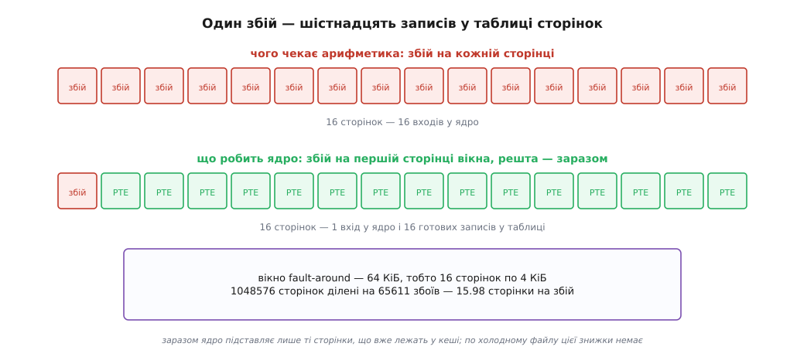
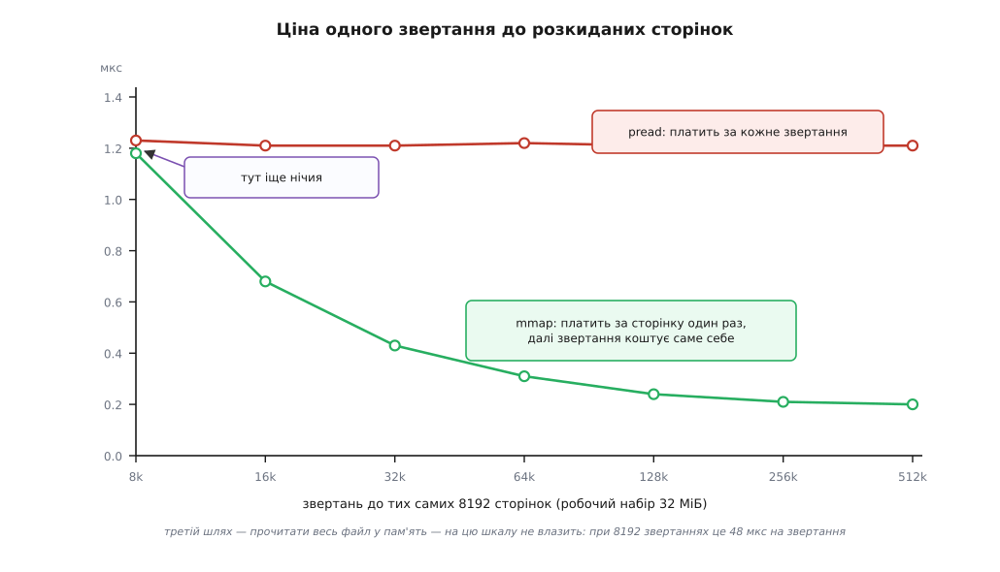

# ⚙️ read проти mmap: де проходить межа вигоди

Ця програма на C проходить по тому самому файлу трьома шляхами — `read()` у буфер, `mmap` наскрізь і `mmap` урозкид — і поруч із часом друкує лічильники сторінкових збоїв, без яких час нічого не пояснює, а лише дає привід для суперечки. Найпоширеніша арифметика навколо `mmap` промахується тут у шістнадцять разів, і причина промаху цікавіша за самі числа.

Усе нижче — Linux: `MAP_POPULATE` і `MADV_POPULATE_READ` є тільки там, а `posix_fadvise` хоч і стандартний, викидає сторінки з кешу за `POSIX_FADV_DONTNEED` саме в Linux. Сам вимір — `clock_gettime` і `getrusage` — POSIX і працює будь-де. Числа знято на x86-64, вісім ядер, 16 ГіБ пам'яті, NVMe, ядро 6.8, сторінка 4 КіБ. Піддослідний файл — чотири гігабайти, тобто 1 048 576 сторінок:

```
$ dd if=/dev/urandom of=data.bin bs=1M count=4096
```

## Чесність порівняння важить більше за сам вимір

Найлегше зміряти дурницю. Класична помилка виглядає так: `read()` читає весь файл у буфер, а `mmap` «читається» дотиком до одного байта в кожній сторінці — і `mmap` перемагає в рази. Перемагає, звісно: перший варіант переніс чотири гігабайти, другий подивився на мільйон байтів.

Тому обидва шляхи в цій програмі роблять з даними **однакову роботу**: підсумовують усі байти файлу восьмибайтовими словами. Різниця між шляхами лишається рівно одна — як байти опиняються там, де їх читає цикл підсумовування. Через `read()` їх приносить ядро в буфер програми; через `mmap` ядро дає до них адресу, і цикл читає їх на місці, у [кеші сторінок](topic:sys-unix/page-cache-durability).

Тепер можна записати, чого чекаємо, — до того, як побачити результат, інакше буде спокуса пояснити заднім числом будь-яке число.

**Перше.** На теплому кеші й послідовному проході жоден шлях не виграє в рази. `read()` платить копіюванням чотирьох гігабайтів; `mmap` платить [сторінковими збоями](topic:sf-os/page-fault). Обидві статті — одного порядку, тож різниця має вийти в межах десятків відсотків.

**Друге.** Кількість збоїв **не** дорівнюватиме кількості сторінок. Тут передбачення сміливе: частка «сторінок на збій» буде круглим числом, і саме воно розкаже про механізм.

**Третє.** На розрідженому доступі перевага `mmap` росте з кожним повторним візитом у ту саму сторінку, бо збій за сторінку платять один раз, а системний виклик — щоразу. Отже, десь має бути точка нічиєї, і лежить вона близько до «один візит на сторінку».

## Програма

Один файл, ніяких прав, ніяких залежностей. Збірка: `cc -O2 -Wall -Wextra -o mmapbench mmapbench.c`.

```c
/* mmapbench.c — той самий файл трьома шляхами. Разом із часом друкує
   сторінкові збої, бо саме вони пояснюють час.

   Вжиток: ./mmapbench [ключі] <режим> [файл]                            */

#define _GNU_SOURCE
#include <errno.h>
#include <fcntl.h>
#include <setjmp.h>
#include <signal.h>
#include <stddef.h>
#include <stdint.h>
#include <stdio.h>
#include <stdlib.h>
#include <string.h>
#include <sys/mman.h>
#include <sys/resource.h>
#include <sys/stat.h>
#include <time.h>
#include <unistd.h>

#ifndef MADV_POPULATE_READ
#define MADV_POPULATE_READ 22        /* Linux 5.14; хай збереться й на старих заголовках */
#endif

static size_t PAGE;
static volatile uint64_t sink;       /* щоб оптимізатор не викинув усе читання */

/* ── Вимір: час і лічильники збоїв беремо однією парою «до/після» ─────────── */

struct probe { struct timespec t; long minflt, majflt; };

static void probe_take(struct probe *p)
{
    struct rusage r;

    clock_gettime(CLOCK_MONOTONIC, &p->t);   /* годинник першим: getrusage коштує
                                                кількасот наносекунд, і хай вони
                                                краще лягають усередину проміжку */
    getrusage(RUSAGE_SELF, &r);
    p->minflt = r.ru_minflt;
    p->majflt = r.ru_majflt;
}

static double ms_between(struct timespec a, struct timespec b)
{
    /* Віднімаємо ЦІЛІ поля: tv_sec монотонного годинника — це мільйони секунд
       від старту системи, і наносекунди в такому double просто потонули б. */
    return (double)(b.tv_sec - a.tv_sec) * 1e3
         + (double)(b.tv_nsec - a.tv_nsec) / 1e6;
}

static void head(void)
{
    printf("  %-24s %9s %11s %11s\n", "етап", "мс", "minflt", "majflt");
}

static void row(const char *what, const struct probe *a, const struct probe *b)
{
    printf("  %-24s %9.1f %11ld %11ld\n", what, ms_between(a->t, b->t),
           b->minflt - a->minflt, b->majflt - a->majflt);
}

/* Сума 64-бітними словами. memcpy тут не копіювання, а спосіб прочитати слово
   без порушення правил доступу до пам'яті: з -O2 з нього виходить рівно одна
   інструкція завантаження. */
static uint64_t sum_words(const unsigned char *p, size_t n)
{
    uint64_t s = 0, w;
    size_t i = 0;

    for (; i + sizeof w <= n; i += sizeof w) {
        memcpy(&w, p + i, sizeof w);
        s += w;
    }
    for (; i < n; i++)
        s += p[i];
    return s;
}

/* ── Набір сторінок для розрідженого режиму ───────────────────────────────── */

/* xorshift64* — щоб набір сторінок і порядок звертань були ТІ САМІ в кожному
   режимі: інакше порівнюємо не шляхи до байта, а два різні маршрути. */
static uint64_t rng = 20260803;

static uint64_t rnd(void)
{
    rng ^= rng >> 12;
    rng ^= rng << 25;
    rng ^= rng >> 27;
    return rng * 2685821657736338717ULL;
}

/* nsample РІЗНИХ сторінок, рівномірно розкиданих по файлу, у випадковому порядку. */
static size_t *make_sample(size_t npages, size_t nsample)
{
    size_t *s = malloc(nsample * sizeof *s), stride = npages / nsample, i;

    if (!s || stride == 0) {
        fprintf(stderr, "замалий файл для набору в %zu сторінок\n", nsample);
        exit(1);
    }
    for (i = 0; i < nsample; i++)
        s[i] = i * stride + rnd() % stride;
    for (i = nsample - 1; i > 0; i--) {          /* тасування Фішера—Йетса */
        size_t j = rnd() % (i + 1), t = s[i];
        s[i] = s[j];
        s[j] = t;
    }
    return s;
}

/* Викинути сторінки ЦЬОГО файлу з кешу: чесніше й безпечніше за drop_caches —
   не чіпає решту системи й не потребує прав. На сторінки, які хтось тримає
   відображеними, не подіє, тож кличемо ДО mmap. */
static void chill(int fd)
{
    int rc = posix_fadvise(fd, 0, 0, POSIX_FADV_DONTNEED);

    if (rc)
        fprintf(stderr, "увага: fadvise(DONTNEED) → %s\n", strerror(rc));
}

/* ── Режим 1: read() наскрізь ─────────────────────────────────────────────── */

static void seq_read(int fd, size_t size, size_t bufsz, int cold)
{
    unsigned char *buf = malloc(bufsz);
    struct probe a, b;
    uint64_t s = 0;

    if (!buf) { perror("malloc"); exit(1); }
    memset(buf, 0, bufsz);              /* прогрів буфера: його власні збої — не наша тема */
    if (cold)
        chill(fd);
    if (lseek(fd, 0, SEEK_SET) < 0) { perror("lseek"); exit(1); }

    head();
    probe_take(&a);
    for (;;) {
        ssize_t n = read(fd, buf, bufsz);
        if (n < 0) {
            if (errno == EINTR) continue;   /* сигнал міг урвати виклик */
            perror("read");
            exit(1);
        }
        if (n == 0)
            break;
        s += sum_words(buf, (size_t)n);
    }
    probe_take(&b);
    sink = s;

    row("read + сума", &a, &b);
    printf("  %-24s %9.1f МБ/с\n", "пропускна здатність",
           (double)size / 1e6 / (ms_between(a.t, b.t) / 1e3));
    free(buf);
}

/* ── Режим 2: mmap наскрізь ───────────────────────────────────────────────── */

static void seq_mmap(int fd, size_t size, int populate, int advice, int cold)
{
    struct probe a, b, c, d;
    unsigned char *p;
    long faults;

    if (cold)
        chill(fd);

    head();
    probe_take(&a);
    p = mmap(NULL, size, PROT_READ,
             MAP_PRIVATE | (populate ? MAP_POPULATE : 0), fd, 0);
    if (p == MAP_FAILED) { perror("mmap"); exit(1); }
    if (advice && madvise(p, size, advice))
        fprintf(stderr, "увага: madvise → %s\n", strerror(errno));
    probe_take(&b);

    sink = sum_words(p, size);
    probe_take(&c);

    if (munmap(p, size))
        perror("munmap");
    probe_take(&d);

    row("mmap + підготовка", &a, &b);
    row("прохід і сума", &b, &c);
    row("munmap", &c, &d);
    printf("  %-24s %9.1f\n", "разом", ms_between(a.t, d.t));

    faults = (c.minflt - a.minflt) + (c.majflt - a.majflt);
    if (faults > 0)
        printf("  %-24s %9.2f\n", "сторінок на один збій",
               (double)(size / PAGE) / (double)faults);
}

/* ── Режим 3: розріджений доступ, той самий набір сторінок двома шляхами ───── */

static void rand_mode(int fd, size_t size, int use_mmap, size_t nsample,
                      size_t naccess, size_t rbytes, int cold)
{
    size_t *sample = make_sample(size / PAGE, nsample), k;
    unsigned char *buf = NULL, *p = NULL;
    struct probe a, b, c, d, acc0, acc1;
    uint64_t s = 0, w;

    if (rbytes > PAGE)
        rbytes = PAGE;
    if (cold)
        chill(fd);
    head();

    if (use_mmap) {
        probe_take(&a);
        p = mmap(NULL, size, PROT_READ, MAP_PRIVATE, fd, 0);
        if (p == MAP_FAILED) { perror("mmap"); exit(1); }
        probe_take(&b);
        for (k = 0; k < naccess; k++) {
            memcpy(&w, p + sample[rnd() % nsample] * PAGE + 64, sizeof w);
            s += w;
        }
        probe_take(&c);
        if (munmap(p, size))
            perror("munmap");
        probe_take(&d);
        row("mmap", &a, &b);
        row("звертання", &b, &c);
        row("munmap", &c, &d);
        acc0 = b; acc1 = c;
    } else {
        buf = malloc(PAGE);
        if (!buf) { perror("malloc"); exit(1); }
        memset(buf, 0, PAGE);
        probe_take(&a);
        for (k = 0; k < naccess; k++) {
            off_t off = (off_t)sample[rnd() % nsample] * (off_t)PAGE + 64;
            if (pread(fd, buf, rbytes, off) < (ssize_t)sizeof w) {
                perror("pread");
                exit(1);
            }
            memcpy(&w, buf, sizeof w);
            s += w;
        }
        probe_take(&b);
        row("pread", &a, &b);
        acc0 = a; acc1 = b;
    }
    sink = s;
    printf("  %-24s %9.3f мкс\n", "на одне звертання",
           ms_between(acc0.t, acc1.t) * 1e3 / (double)naccess);
    free(buf);
    free(sample);
}

/* ── Режим 4: файл обрізали під ногами ────────────────────────────────────── */

static sigjmp_buf bus_jump;
static void *volatile bus_addr;

static void on_sigbus(int sig, siginfo_t *si, void *uc)
{
    (void)sig; (void)uc;
    bus_addr = si->si_addr;        /* адреса, на якій усе спинилося */
    siglongjmp(bus_jump, 1);       /* повертатися в перервану інструкцію нікуди */
}

static void sigbus_demo(void)
{
    struct sigaction sa;
    volatile unsigned char *v;     /* volatile: інакше компілятор ПЕРЕВИКОРИСТАЄ
                                      значення, прочитане перед обрізанням,
                                      і другого звертання просто не буде */
    unsigned char *p;
    int fd = open("./mmapbench.tmp", O_RDWR | O_CREAT | O_TRUNC, 0600);

    if (fd < 0) { perror("open"); exit(1); }
    unlink("./mmapbench.tmp");                   /* ім'я вже не потрібне, inode живий */
    if (ftruncate(fd, (off_t)PAGE * 4)) { perror("ftruncate"); exit(1); }

    p = mmap(NULL, PAGE * 4, PROT_READ, MAP_PRIVATE, fd, 0);
    if (p == MAP_FAILED) { perror("mmap"); exit(1); }
    v = p;

    memset(&sa, 0, sizeof sa);
    sa.sa_sigaction = on_sigbus;
    sa.sa_flags = SA_SIGINFO;                    /* без цього не буде si_addr */
    sigemptyset(&sa.sa_mask);
    if (sigaction(SIGBUS, &sa, NULL)) { perror("sigaction"); exit(1); }

    printf("  файл на 4 сторінки, відображення на 4 сторінки\n");
    printf("  сторінка 3, байт 0 = %u\n", (unsigned)v[PAGE * 3]);

    if (ftruncate(fd, (off_t)PAGE)) { perror("ftruncate"); exit(1); }
    printf("  файл обрізано до 1 сторінки; відображення лишилось на 4\n");

    if (sigsetjmp(bus_jump, 1) == 0) {           /* 1 — відновити й маску сигналів */
        printf("  сторінка 3, байт 0 = %u\n", (unsigned)v[PAGE * 3]);
        printf("  збою не сталося — несподівано\n");
    } else {
        printf("  SIGBUS на адресі %p — сторінка %ld відображення\n",
               (void *)bus_addr,
               (long)(((unsigned char *)bus_addr - p) / (ptrdiff_t)PAGE));
    }

    munmap(p, PAGE * 4);
    close(fd);
}

/* ── Розбір рядка запуску ─────────────────────────────────────────────────── */

static void usage(void)
{
    fprintf(stderr,
        "вжиток: mmapbench [ключі] <режим> [файл]\n"
        "режими: seq-read | seq-mmap | rand-pread | rand-mmap | sigbus\n"
        "  -n N  сторінок у розрідженому наборі  (типово 8192)\n"
        "  -k N  скільки зробити звертань        (типово 131072)\n"
        "  -b N  буфер read(), КіБ               (типово 1024)\n"
        "  -B N  байтів на одне pread()          (типово 8)\n"
        "  -s N  зерно генератора\n"
        "  -p    MAP_POPULATE\n"
        "  -w    madvise(MADV_WILLNEED)\n"
        "  -P    madvise(MADV_POPULATE_READ)     (Linux 5.14+)\n"
        "  -c    викинути сторінки файлу з кешу перед виміром\n");
    exit(2);
}

int main(int argc, char **argv)
{
    size_t nsample = 8192, naccess = 131072, bufkib = 1024, rbytes = 8;
    int populate = 0, advice = 0, cold = 0, opt;
    const char *mode, *path;
    struct stat st;
    int fd;

    PAGE = (size_t)sysconf(_SC_PAGESIZE);

    while ((opt = getopt(argc, argv, "n:k:b:B:s:pwPc")) != -1)
        switch (opt) {
        case 'n': nsample = strtoul(optarg, NULL, 10); break;
        case 'k': naccess = strtoul(optarg, NULL, 10); break;
        case 'b': bufkib  = strtoul(optarg, NULL, 10); break;
        case 'B': rbytes  = strtoul(optarg, NULL, 10); break;
        case 's': rng     = strtoull(optarg, NULL, 10); break;
        case 'p': populate = 1; break;
        case 'w': advice = MADV_WILLNEED; break;
        case 'P': advice = MADV_POPULATE_READ; break;
        case 'c': cold = 1; break;
        default: usage();
        }
    if (rng == 0) rng = 1;                       /* нуль зупинив би xorshift */
    if (rbytes < sizeof(uint64_t)) rbytes = sizeof(uint64_t);
    if (optind >= argc) usage();
    mode = argv[optind++];

    if (!strcmp(mode, "sigbus")) { sigbus_demo(); return 0; }

    if (optind >= argc) usage();
    path = argv[optind];
    fd = open(path, O_RDONLY);
    if (fd < 0) { perror(path); return 1; }
    if (fstat(fd, &st) || !S_ISREG(st.st_mode) || st.st_size <= 0) {
        fprintf(stderr, "%s: потрібен звичайний непорожній файл\n", path);
        return 1;
    }
    printf("файл %s: %.2f ГіБ, сторінок %zu по %zu Б\n", path,
           (double)st.st_size / (1024.0 * 1024 * 1024),
           (size_t)st.st_size / PAGE, PAGE);

    if (!strcmp(mode, "seq-read"))
        seq_read(fd, (size_t)st.st_size, bufkib << 10, cold);
    else if (!strcmp(mode, "seq-mmap"))
        seq_mmap(fd, (size_t)st.st_size, populate, advice, cold);
    else if (!strcmp(mode, "rand-pread"))
        rand_mode(fd, (size_t)st.st_size, 0, nsample, naccess, rbytes, cold);
    else if (!strcmp(mode, "rand-mmap"))
        rand_mode(fd, (size_t)st.st_size, 1, nsample, naccess, rbytes, cold);
    else
        usage();

    close(fd);
    return 0;
}
```

## Прогін перший: наскрізь по теплому кешу

Перед виміром файл треба затягнути в кеш — просто прогнати `seq-read` один раз і викинути результат. Далі:

```
$ ./mmapbench seq-read data.bin
файл data.bin: 4.00 ГіБ, сторінок 1048576 по 4096 Б
  етап                            мс      minflt      majflt
  read + сума                  397.2          14           0
  пропускна здатність        10812.3 МБ/с

$ ./mmapbench seq-mmap data.bin
файл data.bin: 4.00 ГіБ, сторінок 1048576 по 4096 Б
  етап                            мс      minflt      majflt
  mmap + підготовка              0.0           2           0
  прохід і сума                368.5       65611           0
  munmap                        41.3           0           0
  разом                        409.8
  сторінок на один збій        15.98
```

Передбачення справдилося аж занадто добре: прохід через відображення на 7% швидший, разом із `munmap` — на 3% повільніший. Тобто вся різниця між двома шляхами до чотирьох гігабайтів менша за ціну прибирання за собою.

Розберімо, куди пішов час у кожному.

```
файл 4 ГіБ; сторінок 1048576; сума йде восьмибайтовими словами

read():  ядро читає 4 ГіБ із кешу й пише в буфер на 1 МіБ
         вузьке місце — читання з DRAM      ≈ 4 ГіБ / 14 ГБ/с   ≈ 307 мс
         цикл суми читає буфер, а він у L2   ≈ 4 ГіБ / 45 ГБ/с   ≈  95 мс
         системних викликів 4096             ≈ 4096 · 0.5 мкс    ≈   2 мс
         разом                                                   ≈ 404 мс

mmap:    цикл суми читає 4 ГіБ прямо з DRAM ≈ 4 ГіБ / 14 ГБ/с   ≈ 307 мс
         збоїв 65611                        ≈ 65611 · 0.9 мкс    ≈  59 мс
         разом                                                   ≈ 366 мс
```

Ось де ховається справжня відповідь на питання «чи допомагає відсутність копії». Копія є, і вона коштує повного проходу по DRAM. Але **другий** прохід — той, що робить сама програма, — у випадку `read()` іде вже по маленькому буферу, який сидить у кеші процесора, а у випадку `mmap` — по чотирьох гігабайтах у DRAM. Виграш від скасованої копії програма майже цілком віддає назад, бо тепер сама ходить по повільній пам'яті. Уся вигода зводиться до різниці між двома проходами, а вона мала.

> 🔧 **Навіщо це.** Звідси випливає практичне правило, зворотне до звичного гасла. Якщо програма справді споживає весь файл підряд і робить із кожним байтом щось нетривіальне, шлях до байта не має значення взагалі: він губиться в роботі. Якщо ж вона нічого з байтами не робить, а лише пересилає їх далі, то виграє не `mmap`, а виклики, що взагалі не заводять дані в простір користувача ([передача без копіювання](topic:sys-unix/zero-copy)).

## Шістнадцять сторінок на один збій

Тепер про число, заради якого програма друкує частку. Сторінок у файлі — 1 048 576, збоїв — 65 611. Ділення дає 15.98.

Наївна арифметика передбачала мільйон збоїв: сторінок мільйон, у таблиці порожньо, отже, мільйон зупинок. Її промах — рівно в шістнадцять разів, і це не похибка виміру, а окремий механізм із власним ім'ям.

Заходячи в обробник збою по файловій ділянці, ядро дивиться не тільки на сторінку, якої попросили. Воно бере вікно навколо неї й підставляє в таблицю **всі** сторінки цього вікна, які вже лежать у кеші. Одна зупинка — шістнадцять готових записів. Механізм зветься fault-around, з'явився в Linux 3.15 (внесок Кирила Шутемова — Kirill A. Shutemov, коміт `8c6e50b0290c`), а розмір вікна — 64 КіБ, тобто рівно шістнадцять сторінок по чотири кілобайти.



*Ділення числа сторінок на число збоїв — найдешевший спосіб побачити цей механізм ззовні. Знижка працює лише на тому, що вже є в кеші: підставити в таблицю сторінку, якої в пам'яті немає, ядро не може, не піднявши її з диска.*

Звідси й береться помилка в звичних оцінках `mmap`. Кожен, хто рахував «мільйон збоїв по мікросекунді — це секунда», множив на шістнадцять зайвого. Справжня стаття витрат — 59 мс на чотири гігабайти, і саме тому послідовний прохід через відображення виявляється нарівні з `read()`, а не втричі гіршим.

## Прогін другий: врозкид — і точка нічиєї

Тепер розріджений доступ, тобто те, заради чого відображення взагалі беруть. Набір — 8192 сторінок (32 МіБ) на весь чотиригігабайтний файл, порядок звертань випадковий, з кожної сторінки програма читає вісім байтів. Той самий набір і той самий порядок обома шляхами: генератор детермінований.

```
$ ./mmapbench -n 8192 -k 131072 rand-pread data.bin
  етап                            мс      minflt      majflt
  pread                        158.6          21           0
  на одне звертання             1.210 мкс

$ ./mmapbench -n 8192 -k 131072 rand-mmap data.bin
  етап                            мс      minflt      majflt
  mmap                           0.0           2           0
  звертання                     31.8        8215           0
  munmap                         0.4           0           0
  на одне звертання             0.243 мкс
```

Прогнавши те саме з різною кількістю звертань, дістаємо таблицю, у якій видно все:

```
звертань   pread, мс   mmap, мс   збоїв (mmap)   mmap, мкс/звертання
    8192        10.1        9.7           8215                  1.18
   16384        19.8       11.2           8215                  0.68
   32768        39.6       14.1           8215                  0.43
   65536        79.9       20.0           8215                  0.31
  131072       158.6       31.8           8215                  0.24
  262144       316.9       55.4           8215                  0.21
  524288       634.4      102.6           8215                  0.20
```

Стовпчик збоїв не рухається зовсім: 8215 — це 8192 сторінки набору плюс два десятки власних збоїв програми. Хоч скільки ходи по тих самих сторінках, платиш за них рівно один раз. І fault-around тут не допомагає ніяк: вікно навколо випадкової сторінки містить п'ятнадцять сусідок, до яких програма ніколи не звернеться.

Розкладімо `mmap`-стовпчик на дві складові:

```
стала частина  =  8192 збої · 1.0 мкс                 ≈  8.2 мс
змінна частина =  0.18 мкс на звертання
                  (промах TLB по 32 МіБ + читання з DRAM)

перевірка на 524288 звертаннях:  8.2 + 524288 · 0.18 мкс  =  102.6 мс   ✓
```

Стала частина — це рівно один сторінковий збій на кожну сторінку робочого набору. А тепер найцікавіше зіставлення в усьому досліді:

```
збій по сторінці, що вже в кеші   ≈  1.0  мкс
pread восьми байтів               ≈  1.21 мкс
```

Це той самий порядок, бо це та сама подія: вхід у ядро й вихід із нього ([системний виклик](topic:sys-unix/syscall-mechanics)). Різниця не в ціні події, а в тому, скільки разів її платять. `pread` платить за кожне звертання. Відображення — за сторінку, і лише вперше.

Звідси точка нічиєї рахується напряму:

```
mmap  =  8192 · 1.0 мкс  +  k · 0.18 мкс
pread =                     k · 1.21 мкс
рівність:  k = 8192 · 1.0 / (1.21 − 0.18)  =  7954 звертання

7954 / 8192 = 0.97 візита на сторінку
```

Межа проходить рівно там, де кожну сторінку відвідують по одному разу. Один прохід — нічия; усе, що понад, працює на відображення.



*Криві виходять з однієї точки — при одному візиті на сторінку обидва шляхи однакові. Далі pread тримає ту саму ціну, бо платить наново щоразу, а mmap розподіляє свою одноразову плату на дедалі більше звертань.*

Третій шлях — прочитати весь файл у пам'ять і далі індексувати масив — на цьому графіку не поміщається: 397 мс і чотири гігабайти [резидентної пам'яті](topic:sys-unix/memory-accounting) проти 32 мс і 32 МіБ. Ось де «на порядок» справді є, і головне тут навіть не час, а пам'ять: індекс на двісті гігабайтів у восьмигігабайтну машину не влізе жодним читанням, а відображенням — влізе.

Заміна `-B 8` на `-B 4096` (читати цілу сторінку замість восьми байтів) підіймає ціну `pread` з 1.21 до приблизно 1.55 мкс. Копіювання чотирьох кілобайтів коштує третину виклику — тобто плата йде не за байти, а за перетин межі.

## Прогін третій: підказки й лічильники, які раптом мовчать

Тепер увімкнімо те, чим зазвичай радять лікувати збої. Той самий послідовний прохід, теплий кеш:

```
варіант                    підготовка   прохід   munmap   разом   minflt
без нічого                        0.0    368.5     41.3   409.8    65611
-p  MAP_POPULATE                 58.4    309.7     41.6   409.7      154
-w  madvise(MADV_WILLNEED)        3.2    366.9     41.2   411.3    65608
-P  madvise(MADV_POPULATE_READ)  57.9    310.2     41.4   409.5      157
```

Три висновки, і кожен ламає окреме поширене переконання.

**`MAP_POPULATE` не прискорює — він переставляє.** Прохід подешевшав на 58.8 мс, підготовка подорожчала на 58.4 мс, сума не зрушила. Робота нікуди не поділася: ядро так само заповнило мільйон записів у таблиці, просто зробило це в циклі всередині одного виклику замість того, щоб чекати на зупинки. Виграш тут не в пропускній здатності, а в передбачуваності: після повернення з `mmap` жодне звертання вже не спиниться. Для служби з жорсткою межею затримки це багато, для пакетного проходу файлом — нічого.

**Лічильник збоїв при цьому падає до нуля, і це наполовину бухгалтерія.** З 65 611 лишається 154. Зупинок із простору користувача справді не було — але й ті внутрішні збої, які ядро обслужило само, у `ru_minflt` не потрапили б у жодному разі. Від Linux 5.9 облік збоїв робить `handle_mm_fault`, і починається він з умови: якщо регістрів перерваного коду немає, збій не рахувати (коміт `bce617edecad`); шлях, яким ходить `MAP_POPULATE`, реєстрів не передає. Тож `ru_minflt` — це лічильник **зупинок програми**, а не лічильник заповнених записів у таблиці. Плутати їх — найшвидший спосіб зробити хибний висновок із цієї програми.

**`MADV_WILLNEED` не робить майже нічого — на теплому кеші.** Три мілісекунди, збої на місці. І це правильна поведінка, а не недогляд: довідник обіцяє від цієї підказки лише читання наперед, тобто наповнення кешу сторінок. Таблиць сторінок вона не чіпає, тож усі 65 608 зупинок відбудуться так само. Саме тому в Linux 5.14 довелося додати окремі `MADV_POPULATE_READ` і `MADV_POPULATE_WRITE`, які, за формулюванням довідника, «populate (prefault) page tables» — тобто роблять те, чого від `WILLNEED` помилково чекали двадцять років.

На розрідженому доступі `MAP_POPULATE` перетворюється з нейтрального на шкідливий:

```
$ ./mmapbench -p -n 8192 -k 131072 rand-mmap data.bin
  mmap                          59.1           2           0
  звертання                     23.6           4           0
  munmap                        41.7           0           0
```

Замість 8192 потрібних сторінок ядро підставило мільйон непотрібних — і взяло за це двічі. Спершу 59 мс на заповнення таблиць, потім 41.7 мс на розбирання їх у `munmap`, який без цього ключа коштував чотири десяті мілісекунди: там прибирати було нічого. Разом 124 мс проти 32 мс. Просити наперед варто лише те, куди справді збираєшся піти.

## Прогін четвертий: холодний кеш

Досі всі виміри йшли по файлу, що цілком лежав у пам'яті. Тепер приберімо його звідти.

Груба зброя — `sync; echo 3 > /proc/sys/vm/drop_caches` — вимагає прав, вимиває кеш усієї машини й, за словами документації ядра, не призначена ні для чого, крім тестів. Ключ `-c` цієї програми робить те саме точковіше: `posix_fadvise(POSIX_FADV_DONTNEED)` викидає з кешу сторінки одного файлу. Дві умови: брудні сторінки він не чіпає (перед ним потрібен `fsync`), і на сторінки, які хтось тримає відображеними, він не подіє — тому виклик стоїть **до** `mmap`.

```
$ ./mmapbench -c seq-read data.bin
  read + сума                 1487.2          14           0
  пропускна здатність         2888.4 МБ/с

$ ./mmapbench -c seq-mmap data.bin
  прохід і сума               2183.4       32901       32712
  munmap                        44.8           0           0
  сторінок на один збій        15.98

$ ./mmapbench -c -w seq-mmap data.bin
  mmap + підготовка            156.4           2           0
  прохід і сума               1602.7       65498         117
  munmap                        44.0           0           0
```

Тут `read()` виграє вже помітно — і, на відміну від теплого прогону, надовго: у нього просто краще виходить тримати диск зайнятим. Числа кажуть, чому саме.

По-перше, сума збоїв не змінилася: 32 901 + 32 712 = 65 613, стільки ж, скільки на теплому кеші. Змінився їхній ґатунок — половина стала важкою, тобто такою, що чекала на диск. По-друге, поділімо файл на кількість важких:

```
4294967296 Б / 32712 важких збоїв  =  131296 Б  ≈  128 КіБ
```

Це рівно розмір [випереджувального читання](topic:sys-unix/readahead) на цьому пристрої — `/sys/block/nvme0n1/queue/read_ahead_kb` показує 128. Тобто кожен другий збій вікна fault-around натикався на порожнечу, запускав читання на 128 КіБ і чекав; наступний уже знаходив усе готове. Драбина «збій — читання наперед — знову збій» на порядок дрібніша за ту, якою ходить `read()`, і саме тому відображення на холодному файлі програє.

Підказка `MADV_WILLNEED` лікує саме це й нічого більше: важкі збої падають із 32 712 до 117 — читання запустили один раз на весь файл наперед, — а легкі лишаються всі 65 498, бо таблиці сторінок вона не заповнює. Різниця між двома підказками, яка на теплому кеші виглядала академічною, тут виміряна в секунді часу.

І окремо про пастку порівняння: **у `read()` важких збоїв не буває взагалі, скільки б він не читав із диска.** Його ввід-вивід — не сторінковий збій, а робота всередині виклику, і в лічильники завдання вона не потрапляє. Порівнювати дисковий трафік двох шляхів за `ru_majflt` неможливо; для цього є `/proc/<pid>/io` або лічильники блокового шару.

## Коли файл обрізали під ногами

Останній режим — не про швидкість, а про те, чим доводиться платити за зручність адреси.

```
$ ./mmapbench sigbus
  файл на 4 сторінки, відображення на 4 сторінки
  сторінка 3, байт 0 = 0
  файл обрізано до 1 сторінки; відображення лишилось на 4
  SIGBUS на адресі 0x7f2c4b1e3000 — сторінка 3 відображення
```

Механіка проста: `ftruncate` не лише вкорочує файл, а й вибиває з таблиць усіх процесів записи, що вели за нову межу. Наступне звертання стає збоєм, ядро йде в ділянку по джерело — а джерела там більше немає. Повідомити про це кодом помилки ніяк: перервана інструкція `mov` не має куди його покласти. Лишається [сигнал](topic:sys-unix/signal-model).

Три подробиці, без яких цей режим не працює.

`SA_SIGINFO` — інакше обробник не дістане `si_addr`, а без адреси невідомо, яка саме сторінка відпала. Маючи адресу, відняти від неї початок відображення й поділити на розмір сторінки — справа одного рядка.

`siglongjmp`, а не повернення з обробника. Повернутися з обробника означає пустити перервану інструкцію наново — і дістати той самий сигнал, і так вічно. Стрибок у наперед відоме місце — класичний і, по суті, єдиний спосіб пережити `SIGBUS`; другим параметром `sigsetjmp` мусить стояти одиниця, щоб відновилася й маска сигналів, у якій `SIGBUS` заблоковано на час обробника.

`volatile` на вказівнику. Без нього компілятор має повне право взяти значення, прочитане до обрізання, і другого звертання просто не згенерувати — програма надрукує старе число й нічого не спіймає. Це не педантизм, а різниця між робочим дослідом і його імітацією.

Той самий сигнал прилітає й від помилки читання з диска, і від переповненого носія при записі в спільне відображення. Тому файли з мережевих файлових систем краще не відображати взагалі: там втрата зв'язку — буденність, а `read()` перетворив би її на звичайний `EIO`, який програма перевірить і опрацює.

## Чому munmap теж коштує

У теплому прогоні `munmap` забрав 41 мс — десяту частину всієї операції. Цю статтю витрат забувають майже завжди, бо міряють час до останнього дотику до даних, а не до кінця роботи.

```
1048576 записів у таблиці за 41.3 мс  =  39 нс на сторінку
```

Тридцять дев'ять наносекунд на сторінку — це не «звільнити пам'ять». Це обійти всі рівні таблиць, зменшити лічильник посилань кожній із мільйона сторінок кешу, звільнити самі сторінки таблиць — і, наприкінці, скинути [TLB](topic:hw-arch/tlb) на всіх ядрах, де процес міг виконуватися. Скидання не буває локальним: ядро мусить розіслати міжпроцесорні переривання й дочекатися підтвердження від кожного, бо інакше сусіднє ядро й далі перекладатиме адреси за записами, яких уже немає. У багатопотоковій програмі саме це стає найдорожчою частиною.

Звідси два практичні наслідки. Часте створення й знищення відображень у гарячому циклі — погана ідея, і краще один раз відобразити велике вікно, ніж тисячу разів маленькі. А якщо потрібно лише викинути сторінки, не руйнуючи ділянки, є `madvise(MADV_DONTNEED)`: він знімає записи з таблиці, але лишає ділянку живою, тож наступне звертання просто підтягне сторінку з кешу наново.

## Пастки, через які числа брешуть

**Компілятор викидає читання.** Цикл суми, результат якого нікуди не йде, `-O2` прибере разом із дотиками до пам'яті — і ти зміряєш порожній цикл. Звідси `sink` у програмі та `volatile` у режимі `sigbus`. Перевірка проста: якщо `mmap`-прохід раптом «займає» частку мілісекунди, дивись не на ядро, а на асемблер.

**Прогрів вирішує все.** Той самий рядок команди на теплому й холодному кеші дає числа, що різняться вп'ятеро. Перший прогін після завантаження машини не міряє нічого, крім диска. Ключ `-c` робить холодний стан **навмисним**, а не випадковим.

**Прозорі великі сторінки.** Для приватного відображення файлу вони зазвичай не працюють, але на анонімній пам'яті й у деяких файлових системах — так, і тоді одиницею збою стає два мегабайти замість чотирьох кілобайтів. Частка «сторінок на один збій» одразу вискочить на сотні, і це буде правда, лише про іншу сторінку ([великі сторінки](topic:sys-unix/huge-pages-tlb-reach)).

**Годинник.** `CLOCK_REALTIME` службою часу підтягують і зсувають; на цих проміжках зсув видно як від'ємну затримку ([монотонний час проти настінного](topic:sf-apps/monotonic-vs-wall-time)).

**Розкид.** Частота процесора, планувальник і переїзди між ядрами вміють лише додати часу. З кількох повторів беруть найменший, а `taskset -c 3 ./mmapbench …` прибирає ще частину розкиду ([мікровимірювання](topic:sf-release/microbenchmarking)).

**`getrusage(RUSAGE_SELF)` підсумовує всі потоки процесу.** Ця програма однопотокова навмисно; у багатопотоковій до збоїв виміру домішаються чужі. Ті самі числа окремо на потік дає `/proc/self/task/<tid>/stat`, поля 10 і 12 ([/proc: процеси як файли](topic:sys-unix/proc-reading-process-and-kernel-state)).

**Файл більший за пам'ять — інший дослід.** Коли робочий набір не вміщується, до збоїв додається витіснення, і програма починає міряти не шлях до байта, а політику ядра щодо пам'яті ([свопінг і витіснення сторінок](topic:sys-unix/swap-and-reclaim)).

**`MAP_SHARED` замість `MAP_PRIVATE` тут нічого не змінить.** Поки програма лише читає, обидва режими ведуть на ту саму сторінку кешу. Різниця виникає в момент запису, і на цих вимірах її просто немає.

## Що з цим робити далі

Найкорисніше — прогнати `rand-pread` і `rand-mmap` на власних даних із власним розміром робочого набору й знайти свою точку нічиєї. Вона майже завжди лежить біля одного візиту на сторінку, але «візит» рахують по **сторінках**, а не по запитах: якщо десять запитів поспіль б'ють у ту саму сторінку, це один візит, і відображення виграє з першого ж запиту.

Лічильник важких збоїв відповідає на питання іншого роду. Коли служба, що відображає індекс, раптом починає стояти на вводі-виводі, `ru_majflt` показує це миттєво — і показує, скільки саме сторінок довелося піднімати з диска. Проти цього допомагає або `MADV_WILLNEED` на потрібні шматки, або більше пам'яті під кеш, або відмова від відображення на користь [прямого вводу-виводу](topic:sys-unix/buffered-and-direct-io) з власним кешем — але вибрати між цими трьома можна лише тоді, коли лічильник уже виміряно.
