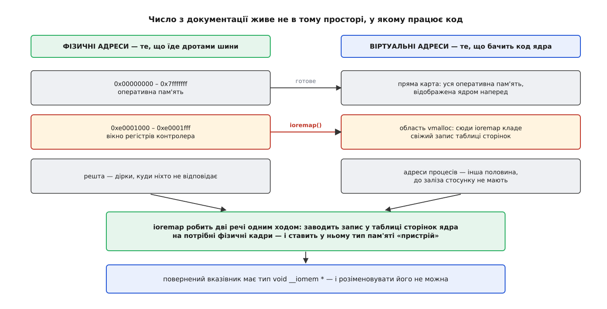
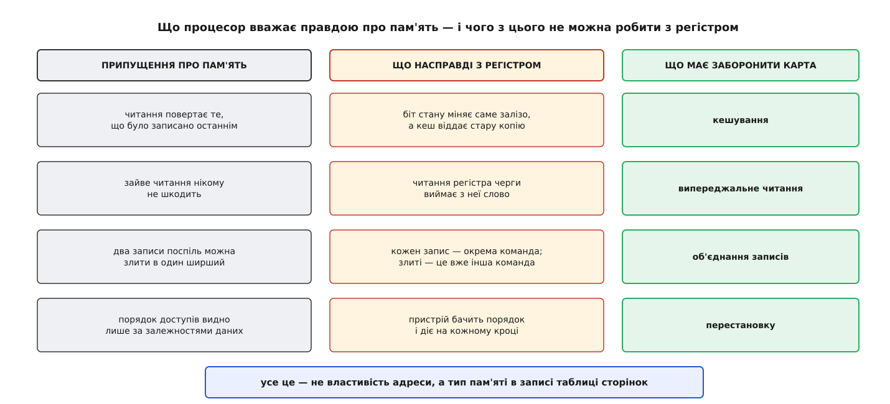
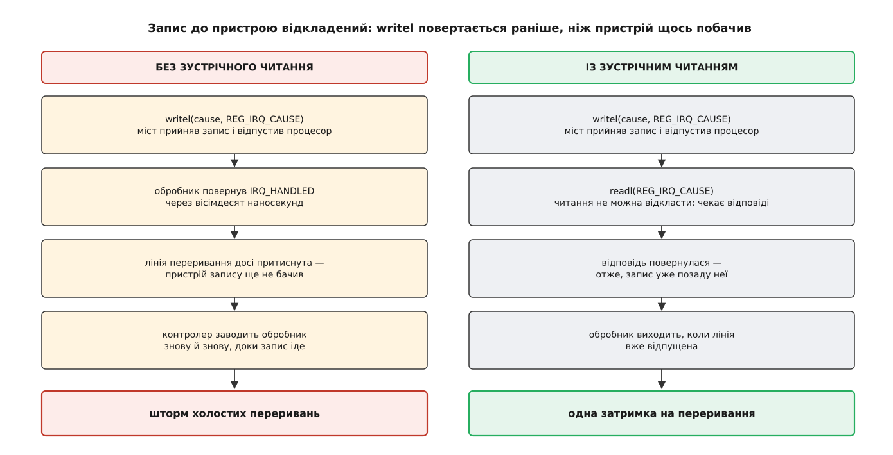

# Регістри пристрою в пам'яті: ioremap і доступ через readl/writel

<preknowlist>
- [Сторінки, таблиці сторінок і MMU](topic:sf-os/paging-and-mmu) — адреса в коді віртуальна, її перекладає таблиця сторінок; у записі таблиці, крім номера кадру, є ще й прапорці.
- [vmalloc: віртуально суцільна пам'ять ядра](topic:sys-unix/vmalloc-kernel-mappings) — окрема область адрес ядра, де відображення складають на ходу, а не наперед.
- [Memory-mapped IO](topic:hw-arch/memory-mapped-io) — сам принцип: регістр мікросхеми відповідає на ті самі транзакції шини, що й комірка пам'яті.
- [Упорядкування пам'яті та бар'єри](topic:hw-arch/memory-barrier-instructions) — процесор і шина можуть виконати доступи не в тому порядку, у якому вони написані; бар'єр забороняє це на визначеному місці.
- [Ключове слово volatile](topic:sf-lang/volatile) — чому компілятор має право викинути або перенести звертання до змінної й що його зупиняє.
- [Порядок байтів](topic:sf-algorithms/bits-bytes-endianness) — те саме 32-бітове число в пам'яті лежить двома різними послідовностями байтів.
- [DMA і відображення буферів у ядрі](topic:sys-unix/dma-and-buffers) — пристрій сам читає й пише оперативну пам'ять, не питаючи процесор.
- [Прив'язка драйвера до пристрою](topic:sys-unix/driver-probe-and-binding) — звідки драйвер бере опис свого заліза й що відбувається в `probe()`.
</preknowlist>

## Число, з якого нічого не виходить

Документація на мікросхему, сторінка двісті чотирнадцята: «блок контролера розташований за адресою `0xe0001000`; зсув `0x18` — регістр `TX_KICK`, запис одиниці в біт 0 запускає передачу». Три числа, і здається, що драйвер уже написаний:

```c
*(volatile u32 *)0xe0001018 = 1;
```

Цей рядок не запустить передачу. Він з високою ймовірністю поламає машину — і не тому, що ядро щось забороняє з міркувань чистоти. У ньому неправильне майже все: неправильна адреса, неправильний спосіб до неї дістатися і неправильне припущення про те, що взагалі станеться після присвоєння.

Розберімо ці три помилки по черзі — з них і виростає весь механізм.

## Адреса з документації — не адреса для коду

Число `0xe0001000` описує, які рівні мають стояти на адресних дротах шини, щоб озвався саме цей блок мікросхеми. Це фізична адреса — та сама координата, за якою в іншому місці системи лежить оперативна пам'ять. Те, що регістр узагалі ділить адресний простір із пам'яттю, — стародавнє інженерне рішення, а не даність: були машини, де для пристроїв відвели окремий простір із власними інструкціями, і [суперечка цих двох підходів](topic:sys-unix/mmio-and-ioremap/hist-memory-or-ports.md) тягнеться від Unibus до сьогоднішнього x86, який досі носить обидва.

Код ядра фізичними адресами не оперує взагалі: кожне звертання, яке виконує процесор, іде через таблицю сторінок, і `0xe0001018` у коді означає віртуальну адресу `0xe0001018` — а куди вона веде, вирішує запис у таблиці. Швидше за все, нікуди: такого запису нема, і на першому ж доступі буде збій.

Заперечення напрошується: ядро ж тримає всю оперативну пам'ять відображеною наперед — так звана пряма карта, де фізичній адресі відповідає віртуальна з постійним зсувом. Чому б цим не скористатися?

Тому що вікно регістрів — не оперативна пам'ять. Пряму карту ядро будує на старті з опису фізичної пам'яті, який дала прошивка: сюди входять лише ті діапазони, де справді є мікросхеми пам'яті. Вікно контролера в цьому описі не значиться — його там і не має бути, бо за цими адресами нема ні кадрів, ні `struct page`, ні чого-небудь, що можна віддати розподільникові. Пряма карта на нього не поширюється.

Отже, відображення треба зробити. Саме це робить `ioremap()`: бере початок і довжину фізичного діапазону, вибирає вільний шматок у службовій області адрес ядра, заповнює записи таблиці сторінок так, щоб вони вказували на потрібні фізичні кадри, і повертає віртуальну адресу.



*Оперативна пам'ять уже відображена наперед; вікно регістрів — ні, і ніколи не буде. Для нього відображення створює драйвер, і разом з адресою задає тип пам'яті.*

Кілька наслідків цієї механіки варто мати на увазі одразу. Відображення йде сторінками, тож `ioremap` округляє початок униз до межі сторінки, а повертає адресу зі збереженим зсувом — на байт, який ви просили. Створене відображення живе в половині адрес, спільній для всіх процесів, тож із нього можна читати з будь-якого контексту, зокрема з обробника переривання. Позаду нього нема `struct page`, тому цю пам'ять не можна ні залокувати, ні передати кудись, де очікують звичайні сторінки. І воно скінченне: службова область не безмежна, тож `ioremap` може повернути `NULL`, і перевірка тут не формальність.

## Чому цього мало: регістр не поводиться як пам'ять

Друга помилка глибша. Навіть коли адреса вже правильна, звичайне присвоєння через неї не працює, бо процесор, кеш і компілятор вважають про пам'ять чотири речі — і жодна з них не справджується для регістра.

Перше: читання повертає те, що записали останнім. Регістр стану міняє саме залізо, без участі процесора. Якщо його вміст осів у кеші, драйвер читатиме стару копію нескінченно довго — біт «передача завершена» ніколи не з'явиться.

Друге: зайве читання нікому не шкодить. Процесор користується цим постійно: підтягує сусідній рядок кешу наперед, читає за адресою, яку ще не факт що виконає. Але читання регістра черги виймає з неї слово, а читання регістра причини переривання може його скинути. Одне випереджальне читання, яке ніхто не замовляв, — і дані зникли.

Третє: сусідні записи можна злити в один ширший. Для пам'яті це чиста оптимізація. Для пристрою кожен запис — окрема команда; два записи, злиті в один восьмибайтовий, — це вже не дві команди, а одна незрозуміла, на яку залізо не розраховане.

Четверте: порядок доступів видно лише за залежностями даних. Пристрій, однак, реагує на кожен доступ у момент, коли той до нього приходить, і порядок для нього — частина протоколу.



*Кожне припущення, зручне для пам'яті, для регістра обертається помилкою — і кожне забороняється не в коді драйвера, а в записі таблиці сторінок.*

Звідси випливає головне: потрібне не просто відображення, а відображення особливого ґатунку. І воно таки існує — записи таблиці сторінок несуть, крім номера кадру, ще й кілька бітів, які кажуть процесорові, як з цією областю поводитися: чи можна кешувати, чи можна читати наперед, чи можна об'єднувати записи, чи можна переставляти доступи. Набір цих правил і зветься типом пам'яті (англ. *memory type*). На ARM найсуворіший із них має ім'я «Device», на x86 такий самий ефект дають таблиці PAT.

Ось чому відображення регістрів робиться окремим викликом, а не просто перетворенням числа у вказівник: разом з адресою `ioremap` виставляє в записі найсуворіший тип — без кешу, без випереджального читання, без об'єднання, без перестановок.

Цей тип не єдиний, і суворість не завжди на користь. Кадровий буфер відеокарти — теж не оперативна пам'ять, але туди штовхають мегабайти пікселів, і заборона об'єднувати записи робить це вдесятеро повільніше, тоді як переставлений порядок пікселів нікому не шкодить. Для таких випадків є `ioremap_wc()` — з дозволеним об'єднанням записів (англ. *write combining*). Є ще `ioremap_cache()` — для областей, які насправді поводяться як пам'ять, як-от постійна пам'ять NVDIMM. Є `ioremap_np()` — для шин, які вимагають, щоб запис дочекався підтвердження; його додали, коли Linux пішов на мікросхеми Apple. [Уся родина відображень і доступів](topic:sys-unix/mmio-and-ioremap/api-io-accessors.md) із гарантіями кожного — окремою довідкою; тут важить лише те, що вибір типу — свідоме рішення драйвера, а `ioremap()` без суфікса дає найсуворіший варіант, який годиться для регістрів завжди.

> 🔧 **Навіщо це.** Найчастіша помилка при перенесенні драйвера з іншої системи — узяти `ioremap_cache()` чи `ioremap_wc()` «бо швидше». Симптом виходить характерний: усе працює на стенді й розсипається під навантаженням, бо кеш почав тримати рядок довше, а біт готовності перестав оновлюватися. Зворотний бік теж є: кадровий буфер, відображений звичайним `ioremap()`, дає повільне промальовування без жодної помилки в логіці.

## Хто взагалі має право на цей діапазон

`ioremap` нікого ні про що не питає: дали фізичну адресу — зробив запис у таблиці. Він не знає, чи це справді ваш контролер, чи ви помилилися на один розряд і відобразили чужий блок.

Облік ведеться окремо. Ядро тримає дерево структур `struct resource`, яке описує, ким зайнято фізичний адресний простір; його видно у файлі `/proc/iomem`. Виклик `request_mem_region()` вставляє в це дерево ваш запис і повертає помилку, якщо діапазон перетинається з чиїмось уже зайнятим. Це не механізм захисту — записи в таблиці сторінок він не перевіряє й нічого не забороняє тому, хто його не викликав. Це домовленість між драйверами, завдяки якій дві прошивки, що описали один блок двома різними іменами, зіткнуться голосно на завантаженні, а не тихо псуватимуть одна одній регістри.

Тому в справжньому драйвері окремого `ioremap` майже не буває. Є `devm_ioremap_resource()`, що робить обидва кроки — займає діапазон і відображає його, — а заразом чіпляє звільнення до життя пристрою, тож ні `release_mem_region`, ні `iounmap` писати не треба. Для платформних пристроїв є ще коротший шлях: `devm_platform_ioremap_resource(pdev, 0)` сам дістає нульовий ресурс типу пам'ять із опису пристрою й робить усе решту. Ця обгортка з'явилася 2019 року, і з того часу тисячі драйверів переписали на неї — саме тому в старому коді ті самі три дії розписані окремо.

## Вказівник, який не можна розіменувати

`ioremap` повертає не `void *`, а `void __iomem *`. Для компілятора `__iomem` не означає нічого: у звичайній збірці макрос порожній. Він призначений статичному перевірячеві коду [sparse](topic:sys-unix/sparse-checker), для якого це окремий адресний простір: вказівник із такою міткою не можна ні розіменувати, ні присвоїти звичайному вказівникові без явного примусового перетворення. Перевіряч ловить рівно те, чого око не бачить, — місце, де хтось звернувся до відображеного регістра як до пам'яті.

Заборона не церемоніальна. Навіть із правильним типом пам'яті в таблиці сторінок присвоєння `*p = 1` лишає забагато на розсуд компілятора: якою інструкцією виконати запис, чи розбити 32 біти на два 16-бітові доступи (на деяких архітектурах це законна оптимізація), чи скористатися парною інструкцією запису двох слів одразу, чи винести читання з циклу, бо значення «не змінюється». `volatile` рятує від частини цього: він забороняє викидати доступ і переставляти доступи один відносно одного. Але він нічого не каже ні про ширину доступу, ні про порядок байтів, ні про порядок відносно звичайної пам'яті. А регістр, який вимагає одного 32-бітового доступу, від чотирьох байтових просто не спрацює: залізо бачить чотири різні транзакції, у трьох із них половина адресних розрядів не та, що треба.

Тому доступ робиться не розіменуванням, а функціями.

## Що насправді робить readl і writel

`readl()` читає 32 біти за адресою `__iomem`, `writel()` записує їх. Літера в кінці — ширина: `b` — байт, `w` — два байти, `l` — чотири, `q` — вісім. Кожна з цих функцій робить три речі, і жодну не можна викинути.

**Один доступ рівно тієї ширини, яку названо.** Реалізація — розіменування `volatile`-вказівника відповідного цілого типу, а на архітектурах, де компілятор може вибрати не ту інструкцію, — вбудований асемблер. Гарантія проста: буде рівно одна транзакція на шині, завширшки чотири байти.

**Перетворення порядку байтів.** За домовленістю, що прийшла з PCI, регістри вважаються записаними в порядку від молодшого байта. `readl` — це `le32_to_cpu()` над сирим доступом, `writel` — `cpu_to_le32()` перед ним. На машині з тим самим порядком це нуль інструкцій, на машині з протилежним — команда перестановки байтів. Завдяки цьому один і той самий драйвер працює на обох, і `readl(regs + REG_ID) == 0x4d594554` — правда скрізь. Пристрої зі справді старшим порядком байтів у регістрах трапляються, і для них є окрема родина `ioread32be`/`iowrite32be`.

**Бар'єри проти звичайної пам'яті.** Це найважливіше й найменш очевидне. Драйвер майже ніколи не спілкується з пристроєм лише регістрами: типова послідовність — покласти дескриптор у буфер в оперативній пам'яті, а тоді записом у регістр сказати пристроєві «бери». Пристрій читає буфер сам, механізмом прямого доступу до пам'яті. Якщо запис дескриптора ще стоїть у буфері запису процесора, коли команда вже дійшла до заліза, пристрій прочитає сміття.

Історично так і було. На ARM до 2010 року `writel` був просто записом, і порядок між буфером у пам'яті та регістром тримався сам собою: когерентні буфери для прямого доступу відображали найсуворішим типом, у якому доступи не переставляються й не буферизуються. Заради швидкості їх перевели на звичайну некешовану пам'ять — і порядок перестав бути гарантованим. Посипалися драйвери, у яких бар'єра ніхто ніколи не писав, бо доти він і не був потрібен. Латка Каталіна Марінаса (`ARM: 6273/1`, липень 2010 року) поставила `wmb()` усередину записувальних функцій, а читальним дала симетричний бар'єр після доступу. Відтоді контракт у ядрі однаковий на всіх архітектурах: усе, що записано у звичайну пам'ять до `writel`, пристрій побачить; усе, що прочитано `readl`, впорядковано перед наступними доступами.

Ці бар'єри й роблять пару `readl`/`writel` дорожчою за один доступ до пам'яті. Тому є `readl_relaxed()` і `writel_relaxed()` — ті самі ширина й порядок байтів, але без бар'єрів проти звичайної пам'яті. Вони впорядковані лише між собою в межах того самого пристрою. Їх ставлять у гарячих місцях — наприклад, у циклі, що вичитує пачку слів із черги, — і в ядрі заведено пояснювати коментарем, чому саме тут це безпечно. Ще нижче — `__raw_readl()`/`__raw_writel()`: без бар'єрів і без перетворення порядку байтів, рідні байти як є. Це інструмент для перекидання масивів у пам'ять пристрою, а не для регістрів; для тієї ж мети є `memcpy_toio()` і `memcpy_fromio()`, бо звичайним `memcpy` над відображенням пристрою користуватися не можна — бібліотечна реалізація сама вибирає ширину доступів і залюбки скористається інструкціями, від яких залізо здригнеться.

## Запис, який уже пішов, але ще не дійшов

Лишилася третя помилка з початкового рядка — припущення, що після присвоєння команда виконана.

`writel` повертається, коли запис прийнято найближчим мостом, а не коли його побачив пристрій. На PCI Express запис у пам'ять — відкладена транзакція (англ. *posted*): відправник не чекає підтвердження. Дорога до пристрою може мати кілька мостів, і на кожному запис постоїть у черзі. Практичних наслідків два.

Перший: помилка при записі не прилітає в місці запису. Якщо адреса нікуди не веде, збій станеться асинхронно — на x86 як машинна перевірка, на ARM як асинхронна зовнішня аварія доступу, іноді за десятки інструкцій далі, у зовсім іншій функції. Розбирати такі аварії важко саме через розрив у часі.

Другий: щоб дізнатися, що запис дійшов, треба щось у цього пристрою прочитати. Читання — не відкладена транзакція: воно не може завершитися, поки не повернулася відповідь, а правила впорядкування шини не дозволяють відповіді обігнати запис, який ішов попереду. Тож `readl` будь-якого регістра того самого пристрою після `writel` гарантує, що запис уже прийнято. Цей прийом так і зветься — проштовхувальне читання.

Найчастіше він потрібен наприкінці обробника переривання. Пристрій тримає лінію притиснутою, доки причина не скинута; обробник записує скидання й повертається. Якщо запис ще в польоті, лінія лишається притиснутою, контролер переривань заводить обробник знову — і так доти, доки запис нарешті не дійде.



*Читання коштує повного оберту до пристрою й назад — але саме ця затримка й гарантує, що запис уже там.*

**Умова: запис до пристрою йде мостами 400 нс, повернення з обробника й повторний вхід у нього — приблизно 90 нс.**

```
без проштовхувального читання
  t =   0 нс   writel(cause, REG_IRQ_CAUSE)   міст прийняв, процесор вільний
  t =  80 нс   обробник повернув IRQ_HANDLED
  t =  90 нс   лінія притиснута → вхід у обробник удруге, cause той самий
  t = 180 нс   утретє
  t = 270 нс   учетверте
  t = 360 нс   уп'яте
  t = 400 нс   запис дійшов, пристрій відпустив лінію
  разом: 4 холостих входи в обробник

із проштовхувальним читанням
  t =   0 нс   writel(cause, REG_IRQ_CAUSE)
  t =   5 нс   readl(REG_IRQ_CAUSE)           чекає відповіді
  t = 405 нс   відповідь прийшла → запис уже позаду неї
  t = 485 нс   обробник повернув, лінія відпущена
  разом: 0 холостих входів, +400 нс на кожне переривання
```

Плата — одна затримка шини на переривання; без неї — від кількох холостих входів до нескінченного шторму, якщо пристрій уміє виставити нову причину швидше, ніж доходить скидання попередньої.

## Як це виглядає в драйвері

Зберімо все докупи. Мова тут не вибирається: регістри, ширина доступу й бар'єри — це рівень, де живе тільки C.

```c
#define REG_ID          0x000   /* лише читання: сигнатура блока */
#define REG_IRQ_CAUSE   0x00c   /* запис одиниці скидає біт */
#define REG_TXDESC_LO   0x010
#define REG_TXDESC_HI   0x014
#define REG_TX_KICK     0x018

struct myeth {
        void __iomem *regs;
        struct device *dev;
};

static int myeth_probe(struct platform_device *pdev)
{
        struct myeth *priv;

        priv = devm_kzalloc(&pdev->dev, sizeof(*priv), GFP_KERNEL);
        if (!priv)
                return -ENOMEM;
        priv->dev = &pdev->dev;

        /* займає діапазон у /proc/iomem, відображає його
           й вішає звільнення на знищення пристрою */
        priv->regs = devm_platform_ioremap_resource(pdev, 0);
        if (IS_ERR(priv->regs))
                return PTR_ERR(priv->regs);

        if (readl(priv->regs + REG_ID) != 0x4d594554)
                return dev_err_probe(&pdev->dev, -ENODEV,
                                     "за цією адресою не наш блок\n");

        platform_set_drvdata(pdev, priv);
        return 0;
}
```

Передача — той самий порядок «спершу дескриптор, потім дзвінок», де бар'єр не пишеться вручну, бо його вже несе перший `writel`:

```c
static void myeth_kick(struct myeth *priv, struct tx_desc *desc,
                       dma_addr_t desc_dma, dma_addr_t buf_dma, u32 len)
{
        desc->addr  = cpu_to_le64(buf_dma);
        desc->len   = cpu_to_le32(len);
        desc->flags = cpu_to_le32(DESC_OWN);   /* прапорець власності — останнім */

        writel(lower_32_bits(desc_dma), priv->regs + REG_TXDESC_LO);
        writel(upper_32_bits(desc_dma), priv->regs + REG_TXDESC_HI);
        writel(TX_KICK_GO, priv->regs + REG_TX_KICK);
}
```

Обробник переривання — з проштовхувальним читанням перед виходом:

```c
static irqreturn_t myeth_isr(int irq, void *data)
{
        struct myeth *priv = data;
        u32 cause = readl(priv->regs + REG_IRQ_CAUSE);

        if (cause == 0)
                return IRQ_NONE;        /* не наше: лінія спільна */

        writel(cause, priv->regs + REG_IRQ_CAUSE);
        readl(priv->regs + REG_IRQ_CAUSE);      /* проштовхнути скидання */

        return IRQ_HANDLED;
}
```

[Робочий модуль із цими трьома шматками](topic:sys-unix/mmio-and-ioremap/proj-mmio-driver.md) — з дескрипторним кільцем, вимірюванням ціни бар'єрів і демонстрацією того, що ламається, коли їх прибрати, — окремою розробкою.

## Де це ще підводить

Три пастки лишаються навіть у правильно написаному драйвері.

**Блок без такту.** Відображення існує незалежно від того, чи ввімкнено живлення й тактування блока. Читання регістра вимкненого блока не поверне нулів — воно взагалі не отримає відповіді. На x86 шина віддасть усі одиниці, на ARM це зазвичай зовнішня аварія доступу й падіння ядра. Тому в `probe()` спершу вмикають такт і виводять блок зі скидання, а вже потім читають сигнатуру; після присипляння пристрою будь-яке звертання до його регістрів — помилка.

**Доступ після зникнення.** Пристрій на шині з гарячим від'єднанням може щезнути будь-якої миті, а відображення при цьому лишається чинним. Читання поверне `0xffffffff`, і драйвер, який не перевіряє цього, спокійно проінтерпретує всі одиниці як стан «усе готово, черга повна, помилок сорок вісім».

**Спокуса подивитися з простору користувача.** Файл `/dev/mem` дозволяє відобразити фізичну адресу в процес, і колись цим налагоджували драйвери. Сьогодні майже всюди ввімкнено `CONFIG_IO_STRICT_DEVMEM`, який відмовляє в доступі до діапазонів, зайнятих драйверами, а [режим блокування ядра](topic:sys-unix/kernel-lockdown) закриває `/dev/mem` цілком. Причина не в педантизмі: можливість писати в довільний регістр — це можливість перепрограмувати контролер прямого доступу так, щоб він переписав пам'ять самого ядра.

Останнє варте окремої уваги, бо на ньому спотикаються найчастіше. Значення `0xffffffff` — універсальна відповідь «ніхто не озвався»: його повертає і зниклий пристрій, і блок під скиданням, і адреса, помилково зсунута на одну сторінку. Тобто той самий механізм, який дає драйверові доступ до заліза, дає й одне-єдине значення, що означає його відсутність, — і драйвер, який жодного разу цього значення не перевіряє, з однаковим виразом обличчя обслуговує пристрій і порожнечу.
