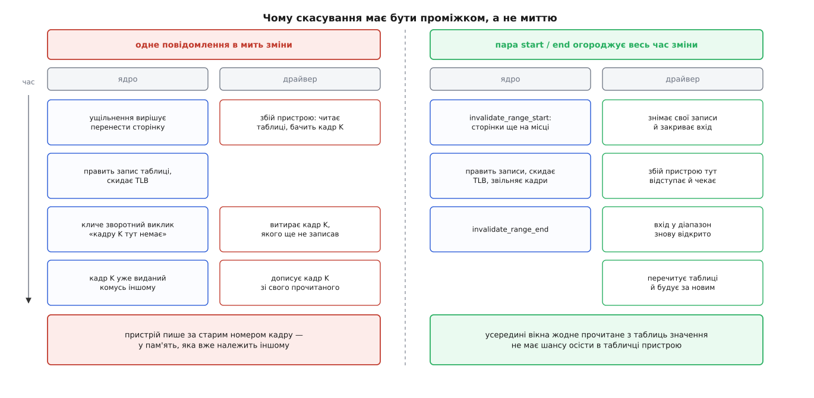
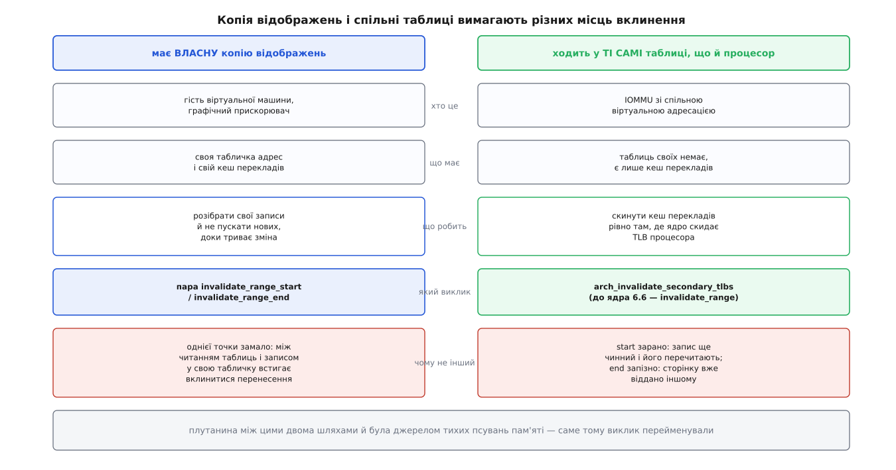
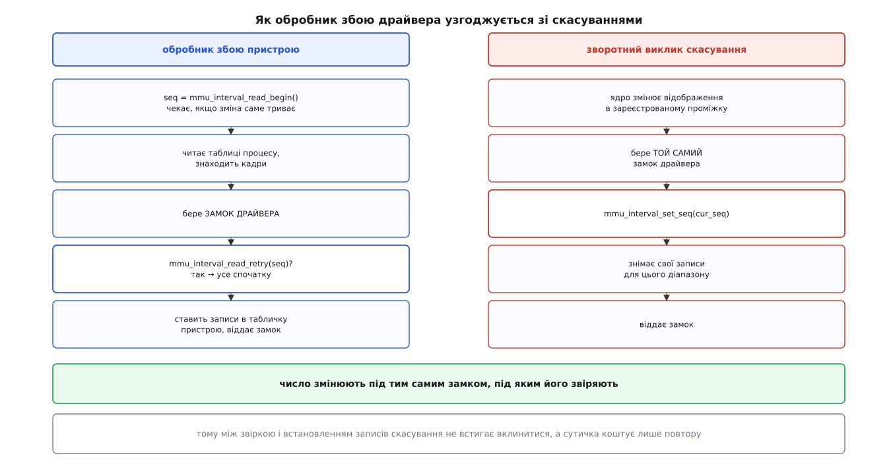

# Сповіщувачі MMU: як драйвер дізнається, що ядро забирає сторінку

<preknowlist>
- [Сторінки, таблиці сторінок і MMU](topic:sf-os/paging-and-mmu) — відповідність «віртуальна сторінка → фізичний кадр» лежить у таблицях, і апаратура читає їх під час кожного звертання.
- [Сторінковий збій](topic:sf-os/page-fault) — коли запису в таблиці немає, апаратура зупиняє виконання й кличе ядро добудувати відображення.
- [Розсилання скидань TLB](topic:sys-unix/tlb-shootdown) — процесор кешує переклади, тож правка таблиці має супроводжуватися явним скиданням цього кешу на всіх ядрах.
- [Свопінг і витіснення сторінок](topic:sys-unix/swap-and-reclaim) — ядро будь-коли забирає кадр у того, хто ним рідко користується, спираючись на біт звертання.
- [Фізичні сторінки в ядрі](topic:sys-unix/physical-page-allocator) — вміст сторінок переносять між кадрами, щоб зібрати суцільні блоки.
- [Зворотне відображення сторінки](topic:sys-unix/reverse-mapping) — за фізичним кадром ядро вміє знайти всі записи таблиць, що на нього вказують, і поправити їх.
- [Закріплення сторінок для пристрою](topic:sys-unix/page-pinning-gup) — протилежний підхід: узяти на кадр посилання й заборонити ядру його рухати.
- [Замки в ядрі й атомарний контекст](topic:sys-unix/kernel-locking) — де в ядрі можна заснути, а де не можна ні за яких умов.
- [Seqlock](topic:sf-tasks/seqlock) — читач бере лічильник до і після роботи й перечитує все спочатку, якщо число змінилося.
- [DMA і відображення буферів у ядрі](topic:sys-unix/dma-and-buffers) — пристрій ходить у пам'ять повз процесор і за своєю власною адресою.
</preknowlist>

Прискорювач рахує над масивом, який завела звичайна програма. Щоб дістатися чисел, він не питає процесор щоразу: у нього є власний перекладач адрес і власна табличка відповідностей, куди він одного разу переписав те, що знайшов у таблицях процесу. Так само влаштований гість віртуальної машини: [апаратна віртуалізація](topic:hw-arch/hardware-virtualization) дає гіпервізорові окремий набір таблиць, за яким залізо перекладає гостьові фізичні адреси у справжні, — і цей набір дублює те, що знає ядро хазяїна. Відтоді одну й ту саму пам'ять перекладають двоє, і лише одного з них ядро вважає своїм.

Другий перекладач нікому не заважає рівно доти, доки відповідності не змінюються. Але вони змінюються постійно, і не через помилку, а через звичайну роботу: сторінку витісняють, переносять заради суцільного блоку, розщеплюють після розгалуження процесу, звільняють при `munmap`. Щоразу ядро править свої таблиці й скидає кеш перекладів процесора — і не має ані найменшої гадки, що десь є друга табличка з тим самим номером кадру.

Один вихід уже відомий: заборонити ядру рухати кадр, узявши на нього посилання. Він працює для буфера на кілька мегабайтів і на кілька мілісекунд. Прискорювач же дзеркалить десятки гігабайтів на весь час роботи програми, гість віртуальної машини — усю свою пам'ять на весь час свого життя. Заморозити стільки означає викреслити з системи витіснення, ущільнення й гаряче вилучення плат пам'яті. Отже, потрібна протилежна угода: ядро й далі порядкує пам'яттю як хоче, але **попереджає** того, у кого є копія.

## Чому одного сигналу «цієї сторінки більше немає» замало

Найпростіша форма угоди — зворотний виклик у ту мить, коли запис у таблиці процесу зникає: «кадр K більше не належить цій адресі, витри його в себе». Спробуймо цим обійтися й подивімося, де воно розпадається.

Драйвер дізнається адреси не раз і назавжди — він добудовує свою табличку на вимогу, так само як ядро добудовує таблиці процесу. Пристрій звернувся за адресою, якої в його табличці немає, драйвер іде читати таблиці процесу, знаходить кадр і записує його в себе. Це його власний шлях збою, і він триває не одну інструкцію: там і взяття замків, і, можливо, підвантаження сторінки з файлу.

Тепер накладімо два ці шляхи один на одного. Драйвер прочитав запис таблиці, побачив кадр K і рушив записувати його в свою табличку. Тієї ж миті на іншому ядрі процесора ущільнення переносить сторінку: правúть запис таблиці, скидає TLB, кличе наш зворотний виклик. Драйвер слухняно витирає в себе кадр K — якого там ще немає. А за мить дописує його туди сам, уже з прочитаного значення. Кадр K на цей час належить комусь іншому, і пристрій пише в чужу пам'ять.

Хиба не в порядку виклику й не в замках драйвера. Хиба в тому, що **одноточкове повідомлення не має тривалості**, а небезпечний стан її має: він починається тоді, коли ядро вирішило змінити відображення, і закінчується тоді, коли зміна повністю доведена до кінця. Усередині цього проміжку жодне прочитане з таблиць значення не має права осісти в чужій табличці.

Звідси форма, якої не оминути: не один виклик, а **пара**, що огороджує проміжок.

- `invalidate_range_start` кличуть, коли сторінки ще на місці й ще чинні. Підписник зобов'язаний зробити дві речі: прибрати свої записи для цього діапазону — і **не пускати туди нових**, доки не надійде другий виклик.
- `invalidate_range_end` кличуть після того, як записи таблиць очищено, кеші перекладів скинуто, а сторінки віддано. Відтоді підписник знову має право будувати відображення — і збудує вже за новим станом таблиць.



*Драйвер має не «дізнатися про подію», а мати вікно, всередині якого він добровільно сліпий.*

Забороняти вхід у діапазон драйвер мусить сам, і робить це найпростішим способом: лічильником незавершених скасувань плюс власним замком. Побачив у своєму обробнику збою ненульовий лічильник — або чекає, або відступає й пробує спочатку. Ця дрібниця згодом визначить усю форму сучасного інтерфейсу.

> 🔧 **Навіщо це.** Якщо ви пишете драйвер, що дзеркалить пам'ять процесу, уся ваша робота — це узгодження двох шляхів: власного обробника збою й чужого скасування, яке приходить будь-коли й з будь-якого ядра. Усе інше — деталі впорядкування черг пристрою.

## Хто підписується і на що

Підписка живе не на сторінці й не на ділянці, а на **адресному просторі**: драйвер реєструє свій набір зворотних викликів для конкретного `mm_struct` через `mmu_notifier_register`. Список підписників ядро обходить під [RCU для сплячих читачів](topic:sys-unix/rcu-read-copy-update) — скасування трапляється часто, і брати на нього спільний замок було б надто дорого.

Підписка мусить пережити саму програму. Процес може завершитися тоді, коли пристрій ще працює, тож сповіщувач тримає посилання на `mm_struct` — але «легке», те, що продовжує життя самої структури, а не адресного простору. Візьми він звичайне посилання, простір ніколи б не розібрався, бо чекав би на драйвер, а драйвер — на завершення роботи пристрою. Натомість, коли адресний простір розбирають, підписник дістає окремий виклик `release`: після нього більше не буде жодного скасування, і всі свої відображення треба зняти негайно.

Ще одна тонкість — кількість підписок. Один драйвер часто має по кілька відкритих дескрипторів на той самий процес, і реєструвати по сповіщувачу на кожен означало б розсилати ту саму подію по кілька разів. Тому є пара `mmu_notifier_get`/`mmu_notifier_put`, яка знаходить наявний примірник для цього `mm` або створює новий, — з лічильником користувачів усередині; звільнення відкладене через той самий механізм читачів, щоб нікого не вбити посеред обходу списку.

## Звідки приходить виклик і чому там іноді не можна спати

Знецінення народжується не в одному місці, а в кожному, де ядро правúть відображення: `munmap` і `mprotect`, витіснення й зворотний запис, ущільнення й перенесення сторінок, згортання дрібних сторінок у велику, злиття однакових сторінок. Замки, які при цьому вже тримає ядро, щоразу різні — то `mmap_lock` на запис, то лише замки зворотного відображення.

За звичайних умов підписникові дозволено заснути в зворотному виклику, і це принципово: зупинити чергу графічного процесора або дочекатися підтвердження від мережевої карти миттєво не вийде. Але є місця, де сплячий підписник — це смерть системи. Найяскравіше — прибирач пам'яті, який після вбивства процесу за браком пам'яті звільняє його сторінки. Він мусить рухатися вперед за будь-яку ціну: якщо він засне на замку, який утримує процес, що сам чекає на пам'ять, система стане назавжди саме тоді, коли пам'яті вже немає.

Тому в описі діапазону є прапорець «спати дозволено». Коли його немає, підписник має або впоратися без сну — скажімо, взяти замок неблокуючою спробою, — або чесно повернути `-EAGAIN`; той, хто кликав, тоді відступиться й спробує пізніше або обійде цей адресний простір. З цього виростає правило, яке легко проґавити: **хто вміє провалити `start`, той не має права мати `end`**. Пари не буде — повідомити підписника про те, що його ж власний `start` не вдався, ядро не вміє.

## Що саме змінюється — і чи варто через це прокидатися

Скасування коштує дорого. Зупинити конвеєр прискорювача, дочекатися, поки він добіжить до безпечної точки, і зняти сотні тисяч записів — це помітна пауза для обчислення. Тому виклик несе не самі лише межі діапазону, а й **причину**: чи це `munmap`, чи очищення запису таблиці, чи зміна прав на цілій ділянці, чи облік «брудних» сторінок, чи перенесення на пристрій. Знаючи причину, підписник часто робить менше або не робить нічого.

Разом із причиною передають ще й **власника** зміни — довільну позначку того, хто її затіяв. Драйвер, що сам переносить сторінки в пам'ять свого прискорювача, побачить у скасуваннях від цього перенесення власну позначку й спокійно їх пропустить: він і так знає, що робить, а розібрати самому собі відображення означало б зациклитися. Повний перелік викликів, полів опису діапазону, видів подій і правил реєстрації зібрано окремо: [інтерфейс сповіщувачів MMU](topic:sys-unix/mmu-notifiers/api-mmu-notifier-ops.md).

## Гаряча сторінка, яка виглядає холодною

Скасування — не єдина річ, про яку двом перекладачам треба домовитися. Є ще зворотний напрямок: ядро питає підписника.

Витіснення обирає жертву за бітом звертання в записі таблиці — апаратура ставить його щоразу, коли процесор торкається сторінки. Але прискорювач ходить у пам'ять повз таблиці процесу, і жодного біта від його звертань не з'являється. Сторінка, яку пристрій молотить безперервно, з погляду ядра лежить непорушно тижнями — і саме її ядро й вибере на виселення.

Тому в наборі є три зворотні виклики про вік: скинути ознаку звертання у своїх записах і повернути, чи вона там була; те саме, але без дорогого скидання кешу перекладів пристрою; і просто спитати, не чіпаючи. Ядро вплітає відповідь у власне зважування, і сторінка, гаряча для пристрою, перестає виглядати холодною. Без цих трьох викликів дзеркалення пам'яті працювало б правильно, але система крутила б сторінки з-під прискорювача у своп і назад.

## Два різні протоколи для двох різних апаратур

Досі йшлося про пристрій, який тримає **копію** відображень. Є й друга порода — апаратура, що ходить у ті самі таблиці, що й процесор: [IOMMU](topic:hw-arch/iommu) зі спільною віртуальною адресацією, коли пристрій дістає позначку адресного простору й перекладає адреси таблицями процесу без жодного посередника. Копії немає, розбирати нічого. А кеш перекладів у пристрою свій, і його треба скинути.

Здавалося б, та сама пара `start`/`end` підійде. Не підійде, і саме тут крилася низка тихих псувань пам'яті.

`start` приходить **зарано**: запис у таблиці ще чинний, і пристрій, звернувшись мілісекундою пізніше, законно прочитає його ще раз і покладе собі в кеш. `end` приходить **запізно**: сторінку вже звільнено й, можливо, вже видано комусь іншому, а в кеші пристрою досі стоїть старий переклад — і між цими двома подіями пристрій пише в чужу пам'ять. Потрібна єдина точка: рівно та мить, коли запис уже очищено, а сторінку ще не віддано, — тобто там, де ядро скидає кеш перекладів процесора.



*Різні за природою пристрої вимагають різних місць вклинення, і плутати їх не можна.*

Такий виклик у ядрі є, і його кличуть під замком таблиці сторінок, поруч зі скиданням TLB процесора. Довгий час він звався `invalidate_range` — назва підказувала, що це просто дрібніший різновид пари, тож нею намагалися підмінити `start`/`end` там, де це неправильно. У ядрі 6.6 (жовтень 2023) його перейменували на `arch_invalidate_secondary_tlbs` — саме щоб назва сама відповідала на питання, кому він призначений; правку вніс Алістер Попл із NVIDIA разом із виправленням документації.

## Ціна грубого протоколу

Пара `start`/`end` приходить на **весь адресний простір** і на будь-який діапазон у ньому. Драйвер, який дзеркалить десяток окремих ділянок, дістає всі скасування підряд і мусить сам питати «а чи це моє». Гірше інше: щоб узгодити свій обробник збою зі скасуваннями, він тримає лічильник і замок — а замок цей один на всю підписку. Два потоки, що падають у збій на різних кінцях адресного простору, штовхаються на ньому без жодної потреби, і кожне скасування в будь-якому кутку простору змушує їх обох перечекати.

Обидві біди — від того, що підписка не знає, які саме діапазони цікавлять драйвера. Скажімо йому це — і обидві зникнуть.

Так з'явився **сповіщувач діапазону**: драйвер реєструє не набір викликів на весь простір, а окремий вузол на конкретний проміжок адрес. Вузли складають в інтервальне дерево, і зворотний виклик приходить лише тим, чий проміжок справді перетинається зі зміною. А замість лічильника із замком бік читача дістав послідовний лічильник — рівно ту саму схему, якою читач узгоджується з рідким записувачем: узяв число до роботи, звірив після, не збіглося — перечитав усе спочатку.

Виглядає це в драйвері так. Спершу зворотний виклик скасування:

```c
static bool mirror_invalidate(struct mmu_interval_notifier *sub,
                              const struct mmu_notifier_range *range,
                              unsigned long cur_seq)
{
        struct mirror *m = container_of(sub, struct mirror, sub);

        if (mmu_notifier_range_blockable(range))
                mutex_lock(&m->lock);
        else if (!mutex_trylock(&m->lock))
                return false;           /* нагору піде -EAGAIN */

        mmu_interval_set_seq(sub, cur_seq);
        mirror_drop_device_entries(m, range->start, range->end);

        mutex_unlock(&m->lock);
        return true;
}
```

Далі обробник збою пристрою:

```c
static int mirror_fault(struct mirror *m, unsigned long addr, unsigned long len)
{
        unsigned long seq;
        int ret;

        while (true) {
                seq = mmu_interval_read_begin(&m->sub);
                m->range.notifier_seq = seq;

                mmap_read_lock(m->mm);
                ret = hmm_range_fault(&m->range);
                mmap_read_unlock(m->mm);
                if (ret == -EBUSY)
                        continue;       /* зміна саме триває */
                if (ret)
                        return ret;

                mutex_lock(&m->lock);
                if (mmu_interval_read_retry(&m->sub, seq)) {
                        mutex_unlock(&m->lock);
                        continue;       /* хтось зняв ці сторінки — усе спочатку */
                }
                mirror_install_device_entries(m, addr, len);
                mutex_unlock(&m->lock);
                return 0;
        }
}
```



*Два шляхи перетинаються рівно в одній точці — у замку драйвера, і тільки тому їх можна впорядкувати.*

Уся правильність тут тримається на трьох дрібницях, і кожну легко зіпсувати.

`mmu_interval_read_begin` беруть **до** читання таблиць процесу, а не після, — інакше зміна, що трапилася між читанням і взяттям числа, лишиться непоміченою. Якщо скасування саме триває, цей виклик почекає, поки воно добіжить до кінця: сенсу читати таблиці посеред зміни немає.

`mmu_interval_set_seq` кличуть **під тим самим замком драйвера**, під яким потім звірятимуть число. Саме це робить перевірку чинною: між `mmu_interval_read_retry` і записом у табличку пристрою скасування не встигне вклинитися, бо замок уже наш.

І звірка, і встановлення відображень мусять бути **всередині одного взяття замка**. Розірвати їх — значить повернути ту саму дірку, з якої все починалося, лише вужчу.

Сповіщувачі діапазону виросли з [підсистеми дзеркалення пам'яті для прискорювачів](topic:sys-unix/hmm-address-space-mirroring) і замінили її власний, значно неоковирніший інтерфейс; це робота Джейсона Ґанторпа, влита наприкінці 2019 року й доступна з ядра 5.5. Робочий приклад модуля, що дзеркалить діапазон повністю — від реєстрації до коректного зняття, — зібрано окремо: [дзеркалити діапазон пам'яті процесу](topic:sys-unix/mmu-notifiers/proj-mirror-a-range.md).

## Коли сповіщувач, а коли закріплення

Два підходи до однієї задачі розходяться не за зручністю, а за тим, чию свободу віддають.

[Закріплення](topic:sys-unix/page-pinning-gup) віддає свободу системи: кадр стоїть, ущільнення обходить його, плату пам'яті під ним не вилучити. Натомість драйвер простий — узяв номер кадру й користується ним, доки не відпустить. Це чесний обмін для короткого буфера прямого вводу-виводу.

Сповіщувач віддає свободу драйвера: пам'ять лишається рухомою, зате драйвер мусить уміти зупинитися будь-якої миті, у будь-якому контексті, іноді без права заснути. Це дорого — і саме тому цей шлях обирають ті, кому інакше ніяк: гіпервізор, що дзеркалить усю пам'ять гостя; графічні драйвери, які дають прискорювачеві ходити просто в пам'ять програми; [віддалений прямий доступ до пам'яті](topic:sys-unix/rdma-in-linux) з підвантаженням сторінок на вимогу замість реєстрації всього буфера наперед; IOMMU зі спільною адресацією.

Обидва механізми народилися з однієї й тієї самої тріщини — з того, що обіцянка віртуальної пам'яті дана **програмі**, а не залізу. Сповіщувачі — спроба поширити її на другого перекладача, не забираючи в ядра права порядкувати кадрами; уперше вони з'явилися 2008 року, коли одразу дві незалежні потреби — віртуалізація й дзеркалення пам'яті між вузлами суперкомп'ютера — уперлися в те саме місце. Як ці дві потреби зіштовхнулися й що з того вийшло, розказано окремо: [народження сповіщувачів MMU](topic:sys-unix/mmu-notifiers/hist-mmu-notifier-birth.md).

Ціну розширеної обіцянки видно у формі самого інтерфейсу. Проста порада «повідом драйвера» перетворилася на пару викликів із забороною входу, окремий виклик в одній точці для тих, хто ділить таблиці з процесором, три виклики про вік сторінки, прапорець «спати не можна», позначку власника зміни й послідовний лічильник для узгодження зі своїм же обробником збою. Кожна з цих частин закриває рівно одну щілину, знайдену на живій системі, — і жодну з них не вийшло замінити чимось простішим.
