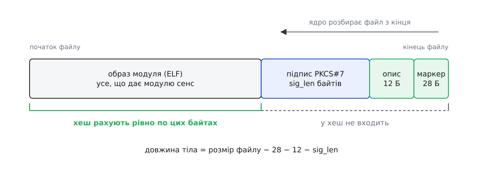
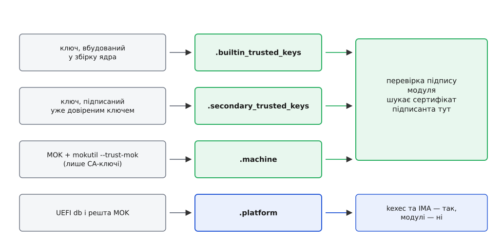
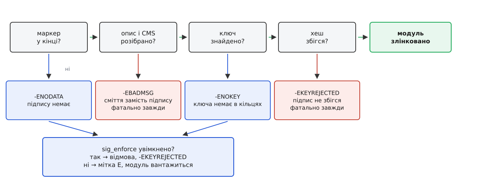

# Підпис модулів ядра: чому ядро відмовляється вантажити чужий код

<preknowlist>
- [Модулі ядра](topic:sys-unix/kernel-modules) — що таке файл `.ko`, як `finit_module` подає його ядру й що ядро робить із поданим образом.
- [Монолітне ядро з модулями](topic:sys-unix/monolithic-with-modules) — модуль не пісочниця: він стає частиною ядра з усіма його повноваженнями.
- [Хеш і цифровий підпис](topic:sf-security/hash-and-digital-signature) — навіщо потрібен стійкий хеш і що означає «підписано приватним ключем, перевірено публічним».
- [Криптографія з відкритим ключем](topic:sf-security/public-key-crypto) — сертифікат, ім'я видавця, серійний номер, ланцюг довіри.
- [Кільця ключів ядра](topic:sys-unix/kernel-keyrings) — ядро тримає ключі у власних іменованих кільцях, а не у файлах на диску.
- [Secure Boot](topic:sys-unix/secure-boot) — прошивка перевіряє завантажувач, завантажувач перевіряє образ ядра.
- [ELF-формат](topic:sf-lang/elf-format) — заголовок, таблиця секцій, символи; `.ko` — це релокований ELF.
</preknowlist>

Користувач із правами root може в Linux майже все: стерти будь-який файл, зупинити будь-який процес, переписати таблицю розділів під живою системою. І та сама людина набирає `insmod ./mydriver.ko` — а у відповідь коротке `Key was rejected by service`, «ключ відхилено службою». Не «немає дозволу», не «файл пошкоджено». Усередині системи є правило, якого root не порушує і, що дивніше, не може вимкнути.

Правило не взялося з нічого. Воно виросло з однієї особливості: завантаження модуля — єдина звична дія, після якої ядро вже не має жодного важеля над тим, що допустило.

## Ядро не може судити модуль за поведінкою

Коли ядро запускає звичайну програму, важелі в нього є, і їх багато. Програма живе у власному просторі адрес; її сторінкова таблиця під наглядом ядра; вийти за межі власної пам'яті вона може лише попросивши ядро системним викликом. Тому ядру байдуже, звідки взявся файл програми: хай там буде що завгодно, межа тримає, і найгірше, що станеться, — доведеться вбити один процес.

З модулем не лишається жодного з цих важелів. Код модуля виконується в тому самому просторі адрес, у тому самому режимі процесора й з тими самими правами, що й решта ядра. Він може прочитати будь-яку сторінку фізичної пам'яті, підмінити оброблювач системного виклику, збрехати про вміст `/proc` — і зупинити його нема кому, бо над ядром рівнів більше немає. Ізолювати модуль неможливо принципово: щоб когось ізолювати, потрібен привілей вищий за його власний, а вищого тут не існує.

Отже, питання «що цей код робитиме» ядро поставити не в змозі — ні відповіді в байтах, ні механізму, яким ту відповідь можна було б підкріпити. Лишається питання слабше, зате таке, на яке відповідь узагалі буває: **чиї це байти**. Не «чи хороший цей код», а «чи дав мені його той, кому я вже вирішив вірити».

Біда в тому, що з файлу походження не видно. `.ko` — звичайний ELF: заголовок, секції з машинним кодом, таблиця символів. Там немає нічого, чого не міг би зібрати будь-хто на своєму ноутбуці. Походження в байтах не живе — його треба **прикріпити** тоді, коли воно ще відоме, і прикріпити так, щоб підробка була не дешевшою за злам криптографії. Саме це робить цифровий підпис: власник приватного ключа рахує хеш файлу й перетворює його своїм ключем; хто має відповідний публічний ключ, той перевіряє збіг, але виготовити такий самий підпис для інших байтів не може.

> 🔧 **Навіщо це.** Звідси видно межу корисності всієї конструкції, і краще знати її одразу: підпис не свідчить, що драйвер якісний або безпечний. Він свідчить рівно одне — ці байти вийшли з рук власника ключа. Довіра до модуля дорівнює довірі до того, хто ключ тримає, і ніколи не буває більшою.

## Правило, вище за root

Лишилося пояснити початкову дивину: чому root не може сказати «я тут головний» і завантажити що хоче.

Тому що межа, яку боронить підпис, проходить не між root і рештою користувачів. Вона проходить між **ядром, яке вже працює, і всім іншим — включно з root**. Таку межу поставили дві різні потреби.

Перша — руткіти (англ. rootkit — «набір для root»). Зловмисник, що дістав права root, зазвичай хоче не одноразової дії, а тривалої присутності, якої не видно. Модуль ядра — найдешевший спосіб її дістати: він ховає процес зі списку, ховає файл із теки, ховає сам себе зі списку модулів. Доки будь-який `.ko` можна просто завантажити, злам root означає негайну втрату всього, що система могла б про себе розповісти, — включно зі здатністю чесно відповісти, що її зламали.

Друга потреба — цілісність ланцюга завантаження. Прошивка перевіряє підпис завантажувача, завантажувач — підпис образу ядра. Ланцюг вартий чогось лише доти, доки не обривається. Ядро, яке після всіх цих перевірок бере й лінкує в себе довільний файл із диска, робить попередні ланки декоративними: щоб виконати свій код у режимі ядра, вже не треба підміняти образ — досить покласти поруч `.ko`. Підписування модулів — це останній замок того самого ланцюга, а не окрема забаганка.

З обох потреб випливає властивість, яка інакше здавалася б сваволею: **вимикач мусить бути односторонній**. Гарантія «у ядрі виконується лише код, за який хтось поручився ключем» варта рівно стільки, скільки коштує її зняти. Якщо root знімає перевірку однією командою, злам root знову дає повний доступ у ядро — просто в два кроки замість одного.

## Підпис живе за краєм файлу

Тепер про механіку. Підпис треба десь покласти, і кандидатів рівно два: окрема секція всередині ELF або байти, дописані після кінця файлу. Linux обрав друге, і причина не в зручності.

Щоб дістати щось із секції ELF, файл треба спершу розібрати: прочитати заголовок, повірити полям зі зміщеннями й розмірами, пройти таблицю секцій. Це вже робота розбирача над файлом, походження якого поки невідоме, — тобто перевірка опиняється **після** першої вразливої ділянки замість того, щоб стояти перед нею. Підпис, дописаний у кінець, знімає проблему цілком: ядро не заглядає всередину, доки не пересвідчиться, чиї це байти. Заразом зникає й залежність від формату: хешується суцільний шматок байтів, і те, що всередині ELF, для перевірки не має значення.



*Підпис не є частиною ELF — він дописаний за кінцем файлу; хеш рахують по тілу модуля й тільки по ньому, а самі три хвостові частини в підрахунок не входять.*

Читає ядро цей хвіст справа наліво, бо інакше не знає, де хвіст починається. Останні 28 байтів — маркер, рядок `~Module signature appended~\n`. Немає його — файл вважають непідписаним, і на цьому розбір закінчується. Є — далі назад лежить 12-байтовий опис (`struct module_signature`), із якого по суті потрібне одне поле: `sig_len`, довжина підпису в мережевому порядку байтів. Решта полів опису мусять бути нулями, і ядро це перевіряє: за нинішнім форматом уся інформація про алгоритм та підписанта лежить усередині самого підпису, а ненульові поля означали б формат, якого ядро вже не розуміє. [Ці нулі — слід іншого, старішого формату](topic:sys-unix/module-signing/hist-module-signing-birth.md): підпис модулів з'явився 2012 року з власною саморобною розкладкою, у якій ті поля працювали, і лише за три роки перейшов на стандартний PKCS#7.

Далі арифметика проста.

**Модуль розміром 2 118 432 байти, у полі `sig_len` записано 471.**

```
розмір файлу       = 2118432
− маркер           =      28
− опис підпису     =      12
− підпис PKCS#7    =     471
─────────────────────────────
тіло під хешем     = 2117921
```

Тобто ядро просто вкорочує образ до 2 117 921 байта і рахує хеш по ньому. Ту саму перевірку неважко повторити в просторі користувача: [маленька програма на C, що виймає підпис із `.ko` й звіряє його з сертифікатом через OpenSSL](topic:sys-unix/module-signing/proj-verify-ko-signature.md), проходить рівно ті самі чотири кроки, що й ядро, і дає змогу подивитися на кожен окремо.

Із того, що хеш накриває весь файл до останнього байта тіла, випливає жорсткий практичний наслідок: підписаний модуль не можна нічим переписувати. `strip`, який зазвичай зменшує `.ko` перед пакуванням, або `objcopy`, що додає секцію, роблять із файлу новий файл — хвіст або відпадає, або перестає відповідати тілу. Тому підпис накладають останнім, після всіх перетворень.

Є й окремий випадок, у якому ядро свідомо не перевіряє підпис зовсім. Коли модуль подають із проханням не звіряти `vermagic` або версії символів (те, що `insmod` робить за прапорцем `--force`), ядро вже не може вважати образ тим самим, який підписували: такі прохання приходять саме тоді, коли з модуля прибрано відомості про версію. Замість вдавати перевірку ядро просто вважає такий образ непідписаним з усіма наслідками.

## У підписі немає сертифіката

Підпис у хвості — це повідомлення PKCS#7 (пізніша назва стандарту — CMS, Cryptographic Message Syntax). Інструмент `scripts/sign-file`, яким його виготовляють, збирає це повідомлення з двома промовистими обмеженнями: без вкладеного сертифіката й без «підписаних атрибутів». Друге означає, що підпис накладено просто на байти модуля, без проміжного набору полів. Перше — що всередині підпису лежить лише **ім'я** підписанта: видавець сертифіката й серійний номер (або ідентифікатор ключа), алгоритм хешування та власне перетворений хеш.

Виглядає як економія кількох кілобайтів, але сенс інший. Якби сертифікат їхав разом із модулем, майже неминуче з'явилася б спокуса перевіряти його «за ланцюгом», і питання «кому вірити» перетворилося б на питання «які кореневі центри сертифікації визнає ядро» — тобто на ту саму систему довіри, що в браузері, з її сотнями учасників і регулярними скандалами. Ядро йде іншим шляхом: підпис лише називає підписанта, а шукати його сертифікат ядро мусить **у себе**. Немає в себе — немає розмови, і жодні файли на диску тут не допоможуть.

## Де ядро тримає ключі

«У себе» означає — у кільцях ключів, які ядро завело під час завантаження. Їх кілька, і різниця між ними вирішує все.



*Перевірка підпису модуля шукає сертифікат у вбудованому, вторинному й машинному кільцях; кільце платформи, куди потрапляють ключі з UEFI, для модулів свідомо не використовують.*

`.builtin_trusted_keys` — корінь усього. Сертифікати сюди не додають: вони **вкомпільовані в образ ядра** під час збирання. Це не хитрість заради простоти, а спосіб уникнути кругової залежності. Ключ, яким перевіряють модулі, сам треба якось захистити від підміни — і найдешевший захист полягає в тому, щоб покласти його в той самий файл, цілісність якого вже підтвердив завантажувач. Довіра до кільця дорівнює довірі до образу ядра, а вона приходить іззовні, з ланцюга завантаження.

`.secondary_trusted_keys` — кільце, куди ключі можна додавати вже на працюючій системі. Але додати можна не будь-який: новий сертифікат приймають, лише якщо він сам підписаний ключем, який уже лежить у вбудованому або вторинному кільці. Почати з нічого не вийде — це те саме правило, що не дає розширювати довіру безкоштовно.

`.machine` — відповідь на потребу, яку довго не було чим закрити: власник машини хоче підписувати модулі своїм ключем, не збираючи ядро самотужки. З версії 5.18 ключі, що їх користувач заніс у сховище MOK (Machine Owner Key — «ключ власника машини») через `shim`, можуть потрапити не в кільце платформи, а сюди, звідки їх видно перевірці модулів. Умова тут одна: користувач мусить явно погодитися командою `mokutil --trust-mok`. Дистрибутивне ядро зазвичай звужує ще — окремим параметром збирання пускає в це кільце лише сертифікати центрів сертифікації. Згода записана у змінну UEFI без ознаки «зберігати між перезавантаженнями» — тож підробити її з уже завантаженої системи не вийде.

`.platform` — кільце, куди складають ключі з бази UEFI (`db`) і решту MOK. Його ядро вживає для перевірки образів під `kexec` і для оцінки цілісності файлів, але **не** для модулів. Саме тут спотикається більшість: людина додає ключ через `mokutil --import`, бачить його у списку MOK, а модуль однаково не вантажиться. Ключ і справді в системі — просто в кільці, якого перевірка модулів не питає.

Окремо стоїть `.blacklist` — кільце заборонених ключів і хешів. Воно потрібне тому, що звичайного способу «відкликати» підпис у цій схемі немає: ядро не ходить у мережу по списки відкликаних сертифікатів. Єдиний доступний спосіб — назвати конкретний ключ або конкретний файл небажаним заздалегідь.

## Три м'які помилки й дві тверді

Тепер видно, з чого складається рішення ядра, і чому воно не зводиться до «так/ні».



*Відсутність підпису та відсутність ключа — питання політики, тому їхню долю вирішує режим примусу; зіпсований або хибний підпис відхиляють завжди, незалежно від будь-яких налаштувань.*

Ця асиметрія — головне, що варто винести з механіки перевірки. Три невдачі ядро вважає м'якими: підпису немає (`-ENODATA`), потрібного алгоритму хешування немає в цьому ядрі (`-ENOPKG`), ключа підписанта немає в кільцях (`-ENOKEY`). Усі три означають одне: файл не вдалося зарахувати до довіреного — і чи це причина відмовити, залежить від того, як налаштована система. Решта — зіпсований опис, нерозбірливе повідомлення PKCS#7, підпис, що не збігся з хешем, — відхиляється завжди. Логіка тут проста: «підпису немає» — це відсутність твердження, а «підпис не збігся» — це твердження, і воно хибне; хибне твердження про файл не має виправдання за жодної політики.

Коли режим примусу вимкнений, м'яка невдача не заважає завантаженню, але лишає слід. Ядро друкує в журнал `module verification failed: signature and/or required key missing - tainting kernel` і піднімає [прапорець «заплямованості»](topic:sys-unix/kernel-taint) під номером 13, який у зведеннях позначають літерою `E`; прочитати підсумок можна в `/proc/sys/kernel/tainted`. Мітка потрібна не для покарання, а для розбору аварій: коли ядро потім упаде, супровідники мають знати, що всередині був код невідомого походження, і не витрачати тижні на пошук неіснуючої вади у своєму.

Коли режим примусу ввімкнений, ті самі три випадки перетворюються на `-EKEYREJECTED`, і `modprobe` показує ту саму фразу з початку: `Key was rejected by service`.

## Вимикачі, що вмикаються лише в один бік

Сам механізм вмикають під час збирання ядра (`CONFIG_MODULE_SIG`) — без нього ядро підписів не помічає взагалі. Режим примусу задають трьома способами: назавжди при збиранні (`CONFIG_MODULE_SIG_FORCE`), параметром командного рядка `module.sig_enforce=1` при завантаженні або записом у `/sys/module/module/parameters/sig_enforce` уже на ходу.

Останній шлях і є той односторонній вимикач. Параметр оголошено з особливим типом, який приймає перехід із нуля в одиницю й відкидає зворотний: увімкнути примус на працюючій системі можна, вимкнути — ні, до перезавантаження. Інакше вся конструкція розсипалася б об один запис у файл.

Є й четвертий шлях, непрямий. [Режим блокування ядра](topic:sys-unix/kernel-lockdown) в суворому варіанті закриває всі способи, якими root міг би дістатися до пам'яті ядра, — і завантаження непідписаного модуля серед них. Тому на дистрибутивному ядрі з увімкненим Secure Boot примус зазвичай діє, навіть якщо `sig_enforce` показує нуль: рішення ухвалює блокування.

## Свій ключ у чужому ядрі

Практична задача звучить так: є готове ядро від дистрибутива, є власний драйвер, треба щоб він вантажився. Прямий шлях закритий двічі. Приватний ключ, яким дистрибутив підписав свої модулі, вам недоступний: одні дистрибутиви генерують його на час збирання й знищують одразу після, інші тримають у захищеному сховищі — витік знецінив би підписи всіх машин. А дописати свій сертифікат у вбудоване кільце неможливо, бо воно всередині образу, чий підпис перевіряє завантажувач.

Лишається обхід через MOK: згенерувати пару ключів із сертифікатом центру сертифікації, занести сертифікат командою `mokutil --import`, підтвердити його при наступному завантаженні в меню `shim`, погодитися на довіру через `--trust-mok` — і після цього підписувати кожен свій модуль інструментом `scripts/sign-file` із дерева ядра. [Точні імена параметрів збирання, поля хвоста, виклик `sign-file` і те, що показує `modinfo` про підписаний модуль](topic:sys-unix/module-signing/api-signature-trailer.md) зібрані окремо.

Підписувати доведеться після кожного оновлення ядра, бо модуль поза деревом щоразу перезбирається під новий `vermagic`. Саме тому [систему автоматичного перезбирання позадеревних модулів](topic:sys-unix/dkms-out-of-tree-modules) навчили ще й підписувати результат: без цього кожне оновлення ядра ламало б драйвер до наступного ручного втручання.

## Чого підпис не обіцяє

Перевірка відбувається один раз — у момент завантаження, над образом із диска. Далі ядро розкладає модуль у пам'яті, застосовує релокації й правки коду, і те, що виконується, вже байт у байт не дорівнює тому, що підписували. Ніхто нічого не переперевіряє. Підпис — це замок на вході, а не нагляд усередині.

Другий кордон проходить там, де закінчується сенс самого твердження. Ключ каже «ці байти від мене», але не каже «ці байти без вад». Підписаний драйвер із помилкою, що дає запис у довільну адресу ядра, лишається законно підписаним — і нападник може принести його з собою й завантажити на цілком справній системі. Захист від цього тримається на кільці заборонених ключів і хешів, тобто на тому, щоб хтось вчасно вніс конкретний файл до чорного списку; на практиці такі списки поповнюються повільно й неповно.

І третій, найважливіший. Усе, що ми розібрали, зводить безпеку модулів до одного питання: **які сертифікати лежать у кільцях цього ядра й хто вирішує, що там лежатиме**. На дистрибутивному ядрі вирішує дистрибутив; на власноруч зібраному з власним ключем — ви; на пристрої, де прошивка не приймає нових ключів, — виробник, і ніхто інший, назавжди. Механізм підпису однаковий у всіх трьох випадках, а результат для власника машини — протилежний.
