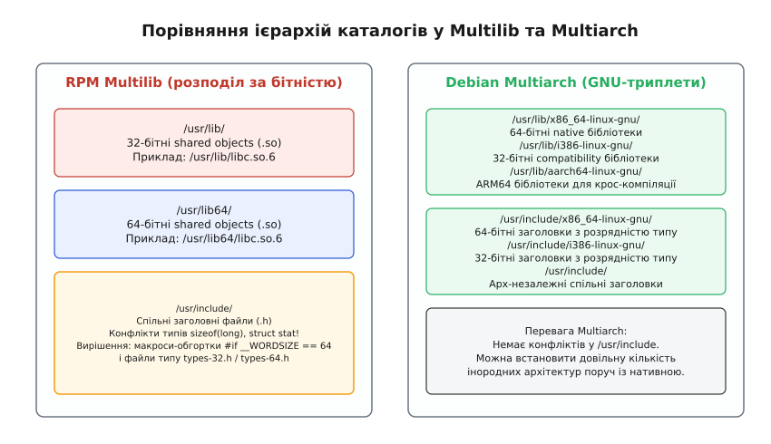
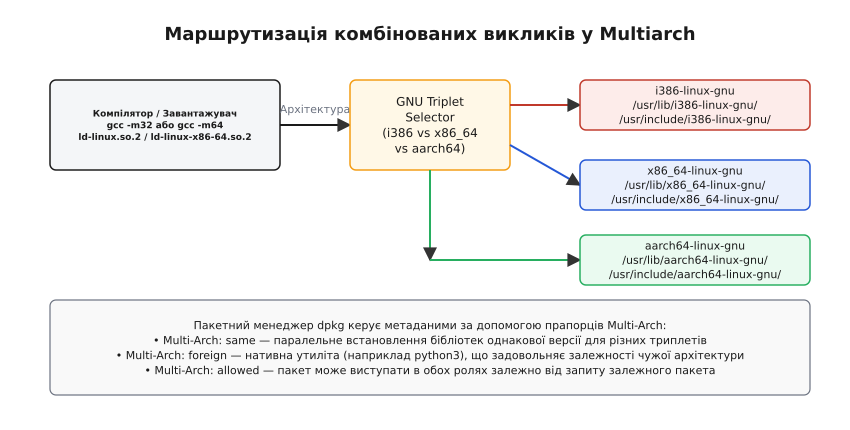

# Multilib і multiarch: два комплекти бібліотек в одній ієрархії

<preknowlist>
- [Структура FHS](root:sys-unix/fhs-layout) — призначення каталогів /lib, /usr/lib, /usr/include та базові правила ієрархії Unix.
- [Модель пакетного менеджера](root:sys-unix/package-manager-model) — база даних встановлених файлів, відстеження залежностей і виявлення конфліктів шляхів.
</preknowlist>

У 2003 році випуск перших 64-бітних процесорів архітектури x86_64 (AMD Opteron) поставив розробників операційних систем перед жорстким апаратним ультиматумом: 64-бітне ядро Linux повинно було одночасно виконувати новий 64-бітний системний код та існуючі 32-бітні бінарні додатки x86 з нативною швидкістю процесора. Ядро Linux успішно розв'язало свою частину завдання через шар емуляції системних викликів `ia32_emulation`, який відображав 32-бітні параметри викликів у 64-бітні структури даних ядра. Однак у просторі користувача (userspace) виник нездоланний тупик: виконуваний файл принципово не може завантажити у свій адресний простір динамічну бібліотеку з іншою розрядністю, а стандартна файлова система Unix не передбачала збереження двох різних версій одного й того самого файлу бібліотеки `libc.so.6` за одним шляхом `/usr/lib/libc.so.6`.

Розв'язання цієї проблеми розкололо світ Linux-дистрибутивів на дві фундаментальні архітектурні парадигми: **Multilib** (прийнятий переважно у дистрибутивах на базі RPM, таких як Red Hat Enterprise Linux, Fedora та SUSE) та **Multiarch** (стандарт, розроблений спільнотою Debian та Ubuntu).


*Порівняння розташування файлів у системи RPM Multilib та Debian Multiarch.*

## 1. Анатомія несумісності: Чому не можна просто об'єднати бібліотеки

Щоб зрозуміти, чому операційній системі потрібні окремі комплекти бібліотек, необхідно розглянути процес завантаження двовікових бінарних файлів на рівні апаратного забезпечення процесора, структури файлів ELF (Executable and Linkable Format), ядра Linux та динамічного завантажувача `ld.so`.

### Апаратний рівень процесора та перемикання режимів Long Mode
Процесори архітектури x86_64 (AMD64 / Intel 64) функціонують у 64-бітному режимі **Long Mode**, який вмикається встановленням біта `LME` (Long Mode Enable) у системному регістрі `EFER` (Extended Feature Enable Register). Режим Long Mode ділиться на два апаратні підрежими:
1. **64-bit Mode:** Використовується нативними 64-бітними програмами. Сегментний регістр коду `CS` має встановлений біт `L` (Long Mode flag = 1). У цьому режимі доступні всі 16 регістрів загального призначення (`rax`, `rbx`, `rcx`, `rdx`, `rsi`, `rdi`, `rbp`, `rsp`, та `r8`–`r15`), а адресація пам'яті є 64-бітною.
2. **Compatibility Mode:** Використовується для виконання 32-бітних програм x86. Сегментний регістр `CS` має біт `L = 0`. Процесор виконує 32-бітні інструкції з нативною швидкістю, обмежуючи адресний простір 4 гігабайтами та використовуючи 32-бітні регістри (`eax`, `ebx`, `ecx`, `edx`, `esi`, `edi`, `ebp`, `esp`).

### Ядерна обробка системних викликів (`ia32_emulation`)
Коли 32-бітна програма виконує системний виклик (через переривання `int 0x80` або інструкцію `sysenter`), ядро Linux приймає виклик через спеціальну точку входу `entry_INT80_compat` або `entry_SYSCALL_compat` (у вихідному коді ядра `arch/x86/entry/entry_64.S`). 

Ядро автоматично здійснює нульове розширення (zero-extension) 32-бітних регістрів у 64-бітні регістри ядра та перенаправляє виклик на таблицю `ia32_sys_call_table`. Якщо системний виклик передає структури даних із вказівниками чи часовими мітками (наприклад `struct timeval` або `struct stat64`), ядро використовує спеціальні шарніри сумісності `compat_sys_*`, які конвертують 32-бітній вирівняні макети пам'яті у нативні 64-бітні структури ядра.

### Формат ELF та обмеження завантажувача у просторі користувача
Незважаючи на те, що ядро прозоро підтримує обидва типи бінарників, у просторі користувача співіснування 32-бітних та 64-бітних кодових баз в одному процесі є неможливим.

Кожен бінарний виконуваний файл у Linux містить у своєму заголовку магічні байти та поле `e_machine`, яке чітко визначає цільову архітектуру процесора:
- Для 32-бітних програм x86 значення поля становить `EM_386` (код `3`).
- Для 64-бітних програм x86_64 значення поля становить `EM_X86_64` (код `62`).
- Для 64-бітних програм ARM64 значення поля становить `EM_AARCH64` (код `183`).

Коли функція ядра `execve()` зчитує заголовок ELF-файлу, вона визначає потрібний інтерпретатор динамічного лінкера, записаний у секції `.interp`. Для 32-бітного файлу x86 це зазвичай `/lib/ld-linux.so.2`, а для 64-бітного x86_64 — `/lib64/ld-linux-x86-64.so.2`.

Завантажувач мапить бінарний файл у пам'ять і починає рекурсивний пошук залежних динамічних бібліотек (`.so` файлів), перелічених у секціях `DT_NEEDED`. При спробі викликати системну функцію `dlopen()` або зв'язати програму з бібліотекою іншої розрядності (наприклад, спроба 64-бітного процесу завантажити 32-бітний shared object) динамічний лінкер негайно перериває виконання з фатальною помилкою:

```text
ELF load command alignment offset error: wrong ELF class: ELFCLASS32
```

Формат вказівників, розмір таблиць віртуальних функцій (vtable), розрядність регістрів процесора та розміри базових типів даних C розходяться на рівні мови збірки:
- На 32-бітній архітектурі (модель пам'яті ILP32): `sizeof(int) = 4`, `sizeof(long) = 4`, `sizeof(void*) = 4` байти.
- На 64-бітній архітектурі (модель пам'яті LP64): `sizeof(int) = 4`, `sizeof(long) = 8`, `sizeof(void*) = 8` байтів.

Спроба передати 32-бітний вказівник у 64-бітну функцію без вирівнювання або контекстного перетворення призведе до руйнування стеку або помилки сегментації (Segmentation Fault). Отже, кожна програма вимагає повноцінного дерева залежностей, зібраного саме під її ABI (Application Binary Interface).

Історичні передумови появи двох паралельних бінарних світів та процес вибору між ними детально описані у файлі [Історія AMD64 та поява Multiarch](root:sys-unix/multilib-multiarch/hist-amd64-and-multiarch.md).

## 2. Підхід Multilib: Фізичний поділ за бітністю та макросні обгортки

Підхід **Multilib** став першою прагматичною відповіддю на появу 64-бітних процесорів x86_64. Його було розроблено в дистрибутивах SuSE та Red Hat для підтримки двоархітектурних систем (bi-arch).

### Структура каталогів у Multilib

Філософія Multilib полягає в тому, що система ділить класичні шляхи файлової системи на основі бітної розрядності:
- Каталоги `/lib` та `/usr/lib` зберігаються як вмістище для 32-бітних бібліотек (іноді 32-бітні бібліотеки переносяться у `/lib32` та `/usr/lib32`).
- Створюються нові паралельні каталоги `/lib64` та `/usr/lib64` для нативних 64-бітних бібліотек.

Динамічний завантажувач `ldconfig` налаштовується таким чином, щоб шукати 64-бітні бібліотеки в `/lib64` та `/usr/lib64`, а 32-бітні — в `/lib` та `/usr/lib`.

```text
/usr/
├── lib/
│   ├── libc.so.6         [32-бітний ELFCLASS32]
│   └── libz.so.1         [32-бітний ELFCLASS32]
├── lib64/
│   ├── libc.so.6         [64-бітний ELFCLASS64]
│   └── libz.so.1         [64-бітний ELFCLASS64]
└── include/
    └── zlib.h            [Спільний заголовний файл]
```

### Проблема заголовних файлів у Multilib

Розділення `.so` файлів по каталогах `/lib` та `/lib64` вирішує проблему виконання програм, але створює серйозний бар'єр для розробників ПЗ, яким потрібно компілювати кодову базу під обидві архітектури.

Заголовні файли C/C++ у каталозі `/usr/include` залежать від розрядності системи. Наприклад, структура даних `struct stat` або визначення типів у `<sys/types.h>` містять поля, чий розмір або зміщення змінюються залежно від того, чи компілюється код із прапорцем `-m32` чи `-m64`.

Оскільки каталогу `/usr/include64` у FHS відсутній, пакетний менеджер RPM стикається з конфліктом файлів під час спроби одночасного встановлення пакетів `glibc-devel.i686` та `glibc-devel.x86_64`. 

Мейнтейнери RPM-дистрибутивів розв'язують цю проблему через **макросні обгортки (header wrappers)**. Під час збирання пакета оригінальні заголовні файли перейменовуються на відповідно архітектурні суфікси:
- 32-бітна версія стає `/usr/include/gnu/stubs-32.h`
- 64-бітна версія стає `/usr/include/gnu/stubs-64.h`

Після цього створюється спільний файл-заглушка `/usr/include/gnu/stubs.h`, який використовує макроси препроцесора C для вибору потрібного файлу на етапі компіляції:

```c
#include <bits/wordsize.h>

#if __WORDSIZE == 32
# include <gnu/stubs-32.h>
#elif __WORDSIZE == 64
# include <gnu/stubs-64.h>
#else
# error "Невідома розрядність процесора"
#endif
```

### Управління пакунками та ліміти Multilib

У пакетних менеджерах `yum` та `dnf` пакети різних архітектур розрізняються архітектурним суфіксом:

```bash
dnf install libpng.x86_64
dnf install libpng.i686
```

Якщо 32-бітний та 64-бітний пакети містять однакові архітектурно-незалежні файли (наприклад, документацію у `/usr/share/doc` або мануали у `/usr/share/man`), RPM перевіряє їх на абсолютну бінарну ідентичність і дозволяє обом пакетам спільно володіти цими файлами. Якщо ж файли відрізняються (наприклад, бінарні утиліти у `/usr/bin`), RPM видає помилку конфлікту файлів, змушуючи мейнтейнерів видаляти 32-бітні бінарні утиліти з пакетів `i686`.

Головне лімітування Multilib — відсутність масштабованості. Коли виникає потреба підтримувати більше ніж дві ABI (наприклад x86_64, i386, x32 ABI, ARM64, ARMhf), система каталогів перетворюється на хаос із `/lib32`, `/lib64`, `/libx32`, `/libarmhf`, що ламає стандартизацію FHS і вимагає велетенської ручної роботи з перейменування заголовних файлів.

## 3. Підхід Multiarch: Абсолютна ідентифікація через GNU-триплети

Спільнота Debian розробила концептуально інше рішення під назвою **Multiarch**. Його мета — зробити підтримку довільної кількості архітектур стандартною властивістю файлової системи та пакетного менеджера без прив'язки до слів "32" або "64".

### GNU-триплети як основа ієрархії

Замість створення каталогів за розрядністю, Multiarch використовує канонічні **GNU-триплети** (GNU Triplets) — стандартизовані рядки опису цільової платформи.

Основними триплетами є:
- `x86_64-linux-gnu` — 64-бітна архітектура x86_64.
- `i386-linux-gnu` — 32-бітна архітектура x86.
- `aarch64-linux-gnu` — 64-бітна архітектура ARM64.
- `arm-linux-gnueabihf` — 32-бітна архітектура ARM з апаратним плаваючим котиком.

Усі архітектурно-залежні бібліотеки переміщуються у відповідні підкаталоги триплетів:

```text
/usr/lib/
├── x86_64-linux-gnu/
│   ├── libc.so.6
│   └── libz.so.1
├── i386-linux-gnu/
│   ├── libc.so.6
│   └── libz.so.1
└── aarch64-linux-gnu/
    └── libc.so.6
```

Найголовніша новація Multiarch полягає в тому, що **каталог `/usr/include` піддається такій самій трансформації**:

```text
/usr/include/
├── x86_64-linux-gnu/
│   └── bits/
│       └── wordsize.h    [64-бітний варіант]
├── i386-linux-gnu/
│   └── bits/
│       └── wordsize.h    [32-бітний варіант]
└── zlib.h                [Архітектурно-незалежний спільний заголовок]
```


*Схема обробки запитів компілятора та завантажувача у середовищі Multiarch.*

### Інтеграція з тулчейном компіляції

Компілятори GCC та Clang у дистрибутивах із підтримкою Multiarch модифіковані на рівні конфігурації за замовчуванням (GCC spec files). 

Коли розробник викликає `gcc -m32 main.c`, компілятор автоматично додає до списку пошуку заголовків каталоги у відповідному порядку:
1. `/usr/include/i386-linux-gnu`
2. `/usr/include`

Під час виклику `gcc main.c` (нативний 64-бітний режим) компілятор шукає заголовки в:
1. `/usr/include/x86_64-linux-gnu`
2. `/usr/include`

Це повністю знімає потребу у створенні макросних обгорток. Заголовні файли встановлюються у свої триплетні каталоги без жодних модифікацій вихідного коду бібліотек.

### Механіка пакетного менеджера dpkg

У дистрибутивах Debian та Ubuntu пакетний менеджер `dpkg` підтримує одночасну наявність пакетів з однаковим іменем, але різними архітектурами. База даних встановлених пакетів у `/var/lib/dpkg/status` та списки файлів у `/var/lib/dpkg/info/<pkg>:<arch>.list` відстежують точну архітектурну прив'язку кожного файла.

Активація додаткової архітектури виконується однією командою:

```bash
dpkg --add-architecture i386
apt-get update
apt-get install libz1:i386
```

Поведінка пакетів регулюється спеціальним полем `Multi-Arch:` у метаданих пакета:

1. **`Multi-Arch: same`** — Пакет містить бібліотеки, розміщені у триплетних каталогах (`/usr/lib/<triplet>/`). Пакети `libz1:amd64` та `libz1:i386` можуть бути встановлені в систему одночасно за умови, що їхні версії збігаються до останнього випуску.
2. **`Multi-Arch: foreign`** — Пакет надає архітектурно-незалежну послугу або інструмент (наприклад `python3`, `coreutils`, `make`). Встановлений `python3:amd64` повністю задовольняє залежність пакета `foo:i386` або `foo:armhf`.
3. **`Multi-Arch: allowed`** — Пакет може задовольняти залежності як нативний або як чужорідний, залежно від того, як його запитує залежний пакет (через синтаксис `pkg:any`).

Повний довідник прапорців та триплетів наведено у файлі [Інтерфейси триплетів та конфігурація ld.so](root:sys-unix/multilib-multiarch/api-triplet-and-ldconfig.md).

## 4. Порівняльний аналіз: Multilib проти Multiarch

Обидва підходи виконують головну функцію — забезпечення виконання коду різних архітектур, проте роблять це з різним рівнем архітектурної чистоти та операційних витрат.

| Критерій | RPM Multilib | Debian Multiarch |
| :--- | :--- | :--- |
| **Структура каталогів** | `/lib` та `/lib64` | `/usr/lib/<triplet>` |
| **Збереження заголовків (.h)** | Макросні обгортки в `/usr/include` | Розділені каталоги `/usr/include/<triplet>` |
| **Масштабованість (N-архітектур)** | Низька (обмежена bi-arch / tri-arch) | Необмежена (будь-які триплети GNU) |
| **Крос-компіляція** | Вимагає створення окремого `sysroot` | Встановлення бібліотек цілі прямо у систему (`:armhf`) |
| **Обробка утиліт `*-config`** | Конфлікти або перейменування у `/usr/bin` | Обгортки триплетів (`x86_64-linux-gnu-pkg-config`) |
| **Складність реалізації** | Висока трудовіддача мейнтейнерів | Висока складність початкової патчингу тулчейну |

### Тріумф Multiarch у крос-компіляції

Найбільша практична перевага Multiarch розкривається під час крос-компіляції (cross-compilation) програм для вбудованих систем (ARM, RISC-V, MIPS).

У традиційній системі Multilib для компіляції додатка під ARM64 на сервері x86_64 розробнику доводилося створювати ізольоване середовище `sysroot` (chroot або ізольований каталог), куди розпаковувалися всі 64-бітні бібліотеки ARM64 та їхні заголовкові файли.

У системі Multiarch розробник просто виконує:

```bash
dpkg --add-architecture arm64
apt-get update
apt-get install libssl-dev:arm64 gcc-aarch64-linux-gnu
```

Бібліотеки `libssl.so` потрапляють у `/usr/lib/aarch64-linux-gnu/`, а заголовні файли — у `/usr/include/aarch64-linux-gnu/`. Крос-компілятор `aarch64-linux-gnu-gcc` за замовчуванням звертається до цих каталогів, дозволяючи збирати складна програмні комплекси без створення віртуальних машин або ізольованих `sysroot`.

### Вирішення конфліктів конфігураційних утиліт `*-config`
Утиліти типу `curl-config`, `sdl-config` або `pkg-config` видають прапорці компілятора та лінкера для конкретної архітектури. У системі Multilib спроба одночасно встановити `libcurl-devel.i686` та `libcurl-devel.x86_64` викликає конфлікт файлу `/usr/bin/curl-config`. 

У системі Multiarch `pkg-config` підтримує триплетні підкаталоги `/usr/lib/<triplet>/pkgconfig/`. Крім того, дистрибутив надає архітектурно-кваліфіковані симлінки `/usr/bin/x86_64-linux-gnu-pkg-config` та `/usr/bin/i386-linux-gnu-pkg-config`, що повністю виключає плутанину прапорців під час збирання.

Практичну програму, яка перевіряє наявність каталогів та поведінку динамічного лінкера у вашій системі, наведено у файлі [Практична програма діагностики шляхів завантаження](root:sys-unix/multilib-multiarch/proj-multiarch-probe.md).

## 5. Практичні кейси використання: Wine, Steam та контейнеризація

На практиці з підтримкою 32-бітних бібліотек у 64-бітних операційних системах найчастіше стикаються користувачі десктопних дистрибутивів Linux.

### Сумісність із Wine та іграми Steam

Шар сумісності **Wine** (Wine Is Not an Emulator) дозволяє виконувати бінарні файли Windows у середовищі Linux. Оскільки значна частина комерційних ігор та корпоративних програм Windows розроблялися як 32-бітні додатки PE32, для їх виконання потрібен 32-бітний бінарний файл `wine` та 32-бітні версії всіх системних бібліотек Linux (X11, Vulkan, OpenGL, ALSA, PulseAudio, GnuTLS).

Для 64-бітних додатків Windows використовуватиметься 64-бітний бінарний файл `wine64`, який потребує 64-бітних системних бібліотек Linux. На двоархітектурній системі обидва екземпляри Wine функціонують паралельно у режимі WoW64 (Windows-on-Windows 64-bit), звертаючись кожен до свого каталогу бібліотек (`/usr/lib/i386-linux-gnu` та `/usr/lib/x86_64-linux-gnu`).

Аналогічно, ігровий клієнт **Steam** від компанії Valve тривалий час розповсюджувався як 32-бітний бінарний файл, а тисячі нативних ігор у каталозі Steam вимагають 32-бітних бібліотек C/C++.

У 2019 році компанія Canonical оголосила про плани припинити збирання та підтримку пакетів архітектури `i386` в Ubuntu 19.10, з метою зменшення витрат на тестування та мейнтенанс. Це викликало різкий опір з боку Valve, які заявили про припинення офіційної підтримки Ubuntu для Steam. У результаті публічних дебатів Canonical пішла на компроміс, зберігши підтримку критичної підмножини 32-бітних пакетів `i386`, необхідних для роботи Steam, Wine та застарілого корпоративного ПЗ.

### Перехід до контейнеризованих середовищ (Flatpak та OCI)

Глобальне встановлення 32-бітних бібліотек у системні каталоги `/usr/lib/i386-linux-gnu` або `/usr/lib64` ускладнює оновлення системи і підвищує ризик виникнення ситуацій "пекла залежностей" (dependency hell).

Сучасним стандартом розв'язання цієї проблеми є використання самодостатніх бандлів та контейнерів:

1. **Flatpak:** Ігрові додатки та Wine запускаються в ізольованих пісочницях, що використовують так звані Runtimes. Наприклад, Steam Flatpak завантажує додатковий runtime `org.freedesktop.Platform.Compat.i386`. Усі 32-бітні бібліотеки ізольовані у каталозі моунту Flatpak і не перетинаються із системними бібліотеками операційної системи.
2. **Docker / Podman:** 32-бітне legacy-ПЗ запускається всередині 32-бітного контейнера (наприклад базовий образ `i386/ubuntu`), який виконується на 64-бітному ядрі хост-системи без встановлення жодного 32-бітного пакета у файлову систему хоста. Крім того, механізм ядра `binfmt_misc` у поєднанні з `qemu-user-static` дозволяє прозоро виконувати контейнери ARM64 або RISC-V на x86_64 серверах.

> 🔧 **Навіщо це в реальній розробці.**
> Розуміння різниці між Multilib та Multiarch є критичним під час побудови CI/CD конвеєрів для крос-компіляції C/C++ проектів, конфігурації Docker-контейнерів збирання та підтримки сумісності зі старими бінарними модулями. У дистрибутивах Debian/Ubuntu середовище Multiarch дозволяє будувати лаконічні Dockerfile для крос-компіляції під ARM/RISC-V без потреби у велетенських крос-тулчейнах, тоді як у дистрибутивах RHEL/Fedora знання макросів RPM Multilib є обов'язковим для правильного оформлення `.spec` файлів бібліотек.

## Висновки

**Multilib** став важливим історичним містком, який дозволив світлу комп'ютингу безболісно перейти від 32-бітних процесорів до 64-бітних на початку 2000-х років. Він зберіг простоту стандарту FHS ціною високої ручної праці мейнтейнерів при вирішенні конфліктів заголовних файлів та обмеженої масштабованості.

**Multiarch** представив більш зрілу, академічно чисту та універсальну архітектуру, що базується на GNU-триплетах. Завдяки повній ізоляції бібліотек та заголовків у триплетних каталогах, Multiarch зробив крос-компіляцію та підтримку довільної кількості архітектур стандартною можливістю Linux-систем.
