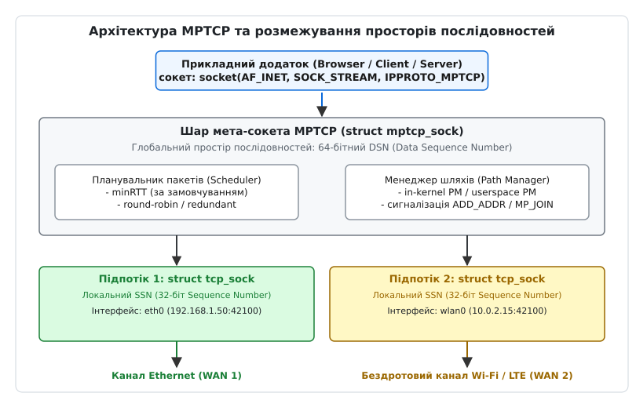
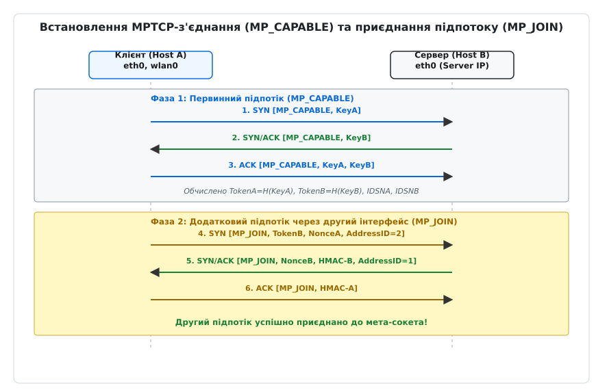
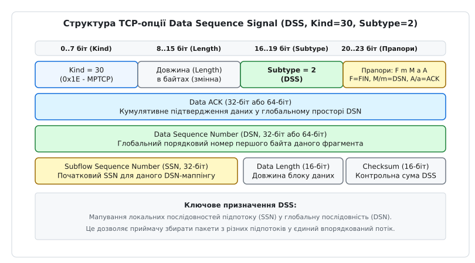
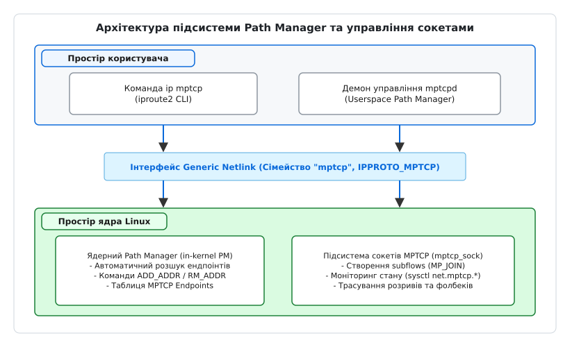

# Багатошляховий TCP (MPTCP)

<preknowlist>
- [Сокети в Linux: від дескриптора до з'єднання](root:sys-unix/socket-api-linux) — створення мережевих сокетів, життєвий цикл з'єднання та системні виклики `socket()`, `connect()`, `bind()`.
- [Інтерфейси, адреси й стан лінка](root:sys-unix/interfaces-and-addresses) — мережеві інтерфейси в ядрі Linux, призначення IP-адрес та стан мережевих пристроїв.
</preknowlist>

Якщо мобільний смартфон з увімкненими Wi-Fi та LTE виходить із зони покриття домашнього роутера під час завантаження великого файла чи відеодзвінка, класичне TCP-з'єднання миттєво розривається. Перехід на стільникову вежу змінює вихідну IP-адресу пристрою, а оскільки традиційний протокол TCP прив'язує кожен транспортний потік до незмінного кортежу з чотирьох параметрів — IP-адреси відправника, порту відправника, IP-адреси отримувача та порту отримувача (4-tuple `(src_ip, src_port, dst_ip, dst_port)`) — зміна бодай одного з них робить подальше декодування пакетів неможливим. Операційна система змушена надіслати пакет `RST`, повністю скинути стан сокета та ініціювати передачу даних з нуля.

---

## 1. Чому одного TCP замало: проблема багатодомності та одношляхового транспортного протоколу

Фундаментальна проблема класичного TCP полягає у відсутності розділення між ідентифікатором транспортного з'єднання та його мережевим маршрутом. У протокольному стеку TCP/IP, розробленому в 1970-х роках, IP-адреса одночасно виконує дві несумісні ролі: вона є **ідентифікатором вузла** (Who is this?) та **локатором у топології мережі** (Where is it?).

Коли пристрій стає багатодомним (multi-homed) — тобто має кілька фізичних або логічних мережевих інтерфейсів (наприклад, `eth0` та `wlan0` на ноутбуці, або `eth0` та `eth1` на сервері в дата-центрі) — він отримує декілька IP-адрес. Одношляховий TCP не здатний об'єднати ці ресурси для одночасної передачі даних.

Існують спроби розв'язати цю проблему на нижчих рівнях мережевого стеку, але кожна з них має суттєві обмеження:

1. **Агрегація каналів на канальному рівні L2 (Bonding / LACP 802.3ad):** 
   Вимагає, щоб усі фізичні кабелі були підключені до одного й того самого комутатора або стійки комутаторів із підтримкою LACP. Технологія абсолютно непридатна для об'єднання різнорідних каналів (наприклад, гетерогенних мереж Wi-Fi та 5G від різних провайдерів).

2. **Багатошляхова маршрутизація на мережевому рівні L3 (ECMP — Equal-Cost Multi-Pathing):** 
   Розподіляє трафік між кількома маршрутами на основі хешування 4-tuple. Проте ECMP не може розпаралелити один TCP-потік між кількома лініями (бо це спричинить перестави пакетів та хибні спрацьовування алгоритмів повторного надсилання), а також не знає про затримки й втрати пакетів на кожному з проміжних каналів WAN.

Протокол **Багатошляховий TCP (MPTCP — Multipath TCP)**, стандартизований у RFC 8684, вирішує цю задачу на транспортному рівні L4. Він запроваджує абстракцію, у якій один прикладний сокет може прозоро керувати декількома незалежними TCP-з'єднаннями, що називаються **підпотоками (subflows)**.

Докладний аналіз еволюції стандарту — від перших академічних експериментів у Бельгії та впровадження в Apple iOS до тривалого процесу інтеграції в офіційне ядро Linux — винесено в історичну вставку [Історія MPTCP: від експерименту UCLouvain до ядра Linux](root:sys-unix/multipath-tcp-mptcp/hist-mptcp-rfc6824-to-rfc8684.md).

---

## 2. Архітектура двопакетного простору й абстракція мета-сокета

Для того щоб прикладне програмне забезпечення (веб-сервер Nginx, браузер чи бази даних) могло працювати з багатошляховою мережею без переписування коду, MPTCP будується на трирівневій абстракції ядерних сокетів.

Прикладний додаток викликає системний виклик `socket(AF_INET, SOCK_STREAM, IPPROTO_MPTCP)`. У ядрі Linux створюється так званий **мета-сокет** (`struct mptcp_sock`). Для користувацького простору цей сокет виглядає як стандартний потоковий сокет TCP, але під ним ядро підтримує список зв'язаних сокетів підпотоків (`struct tcp_sock`).


*Архітектура мета-сокета MPTCP у ядрі Linux: розмежування глобального простору DSN та локальних SSN підпотоків*

Ключовим технічним проривом MPTCP є **двопакетне розділення простору порядкових номерів (Sequence Space Duality)**:

1. **Глобальний простір послідовностей даних (DSN — Data Sequence Number):**
   - 64-бітне число, що забезпечує скрізну нумерацію байтів потоку даних на рівні мета-сокета.
   - Незалежне від того, через який саме підпотік або мережевий інтерфейс буде передано конкретний байт.
   - Використовується приймачем для остаточного збирання, усунення дублікатів та впорядкування байтів перед передачею їх у буфер читання додатку (`recv()`).

2. **Локальний простір послідовностей підпотоку (SSN — Subflow Sequence Number):**
   - Стандартне 32-бітне число TCP, що належить конкретному підпотоку.
   - Кожен підпотік є повноцінним, валідним TCP-з'єднанням зі своїми власними SYN/FIN прапорами, вікном переповнення (cwnd), розрахунком RTT та алгоритмом повторного надсилання (retransmission).
   - Проміжні мережеві вузли (маршрутизатори, фаєрволи, NAT) бачать підпотік як звичайний TCP-трафік і обробляють його за стандартними правилами.

Зв'язок між глобальним DSN та локальним SSN здійснюється за допомогою спеціальної TCP-опції **Data Sequence Signal (DSS)**, яка додається до заголовків TCP-пакетів.

### 2.1 Внутрішня структура даних ядра: struct mptcp_sock та mptcp_subflow_context

У вихідному коді ядра Linux (файли `net/mptcp/protocol.h` та `net/mptcp/protocol.c`) мета-сокет описується структурою `struct mptcp_sock`:

- `conn_list`: Двозв'язний список усіх активних підпотоків (`struct mptcp_subflow_context`).
- `write_seq`: Поточне значення DSN для відправки нових байтів з боку локального додатку.
- `ack_seq`: Поточне глобальне значення Data ACK, підтверджене віддаленим приймачем.
- `rmem_fwd_alloc`: Буфер переадресації пам'яті прийому для збирання розрізнених кадрів з усіх підпотоків.
- `pm`: Структура керування станом Path Manager для даного сокета (зберігає локальний токен та список дозволених адрес).

Кожен підпотік представляє собою стандартну структуру `struct sock`, розширену ядерним контекстом `struct mptcp_subflow_context`. Цей контекст містить локальний SSN, відносний зсув DSN-маппінгу, прапор `backup`, а також вказівник назад на батьківський мета-сокет `mptcp_sock`.

---

## 3. Процедура встановлення з'єднання: MP_CAPABLE та MP_JOIN

Формування багатошляхового з'єднання відбувається у дві фази: створення первинного підпотоку та подальше динамічне приєднання додаткових підпотоків.


*Двофазний процес встановлення MPTCP: рукостискання MP_CAPABLE на первинному каналі та автентифіковане приєднання MP_JOIN на додатковому інтерфейсі*

### 3.1 Фаза 1: Оголошення можливостей (MP_CAPABLE)

Клієнт ініціює з'єднання, надсилаючи пакет `SYN` на IP-адресу сервера. У поле TCP-опцій (Kind 30) вставляється підтип `MP_CAPABLE`:

```text
Client -> Server: SYN  [MP_CAPABLE, Key-A]
```

- `Key-A`: 64-бітне випадкове криптографічне число, згенероване клієнтом.

Якщо сервер підтримує MPTCP, він відповідає пакетом:

```text
Server -> Client: SYN/ACK [MP_CAPABLE, Key-B]
```

- `Key-B`: 64-бітне випадкове число сервера.

Після обміну третім пакетом (`ACK`) обидва вузли обчислюють 32-бітний **Токен з'єднання (Token)** та початкові значення DSN шляхом хешування переданих ключів за допомогою криптографічної функції SHA-256:

```text
Token-A = Truncate-32(SHA256(Key-A))
Token-B = Truncate-32(SHA256(Key-B))

Initial-DSN-A = Truncate-64(SHA256(Key-A))
Initial-DSN-B = Truncate-64(SHA256(Key-B))
```

Токен стає глобальним унікальним ідентифікатором даного MPTCP-мета-сокета. Ключі `Key-A` та `Key-B` зберігаються у пам'яті ядра й надалі використовуються для генерації HMAC-підписів при додаванні нових підпотоків.

#### Механізм прозорого фолбеку (Fallback)
Якщо сервер не підтримує MPTCP, або якщо проміжний фаєрвол стрирає TCP-опцію `MP_CAPABLE` із SYN-пакета, сервер відповість звичайним пакетом `SYN/ACK` без опції MPTCP. Клієнтське ядро Linux негайно фіксує відсутність опції й **прозоро переключає сокет у режим звичайного одношляхового TCP**. Додаток продовжує працювати без жодних помилок чи винятків.

### 3.2 Фаза 2: Приєднання додаткового підпотоку (MP_JOIN)

Коли клієнт виявляє додатковий мережевий інтерфейс (наприклад, активується `wlan0` із новою IP-адресою), його ядро ініціює новий триетапний handshake до сервера, але вже з опцією `MP_JOIN`:

```text
1. Client -> Server (via wlan0): 
   SYN [MP_JOIN, Token-B, Nonce-A, Address-ID=2]

2. Server -> Client: 
   SYN/ACK [MP_JOIN, Nonce-B, HMAC-B, Address-ID=1]

3. Client -> Server: 
   ACK [MP_JOIN, HMAC-A]
```

Параметри обміну:
- `Token-B`: Токен сервера, обчислений на першій фазі. Дозволяє серверу миттєво знайти потрібний `struct mptcp_sock` у базі даних ядерних сокетів.
- `Nonce-A`, `Nonce-B`: Випадкові 32-бітні числа для захисту від атак повторного відтворення (replay attacks).
- `HMAC-B`, `HMAC-A`: Хеш-підписи HMAC-SHA256, обчислені над загальними ключами `Key-A`, `Key-B` та `Nonce`. Це гарантує, що зловмисник, який не знає початкових ключів `MP_CAPABLE`, не зможе вклинитися й приєднати чужий підпотік до існуючої MPTCP-сесії (захист від підробок та перехоплення).

---

## 4. Формат TCP-опцій та сигнали керування

Усі метадані MPTCP передаються у стандартному полі TCP Options заголовка TCP. Для цього використовується офіційно виділений IANA номер опції **Kind 30 (0x1E)**. Перші 4 біти вмісту опції визначають її **Subtype (підтип)**.

### 4.1 Сигнал мапування даних DSS (Data Sequence Signal, Subtype 2)

DSS є найважливішою опцією, що передається у кожному пакеті даних активного підпотоку.


*Структура заголовка TCP-опції Data Sequence Signal (DSS): мапування глобального DSN у локальний SSN підпотоку*

Структура полів DSS:
- **Kind (8 біт):** Завжди `30`.
- **Length (8 біт):** Довжина опції в байтах (залежить від встановлених прапорів, від 4 до 28 байт).
- **Subtype (4 біти):** Значення `2` (DSS).
- **Flags (4 біти):**
  - `A` (Data ACK 8-octet): Увімкнено 64-бітне кумулятивне підтвердження даних.
  - `a` (Data ACK 4-octet): Увімкнено 32-бітне підтвердження даних.
  - `M` (DSN 8-octet): Увімкнено 64-бітний DSN та 32-бітний SSN.
  - `m` (DSN 4-octet): Увімкнено 32-бітний DSN та 32-бітний SSN.
  - `F` (DATA_FIN): Позначає кінець передачі даних на рівні всього MPTCP-з'єднання (аналог FIN для мета-сокета).
- **Data ACK (32 або 64 біти):** Глобальне кумулятивне підтвердження отриманих байтів у просторі DSN по всіх підпотоках.
- **Data Sequence Number (DSN, 32 або 64 біти):** Глобальний порядковий номер першого байта навантаження даного пакета.
- **Subflow Sequence Number (SSN, 32 біти):** Початковий локальний порядковий номер підпотоку для даного блоку даних.
- **Data Length (16 біт):** Довжина блоку даних у байтах, для якого є дійсним дане мапування `(DSN -> SSN)`.

### 4.2 Сигнали динамічної оркестрації адрес

Таблиця нижче підсумовує службові опції керування станом підпотоків:

| Назва опції | Subtype | Функціональне призначення |
| :--- | :--- | :--- |
| `ADD_ADDR` | `3` | Оголошує віддаленому вузлу про наявність нової локальної IP-адреси та порту без негайного відкриття підпотоку. Отримувач може використати цю адресу для ініціації `MP_JOIN`. |
| `RM_ADDR` | `4` | Повідомляє про видалення IP-адреси (наприклад, при вимкненні Wi-Fi). Отримувач негайно закриває пов'язані з цією адресою підпотоки. |
| `MP_PRIO` | `5` | Змінює пріоритет підпотоку. Дозволяє позначити підпотік як `backup` (резервний). |
| `MP_FAIL` | `6` | Використовується при виявленні рассинхронізації DSN чи модифікації payload middlebox-пристроєм. Ініціює негайний фолбек. |
| `MP_FASTCLOSE` | `7` | Аварійне закриття всього MPTCP-з'єднання на всіх підпотоках (еквівалент `RST` для мета-сокета). |

---

## 5. Підсистеми ядра Linux: Path Manager та Планувальник пакетів

У ядрі Linux розробка MPTCP розбита на дві автономні підсистеми: **Менеджер шляхів (Path Manager)** та **Планувальник пакетів (Packet Scheduler)**.


*Архітектура підсистеми Path Manager у ядрі Linux: взаємодія команд CLI ip mptcp, демона mptcpd та інтерфейсу Generic Netlink*

### 5.1 Менеджер шляхів (Path Manager — PM)

Path Manager відповідає за стратегію виявлення мережевих інтерфейсів, прийняття рішень про створення нових підпотоків та обробку вхідних опцій `ADD_ADDR`.

У ядрі Linux підтримується два режими PM (параметр `sysctl net.mptcp.pm_type`):

1. **Ядерний менеджер (`in-kernel PM`, `pm_type = 0`):**
   - Працює повністю всередині ядра Linux.
   - Використовує стаційну таблицю ендпоінтів, що налаштовується адміністратором за допомогою команди `ip mptcp endpoint`.
   - Автоматично надсилає `ADD_ADDR` або створює `MP_JOIN` підпотоки при появі нових інтерфейсів відповідно до заданих лімітів `ip mptcp limits`.

2. **Користувацький менеджер (`userspace PM`, `pm_type = 1`):**
   - Передає контроль над створення підпотоків юзерспейсному демону `mptcpd` або кастомному оркестратору.
   - Спілкування з ядром виконується через спеціалізоване сімейство **Generic Netlink** (протокол `"mptcp"`).
   - Демон отримує сповіщення про створення сокетів (`MPTCP_EVENT_CREATED`) та зміни мережевих адрес і самостійно вирішує, для яких саме сокетів і коли створювати нові підпотоки.

Повний синтаксис команд `ip mptcp`, деталізована специфікація Generic Netlink та таблиця параметрів `sysctl` наведені в довіднику [Мережевий інтерфейс Netlink та параметри sysctl для MPTCP](root:sys-unix/multipath-tcp-mptcp/api-netlink-mptcp.md).

### 5.2 Планувальник пакетів (Packet Scheduler) та розширення eBPF

Коли додаток викликає `write()` або `send()`, дані потрапляють у загальний буфер запису мета-сокета `mptcp_sock`. Планувальник відповідає за прийняття рішення: **у чергу якого саме з активних підпотоків покласти наступний блок даних**.

У ядрі Linux реалізовано наступні базові алгоритми планування:
- **`minRTT` (Default Scheduler):** Вибирає підпотік із найменшим круговим часом затримки (Round-Trip Time). Пакети надсилаються в цей підпотік доти, доки його вікно переповнення (`cwnd`) не заповниться повністю. Після цього надлишок трафіку розлітається у підпотік із наступним найменшим RTT. Це забезпечує мінімальну загальну затримку з'єднання.
- **`round-robin`:** Циклічно розподіляє блоки даних між усіма доступними підпотоками рівномірно.
- **`redundant`:** Дублює всі дані одночасно через усі доступні підпотоки. Споживає вдвічі більше трафіку, але забезпечує абсолютну відмовостійкість і нульовий час переключення (zero-failover latency) для критичних систем реального часу.

#### Інтеграція з eBPF у сучасних ядрах Linux (5.19+)
Починаючи з ядра Linux 5.19, розробники додали підтримку створення програмованих планувальників MPTCP за допомогою підсистеми **eBPF (`struct_ops`)**. Розробник мережевих програм може написати та завантажити в ядро eBPF-програму типу `bpf_mptcp_sched_ops`, яка аналізує втрати, затримки та черги сокета в реальному часі й динамічно змінює алгоритм розподілу пакетів без перекомпіляції ядра.

---

## 6. Сполучений регулятор перевантаження (Coupled Congestion Control)

Якщо запустити стандартний алгоритм регулювання перевантажень TCP (наприклад, Cubic або Reno) незалежно на кожному підпотоці MPTCP, виникне фундаментальна **проблема несправедливості (Unfairness Problem)**.

Уяви ситуацію: через один і той самий маршрутизатор із обмеженою пропускною здатністю проходять два користувачі. Користувач А має звичайне TCP-з'єднання (1 потік). Користувач Б має MPTCP-з'єднання з 3 підпотоками. Якщо кожен із 3 підпотоків користувача Б поводитиметься як незалежний TCP-потік, користувач Б захопить 75% смуги пропускання каналу, витіснивши користувача А.

Для вирішення цієї проблеми специфікація RFC 6356 запровадила **Сполучене керування перевантаженням (Coupled Congestion Control)**.

MPTCP формулює три принципи справедливості:
1. **Поліпшення пропускної здатності:** Багатошляхове з'єднання має отримувати не меншу швидкість, ніж одношляхове TCP-з'єднання на найкращому з доступних каналів.
2. **Непогіршення стану мережі (Fairness):** На жодному спільному каналі MPTCP-з'єднання не повинно витискати більше ресурсів, ніж одне звичайне TCP-з'єднання.
3. **Зсув навантаження (Resource Pooling):** MPTCP повинен автоматично перераховувати коефіцієнти зростання вікна й перекидати трафік із завантажених каналів на вільніші.

Математично це досягається шляхом пов'язаного збільшення вікна переповнення (`cwnd[i]`) для кожного підпотоку `i`.

Під час отримання підтвердження (ACK) на підпотоці `i`, замість стандартного збільшення вікна на `1/cwnd[i]`, алгоритм **LIA (Linked Increases Algorithm)** розраховує приріст за формулою:

```text
               cwnd[i]
Δ cwnd[i] = min( ───────────── ,  1 )
               Σ cwnd[k]
```

де `Σ cwnd[k]` — сума вікон переповнення всіх активних підпотоків MPTCP-з'єднання.

Крім LIA, у ядрі Linux застосовуються більш сучасні сполучені алгоритми:
- **OLIA (Opportunistic Linked Increases Algorithm):** Усуває коливання зсуву трафіку та забезпечує оптимальне використання смуги при різких змінах RTT.
- **BALIA (Balanced Linked Adaptation Algorithm):** Досягає найкращого балансу між стійкістю алгоритму та швидкістю реагування на втрати пакетів.

---

## 7. Сокетний інтерфейс та приклади програмування

Для створення MPTCP-сокета у просторі користувача використовується стандартний системний виклик `socket()` із зазначенням константи `IPPROTO_MPTCP`:

:::tabs
```c
#include <sys/socket.h>
#include <netinet/in.h>

int fd = socket(AF_INET, SOCK_STREAM, IPPROTO_MPTCP);
```
```cpp
#include <sys/socket.h>
#include <netinet/in.h>

int fd = ::socket(AF_INET, SOCK_STREAM, IPPROTO_MPTCP);
```
:::

### Моніторинг стану через `getsockopt`

За допомогою сокетного рівня `SOL_MPTCP` (значення `284`) та опції `MPTCP_INFO` додаток може опитати ядро про стан підпотоків та фолбеку:

:::tabs
```c
#define SOL_MPTCP 284
#define MPTCP_INFO 1

struct mptcp_info info;
socklen_t len = sizeof(info);

if (getsockopt(fd, SOL_MPTCP, MPTCP_INFO, &info, &len) == 0) {
    printf("Кількість підпотоків: %u\n", info.mptcpi_subflows);
}
```
```cpp
constexpr int kSolMptcp = 284;
constexpr int kMptcpInfo = 1;

struct mptcp_info info{};
socklen_t len = sizeof(info);

if (::getsockopt(fd, kSolMptcp, kMptcpInfo, &info, &len) == 0) {
    std::cout << "Кількість підпотоків: " << static_cast<int>(info.mptcpi_subflows) << '\n';
}
```
:::

Готовий до збірки, повноцінний вихідний код клієнтської програми на мовах C (POSIX C99) та C++ (C++20 із вживанням RAII, `std::expected` та строкової безпеки) детально розібрано у практичному проєкті [Створення MPTCP-сокета та інспекція підпотоків у C та C++](root:sys-unix/multipath-tcp-mptcp/proj-mptcp-socket-client.md).

---

## 8. Практичні виклики, middlebox-пастки та продуктивність

Незважаючи на високу гнучкість, реальне розгортання MPTCP стикається з низкою апаратних та мережевих пасток.

### 8.1 Втручання проміжних вузлів (Middlebox Interference)

Багато корпоративних фаєрволів, NAT-роутерів та пристроїв Deep Packet Inspection (DPI) некоректно обробляють невідомі TCP-опції:
- **Вирізання опцій (Option Stripping):** Проміжний пристрій пропускає TCP-пакет, але повністю очищає поле TCP Options. MPTCP виявляє це під час рукостискання й виконає автоматичний фолбек на звичайний TCP.
- **Переписування порядкових номерів (Sequence Number Rewriting):** Деякі NAT-пристрої змінюють 32-бітний SSN у TCP-заголовку, але не знають про DSN усередині опції DSS. Наймасштабніша проблема виникає, коли NAT розриває та перезбирає TCP-потік. Якщо MPTCP виявляє некоректний маппінг DSN/SSN, ядро надсилає опцію `MP_FAIL` і скидає підпотік.

### 8.2 Проблема блокування головки черги (Head-of-Line Blocking)

Якщо MPTCP об'єднує два підпотоки з радикально різними характеристиками — наприклад, волоконно-оптичний канал (RTT = 5 мс, втрати = 0%) та супутниковий канал (RTT = 600 мс, втрати = 2%) — виникає ефект **HOL blocking**.

Якщо один пакет втрачається на повільному підпотоці, приймальний буфер мета-сокета `mptcp_sock` не може передати наступні пакети (навіть якщо вони давно прибули через швидкий підпотік) додатку, оскільки TCP зобов'язаний видавати впорядкований потік байтів. Це призводить до роздування прийомного буфера (**Bufferbloat**) та падіння продуктивності.

Для боротьби з цим ефектом у ядрі Linux застосовується системний тюнінг розширення приймального буфера (`net.ipv4.tcp_rmem`), а також виважене налаштування ліміту втрат `net.mptcp.stale_loss_cnt`, що дозволяє ядру вчасно тимчасово заморожувати застарілі підпотоки.

---

## 9. Висновок

Multipath TCP докорінно змінює парадигму мережевої взаємодії, перетворюючи жорстке одношляхове TCP-з'єднання на динамічний пучок каналів. Впровадження абстракції мета-сокета, двопакетного простору послідовностей DSN/SSN, сполученого регулювання перевантажень та нативної підтримки в ядрі Linux робить MPTCP незамінним інструментом для побудови надійних мобільних додатків, високошвидкісних сервісів дата-центрів та інфраструктури 5G.
