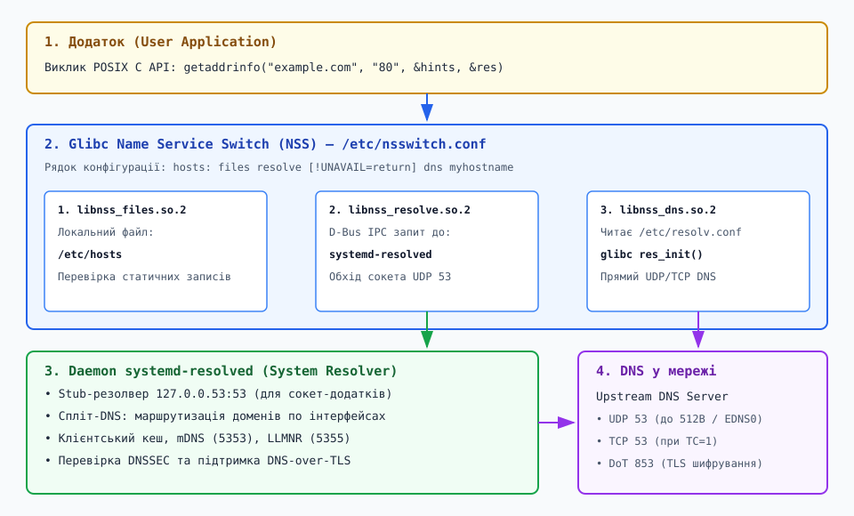
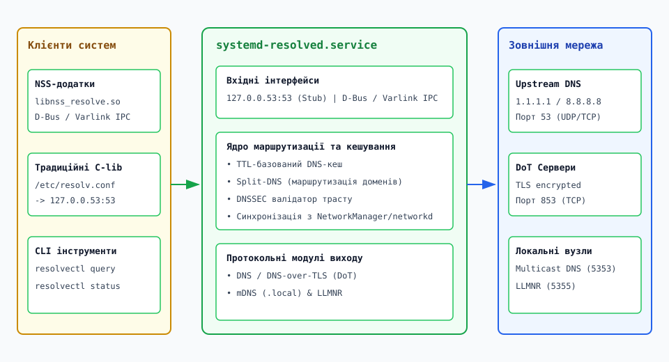

# Шлях розв'язання імені: NSS, resolv, systemd-resolved

<preknowlist>
- [Сокети в Linux: від дескриптора до з'єднання](root:sys-unix/socket-api-linux) — концепція сокетів, системні виклики socket(), connect(), bind() та адресові структури sockaddr.
- [Мережевий стек ядра Linux: архітектура та шлях пакета](root:sys-unix/network-stack-architecture) — обробка мережевих пакетів у ядрі, структури sk_buff та робота протокольних стеків.
</preknowlist>

Коли веб-сервер, поштовий клієнт або звичайна системна утиліта `curl` намагаються встановити мережеве з'єднання з вузлом `api.service.internal`, процесу потрібна двійкова IP-адреса. Мережеві адаптери та стеки протоколів ядра Linux не оперують текстовими символами: системні виклики `connect()` або `sendto()` приймають виключно 32-бітні значення IPv4 (структури `in_addr`) або 128-бітні значення IPv6 (структури `in6_addr`). 

Зовні здається, що операційна система просто бере текстове ім'я і надсилає один DNS-запит у мережу на порт 53. Однак під капотом Linux виконує складнопідрядну послідовність дій: опитує вбудовані плагіни C-бібліотеки, перевіряє локальні конфігураційні файли, розбирає правила фільтрації суфіксів, виконує міжпроцесні D-Bus виклики та сортує IP-адреси за алгоритмами RFC 6724. Навіть найменший збій на одному з цих рівнів спричиняє затримки з'єднання, падіння сервісів або затишну відмову мережі.

## 1. Точка входу POSIX API: від gethostbyname() до getaddrinfo()

Історично найпершим системним API для розв'язання імен у Unix-системах була C-функція `gethostbyname()`. Вона приймала текстове ім'я хоста і повертала вказівник на статичну структуру `struct hostent`. З розвитком мереж виявилися три фундаментальні дефекти цієї функції:

1. **Відсутність підняття IPv6:** Функція розроблялася виключно для 32-бітних IPv4-адрес. Вона не мала механізмів повернення дуальних записів (IPv4 + IPv6) для одного й того самого хоста.
2. **Небезпека для багатопотоковості (Non-reentrant):** Функція повертала вказівник на єдиний статичний внутрішній буфер у пам'яті C-бібліотеки. Якщо два потоки одного процесу одночасно викликали `gethostbyname()`, другий потік перезаписував дані першого, що викликало гонки даних (race conditions) та трудновловимі пошкодження пам'яті.
3. **Жорстко виділена пам'ять:** Програма не мала змоги передати власний буфер або обмежити типи сокетів (TCP чи UDP), що призводило до зайвих розв'язань.

У сучасному стандарті POSIX.1-2001 функцію `gethostbyname()` визнано застарілою (deprecated), а її місцем зайняла потокобезпечна та гнучка функція `getaddrinfo()`.

### Механіка роботи та сигнатура `getaddrinfo()`

Функція `getaddrinfo()` виділяє необхідні структури у динамічній пам'яті та повертає зв'язаний список структур `struct addrinfo`. Додаток передає підказочну структуру `hints`, обмежуючи пошук за протоколом, типом сокета чи сімейством адрес.

Функція приймає чотири параметри: текстове ім'я хоста, назву сервісу або порт, вказівник на фільтруючу структуру `hints` та вихідний подвійний вказівник `res`, у який зберігається голова поверненого зв'язаного списку. Якщо для хоста знайдено кілька IP-адрес (наприклад, три IPv4 та дві IPv6), `getaddrinfo()` повертає список із п'яти елементів `addrinfo`, з'єднаних через поле `ai_next`.

### Сортування адрес за правилами RFC 6724

Повернутий список IP-адрес не є випадковим. Бібліотека `glibc` автоматично сортує адреси відповідно до специфікації RFC 6724 (Default Address Selection for IPv6). Алгоритм виконує послідовні перевірки (rules) для кожного елемента списку:

* **Rule 1 (Unusable destination):** Відкидаються адреси недоступних сімейств (наприклад, IPv6-адреса, якщо в системі немає жодного IPv6-інтерфейсу з прапорцем `AI_ADDRCONFIG`).
* **Rule 2 (Matching scope):** Віддається перевага адресам з однаковим обласним типом (Scope) джерела та призначення (link-local з link-local, global з global).
* **Rule 5 (Matching label):** Віддається перевага адресам із тотожними мітками політики префіксів `/etc/gai.conf`.
* **Rule 6 (Higher precedence):** Віддається перевага адресам із вищим значенням Precedence у системній таблиці політик.
* **Rule 8 (Longest prefix match):** Для IPv6-адрес вибирається та адреса призначення, яка має найдовший спільний бітовий префікс з IP-адресою локального вихідного інтерфейсу.

Низькорівневий довідник структур даних, прапорців та кодів помилок `EAI_*` наведено у матеріалі [📋 Довідник інтерфейсів NSS, resolv.conf та systemd-resolved D-Bus](root:sys-unix/name-resolution-path/api-nss-and-resolv-interface.md).

Приклад ідіоматичного використання `getaddrinfo()` мовами C та C++ подано нижче:

:::tabs
```c
/* c_getaddrinfo.c — Використання POSIX getaddrinfo() у C */
#include <stdio.h>
#include <stdlib.h>
#include <string.h>
#include <netdb.h>
#include <arpa/inet.h>

int resolve_host(const char *hostname) {
    struct addrinfo hints;
    struct addrinfo *result = NULL;
    struct addrinfo *rp = NULL;

    memset(&hints, 0, sizeof(struct addrinfo));
    hints.ai_family = AF_UNSPEC;    /* Дозволяємо IPv4 та IPv6 */
    hints.ai_socktype = SOCK_STREAM; /* Потоковий TCP сокет */

    int s = getaddrinfo(hostname, "80", &hints, &result);
    if (s != 0) {
        fprintf(stderr, "Помилка getaddrinfo: %s\n", gai_strerror(s));
        return -1;
    }

    for (rp = result; rp != NULL; rp = rp->ai_next) {
        void *addr = NULL;
        char ipstr[INET6_ADDRSTRLEN];

        if (rp->ai_family == AF_INET) {
            struct sockaddr_in *ipv4 = (struct sockaddr_in *)rp->ai_addr;
            addr = &(ipv4->sin_addr);
        } else {
            struct sockaddr_in6 *ipv6 = (struct sockaddr_in6 *)rp->ai_addr;
            addr = &(ipv6->sin6_addr);
        }

        inet_ntop(rp->ai_family, addr, ipstr, sizeof(ipstr));
        printf("Знайдено адресу: %s (Family: %d)\n", ipstr, rp->ai_family);
    }

    freeaddrinfo(result);
    return 0;
}
```
```cpp
// cpp_getaddrinfo.cpp — Ідіоматичний C++20 варіант з RAII-обгорткою для freeaddrinfo
#include <iostream>
#include <string_view>
#include <memory>
#include <cstring>
#include <netdb.h>
#include <arpa/inet.h>

struct AddrInfoDeleter {
    void operator()(struct addrinfo* res) const noexcept {
        if (res) {
            ::freeaddrinfo(res);
        }
    }
};

using ScopedAddrInfo = std::unique_ptr<struct addrinfo, AddrInfoDeleter>;

bool resolve_host_cpp(std::string_view hostname) {
    struct addrinfo hints{};
    hints.ai_family = AF_UNSPEC;
    hints.ai_socktype = SOCK_STREAM;

    struct addrinfo* raw_res = nullptr;
    int status = ::getaddrinfo(hostname.data(), "80", &hints, &raw_res);
    if (status != 0) {
        std::cerr << "Помилка розв'язання: " << ::gai_strerror(status) << '\n';
        return false;
    }

    ScopedAddrInfo res(raw_res);

    for (const struct addrinfo* rp = res.get(); rp != nullptr; rp = rp->ai_next) {
        char ipstr[INET6_ADDRSTRLEN]{};
        const void* addr = nullptr;

        if (rp->ai_family == AF_INET) {
            auto* ipv4 = reinterpret_cast<const struct sockaddr_in*>(rp->ai_addr);
            addr = &(ipv4->sin_addr);
        } else {
            auto* ipv6 = reinterpret_cast<const struct sockaddr_in6*>(rp->ai_addr);
            addr = &(ipv6->sin6_addr);
        }

        ::inet_ntop(rp->ai_family, addr, ipstr, sizeof(ipstr));
        std::cout << "Знайдено адресу [C++]: " << ipstr << '\n';
    }

    return true;
}
```
:::

---

## 2. Name Service Switch (NSS): Диспетчеризація плагінів glibc

Одразу після того, як додаток викликає `getaddrinfo()`, бібліотека `glibc` не починає створювати мережеві сокети й не відправляє UDP-пакети. Натомість вона звертається до підсистеми Name Service Switch (NSS).

NSS — це модульний інфраструктурний шар, який дозволяє відокремити логіку системних додатків від конфігурації джерел даних. Конфігурація підсистеми зберігається у файлі `/etc/nsswitch.conf`. Історичний шлях розвитку NSS від файлу `HOSTS.TXT` до модульної архітектури детально викладено у матеріалі [📜 Від HOSTS.TXT до systemd-resolved: еволюція розв'язання імен у Unix](root:sys-unix/name-resolution-path/hist-hosts-to-systemd-resolved.md).


*Послідовність обробки запиту розв'язання імені в Linux: від виклику API додатком до NSS-модулів та мережевого DNS.*

### Структура файла `/etc/nsswitch.conf` та порядок опитування

Для бази даних хостів у файлі `/etc/nsswitch.conf` використовується рядок `hosts:`. Типовий рядок конфігурації у сучасних дистрибутивах Linux має такий вигляд:

```text
hosts: files resolve [!UNAVAIL=return] dns myhostname
```

Кожне слово відповідає за динамічний плагін C-бібліотеки вида `libnss_<назва>.so.2`. `glibc` послідовно завантажує ці плагіни за допомогою внутрішньої функції `__nss_lookup_function()`, яка під капотом виконує виклики `dlopen()` та `dlsym()`.

Розглянемо ключові модулі:

1. **`files` (`libnss_files.so.2`)**: Відкриває та зчитує локальний текстовий файл `/etc/hosts`. Завжди стоїть першим у списку, щоб забезпечити локальне перевизначення IP-адрес для розробки та системного адміністрування без мережевих запитів.
2. **`resolve` (`libnss_resolve.so.2`)**: Офіційний NSS-модуль від проекту `systemd`. Перехоплює виклики `getaddrinfo()` і передає запити безпосередньо системному демону `systemd-resolved` через міжпроцесну системну шину D-Bus.
3. **`dns` (`libnss_dns.so.2`)**: Класичний модуль розв'язання DNS. Ініціалізує внутрішній розв'язувач `glibc` (`res_init()`), зчитує файл `/etc/resolv.conf` і надсилає мережеві UDP або TCP пакети на порт 53.
4. **`myhostname` (`libnss_myhostname.so.2`)**: Гарантує, що локальне ім'я хоста (визначене у `/etc/hostname`) завжди розв'язується у локальні loopback-адреси `127.0.1.1` або `::1`, навіть якщо мережеві інтерфейси відключені або файл `/etc/hosts` порожній.
5. **`mdns4_minimal` (`libnss_mdns4_minimal.so.2`)**: Забезпечує розв'язання імен у локальних бездротових та дротових мережах для домену `.local` через протокол Multicast DNS (mDNS).

Умова `[!UNAVAIL=return]` означає: якщо модуль `resolve` доступний у системі (демон `systemd-resolved` працює і не повернув помилку `UNAVAIL`), конвеєр припиняє обробку і повертає результат, не переходячи до модуля `dns`.

Практичний покроковий посібник зі створення власного розширювального NSS-модуля мовами C та C++ подано у матеріалі [⚙️ Практикум: розробка власного NSS-модуля для Linux у C та C++](root:sys-unix/name-resolution-path/proj-nss-custom-module.md).

---

## 3. Низькорівневий DNS-резолвер glibc та /etc/resolv.conf

Якщо конвеєр NSS доходить до виконання модуля `dns` (`libnss_dns.so.2`), `glibc` ініціалізує свій внутрішній розв'язувач. При першому виклику реалізується функція `res_init()`, яка зчитує та розбирає конфігураційний файл `/etc/resolv.conf`, заповнюючи глобальну внутрішню структуру станом `_res` (`struct __res_state`).

### Аналіз конфігураційних директив `/etc/resolv.conf`

Файл `/etc/resolv.conf` містить керуючі інструкції для формування та відправки мережевих DNS-пакетів:

```text
nameserver 1.1.1.1
nameserver 8.8.8.8
search internal.corp.example.com svc.cluster.local
options ndots:5 timeout:2 attempts:2 rotate
```

Ключові директиви та їхній вплив:

* **`nameserver`**: Вказує IP-адресу DNS-сервера. Стек `glibc` підтримує до 3 серверів (`MAXNS`). Запити надсилаються послідовно на перший сервер; якщо той не відповідає протягом таймауту, запит повторюється до другого.
* **`search`**: Список доменних суфіксів (до 6 доменів), які автоматично дописуються до відносних імен.
* **`options ndots:n`**: Критично важливий параметр, що визначає поріг кількості крапок у імені. Якщо кількість крапок у запитаному імені `>= n`, ім'я спочатку пробується як абсолютне (FQDN). За замовчуванням `ndots:1`.

### Проблема підсилення запитів в Kubernetes при ndots:5

У середовищах Kubernetes стандартний файл `/etc/resolv.conf` усередині подів автоматично генерується зі значенням `options ndots:5` та списком пошуку:

```text
search default.svc.cluster.local svc.cluster.local cluster.local
options ndots:5
```

Якщо додаток усередині пода виконує виклик `getaddrinfo("api.github.com")`, ім'я містить лише дві крапки (`ndots = 2 < 5`). Через це `glibc` вважає ім'я відносним і генерує ланцюжок із 4 послідовних марних DNS-запитів, які зазнають невдачі (`NXDOMAIN`):

1. `api.github.com.default.svc.cluster.local.` -> `NXDOMAIN`
2. `api.github.com.svc.cluster.local.` -> `NXDOMAIN`
3. `api.github.com.cluster.local.` -> `NXDOMAIN`
4. `api.github.com.` -> `SUCCESS` (лише на 4-й спробі)

Це створює чотирикратне навантаження на внутрішні DNS-сервери CoreDNS та додає 10–50 мс затримки до кожного зовнішнього з'єднання. Вирішенням є додавання крапки наприкінці імені (`api.github.com.`), що робить його явним FQDN.

---

## 4. Мережеві протоколи розв'язання: UDP, TCP, EDNS0 та DoT

Після формування DNS-запитання пакети надсилаються по мережі до вказаного DNS-сервера.

### DNS поверх UDP та обробка урізання packet truncation (TC=1)

Класичний DNS працює поверх безз'єднувального протоколу UDP на порту 53. Згідно з RFC 1035, максимальний розмір двійкового DNS-пакета поверх UDP обмежено 512 байтами. Це обмеження було введено на початку 1980-х років для запобігання IP-фрагментації у мережах із малим MTU.

Якщо відповідь DNS-сервера містить багато A/AAAA записів або довгі текстові ключі TXT/DKIM і не вміщується у 512 байтів, сервер встановлює у заголовочному байті DNS-відповіді біт `TC` (Truncation = 1) і відрізає решту даних. 

Отримавши пакет із `TC=1`, розв'язувач `glibc` або `systemd-resolved` зобов'язаний негайно відкрити потоковий TCP-сокет на порт 53 того самого сервера і повторити запит по TCP-з'єднанню. TCP усуває обмеження за розміром, але вимагає виконання триетапного рукостискання (TCP Handshake), що додає цілий круг затримки (RTT).

### Розширення EDNS0 (Extension Mechanisms for DNS)

Для вирішення проблеми 512 байт у RFC 6891 було стандартизовано розширення EDNS0. Клієнт додає до розділу Additional секції DNS-пакета псевдо-запис ресурсів `OPT RR`. У цьому записі клієнт повідомляє серверу розмір свого UDP-буфера (наприклад, 4096 байтів). Якщо сервер підтримує EDNS0, він надсилає великі UDP-пакети розміром до 4096 байт без встановлення біта `TC`.

### Захищені транспорти DNS: DNS-over-TLS (DoT) та DNS-over-HTTPS (DoH)

Традиційний DNS-трафік надсилається у відкритому вигляді, що дозволяє провайдерам та зловмисникам перехоплювати та модифікувати відповді (DNS Spoofing / Hijacking).

Сучасні системні резолвери підтримують шифровані транспорти:
* **DNS-over-TLS (DoT, RFC 7858)**: Упаковує класичні DNS-пакети у захищений TLS-тунель на порту TCP 853. Підтримується нативно в `systemd-resolved`.
* **DNS-over-HTTPS (DoH, RFC 8484)**: Передає DNS-запити у тілі HTTP/2 або HTTP/3 POST-запитів на порт TCP 443, що робить DNS-трафік невідмінним від звичайного веб-трафіку.

---

## 5. Сучасна системна інфраструктура: systemd-resolved

У сучасних дистрибутивах Linux стандартом керування мережевими іменами став демон `systemd-resolved`. Він розв'язує проблему конфліктів між кількома мережевими інтерфейсами (Wi-Fi, Ethernet, VPN, Docker bridges).


*Внутрішня архітектура systemd-resolved: вхідні інтерфейси (Stub і D-Bus), ядро маршрутизації доменів та вихідні мережеві протоколи.*

### Двоканальна архітектура входу

`systemd-resolved` приймає запити через два незалежні входи:

1. **Модуль `libnss_resolve.so.2` (через D-Bus/Varlink IPC)**: Додатки, які використовують `getaddrinfo()`, спілкуються з демоном напряму через міжпроцесні виклики системної шини D-Bus, омінаючи мережевий стек сокетів.
2. **Локальний Stub-резолвер (`127.0.0.53:53`)**: Демон піднімає локальний DNS-сервер на адресі `127.0.0.53:53`. Символічне посилання `/etc/resolv.conf` вказує на `/run/systemd/resolve/stub-resolv.conf`. Це забезпечує сумісність із програмами (наприклад, написаними мовою Go або розгорнутими у контейнерах), які ігнорують NSS і парсять `/etc/resolv.conf` вручну.

### Спліт-DNS маршрутизація (Split-DNS)

Головна перевага `systemd-resolved` — можливість прив'язки DNS-серверів та доменів до конкретних мережевих інтерфейсів.

Якщо комп'ютер під'єднано до публічного Wi-Fi (`wlan0`) та корпоративного VPN (`tun0`), `systemd-resolved` створює правила маршрутизації:
* Інтерфейс `tun0`: DNS `10.0.0.1`, домен маршрутизації `~corp.example.com`.
* Інтерфейс `wlan0`: DNS `1.1.1.1`, домен за замовчуванням `.`.

Запит до `server.corp.example.com` буде відправлено виключно через сокет `tun0` на сервер `10.0.0.1`. Усі інші публічні запити будуть спрямовані через `wlan0` на `1.1.1.1`. Це усуває витік корпоративних імен у публічну мережу (DNS Leak).

---

## 6. Простеження та траблшутинг у просторі користувача й ядрі

Під час діагностики мережевих проблем важливо розуміти, чому різні утиліти можуть давати протилежні результати.

### Причина розбіжності між dig та ping/curl

Поширеною помилкою системних адміністраторів є використання утиліти `dig` або `nslookup` для перевірки того, «чому додаток не може знайти ім'я».

* **`ping` / `curl` / `git` / веб-браузери**: Виклики виконуються через `getaddrinfo()`. Вони проходять повний конвеєр NSS: перевіряють `/etc/hosts`, модуль `resolve`, `mdns4` і лише в кінці DNS.
* **`dig` / `host` / `nslookup`**: Це утиліти прямого мережевого DNS-опитування з комплексу BIND. Вони **повністю ігнорують NSS та `/etc/hosts`**. Вони читають IP-адресу з `/etc/resolv.conf` і надсилають сирий UDP-пакет напряму. Якщо ім'я прописано в `/etc/hosts`, `ping` буде працювати, а `dig` поверне помилку `NXDOMAIN`.

### Траблшутинг за допомогою resolvectl та getent

Для коректної діагностики використовується такий алгоритм:

1. **Перевірка конвеєра NSS**:
   ```bash
   getent hosts example.com
   ```
   Якщо `getent` повертає IP-адресу, значить шар C-бібліотеки та NSS налаштований і працює правильно.

2. **Перевірка стану systemd-resolved**:
   ```bash
   resolvectl status
   resolvectl query example.com
   ```
   Відображає, через який саме мережевий інтерфейс та на які DNS-сервери було відправлено запит.

3. **Низькорівневе трасування через `strace`**:
   За допомогою `strace` можна покроково побачити, які саме файли відкриває процес та які сокети створює:
   ```bash
   strace -e trace=openat,open,connect,sendto ping -c1 example.com
   ```
   У виводі буде видно послідовне відкриття `/etc/nsswitch.conf`, завантаження `/lib/x86_64-linux-gnu/libnss_files.so.2`, читання `/etc/hosts` і подальший виклик `connect()` до D-Bus сокета або UDP 53.

4. **Перевірка сокетів ядра та таблиці з'єднань conntrack**:
   На рівні ядра Linux пакет DNS пройшовши сокет `SOCK_DGRAM`, потрапляє до мережевого стеку, виконує пошук у таблиці маршрутизації (`ip route get <IP>`) та проходить крізь таблиці фаєрволу Netfilter/nftables, де створюється новий запис відстеження станів з'єднань `conntrack`.

Розуміння усього шляху розв'язання імені — від виклику `getaddrinfo()` у коді додатку до обробки `nsswitch.conf`, `resolv.conf`, D-Bus IPC та мережевих розширень EDNS0 — дає змогу інженерам швидко виявляти джерело проблем і будувати надійні системні мережі.
