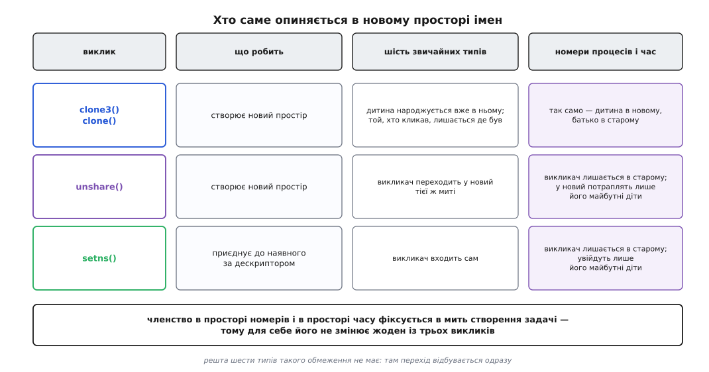
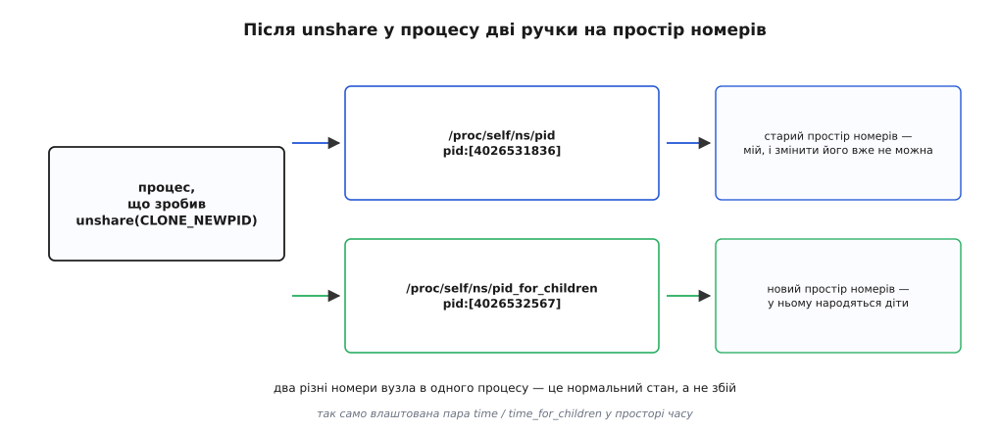

# 📋 Інтерфейси просторів імен: прапорці, виклики, файли, команди

Тут зібрано контракт, за яким простір імен створюють, у нього входять і про нього питають: вісім прапорців із номерами версій ядра, три системні виклики з повним переліком помилок, файли в `/proc`, крізь які простір налаштовують, чотири операції `ioctl` для опитування — і команди util-linux, що роблять те саме з оболонки. Довідка потрібна в мить, коли код уже пишеться і треба точно знати, що передати, чого очікувати на поверненні й з якої версії воно взагалі є.

## Вісім типів: прапорець, версія, файл

| тип | прапорець | значення | у ядрі з | що стає власним | файл у `/proc/<pid>/ns/` | вкладеність |
|---|---|---|---|---|---|---|
| монтувань | `CLONE_NEWNS` | `0x00020000` | 2.4.19 (2002) | дерево монтувань | `mnt` (з 3.8) | плоский |
| UTS | `CLONE_NEWUTS` | `0x04000000` | 2.6.19 (2006) | ім'я вузла й ім'я домену NIS | `uts` (з 3.0) | плоский |
| IPC | `CLONE_NEWIPC` | `0x08000000` | 2.6.19 (2006) | об'єкти System V, черги повідомлень POSIX | `ipc` (з 3.0) | плоский |
| номерів процесів | `CLONE_NEWPID` | `0x20000000` | 2.6.24 (2008) | номери процесів | `pid` (з 3.0), `pid_for_children` (з 4.12) | дерево, до 32 рівнів (з 3.7) |
| мережевий | `CLONE_NEWNET` | `0x40000000` | 2.6.24, доведено до ладу в 2.6.29 | інтерфейси, адреси, маршрути, порти, netfilter | `net` (з 3.0) | плоский |
| користувачів | `CLONE_NEWUSER` | `0x10000000` | прапорець з 2.6.23, реалізацію завершено в 3.8 (2013) | UID, GID, набір можливостей | `user` (з 3.8) | дерево, до 32 рівнів (з 3.11) |
| cgroup | `CLONE_NEWCGROUP` | `0x02000000` | 4.6 (2016) | точка, від якої видно ієрархію обмежень | `cgroup` (з 4.6) | плоский |
| часу | `CLONE_NEWTIME` | `0x00000080` | 5.6 (2020) | `CLOCK_MONOTONIC` і `CLOCK_BOOTTIME` та їхні похідні | `time`, `time_for_children` (з 5.6) | плоский |

Три речі з цієї таблиці варто прочитати уважно, бо вони мовчки визначають, що взагалі можна написати.

**Значення `CLONE_NEWTIME` лежить не там, де решта.** Усі старші біти на момент 2020 року були розібрані, тож новому прапорцеві дістався `0x00000080` — старший біт маски `CSIGNAL` (`0x000000ff`), у якій давній `clone()` передає номер сигналу про завершення дитини. Розрізнити «прапорець простору часу» і «сигнал номер 128» той виклик не може, тому `CLONE_NEWTIME` приймають лише `unshare()` і `clone3()`. У `clone()` його немає й не буде.

**Простір часу не чіпає `CLOCK_REALTIME`.** Віртуалізовано `CLOCK_MONOTONIC`, `CLOCK_MONOTONIC_COARSE`, `CLOCK_MONOTONIC_RAW`, `CLOCK_BOOTTIME` і `CLOCK_BOOTTIME_ALARM` — тобто рівно ті годинники, які мусять лишатися неперервними, коли процес переносять на іншу машину. Календарний час спільний на всю систему.

**Дата появи файлу в `/proc/<pid>/ns/` не збігається з датою появи типу.** Простір монтувань існує з 2002 року, а ручка на нього — з 3.8; до того в цей простір не було як увійти, у ньому можна було тільки народитися. Тому перевірка «чи є цей тип у ядрі» робиться не за версією, а за наявністю самого файлу.

Те, що показує `readlink` на такому файлі, — рядок виду `net:[4026531992]`, де в дужках стоїть номер індексного вузла у внутрішній файловій системі `nsfs` ([псевдо-ФС](topic:sys-unix/pseudo-filesystems) — файлові системи, за якими не стоїть жодного носія). Порівнювати простори за цим рядком можна лише в оболонці, і то з осторогою: у коді правильно відкрити обидва файли й порівняти пару `st_dev` + `st_ino` із `fstat()`, бо номер вузла унікальний тільки в межах свого примірника `nsfs`.

## Три виклики і хто опиняється всередині



*Різниця між стовпцями не в зручності, а в тому, чи можна змінити членство вже наявної задачі. Для номерів і часу не можна: у першому випадку задача вже має число, на яке хтось посилається, у другому — вже прочитала монотонний годинник і могла відлічувати від нього.*

### `clone3()` — народити дитину вже всередині

```c
/* визначення з <linux/sched.h> */
struct clone_args {
    __aligned_u64 flags;        /* CLONE_NEW* через «або» */
    __aligned_u64 pidfd;        /* куди покласти дескриптор дитини */
    __aligned_u64 child_tid;
    __aligned_u64 parent_tid;
    __aligned_u64 exit_signal;  /* окреме поле — тому CSIGNAL тут не заважає */
    __aligned_u64 stack;
    __aligned_u64 stack_size;
    __aligned_u64 tls;
    __aligned_u64 set_tid;      /* замовити конкретні номери по рівнях */
    __aligned_u64 set_tid_size;
    __aligned_u64 cgroup;
};

/* обгортки в glibc немає — виклик роблять напряму */
long res = syscall(SYS_clone3, &args, sizeof args);
```

`clone3()` доступний з ядра 5.3. Поле `exit_signal` винесено окремо від `flags` — саме тому тут поміщається повний набір прапорців разом із `CLONE_NEWTIME`.

Давній `clone()` приймає ті самі прапорці, лише однією маскою разом із номером сигналу про завершення — звідси й тіснота, у яку впертися встиг `CLONE_NEWTIME` ([чим ще народжують процес](topic:sys-unix/spawn-alternatives) — родина викликів, у якій `fork()` є окремим випадком `clone()`). Обмеження на поєднання прапорців однакові для обох:

| поєднання | заборонено, бо |
|---|---|
| `CLONE_NEWUSER` + `CLONE_THREAD` | потоки одного процесу мусять мати спільну ідентичність |
| `CLONE_NEWUSER` + `CLONE_PARENT` | дитина опинилася б у просторі, з якого її батько не видимий |
| `CLONE_NEWUSER` + `CLONE_FS` | спільний корінь із процесом ззовні дав би шлях повз межу простору |
| `CLONE_NEWNS` + `CLONE_FS` | те саме: нове дерево монтувань і спільний корінь суперечать одне одному |
| `CLONE_NEWIPC` + `CLONE_SYSVSEM` | лічильники семафорів належать реєстру, а реєстр щойно став іншим |
| `CLONE_NEWPID` + `CLONE_THREAD` або `CLONE_PARENT` | усі потоки групи мусять бути в одному просторі номерів |

Порушення будь-якого рядка дає `EINVAL`.

### `unshare()` — відв'язатися самому

```c
#define _GNU_SOURCE
#include <sched.h>

int unshare(int flags);      /* 0 або -1 */
```

Виклик є з ядра 2.6.16, але кожен прапорець прийшов у нього своєю датою, і ці дати **не збігаються** з датами для `clone()`:

| прапорець | у `unshare()` з | дія |
|---|---|---|
| `CLONE_NEWNS` | 2.6.16 | власна копія дерева монтувань |
| `CLONE_NEWUTS` | 2.6.19 | власні імена вузла й домену |
| `CLONE_NEWIPC` | 2.6.19 | власні реєстри System V і черг POSIX |
| `CLONE_NEWNET` | 2.6.24 | власний мережевий стек |
| `CLONE_NEWPID` | **3.8** | новий простір номерів **для майбутніх дітей** |
| `CLONE_NEWUSER` | **3.8** | власний простір користувачів; єдиний, що не потребує прав |
| `CLONE_NEWCGROUP` | 4.6 | власний корінь ієрархії cgroup |
| `CLONE_NEWTIME` | 5.6 | новий простір часу **для майбутніх дітей** |
| `CLONE_FILES` | 2.6.16 | власна таблиця дескрипторів |
| `CLONE_FS` | 2.6.16 | власні корінь, поточний каталог і `umask` |
| `CLONE_SYSVSEM` | 2.6.26 | власні поправки семафорів System V |

Частина прапорців тягне за собою інші, і ядро дописує їх мовчки: `CLONE_NEWNS` вмикає `CLONE_FS`, `CLONE_NEWIPC` вмикає `CLONE_SYSVSEM`, `CLONE_NEWPID` вмикає `CLONE_THREAD`, `CLONE_NEWUSER` вмикає `CLONE_THREAD` і (з 3.9) `CLONE_FS`. Далі `CLONE_THREAD` вмикає `CLONE_VM`, а `CLONE_VM` вмикає `CLONE_SIGHAND`. Практичний висновок з цього ланцюжка один: **`unshare(CLONE_NEWUSER)` і `unshare(CLONE_NEWPID)` працюють лише в однопотоковому процесі.** Багатопотокова програма дістане `EINVAL`, і обійти це не можна — треба відгалужуватися до створення потоків.

| помилка `unshare()` | коли |
|---|---|
| `EINVAL` | недійсний біт у `flags`; `CLONE_THREAD`/`CLONE_SIGHAND`/`CLONE_VM` у багатопотоковому процесі; потрібний тип не зібрано в ядрі (`CONFIG_USER_NS`, `CONFIG_PID_NS`, `CONFIG_NET_NS`, `CONFIG_IPC_NS`, `CONFIG_UTS_NS`, `CONFIG_TIME_NS`); повторний `unshare(CLONE_NEWPID)` без проміжного `fork()` |
| `EPERM` | немає потрібної можливості; `CLONE_NEWUSER` від процесу, чий UID або GID не має відображення; `CLONE_NEWUSER` зсередини `chroot` (з 3.9) |
| `ENOSPC` | вичерпано глибину вкладеності простору номерів (з 3.7); перевищено межу з `/proc/sys/user/` (з 4.9) |
| `EUSERS` | перевищено глибину вкладеності просторів користувачів — 32 рівні (з 3.11) |
| `ENOMEM` | бракує пам'яті ядра на копію контексту |

Повторний `unshare(CLONE_NEWPID)` дає `EINVAL` не з примхи. Ядро робить новий простір нащадком **того, у якому процес перебуває сам**, — а після першого виклику ці два вже розійшлися: сам процес лишився в старому, `pid_for_children` указує на новий. Другому викликові просто немає від чого відштовхнутися. Тому глибші рівні будують по одному на покоління: `unshare` → `fork` → у дитині знову `unshare`.



*Саме ця пара й дозволяє менеджерові контейнерів приготувати простір заздалегідь: `pid_for_children` уже вказує куди треба, а сам менеджер лишається на своєму місці й нічого про себе не втрачає.*

### `setns()` — увійти в наявний

```c
#define _GNU_SOURCE
#include <sched.h>

int setns(int fd, int nstype);      /* 0 або -1 */
```

Доступний з ядра 3.0. Аргумент `fd` — це або відкритий файл із `/proc/<pid>/ns/` (чи прив'язне монтування такого файлу), або, з ядра 5.8, дескриптор процесу з `pidfd_open()` ([файловий дескриптор](topic:sys-unix/file-descriptor) — число, за яким процес тримає відкритий об'єкт ядра).

Аргумент `nstype` в цих двох випадках читається по-різному, і сплутати їх легко:

| `fd` вказує на | що означає `nstype` |
|---|---|
| файл `/proc/<pid>/ns/<тип>` | **одне** значення `CLONE_NEW*` як перевірка, що це саме той тип, або `0` — «будь-який» |
| pidfd | **маска** з одного або кількох `CLONE_NEW*`: у які саме простори цільового процесу входимо |

Другий рядок і є те, заради чого варіант із pidfd з'явився: перехід у кілька просторів одним викликом відбувається неподільно, тоді як послідовність із кількох `setns()` лишає проміжні стани, у яких процес уже наполовину чужий.

Кожен тип став приймати `setns()` своєю датою:

| тип | `setns()` з версії |
|---|---|
| `CLONE_NEWIPC`, `CLONE_NEWNET`, `CLONE_NEWUTS` | 3.0 |
| `CLONE_NEWNS`, `CLONE_NEWPID`, `CLONE_NEWUSER` | 3.8 |
| `CLONE_NEWCGROUP` | 4.6 |
| `CLONE_NEWTIME` | **5.8** — на два випуски пізніше за сам простір часу |

| помилка `setns()` | коли |
|---|---|
| `EBADF` | `fd` не є чинним дескриптором |
| `EINVAL` | тип простору не збігається з `nstype`; спроба ввійти в **предка** свого простору номерів; спроба ввійти у власний простір користувачів удруге; викликач ділить із кимось стан файлової системи (`CLONE_FS`) і входить у простір користувачів або монтувань; викликач багатопотоковий і входить у простір користувачів або часу; недійсна маска для pidfd |
| `EPERM` | бракує потрібної можливості |
| `ENOMEM` | бракує пам'яті ядра |
| `ESRCH` | `fd` — pidfd, а процес за ним уже не існує |

Вимоги до прав різні за типами:

| куди входимо | що потрібно |
|---|---|
| простір користувачів | `CAP_SYS_ADMIN` у **цільовому** просторі |
| простір монтувань | `CAP_SYS_CHROOT` і `CAP_SYS_ADMIN` у власному просторі користувачів **плюс** `CAP_SYS_ADMIN` у тому, що володіє цільовим |
| решта типів | `CAP_SYS_ADMIN` і у власному просторі користувачів, і в тому, що володіє цільовим |

Заборона входити в простір-предок за номерами — не дрібниця, а та сама несиметрична видимість, тільки з боку інтерфейсу: пускати вниз ядро погоджується, пускати вгору — ніколи.

## Хто має право створювати

| прапорець | потрібна можливість |
|---|---|
| `CLONE_NEWUSER` | **жодної** |
| решта сімох | `CAP_SYS_ADMIN` у поточному просторі користувачів |

Ці два рядки не додаються, а перекриваються: якщо `CLONE_NEWUSER` стоїть в одному виклику разом з іншими прапорцями, `CAP_SYS_ADMIN` у вихідному просторі не потрібен зовсім. Ядро створює простір користувачів першим, видає в ньому повний набір можливостей — і решту типів створює вже від його імені ([можливості](topic:sys-unix/capabilities) — окремо перевірювані повноваження, на які розібрано всесилля root).

Межі, за якими це все зупиняється, лежать у `/proc/sys/user/` (з ядра 4.9). Кожен файл — просто число на простір користувачів, і перевищення дає `ENOSPC`:

```
max_mnt_namespaces      max_pid_namespaces      max_user_namespaces
max_net_namespaces      max_ipc_namespaces      max_uts_namespaces
max_cgroup_namespaces   max_time_namespaces     (останній — з 5.7)
```

Окремо від них частина дистрибутивів вимикає механізм цілком: `kernel.unprivileged_userns_clone=0` (латка Debian і похідних) або `user.max_user_namespaces=0` у ванільному ядрі. Перший вимикач відповідає `EPERM`, другий — `ENOSPC`, і саме за цією парою кодів упізнають «на моїй машині працює, на чужій ні».

## Файли, крізь які простір налаштовують

### Мапа ідентифікаторів

```
/proc/<pid>/uid_map
/proc/<pid>/gid_map
```

Рядок — три числа через пробіл: **початок діапазону всередині простору · початок відповідного діапазону в предка · довжина**. До ядра 4.14 рядків дозволялося щонайбільше п'ять, від 4.15 — до 340.

Файл записують один раз; після запису він доступний лише для читання. Той, хто пише, мусить виконати всі умови нараз:

- мати `CAP_SETUID` (для `gid_map` — `CAP_SETGID`) у просторі процесу `pid`;
- перебувати або в самому цьому просторі, або в його безпосередньому предку;
- вказувати лише ті числа, які самі мають відображення в просторі-предку;
- для відображення на нуль — мати `CAP_SETFCAP` у предку або бути тим, хто цей простір створив (правило з 5.12).

Непривілейованому лишається один рядок, і в ньому — його власний чинний ідентифікатор. Саме тому типова мапа має вигляд `0 1000 1`.

Поки `uid_map` не написано, усі виклики, що змінюють ідентичність, провалюються, а сам процес виглядає зсередини як `nobody`. Те саме для груп і `gid_map`.

### Запобіжник для груп

```
/proc/<pid>/setgroups        # "allow" або "deny"
```

З'явився в ядрі 3.19 і закриває конкретну діру. Файл із правами виду `rwx---rwx` забороняє доступ саме членам групи; скинувши цю групу через `setgroups()` усередині свіжого простору, процес діставав до файлу доступ, якого не мав. Тому непривілейований мусить написати `deny` **до** запису `gid_map` — і аж тоді ядро дозволяє мапу без `CAP_SETGID` у предку. Назад слово не переписується: заборона остаточна.

### Зсуви годинників

```
/proc/<pid>/timens_offsets   # <годинник> <секунди> <наносекунди>
```

Годинник називають словом `monotonic` або `boottime` (числа `1` і `7` теж приймають). Записувати може лише той, хто має `CAP_SYS_TIME` у цьому просторі, і лише доти, доки в просторі не з'явився перший процес — після того виходить `EACCES`. Звідси й порядок дій: `unshare(CLONE_NEWTIME)` → запис зсувів → `fork()`.

### Номери й межі простору номерів

| файл | що робить |
|---|---|
| `/proc/sys/kernel/ns_last_pid` | останній виданий номер у поточному просторі; запис у файл підказує ядру, з якого числа шукати наступне (потрібно `CAP_SYS_ADMIN` або `CAP_CHECKPOINT_RESTORE`) |
| `/proc/<pid>/status`: `NStgid`, `NSpid`, `NSpgid`, `NSsid` | номери того самого процесу в кожному просторі, від зовнішнього до внутрішнього; з ядра 4.1 |

Поля `NS*` — єдиний спосіб дізнатися, яке число процес бачить у себе, не заходячи в його простір. Список обривається на тому рівні, з якого дивиться читач: глибші номери йому й не належать ([/proc](topic:sys-unix/proc-reading-process-and-kernel-state) — стан ядра, поданий як звичайні файли).

## Опитати простір із коду: `ioctl` на `nsfs`

```c
#include <linux/nsfs.h>
#include <sys/ioctl.h>
```

Чотири операції над відкритим файлом із `/proc/<pid>/ns/`:

| операція | у ядрі з | що повертає | помилки |
|---|---|---|---|
| `NS_GET_USERNS` | 4.9 | новий дескриптор на простір користувачів, що володіє цим простором | `EPERM` — власник поза межами видимості; `ENOTTY` — ядро не підтримує |
| `NS_GET_PARENT` | 4.9 | новий дескриптор на простір-предок | `EINVAL` — тип неієрархічний; `EPERM`; `ENOTTY` |
| `NS_GET_NSTYPE` | 4.11 | одне зі значень `CLONE_NEW*` | `ENOTTY` |
| `NS_GET_OWNER_UID` | 4.11 | UID власника простору користувачів — у `uid_t` за третім аргументом | `EINVAL` — це не простір користувачів; `ENOTTY` |

Для простору користувачів `NS_GET_USERNS` і `NS_GET_PARENT` дають те саме: предком простору користувачів і є той простір, що ним володіє.

```c
#include <fcntl.h>
#include <linux/nsfs.h>
#include <stdio.h>
#include <sys/ioctl.h>
#include <sys/stat.h>
#include <unistd.h>

int main(void) {
    int ns = open("/proc/self/ns/net", O_RDONLY);
    int owner = ioctl(ns, NS_GET_USERNS);       /* повертає дескриптор */

    uid_t uid;
    ioctl(owner, NS_GET_OWNER_UID, &uid);       /* повертає 0 або -1 */

    struct stat sb;
    fstat(owner, &sb);
    printf("мережевий простір належить user:[%lu], власник UID %u\n",
           (unsigned long)sb.st_ino, uid);

    close(owner);
    close(ns);
    return 0;
}
```

Прохід угору `NS_GET_PARENT` рано чи пізно впирається в початковий простір і дає `EPERM` — це і є ознака кореня, а не помилка виклику.

## Мінімальний робочий виклик

Непривілейований користувач будує собі простір користувачів, простір номерів і власне дерево монтувань — і запускає всередині `ps`, який бачить у системі один процес, себе самого:

```c
#define _GNU_SOURCE
#include <fcntl.h>
#include <sched.h>
#include <stdio.h>
#include <stdlib.h>
#include <string.h>
#include <sys/mount.h>
#include <sys/wait.h>
#include <unistd.h>

static void put(const char *path, const char *s) {
    int fd = open(path, O_WRONLY);
    if (fd < 0 || write(fd, s, strlen(s)) < 0) { perror(path); exit(1); }
    close(fd);
}

int main(void) {
    char buf[64];
    uid_t uid = getuid();
    gid_t gid = getgid();

    /* 1. Три простори одним викликом. CAP_SYS_ADMIN не потрібен:
          простір користувачів створюється першим і дає права на решту. */
    if (unshare(CLONE_NEWUSER | CLONE_NEWPID | CLONE_NEWNS) < 0) {
        perror("unshare"); return 1;
    }

    /* 2. Мапа: нуль усередині — це наш звичайний ідентифікатор зовні.
          setgroups мусить бути заборонено ДО запису gid_map. */
    put("/proc/self/setgroups", "deny");
    snprintf(buf, sizeof buf, "0 %u 1\n", uid);  put("/proc/self/uid_map", buf);
    snprintf(buf, sizeof buf, "0 %u 1\n", gid);  put("/proc/self/gid_map", buf);

    /* 3. Свіжа копія дерева монтувань усе ще ділиться подіями з системою —
          відв'язуємо, інакше наш /proc вилізе назовні. */
    if (mount(NULL, "/", NULL, MS_REC | MS_PRIVATE, NULL) < 0) {
        perror("make-rprivate"); return 1;
    }

    /* 4. Ми самі лишилися в старому просторі номерів; новий дістане дитина,
          і саме вона буде там процесом номер 1. */
    pid_t child = fork();
    if (child < 0) { perror("fork"); return 1; }

    if (child == 0) {
        if (mount("proc", "/proc", "proc", 0, NULL) < 0) {
            perror("mount /proc"); _exit(1);
        }
        execlp("ps", "ps", "-ef", (char *)NULL);
        _exit(127);
    }

    waitpid(child, NULL, 0);
    return 0;
}
```

Виведення від звичайного користувача:

```
UID          PID    PPID  C STIME TTY          TIME CMD
root           1       0  0 12:04 pts/2    00:00:00 ps -ef
```

Один рядок замість кількох сотень, `root` замість власного імені — і жодного `sudo` дорогою. Кожен крок тут обов'язковий: без пункту 2 процес усередині був би `nobody`, без пункту 3 монтування з пункту 4 вилізло б у систему, без `fork()` у пункті 4 `ps` показав би старий список, бо сам виклик у новий простір номерів не переходить.

Те саме одним рядком, якщо util-linux уже встановлено:

```sh
unshare --user --map-root-user --pid --mount --fork --mount-proc ps -ef
```

## Те саме з оболонки

### `unshare(1)` — створити

| ключ | дія |
|---|---|
| `-m`, `-u`, `-i`, `-n`, `-p`, `-U`, `-C`, `-T` | монтувань · UTS · IPC · мережа · номери · користувачі · cgroup · час |
| `<ключ>=<файл>` | зробити простір сталим прив'язним монтуванням у `<файл>` |
| `-f`, `--fork` | запустити програму дитиною `unshare`, а не замість нього — обов'язкове з `--pid` |
| `--mount-proc[=точка]` | змонтувати свіжий `proc` перед запуском програми |
| `-r`, `--map-root-user` | відобразити свій ідентифікатор на нуль; вмикає `--user` і `--setgroups=deny` |
| `--map-user`, `--map-group` | відобразити свій ідентифікатор на вказаний |
| `--map-users`, `--map-groups` | відобразити цілий блок: `внутрішній:зовнішній:кількість`, або `auto`, `subids`, `all` |
| `--map-auto` | узяти діапазони з `/etc/subuid` і `/etc/subgid` |
| `--setgroups allow\|deny` | те саме, що запис у `/proc/<pid>/setgroups` |
| `--propagation private\|shared\|slave\|unchanged` | тип поширення для нового дерева монтувань; типово `private` — від util-linux 2.27 |
| `--kill-child[=сигнал]` | надіслати дитині сигнал, коли `unshare` завершується; типово `SIGKILL`, вмикає `--fork` |
| `--keep-caps` | зберегти в дитині можливості, здобуті в новому просторі користувачів |
| `--monotonic`, `--boottime` | зсуви годинників; потребують `--time` |
| `-R`, `-w`, `-S`, `-G` | корінь · робочий каталог · UID · GID для запущеної програми |

Типове `--propagation private` — саме те місце, де команда розходиться із системним викликом: `unshare(2)` копію дерева від поширення не відв'язує, а `unshare(1)` робить це за вас.

### `nsenter(1)` — увійти

| ключ | дія |
|---|---|
| `-t`, `--target <pid>` | узяти простори з процесу `<pid>` |
| `-m`, `-u`, `-i`, `-n`, `-p`, `-U`, `-C`, `-T` | ті самі вісім типів; кожен приймає `=<файл>` замість `--target` |
| `-a`, `--all` | увійти в усі простори цілі |
| `-F`, `--no-fork` | не відгалужуватися перед запуском програми |
| `--preserve-credentials` | не міняти ідентичність при вході в простір користувачів |
| `--user-parent` | увійти в простір-предок цільового простору користувачів |
| `-r`, `-w` | корінь і робочий каталог узяти з цілі |
| `-S`, `-G`, `-Z` | UID · GID · контекст SELinux цілі |

З ключем `-p` команда відгалужується сама, і це не оптимізація: сам процес `nsenter` у новий простір номерів не переходить, тому запустити програму «всередині» можна лише через дитину.

### `lsns(8)` — подивитися

Читає `/proc/*/ns/` по всіх процесах і зводить прочитане в таблицю: номер вузла, тип, кількість процесів, найстарший процес простору, його команда й власник. Корисні ключі: `-t <тип>` — лише один тип; `-p <pid>` — простори конкретного процесу; `-T` — дерево за вкладеністю чи власником; `-J` — JSON; `-o` — свій набір стовпців (`-o +PATH` додає до типових). Непривілейованому частина рядків буде порожньою: чужі `/proc/<pid>/ns/` він відкрити не може.

### `ip netns` — мережеві простори без процесів

| команда | що робить |
|---|---|
| `ip netns add <ім'я>` | створює простір і прикріплює його прив'язним монтуванням у `/var/run/netns/<ім'я>` |
| `ip netns list` | перелічує імена звідти ж |
| `ip netns exec <ім'я> <команда>` | входить у простір і запускає команду |
| `ip netns attach <ім'я> <pid>` | дає ім'я вже наявному простору чужого процесу |
| `ip netns identify [<pid>]` | каже, як зветься простір процесу |
| `ip netns pids <ім'я>` | перелічує процеси в просторі |
| `ip netns delete <ім'я>` | знімає монтування — простір зникне, коли впаде останнє посилання |
| `ip link set <пристрій> netns <ім'я>` | переносить мережевий інтерфейс у простір |

Прив'язне монтування тут і є вся хитрість: простір лишається живим без жодного процесу всередині, і в нього можна заздалегідь скласти інтерфейси й маршрути ([мережеві простори імен](topic:sys-unix/network-namespaces) — як такі простори з'єднують парою `veth` і мостом). Разом із простором `ip netns exec` створює ще й окреме дерево монтувань і накладає в ньому файли з `/etc/netns/<ім'я>/` поверх однойменних у `/etc` — так кожен простір дістає власні `resolv.conf` і `hosts`, не чіпаючи системних.
