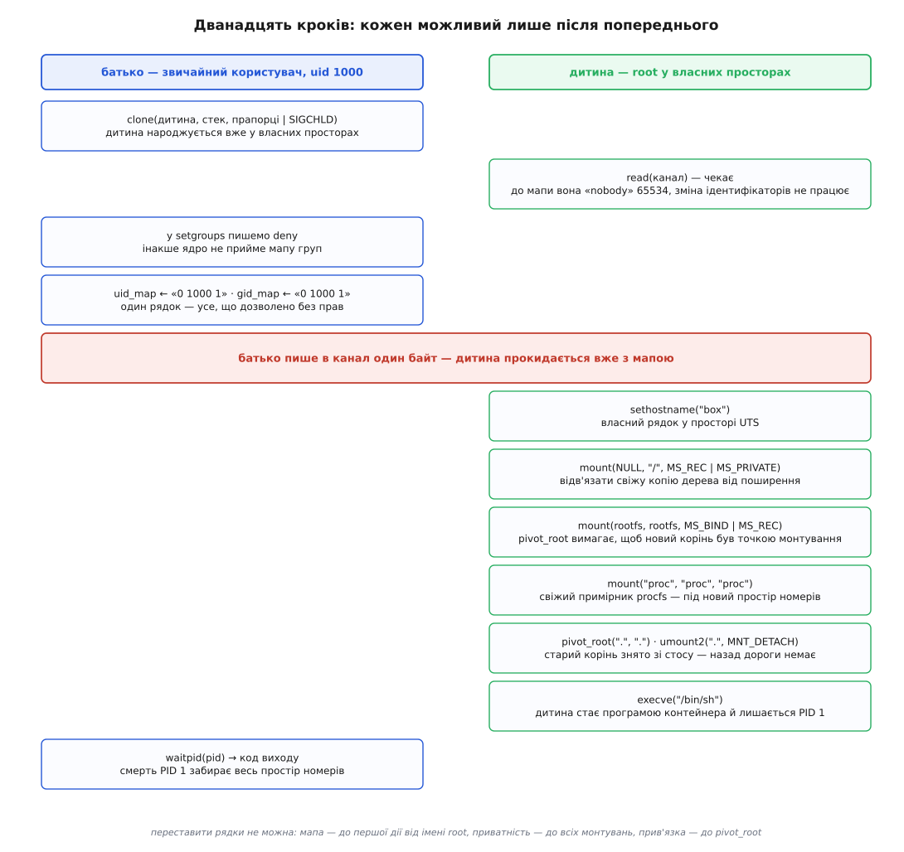
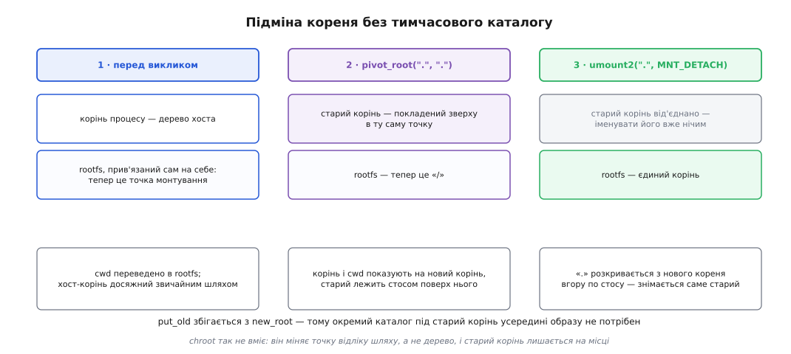

# ⚙️ Контейнер на сотню рядків: збірка з самих системних викликів

Тут ми пишемо програму мовою C, що запускає `/bin/sh` у власних просторах імен — без Docker, без демона в пам'яті й без жодного `sudo`, — і розбираємо, чому її кроки складаються в єдино можливий порядок. Після такої збірки повідомлення справжніх рушіїв контейнерів перестають бути загадковими: майже кожне з них походить із одного з десятка викликів, які видно нижче неозброєним оком.

## Що має вийти

Мету зручніше описати перевірками, ніж словами. Усередині запущеної оболонки `id` мусить показати `uid=0`, хоч запускав звичайний користувач без жодних прав. `echo $$` мусить дати `1`. У `/proc` мусять лежати два номери, а не чотириста. `hostname` мусить віддати `box`, і ім'я хоста від цього не зміниться. Корінь мусить бути розпакованим образом, а хостового дерева не має бути видно взагалі. Жодне монтування, зроблене всередині, не повинно з'явитися в системі. І нарешті: вихід з оболонки мусить прибрати все створене — без єдиної команди прибирання.

Останній пункт нам дістанеться задарма, і саме він показує, наскільки мало ми будуємо. Ми не створюємо жодного об'єкта, який довелося б потім видаляти: усе тримається на посиланнях, і коли остання задача виходить, ядро прибирає структури саме тому, що на них більше ніхто не вказує.

## Ланцюг, а не список

Кроків дванадцять, і вони не є набором, з якого можна вибирати порядок. Кожен відкриває наступний, і майже кожен неможливий раніше за попередній.



*Ліворуч робить батько, праворуч — дитина. Червоний рядок посередині — єдина синхронізація: доти дитина стоїть на читанні з каналу.*

Пройдімо по вузлах цього ланцюга, бо кожен з них — окрема причина, а не ритуал.

**Усі простори створюємо одним `clone()`, а не по черзі.** Звичайний користувач не має права створити простір номерів чи мережевий простір: для цього потрібна можливість `CAP_SYS_ADMIN`, а в початковому просторі користувачів її немає. Але ядро дає точну гарантію: якщо `CLONE_NEWUSER` стоїть в одному виклику разом з іншими прапорцями `CLONE_NEW*`, простір користувачів створюється **першим**, і решта просторів твориться вже з повноваженнями в ньому. Один виклик — і непривілейована програма отримує все.

**Саме `clone()`, а не `unshare()`.** Виклик `unshare(CLONE_NEWPID)` не переносить того, хто його зробив, у новий простір: перший номер там дістанеться його дитині. Нам же потрібно, щоб у просторі опинилася сама програма, яку ми запускаємо, тож дитину народжуємо одразу в місці призначення. Про сам `clone()` і його прапорці — [чим ще народжують процес](topic:sys-unix/spawn-alternatives).

**Мапу пише батько, і дитина мусить її дочекатися.** Поки в новому просторі не написано `uid_map`, ідентичність дитини не визначена: ядро показує її як число переповнення 65534, а всі виклики, що змінюють ідентифікатори, зазнають невдачі. Формально дитина могла б написати собі мапу й сама — непривілейованому процесові дозволено рівно один рядок, що відображає його ж власний зовнішній номер. Але щойно знадобиться діапазон номерів, а не одне число, рядок доведеться писати ззовні; тому синхронізацію ставимо одразу, а не переробляємо потім.

**Спершу `deny` в `setgroups`, потім `gid_map`.** Це не примха порядку, а умова: непривілейований процес мусить назавжди вимкнути `setgroups()` перед тим, як йому дозволять написати мапу груп.

**Приватність дерева монтувань — до всіх монтувань, а не після.** Свіжа копія дерева, отримана з `CLONE_NEWNS`, за замовчуванням і далі обмінюється подіями з системою, бо systemd позначає монтування спільними. Один виклик із `MS_REC | MS_PRIVATE` розриває цей зв'язок; забути його означає, що наш `/proc` вилізе назовні.

**Прив'язка кореня образу сама на себе — до `pivot_root()`.** Цей виклик вимагає, щоб новий корінь був точкою монтування, а звичайний каталог `./rootfs` нею не є. Прив'язне монтування каталогу на самого себе робить його точкою монтування, нічого не змінюючи в змісті — і саме для цього воно тут стоїть, а не для копіювання файлів. Про самі прив'язки й дерево — [монтування й дерево монтувань](topic:sys-unix/mount-model).

**Свіжий примірник procfs — після простору номерів і всередині образу.** Монтування `proc` показує ті номери, які були видимі тому, хто його змонтував. Прив'язати хостовий `/proc` замість монтування нового означало б перенести всередину чужий список процесів; тільки новий примірник покаже наш. Що таке цей файловий вигляд ядра — [/proc: процеси як файли](topic:sys-unix/proc-reading-process-and-kernel-state), а чому він взагалі не має даних на диску — [псевдо-ФС](topic:sys-unix/pseudo-filesystems).

**Підміна кореня — остання, `execve()` — після неї.** Порядок тут диктує елементарне: після `pivot_root()` шляхи хоста більше не розкриваються, тому все, що треба взяти ззовні, беруть до нього.

> 🔧 **Навіщо це.** Не заради власного рушія — їх достатньо. Заради читання помилок. `mount: permission denied` на `/proc` усередині збірки означає не «мало прав», а що ми не в тому просторі номерів або що ядро не дає відкрити приховане. `EINVAL` від `pivot_root` означає, що корінь образу не став точкою монтування. `chown: invalid argument` усередині контейнера означає, що номер не має мапи. Кожне з цих повідомлень читається однозначно, коли знаєш, який саме рядок його породив.

## Код

Мова тут одна й вибору немає: усе, що робить програма, — це системні виклики, а `pivot_root()` навіть не має обгортки в libc, тож його кличемо за номером. Ще одна причина розібрана нижче, серед пасток, — вона стосується того, чому цей самий код не можна просто написати мовою Go чи Python.

```c
/* minibox.c — найменший контейнер: збірка з системних викликів.
   Складання: cc -Wall -O2 -o minibox minibox.c
   Запуск:    ./minibox ./rootfs /bin/sh        (без sudo)          */
#define _GNU_SOURCE
#include <sched.h>
#include <sys/mount.h>
#include <sys/syscall.h>
#include <sys/wait.h>
#include <unistd.h>
#include <fcntl.h>
#include <stdio.h>
#include <string.h>

static char stack[1 << 20];        /* clone() стека не виділяє — це наш клопіт */

struct box { int wait_fd; const char *root; char **argv; };

static void die(const char *what) { perror(what); _exit(127); }

/* у glibc немає обгортки — кличемо за номером виклику */
static int pivot_root(const char *new_root, const char *put_old)
{
    return syscall(SYS_pivot_root, new_root, put_old);
}

static int enter(void *arg)
{
    struct box *b = arg;
    char ready;

    /* поки батько не написав мапу, ми — 65534 і не маємо ідентичності */
    if (read(b->wait_fd, &ready, 1) != 1) die("канал: мапу не підтверджено");
    close(b->wait_fd);

    if (sethostname("box", 3) == -1) die("sethostname");

    /* 1. свіжа копія дерева монтувань досі обмінюється подіями з системою */
    if (mount(NULL, "/", NULL, MS_REC | MS_PRIVATE, NULL) == -1) die("make-rprivate");

    /* 2. pivot_root вимагає, щоб новий корінь був точкою монтування */
    if (mount(b->root, b->root, NULL, MS_BIND | MS_REC, NULL) == -1) die("bind rootfs");
    if (chdir(b->root) == -1) die("chdir rootfs");

    /* 3. власний примірник procfs — покаже номери НАШОГО простору */
    if (mount("proc", "proc", "proc", MS_NOSUID | MS_NODEV | MS_NOEXEC, NULL) == -1)
        die("mount proc");

    /* 4. підміна кореня: put_old навмисно збігається з new_root */
    if (pivot_root(".", ".") == -1) die("pivot_root");
    if (umount2(".", MNT_DETACH) == -1) die("umount старого кореня");
    if (chdir("/") == -1) die("chdir /");

    execv(b->argv[0], b->argv);
    die("execv");
    return 127;
}

static void put(const char *path, const char *data)
{
    int fd = open(path, O_WRONLY);
    if (fd == -1) die(path);
    if (write(fd, data, strlen(data)) != (ssize_t) strlen(data)) die(path);
    close(fd);
}

int main(int argc, char **argv)
{
    if (argc < 3) {
        fprintf(stderr, "вжиток: %s <rootfs> <програма> [аргументи…]\n", argv[0]);
        return 2;
    }

    int ch[2];
    if (pipe(ch) == -1) die("pipe");

    struct box b = { .wait_fd = ch[0], .root = argv[1], .argv = &argv[2] };

    int flags = CLONE_NEWUSER | CLONE_NEWNS | CLONE_NEWPID |
                CLONE_NEWUTS  | CLONE_NEWIPC | CLONE_NEWNET | SIGCHLD;

    pid_t pid = clone(enter, stack + sizeof stack, flags, &b);
    if (pid == -1) die("clone");
    close(ch[0]);

    char path[64], line[64];

    snprintf(path, sizeof path, "/proc/%d/setgroups", pid);
    put(path, "deny");                      /* файл є від ядра 3.19 */

    snprintf(path, sizeof path, "/proc/%d/uid_map", pid);
    snprintf(line, sizeof line, "0 %u 1", (unsigned) getuid());
    put(path, line);

    snprintf(path, sizeof path, "/proc/%d/gid_map", pid);
    snprintf(line, sizeof line, "0 %u 1", (unsigned) getgid());
    put(path, line);

    if (write(ch[1], "!", 1) != 1) die("канал");
    close(ch[1]);

    int st;
    if (waitpid(pid, &st, 0) == -1) die("waitpid");
    return WIFEXITED(st) ? WEXITSTATUS(st) : 128 + WTERMSIG(st);
}
```

Кілька дрібниць у цьому коді неочевидні, і кожна має причину.

Структура `struct box` лежить у стеку батька, а дитина читає її за вказівником — і це працює, бо `CLONE_VM` серед прапорців немає: дитина отримує власну копію адресного простору, у якій той самий вказівник указує на її ж копію структури. Канал натомість переживає копіювання чесно: копія таблиці дескрипторів містить копію того самого відкритого файлу, тож обидві сторони тримаються за один об'єкт ядра — саме тому синхронізація йде каналом, а не спільною змінною. Про цю різницю між номером і об'єктом за ним — [файловий дескриптор](topic:sys-unix/file-descriptor).

Аргумент `stack + sizeof stack` — верхівка масиву, бо стек росте вниз. Прапорець `SIGCHLD` у наборі не стосується просторів: він каже, який сигнал надійде батькові, коли дитина завершиться, і без нього `waitpid()` не спрацює звично.

І останнє: `argv[2]` мусить бути **абсолютним шляхом усередині образу** (`/bin/sh`), бо `execv()` виконується вже після підміни кореня — [заміна образу](topic:sys-unix/exec-semantics) розкриває шлях у новому дереві, а не в тому, з якого ми стартували.

## Корінь із чотирьох каталогів

Образ можна взяти в готового рушія — `podman export` чи `docker export` віддають розпакований корінь тарболом. Але для перевірки вистачить статичного BusyBox і чотирьох каталогів:

```bash
mkdir -p rootfs/bin rootfs/proc rootfs/dev rootfs/etc
cp "$(command -v busybox)" rootfs/bin/
for c in sh ls ps id hostname cat mount ip; do ln -s busybox "rootfs/bin/$c"; done
ln -s bin rootfs/sbin
printf 'root:x:0:0:root:/:/bin/sh\n' > rootfs/etc/passwd
printf 'root:x:0:\n'                 > rootfs/etc/group
touch rootfs/dev/null                       # ціль для майбутньої прив'язки
```

BusyBox мусить бути статичним: динамічний потягне за собою `ld.so` і `libc`, яких у нашому корені немає, і `execv()` віддасть `ENOENT` — на диску файл є, а розв'язати його залежності нічим. Перевіряють це командою `ldd "$(command -v busybox)"`: відповідь «not a dynamic executable» означає, що все гаразд, інакше ставлять пакунок `busybox-static` або копіюють бібліотеки поруч. Чому інтерпретатор узагалі втручається в запуск — [динамічний завантажувач](topic:sys-unix/dynamic-loader).

## Що видно зсередини

```console
$ id -u
1000
$ cc -Wall -O2 -o minibox minibox.c && ./minibox ./rootfs /bin/sh
/ # id
uid=0(root) gid=0(root) groups=65534,65534
/ # hostname
box
/ # echo $$
1
/ # ps
  PID USER       VSZ STAT COMMAND
    1 root      1200 S    /bin/sh
    4 root      1196 R    ps
/ # ls /
bin  dev  etc  proc  sbin
/ # ip link show          # вивід скорочено
1: lo: <LOOPBACK> mtu 65536 state DOWN
/ # exit
$ hostname
thinkpad
```

Усе на місці: нуль замість тисячі, одиниця замість п'ятизначного номера, два записи в `/proc` замість сотень, чужий корінь, власне ім'я вузла — і хост, який нічого з цього не помітив.

Один рядок у виводі варто прочитати уважно. `groups=65534,65534` — це не помилка: додаткові групи процес успадкував від зовнішнього користувача, а їхні номери в нашій мапі не згадані, тож ядро показує їх числом переповнення. Мапа з одного рядка перекладає рівно одне число; усе інше лишається безіменним і показується як `nobody`.

Ззовні той самий контейнер видно як звичайний процес, лише з іншими просторами:

```console
$ lsns -t pid
        NS TYPE NPROCS   PID USER   COMMAND
4026531836 pid     318  1234 andrij /usr/lib/systemd/systemd --user
4026532987 pid       1 51840 andrij /bin/sh
```

Число в першій колонці — номер індексного вузла того файлу, що представляє простір; порівняння саме цих чисел і є єдиним способом сказати, різні простори чи однакові.

Порівняти з тим самим набором просторів без власного кореня можна взагалі без коду:

```console
$ unshare --user --map-root-user --mount --pid --uts --ipc --net --fork --mount-proc /bin/sh
```

Ця команда робить те саме, крім підміни кореня: `--map-root-user` пише ту саму мапу з одного рядка, `--fork` дає першу дитину в новому просторі номерів, `--mount-proc` монтує свіжий procfs, а приватність дерева монтувань `unshare(1)` від версії 2.27 вмикає сама. Різниця в тому, що корінь лишається хостовий — і це якраз та частина, яку додає наша програма.

## Чому pivot_root, а не chroot

Спокуса замінити чотири рядки підміни кореня одним `chroot("./rootfs")` велика, і саме тут ховається найтонше місце всієї збірки.

Виклик `chroot()` міняє для процесу точку відліку абсолютного шляху — і більше нічого. Старий корінь при цьому нікуди не дівається: він лишається змонтованим, просто його не можна назвати. А позаяк у нашому просторі процес має повний набір [можливостей](topic:sys-unix/capabilities), він може змонтувати щось нове й дістатися старого дерева знову — межі, які `chroot()` ставить, тримаються на тому, що процес їх не намагається обійти ([chroot і його межі](topic:sys-unix/chroot)).

`pivot_root()` міняє не точку відліку, а склад дерева: старий корінь знімається з нього повністю, і після цього імені для хостового дерева в процесі просто не існує. Форма виклику при цьому виглядає дивно — обидва аргументи однакові:



*Старий корінь кладеться стосом у ту саму точку, де стоїть новий, а потім знімається звідти окремим викликом. Тому окремий каталог під старий корінь усередині образу не потрібен.*

Працює це так. Виклик вимагає, щоб місце під старий корінь було всередині нового; передавши `"."` двічі, ми кажемо покласти старий корінь рівно туди, куди щойно переїхав новий. Ядро складає їх стосом в одній точці. Корінь і поточний каталог процесу після виклику показують на новий корінь, тож наступне розкриття імені `"."` починається з нього й іде вгору по стосу — і `umount2()` знімає саме старий корінь. Прапорець `MNT_DETACH` потрібен тому, що звичайне розмонтування відмовиться працювати, поки хтось тримає всередині відкриті файли; від'єднане монтування зникає з дерева одразу, а звільняється тоді, коли впаде останнє посилання.

Після цього `chdir("/")` не косметика: поточний каталог процесу досі вказує в щойно від'єднане дерево, і без цього рядка перший же відносний шлях розкриється не там, де очікується.

## Пастки

**Одне число в мапі — і `chown` не працює.** Мапа `0 1000 1` перекладає рівно один номер. Спроба всередині зробити `chown 1000 file` дає `EINVAL`: числа 1000 у цьому просторі не існує, і перекласти його ядру нічим. З тієї ж причини ламається розпакування справжнього образу — файли в тарболі належать десяткам різних номерів. Лікують це діапазоном: рядки в `/etc/subuid` і `/etc/subgid` виділяють користувачеві блок номерів (зазвичай 65536), а записати такий блок у мапу може лише помічник `newuidmap`, бо для діапазону потрібні права, яких у нас немає. Саме так живуть безкореневі Podman і Docker; наша програма тоді замість двох записів у файли викликає `newuidmap pid 0 100000 65536`. Що ці номери означають для ядра — [користувачі, групи й ідентичність](topic:sys-unix/uid-gid-identity-model).

**Пристроїв створити не вийде.** `mknod()` для вузла пристрою в просторі користувачів заборонено назавжди: пристрій не належить жодному простору, і повноваження всередині на нього не поширюються. Тому `/dev/null`, `/dev/zero` і решту беруть прив'язкою з хоста — і робити її треба **до** підміни кореня, поки хостові шляхи ще розкриваються:

```c
if (mount("/dev/null", "dev/null", NULL, MS_BIND, NULL) == -1) die("bind /dev/null");
```

Ціль прив'язки мусить існувати — звідси `touch rootfs/dev/null` у збірці образу. Без `/dev/null` перше ж перенаправлення в оболонці зазнає невдачі, а причину буде видно не одразу.

**Мережі немає взагалі.** `CLONE_NEWNET` дає порожній простір: єдиний інтерфейс — зупинений `lo`. Підняти його зсередини можна, бо простором ми володіємо. А от протягнути пару `veth` до хоста — ні: другий кінець пари треба поставити в хостовий мережевий простір, а там ми ніхто. Тому безкореневі рушії або тримають мережу в просторі користувача (`slirp4netns`, `pasta`), або просять зовнішнього помічника з правами. Як з'єднують простори взагалі — [мережеві простори імен](topic:sys-unix/network-namespaces).

**Оболонка з номером 1 поводиться не як оболонка.** Процес номер 1 у просторі не отримує сигналів із типовою дією: доходять лише ті, на які він поставив обробник. Тому `kill -TERM 1` зсередини не робить нічого, а `Ctrl+C` у неінтерактивній програмі не спрацьовує. Ззовні `SIGKILL` доправляється силоміць — і смерть цього процесу забирає весь простір. Друга половина ролі теж наша: `sh` не прибирає сиріт, тож у довгому контейнері зомбі накопичуватимуться, доки не заповнять таблицю. Реальні образи саме тому кладуть усередину крихітний init на кшталт `tini` — [роль init і особливість PID 1](topic:sys-unix/init-and-pid1), [завершення, wait і зомбі](topic:sys-unix/exit-wait-zombies).

**Цього коду не написати мовою Go, Java чи Python.** `CLONE_NEWUSER` вимагає, щоб процес був однопотоковим, а рушій цих мов заводить потоки ще до першого рядка програми. Обійти це можна лише одним способом: виконати частину з просторами **до** старту рушія. Саме так зроблено в runc — його `nsexec` написано мовою C і оформлено конструктором, що виконується під час завантаження виконуваного файлу, ще до ініціалізації рушія Go; у документації це пояснено прямо потребою уникнути проблем, які рушій Go має з багатьма потоками. Що таке потік у Linux і чому їх видно як задачі — [потоки як задачі](topic:sys-unix/threads-as-tasks).

**Усередині вже обмеженого контейнера збірка може не запуститися.** Ядро не дозволяє менш привілейованому простору монтувань відкрити те, що приховав більш привілейований: якщо в оточенні, де ми запускаємося, частини `/proc` перекрито (а рушії роблять саме так), новий примірник procfs змонтувати не дадуть. Помилка виглядатиме як звичайна відмова в правах, хоч права тут ні до чого.

**Батько не відрізняє свою невдачу від чужої.** Дескриптор `stderr` дитина успадкувала, тож `perror()` видно навіть після підміни кореня. Але батько бачить лише код виходу 127 — а його могла повернути й сама програма всередині. Надійний спосіб один, і рушії контейнерів роблять саме так: другий канал із прапорцем `FD_CLOEXEC`. Дитина пише в нього `errno`, якщо збірка зірвалася; вдалий `execve()` закриває канал сам, і для батька саме закриття без жодного байта означає «запустилося».

## Скільки це коштує

Уся збірка — близько тридцяти системних викликів, і по-справжньому «контейнерних» серед них дванадцять; решта — звичайні `open`, `write` і `close` навколо трьох файлів у `/proc`. Другого ядра тут не завантажується, служби не стартують, тому ціна запуску складається з `execve()` і кількох монтувань — тобто мало відрізняється від запуску звичайної програми.

Одне місце все ж масштабується не задарма. Новий простір монтувань дістає **копію всього списку монтувань** батька, і ця копія пропорційна кількості монтувань у системі. На робочій станції їх десятки, на машині з сотнями змонтованих томів кожен запуск контейнера платить за кожен з них. З решти типів найдорожчий — мережевий: за ним стоїть не одна структура, а цілий примірник стека, тому масове створення й прибирання саме мережевих просторів помітно повільніше за все інше.

Скільки просторів узагалі можна створити, обмежує не пам'ять, а лічильники в `/proc/sys/user/`: `max_pid_namespaces`, `max_mnt_namespaces`, `max_net_namespaces` і решта. Вони існують саме тому, що створення простору стало доступним непривілейованому користувачеві — інакше будь-яка програма могла б виїсти пам'ять ядра циклом з одного виклику.

## Чого тут немає

Написане не обмежує нічого. Наша оболонка може з'їсти всю пам'ять машини й завантажити всі ядра процесора: облік і межі — це [cgroups](topic:sys-unix/cgroups-resource-model), окремий механізм, до якого ми не торкалися. Вона може викликати будь-який системний виклик ядра, включно з тими, у яких свіжі вразливості: звужує цей перелік [seccomp](topic:sys-unix/seccomp-filter-mechanism), теж окремо. Вона зберігає повний набір можливостей у своєму просторі, хоча справжній рушій скинув би зайві одразу після підміни кореня.

Тому чесна назва написаного — не «контейнер», а «процес у власних просторах імен». Відстань між цими двома речами і є тим, що додає рушій на кшталт runc: обмеження, фільтр викликів, скидання можливостей, профіль обов'язкового контролю доступу й правила складання кореня з шарів. Кожна складова живе окремо й додається окремо — саме тому їх можна перелічити, а не «увімкнути ізоляцію» одним ключем ([контейнери](topic:sf-os/containers)).
