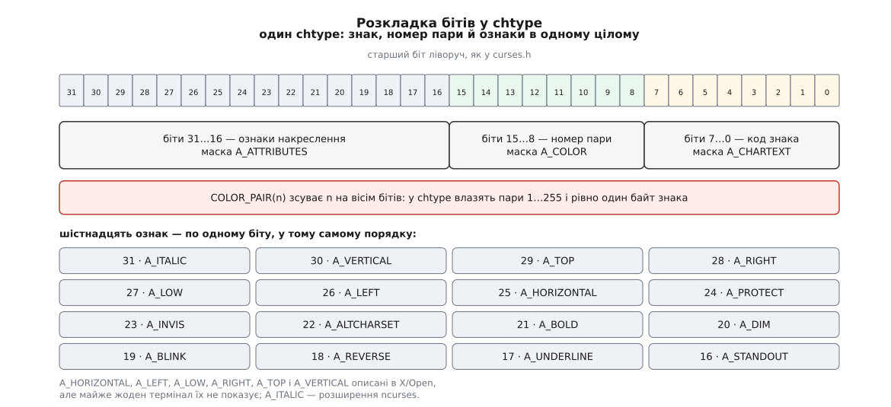

# 📋 Поверхня ncurses: виклики, коди повернення й режими

Довідка з того, що бібліотека виставляє назовні: сигнатури, згруповані за задачею, і в кожній групі окрема колонка «що повертає, коли не вийшло» — бо помилки тут не схожі на звичні системні й розпізнаються тільки за тим, який саме виклик віддав `ERR`. Наприкінці стоїть таблиця відповідності режимів ncurses прапорцям `termios`: це той стик, на якому найчастіше й ламається поведінка програми. Сигнатури й числа взято з man-сторінок ncurses 6.x і з заголовка `curses.h`; де можливість є розширенням ncurses понад System V curses, це позначено окремо.

## Наскрізні домовленості

Три речі діють у всіх групах і далі не повторюються.

**Коди повернення.** `OK` дорівнює `0`, `ERR` дорівнює `−1`. Це **не** коди `errno`: бібліотека здебільшого його не виставляє, тож відрізнити «бракує пам'яті» від «координата поза вікном» за самим поверненням неможливо. Функції, що віддають вказівник, у разі невдачі віддають `NULL`; функції з поверненням `void` не мають способу поскаржитися взагалі — і це варто пам'ятати, натрапивши на `wtimeout` чи `immedok`.

**Чотири імені однієї дії.** Майже кожен виклик має чотири форми, і в довідці наведено найповнішу — решта виводиться з неї механічно.

| форма | приклад | що додає |
| --- | --- | --- |
| без префікса | `addch(ch)` | працює зі `stdscr` |
| `w-` | `waddch(win, ch)` | перший аргумент — вікно |
| `mv-` | `mvaddch(y, x, ch)` | спершу `wmove(stdscr, y, x)` |
| `mvw-` | `mvwaddch(win, y, x, ch)` | і вікно, і переміщення |

Пастка в `mv`-формах: якщо переміщення не вдалося (координата поза вікном), виклик повертає `ERR` **і сама дія не відбувається**. Мовчазний `mvwprintw` у неіснуючий рядок — це найчастіша причина «чому нічого не намалювалося».

**Тип `int`, а не `char`.** Ввід повертає не байти, а числа: коди клавіш починаються від `KEY_MIN` (`0401`, тобто 257), а `ERR` дорівнює `−1`. Присвоєння результату `wgetch` у змінну типу `char` ламає і те, й те.

## Життєвий цикл

| сигнатура | що робить | при помилці |
| --- | --- | --- |
| `WINDOW *initscr(void)` | читає опис термінала за `TERM`, займає екран, створює `stdscr` | **не повертає нічого:** пише діагностику в `stderr` і завершує процес |
| `SCREEN *newterm(const char *type, FILE *outf, FILE *inf)` | те саме, але для явно вказаного термінала й пари потоків | `NULL` |
| `SCREEN *set_term(SCREEN *new)` | зробити цей екран поточним | повертає попередній; у ncurses не помиляється |
| `int endwin(void)` | повернути термінал у стан оболонки, видати `rmcup` | `ERR` |
| `bool isendwin(void)` | чи був `endwin` після останнього оновлення | `TRUE`/`FALSE` |
| `void delscreen(SCREEN *sp)` | звільнити структури; **тільки після `endwin`** | нічого не повертає |
| `int napms(int ms)` | заснути засобами бібліотеки | `ERR` |

Поведінка `initscr` при аварії — не дрібниця. Берклійська версія повертала помилку, і код, переписаний із тих часів, досі містить перевірку, яка ніколи не спрацює: до неї просто не доходить керування. Якщо провал має обробляти програма, а не бібліотека, єдиний шлях — `newterm`, який чесно віддає `NULL`.

Друге застосування `newterm` — коли власний вивід програми перенаправлений і зайняти його не можна. Тоді екран відкривають на окремому дескрипторі, повз [три потоки](topic:sys-unix/standard-streams):

```c
FILE *tty = fopen("/dev/tty", "r+");
SCREEN *sc = newterm(NULL, tty, tty);   /* NULL = взяти TERM із середовища */
```

Глобальні змінні, які бібліотека тримає для програми:

| змінна | що каже | коли набуває значення |
| --- | --- | --- |
| `LINES`, `COLS` | розмір `stdscr` у рядках і колонках | `initscr`; після зміни розміру — у ту мить, коли ввід віддає `KEY_RESIZE` |
| `COLORS` | скільки кольорів має термінал | `start_color`; до нього — нуль |
| `COLOR_PAIRS` | скільки пар «текст на тлі» дозволено | `start_color` |
| `TABSIZE` | ширина табуляції (можливість `it` з [terminfo](topic:sys-unix/terminfo-database)) | `initscr` |
| `ESCDELAY` | скільки мілісекунд чекати продовження після `ESC`, типово 1000 | `initscr`; перекривається однойменною змінною середовища |

У бібліотеці, зібраній із підтримкою потоків, це вже не змінні, а макроси над полями поточного екрана, і присвоєння `ESCDELAY = 25;` там не компілюється. Переносний спосіб один — розширення ncurses `int set_escdelay(int ms)`, `int get_escdelay(void)` і `int set_tabsize(int)`, усі з поверненням `OK`/`ERR`.

## Вікна

| сигнатура | що робить | при помилці |
| --- | --- | --- |
| `WINDOW *newwin(int nlines, int ncols, int begin_y, int begin_x)` | самостійне вікно; нуль у розмірі означає «до краю екрана» | `NULL` |
| `WINDOW *subwin(WINDOW *orig, int nlines, int ncols, int begin_y, int begin_x)` | похідне вікно, координати початку **екранні** | `NULL` |
| `WINDOW *derwin(WINDOW *orig, int nlines, int ncols, int begin_y, int begin_x)` | те саме, але координати **відносно `orig`** | `NULL` |
| `int mvderwin(WINDOW *win, int par_y, int par_x)` | пересунути похідне вікно всередині батька | `ERR` |
| `int mvwin(WINDOW *win, int y, int x)` | пересунути вікно по екрану | `ERR`: вказівник `NULL`, це «полотно» (`pad`), або частина вийшла б за екран |
| `int delwin(WINDOW *win)` | звільнити | `ERR`: вказівник `NULL` **або вікно має похідні** |
| `WINDOW *dupwin(WINDOW *win)` | копія з вмістом | `NULL` |
| `int wresize(WINDOW *win, int lines, int columns)` | змінити розмір (розширення ncurses) | `ERR` |

Уся різниця між `subwin` і `derwin` — у системі координат початку: перший рахує від лівого верхнього кута екрана, другий від кута батьківського вікна. Розміри в обох означають одне й те саме.

А от спільна їхня властивість дає найтихішу помилку в цій групі: **похідне вікно не має власних комірок, воно ділить пам'ять із батьківським**. Тому малювання в похідному не позначає батьківські рядки як змінені, і `wrefresh(parent)` нічого не покаже. Ліки — або `touchwin(parent)` перед оновленням батька, або `syncok(child, TRUE)`, після чого кожна зміна в похідному сама позначає предків. Самостійні вікна від `newwin` цієї біди не мають, зате не вміють накладатися одне на одне: стос перекритих вікон — задача сусідньої бібліотеки `panel`, а не curses.

## Малювання

Уся ця група пише **в пам'ять вікна**. Жоден із наведених викликів у термінал не ходить і жодного байта в дріт не надсилає.

| сигнатура | що робить | при помилці |
| --- | --- | --- |
| `int waddch(WINDOW *, const chtype ch)` | покласти знак разом з ознаками, посунути курсор | `ERR` |
| `int waddnstr(WINDOW *, const char *s, int n)` | до `n` байтів; `n` = −1 означає «до `\0`» | `ERR` |
| `int wprintw(WINDOW *, const char *fmt, ...)` | форматування просто у вікно | `ERR` |
| `int wmove(WINDOW *, int y, int x)` | перемістити курсор вікна | `ERR`, якщо координата поза вікном |
| `int werase(WINDOW *)` | заповнити пробілами з поточними ознаками | `ERR` |
| `int wclear(WINDOW *)` | те саме **плюс** `clearok(win, TRUE)` | `ERR` |
| `int wclrtoeol(WINDOW *)`, `int wclrtobot(WINDOW *)` | стерти до кінця рядка / до низу вікна | `ERR` |
| `int box(WINDOW *, chtype verch, chtype horch)` | рамка; нуль означає «взяти типовий знак» | `ERR` |
| `int wborder(WINDOW *, chtype ls, rs, ts, bs, tl, tr, bl, br)` | рамка з окремим знаком на кожен бік і кут | `ERR` |
| `int whline(WINDOW *, chtype, int n)`, `int wvline(...)` | лінія на `n` комірок, курсор не рухається | `ERR` |

Окремої згадки варта причина, з якої `waddch` повертає `ERR` там, де все ніби гаразд: знак, покладений в останню комірку останнього рядка, змушує вікно прокрутитися, а прокручування типово заборонене. Без `scrollok(win, TRUE)` виклик відмовляє, і правий нижній кут лишається порожнім.

### Що таке `chtype`

`chtype` — беззнакове ціле щонайменше на 32 біти, у якому лежить уся комірка одразу.



*Одне число описує комірку цілком — і саме тому воно не переживає багатобайтових символів.*

З розкладки прямо читаються дві межі, про які інакше довелося б здогадуватися. Під знак відведено рівно один байт, тож `chtype`-виклики працюють із [UTF-8](topic:sf-data/ascii-utf8) лише випадково й здебільшого неправильно. Під номер пари відведено вісім бітів, тож через `COLOR_PAIR(n)` доступні пари від 1 до 255 — незалежно від того, яке число стоїть у `COLOR_PAIRS`.

Ознаки й кольори ставлять двома поколіннями викликів. Старе працює з `chtype` і мішає все в одне число, нове розділяє ознаки (`attr_t`) й пару.

| сигнатура | що робить | при помилці |
| --- | --- | --- |
| `int wattr_set(WINDOW *, attr_t attrs, short pair, void *opts)` | поставити набір ознак і пару разом | `ERR` |
| `int wattr_on(WINDOW *, attr_t, void *opts)`, `int wattr_off(...)` | додати чи зняти окремі ознаки | `ERR` |
| `int wattr_get(WINDOW *, attr_t *, short *, void *opts)` | прочитати поточні | `ERR` |
| `int wcolor_set(WINDOW *, short pair, void *opts)` | лише пара | `ERR`, якщо пара поза `0…COLOR_PAIRS−1` |
| `int wattron(WINDOW *, int attrs)`, `wattroff`, `wattrset` | стара форма на `chtype` | `ERR` |
| `int wchgat(WINDOW *, int n, attr_t, short pair, const void *opts)` | перефарбувати `n` комірок, не чіпаючи знаків | `ERR` |

Параметр `opts` за X/Open мусить бути `NULL`, і саме через нього ncurses 6 обходить восьмибітову межу на номер пари: якщо `opts` не порожній, бібліотека читає з нього `int` і бере номер звідти, а `short pair` ігнорує.

```c
int  start_color(void);                        /* ERR, якщо терміналові кольори невідомі */
bool has_colors(void);
bool can_change_color(void);
int  init_pair(short pair, short f, short b);  /* пара 1…COLOR_PAIRS−1 */
int  init_color(short color, short r, short g, short b);   /* складники 0…1000 */
int  init_extended_pair(int pair, int f, int b);           /* ncurses 6 */
int  use_default_colors(void);                 /* розширення: −1 = «колір термінала» */
```

Пара 0 зарезервована під «як було» й через `init_pair` не міняється — тільки через `assume_default_colors`. Базові вісім кольорів мають номери 0…7 і назви `COLOR_BLACK`, `COLOR_RED`, `COLOR_GREEN`, `COLOR_YELLOW`, `COLOR_BLUE`, `COLOR_MAGENTA`, `COLOR_CYAN`, `COLOR_WHITE`.

## Оновлення

```c
int wnoutrefresh(WINDOW *win);   /* вікно → newscr; у термінал не йде НІЧОГО */
int doupdate(void);              /* newscr проти curscr → байти в термінал */
int wrefresh(WINDOW *win);       /* = wnoutrefresh(win) + doupdate() */
int touchwin(WINDOW *win);       /* «вікно змінилося», вмісту не чіпаючи */
int touchline(WINDOW *win, int start, int count);
int redrawwin(WINDOW *win);      /* «що на склі під цим вікном — невідомо» */
int wredrawln(WINDOW *win, int beg_line, int num_lines);
```

Усі повертають `OK` або `ERR`. Різниця між двома останніми парами тонка й важлива: `touchwin` каже, що змінилося **вікно**, тож наступне оновлення перенесе його рядки в `newscr`; `redrawwin` додатково викидає віру бібліотеки в те, що зараз **на склі**, і оптимізатор більше не може заощадити на цих рядках. Після малювання в похідному вікні потрібен перший; після чужого запису в той самий термінал — другий.

| виклик | що робить | повертає |
| --- | --- | --- |
| `int clearok(WINDOW *, bool)` | при `TRUE` наступне оновлення чистить екран і малює все наново; `clearok(curscr, TRUE)` — це і є звичне «перемалювати по Ctrl-L» | завжди `OK` |
| `int leaveok(WINDOW *, bool)` | не тягти курсор у логічну позицію після оновлення — менше рухів, коли курсора однаково не видно | завжди `OK` |
| `void immedok(WINDOW *, bool)` | слати оновлення на кожну зміну комірки; дорого, придатне хіба для налагодження | нічого |
| `int idlok(WINDOW *, bool)` | дозволити вставляння й вилучення рядків замість перемальовування | завжди `OK` |
| `int scrollok(WINDOW *, bool)` | дозволити вікну прокручуватися | завжди `OK` |
| `int curs_set(int visibility)` | 0 — сховати, 1 — звичайний, 2 — дуже помітний | **попередній стан**, або `ERR`, якщо термінал не вміє |

`curs_set` — єдиний виняток із домовленості про `OK`: він віддає попереднє значення, і саме тому його прийнято зберігати (`int prev = curs_set(0);`), щоб перед виходом повернути як було.

## Ввід

```c
int  wgetch(WINDOW *win);        /* код символу, код клавіші, або ERR */
int  ungetch(int ch);            /* повернути одне значення в чергу */
int  has_key(int ch);            /* чи вміє ЦЕЙ термінал такий код */
const char *keyname(int c);      /* «KEY_UP», «^C» — для журналів і налагодження */
int  keypad(WINDOW *win, bool bf);
```

`wgetch` перед читанням сам викликає `wrefresh(win)`, якщо вікно змінене. Найкоротші програми завдяки цьому обходяться без явного оновлення взагалі — і саме тому в багатовіконній програмі раптом освіжається лише те вікно, з якого читали клавішу.

Коди клавіш починаються від `KEY_MIN` (`0401`) і не перетинаються з байтами: `KEY_UP`, `KEY_DOWN`, `KEY_LEFT`, `KEY_RIGHT`, `KEY_HOME`, `KEY_END`, `KEY_NPAGE`, `KEY_PPAGE`, `KEY_IC`, `KEY_DC`, `KEY_ENTER`, `KEY_BACKSPACE`, `KEY_F(n)` для `n` від 0 до 63, а також два розширення ncurses — `KEY_RESIZE` (вікно змінило розмір) і `KEY_MOUSE` (подію треба забрати викликом `getmouse`, попередньо ввімкнувши `mousemask`). Окрема пастка — `KEY_BACKSPACE`: залежно від термінала й налаштувань забій приходить то як `0x7F`, то як `0x08`, то як цей код, тож переносний обробник перевіряє всі три значення.

Скільки чекати на клавішу — властивість вікна або екрана, а не окремого виклику:

| виклик | що робить `wgetch` |
| --- | --- |
| `void wtimeout(WINDOW *, int delay)`, `delay < 0` | блокує без обмеження — так поводиться вікно типово |
| `wtimeout(win, 0)` або `int nodelay(WINDOW *, bool)` | не чекає взагалі: немає готового вводу → `ERR` |
| `wtimeout(win, ms)` | чекає `ms` мілісекунд, далі `ERR` |
| `int halfdelay(int tenths)` | те саме на весь екран, `tenths` від 1 до 255; вимикається викликом `nocbreak` |
| `int notimeout(WINDOW *, bool)` | вимикає **інший** таймер — той, що чекає продовження після `ESC` |

Останній рядок — джерело постійної плутанини: таймерів два й вони незалежні. Один вимірює, скільки програма готова чекати на будь-який ввід (`wtimeout`, `halfdelay`). Другий вимірює `ESCDELAY` і відповідає лише на питання, чи буде продовження в почутій послідовності. `notimeout(win, TRUE)` вимикає саме другий, тобто змушує бібліотеку чекати продовження скільки завгодно.

## Режими ncurses і прапорці termios

Імена режимів у curses старші за `termios` і не збігаються з ним ні один до одного, ні за напрямом дії. Найкорисніше знати, що саме кожен виклик робить із прапорцями [TTY](topic:sys-unix/tty-and-termios) — числа й повний перелік прапорців є в [довідці з termios](topic:sys-unix/tty-and-termios/api-termios.md).

| виклик | що робить із `termios` на дескрипторі | повертає |
| --- | --- | --- |
| `initscr` / `newterm` | одноразово: `c_lflag` −`ECHO`, −`ECHONL`; `c_oflag` −`ONLCR` | див. вище |
| `cbreak()` | `c_lflag` −`ICANON`, +`ISIG`; `c_iflag` −`ICRNL`; `VMIN` = 1, `VTIME` = 0 | `OK` / `ERR` |
| `nocbreak()` | `c_lflag` +`ICANON`; `c_iflag` +`ICRNL` | `OK` / `ERR` |
| `raw()` | `c_lflag` −`ICANON`, −`ISIG`, −`IEXTEN`; `c_iflag` −`IXON`, −`BRKINT`, −`PARMRK`; `VMIN` = 1, `VTIME` = 0 | `OK` / `ERR` |
| `noraw()` | повертає `ICANON`, `ISIG`, `IEXTEN` і три вхідні прапорці | `OK` / `ERR` |
| `noqiflush()` | `c_lflag` +`NOFLSH` | нічого |
| `qiflush()` | `c_lflag` −`NOFLSH` | нічого |
| `intrflush(win, bf)` | те саме прапорцем: `TRUE` → −`NOFLSH`, `FALSE` → +`NOFLSH` | `OK` / `ERR` |
| `meta(win, TRUE)` | не зрізати восьмий біт (на POSIX — `CS8`) | `OK` / `ERR` |
| `echo()` / `noecho()` | **нічого**: відлуння ядра вимкнене від самого початку, ці виклики перемикають власне відлуння бібліотеки | `OK` / `ERR` |
| `nl()` / `nonl()` | **нічого**: у ncurses це вже суто внутрішній прапорець, `ICRNL` він не переставляє | `OK` / `ERR` |
| `keypad`, `nodelay`, `wtimeout`, `halfdelay`, `notimeout` | **нічого**: це стан вікна або екрана всередині бібліотеки | див. вище |

Три рядки з «нічого» пояснюють дві поведінки, що інакше здаються дивними. По-перше, `echo()` після падіння програми не рятує оболонку: ядро своє відлуння вимкнуло ще в `initscr`, а власне відлуння бібліотеки разом із нею й зникло — потрібен `endwin` або зовнішній `reset`. По-друге, `raw()` **не** знімає `ICRNL`, хоч від «сирого режиму» цього й чекають: клавіша `Enter` і далі приходить як `\n`, а не `\r`. Хто потребує справді недоторканого потоку, ставить прапорці `termios` сам — ncurses цьому не заважає, бо на той самий дескриптор дивляться обидві сторони.

## Широкі символи

Широка частина бібліотеки не додається до вузької, а **замінює** її: комірка описана структурою, а не числом, тому міняється й розкладка `WINDOW`. Це несумісність двійкового інтерфейсу, і саме тому широкий варіант зібрано окремим файлом `libncursesw.so.6` з окремою текою заголовків ([SONAME і версіонування](topic:sys-unix/soname-versioning) — чому інша розкладка структури вимагає іншого імені бібліотеки).

```c
typedef struct {
    attr_t  attr;                  /* ознаки й номер пари */
    wchar_t chars[CCHARW_MAX];     /* CCHARW_MAX = 5: основний знак + комбінаційні */
    int     ext_color;             /* номер пари понад 255 */
} cchar_t;

int setcchar(cchar_t *wch, const wchar_t *wc, attr_t attrs, short pair, const void *opts);
int getcchar(const cchar_t *wch, wchar_t *wc, attr_t *attrs, short *pair, void *opts);

int wadd_wch(WINDOW *, const cchar_t *wch);          /* один складений знак */
int waddnwstr(WINDOW *, const wchar_t *wstr, int n); /* рядок широких символів */
int wget_wch(WINDOW *, wint_t *wch);                 /* див. нижче: три різні відповіді */
```

`setcchar` і `getcchar` повертають `OK` або `ERR`; `getcchar` із порожнім `wc` натомість віддає кількість знаків у комірці — так дізнаються потрібний розмір буфера.

Ввід тут влаштований інакше, і це головна відмінність, яку треба тримати в голові: `wget_wch` не має куди покласти коди клавіш, бо будь-яке число вже може бути символом. Тому саме значення йде в `wch`, а повернення каже, **як його читати**: `OK` — це широкий символ, `KEY_CODE_YES` — це код клавіші на кшталт `KEY_UP`, `ERR` — вводу немає (вичерпано очікування чи закрито потік).

Два додаткові зобов'язання, без яких широка гілка мовчки не працює. Перед `initscr` обов'язковий `setlocale(LC_ALL, "")` — без нього бібліотека не знає кодування й трактує вхід побайтово. І скільки колонок займе символ, вирішує таблиця ширин із поточної [локалі](topic:sys-unix/locale-and-collation): ієрогліф займає дві комірки, комбінаційний знак — жодної, і саме на розбіжності в цих таблицях між бібліотекою й емулятором розповзаються рамки.

```
cc -D_XOPEN_SOURCE_EXTENDED $(pkg-config --cflags ncursesw) prog.c $(pkg-config --libs ncursesw)
```

Змішувати не можна: об'єктні файли, зібрані із заголовками вузького варіанта, і бібліотека широкого дадуть не помилку складання, а тихе псування пам'яті — розміри `WINDOW` різні.

## Найкоротша повна програма

Усе разом — вікно з рамкою, похідне вікно всередині, пара кольорів, широкий символ і одне оновлення на обидва вікна:

```c
#define _XOPEN_SOURCE_EXTENDED
#include <locale.h>
#include <ncursesw/curses.h>

int main(void)
{
    setlocale(LC_ALL, "");                        /* ДО initscr, інакше широкі символи мовчать */
    initscr();
    cbreak();
    noecho();
    curs_set(0);

    if (has_colors()) {
        start_color();
        init_pair(1, COLOR_YELLOW, COLOR_BLUE);
    }

    WINDOW *frame = newwin(7, 40, 2, 4);          /* координати ЕКРАННІ */
    WINDOW *inner = derwin(frame, 5, 38, 1, 1);   /* координати відносно frame */
    keypad(inner, TRUE);

    box(frame, 0, 0);                             /* 0 = типовий знак рамки */
    wattr_set(inner, A_BOLD, 1, NULL);
    mvwaddnstr(inner, 0, 0, "пара 1, жирний", -1);

    cchar_t cell;
    wchar_t glyph[2] = { L'█', L'\0' };
    setcchar(&cell, glyph, A_NORMAL, 1, NULL);
    mvwadd_wch(inner, 2, 0, &cell);

    wnoutrefresh(frame);                          /* обидва — лише в newscr */
    wnoutrefresh(inner);
    doupdate();                                   /* один прохід оптимізатора, один сплеск байтів */

    int ch;
    while ((ch = wgetch(inner)) != 'q') {
        if (ch == KEY_RESIZE) {                   /* LINES і COLS уже нові */
            touchwin(frame);                      /* батько не знає про малювання в inner */
            wnoutrefresh(frame);
            doupdate();
        }
    }

    delwin(inner);                                /* спершу похідне, потім батьківське */
    delwin(frame);
    endwin();
    return 0;
}
```

Чотири рядки тут виправляють помилки, які інакше довелося б шукати наосліп: `setlocale` перед `initscr`, `touchwin` на батька після малювання в похідному, один `doupdate` на два `wnoutrefresh` і порядок вилучення вікон, за якого `delwin` не поверне `ERR`.
