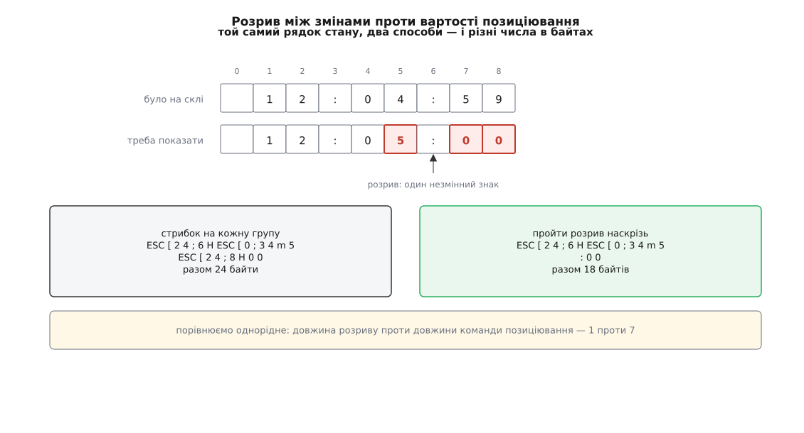

# ⚙️ Мініатюрне оновлення екрана: два буфери й ціна в байтах

Триста рядків на C без жодного виклику curses: два буфери комірок, кілька функцій, що зводять перший до другого, і лічильник, який показує, у скільки байтів обійшовся кожен із них. Мета — не повторити бібліотеку, а побачити на власних числах, звідки в оновленні екрана беруться двадцятикратні різниці.

Уся конструкція тримається на одній хитрості у вимірюванні. Якщо програма справді друкує в термінал, порівняти два способи на **тому самому** кадрі неможливо: перший уже змінив стан скла, і другий працює вже з іншого початку. Тому «дріт» тут — структура, яка приймає байти й може їх або надіслати, або просто порахувати. Вимикаємо надсилання — і той самий кадр можна звести трьома різними способами, а три числа покласти поруч.

## Комірка, буфер і дріт, що вміє мовчати

```c
/* mini-update.c — дві копії екрана й три способи звести першу до другої.
   cc -std=c11 -O2 -Wall mini-update.c -o mini-update */
#include <stdint.h>
#include <stdio.h>

#define ROWS 24
#define COLS 80

/* Комірка — знак і ознаки разом. attr: біти 0…2 — колір тексту (0…7),
   біт 3 — жирний. Один байт на знак, тому в кадрі тільки ASCII. */
typedef struct { unsigned char ch, attr; } Cell;
typedef struct { Cell c[ROWS][COLS]; } Screen;

static int cell_eq(Cell a, Cell b) { return a.ch == b.ch && a.attr == b.attr; }

/* «Дріт»: рахує байти, а за emit == 1 ще й справді їх друкує. */
typedef struct {
        size_t bytes;
        int    emit;
        int    cy, cx;   /* де стоїть курсор; cx < 0 — «не знаємо» */
        int    attr;     /* які ознаки ввімкнені; < 0 — «не знаємо» */
} Wire;

static void put(Wire *w, const char *s, size_t n)
{
        w->bytes += n;
        if (w->emit)
                fwrite(s, 1, n, stdout);
}

static int cup_len(int y, int x)                 /* скільки важить стрибок туди */
{
        char b[16];
        return snprintf(b, sizeof b, "\033[%d;%dH", y + 1, x + 1);
}

static void cup(Wire *w, int y, int x)
{
        char b[16];
        int n = snprintf(b, sizeof b, "\033[%d;%dH", y + 1, x + 1);

        put(w, b, (size_t) n);
        w->cy = y;
        w->cx = x;
}

static int sgr_len(int a) { return a == 0 ? 3 : (a & 8) ? 9 : 7; }

static void sgr(Wire *w, int a)
{
        char b[16];
        int n;

        if (a == w->attr)
                return;                          /* уже ввімкнене вдруге не вмикаємо */
        if (a == 0)
                n = snprintf(b, sizeof b, "\033[m");
        else
                n = snprintf(b, sizeof b, "\033[0;%s3%dm", (a & 8) ? "1;" : "", a & 7);
        put(w, b, (size_t) n);
        w->attr = a;
}

static void emit_cell(Wire *w, Cell c)
{
        sgr(w, c.attr);
        put(w, (const char *) &c.ch, 1);
        if (++w->cx == COLS)
                w->cx = -1;      /* останню колонку кожен термінал доводить по-своєму */
}

/* Перед кожним виміром про курсор і ознаки термінала ми знову нічого не знаємо. */
static void begin(Wire *w) { w->bytes = 0; w->cy = 0; w->cx = -1; w->attr = -1; }
```

Три останні поля `Wire` — це вся пам'ять про приймач, і без них нічого не порахуєш чесно. Позицію курсора й ввімкнені ознаки термінал тримає в собі; кожна надіслана команда їх міняє. Хто цього не веде, той друкує позиціювання там, де курсор уже стоїть, і вмикає колір, який уже ввімкнений, — на кадр набігають сотні зайвих байтів.

Від'ємне значення означає «не знаємо», і одне таке місце варте окремої згадки. Після знака в останній колонці термінали розходяться: одні переносять курсор на наступний рядок одразу, інші тримають його «за краєм» до наступного знака. Гадати тут не можна, тож ми просто оголошуємо позицію невідомою — і платимо за наступне позиціювання повну ціну.

## Три способи звести один буфер до другого

Перший спосіб не порівнює нічого: малює весь кадр від першої комірки до останньої. Другий іде по комірках і друкує тільки відмінні, стрибаючи курсором на кожну групу. Третій відрізняється від другого однією думкою — **курсор уже десь стоїть**, і якщо між двома змінами лежить кілька незмінних знаків, передрукувати їх дешевше, ніж переставляти курсор. Позиціювання на двадцять четвертий рядок коштує сім-вісім байтів; незмінна двокрапка між двома цифрами годинника коштує один.



*Порівнюємо однорідне: довжину розриву в байтах проти довжини команди позиціювання — і беремо менше.*

```c
/* 1. Повне перемальовування: нічого не порівнюємо. */
static size_t redraw_full(Wire *w, const Screen *ns)
{
        for (int y = 0; y < ROWS; y++) {
                cup(w, y, 0);
                for (int x = 0; x < COLS; x++)
                        emit_cell(w, ns->c[y][x]);
        }
        return w->bytes;
}

/* 2. Різниця по комірках: перед кожною групою — своє позиціювання. */
static size_t redraw_diff(Wire *w, const Screen *cur, const Screen *ns)
{
        for (int y = 0; y < ROWS; y++)
                for (int x = 0; x < COLS; x++) {
                        if (cell_eq(cur->c[y][x], ns->c[y][x]))
                                continue;
                        if (w->cy != y || w->cx != x)
                                cup(w, y, x);
                        emit_cell(w, ns->c[y][x]);
                }
        return w->bytes;
}

/* Скільки коштує передрукувати незмінний проміжок [a, b) у рядку y:
   самі знаки плюс перемикання ознак, якщо всередині вони міняються. */
static int gap_cost(const Screen *ns, int y, int a, int b, int attr)
{
        int n = 0;

        for (int x = a; x < b; x++) {
                if (ns->c[y][x].attr != attr) {
                        attr = ns->c[y][x].attr;
                        n += sgr_len(attr);
                }
                n++;
        }
        return n;
}

/* 3. Те саме, але з пам'яттю про те, де вже стоїть курсор. */
static size_t redraw_near(Wire *w, const Screen *cur, const Screen *ns)
{
        for (int y = 0; y < ROWS; y++) {
                int x = 0;

                while (x < COLS) {
                        while (x < COLS && cell_eq(cur->c[y][x], ns->c[y][x]))
                                x++;
                        if (x == COLS)
                                break;
                        if (w->cy != y || w->cx != x)
                                cup(w, y, x);
                        for (;;) {
                                int g;

                                emit_cell(w, ns->c[y][x]);
                                x++;
                                for (g = x; g < COLS && cell_eq(cur->c[y][g], ns->c[y][g]); g++)
                                        ;
                                if (g == COLS)
                                        break;               /* далі в рядку змін немає */
                                if (gap_cost(ns, y, x, g, w->attr) > cup_len(y, g))
                                        break;               /* стрибнути дешевше */
                                while (x < g)                /* пройти розрив наскрізь */
                                        emit_cell(w, ns->c[y][x++]);
                        }
                }
        }
        return w->bytes;
}
```

Зверніть увагу, що `gap_cost` рахує не самі лише знаки. Якщо всередині розриву міняється колір, за нього теж треба заплатити — і цілком може вийти, що незмінних знаків мало, а вартість їх передруку більша за стрибок. Порівнювати можна лише однорідне: байти проти байтів.

## Прокрутка: коли різниця по комірках бреше

Тепер випадок, на якому обидві різниці програють. У списку з'явився рядок, решта з'їхала на позицію. Порівняння комірка за коміркою каже, що змінився майже весь екран: у кожному рядку тепер стоїть вміст сусіднього. А потрібна одна команда — вставити чи вилучити рядок.

Помітити це порівнянням комірок неможливо в принципі: воно дивиться на позиції, а прокрутка позиції зсуває. Тому перед різницею йде окремий крок — узяти від кожного рядка обох буферів [коротке число замість вмісту](topic:sf-algorithms/non-cryptographic-hash) і питати вже про рядки цілком: чи не є новий екран старим, зсунутим на кілька позицій? Це варіант алгоритму Гекеля для [порівняння двох послідовностей](topic:sf-algorithms/sequence-diff) — Пол Гекель описав його в *Communications of the ACM* за квітень 1978 року; ncurses використовує саме його, прискорений хешуванням, і хеш там — той самий зсув-плюс, що й у коді нижче.

Головна пастка тут одна, і вона тиха. Порожній рядок збігається з порожнім при **будь-якому** зсуві. Якщо дати голосувати всім рядкам, двадцять порожніх рядків підтвердять будь-яку нісенітницю. Тому голосують лише ті, чий хеш неповторний з обох боків, — і саме так робить оригінал: спершу однозначні пари, і аж потім смуга навколо них розростається на сусідні рядки.

```c
/* Той самий зсув-плюс, що в hashmap.c самого ncurses. */
static uint64_t row_hash(const Cell *row)
{
        uint64_t h = 0;

        for (int x = 0; x < COLS; x++) {
                h += (h << 5) + row[x].ch;
                h += (h << 5) + row[x].attr;
        }
        return h;
}

static int uniq(const uint64_t *h, int i)
{
        for (int k = 0; k < ROWS; k++)
                if (k != i && h[k] == h[i])
                        return 0;
        return 1;
}

typedef struct { int d, top, bot; } Shift;   /* d > 0 — вміст поїхав УНИЗ */

static Shift find_shift(const Screen *cur, const Screen *ns)
{
        uint64_t ho[ROWS], hn[ROWS];
        Shift none = { 0, 0, 0 }, s = { 0, 0, 0 };
        int best_d = 0, votes = 0, run = 0, blen = 0, bot = 0;

        for (int y = 0; y < ROWS; y++) {
                ho[y] = row_hash(cur->c[y]);
                hn[y] = row_hash(ns->c[y]);
        }

        /* Голосують лише рядки, неповторні з обох боків. */
        for (int d = -(ROWS - 1); d <= ROWS - 1; d++) {
                int v = 0;

                if (d == 0)
                        continue;
                for (int y = 0; y < ROWS; y++) {
                        int src = y - d;

                        if (src < 0 || src >= ROWS)
                                continue;
                        if (hn[y] == ho[src] && uniq(hn, y) && uniq(ho, src))
                                v++;
                }
                if (v > votes) {
                        votes = v;
                        best_d = d;
                }
        }
        if (votes == 0)
                return none;

        /* Найдовша суцільна смуга при цьому зсуві — уже без вимоги неповторності. */
        for (int y = 0; y < ROWS; y++) {
                int src = y - best_d;

                if (src >= 0 && src < ROWS && hn[y] == ho[src]) {
                        if (++run > blen) {
                                blen = run;
                                bot = y;
                        }
                } else {
                        run = 0;
                }
        }
        if (blen < 3)            /* дрібний збіг команди прокручування не вартий */
                return none;

        s.d = best_d;
        s.bot = bot;
        s.top = bot - blen + 1;
        return s;
}

/* Смуга прокручування, одна команда — і та сама зміна у власній копії. */
static void scroll_lines(Wire *w, Screen *cur, Shift s)
{
        Screen old = *cur;
        Cell blank = { ' ', 0 };
        char b[24];
        int n;
        int rtop = s.top < s.top - s.d ? s.top : s.top - s.d;   /* і приймачі, */
        int rbot = s.bot > s.bot - s.d ? s.bot : s.bot - s.d;   /* і джерела    */

        if (rtop < 0)
                rtop = 0;
        if (rbot > ROWS - 1)
                rbot = ROWS - 1;

        n = snprintf(b, sizeof b, "\033[%d;%dr", rtop + 1, rbot + 1);  /* смуга */
        put(w, b, (size_t) n);
        cup(w, rtop, 0);
        n = snprintf(b, sizeof b, "\033[%d%c", s.d > 0 ? s.d : -s.d,
                     s.d > 0 ? 'L' : 'M');                            /* вставити / вилучити */
        put(w, b, (size_t) n);
        put(w, "\033[r", 3);                                          /* смуга назад */
        w->cx = -1;              /* куди IL і DL лишають курсор — не вгадуємо */

        for (int y = rtop; y <= rbot; y++) {
                int src = y - s.d;

                for (int x = 0; x < COLS; x++)
                        cur->c[y][x] = (src >= rtop && src <= rbot) ? old.c[src][x] : blank;
        }
}
```

> 🔧 **Навіщо це.** Коли текстовий інтерфейс на повільному з'єднанні відчутно «дихає» на кожне натискання, міряти треба не час, а байти: поставте `emit = 0`, проженіть свій кадр і подивіться на число. Найчастіше виявляється, що програма щоразу передруковує рамку й рядок стану, які не змінилися, — і виграш лежить у різниці, а не в швидшому дроті.

Дві дрібниці в цій функції важливіші, ніж здаються. Перша — смуга: команда вставлення рядка тягне за собою **все** до низу екрана, тобто й рядок стану, який нікуди їхати не мав. Тому перед нею виставляють межі прокручування, а після — знімають; без цього виграш у байтах оплачується зіпсованим рядком унизу. Друга — останній цикл: те саме перетворення треба зробити й у власній копії. Бібліотека, яка надіслала терміналові команду й не оновила свою пам'ять, з цієї миті бреше сама собі.

## Числа

Кадр — переглядач журналу: двадцять три рядки повідомлень і рядок стану внизу з годинником і лічильниками. Кожен сьомий рядок червоний і жирний, рядок стану синій — щоб у грі брали участь і ознаки.

```c
static const char *const TEMPL[5] = {
        "%05d  sshd[%d]: accepted publickey for andrij from 10.0.4.7",
        "%05d  kernel: usb 1-2: new high-speed device number %d",
        "%05d  cron[%d]: (root) CMD (/usr/lib/sysstat/sa1 1 1)",
        "%05d  systemd[1]: started session %d of user andrij",
        "%05d  nginx: GET /api/v1/status 200 %d bytes",
};

static void put_text(Screen *s, int y, int x, const char *t, int attr)
{
        for (int i = 0; t[i] && x + i < COLS; i++) {
                s->c[y][x + i].ch = (unsigned char) t[i];
                s->c[y][x + i].attr = (unsigned char) attr;
        }
}

static void build(Screen *s, int first, const char *clock, int hits)
{
        char buf[COLS + 1];

        for (int y = 0; y < ROWS; y++)
                for (int x = 0; x < COLS; x++) {
                        s->c[y][x].ch = ' ';
                        s->c[y][x].attr = 0;
                }
        for (int y = 0; y < ROWS - 1; y++) {
                int n = first + y;

                snprintf(buf, sizeof buf, TEMPL[n % 5], n, 4000 + n);
                put_text(s, y, 0, buf, n % 7 == 0 ? 9 : 0);
        }
        snprintf(buf, sizeof buf, " %s   lines %d   matches %-4d   q quits",
                 clock, first + ROWS - 2, hits);
        put_text(s, ROWS - 1, 0, buf, 4);
}

static void measure(const char *what, const Screen *cur, const Screen *ns)
{
        Wire w = { 0, 0, 0, -1, -1 };
        Screen tmp = *cur;              /* прокрутка міняє копію — вимір псувати не можна */
        Shift s;
        size_t full, diff, near, scrl;

        begin(&w); full = redraw_full(&w, ns);
        begin(&w); diff = redraw_diff(&w, cur, ns);
        begin(&w); near = redraw_near(&w, cur, ns);

        begin(&w);
        s = find_shift(&tmp, ns);
        if (s.d)
                scroll_lines(&w, &tmp, s);
        scrl = redraw_near(&w, &tmp, ns);

        printf("%s\n", what);
        printf("   повне перемальовування   %6zu\n", full);
        printf("   різниця по комірках      %6zu\n", diff);
        printf("   різниця з курсором       %6zu\n", near);
        if (s.d)
                printf("   + прокрутка (зсув %+d)    %6zu   смуга %d…%d\n",
                       s.d, scrl, s.top, s.bot);
        else
                printf("   прокрутки не видно\n");
        putchar('\n');
}

int main(void)
{
        static Screen a, b;

        puts("екран 80×24, ціна оновлення в байтах\n");

        build(&a, 100, "12:04:59", 41);
        build(&b, 100, "12:04:59", 42);
        measure("лічильник 41 → 42", &a, &b);

        build(&a, 100, "12:04:59", 41);
        build(&b, 100, "12:05:00", 41);
        measure("годинник 04:59 → 05:00", &a, &b);

        build(&a, 100, "12:04:59", 41);
        build(&b, 101, "12:04:59", 41);
        measure("список поїхав на рядок", &a, &b);
        return 0;
}
```

```
екран 80×24, ціна оновлення в байтах

лічильник 41 → 42
   повне перемальовування     2128
   різниця по комірках          16
   різниця з курсором           16
   прокрутки не видно

годинник 04:59 → 05:00
   повне перемальовування     2128
   різниця по комірках          24
   різниця з курсором           18
   прокрутки не видно

список поїхав на рядок
   повне перемальовування     2128
   різниця по комірках        1954
   різниця з курсором         1479
   + прокрутка (зсув -1)       100   смуга 0…21
```

Число 2128 варте окремої уваги. Голих знаків у кадрі 80 × 24 рівно 1920; решта — 159 байтів на позиціювання в кожен рядок і 49 на перемикання кольорів. Навіть найтупіший спосіб коштує помітно більше, ніж каже проста арифметика «рядки на колонки».

Числа кажуть три різні речі. На одній зміненій цифрі різниця виграє у сто тридцять разів — і це та сама причина, з якої редактор на повільному каналі взагалі можливий. На годиннику видно, чого варта пам'ять про курсор: 24 байти проти 18, і весь виграш — з одного не зробленого стрибка через двокрапку. А на прокрутці різниця по комірках майже наздоганяє повне перемальовування (1954 проти 2128) — вона чесно бачить, що змінилося все, і чесно все передруковує. Одна команда вилучення рядка робить те саме за 100 байтів разом із дорисовуванням того, що прокрутка не покриває.

## Ціна й пастки

Обидві різниці — один прохід по комірках, тобто `ROWS · COLS` порівнянь на кадр незалежно від того, скільки насправді змінилося: для 80×24 це 1920 порівнянь у пам'яті — дешевше за один зайвий стрибок курсора в дроті. Пошук зсуву в цьому вигляді квадратичний за рядками, а `uniq` усередині додає ще множник — для двадцяти чотирьох рядків це нічого, але ncurses не дарма будує хеш-таблицю й обходиться лінійним проходом. Ще одна межа з оригіналу перенесена сюди свідомо: смуга коротша за три рядки не вважається прокруткою — команда та її наслідки не окупляться.

**Буферизація й вивід перед читанням клавіші.** Поставте `emit = 1` — і програма справді малюватиме. Тоді з'ясується, що `fwrite` кладе байти в буфер `stdio`, а не в термінал, і на екрані нічого немає, доки буфер не заповниться. Правило просте: перед кожним читанням клавіші — `fflush(stdout)`. Інакше програма чекає на людину, людина чекає на екран, і обидві мають рацію ([буферизація stdio](topic:sys-unix/stdio-buffering) — три режими й те, як вибір між ними залежить від того, термінал на іншому кінці чи файл). Ncurses цю пастку прибирає тим, що тримає власний буфер і сама спорожняє його наприкінці оновлення.

**Ознаки — частина комірки, а не окремий шар.** Спокуса тримати кольори осторонь від знаків велика, і вона неправильна. Порівняння `cell_eq` дивиться на обидва поля: знак не змінився, а колір змінився — комірку треба перемалювати. Якби ознаки жили окремим масивом, різниця по знаках сказала б «усе гаразд», і на склі лишився б старий колір. Із цієї ж вимоги — тримати все про комірку в одному місці — виріс і `chtype` у справжній бібліотеці.

**А ще ознаки липкі.** Термінал не має «ознак комірки»: увімкнений колір діє на все, що друкується далі. Тому `Wire` веде поточний стан і перемикає його лише на межах, а `gap_cost` про це пам'ятає. Хто про липкість забув, той або фарбує пів екрана в чужий колір, або платить сім байтів на кожен знак.

**Власна копія — віра, а не знання.** Увесь виграш побудований на припущенні, що `cur` збігається зі склом. Жодного способу це перевірити немає: намальоване з термінала не читається. Досить чужого `printf` у той самий дескриптор — і копія стала брехнею, а різниця й далі старанно оминатиме комірки, яких на склі вже немає. Тому кожна така бібліотека має кнопку «забути»: оголосити копію невідомою й намалювати кадр повністю. У нашій програмі це один рядок — заповнити `cur` неможливими комірками (скажімо, знаком `0xFF`) перед наступним `redraw_full`.

Три способи можна не вибирати наперед. Порахуйте два-три варіанти на однакових вхідних даних, візьміть найдешевший — саме це робить справжній оптимізатор, і саме тому [керуючі послідовності](topic:sys-unix/terminal-escape-sequences) в ньому ніде не зашиті: вартість кожної команди приходить з опису конкретного термінала, і на різних приймачах виграє різна стратегія.
