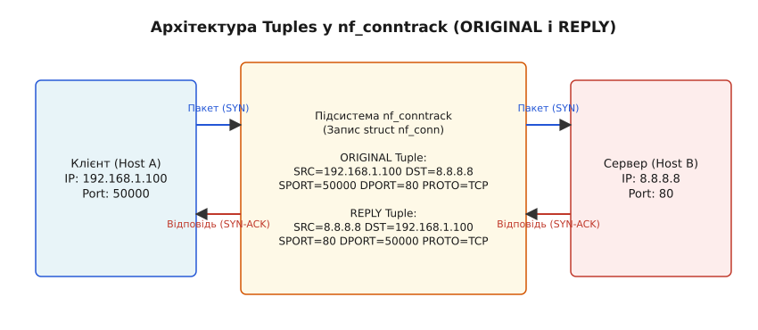
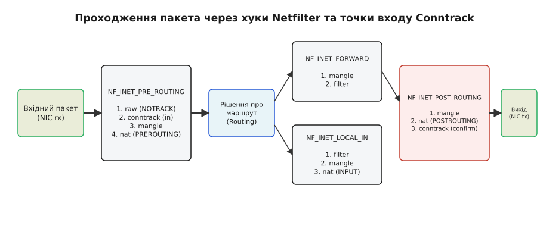
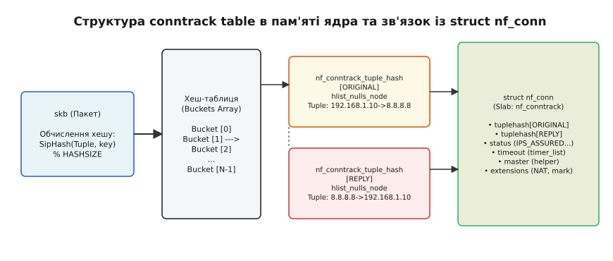

# Підсистема відстеження зʼєднань Conntrack (nf_conntrack) та conntrack tables

<preknowlist>
- [Мережеві інтерфейси та підсистема sk_buff](root:sys-unix/interfaces-and-addresses) — внутрішня структура socket buffer (`sk_buff`) у ядрі Linux та проходження пакетів через мережевий стек.
- [Netfilter та хуки ядра (iptables/nftables)](root:sys-unix/netfilter-model) — п'ять точок перехоплення пакетів у підсистемі Netfilter та структура таблиць правилами.
</preknowlist>

Кожен мережевий пакет IPv4 або IPv6, що надходить на мережевий інтерфейс Linux, передається транспортному протоколу як повністю ізольована одиниця даних. Сам по собі IP-пакет не містить жодної історії: ядро бачить лише набір бітів у заголовку (адреси, порти, прапорці) і не знає, чи є цей пакет легітимною відповіддю на раніше відправлений запит, чи це спроба зловмисника сканувати зачинені порти внутрішнього сервера. Без збереження стану мережевий фаєрвол змушений або блокувати всі вхідні пакети (унеможливлюючи роботу вебклієнтів), або залишати діапазони портів відкритими.

Підсистема **Netfilter Connection Tracking (nf_conntrack)** вирішує цю фундаментальну суперечність. Вона перехоплює пакети на найраніших етапах обробки в ядрі, аналізує їхні заголовочні поля і будує в оперативній пам'яті динамічний автомат станів сесій. Саме завдяки `nf_conntrack` мережевий стек Linux перетворюється з простішого пакетного фільтра на інтелектуальну stateful-систему, здатну обслуговувати механізми трансляції адрес (NAT), розмежовувати приватні й публічні мережеві зони та захищати сервери від сканування і досованих атак. Історію розвитку цієї підсистеми від безпам'ятних фільтрів `ipchains` до уніфікованого ядра розкрито у винесеній праці [Еволюція відстеження зʼєднань у Linux](root:sys-unix/netfilter-conntrack-architecture/hist-conntrack-evolution.md).

## Фундамент ідентифікації: кортежі (Tuples) та двонаправленість

Основою роботи `nf_conntrack` є поняття **кортежу адресації (Tuple)**. Кортеж — це структура даних у ядрі (`struct nf_conntrack_tuple`), яка однозначно фіксує характеристики потоку пакетів, що рухаються в одному конкретному напрямку.

Для ідентифікації звичайного TCP або UDP з'єднання ядро витягує з заголовків п'ять обов'язкових параметрів (так званий 5-tuple):
1. **L3 Protocol:** протокол мережевого рівня (`AF_INET` для IPv4 або `AF_INET6` для IPv6).
2. **L4 Protocol:** номер протоколу транспортного рівня (`IPPROTO_TCP`, `IPPROTO_UDP`, `IPPROTO_SCTP` тощо).
3. **Source Address:** IP-адреса джерела пакетів.
4. **Destination Address:** IP-адреса призначення.
5. **Port Pairs / L4 Key:** порти джерела й призначення (для TCP/UDP) або ID запиту й тип/код (для ICMP echo).

### Парна модель: ORIGINAL та REPLY

З'єднання у фізичному світі завжди двонаправлене. Проте з погляду мережевого стека Linux прибуття запиту й повернення відповіді — це дві різні послідовності пакетів із дзеркально перевернутими адресами. Тому для кожного відстежуваного з'єднання `nf_conntrack` створює і підтримує одночасно **два кортежі**:

- **`IP_CT_DIR_ORIGINAL` (напрямок ініціалізації):** записує параметри найпершого пакета, який створив це з'єднання (наприклад, SYN-пакет від клієнта `192.168.1.100:50000` до сервера `8.8.8.8:80`).
- **`IP_CT_DIR_REPLY` (напрямок відповіді):** містить дзеркально перевернуті параметри, які ядро очікує побачити у пакетах-відповідях (`8.8.8.8:80` → `192.168.1.100:50000`).


*Принцип мапінгу кортежів ORIGINAL та REPLY для ідентифікації прямих і зворотних потоків пакетів*

Коли сервер надсилає зворотний пакет SYN-ACK, ядро обчислює його хеш і порівнює з кортежем `REPLY`. Оскільки `REPLY` вже зареєстровано в таблиці conntrack, ядро негайно розпізнає пакет як належний до існуючої сесії і присвоює йому стан `ESTABLISHED`.

### Трансляція адрес (NAT) та трансформація REPLY-кортежу

Магія Network Address Translation (SNAT, DNAT, MASQUERADE) у Linux повністю базується на модифікації `REPLY` кортежу.

Уявіть ситуацію, коли маршрутизатор із зовнішньою адресою `203.0.113.1` виконує SNAT для внутрішнього клієнта `192.168.1.100`, що звертається до вебсервера `8.8.8.8:80`. Коли перший пакет SYN проходить через таблицю `nat` у хуку `POSTROUTING`, ядро підміняє адресу джерела у самому пакеті на `203.0.113.1`. Одночасно підсистема `nf_conntrack` змінює кортеж `REPLY` у структурі з'єднання:
- Початковий `REPLY`: `SRC=8.8.8.8 DST=192.168.1.100 SPORT=80 DPORT=50000`
- Трансформований `REPLY`: `SRC=8.8.8.8 DST=203.0.113.1 SPORT=80 DPORT=50000`

Коли з інтернету повертається пакет від сервера `8.8.8.8` на адресу `203.0.113.1:50000`, ядро знаходить відповідність із трансформованим `REPLY` кортежем і автоматично відновлює початкову внутрішню адресу `192.168.1.100` у `sk_buff` ще до того, як пакет потрапить у таблицю маршрутизації. Без `nf_conntrack` виконання зворотного NAT ("де-NAT") було б неможливим.

## Точки перехоплення пакетів: conntrack у хуках Netfilter

Для того щоб інформація про стан з'єднання була доступна всім іншим підсистемам ядра (iptables, nftables, eBPF, NAT), `nf_conntrack` підключає власні обробники (hooks) до п'яти точок розгалуження мережевого стека Netfilter.


*Послідовність обробки пакета у хуках Netfilter та точки входу підсистеми conntrack*

Обробка пакета conntrack розділена на два фундаментальних етапи: **вхідний аналіз (`in`)** та **фіксація з'єднання (`confirm`)**.

### 1. Етап вхідного аналізу: `nf_conntrack_in` (PREROUTING та LOCAL_OUT)

Функція `nf_conntrack_in` (визначена у `net/netfilter/nf_conntrack_core.c`) реєструється з найвищим пріоритетом (`NF_IP_PRI_CONNTRACK = -200`) у хуках `NF_INET_PRE_ROUTING` (для вхідного трафіку з мережевої карти) та `NF_INET_LOCAL_OUT` (для трафіку, згенерованого локальними процесами):

1. **Перевірка режиму NOTRACK:** Якщо пакет пройшов через таблицю `raw` і отримав мітку виключення з відстеження (`skb->_nfct == UNTRACKED`), `nf_conntrack_in` негайно завершує роботу.
2. **Витягнення кортежу та пошук у таблиці:** Функція `resolve_normal_ct()` витягує з заголовків пакета початковий `struct nf_conntrack_tuple`. За його хешем здійснюється пошук у глобальній хеш-таблиці з'єднань через `__nf_conntrack_find_get()`.
3. **Виділення тимчасового стану:** 
   - Якщо з'єднання знайдено, пакет прив'язується до існуючого `struct nf_conn`, а стан TCP/UDP автомата оновлюється через `nf_conntrack_handle_packet()`.
   - Якщо з'єднання відсутнє, функція `init_conntrack()` виділяє з магістрального slab-кешу нову структуру `struct nf_conn`, заповнює кортежі `ORIGINAL` та `REPLY` і позначає з'єднання як нове (`NEW`).
4. **Прив'язка до sk_buff:** Вказівник на структуру з'єднання зберігається прямо у системному буфері пакета `skb->_nfct`. Усі наступні таблиці (`mangle`, `nat`, `filter`) зчитують цей вказівник через макроси `ct state` або `m state` за `O(1)` операцій без повторного пошуку в пам'яті.

### 2. Етап підтвердження: `nf_conntrack_confirm` (POSTROUTING та LOCAL_IN)

Новостворена структура `struct nf_conn` **не додається** до глобальної хеш-таблиці негайно у хуку `PREROUTING`. Якби ядро додавало запис одразу, зловмисник міг би відправити флуд із заблокованими пакетами і заповнити пам'ять сервера невалідними з'єднаннями, які навіть не пройшли фільтрацію.

Додавання запису до глобальної хеш-таблиці здійснюється у найостаннішому хуку `nf_conntrack_confirm` із найнижчим пріоритетом (`NF_IP_PRI_CONNTRACK_CONFIRM = INT_MAX`):
- Для транзитного трафіку — у хуку `NF_INET_POST_ROUTING` (після проходження всіх правил `filter` та `nat`).
- Для локального трафіку — у хуку `NF_INET_LOCAL_IN` (безпосередньо перед передачею пакета у сокет застосунку).

Функція `__nf_conntrack_confirm()` вирішує критичну гонку умов (race condition), коли два паралельних CPU-ядра одночасно обробляють перший SYN та зворотний SYN-ACK для одного і того самого з'єднання. Під захистом кошикового spin-lock (`spin_lock_bh`) ядро перевіряє, чи не зареєстрував інший CPU цей кортеж мікросекунду тому. Якщо колізії немає, `confirm` атомарно виставляє біт `IPS_CONFIRMED` у полі `ct->status`, вставляє вузли `tuplehash[ORIGINAL]` та `tuplehash[REPLY]` у глобальну хеш-таблицю і генерує Netlink-подію `NFCT_T_NEW`.

Якщо пакет було скинуто фаєрволом (rule target `DROP`) у таблиці `filter`, пакет знищується разом із тимчасовим `skb->_nfct`, і незатверджене з'єднання взагалі не потрапляє до таблиці conntrack.

## Організація пам'яті та структури даних ядра

Щоб обслуговувати мільйони паралельних з'єднань на мережевих лінках 10/40/100 Gbps, підсистема `nf_conntrack` використовує спеціалізовані структури даних ядра Linux.


*Організація хеш-таблиці conntrack, кошиків hlist_nulls та зв'язок із двома кортежами nf_conn*

### Головна структура з'єднання: `struct nf_conn`

Оголений опис з'єднання в ядрі визначено у заголовочному файлі `include/net/netfilter/nf_conntrack.h`:

```c
struct nf_conn {
    struct nf_conntrack ct_general;
    spinlock_t lock;

    /* Двоповерховий масив для двох напрямків: ORIGINAL та REPLY */
    struct nf_conntrack_tuple_hash tuplehash[IP_CT_DIR_MAX];

    unsigned long status;      /* Бітові прапорці IPS_* */
    possible_net_t ct_net;     /* Посилання на мережевий namespace */

    struct timer_list timeout; /* Таймер видалення за застарілістю */

#if IS_ENABLED(CONFIG_NF_CONNTRACK_MARK)
    u32 mark;                  /* 32-бітний connmark */
#endif

    /* Вказівник на master-з'єднання (для RELATED потоків, наприклад FTP) */
    struct nf_conn *master;

    /* Динамічні розширення (NAT, helpers, timestamping, acct) */
    struct nf_ct_ext *ext;
};
```

### Хеш-таблиця та списки `hlist_nulls`

Усі активні з'єднання зберігаються у глобальній хеш-таблиці `net->ct.hash`. Таблиця є масивом кошиків (buckets) типу `struct hlist_nulls_head`.

Особливістю використання `hlist_nulls` замість стандартних зв'язаних списків є можливість безпечного пошуку записів під час дії механізму **RCU (Read-Copy-Update)** без захоплення блокувань на читання:
1. Оскільки кожна структура `nf_conn` містить два вузли `tuplehash[ORIGINAL]` та `tuplehash[REPLY]`, вона присутня у двох кошиках хеш-таблиці одночасно.
2. При пошуку обчислюється хеш від кортежу за допомогою SipHash із додаванням системного secret-ключа (`hash_mix`).
3. При зчитуванні за допомогою `rcu_read_lock()` ядро проходить по ланцюжку `hlist_nulls_for_each_entry_rcu()`. Якщо під час читання паралельний потік змінив структуру списку або перемістив запис в інший кошик, спеціальний маркер `nulls` (значення з виставиленим старшим бітом) наприкінці списку дозволяє розпізнати ситуацію, звірити індекс кошика і повторити пошук з початку списку без паніки ядра.

### Дрібнозернисте локування: `nf_conntrack_locks`

Для уникнення контенції блокувань на багатоядерних серверах ядро Linux розділяє хеш-таблицю на масив блокувань `nf_conntrack_locks` (за замовчуванням 1024 або 4096 окремих spin-lock засувок). Кожен кошик хеш-таблиці проектується на відповідний spin-lock за остачею від ділення номеру кошика. Це дозволяє паралельно додавати або видаляти з'єднання в різних слотах хеш-таблиці на сотнях CPU-ядер без взаємного очікування.

Для зменшення накладних витрат на виділення пам'яті ядро виділяє структури `nf_conn` не через `kmalloc()`, а зі спеціалізованого кешу slab-алокатора `nf_conntrack_cachep`.

## Динаміка станів та класифікація пакетів

Conntrack абстрагує протоколи транспортного рівня до універсальної матриці станів.

### Граф станів TCP та перевірка вікон (Sequence Validation)

Для протоколу TCP `nf_conntrack` реалізує внутрішній автомат станів (`struct ip_ct_tcp` у `net/netfilter/nf_conntrack_proto_tcp.c`), який аналізує прапорці заголовка (SYN, ACK, FIN, RST) та відстежує вікна послідовностей (sequence number validation):

1. **`SYN_SENT` / `SYN_RECV` (`NEW`):** Перший пакет із прапорцем SYN створює запис у стані `NEW`. Тайм-аут очікування відповіді короткий (за замовчуванням 120 секунд).
2. **`ESTABLISHED`:** Отримання зворотного пакета з прапорцем ACK переводить автомат у стан `ESTABLISHED`. У цьому стані запис отримує прапорець **`IPS_ASSURED`**, а тайм-аут утримування зростає до кількох годин або днів.
3. **`FIN_WAIT` / `CLOSE_WAIT` / `LAST_ACK`:** Коли одна зі сторін надсилає пакет FIN, стан переходить у фазу закриття, зменшуючи тайм-аут до 120–300 секунд.
4. **`TIME_WAIT`:** Остаточна фаза після закриття TCP-сесії (за замовчуванням тайм-аут 120 секунд), необхідна для поглинання запізнілих дублікатів пакетів у мережі.

Окрім аналізу прапорців, `nf_conntrack` запам'ятовує максимальний номер послідовності `td_maxend` та розмір вікна `td_maxwin`. Якщо зловмисник спробує вприснути підроблений ACK-пакет із номером послідовності поза межами відстежуваного TCP-вікна, conntrack позначить такий пакет станом **`INVALID`**, і правило фаєрволу відкине його без передачі до сокета застосунку.

Якщо асиметрична маршрутизація викликає помилкові позначки `INVALID` для валідних пакетів, поведінку перевірки вікна можна послабити за допомогою системного параметра:
```bash
sysctl -w net.netfilter.nf_conntrack_tcp_be_liberal=1
```

### Псевдостани для UDP та ICMP

Протокол UDP не має вікна з'єднання і є безпам'ятним за своєю природою. Проте `nf_conntrack` моделює псевдосесію для UDP:
- **Однонаправлений UDP (`NEW`):** Після виправлення першого пакета (наприклад, DNS-запит від клієнта) створюється запис з коротким тайм-аутом (`nf_conntrack_udp_timeout = 30` секунд).
- **Двонаправлений UDP (`ESTABLISHED`):** Як тільки з сервера приходить зворотний UDP-пакет (DNS-відповідь), з'єднання отримує прапорець `IPS_SEEN_REPLY` та `IPS_ASSURED`, а тайм-аут зростає до 180 секунд.

ICMP-пакети (наприклад, `Echo Request` / `Echo Reply` або повідомлення про помилки `Destination Unreachable`) прив'язуються до батьківських TCP/UDP з'єднань за допомогою аналізу вкладеного IP-заголовка і маркуються станом **`RELATED`**.

### Системні прапорці `status` (`IPS_*`)

- **`IPS_SEEN_REPLY`:** Ядро побачило принаймні один легітимний пакет у напрямку `REPLY`.
- **`IPS_ASSURED`:** З'єднання вважається повністю встановленим і підтвердженим. Під час переповнення таблиці conntrack ядро **ніколи не видаляє** з'єднання з прапорцем `IPS_ASSURED` примусово (early drop знищує лише непідтверджені з'єднання без `IPS_ASSURED`).
- **`IPS_SRC_NAT` / `IPS_DST_NAT`:** До даного з'єднання застосовано трансляцію адрес SNAT або DNAT.
- **`IPS_CONFIRMED`:** Запис успішно додано до глобальної хеш-таблиці ядерного модуля.
- **`IPS_OFFLOAD`:** Потік даних переведено на апаратний офлоад (Flow Offloading / eBPF bypass) для прискорення маршрутизації без повторного проходження Netfilter-хуків.

## Розширені механізми: Conntrack Helpers, Zones та Hardware Flow Offload

### Application Layer Gateways (ALG) та Helpers

Деякі протоколи прикладного рівня (наприклад, FTP, SIP, H.323, TFTP) передають IP-адреси та порти для нових сесій всередині тексту самого корисного навантаження (payload) L7. Наприклад, команда FTP `PORT 192,168,1,100,195,4` інформує сервер, що передача файлу здійснюватиметься за окремим з'єднанням на порт `50000`.

Для обробки таких ситуацій у `nf_conntrack` передбачено **conntrack helpers** (наприклад, `nf_conntrack_ftp`). Помічник парсить L7-пакет, витягує динамічні порти і реєструє в ядрі спеціальну структуру очікування — **`struct nf_conntrack_expect`**. Коли сервер відкриває зворотний data-канал на вказаний порт, ядро розпізнає новий потік як **`RELATED`** до основного FTP-контрольного з'єднання і автоматично пропускає його через фаєрвол.

> [!WARNING]
> З міркувань безпеки автоматичне призначення помічників (`sysctl net.netfilter.nf_conntrack_helper = 1`) у сучасних ядрах Linux **вимкнено за замовчуванням**. Нефільтровані L7-помічники дозволяли зловмисникам здійснювати атаки класу CT-bypass (підробка L7-команд усередині HTTP-запитів). Сучасні правила вимагають явного призначення помічників через nftables/iptables:
> ```bash
> iptables -A PREROUTING -t raw -p tcp --dport 21 -j CT --helper ftp
> ```

### Ізоляція перекритих мереж: Conntrack Zones

У хмарних інфраструктурах, контейнеризації (Docker, Kubernetes) та VRF-маршрутизації часто виникає ситуація, коли різні ізольовані віртуальні мережі використовують однакові приватні діапазони IP-адрес (наприклад, дві незалежні tenant-мережі з IP `10.0.0.5`). 

Якби всі пакети потрапляли до спільної хеш-таблиці conntrack, ядро плутало б з'єднання з однакових IP-адрес і псувало таблиці NAT.

Для вирішення цієї проблеми розроблено механізм **Conntrack Zones (зон)**. Зона — це 16-бітне числове значення, яке додається до обчислення хешу кортежу `struct nf_conntrack_tuple`. За замовчуванням усі пакети потрапляють у зону `0`. 

За допомогою nftables або iptables пакету з конкретного мережевого інтерфейсу чи VLAN можна призначити власну зону:
```bash
iptables -t raw -A PREROUTING -i veth-tenantA -j CT --zone 10
iptables -t raw -A PREROUTING -i veth-tenantB -j CT --zone 20
```
Завдяки різним зонам однакові кортежі `10.0.0.5:50000 -> 8.8.8.8:80` у зоні `10` та зоні `20` отримують різні значення хешу і зберігаються у таблиці без жодних конфліктів.

### Апаратний прискорювач трафіку: Hardware Flow Offloading (`nf_flow_table`)

Для високошвидкісних маршрутизаторів 100+ Gbps проходження кожного пакета тривалого TCP-потоку через повний ланцюжок Netfilter-хуків створює суттєве навантаження на процесор. 

Сучасні ядра Linux (починаючи з 4.16) надають механізм **Flow Offloading (`nf_flow_table`)**. Як тільки з'єднання переходить у стан `ESTABLISHED`, nftables може передати потік у таблицю `flowtable`. Після цього подальші пакети цього потоку перехоплюються на рівні мережевої карти (NIC Hardware Offload) або на етапі `ingress` підсистеми Traffic Control (TC) і передаються напряму у вихідний інтерфейс без повторного виклику `nf_conntrack_in` та таблиць фаєрволу. Прапорець `IPS_OFFLOAD` у структурі `nf_conn` сигналізує, що потік прискорено на апаратному чи швидкісному рівні.

## Користувацький API, діагностика та моніторинг

Адміністратори та розробники мають декілька шляхів взаємодії з таблицею conntrack з простору користувача.

### 1. Текстовий інтерфейс `/proc/net/nf_conntrack`

Файл `/proc/net/nf_conntrack` містить дамп усіх поточних відстежуваних з'єднань ядра:

```text
ipv4 2 tcp 6 431998 ESTABLISHED src=192.168.1.100 dst=8.8.8.8 sport=50000 dport=443 src=8.8.8.8 dst=192.168.1.100 sport=443 dport=50000 [ASSURED] mark=0 zone=0 use=2
```

Проте зчитування `/proc/net/nf_conntrack` на високонавантажених серверах із сотнями тисяч з'єднань є **шкідливим антипатерном**: воно викликає виділення великих текстових буферів у ядрі, навантажує CPU і може викликати відчутні затримки в обробці мережевого трафіку.

### 2. Бінарний API Netlink (CTNETLINK) та утиліта `conntrack`

Для високопродуктивної роботи з таблицею використовується бінарний сокетний протокол Netlink. Офіційна CLI-утиліта `conntrack` спирається на C-бібліотеку `libnetfilter_conntrack`:

- Переглянути поточну кількість з'єднань: `sysctl net.netfilter.nf_conntrack_count`
- Отримати статистику таблиці (drop-пакети, лічильники, колізії хешу): `conntrack -S`
- Видалити всі з'єднання з конкретним IP: `conntrack -D -p tcp --orig-dst 10.0.0.1`
- Відстежувати події створення/знищення в реальному часі: `conntrack -E`

Для розробників власного системного софту інтерфейси C-бібліотеки детально висвітлено в довіднику [Інтерфейс Netlink CTNETLINK та libnetfilter_conntrack](root:sys-unix/netfilter-conntrack-architecture/api-netlink-conntrack.md), а готові робочі приклади моніторингу подано у практичному модулі [Реалізація монітора зʼєднань Netfilter на C та C++](root:sys-unix/netfilter-conntrack-architecture/proj-conntrack-monitor.md).

## Продуктивність, розрахунок пам'яті та ліквідація Table Overflow

На високонавантажених Linux-серверах (балансувальники Nginx/HAProxy, NAT-шлюзи, Kubernetes-вузли) нена належним чином налаштована підсистема conntrack стає головною точкою відмови.

### Розрахунок споживання оперативної пам'яті

Кожен запис `struct nf_conn` разом із розширеннями, таймерами та слотами в хеш-таблиці займає в середньому **320–400 байт** непосторінкової пам'яті ядра (kernel slab).

Формула розрахунку максимального обсягу RAM під `nf_conntrack`:
```
RAM_bytes = nf_conntrack_max × 400
```
- Якщо `nf_conntrack_max = 1 048 576` (1 млн з'єднань), ядро виділить приблизно `400 МБ` RAM.
- Якщо `nf_conntrack_max = 10 000 000` (10 млн з'єднань), з'єднання займуть близько `4 ГБ` RAM.

### Налаштування співвідношення `max` та `buckets`

Найпоширеніша інженерна помилка — збільшення `nf_conntrack_max` без відповідного розширення кількості кошиків хеш-таблиці `nf_conntrack_buckets`.

Якщо розмір хеш-таблиці малий, у кожному кошику формується довгий зв'язаний список `hlist_nulls`. Пошук з'єднання перетворюється з `O(1)` на `O(N)`, що призводить до катастрофічного зростання використання CPU у софт-перериваннях (`ksoftirqd`).

**Золоте правило тюнінгу:**
```
nf_conntrack_buckets = nf_conntrack_max / 4
```
При такому співвідношенні середня довжина ланцюжка в кожному кошику не перевищує 4 елементів.

Параметри задаються через sysctl та системні атрибути ядра:
```bash
# Збільшуємо ліміт з'єднань до 2 млн
sysctl -w net.netfilter.nf_conntrack_max=2097152

# Збільшуємо кількість кошиків хешу до 524 288
echo 524288 > /sys/module/nf_conntrack/parameters/hashsize
```

### Подолання Table Overflow (`table full, dropping packet`)

Коли кількість активних з'єднань досягає `nf_conntrack_max`, ядро не може виділити новий `struct nf_conn` і скидає вхідний пакет із записом у системний журнал `dmesg`:
```text
nf_conntrack: table full, dropping packet
```

**Стратегія оптимізації при переповненні:**

1. **Скорочення агресивних тайм-аутів:**
   За замовчуванням тайм-аут встановленого TCP-з'єднання (`tcp_timeout_established`) становить 5 днів (432 000 секунд). Для високонавантаженого вебсервера це значення слід зменшити до 1 години (3600 с) або менше:
   ```bash
   sysctl -w net.netfilter.nf_conntrack_tcp_timeout_established=3600
   sysctl -w net.netfilter.nf_conntrack_tcp_timeout_time_wait=30
   sysctl -w net.netfilter.nf_conntrack_udp_timeout=10
   ```
2. **Вимкнення відстеження трафіку (NOTRACK):**
   Високочастотний трафік, який не потребує stateful-фільтрації та NAT (наприклад, пули DNS-запитів, високошвидкісні Memcached або SYN-proxy), слід пропускати повз conntrack через правило `NOTRACK` у таблиці `raw`:
   ```bash
   iptables -t raw -A PREROUTING -p udp --dport 53 -j CT --notrack
   ```

## Інженерний підсумок

Підсистема `nf_conntrack` є інтелектуальним серцем мережевого стека Linux. Вона відновлює контекст сесії з ізольованих IP-пакетів за допомогою парної системи кортежів `ORIGINAL` і `REPLY`, забезпечуючи функціонування сучасних фаєрволів та механізмів NAT. Ціною високої функціональності є споживання оперативної пам'яті та накладні витрати на обчислення хешів. Глибоке розуміння внутрішніх структур ядра (`struct nf_conn`), пріоритетів хуків Netfilter, механізмів зон та грамотне збалансування sysctl-параметрів дозволяє будувати масштабовані мережеві системи Linux, стійкі до екстремальних навантажень і атак.
