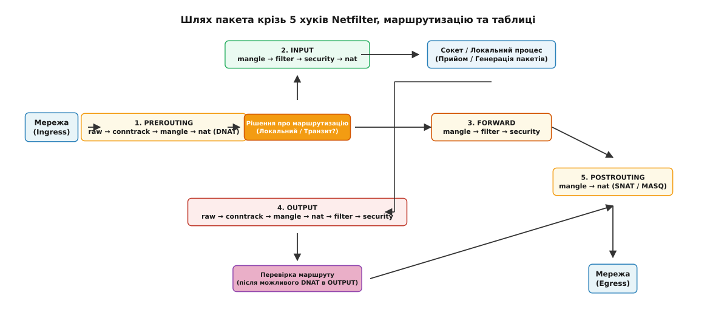
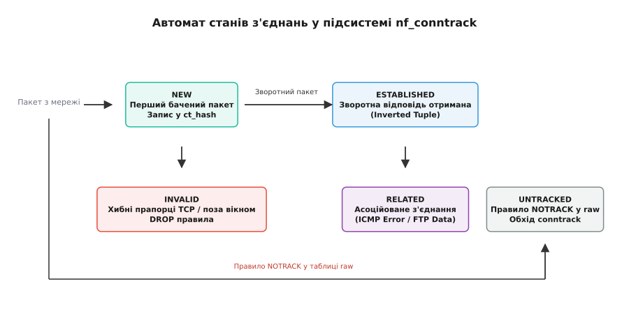

# netfilter: ланцюги, таблиці й NAT

<preknowlist>
- [Стек мережі Linux: від NIC до сокета](root:sys-unix/network-stack-architecture) — проходження мережевого пакета крізь драйвер, NAPI та буфер sk_buff.
- [Маршрутизація в Linux: підсистема routing decision](root:sys-unix/routing-decision) — вибір вихідного інтерфейсу та наступного хопу за таблицями FIB.
- [Інтерфейси та IP-адреси](root:sys-unix/interfaces-and-addresses) — конфігурація мережевих пристроїв, сокетів та IP-адрес.
</preknowlist>

Коли на мережевий інтерфейс сервера зі швидкістю 10 Гбіт/с надходить потік із 14.8 мільйона пакетів за секунду, ядро Linux мусить миттєво вирішити долю кожного з них: прийняти у локальний сокет, переслати на інший мережевий пристрій, модифікувати IP-адреси чи мовчки відкинути. Якби логіка фільтрації та маршрутизації була жорстко впаяна в код IP-стека, будь-яка зміна правил безпеки вимагала б перекомпіляції ядра.

Фундаментом, який перетворює мережевий стек Linux на гнучкий і керований програмний маршрутизатор та брандмауер, є **Netfilter**. Це фреймворк ядра, що надає точний механізм перехоплення (hooks) мережевих пакетів на всіх ключових етапах їхнього руху крізь операційну систему.

## 1. Першопричини: як мережевий пакет стає предметом керування

У звичайних умовах мережевий стек обробляє пакети послідовно. Мережева карта генерацією аппаратного переривання (IRQ) повідомляє драйвер про надходження кадру. Драйвер під час NAPI-поллінгу обгортає дані в `sk_buff` і викликає `netif_receive_skb()`. Далі стек розбирає заголовки IP, перевіряє контрольно суму, шукає сокет призначення й передає дані процесу простору користувача.

Проте для побудови захисного екрану (firewall), трансляції адрес (NAT) або керування трафіком (Traffic Control) необхідні спеціальні точки, де зовнішні модулі можуть втрутитися у цей потік.

Спроби вирішити це завдання лише через сокетні фільтри (наприклад, BPF / `SO_ATTACH_FILTER`) виявилися недостатніми. Сокетний фільтр працює вже на етапі доставки пакета конкретному процесу. Він не може зупинити транзитний пакет, змінити IP-адресу призначення до прийняття рішення про маршрутизацію або відкинути шкідливий трафік до виділення ресурсів пам'яті під TCP-буфери.

Саме тому Netfilter реалізує концепцію **точок перехоплення (хуків, hooks)**. Хук — це фіксоване місце в коді мережевого стека ядра, де зупиняється стандартне виконання, і ядро перевіряє, чи зареєстровані для даного етапу будь-які функції зворотного виклику (callbacks).

У ядрі Linux для протоколів IPv4 та IPv6 оголошено 5 основних хуків:

1. **`NF_INET_PRE_ROUTING`**: спрацьовує одразу після отримання пакета з мережевого інтерфейсу й перевірки цілісності IP-заголовка, але **до** того, як підсистема маршрутизації визначить напрямок руху пакета.
2. **`NF_INET_LOCAL_IN`**: спрацьовує після підсистеми маршрутизації, якщо з'ясувалося, що пакет призначений локальному хосту (IP-адреса збігається з адресою одного з інтерфейсів).
3. **`NF_INET_FORWARD`**: спрацьовує, якщо підсистема маршрутизації визначила пакет як транзитний (потрібно переслати на інший інтерфейс).
4. **`NF_INET_LOCAL_OUT`**: перша точка перехоплення для пакетів, згенерованих локальними процесами на самій машині.
5. **`NF_INET_POST_ROUTING`**: остання точка перехоплення для всіх вихідних пакетів (як локально згенерованих, так і транзитних) безпосередньо перед передачею бувера драйверу мережевої карти.

Кожна функція обробника, викликана на хуку, повертає ядру одне з 5 числових значень (вердиктів):

- **`NF_ACCEPT`**: пакет визнано коректним, він продовжує рух далі мережевим стеком.
- **`NF_DROP`**: пакет негайно знищується, пам'ять буфера `sk_buff` звільняється викликом `kfree_skb()`.
- **`NF_STOLEN`**: модуль перехоплює управління буфером на себе (Netfilter припиняє обробку даного пакета і не звільняє `sk_buff`).
- **`NF_QUEUE`**: пакет поміщається в чергу для передачі в простір користувача (через механізм `nfnetlink_queue` / `NFQUEUE`).
- **`NF_REPEAT`**: пакет повертається на початок поточного хука для повторного проходження правил.

## 2. Анатомія шляху пакета: п'ять хуків та підсистема маршрутизації

Щоб зрозуміти, чому певні правила фільтрації або NAT працюють лише у визначених ланцюжках, слід простежити повний цикл життя структури `sk_buff` усередині ядра на рівні конкретних C-функцій мережевого стека.


*Мережевий пакет потрапляє в ядро через вхідний інтерфейс і послідовно проходить хук PREROUTING, підсистему маршрутизації, хуки INPUT або FORWARD, а локально згенерований трафік — хуки OUTPUT та POSTROUTING.*

### Вхідний потік (Ingress Path)

1. **Прийом кадру**: Мережева карта через DMA записує кадр у RAM. Драйвер під час NAPI-поллінгу обгортає дані в `sk_buff` і викликає `netif_receive_skb()`.
2. **Первинна обробка IP**: Функція `ip_rcv()` перевіряє довжину пакета, версію IP та контрольно суму заголовка. У бітовому буфері керування `skb->cb` зберігається приватна структура `struct inet_skb_parm` із прапорцями обробки опцій IP.
3. **Хук PREROUTING**: Ядро викликає `NF_HOOK(NFPROTO_IPV4, NF_INET_PRE_ROUTING, net, NULL, skb, dev, NULL, ip_rcv_finish)`.
   - Першим ділом у даному хуку спрацьовує дефрагментація IP-пакетів (`NF_IP_PRI_CONNTRACK_DEFRAG`, пріоритет -400). Якщо пакет був розбитий на фрагменти, ядро затримує фрагменти у черзі `ipq`, поки не збере повний IP-пакет. Stateful-фільтрація та перевірка портів неможливі на окремих фрагментах.
   - Далі перевіряється таблиця `raw` (пріоритет -300) та ініціалізується модуль відстеження станів `nf_conntrack` (пріоритет -200).
   - Наприкінці обробляється Destination NAT у таблиці `nat` (пріоритет -100). Якщо це перший пакет сесії, адреса призначення може бути змінена.
4. **Рішення про маршрутизацію (Inbound Routing Decision)**: Якщо макрос `NF_HOOK` повернув `NF_ACCEPT`, ядро викликає функцію продовження `ip_rcv_finish()`, яка звертається до підсистеми маршрутизації `ip_route_input_noref()`. Вона шукає IP-адресу призначення у списку інтерфейсів та таблиці FIB:
   - **Path A (Локальна доставка)**: Якщо IP-адреса належить хосту, в `sk_buff` записується вказівник на локальний маршрут, і пакет передається у `ip_local_deliver()`.
   - **Path B (Транзит / Forwarding)**: Якщо адреса чужа, а прапорець `net.ipv4.ip_forward` дорівнює 1, пакет передається у `ip_forward()`.

### Гілка локальної доставки (Local Ingress)

1. У функції `ip_local_deliver()` ядро викликає хук **`NF_INET_LOCAL_IN`**:
   `NF_HOOK(NFPROTO_IPV4, NF_INET_LOCAL_IN, net, NULL, skb, skb->dev, NULL, ip_local_deliver_finish)`.
2. На цьому хуку послідовно виконуються таблиці `mangle` (пріоритет -150), `filter` (пріоритет 0), `security` (пріоритет 50) та `nat` (Source NAT для вхідного трафіку, пріоритет 100).
3. Після повернення `NF_ACCEPT` викликається `ip_local_deliver_finish()`. Вона знімає IP-заголовок, визначає номер L4-протоколу і передає буфер обробнику сокета (наприклад, `tcp_v4_rcv()` або `udp_rcv()`), який кладе дані у чергу прийому сокета `sk_receive_queue`.

### Гілка транзитного форвардингу (Forwarding Path)

1. У функції `ip_forward()` ядро зменшує значення TTL на 1. Якщо TTL досяг 0, пакет відкидається і генерується ICMP-повідомлення `Time Exceeded`.
2. Ядро викликає хук **`NF_INET_FORWARD`**:
   `NF_HOOK(NFPROTO_IPV4, NF_INET_FORWARD, net, NULL, skb, in_dev, out_dev, ip_forward_finish)`.
3. Послідовно виконуються таблиці `mangle`, `filter` та `security`. Тут транзитні брандмауери перевіряють міжмережеві правила доступу між різними VLAN та підмережами.
4. Після `NF_ACCEPT` викликається `ip_forward_finish()`, яка передає пакет у `ip_output()`.

### Вихідний потік локальних процесів (Local Egress Path)

1. Локальний процес системним викликом `sendto()` або `write()` передає дані у сокет.
2. Транспортний рівень формує сегмент і передає його в `ip_queue_xmit()`.
3. Ядро здійснює первинний пошук вихідного маршруту `ip_route_output_ports()`, визначає вихідний інтерфейс та вихідну IP-адресу.
4. Перехоплення на хуку **`NF_INET_LOCAL_OUT`**:
   `NF_HOOK(NFPROTO_IPV4, NF_INET_LOCAL_OUT, net, sk, skb, NULL, out_dev, dst_output)`.
5. На хуку `OUTPUT` послідовно виконуються таблиці `raw`, `conntrack`, `mangle`, `nat` (DNAT для локальних вихідних пакетів), `filter` та `security`.
6. **Перевірка маршруту (Re-routing Check)**: Якщо правила у таблицях `mangle` або `nat` змінили IP-адресу призначення або маркер пакета (`skb->mark`), початковий маршрут стає недійсним. Ядро викликає `ip_route_me_harder()`, яка заново обчислює вихідний пристрій та джерело.

### Построутинг та відправка (Postrouting & Transmission)

1. Вихідні пакети (як локально згенеровані після `OUTPUT`, так і транзитні після `FORWARD`) потрапляють у функцію `ip_output()`, де викликається хук **`NF_INET_POST_ROUTING`**:
   `NF_HOOK(NFPROTO_IPV4, NF_INET_POST_ROUTING, net, sk, skb, NULL, out_dev, ip_finish_output)`.
2. На цьому хуку виконуються таблиці `mangle` та `nat` (Source NAT / MASQUERADE, пріоритет 100). Оскільки вихідний мережевий інтерфейс остаточно відомий, саме тут IP-адреса джерела підміняється на зовнішню IP-адресу роутера.
3. Функція `ip_finish_output()` фрагментує пакет (якщо його розмір перевищує MTU вихідного інтерфейсу) і викликає `dev_queue_xmit()`.
4. Пакет потрапляє у дисципліну черги (qdisc) драйвера мережевої карти й передається через кільцевий буфер DMA у фізичний провід.

## 3. Таблиці, пріоритети та еволюція від iptables до nftables

У класичному брандмауері `iptables` правила розбито на 5 функціональних **таблиць** (Tables). На відміну від ланцюжків, які прив'язані до хуків Netfilter, таблиці визначають *тип операції*, яка виконується над пакетом.

### Спеціалізація та пріоритети таблиць

Кожна таблиця має суворо визначений числовий пріоритет (Priority). Якщо на одному й тому самому хуку зареєстровано кілька таблиць, Netfilter викликає їх у порядку зростання числового значення пріоритету (від від'ємних до додатних):

1. **`raw` (пріоритет `-300`)**:
   - Призначення: відключення відстеження станів conntrack за допомогою цілі `NOTRACK`.
   - Доступні хуки: `PREROUTING`, `OUTPUT`.
2. **`mangle` (пріоритет `-150`)**:
   - Призначення: модифікація заголовків IP-пакетів (зміна TTL, Type of Service TOS, встановлення маркерів `MARK` для політик маршрутизації `iproute2`).
   - Доступні хуки: доступна на всіх 5 хуках.
3. **`nat` (пріоритет `-100` для DNAT, `+100` для SNAT)**:
   - Призначення: трансляція мережевих адрес і портів (DNAT у `PREROUTING`/`OUTPUT`, SNAT у `POSTROUTING`/`INPUT`).
   - Доступні хуки: `PREROUTING`, `INPUT`, `OUTPUT`, `POSTROUTING`.
4. **`filter` (пріоритет `0`)**:
   - Призначення: базова фільтрація трафіку (прийняття рішень `ACCEPT` або `DROP`).
   - Доступні хуки: `INPUT`, `FORWARD`, `OUTPUT`.
5. **`security` (пріоритет `+50`)**:
   - Призначення: встановлення міток безпеки Mandatory Access Control (SELinux, SMACK).
   - Доступні хуки: `INPUT`, `FORWARD`, `OUTPUT`.

Докладніше про витоки розробки пакетних фільтрів та перехід від перших версій ядра викладено в матеріалі [📜 Еволюція пакетної фільтрації у Linux: від ipfwadm до nftables](root:sys-unix/netfilter-model/hist-netfilter-evolution.md).

### Архітектурний стрибок: від iptables до nftables

Не зважаючи на популярність `iptables`, його архітектура мала дві серйозні вади: лінійний перебір усіх правил зі складністю `O(N)` та необхідність повністю перезавантажувати весь масив правил у ядро при внесенні найменшої зміни.

Сучасний фреймворк **nftables** усуває ці обмеження:

- **Віртуальна машина ядра (nftables VM)**: замість сотень окремих модулів ядра для кожного прапорця чи протоколу, ядро містить маленьку інтерпретовану байткод-машину (`nft_expr`). Політика описується у вигляді псевдоінструкцій для завантаження регістрів, порівняння та вердиктів.
- **Відсутність наперед визначених таблиць**: користувач сам створює таблиці й прив'язує ланцюжки до потрібних хуків ядра із заданим пріоритетом.
- **Мережеві набори (Sets) та мапи (Maps)**: nftables підтримує списки IP-адрес і портів на основі хеш-табліць та червоно-чорних дерев. Перевірка наявності IP-адреси у списку з мільйона елементів виконується за сталий час `O(1)` або `O(log N)`, замість створення мільйона окремих правил.
- **Атомарні транзакції Netlink**: додавання чи видалення правил здійснюється за допомогою транзакційних батчів без перезавантаження всього правиласету.

Під капотом байткод-машина nftables виконує послідовність виразів (expressions) над регістрами процесора усередині структури `struct nft_pktinfo`. Кожен вираз (`nft_payload`, `nft_cmp`, `nft_lookup`, `nft_counter`) займає лічені інструкції процесора, усуваючи неприпустимі непрямі виклики функцій (indirect function calls), які уповільнювали `iptables`.

Точні двійкові опис-структури C/C++ для `struct nf_hook_ops`, `struct nf_hook_state` та вердиктів зведено у довідникові [📋 Інтерфейс хуків Netfilter та базові C-структури ядра](root:sys-unix/netfilter-model/api-netfilter-kernel-hooks.md).

## 4. Відстеження станів: механікум `nf_conntrack`

Ключовою можливістю Netfilter є **stateful inspection** — здатність аналізувати пакети у контексті всієї сесії зв'язку, а не ізольовано. За це відповідає модуль `nf_conntrack` (Connection Tracking).

### Кортеж з'єднання (Connection Tuple)

Для ідентифікації потоку трафіку `nf_conntrack` створює у пам'яті подвійну структуру — **кортеж (tuple)**, який описує прямий та зворотний напрямки пакета:

- **Original Tuple (прямий потік)**: `(IP джерела, IP призначення, Порт джерела, Порт призначення, L4-протокол)`
- **Reply Tuple (зворотний потік)**: `(IP призначення, IP джерела, Порт призначення, Порт джерела, L4-протокол)`

Навіть для протоколів без встановлення з'єднання (UDP, ICMP) `nf_conntrack` створює «псевдо-сесії» на основі адрес, портів або ідентифікаторів ICMP-запиту.


*Кожен пакет аналізується підсистемою відстеження станів conntrack, яка переводить з'єднання зі стану NEW у стан ESTABLISHED або RELATED, або позначає його як INVALID / UNTRACKED.*

### П'ять станів з'єднання

У контексті Netfilter пакет оцінюється за одним із п'яти станів:

1. **`NEW`**: перший пакет у потоці, який раніше не фігурував у таблиці conntrack (наприклад, TCP SYN-пакет або перший UDP-запит).
2. **`ESTABLISHED`**: стан, коли модуль фіксує двосторонній обмін трафіком (надіслано відповідь з інвертованим кортежем — наприклад, TCP SYN-ACK).
3. **`RELATED`**: пакет, який створює нове з'єднання, але є логічно пов'язаним із вже існуючим (наприклад, ICMP-повідомлення `Destination Unreachable` або дата-канал у FTP/SIP трафіку, виявлений спеціальним помічником `nf_conntrack_ftp`).
4. **`INVALID`**: пакет, який не вдалося ідентифікувати або який порушує логіку протоколу (помилкові прапорці TCP, пошкоджений заголовок, номер послідовності поза вікном). Зазвичай такі пакети негайно відкидаються правилом `ct state invalid drop`.
5. **`UNTRACKED`**: пакет, для якого відстеження станів було явно вимкнено в таблиці `raw` за допомогою цілі `NOTRACK`.

### Внутрішня організація пам'яті та хешування

Кожен запис з'єднання репрезентується структурою `struct nf_conn`. Всі активні з'єднання зберігаються у глобальній хеш-таблиці `net->ct.hash`. Індексація здійснюється за допомогою хеш-функції Jenkins Hash (`jhash2`), яка обчислює хеш від полів кортежу (`IP_src`, `IP_dst`, `port_src`, `port_dst`, `proto`).

Для запобігання колізіям та оптимізації багатопотокової обробки хеш-таблиця розбита на кошики (buckets), кожен із яких захищено окремим локом (`spinlock`). При обробці пакета ядро обчислює хеш кортежу, бере лок відповідного кошика, знаходить або створює елемент `struct nf_conn` та оновлює таймер застарівання.

### Динамічні помічники протипотоків (Conntrack Helpers & Expectations)

Складні протоколи прикладного рівня (такі як FTP, SIP, H.323, RTSP) використовують канал керування для узгодження нових динамічних портів для передачі даних. Наприклад, у пасивному режимі FTP (PASV) сервер повідомляє клієнту у текстовому відповідному пакеті виділений TCP-порт для скачування файлу.

Звичайний брандмауер відкинув би вхідне з'єднання на цей виділений порт, оскільки воно ініціюється як новий потік (`NEW`). Для розв'язання цієї проблеми в Netfilter вбудовано підсистему помічників **`nf_conntrack_helper`**:
1. Модуль-помічник (наприклад, `nf_conntrack_ftp`) реєструє аналізатор прикладного рівня на відповідному порті (TCP 21).
2. При проходженні пакета з командою `PASV` або `PORT` помічник парсить текстове тіло L7-пакета і витягує оголошену IP-адресу та номер порту.
3. Помічник створює тимчасовий «очікуваний запис» **`struct nf_conntrack_expect`** і додає його у загальну таблицю очікувань `net->ct.expect`.
4. Коли від клієнта надходить новий TCP SYN-пакет на цей виділений порт, `nf_conntrack` порівнює його з таблицею очікувань. При збігу пакет отримує стан **`RELATED`** замість `NEW`, що дозволяє пропустити його стандартним правилом `ct state established,related accept`.

### Ресурсоємність та атаки виснаження пам'яті

Підсистема `nf_conntrack` тримає всі записи у несторінковій (unswappable) оперативній пам'яті ядра (`kmalloc`/`slab`). Кожен запис `struct nf_conn` займає приблизно 320–400 байтів.

Приклади розрахунку витрат пам'яті:
- 100 000 активних з'єднань займають близько 40 МБ RAM.
- 1 000 000 з'єднань вимагають щонайменше 400 МБ чистої пам'яті ядра лише під структури conntrack.

Якщо сервер зазнає DDoS-атаки типу SYN-Flood (мільйони підроблених SYN-пакетів з унікальними IP-адресами), таблиця станів миттєво заповнюється до межі, заданої параметром `net.netfilter.nf_conntrack_max`. Після цього ядро блокує створення нових з'єднань і виводить критичну помилку:

```text
kernel: nf_conntrack: table full, dropping packet
```

Для запобігання виснаженню пам'яті застосовують чотири механізми:
- Збільшення розміру хеш-таблиці та ліміту записів у `sysctl`:
  ```bash
  sysctl -w net.netfilter.nf_conntrack_max=1048576
  sysctl -w net.netfilter.nf_conntrack_buckets=262144
  ```
- Зменшення часів очікування застарілих з'єднань (`net.netfilter.nf_conntrack_tcp_timeout_established`).
- Використання механізму **SYN Proxy (`nft add rule ... synproxy`)**: ядро не створює запис у conntrack при отриманні первинного SYN, а самостійно відповідає SYN-ACK з розрахованим SYN Cookie. Запис у conntrack створюється лише після отримання підтвердженого ACK від клієнта.
- Повне відключення conntrack для високонавантажених сервісів (DNS, NTP, CDN) за допомогою таблиці `raw`:
  ```bash
  nft add rule inet raw prerouting tcp dport 80 counter notrack
  ```

## 5. Трансляція мережевих адрес (NAT): механіка та зв'язок із conntrack

Трансляція мережевих адрес (NAT) у Linux нерозривно пов'язана з відстеженням станів `nf_conntrack`. Снайперська особливість Netfilter полягає у тому, що **правила таблиці `nat` виконуються ЛИШЕ для НАЙПЕРШОГО пакета з'єднання (стан `NEW`)**.

### Як працює механізм NAT:

1. Перший пакет з'єднання (стан `NEW`) потрапляє на хук `PREROUTING` або `POSTROUTING`.
2. Ядро шукає відповідне правило у таблиці `nat` (наприклад, `snat to 192.168.1.1` або `dnat to 10.0.0.5:80`).
3. Якщо правило спрацювало, Netfilter змінює відповідний заголовок IP/порт у пакеті **і записує інвертовану трансляцію у зворотному кортежі (Reply Tuple) таблиці conntrack**.
4. Усі наступні пакети цього ж з'єднання (стан `ESTABLISHED`) **взагалі не проходять через таблицю `nat`**. Підсистема `nf_conntrack` автоматично впізнає їх за кортежем і миттєво підміняє IP-адреси та порти на льоту.

Це рішення дає величезний приріст швидкодії: замість перевірки правил NAT для мільйонів пакетів у поточному відеострімі або веб-сесії, обчислювальне навантаження виникає лише один раз при відкритті з'єднання.

### Вирішення колізій портів при SNAT / Masquerade

Коли тисячі хостів локальної мережі (наприклад, 10.0.0.0/8) виходять в інтернет через єдину зовнішню IP-адресу роутера, виникає ситуація, коли два різних внутрішніх комп'ютери відправляють пакети з однакових вихідних портів (наприклад, `10.0.0.15:45000` та `10.0.0.88:45000` на `8.8.8.8:53`).

Підсистема Netfilter NAT усуває колізію за допомогою алгоритму пошуку вільного порту (port hunting):
1. Модуль перевіряє, чи вільний оригінальний порт джерела `45000` на зовнішній IP-адресі.
2. Якщо порт уже зайнятий іншим з'єднанням, Netfilter здійснює пошук вільного сокетного порту у діапазоні `1024-65535`.
3. У зворотний кортеж `Reply Tuple` записується модифікований вихідний порт, що дозволяє роутеру однозначно спрямувати зворотну відповідь правильному внутрішньому хосту.

Існує чотири основні різновиди NAT у Netfilter:

- **DNAT (Destination NAT)**: зміна адреси призначення. Виконується на хуках `PREROUTING` та `OUTPUT` для прокидання портів у внутрішню мережу або балансування навантаження.
- **SNAT (Source NAT)**: зміна адреси джерела. Виконується на хуку `POSTROUTING` при виході трафіку у зовнішню мережу із заздалегідь відомою статичною IP-адресою.
- **MASQUERADE**: спеціальний варіант SNAT для динамічних вихідних інтерфейсів (DHCP, PPPoE). На відміну від SNAT, Masquerade автоматично визначає IP-адресу вихідного інтерфейсу та автоматично скидає таблицю conntrack при відключенні мережевого пристрою.
- **REDIRECT**: окремий випадок DNAT, який підміняє адресу призначення на локальну IP-адресу лупбеку (`127.0.0.1`), перенаправляючи трафік на локальний проксі-сервер.

## 6. Простеження, інспекція та програмне керування

Для діагностики проблем із фільтрацією та NAT системні адміністратори та розробники мають розширений інструментарій простеження.

### Інспекція таблиці conntrack через procfs та утиліту `conntrack`

Переглянути поточний стан таблиці з'єднань у пам'яті ядра можна безпосередньо з псевдофайлу `/proc/net/nf_conntrack` або за допомогою CLI-утиліти `conntrack`:

```bash
# Дамп усіх відстежуваних з'єднань у режимі реального часу
conntrack -L

# Моніторинг подій відкриття та закриття сесій
conntrack -E --event-mask new,destroy
```

Типовий запис таблиці з'єднань виглядає так:

```text
tcp 6 431999 ESTABLISHED src=192.168.1.50 dst=93.184.216.34 sport=54322 dport=443 src=93.184.216.34 dst=1.2.3.4 sport=443 dport=54322 [ASSURED] mark=0 use=1
```

У цьому записі чітко видно два кортежі: прямий (`src=192.168.1.50 dst=93.184.216.34`) та зворотний з урахуванням виконаного SNAT (`src=93.184.216.34 dst=1.2.3.4`).

### Трасування шляху пакета через `meta trace`

В `nftables` додано можливість трасувати проходження конкретного пакета через усі хуки й правила ядра в режимі реального часу:

```bash
# Додавання правила трасування для ICMP пакетів
nft add rule inet filter input icmp type echo-request meta trace set 1

# Моніторинг трасувальних повідомлень ядра
nft monitor trace
```

Утиліта друкує кожен хук, правило, задіяну таблицю та вердикт, який отримує пакет на своєму шляху.

Покроковий практикум з написання програмного менеджера правил брандмауера на C та C++ з використанням бібліотеки `libnftables` наведено у матеріалі [⚙️ Програмне керування правилами брандмауера через libnftables](root:sys-unix/netfilter-model/proj-nftables-rule-manager.md).

> 🔧 **Навіщо це.** Знання точного порядку виконання хуків Netfilter та роботи conntrack позбавляє від заплутаних помилок у продакшені. Наприклад, якщо правила брандмауера блокують вхідні пакети у ланцюжку `FORWARD`, але при цьому в локальних логах відсутні записи про відкидання пакетів, діагностика крізь хуки негайно покаже, що пакет взагалі не доходить до `FORWARD`, бо був відкиданий ще на хуку `PREROUTING` через хибний DNAT або збій у таблиці `raw`.

## 7. Ціна обробки: продуктивність, накладні витрати та межі застосування

Попри високу оптимізацію Netfilter, проходження кожного пакета через хуки ядра вимагає обчислювальних ресурсів процесора:

1. **Кеш-промахи (Cache Misses)**: виклик серії callback-функцій на кожному хуку призводить до переходу по вказівниках на функції, що викликає промахи в кеші інструкцій CPU ($L1i$).
2. **Синхронізація у хеш-таблицях**: при обробці трафіку понад 10 мільйонів пакетів за секунду на багатоядерних NUMA-серверах блокування хеш-кошиків `nf_conntrack` стає вузьким місцем через конфлікти кеш-ліній (cache line bouncing).
3. **Виділення `sk_buff`**: Netfilter працює зі структурою `sk_buff`, виділення та ініціалізація якої в драйвері NIC займає суттєвий час.

Коли вимоги до продуктивності перевищують можливості класичного Netfilter (наприклад, у системах захисту від DDoS-атак рівня 100+ Гбіт/с або у термінаторах високонавантажених балансувальників), ядро Linux надає альтернативні обхідні шляхи:

- **eBPF / XDP (eXpress Data Path)**: виконання програм безпосередньо у драйвері мережевої карти до виділення `sk_buff` та залучення Netfilter. Програма XDP може відкинути пакет (`XDP_DROP`) за лічені наносекунди.
- **TC (Traffic Control) BPF**: обробка пакетів на рівні дисциплін черг, що знаходиться нижче за більшість хуків Netfilter.
- **Hardware Offloading (Flowtables)**: nftables підтримує прискорення обробки з'єднань через апаратні таблиці мережевих адаптерів (Flowtables). Після того, як з'єднання перейшло у стан `ESTABLISHED`, подальші пакети обробляються ASIC-чипом мережевої карти без залучення процесора host-системи.

Проте для переважної більшості системних задач, де потрібна гнучка комбінація stateful-фільтрації, маршрутизації за політиками, маскарадингу та мандатного контролю доступу, модель Netfilter залишається неперевершеним та універсальним ядром мережевого стека Linux.
