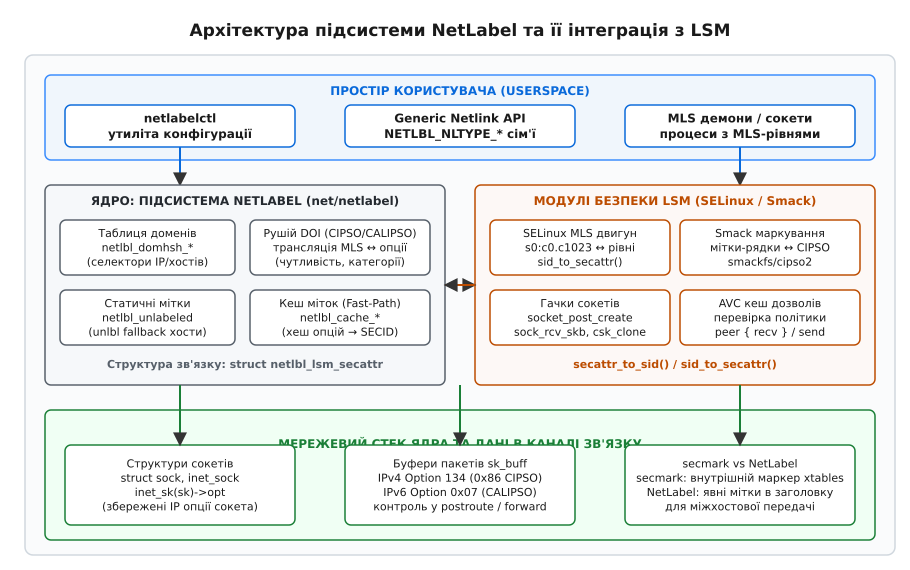
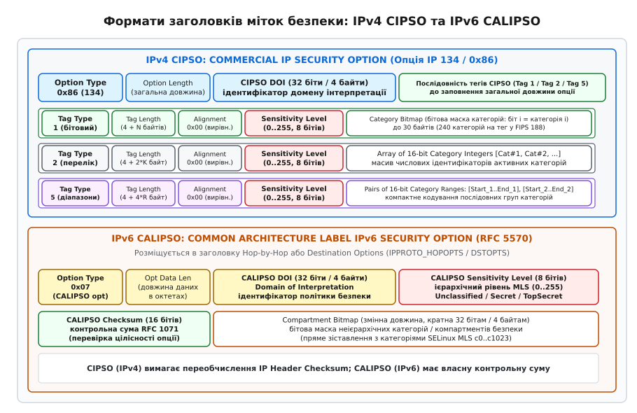
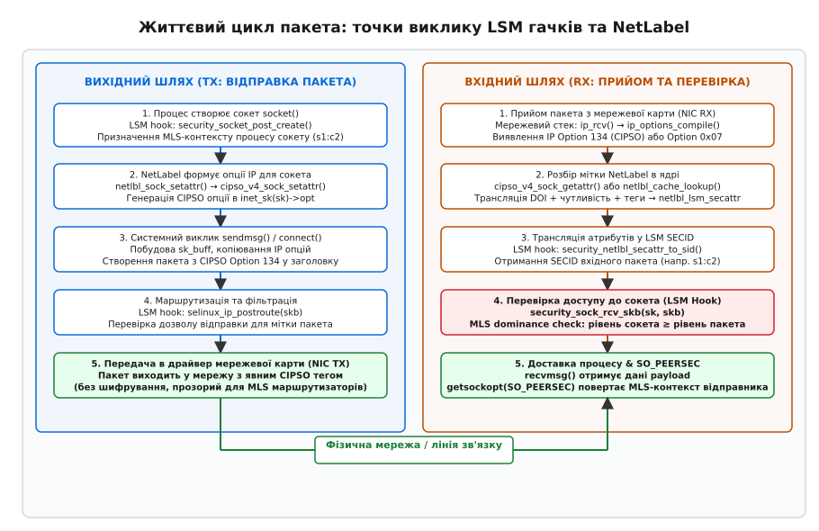

# NetLabel і CIPSO: мітки безпеки на мережевих пакетах

<preknowlist>
- [Фреймворк модулів безпеки ядра Linux (LSM)](root:sys-unix/lsm-framework) — архітектура гачків ядра для перехоплення операцій над системними об'єктами.
- [SELinux: Type Enforcement та контексти безпеки](root:sys-unix/selinux-type-enforcement) — структура міток безпеки, рівні чутливості та категорії моделі MLS.
- [Спрощений мандатний контроль доступу SMACK](root:sys-unix/smack-simplified-mandatory-access) — строкові мітки суб'єктів та об'єктів у Smack.
- [Мережевий сокетний інтерфейс у Linux](root:sys-unix/socket-api-linux) — створення сокетів, життєвий цикл з'єднання та системні виклики VFS.
- [Модель фільтрації та перехоплення трафіку netfilter](root:sys-unix/netfilter-model) — проходження мережевих пакетів крізь мережевий стек ядра.
</preknowlist>

Коли процес на сервері з багатоієрархічною моделлю безпеки (Multi-Level Security, MLS; лат. *multus* — численний, *gradus* — ступінь) виконує системний виклик `write()` у мережевий сокет, ядро Linux оперує внутрішнім числовим ідентифікатором безпеки (Security Identifier, SECID). У межах оперативної пам'яті одного хоста модуль SELinux або Smack миттєво визначає, що сокет належить домену з рівнем конфіденційності «Цілком таємно» (`s1:c0.c1023`). Проте щойно байти корисного навантаження потрапляють у мережевий драйвер і передаються через мідний кабель або оптоволокно у вигляді звичайних кадрів Ethernet, внутрішні структури ядра зникають. Віддалений сервер отримує стандартний TCP-сегмент без жодних метаданих про права процесу-відправника. Якщо вузол-одержувач не має достовірного способу дізнатися рівень секретності вхідного трафіку, локальна політика безпеки вимушена або відкинути пакет, або обробити його з мінімальним загальносистемним допуском, що повністю руйнує наскрізну ізоляцію даних у розподіленій системі.

Підсистема **NetLabel** у ядрі Linux розв'язує цю проблему шляхом явного вбудовування міток безпеки безпосередньо в заголовки мережевих пакетів. Використовуючи стандартизовані протоколи **CIPSO** (Commercial IP Security Option) для IPv4 та **CALIPSO** (Common Architecture Label IPv6 Security Option) для IPv6, NetLabel перетворює внутрішні атрибути безпеки ядра у стандартизовані байти опцій IP. Це дозволяє модулям безпеки Linux взаємодіяти між собою, а також із сумісними апаратними маршрутизаторами та іншими операційними системами стандарту Trusted UNIX без потреби у важкому криптографічному тунелюванні.

---

## 1. Проблема міжхостового розмежування: тунелі проти маркування

Для забезпечення мандатного контролю доступу через мережу в операційних системах сімейства POSIX історично сформувалися два принципово різні підходи: криптографічна інкапсуляція та явне маркування пакетів у відкритому заголовку.

### 1.1. Криптографічний підхід (IPsec / XFRM)
Криптографічний підхід спирається на протокол IPsec та підсистему трансформації пакетів [IPsec у Linux: каркас перетворень xfrm](root:sys-unix/ipsec-xfrm). Перед відправкою пакет шифрується протоколом ESP (Encapsulating Security Payload), а мітка безпеки асоціюється з контекстом асоціації безпеки (Security Association, SA). 

Така схема гарантує повну конфіденційність трафіку у відкритих мережах, проте створює суттєві обмеження:
1. **Високі накладні витрати CPU:** шифрування та обчислення HMAC на швидкостях 40–100 Gbps створюють відчутне навантаження на процесор і збільшують затримку (latency);
2. **Непрозорість для проміжного мережевого обладнання:** транзитні маршрутизатори та комутатори бачать лише зашифрований корисний вантаж ESP і не здатні застосовувати апаратні фільтри MLS або пріоритезацію трафіку на основі мітки секретності;
3. **Точкова топологія (Point-to-Point):** конфігурація вимагає попереднього узгодження ключів (IKEv2) між кожною парою взаємодіючих хостів.

### 1.2. Пряме маркування заголовків (NetLabel + CIPSO / CALIPSO)
Підхід NetLabel полягає у безпосередньому розміщенні мітки безпеки в полі опцій стандартного заголовка IP (IP Options для IPv4 або Extension Headers для IPv6). Пакет передається у відкритому вигляді (in-band signaling), але кожен його байт несе стандартизований префікс секретності.

| Характеристика | IPsec / XFRM (Шифрування) | NetLabel / CIPSO (Маркування) |
| :--- | :--- | :--- |
| **Рівень накладних витрат** | Високий (криптографія AES/SHA) | Мінімальний (додавання кількох байтів опцій) |
| **Аналіз проміжними вузлами** | Неможливий (вміст зашифровано) | Доступний (маршрутизатори MLS перевіряють теги) |
| **Сумісність зі стандартами** | RFC 4301 (IPsec) | FIPS PUB 188 (CIPSO), RFC 5570 (CALIPSO) |
| **Вимоги до середовища** | Недовірені публічні канали | Довірені ізольовані або апаратно захищені мережі |
| **Інтеграція з сокетами** | SA політики через netlink xfrm | Пряме успадкування мітки процесу в `struct sock` |

Пряме маркування є стандартом для захищених обчислювальних центрів, державних установ, систем авіоніки та промислових мереж, де периметр фізично захищений, але всередині однієї інфраструктури одночасно обробляються потоки даних різного рівня таємності.

---

## 2. Архітектура підсистеми NetLabel у ядрі Linux

Підсистема NetLabel розташована в каталозі `net/netlabel/` вихідного коду ядра Linux. Вона не є самостійним модулем безпеки, а виконує роль посередника (транслятора та диспетчера) між мережевим стеком ядра, підсистемою LSM (Linux Security Modules) та простором користувача.


*Архітектура підсистеми NetLabel та її інтеграція з LSM*

### 2.1. Ключові компоненти підсистеми
1. **Інтерфейс Generic Netlink (`netlabel_mgmt.c`, `netlabel_cipso_v4.c`, `netlabel_calipso.c`, `netlabel_unlabeled.c`):** надає точку входу для управління з простору користувача. Утиліта `netlabelctl` через сокети сімейства `NETLINK_GENERIC` реєструє домени, налаштовує правила трансляції та управляє кешем;
2. **Таблиця зіставлення доменів (Domain Mapping Hash Table, `netlabel_domainhash.c`):** містить правила, які зіставляють назви доменів безпеки LSM або цільові IP-адреси/підмережі з конкретними протоколами маркування (CIPSO, CALIPSO або статичний Unlabeled fallback). Пошук записів оптимізовано за допомогою RCU (Read-Copy-Update) блокувань;
3. **Селектори адрес IPv4 та IPv6 (`netlbl_af4list.c`, `netlbl_af6list.c`):** реалізують швидкий префіксний пошук за маскою підмережі (longest prefix match) для вибору відповідного DOI при відправці пакетів на конкретні IP-адреси;
4. **Рушій DOI (Domain of Interpretation Engine):** відповідає за трансляцію числових рівнів і категорій між внутрішнім форматом ядра та бітовими полями мережевих заголовків;
5. **Швидкий кеш NetLabel (`netlabel_cache.c`):** кешує асоціації між сирими байтами заголовків опцій IP та числовими SECID модулів LSM. При інтенсивному потоці однотипних пакетів це дозволяє уникнути повторного розбору бітових масок у критичному шляху обробки пакетів (fast-path);
6. **Ядровий міст LSM API (`netlabel_kapi.c`):** набір функцій, які викликаються гачками SELinux і Smack під час створення сокетів, відправки даних та перевірки вхідних буферів `sk_buff`.

### 2.2. Універсальний контейнер атрибутів: `struct netlbl_lsm_secattr`
Модулі LSM та мережевий стек не взаємодіють напряму через сирі структури пакетів. Для обміну контекстами визначено уніфіковану структуру `struct netlbl_lsm_secattr` (детальні визначення полів наведено у вставці [архітектурна довідка API NetLabel та структури ядра](root:sys-unix/netlabel-cipso-packet-labeling/api-netlabelctl-and-kernel-types.md)):

```c
struct netlbl_lsm_secattr {
    u32 flags;                          /* Бітова маска активних атрибутів */
    u32 type;                           /* Тип протоколу: CIPSO, CALIPSO, UNLBL */
    char *domain;                       /* Рядковий домен LSM */
    u32 secid;                          /* Числовий Security ID */
    struct netlbl_lsm_secattr_mls mls;  /* Рівень чутливості та бітмап категорій */
    struct netlbl_lsm_cache *cache;     /* Вказівник на кеш швидкого шляху */
};
```

Коли модуль безпеки (наприклад, SELinux) передає сокет у NetLabel для маркування, він викликає функцію `security_netlbl_sid_to_secattr()`, яка перетворює внутрішній контекст сокета на екземпляр `netlbl_lsm_secattr`. NetLabel використовує ці поля для генерації опцій IP.

---

## 3. Протокол CIPSO для IPv4: опція 134 та структура тегів

Протокол **CIPSO (Commercial IP Security Option)** був розроблений для стандартизації передачі міток безпеки між Unix-системами різних виробників і закріплений у стандарті **FIPS PUB 188** (історичні передумови та еволюція стандарту описані у матеріалі [історія розвитку CIPSO та FIPS 188](root:sys-unix/netlabel-cipso-packet-labeling/hist-cipso-fips188.md)).

У протоколі IPv4 (RFC 791) опція CIPSO позначається номером **Option 134** (`0x86`). Оскільки найстарший біт копіювання (Copy flag, біт 7) встановлено в `1`, заголовок опції CIPSO обов'язково дублюється в усі фрагменти при фрагментації IP-пакета, гарантуючи збереження мітки безпеки на проміжних маршрутизаторах.


*Формати заголовків міток безпеки: IPv4 CIPSO та IPv6 CALIPSO*

### 3.1. Загальний формат опції CIPSO (Option 134)
Заголовок опції CIPSO має фіксовану довжину 6 байтів, після якої розміщується довільна кількість тегів:
- **Option Type (1 байт):** значення `0x86` (134 у десятковій системі);
- **Option Length (1 байт):** повна довжина всієї опції CIPSO в октетах (включно з типом і довжиною, максимум 40 байтів через обмеження IPv4);
- **CIPSO DOI (4 байти / 32 біти):** Domain of Interpretation (домен інтерпретації). Числове значення у порядку байтів Big-Endian (мережевий порядок), що визначає спільний простір правил між хостами;
- **Теги CIPSO (змінна довжина):** один або кілька інформаційних блоків, що кодують рівні чутливості та категорії.

### 3.2. Побайтний розбір структури тегів CIPSO
Стандарт FIPS PUB 188 визначає три основні типи тегів (Tag Types):

#### 1. Tag Type 1: Bitmapped Categories (Бітова маска категорій)
Найпоширеніший тег у Linux. Використовує компактний бітовий масив, де кожен біт позначає присутність або відсутність відповідної категорії MLS:
- `Tag Type (1 байт):` `0x01`;
- `Tag Length (1 байт):` повна довжина тегу (від 4 до 34 байтів);
- `Alignment / Reserved (1 байт):` значення `0x00` (вирівнювання);
- `Sensitivity Level (1 байт):` ієрархічний рівень чутливості (ціле число від 0 до 255);
- `Category Bitmap (0..30 байтів):` бітова маска неієрархічних категорій (до 240 категорій). Якщо біт `i` дорівнює 1, пакет несе категорію `c[i]`.

Розглянемо конкретний приклад бінарного представлення опції CIPSO довжиною 12 байтів (DOI=1, Sensitivity=2, активні категорії `c0` та `c7`):
```
[0x86]       - Option Type: CIPSO (134)
[0x0C]       - Option Length: 12 байтів
[0x00,0x00,0x00,0x01] - DOI: 1
[0x01]       - Tag Type: 1 (Bitmapped)
[0x06]       - Tag Length: 6 байтів
[0x00]       - Alignment
[0x02]       - Sensitivity Level: 2
[0x81, 0x00] - Bitmap: 10000001 00000000 (біт 0 = c0, біт 7 = c7)
```

#### 2. Tag Type 2: Enumerated Categories (Перелік категорій)
Застосовується, коли категорії розріджені (наприклад, активні лише категорії `c12` та `c850` із 1024 можливих). У цьому випадку передача повної бітової маски перевищила б ліміт довжини IP-опцій:
- `Tag Type (1 байт):` `0x02`;
- `Tag Length (1 байт):` `4 + 2 * N` байтів, де `N` — кількість категорій;
- `Sensitivity Level (1 байт):` рівень чутливості (0..255);
- `Category Array (N * 2 байти):` послідовність 16-бітних цілих чисел, кожне з яких позначає активний номер категорії.

#### 3. Tag Type 5: Range Categories (Діапазони категорій)
Оптимальний для систем, де процеси оперують неперервними діапазонами категорій (наприклад, `c0.c50` та `c100.c200`):
- `Tag Type (1 байт):` `0x05`;
- `Tag Length (1 байт):` `4 + 4 * R` байтів, де `R` — кількість діапазонів;
- `Sensitivity Level (1 байт):` рівень чутливості (0..255);
- `Range Array (R * 4 байти):` масив пар `[Start_Category, End_Category]`, де кожна межа кодується 16-бітним числом.

---

## 4. Протокол CALIPSO для IPv6: мітки у заголовках розширень

Протокол IPv6 не підтримує класичне поле опцій IPv4. Замість цього всі додаткові керуючі дані виносяться в заголовки розширень (Extension Headers). Стандарт **CALIPSO (RFC 5570)** адаптував концепцію CIPSO до архітектури IPv6.

### 4.1. Розміщення та формат опції CALIPSO
Мітка CALIPSO розміщується або в заголовку `Hop-by-Hop Options` (`IPPROTO_HOPOPTS`, якщо проміжні маршрутизатори повинні перевіряти мітку на кожному кроці), або в заголовку `Destination Options` (`IPPROTO_DSTOPTS`, якщо мітка призначена виключно для кінцевого хоста).

Опція CALIPSO має код типу **`0x07`** і таку внутрішню структуру:
- **Option Type (1 байт):** `0x07` (старші біти `00` вказують ігнорувати опцію, якщо вузол її не підтримує; біт зміни `0` забороняє модифікацію в дорозі);
- **Opt Data Len (1 байт):** довжина тіла опції в октетах (від 8 до 248 байтів, кратна 4);
- **CALIPSO DOI (4 байти):** 32-бітний домен інтерпретації;
- **CALIPSO Sensitivity Level (1 байт):** рівень чутливості (0..255);
- **CALIPSO Checksum (2 байти):** 16-бітна контрольна сума опції, обчислена за алгоритмом RFC 1071 (дозволяє перевірити цілісність мітки без перевірки всього пакета);
- **Compartment Bitmap (змінна довжина):** масив бітів категорій/компартментів (Compartments), обов'язково вирівняний по 32-бітній межі (кратний 4 байтам).

Завдяки заголовкам розширень IPv6 знімається жорстке обмеження на 40 байтів опцій, що дозволяє передавати мітки з усіма 1024 або більшою кількістю категорій MLS без втрати даних чи переходу на непряме кодування. Оскільки поле `Opt Data Len` визначає довжину у 8-бітних октетах без урахування перших двох байтів заголовка, а поле бітової маски категорій обов'язково доповнюється нулями до найближчого 32-бітного слова, процесорні інструкції SIMD/AVX можуть обробляти категорійні маски CALIPSO без додаткового побайтного зсуву. При цьому перевірка 16-бітної контрольної суми опції утилізує стандартний алгоритм порозрядного додавання в оберненому коді (1's complement sum), що гарантує виявлення випадкових спотворень мітки під час передачі без втручання в основну контрольну суму транспортного рівня TCP/UDP.

---

## 5. Інтеграція з LSM: трансляція контекстів MLS у SELinux та Smack

Центральним завданням NetLabel є двостороння трансляція між локальним простором безпеки модуля LSM та числовими значеннями мережевих заголовків.

### 5.1. Модель трансляції в SELinux
У SELinux повний контекст безпеки складається з чотирьох або п'яти полів: `user:role:type:mls_level`. MLS-рівень має формат:

`s<чутливість>[:c<початкова_категорія>[.c<кінцева_категорія>]]`

Наприклад: `system_u:system_r:httpd_t:s1:c0,c4.c10`
- Чутливість `s1` відповідає числовому рівню чутливості 1;
- Категорії `c0,c4.c10` активують категорію 0 та діапазон від 4 до 10 включно.

```
SELinux Security Context (Рядок / SECID)
  │
  ├─ user:role:type (Локальні для хоста, НЕ передаються мережею)
  └─ MLS: s1:c0,c4.c10
       │
       ▼ [security_netlbl_sid_to_secattr()]
  netlbl_lsm_secattr
       │  lvl = 1
       │  cat bitmap = [1, 0, 0, 0, 1, 1, 1, 1, 1, 1, 1, ...]
       ▼ [cipso_v4_doi / calipso_doi]
  CIPSO Option 134 (Мережевий кабель)
       DOI: 0x00000001 | Level: 0x01 | Tag 1 Bitmap
```

Під час створення вихідного пакета:
1. NetLabel викликає функцію модуля безпеки `security_netlbl_sid_to_secattr(secid, &secattr)`.
2. Модуль SELinux повертає числовий рівень `secattr.mls.lvl` та бітмап `secattr.mls.cat`.
3. Рушій NetLabel звертається до сконфігурованого DOI і формує байти Option 134. Якщо для домену налаштовано режим `pass` (pass-through), числові значення записуються безпосередньо. Якщо налаштовано таблицю зіставлення `std` (mapped), NetLabel замінює локальний рівень на віддалений відповідно до конфігурації.

Під час прийому вхідного пакета:
1. Мережевий стек виявляє Option 134 і передає її в `cipso_v4_sock_getattr()`.
2. NetLabel перевіряє DOI, декодує рівень і категорії в структуру `netlbl_lsm_secattr`.
3. Викликається функція `security_netlbl_secattr_to_sid(&secattr, &secid)`.
4. Модуль SELinux знаходить відповідний SECID у внутрішній таблиці контекстів (або динамічно генерує новий комбінований SECID, якщо такий рівень дозволено політикою) і передає його далі для перевірки доступу.

### 5.2. Алгебра домінування MLS у SELinux: `dom`, `domby`, `incomp`
Математична модель MLS у SELinux базується на ґратках (lattices) безпеки. Для двох рівнів безпеки `L1 = (S1, C1)` та `L2 = (S2, C2)`, де `S` — ієрархічна чутливість (Sensitivity), а `C` — множина неієрархічних категорій (Categories), ядро визначає три взаємовиключні співвідношення:

1. **Домінування (`L1 dom L2` / `L1 ≥ L2`):** Рівень `L1` домінує над рівнем `L2` тоді й лише тоді, коли чутливість `S1` більша або дорівнює `S2` (`S1 ≥ S2`), а множина категорій `C1` містить у собі всі категорії `C2` як підмножину (`C2 ⊆ C1`). Лише за цієї умови сокет із рівнем `L1` має право читати дані з пакета, маркованого міткою `L2` (Simple Security Property);
2. **Підпорядкування (`L1 domby L2` / `L1 ≤ L2`):** Рівень `L1` підпорядкований `L2` (`S1 ≤ S2` та `C1 ⊆ C2`). За цієї умови процес із рівнем `L1` може записувати інформацію в сокет рівня `L2` (★-Property);
3. **Непорівнюваність (`L1 incomp L2`):** Рівні є непорівнюваними, якщо жодна з множин категорій не є підмножиною іншої (наприклад, `s1:c0` та `s1:c1`, або `s2:c0` та `s1:c1`). Прямий обмін пакетами між процесами з непорівнюваними мітками суворо блокується ядром, запобігаючи несанкціонованому змішуванню потоків інформації між різними проектами чи відділами.

---

### 5.3. Інтеграція зі Smack
Модуль Smack (Simplified Mandatory Access Control) оперує простими текстовими мітками (наприклад, `_`, `Admin`, `System`, `Secret`). У Smack немає складної ієрархічної структури MLS, тому інтеграція з CIPSO реалізована через пряме відображення рядкових міток на фіксовані кортежі CIPSO:
- За замовчуванням мітка `_` (Floor) транслюється у відсутність мітки або рівень 0;
- У системній файловій системі `/sys/fs/smackfs/cipso2` адміністратор реєструє прямі зіставлення:
  ```
  Secret 1 1 0x00000001
  ```
  Це правило вказує ядру, що локальна мітка Smack `Secret` транслюється в CIPSO DOI 1, рівень чутливості 1 та категорію 1.

### 5.4. Немаркований трафік (Unlabeled Fallback)
Якщо пакет надходить від звичайного мережевого обладнання або застарілого сервера без підтримки CIPSO/CALIPSO, NetLabel застосовує механізм **Unlabeled fallback (`netlabel_unlabeled`)**. Адміністратор може призначити статичний контекст безпеки за замовчуванням або зв'язати конкретні підмережі з фіксованими контекстами (наприклад, весь трафік з `192.168.1.0/24` вважати `system_u:object_r:unlabeled_t:s0`).

---

## 6. Життєвий цикл пакета та точки виклику LSM гачків

Проходження мережевого трафіку крізь ядро Linux супроводжується чіткою послідовністю викликів гачків LSM (LSM Hooks) на рівні сокетів та буферів `sk_buff`.


*Життєвий цикл пакета: точки виклику LSM гачків та NetLabel*

### 6.1. Вихідний шлях (Transmission Path / TX)

1. **Створення сокета (`socket()`):**
   Викликається гачок `security_socket_post_create()`. Модуль безпеки призначає новому сокету (`struct sock`) контекст безпеки процесу-творця. Одразу після цього NetLabel ініціалізує поле збережених IP-опцій сокета (`inet_sk(sk)->opt`), генеруючи стабільний заголовок CIPSO/CALIPSO для майбутніх пакетів цього сокета.
2. **Встановлення зв'язку дескриптора з сокетом (`security_sock_graft()`):**
   Коли файловий дескриптор сокета VFS зв'язується з внутрішнім мережевим об'єктом ядра `struct sock`, гачок `security_sock_graft()` оновлює та синхронізує SECID сокета.
3. **Встановлення з'єднання / відправка (`connect()` / `sendmsg()`):**
   Під час виклику `tcp_transmit_skb()` або `ip_queue_xmit()` мережевий стек виділяє структуру `struct sk_buff`. Опції IP із структури `inet_sock` автоматично копіюються в заголовок створюваного пакета.
4. **Маршрутизація та пост-фільтрація (`ip_output()`):**
   Пакет проходить крізь гачок `selinux_ip_postroute(skb)`. Модуль SELinux перевіряє право сокета надсилати трафік через конкретний мережевий інтерфейс з відповідною міткою (клас об'єкта `netif`, дія `egress`).
5. **Передача драйверу:**
   Пакет передається у чергу мережевої карти (NIC TX queue) і надсилається в лінію зв'язку з явними байтами Option 134 у заголовку IP.

### 6.2. Вхідний шлях (Reception Path / RX)

1. **Прийом пакета драйвером (`ip_rcv()`):**
   Мережева карта генерує переривання, драйвер формує `sk_buff` і передає його в `ip_rcv()`. Функція `ip_options_compile()` розбирає заголовки опцій і виявляє присутність Option 134.
2. **Розбір мітки NetLabel:**
   NetLabel перевіряє кеш `netlbl_cache`. У разі промаху кешу викликається `cipso_v4_sock_getattr()`, яка валідує DOI та формує структуру `netlbl_lsm_secattr`. Потім через `security_netlbl_secattr_to_sid()` атрибути транслюються в числовий `secid` пакета, який зберігається в полі безпеки буфера `skb`.
3. **Перевірка доступу до сокета (`security_sock_rcv_skb()`):**
   Коли пакет досягає цільового сокета, викликається критичний гачок перевірки:
   ```c
   int selinux_sock_rcv_skb(struct sock *sk, struct sk_buff *skb);
   ```
   LSM перевіряє правило взаємодії між міткою сокета та міткою пакета (клас `peer`, дозвіл `recv`). Крім того, MLS-рушій перевіряє **правило домінування Белла — ЛаПадули**: рівень конфіденційності сокета повинен домінувати над рівнем вхідного пакета (`S_socket ≥ S_packet`) та охоплювати всі його категорії (`C_socket ⊇ C_packet`). Якщо перевірка не проходить, ядро безшумно відкидає пакет і реєструє відмову в журналі аудиту `auditd`.
4. **Клонування сокета при TCP-з'єднанні (`security_inet_conn_request()`):**
   Коли на слухаючий сокет (`listen`) надходить TCP SYN-пакет з CIPSO-міткою, ядро викликає `security_inet_conn_request()`. На основі мітки вхідного пакета створюється запис у таблиці запитів (`struct request_sock`). Під час фіналізації тристороннього рукостискання (3-way handshake) функція `security_inet_csk_clone()` клонує новий повноцінний дочірній сокет, чий `secid` точно відповідає мітці віддаленого клієнта.
5. **Доставка даних процесу (`recvmsg()` / `SO_PEERSEC`):**
   Прикладний процес читає дані через `recv()`, а за потреби може дізнатися мандатний контекст віддаленого співрозмовника через виклик `getsockopt(fd, SOL_SOCKET, SO_PEERSEC, ...)` (повноцінний приклад коду наведено у вставці [практичний проект перевірки сокетних міток](root:sys-unix/netlabel-cipso-packet-labeling/proj-netlabel-mls-socket.md)).

---

## 7. Практична конфігурація за допомогою `netlabelctl`

Управління підсистемою NetLabel у просторі користувача здійснюється за допомогою утиліти `netlabelctl`.

### 7.1. Базові сценарії налаштування

#### Сценарій А: Наскрізне маркування CIPSO (Pass-Through)
У середовищі, де всі сервери використовують узгоджену конфігурацію SELinux MLS (однакові числові позначення рівнів `s0`–`s15` та категорій `c0`–`c1023`), достатньо налаштувати наскрізний домен pass-through:

```bash
# 1. Реєстрація домену CIPSO v4 DOI 1 з використанням бітового тегу 1
netlabelctl cipsov4 add pass doi:1 tags:1

# 2. Прив'язка домену за замовчуванням до сконфігурованого DOI 1
netlabelctl map add default protocol:cipsov4,1
```

Після виконання цих команд ядро Linux почне автоматично додавати Option 134 до кожного вихідного пакета IPv4 і перевіряти мітки на всіх вхідних інтерфейсах.

#### Сценарій Б: Зіставлення рівнів для гетерогенних мереж
Якщо локальний сервер використовує рівень `s1`, а віддалена система очікує рівень `10`:

```bash
# Створення домену з явним мапінгом рівнів чутливості та категорій
netlabelctl cipsov4 add std doi:2 tags:1 levels:0=0,1=10,2=20 cats:0=100,1=101
netlabelctl map add domain:mls_export_t protocol:cipsov4,2
```

#### Сценарій В: Налаштування немаркованого трафіку для шлюзу
Щоб хост міг спілкуватися з вузлами, які не підтримують CIPSO:

```bash
# Увімкнення прийому немаркованого трафіку
netlabelctl unlbl accept on

# Призначення контексту s0 для підмережі керування
netlabelctl unlbl add address:10.0.0.0/8 secattr:system_u:object_r:unlabeled_t:s0
```

---

## 8. NetLabel та Netfilter `secmark`: у чому різниця

У практиці адміністрування безпеки Linux часто виникає плутанина між підсистемою **NetLabel** та механізмом **secmark** (модуль `xt_SECMARK` у складі netfilter/iptables/nftables).

```
+─────────────────────────────────────────────────────────────────────────+
|                                 ЯДРО LINUX                              |
|                                                                         |
|   [Вхідний пакет]                                                       |
|          │                                                              |
|          ├──> CIPSO Option 134 (у заголовку IP)                         |
|          │          │                                                   |
|          │          ▼                                                   |
|          │     [NetLabel Subsystem] ───> Перевірка MLS рівнів (LSM)    |
|          │                               (s1:c0.c1023)                  |
|          │                                                              |
|          └──> Netfilter PREROUTING                                      |
|                     │                                                   |
|                     ▼                                                   |
|                [xt_SECMARK] ───────────> Призначення внутрішнього       |
|                                          SELinux типу пакету            |
|                                          (system_u:object_r:http_pkt_t) |
|                                                                         |
+─────────────────────────────────────────────────────────────────────────+
```

1. **NetLabel (Міжхостове маркування):**
   - Передає атрибути безпеки **через фізичну мережу** у заголовках IP;
   - Спеціалізується на багатоієрархічній безпеці (MLS / MCS: рівні та категорії);
   - Не залежить від правил фільтрації пакетів брандмауера;
   - Забезпечує інтероперабельність між різними хостами та ОС.
2. **Secmark (Внутрішньохостова класифікація):**
   - Працює **виключно в межах одного ядра** локального хоста;
   - Призначає пакетам контексти безпеки Type Enforcement (наприклад, `http_server_packet_t`) на основі номерів TCP/UDP портів, IP-адрес чи інтерфейсів за допомогою правил `iptables -j SECMARK`;
   - Дозволяє писати політики SELinux на зразок: «домену `httpd_t` дозволено приймати пакети типу `http_server_packet_t`»;
   - Не передає жодних міток у мережевий кабель.

Обидві підсистеми часто використовуються разом: NetLabel гарантує строге дотримання рівнів секретності MLS між різними серверами кластера, а `secmark` забезпечує гранулярний контроль доступу за доменами Type Enforcement всередині локального вузла.

---

## 9. Продуктивність, крайові випадки та обмеження

### 9.1. Ціна розбору опцій у Fast-Path
Додавання опцій IP призводить до двох факторів накладних витрат:
1. **Збільшення розміру заголовка IP:** типовий заголовок IPv4 зростає з 20 до 32–44 байтів, що незначно зменшує ефективний MTU (Maximum Transmission Unit);
2. **Перерахунок контрольної суми IPv4:** оскільки опції CIPSO є частиною заголовка IPv4, будь-яка зміна мітки вимагає переобчислення поля `Header Checksum`. (У CALIPSO для IPv6 заголовок базового пакета фіксований, а контрольна сума обчислюється лише для самої опції).

Для мінімізації впливу на швидкість комутації NetLabel використовує геш-таблицю `netlbl_cache`. При повторному надходженні пакетів з ідентичним блоком опцій ядро миттєво повертає вже готовий `secid` за `O(1)` операцій, уникаючи виклику важких функцій парсингу бітових масок LSM.

### 9.2. Колізії опцій IPv4 та ліміт розміру заголовка
Заголовок IPv4 має жорстке апаратне обмеження: поле довжини інтернет-заголовка (IHL, Internet Header Length) займає 4 біти, задаючи довжину у 32-бітних словах (максимум `15 * 4 = 60` байтів). Оскільки базовий заголовок IPv4 займає 20 байтів, на всі додаткові опції залишається **лише 40 байтів**.

Якщо мережевий стек одночасно намагається використати інші розширення IPv4 (наприклад, маршрутизацію від джерела `Source Route`, запис маршруту `Record Route` або часові мітки `IP Timestamp`), місця під CIPSO Tag 1 (який займає від 12 до 34 байтів) може не вистачити. За такої умови ядро генерує помилку `EMSGSIZE` або відкидає створення сокета. Це ще одна причина, чому для складних багаторівневих мереж рекомендується перехід на протокол CALIPSO в IPv6, де заголовки розширень не обмежені лімітом у 40 байтів.

### 9.3. Взаємодія з NAT та проміжними маршрутизаторами
- **Трансляція мережевих адрес (NAT):** Проміжні маршрутизатори з підтримкою NAT змінюють IP-адреси та перераховують контрольну суму заголовка IP. Якщо маршрутизатор коректно реалізує RFC 791, опції IP (зокрема CIPSO Option 134) зберігаються без змін. Проте дешеве споживче мережеве обладнання часто скидає (strips) пакети з невідомими опціями IP;
- **Фрагментація:** Оскільки старший біт Option Type для CIPSO дорівнює `1` (`0x86`), стек протоколів ядра обов'язково копіює всю опцію CIPSO у кожен фрагментований пакет, забезпечуючи коректну ідентифікацію навіть за умови фрагментації трафіку в дорозі.

---

## 10. Спостережуваність і трасування: налагодження NetLabel через eBPF та auditd

Для діагностики проблем проходження маркованого трафіку та перевірки коректності формування опцій IP системні інженери використовують комбінацію засобів системного аудиту та динамічного трасування на базі eBPF / `bpftrace`.

### 10.1. Аналіз подій аудиту (AVC та NetLabel)
Коли пакет блокується через порушення правил домінування MLS, підсистема аудиту ядра генерує детальний запис у журналі `/var/log/audit/audit.log`:

```
type=AVC msg=audit(1724198400.124:842): avc:  denied  { recv } for  
  pid=2410 comm="worker" saddr=192.168.1.50 daddr=192.168.1.10 
  scontext=system_u:system_r:httpd_t:s0:c0 
  tcontext=system_u:system_r:client_t:s1:c2 
  tclass=peer permissive=0
```
У цьому повідомленні:
- `scontext`: контекст локального сокета-одержувача (`s0:c0`);
- `tcontext`: розібраний NetLabel контекст вхідного пакета (`s1:c2`);
- `denied { recv }`: відмова, спричинена тим, що рівень сокета `s0` не домінує над рівнем пакета `s1`.

### 10.2. Динамічне трасування гачків ядра за допомогою `bpftrace`
Для спостереження за викликами NetLabel у реальному часі без зміни коду ядра можна використовувати скрипт `bpftrace`, який перехоплює обробку IP-опцій:

```
kprobe:cipso_v4_sock_getattr
{
    printf("[NetLabel] Розбір CIPSO для skb=%p, комутація вхідного пакета\n", arg0);
}

kprobe:netlbl_sock_setattr
{
    printf("[NetLabel] Налаштування мітки сокета sk=%p, сімейство=%d\n", arg0, arg1);
}
```

Такий підхід дозволяє перевірити, чи дійсно сокети отримують сконфігурований DOI, та миттєво локалізувати втрату міток на рівні проміжних мережевих інтерфейсів.

---

## Підсумок

Підсистема NetLabel у поєднанні з протоколами CIPSO та CALIPSO усуває критичну прогалину між локальним мандатним контролем доступу ядра Linux та розподіленою мережевою інфраструктурою. Завдяки стандартизованому кодуванню рівнів чутливості та категорій безпосередньо в опціях IP-заголовків, NetLabel дозволяє будувати надійні, високопродуктивні багаторівневі безпечні середовища (MLS), де кожна мережева транзакція суворо контролюється політиками безпеки ядра від сокета процесу-відправника до сокета процесу-одержувача.
