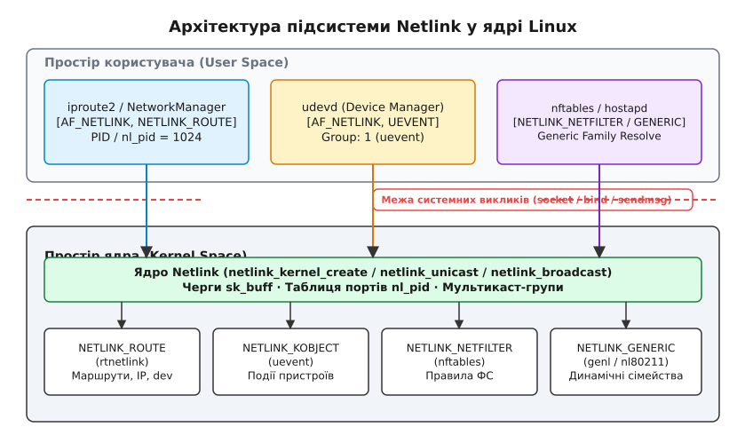
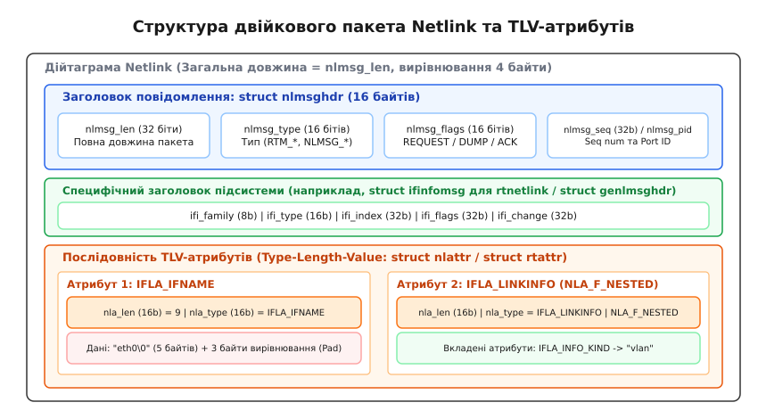
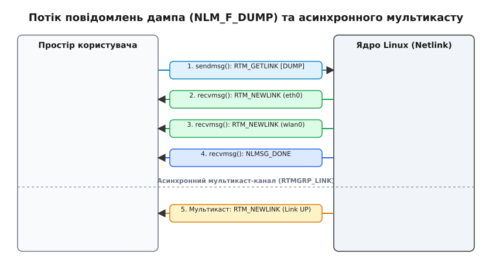

# Обмін повідомленнями через netlink

<preknowlist>
- [Модель сокетів у Linux](root:sys-unix/socket-api-linux) — створення сокетів, системні виклики socket(), bind(), sendmsg() та recvmsg().
- [Мережевий стек Linux](root:sys-unix/network-stack-architecture) — архітектура мережевого стеку ядра та шлях мережевого пакета.
- [Файлова система procfs](root:sys-unix/procfs-kernel-implementation) — застарілі механізми прочитання стану та налаштування ядра через псевдофайли.
- [Інтерфейс sysctl](root:sys-unix/sysctl-parameter-map-and-tooling) — механізм викликів sysctl та /proc/sys для глобальних параметрів ядра.
- [Символьні та блочні пристрої](root:sys-unix/character-and-block-devices) — абстракція пристроїв та системний виклик ioctl.
</preknowlist>

Коли високопродуктивному мережевому демону (такому як `NetworkManager`, `systemd-networkd`, `FRRouting` або клієнту VPN) потрібно в реальному часі відстежувати стан мережевих інтерфейсів, змінювати IP-адреси чи оновлювати тисячі маршрутів у таблиці ядерної маршрутизації, застосування застарілих системних викликів `ioctl()` або регулярне читання файлів з `/proc/net/` призводить до катастрофічної втрати продуктивності. Текстове опитування (англ. *polling*) через `/proc/net/dev` змушує процес витрачати 100% процесорного часу в нескінченних циклах, пропускає короткочасні зміни станів каналу й не здатне повідомити про події негайно у мить їх виникнення. Системний виклик `ioctl()`, у свою чергу, спирається на монолітні C-структури сталого розміру, не дозволяє передавати динамічні атрибути (наприклад, мітки VLAN чи параметри тунелів) і не підтримує асинхронні сповіщення від ядра до користувача.

Для подолання цих обмежень у ядрі Linux було створено **Netlink** — асинхронний, розширюваний двонаправлений підсистемний механізм міжпроцесної взаємодії (IPC, англ. *Inter-Process Communication*), побудований на семантиці дейтаграмних сокетів (`AF_NETLINK`). Netlink перетворює ядро Linux на активного учасника обміну даними: ядро може не лише відповідати на запити користувацьких процесів, а й самостійно транслювати події в реальному часі через асинхронні мультикаст-групи.

---

## Архітектура підсистеми та сокетний домен AF_NETLINK

Netlink реалізовано у ядрі як повноцінний сокетний домен `AF_NETLINK` (або `PF_NETLINK`). На відміну від класичних мережевих сокетів (`AF_INET` чи `AF_INET6`), які передають пакети через фізичні чи віртуальні мережеві адаптери в зовнішню мережу, сокети `AF_NETLINK` працюють виключно в межах оперативної пам'яті комп'ютера, забезпечуючи високошвидкісну шину зв'язку між простором користувача (англ. *user space*) та внутрішніми підсистемами ядра (англ. *kernel space*).


*Анатомія сокетного домену AF_NETLINK: зв'язок між простором користувача та підсистемами ядра через порт-ідентифікатори (nl_pid) та мультикаст-групи.*

Адресація в домені `AF_NETLINK` описується структурою `struct sockaddr_nl` (визначеною у файлі `<linux/netlink.h>`):

:::tabs
```c
struct sockaddr_nl {
    sa_family_t nl_family; /* Завжди AF_NETLINK */
    unsigned short nl_pad;  /* Заповнення нулями (padding) */
    __u32        nl_pid;    /* Порт-ідентифікатор (Port ID, унікальний для кожного сокета) */
    __u32        nl_groups; /* Бітова маска мультикаст-груп для підписки */
};
```
```cpp
#include <linux/netlink.h>
#include <sys/socket.h>
#include <cstdint>

// У C++20 структура sockaddr_nl ініціалізується через designated initializers
constexpr uint32_t multicast_groups = RTMGRP_LINK | RTMGRP_IPV4_IFADDR;
sockaddr_nl sa{
    .nl_family = AF_NETLINK,
    .nl_pad = 0,
    .nl_pid = 0, // 0 дозволяє ядру призначити Port ID
    .nl_groups = multicast_groups
};
```
:::

Адресна схема Netlink має дві ключові особливості:
1. **Порт-ідентифікатор (`nl_pid`)**: Позначає конкретну кінцеву точку каналу. Для системних процесів у просторі користувача як `nl_pid` традиційно використовують ідентифікатор процесу (PID). Якщо процес відкриває кілька сокетів Netlink або є багатопотоковим, кожен сокет повинен мати унікальний `nl_pid` (наприклад, комбінацію PID та ідентифікатора потоку TID). Якщо при виклику `bind()` вказати `nl_pid = 0`, ядро автоматично призначить сокету вільний унікальний номер. Якщо повідомлення надсилається від ядра, його `nl_pid` завжди дорівнює `0`.
2. **Мультикаст-групи (`nl_groups`)**: 32-бітна маска (або масив у сучасних ядрах), що дозволяє процесу підписатися на конкретні категорії ядерних подій. Наприклад, підписка на групу `RTMGRP_LINK` дає змогу отримувати сповіщення про зміну стану мережевих інтерфейсів, а `RTMGRP_IPV4_IFADDR` — про призначення чи видалення IP-адрес.

### Протокольні сімейства Netlink

При створенні сокета за допомогою системного виклику `socket(AF_NETLINK, SOCK_RAW, protocol)` третій параметр `protocol` вказує, з якою саме підсистемою ядра відкривається канал зв'язку. Ядро визначає низку стандартних протоколів:

* **`NETLINK_ROUTE` (`rtnetlink`)**: Найважливіший протокол мережевої конфігурації. Керує мережевими інтерфейсами, IP-адресами, таблицями маршрутизації, сусідніми вузлами (ARP/NDP), дисциплінами черг QoS та мережевими мостами.
* **`NETLINK_GENERIC` (`genl`)**: Розширювана шина-мультиплексор для створення нових суб-протоколів без виділення нових ядерних констант. Використовується в `nl80211` (Wi-Fi), `ethtool` (налаштування адаптерів), `wireguard`, `openvswitch`.
* **`NETLINK_KOBJECT_UEVENT`**: Канал трансляції подій про гаряче підключення обладнання (англ. *hotplug*) від підсистеми `kobject` ядра до демона `udevd` або `systemd-udevd`.
* **`NETLINK_NETFILTER`**: Інтерфейс підсистеми міжмережевого екрана (Netfilter), який забезпечує роботу користувацьких утиліт `nftables` та `conntrack`.
* **`NETLINK_AUDIT`**: Канал підсистеми безпеки та аудиту ядра (сервіс `auditd`), який фіксує системні виклики та події авторизації.
* **`NETLINK_SELINUX`**: Передача сповіщень про зміни в політиках безпеки SELinux.
* **`NETLINK_CRYPTO`**: Інтерфейс для керування криптографічними алгоритмами та реєстрації майданчиків апаратного прискорення в ядрі.

Детальний аналіз передумов створення `AF_NETLINK` та відмови від legacy-інструментів викладено в матеріалі [📜 Історія виникнення Netlink: від sysctl та ioctl до AF_NETLINK](root:sys-unix/netlink-protocol/hist-netlink-origins.md).

---

## Двійковий кадр Netlink: заголовки, вирівнювання та TLV-атрибути

Обмін даними в Netlink відбувається за допомогою двійкових дейтаграм, які складаються зі стандартного заголовка `struct nlmsghdr`, специфічного заголовка підсистеми та послідовності динамічних атрибутів.


*Формат двійкового пакета Netlink: заголовок nlmsghdr, вирівнювання по межі 4 байтів, корисне навантаження та вкладені TLV-атрибути (nlattr / rtattr).*

### Анатомія заголовка `struct nlmsghdr`

Усі повідомлення Netlink починаються з 16-байтового заголовка `struct nlmsghdr`:

:::tabs
```c
struct nlmsghdr {
    __u32 nlmsg_len;   /* Довжина повідомлення включаючи заголовок (у байтах) */
    __u16 nlmsg_type;  /* Тип вмісту або код команди */
    __u16 nlmsg_flags; /* Бітові прапорці керування */
    __u32 nlmsg_seq;   /* Номер послідовності (Sequence number) */
    __u32 nlmsg_pid;   /* Порт-ідентифікатор (Port ID відправника) */
};
```
```cpp
#include <linux/netlink.h>
#include <cstdint>

// Ідіоматичне створення та заповнення заголовка Netlink у C++20
constexpr uint32_t payload_size = 1024;
nlmsghdr header{
    .nlmsg_len = NLMSG_LENGTH(payload_size),
    .nlmsg_type = RTM_GETLINK,
    .nlmsg_flags = NLM_F_REQUEST | NLM_F_DUMP,
    .nlmsg_seq = 1,
    .nlmsg_pid = 0
};
```
:::

Поля заголовка відіграють чітко визначену роль:
* **`nlmsg_len`**: Містить повний розмір кадру у байтах, включаючи заголовок, навантаження підсистеми та всі долучені атрибути.
* **`nlmsg_type`**: Визначає семантику кадру. Значення менше `NLMSG_MIN_TYPE` (`0x10`) є службовими повідомленнями ядра (`NLMSG_NOOP`, `NLMSG_ERROR`, `NLMSG_DONE`, `NLMSG_OVERRUN`). Значення від `0x10` і вище визначаються конкретним протоколом (наприклад, `RTM_NEWLINK = 16`, `RTM_DELLINK = 17`, `RTM_GETLINK = 18` у `rtnetlink`).
* **`nlmsg_flags`**: Прапорці, які модифікують обробку запиту. Поділяються на загальні прапорці (`NLM_F_REQUEST`, `NLM_F_MULTI`, `NLM_F_ACK`), прапорці вибірки (`NLM_F_DUMP = NLM_F_ROOT | NLM_F_MATCH`) та прапорці створення об'єктів (`NLM_F_CREATE`, `NLM_F_EXCL`, `NLM_F_REPLACE`).
* **`nlmsg_seq`**: Порядковий номер, який встановлює простір користувача при відправці запиту. Ядро копіює цей номер у свою відповідь, що дозволяє асинхронним клієнтам точно зіставляти відповіді із запитами.
* **`nlmsg_pid`**: Порт джерела. При відправці запиту ядром дорівнює `nl_pid` відправника; ядро перевіряє цей параметр для перевірки прав доступу.

### Вирівнювання пам'яті та макроси `NLMSG_*`

Для забезпечення високої швидкості обробки на 32- та 64-бітних процесорах усі елементи повідомлення Netlink вирівнюються за межою **4 байтів** (`NLMSG_ALIGNTO = 4U`). Це означає, що якщо розмір даних дорівнює 5 байтам, у пам'яті буде виділено 8 байтів, а 3 байти стануть заповненням (англ. *padding*).

Математичне обчислення вирівнювання описується побітовою формулою:

```
NLMSG_ALIGN(len) = (((len) + 3) & ~3)
```

Для безпечної роботи з масивами пам'яті без ризику виходу за межі буфера специфікація вимагає використовувати системні макроси:
* **`NLMSG_DATA(nlh)`**: Повертає вказівник на початок корисного навантаження, що слідує одразу за заголовком `struct nlmsghdr`.
* **`NLMSG_NEXT(nlh, len)`**: Переходить до наступного заголовка `struct nlmsghdr` у буфері, зменшуючи змінну `len` на розмір поточного пакета.
* **`NLMSG_OK(nlh, len)`**: Повертає істину, якщо залишок буфера `len` достатній для читання повного кадру.

### Концепція кодування TLV (Type-Length-Value)

Після заголовка підсистеми корисне навантаження складається з послідовності атрибутів TLV. У сучасних підсистемах ядра атрибут описується структурою `struct nlattr` (у `rtnetlink` — `struct rtattr`):

:::tabs
```c
struct nlattr {
    __u16 nla_len;   /* Довжина атрибута (заголовок + дані) */
    __u16 nla_type;  /* Тип атрибута та бітові прапорці */
};
```
```cpp
#include <linux/netlink.h>
#include <cstdint>

// Ідіоматична обробка та ініціалізація атрибута nlattr у C++20
constexpr uint16_t nested_flag = NLA_F_NESTED;
nlattr attr{
    .nla_len = NLA_HDRLEN,
    .nla_type = IFLA_LINKINFO | nested_flag
};
```
:::

Завдяки форматированню TLV досягається абсолютна розширюваність ABI:
1. Якщо нове ядро Linux додає підтримку нового параметра (наприклад, дзеркалювання трафіку чи статистики бездротової мережі), воно додає новий атрибут у кінець списку.
2. Стара програма у просторі користувача, яка не знає про новий `nla_type`, просто вираховує `NLA_ALIGN(nla_len)` і зчитує наступний атрибут за допомогою макросу `NLA_NEXT()`, не збіваючись і не завершуючись аварійно.

Детальні структури C/C++ для `nlmsghdr`, `nlattr`, `rtattr` та макроси вирівнювання наведено у довіднику [📋 Структури даних та макроси Netlink: nlmsghdr, nlattr, rtattr](root:sys-unix/netlink-protocol/api-netlink-headers.md).

---

## Потік даних, семантика запитів та мультикаст

Взаємодія через сокет Netlink підтримує дві парадигми передачі даних: синхронний запит-відповідь (Unicast Request-Response) та асинхронне мовлення (Multicast Event Stream).


*Протокол запит-відповідь для таблиць ядра: пакетний запит NLM_F_DUMP, потік підпакетів від ядра та підтвердження завершення через NLMSG_DONE.*

### 1. Механізм вивантаження таблиць (Multipart Dumps)

Коли програмі потрібно отримати повний список об'єктів ядра (наприклад, усі мережеві інтерфейси або повну таблицю маршрутизації), вона надсилає запит із прапорцем `NLM_F_DUMP` (що є комбінацією `NLM_F_REQUEST | NLM_F_ROOT | NLM_F_MATCH`).

Оскільки повний список об'єктів може містити десятки тисяч записів і не вміщатися в один буфер сокета, ядро застосовує потік багаточастинних повідомлень (англ. *multipart messages*):
1. Ядро ітегрується по внутрішніх структурах даних (наприклад, по масиву `dev_base` або дереву `fib_table`).
2. Ядро формує серію кадрів Netlink, встановлюючи у заголовку кожного з них прапорець `NLM_F_MULTI`.
3. Кожен кадр може містити власну частину даних (наприклад, один інтерфейс або один маршрут).
4. Коли всі об'єкти передано, ядро надсилає фінальний службовий пакет із типом `nlmsg_type = NLMSG_DONE` та `nlmsg_len = sizeof(struct nlmsghdr)`.
5. Простір користувача у циклі читання `recvmsg()` обробляє кадри, доки не зустріне тип `NLMSG_DONE`.

### 2. Квитування та обробка помилок: `struct nlmsgerr`

Якщо при виконанні команди модифікації (наприклад, створення інтерфейсу `RTM_NEWLINK`) сталася помилка (недостатньо прав `EPERM`, відсутній пристрій `ENODEV`), ядро повертає пакет з типом `NLMSG_ERROR`. Корисним навантаженням цього пакета є структура `struct nlmsgerr`:

:::tabs
```c
struct nlmsgerr {
    int error;           /* Від'ємний код помилки (наприклад, -EEXIST) */
    struct nlmsghdr msg; /* Копія заголовка запиту, що спричинив помилку */
};
```
```cpp
#include <linux/netlink.h>
#include <system_error>
#include <iostream>

// Обробка структури помилки nlmsgerr у C++ із використанням std::error_code
void handle_netlink_error(const nlmsgerr& err) {
    if (err.error != 0) {
        std::error_code ec(-err.error, std::generic_category());
        std::cerr << "Netlink помилка: " << ec.message() << " (код " << err.error << ")\n";
    }
}
```
:::

Якщо простір користувача надіслав запит з прапорцем `NLM_F_ACK`, ядро після успішного виконання операції також надішле пакет `NLMSG_ERROR`, але поле `error` у ньому дорівнюватиме `0` (що означає успішне квитування ACK).

### 3. Асинхронні мультикаст-сповіщення

Якщо процес викликав `bind()` із заповненим полем `nl_groups`, сокет стає слухачем мультикаст-подій. Коли в ядрі відбувається подія (наприклад, мережевий кабель вставили у порт і операційний стан змінився на `IF_OPER_UP`), ядро викликає внутрішню функцію `rtnl_notify()` або `genlmsg_multicast()`.

Ядро копіює кадр сповіщення у буфери приймання `sk_buff` усіх сокетів, підписаних на цю мультикаст-групу. Процеси у просторі користувача прокидаються у системному виклику `poll()` або `epoll_wait()` і зчитують події без необхідності надсилання жодних запитів.

---

## Мережева конфігурація через rtnetlink (`NETLINK_ROUTE`)

Протокол `NETLINK_ROUTE` (`rtnetlink`) є основним інструментом конфігурування мережевого стеку Linux. Він замінив застарілі виклики `ioctl` та керує чотирма основними категоріями об'єктів:

### 1. Мережеві інтерфейси (Link)

Команди `RTM_NEWLINK`, `RTM_DELLINK`, `RTM_GETLINK`, `RTM_SETLINK` оперують мережевими адаптерами. Корисне навантаження починається зі структури `struct ifinfomsg`:

:::tabs
```c
struct ifinfomsg {
    unsigned char  ifi_family; /* AF_UNSPEC */
    unsigned short ifi_type;   /* Тип обладнання ARPHRD_* (Ethernet, Loopback, PPP) */
    int            ifi_index;  /* Унікальний індекс інтерфейсу (ifindex) */
    unsigned int   ifi_flags;  /* Прапорці каналу (IFF_UP, IFF_RUNNING, IFF_PROMISC) */
    unsigned int   ifi_change; /* Маска змін прапорців */
};
```
```cpp
#include <linux/rtnetlink.h>
#include <net/if.h>

// Ініціалізація ifinfomsg для запиту стану інтерфейсу в C++20
ifinfomsg ifi{
    .ifi_family = AF_UNSPEC,
    .ifi_type = ARPHRD_ETHER,
    .ifi_index = 0, // 0 означає запит для всіх інтерфейсів
    .ifi_flags = IFF_UP,
    .ifi_change = 0xFFFFFFFF
};
```
:::

За цією структурою ідуть атрибути `IFLA_*`: `IFLA_IFNAME` (назва, наприклад `"eth0"`), `IFLA_ADDRESS` (MAC-адреса), `IFLA_MTU`, `IFLA_OPERSTATE` (стан каналу), `IFLA_LINKINFO` (налаштування віртуальних пристроїв VLAN/veth/Bridge).

### 2. IP-адреси (Address)

Команди `RTM_NEWADDR`, `RTM_DELADDR`, `RTM_GETADDR` керують мережевими адресами IPv4 та IPv6. Корисне навантаження починається зі структури `struct ifaddrmsg`:

:::tabs
```c
struct ifaddrmsg {
    unsigned char ifa_family;    /* AF_INET або AF_INET6 */
    unsigned char ifa_prefixlen; /* Маска мережі в форматі CIDR (наприклад, 24) */
    unsigned char ifa_flags;     /* Прапорці адреси (IFA_F_SECONDARY, IFA_F_PERMANENT) */
    unsigned char ifa_scope;     /* Область видимості (RT_SCOPE_UNIVERSE, RT_SCOPE_LINK) */
    unsigned int  ifa_index;     /* Індекс інтерфейсу ifindex */
};
```
```cpp
#include <linux/rtnetlink.h>
#include <sys/socket.h>

// Формування запиту ifaddrmsg для IPv4/IPv6 у C++20
ifaddrmsg ifa{
    .ifa_family = AF_INET,
    .ifa_prefixlen = 24,
    .ifa_flags = IFA_F_PERMANENT,
    .ifa_scope = RT_SCOPE_UNIVERSE,
    .ifa_index = 1
};
```
:::

Основні атрибути: `IFA_ADDRESS` (IP-адреса мережі), `IFA_LOCAL` (локальна адреса), `IFA_LABEL` (мітка інтерфейсу).

### 3. Таблиця маршрутизації (Route)

Команди `RTM_NEWROUTE`, `RTM_DELROUTE`, `RTM_GETROUTE` керують правилами маршрутизації IPv4/IPv6. Навантаження починається зі структури `struct rtmsg`:

:::tabs
```c
struct rtmsg {
    unsigned char rtm_family;   /* AF_INET або AF_INET6 */
    unsigned char rtm_dst_len;  /* Довжина маски призначення (CIDR) */
    unsigned char rtm_src_len;  /* Довжина маски джерела */
    unsigned char rtm_tos;      /* Тип обслуговування */
    unsigned char rtm_table;    /* Таблиця маршрутизації (RT_TABLE_MAIN, RT_TABLE_LOCAL) */
    unsigned char rtm_protocol; /* Джерело маршруту (RTPROT_STATIC, RTPROT_BOOT, RTPROT_BGP) */
    unsigned char rtm_scope;    /* Область видимості маршруту (RT_SCOPE_UNIVERSE, RT_SCOPE_LINK) */
    unsigned char rtm_type;     /* Тип (RTN_UNICAST, RTN_LOCAL, RTN_BROADCAST) */
    unsigned int  rtm_flags;    /* Прапорці RTM_F_* */
};
```
```cpp
#include <linux/rtnetlink.h>
#include <sys/socket.h>

// Формування запиту rtmsg для маршрутизації в C++20
rtmsg rtm{
    .rtm_family = AF_INET,
    .rtm_dst_len = 32,
    .rtm_src_len = 0,
    .rtm_tos = 0,
    .rtm_table = RT_TABLE_MAIN,
    .rtm_protocol = RTPROT_STATIC,
    .rtm_scope = RT_SCOPE_UNIVERSE,
    .rtm_type = RTN_UNICAST,
    .rtm_flags = 0
};
```
:::

Основні атрибути: `RTA_DST` (IP-адреса призначення), `RTA_GATEWAY` (шлюз Next Hop), `RTA_OIF` (індекс вихідного інтерфейсу `ifindex`), `RTA_PRIORITY` (метрика маршруту).

---

## Внутрішній механізм ядра: обробка та маршрутизація сокетів Netlink

Усередині ядра Linux підсистема Netlink реалізована у вихідних файлах `net/netlink/af_netlink.c` та `net/core/rtnetlink.c`. Розуміння того, що відбувається при системних викликах `socket()`, `sendmsg()` та `recvmsg()`, дозволяє точніше проектувати високонавантажені системні сервіси.

### 1. Створення сокета у ядрі (`netlink_create`)

При виклику `socket(AF_NETLINK, SOCK_RAW, protocol)` ядро виконує функцію `netlink_create()`:
* Перевіряє, чи обраний номер `protocol` зареєстрований у ядерній хеш-таблиці `netlink_tap` та масиві `nl_table`.
* Алокує внутрішній ядерний сокет `struct netlink_sock` (який розширює стандартну структуру `struct sock`).
* Ініціалізує черги прийому `sk_receive_queue` та встановлює системні callback-функції обробки.

### 2. Таблиця портів та мультикаст-таблиця (`nl_table`)

Ядро зберігає глобальний масив списків `nl_table`, який індексується за номером протоколу (`NETLINK_ROUTE`, `NETLINK_GENERIC` тощо). Для кожного протоколу `nl_table` містить:
* **Хеш-таблицю портів (`hash`)**: Реєструє всі відкриті сокети за їхнім `nl_pid`. Коли користувацький процес надсилає `sendmsg()`, ядро шукає сокет призначення у цій хеш-таблиці.
* **Масив мультикаст-груп (`mc_list`)**: Зберігає бітові маски підписок для кожного сокета. При виклику `netlink_broadcast()` ядро ітерується по списку `mc_list` відповідного протоколу і дублює мережевий буфер `sk_buff` для кожного підписаного сокета.

### 3. Шлях передачі пакета: від `sendmsg()` до обробника підсистеми

Коли простір користувача викликає `sendmsg()`:
1. Системний виклик переходить у функцію ядра `netlink_sendmsg()`.
2. Ядро алокує сокетний буфер `sk_buff` і копіює в нього байти кадру з простору користувача.
3. Перевіряється адреса призначення `struct sockaddr_nl`:
   - Якщо `nl_pid == 0`, пакет призначено ядру. Ядро викликає обробник підсистеми (наприклад, `rtnetlink_rcv()` для `NETLINK_ROUTE`).
   - Якщо `nl_pid > 0`, пакет призначено іншому користувацькому процесу. Ядро знаходить сокет адресата у хеш-таблиці та ставить `sk_buff` у його приймальну чергу `sk_receive_queue` за допомогою функції `netlink_unicast()`.

---

## Generic Netlink (genl): розширювана шина ядра

Зі зростанням кількості підсистем ядра Linux статичний ліміт у 32 протоколи Netlink стал вузьким місцем. Для розширення інфраструктури розробники створили **Generic Netlink** (`NETLINK_GENERIC = 16`).

Generic Netlink працює як мультиплексор вищого рівня. Він надає спеціальний контролер `nlctrl` (із динамічним ID сімейства `GENL_ID_CTRL = 0x10`), який відповідає за реєстрацію та резолюцію текстових назв сімейств у числові ідентифікатори.

```
+-------------------------------------------------------------------+
|            Простір користувача (wpa_supplicant / ethtool)         |
+-------------------------------------------------------------------+
                                  |
            1. Запит ID для "nl80211" до контролера nlctrl
            2. Отримання family_id (наприклад, 0x0018)
            3. Обмін командами через NETLINK_GENERIC + family_id
                                  |
                                  v
+-------------------------------------------------------------------+
|               Підсистема Generic Netlink (genl)                   |
|   +-----------------------------------------------------------+   |
|   | Controller (nlctrl): Пошук текстових назв сімейств        |   |
|   +-----------------------------------------------------------+   |
|         |                       |                       |         |
|         v                       v                       v         |
|   +-----------+           +-----------+           +-----------+   |
|   |  nl80211  |           |  ethtool  |           |wireguard  |   |
|   +-----------+           +-----------+           +-----------+   |
+-------------------------------------------------------------------+
```

За заголовком `struct nlmsghdr` у Generic Netlink завжди слідує заголовок `struct genlmsghdr`:

:::tabs
```c
struct genlmsghdr {
    __u8 cmd;      /* Команда специфічна для даного сімейства */
    __u8 version;  /* Версія API підсистеми */
    __u16 reserved;/* Зарезервовано для вирівнювання */
};
```
```cpp
#include <linux/genetlink.h>
#include <cstdint>

// Заповнення заголовка Generic Netlink у C++20
constexpr uint8_t genl_version = 1;
genlmsghdr gnl{
    .cmd = CTRL_CMD_GETFAMILY,
    .version = genl_version,
    .reserved = 0
};
```
:::

### Алгоритм роботи з Generic Netlink:
1. Програма відкриває сокет `socket(AF_NETLINK, SOCK_RAW, NETLINK_GENERIC)`.
2. Програма надсилає запит до контролера `nlctrl` з кодом `CTRL_CMD_GETFAMILY` та додає атрибут `CTRL_ATTR_FAMILY_NAME` зі значенням текстового імені (наприклад, `"nl80211"`).
3. Контролер ядра повертає 16-бітний числовий `family_id` (наприклад, `0x0018`).
4. Подальші запити надсилаються з цим числовшим `family_id` у полі `nlmsg_type`.

---

## Практична реалізація: сирий API C vs C++20 та libnl

При розробці програмного забезпечення під Linux розробники мають вибір між низькорівневою маніпуляцією сирими сокетами та високорівневими бібліотеками (`libnl-3`, `libmnl`).

### Порівняльний аналіз підходів:

* **Сирі сокети (`sys/socket.h`, `linux/netlink.h`)**: Не вимагають зовнішніх залежностей та сторонніх бібліотек у системі. Забезпечують максимальну швидкість та мінімальний розмір виконуваного файлу, проте вимагають ретельного ручного управління буферами, контролю вирівнювання макросами `NLMSG_*` та `RTA_*`.
* **Бібліотека `libmnl` (Minimalistic Netlink Library)**: Легковажна офіційна бібліотека від проекту Netfilter. Не створює складних об'єктних абстракцій, але надає надійні функції перевірки та парсингу TLV-атрибутів.
* **Бібліотека `libnl-3`**: Високорівнева об'єктно-орієнтована бібліотека на C, яка надає готові кронштейни та об'єкти (`struct nl_sock`, `struct nl_cache`, `struct rtnl_link`). Активно використовується у `NetworkManager`.

Повний приклад створення асинхронного монітора мережевих подій на C та C++20 наведено у матеріалі [⚙️ Практикум: розробка асинхронного монітора мережевих подій на Netlink](root:sys-unix/netlink-protocol/proj-netlink-monitor.md).

---

## Крайові випадки, оптимізація та безпека

При експлуатації сокетів Netlink у високонавантажених серверних системах виникає низка критичних крайових випадків:

### 1. Переповнення буфера приймання та помилка `ENOBUFS`

Якщо ядро генерує асинхронні мультикаст-повідомлення зі швидкістю, що перевищує швидкість їх зчитування програмою користувача (наприклад, при масовій зміні тисяч маршрутів BGP), системний буфер приймання сокета переповнюється.

Наступний виклик `recv()` або `recvmsg()` повертає помилку `-1` із встановленим `errno = ENOBUFS`.
* **Наслідки**: Пакети подій, що були скинуті ядром, втрачаються назавжди.
* **Спосіб вирішення**:
  1. Збільшити розмір буфера сокета за допомогою `setsockopt(fd, SOL_SOCKET, SO_RCVBUF, &bufsize)` до кількох мегабайт (наприклад, 8–16 МБ).
  2. При отриманні помилки `ENOBUFS` програма повинна припустити, що її локальний стан застарів, і примусово виконати повний повторний дамп таблиць за допомогою `NLM_F_DUMP`.

### 2. Забезпечення унікальності Порт-ID (`nl_pid`) у багатопотокових програмах

Якщо два потоки одного процесу викликають `bind()` з однаковим `nl_pid = getpid()`, аргумент другого виклику спричинить конфлікт адреси у ядрі.

:::tabs
```c
/* Помилковий підхід у багатопотоковому середовищі */
sa.nl_pid = getpid(); /* Приведе до конфлікту при відкритті другого сокета */

/* Правильний ідіоматичний підхід */
sa.nl_pid = 0; /* Ядро самостійно виділить унікальний nl_pid для кожного сокета */
```
```cpp
#include <linux/netlink.h>
#include <unistd.h>

// У C++20 уникаємо використання getpid() для сумісності з багатопотоковістю:
sockaddr_nl sa{};
sa.nl_family = AF_NETLINK;
// sa.nl_pid = static_cast<uint32_t>(::getpid()); // Небезпечно у багатопотоковому коді
sa.nl_pid = 0; // Автоматичне виділення Port ID ядром
```
:::

### 3. Строгий режим перевірки (Strict Checking)

У ядрі Linux 4.20 було додано опцію сокета `NETLINK_GET_STRICT_CHK`. За замовчуванням старі ядра ігнорували невідомі атрибути або зайві прапорці у DUMP-запитах. Включення строгого режиму змушує ядро виконувати жорстку валідацію вхідних атрибутів запиту на боці ядра:

:::tabs
```c
int opt = 1;
setsockopt(fd, SOL_NETLINK, NETLINK_GET_STRICT_CHK, &opt, sizeof(opt));
```
```cpp
int opt = 1;
if (::setsockopt(sock.get(), SOL_NETLINK, NETLINK_GET_STRICT_CHK, &opt, sizeof(opt)) < 0) {
    throw std::system_error(errno, std::generic_category(), "Failed to set NETLINK_GET_STRICT_CHK");
}
```
:::

Це дозволяє фільтрувати вивантаження дампа (наприклад, просити ядро повернути інтерфейси лише конкретного мережевого простору імен чи конкретної таблиці) безпосередньо у ядрі, різко зменшуючи обсяг переданих даних.

### 4. Zero-Copy режим: `NETLINK_MMAP`

У надвисоконавантажених системах (наприклад, при зборі статистики з мільйонів мережевих з'єднань через `NETLINK_NETFILTER` або `NETLINK_INET_DIAG`) стандартний виклик `recvmsg()` створює накладні витрати на копіювання даних з ядерних буферів у простір користувача.

Для усунення копіювання ядро Linux надає можливість кільцевого буфера в пам'яті через `NETLINK_MMAP`:
1. Програма створює сокет Netlink.
2. Програма налаштовує розміри кільцевого буфера через `setsockopt(fd, SOL_NETLINK, NETLINK_RX_RING, &req, sizeof(req))`.
3. Програма відображає буфер у свій адресний простір за допомогою виклику `mmap()`.
4. Ядро записує кадри Netlink безпосередньо у виділені сторінки пам'яті, а простір користувача читає їх без жодного системного виклику `recv()`.

### 5. Модель безпеки, ізоляція та Linux Capabilities

Для створення сокетів більшості протоколів Netlink (наприклад, `NETLINK_ROUTE` або `NETLINK_GENERIC`) звичайному користувачеві не потрібні привілеї кореневого користувача (`root`) для пасивного читання або моніторингу подій.

Проте для здійснення будь-яких модифікацій (додавання IP-адрес, створення віртуальних пристроїв, зміни маршрутів чи конфігурації фільтрів) ядро Linux вимагає наявності у процесу мандатної можливості **`CAP_NET_ADMIN`** у відповідному мережевому просторі імен (Network Namespace). При використанні контейнеризації (Docker, LXC, systemd-nspawn) кожен мережевий простір імен має власну ізольовану таблицю сокетів Netlink, що унеможливлює вплив контейнера на мережеву конфігурацію хост-системи.

---

## Підсумок

Підсистема Netlink вивела міжпроцесну взаємодію в ядрі Linux на якісно новий рівень, створивши бінарно-стабільну, розширювану та високоефективну шину даних. Завдяки поєднанню сокетної парадигми, асинхронного мультикасту, пакетних дампів та кодування атрибутів за схемою TLV, Netlink став кровоносною системою мережевого стеку Linux, витіснивши застарілі механізми `ioctl()` та `/proc`.
