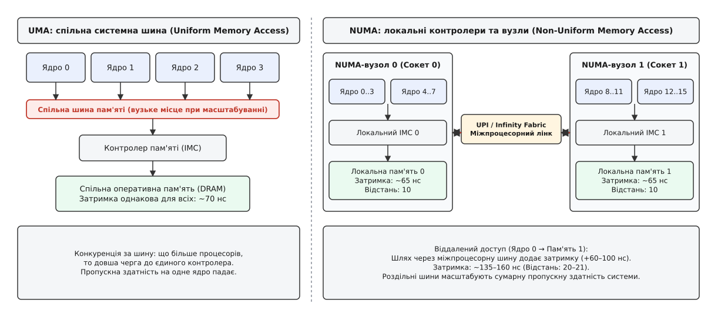
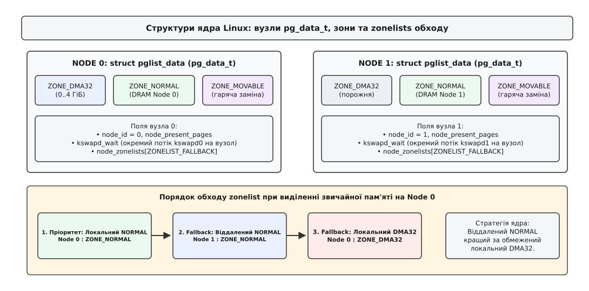
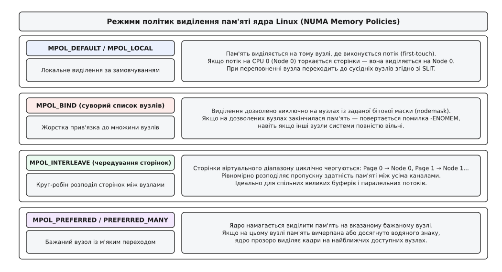
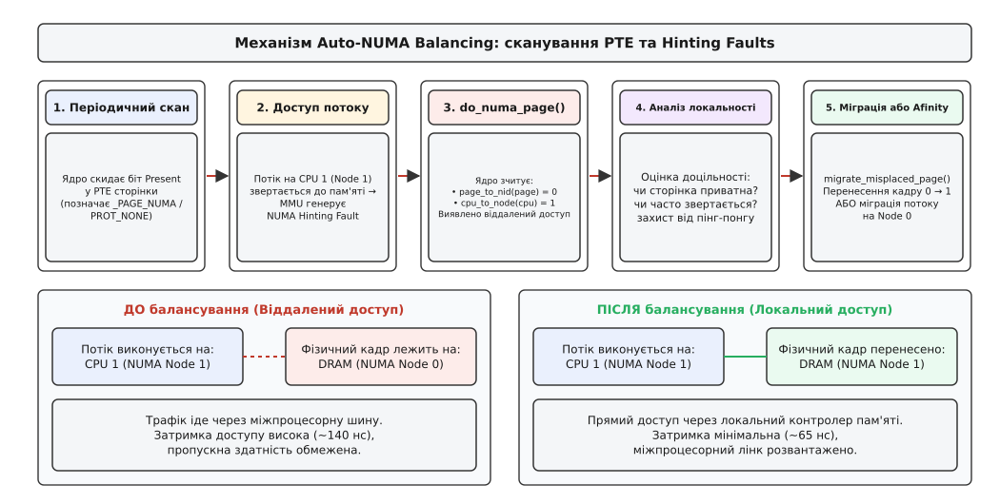
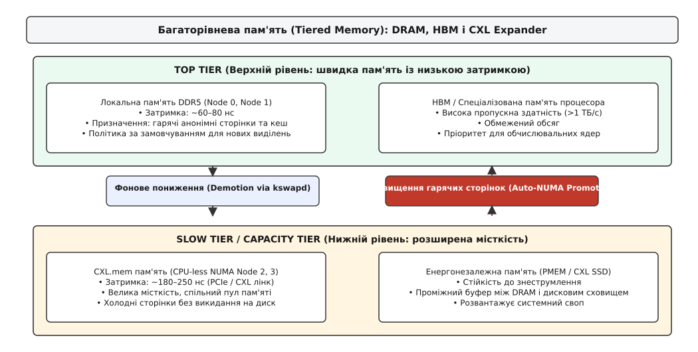

# NUMA: вузли, політики розміщення й багаторівнева пам'ять

<preknowlist>
- [Сторінки, таблиці сторінок і MMU](topic:sf-os/paging-and-mmu) — пам'ять нарізана на сторінки, віртуальні адреси перекладаються на фізичні кадри через багаторівневі таблиці.
- [Віртуальний адресний простір процесу](topic:sf-os/virtual-address-space) — процес працює в ізольованому просторі діапазонів VMA, які ядро відображає на фізичну пам'ять.
- [Сторінковий збій](topic:sf-os/page-fault) — фізичний кадр підставляється у мить першого дотику, а не під час системного виклику виділення пам'яті.
- [Міграція сторінок](topic:sys-unix/page-migration) — безпечне перенесення вмісту фізичного кадру з підміною PTE та тимчасовими записами блокування.
- [Фізичні сторінки в ядрі: зони, блоки за порядками й ущільнення](topic:sys-unix/physical-page-allocator) — зони пам'яті (`ZONE_NORMAL`, `ZONE_DMA32`), система приятелів та списки вільних блоків.
- [Свопінг і витіснення сторінок](topic:sys-unix/swap-and-reclaim) — фоновий потік `kswapd`, водяні знаки пам'яті та механізми вивільнення пам'яті.
- [Великі сторінки](topic:sys-unix/huge-pages-tlb-reach) — зменшення навантаження на TLB через об'єднання сторінок у блоки по 2 МіБ та 1 ГіБ.
</preknowlist>

Сервер баз даних на 64 процесорних ядрах і двох фізичних сокетах обробляє запити в пам'яті. Коли навантаження зростає від 1 до 32 потоків, пропускна здатність масштабується майже лінійно, а час відповіді тримається на рівні 80 мікросекунд. Але щойно підключаються додаткові робочі потоки і задача перетинає межу 32 ядер, середній час запиту раптово підскакує до 190 мікросекунд, а загальна продуктивність падає на третину. Моніторинг показує нульовий свопінг, вільні 128 гігабайтів оперативної пам'яті та відсутність черг до дискової підсистеми.

Причина цієї деградації лежить не в алгоритмах блокувань і не в планувальнику потоків, а у фізичній структурі пам'яті. На двосокетному сервері пам'ять не є суцільним однорідним пулом. Половина модулів DRAM підключена безпосередньо до першого сокета, а інша половина — до другого. Коли потік на Сокеті 1 звертається до масиву даних, який під час запуску створив потік на Сокеті 0, кожен запит на читання рядка кешу змушений долати міжпроцесорну шину. Час очікування одного байта зростає з 65 до 145 наносекунд, а пропускна здатність міжпроцесорного лінку швидко вичерпується службовим трафіком когерентності кешів.

Ця архітектурна нерівномірність зветься **NUMA** (англ. *Non-Uniform Memory Access* — «нерівномірний доступ до пам'яті»). Далі розглянуто, як фізичні процесори та пам'ять групуються у вузли, як ядро Linux відстежує топологію через структури `pg_data_t`, якими системними викликами процес може керувати розміщенням своїх сторінок, як працює автоматичне балансування Auto-NUMA та як сучасне ядро інтегрує багаторівневу пам'ять на базі CXL і HBM.

## Від симетричної шини до топології вузлів

В однопроцесорних комп'ютерах і ранніх багатопроцесорних серверах усі процесори підключалися до єдиного контролера пам'яті через спільну системну шину — архітектура **UMA** (англ. *Uniform Memory Access*). Будь-яке ядро зверталося до будь-якої адреси за однаковий час. Але коли кількість ядер перевищила 4–8, спільна шина перетворилася на вузьке місце: ядра конкурували за право виставити адресу, а лінії передачі даних були забиті запитами. Детально про те, [як розвивалася багатопроцесорність і чому симетричний доступ уперся у фізичні обмеження шини](topic:sys-unix/numa-memory-policy/hist-numa-and-multiprocessing.md), розповідає окремий історичний нарис.

Виходом став поділ системи на незалежні **NUMA-вузли** (англ. *NUMA nodes*).

Кожен процесорний сокет або обчислювальний кристал (чиплет) отримав власний інтегрований контролер пам'яті (англ. *Integrated Memory Controller*, IMC) та власні канали підключення планок DRAM. Сукупність обчислювальних ядер, їхніх кешів L1/L2/L3 та локально підключеної пам'яті утворює NUMA-вузол. 



*В UMA єдиний контролер створює чергу запитів при зростанні кількості ядер. У NUMA кожен сокет має прямий швидкий доступ до локальної DRAM і повільніший доступ до віддаленої DRAM через міжпроцесорний лінк.*

Вузли зв'язуються між собою високошвидкісними когерентними магістралями типу точка-точка:
- **UPI** (англ. *Ultra Path Interconnect*) у серверах Intel Xeon;
- **Infinity Fabric** у процесорах AMD EPYC та Ryzen;
- **CXL** (англ. *Compute Express Link*) для зовнішніх пулів пам'яті та прискорювачів.

Звернення до пам'яті свого вузла називають **локальним доступом** (англ. *local access*): запит іде напряму від ядра до власного IMC і займає ~60–80 нс. Звернення до пам'яті іншого вузла зветься **віддаленим доступом** (англ. *remote access*): запит пакується в пакети шини UPI/Infinity Fabric, проходить крізь контролер сусіднього сокета, зчитує дані з чужої DRAM і повертається назад, витрачаючи ~130–180 нс.

### Когерентність кешів і кластеризація вузлів

У сучасних багатоядерних процесорах NUMA-домени формуються не лише на рівні сокетів, а й усередині одного фізичного чипа. Через високу кількість ядер (до 64–128 ядер на сокет) виробники ділять процесор на кластери:
- **Sub-NUMA Clustering (SNC-2 / SNC-4 у процесорах Intel Xeon):** ядра одного сокета та їхні спільні кеші L3 розбиваються на 2 або 4 внутрішні домени. Кожен домен обслуговується власним локальним блоком контролера пам'яті, що знижує затримки звернення всередині сокета на 10–15 нс.
- **NUMA Nodes Per Socket (NPS1 / NPS2 / NPS4 в AMD EPYC):** кристал I/O (IOD) конфігурується у прошивці BIOS так, що канали пам'яті групуються по 2 або 4 вузли на сокет, прив'язані до відповідних чиплетів обчислювальних ядер (CCD).

Підтримка єдиного узгодженого стану даних між усіма кешами процесорів покладається на апаратні каталоги когерентності (Directory-based Coherence) та протоколи класу MESIF (Intel) або MOESI (AMD). Якщо ядро на Сокеті 1 модифікує байт, який кешовано на Сокеті 0, спеціальний агент домашнього вузла (Home Agent) надсилає повідомлення інвалідації крізь міжпроцесорний лінк. Що більше таких міжвузлових звернень, то сильніше шина забивається службовим арбітражем, витісняючи корисний потік даних застосунків.

### Апаратний опис топології: ACPI SRAT, SLIT та HMAT

Операційна система дізнається про фізичне розташування вузлів під час завантаження від таблиць прошивки **ACPI** (англ. *Advanced Configuration and Power Interface*):

1. **SRAT** (англ. *System Resource Affinity Table*): ставить у відповідність ідентифікатори процесорних ядер (APIC ID), діапазони фізичних адрес пам'яті та контролери PCIe конкретним доменам близькості — **NUMA Proximity Domains** (вузлам).
2. **SLIT** (англ. *System Locality Information Table*): задає матрицю відносних відстаней (вартостей доступу) між усіма парами вузлів.
3. **HMAT** (англ. *Heterogeneous Memory Attribute Table*): з'явилася в новітніх специфікаціях ACPI 6.3+ і надає ядру точні виміряні числа затримки (latency у наносекундах) та пропускної здатності (bandwidth у МБ/с) для кожного типу пам'яті.

Відстань у таблиці SLIT — це нормалізоване безрозмірне число. За угодою ACPI, доступ до пам'яті власного вузла завжди має базову відстань **10**:

```
node distances:
node   0   1   2   3
  0:  10  21  31  21
  1:  21  10  21  31
  2:  31  21  10  21
  3:  21  31  21  10
```

Значення 21 означає, що віддалений доступ через один прямий лінк коштує приблизно у 2.1 раза дорожче за локальний. Значення 31 показує, що прямого з'єднання між вузлами 0 і 2 немає: пакет мусить пройти два переходи (транзитний вузол), що додає додаткову затримку.

Ядро транслює цю матрицю у внутрішні списки пріоритетів виділення пам'яті.

## Раннє завантаження та структури ядра: pg_data_t

На етапі ранньої ініціалізації ядра (early boot), коли повноцінний розподільник сторінок ще не запущено, підсистема **memblock** зчитує таблиці SRAT та SLIT. Вона розбиває фізичну пам'ять на регіони за приналежністю до NUMA-вузлів.

Щоб максимізувати продуктивність ядра, внутрішні службові структури самого ядра для кожного вузла — включно з масивом дескрипторів сторінок `struct page` (`vmemmap`) та самими дескрипторами `pg_data_t` — виділяються з фізичної пам'яті **саме цього локального вузла**. Завдяки цьому звернення ядра до метаданих сторінок не створює міжпроцесорного трафіку.

У вихідному коді ядра Linux (`<linux/mmzone.h>`) кожен NUMA-вузол описується структурою `typedef struct pglist_data pg_data_t`.

Коли ядро збирається з опцією `CONFIG_NUMA`, замість єдиного глобального масиву сторінок створюється масив покажчиків `NODE_DATA(node_id)`, де кожен елемент веде до власного дескриптора `pg_data_t`.

```c
typedef struct pglist_data {
    struct zone node_zones[MAX_NR_ZONES];
    struct zonelist node_zonelists[MAX_ZONELISTS];
    int nr_zones;

    unsigned long node_start_pfn;
    unsigned long node_present_pages;
    unsigned long node_spanned_pages;
    int node_id;

    wait_queue_head_t kswapd_wait;
    struct task_struct *kswapd;
    
    /* Списки LRU для активних/неактивних сторінок вузла */
    struct lruvec __lruvec;
    
    /* Поля статистики та фонового вивільнення */
    unsigned long flags;
    struct per_cpu_nodestat __percpu *per_cpu_nodestats;
} pg_data_t;
```

Кожен вузол є повноцінною автономною одиницею обліку пам'яті:
- Він містить власний набір зон (`ZONE_DMA32`, `ZONE_NORMAL`, `ZONE_MOVABLE`, `ZONE_DEVICE`). Зазвичай зона `ZONE_DMA32` існує лише на Вузлі 0 (який охоплює перші 4 ГіБ фізичних адрес), тоді як інші вузли містять суто `ZONE_NORMAL` та `ZONE_MOVABLE`.
- Він має власні списки вільних сторінок системи приятелів (buddy allocator) за порядками від 0 до `MAX_PAGE_ORDER`.
- Він володіє автономними списками LRU (`struct lruvec`), де анонімні та файлові сторінки діляться на `Active` та `Inactive`. Завдяки цьому сторінки, що належать Вузлу 0, не конкурують у списках витіснення зі сторінками Вузла 1.
- Він обслуговується власним окремим фоновим потоком вивільнення пам'яті **`kswapd`** (`kswapd0`, `kswapd1` тощо), який прокидається за локальними водяними знаками (`WMARK_MIN`, `WMARK_LOW`, `WMARK_HIGH`).



*Кожен NUMA-вузол має власний екземпляр pg_data_t та потік kswapd. Порядок обходу zonelist визначає, до якого вузла та зони звернеться розподільник у разі вичерпання локальної пам'яті.*

### Порядок обходу: Zonelists

Коли процес запитує виділення сторінки пам'яті, розподільник фізичних сторінок ядра звертається до масиву `node_zonelists[ZONELIST_FALLBACK]` того вузла, на якому виконується потік.

Цей список містить впорядковану чергу пар `(вузол, зона)` для спроб виділення. Принцип формування черги базується на компромісі: що краще — виділити пам'ять у менш зручній зоні на своєму локальному вузлі чи звернутися до віддаленого вузла, але у повноцінну `ZONE_NORMAL`?

Сучасні ядра впорядковують `node_zonelists` за правилом **відстаней вузлів (Node fallback order)**:
1. `(Локальний вузол, ZONE_NORMAL)` — ідеальний випадок: найвища швидкість, повний обсяг.
2. `(Найближчий віддалений вузол, ZONE_NORMAL)` — віддалена пам'ять, але без штучних обмежень адресації.
3. `(Локальний вузол, ZONE_DMA32)` — локальна пам'ять, але ядро намагається зберегти обмежену зону DMA для драйверів пристроїв.
4. `(Віддалені вузли, ZONE_DMA32)`.

Якщо на локальному вузлі закінчилися вільні сторінки вище планки `WMARK_LOW`, розподільник не зупиняє виконання процесу, а прозоро переходить до наступного запису в `zonelist`, виділяючи фізичний кадр на сусідньому вузлі.

### Розміщення таблиць сторінок (Page Tables Locality)

Важливою деталлю є те, що таблиці сторінок процесу (дескриптори PGD, P4D, PUD, PMD, PTE) самі є звичайними фізичними 4-кілобайтними сторінками ядра. Коли процес вперше звертається до пам'яті на певному сокеті, ядро виділяє проміжні таблиці сторінок **на локальному вузлі цього процесора**.

Якщо згодом потік мігрує на інший сокет, він стикається з подвійним штрафом: не лише самі дані лежать на віддаленому вузлі, а й апаратний блок MMU під час кожного промаху повз TLB (TLB miss) змушений виконувати 4–5 звернень до віддаленої пам'яті лише для обходу рівнів таблиці сторінок.

## Політики розміщення пам'яті (Memory Policies)

Поведінкою розподільника за замовчуванням можна керувати. Ядро Linux реалізує гнучку трирівневу ієрархію політик пам'яті (NUMA Memory Policy):

1. **Системна політика (System Default):** діє, якщо процес не задав власних налаштувань. За замовчуванням реалізує принцип **«першого дотику» (First-Touch)**: фізична сторінка виділяється на тому вузлі, де в мить виникнення page fault виконувався потік.
2. **Політика завдання (Task Policy):** закріплюється за структурою `task_struct->mempolicy` процесу або окремого потоку. Встановлюється системним викликом `set_mempolicy(2)`. Усі нові виділення пам'яті цим потоком підпорядковуються цій політиці.
3. **Політика діапазону VMA (VMA Policy):** прив'язується до конкретної віртуальної області пам'яті `vm_area_struct->vm_policy`. Встановлюється викликом `mbind(2)`. Вона має **найвищий пріоритет** і перекриває політику процесу для адрес у цьому діапазоні.



*Чотири базові режими: MPOL_DEFAULT виділяє локально за першим дотиком; MPOL_BIND суворо обмежує виділення обраними вузлами; MPOL_INTERLEAVE чергує сторінки круг-робін; MPOL_PREFERRED намагається виділити на бажаному вузлі з м'яким переходом.*

### Базові режими політик

| Режим | Маска вузлів | Алгоритм виділення фізичних кадрів |
|---|:---:|---|
| **`MPOL_DEFAULT`** | `NULL` | Повертає поведінку до системної: виділення на локальному для поточного CPU вузлі за принципом першого дотику. При дефіциті пам'яті дозволено fallback на сусідні вузли. |
| **`MPOL_BIND`** | Бітова маска | Суворе виділення виключно на вузлах, зазначених у бітовій масці. Якщо на всіх цих вузлах закінчилася пам'ять, системний виклик повертає `-ENOMEM` або потік засинає в очікуванні пам'яті, навіть якщо решта вузлів системи вільні. |
| **`MPOL_INTERLEAVE`** | Бітова маска | Циклічне чергування (Round-Robin) виділення сторінок між заданими вузлами. Сторінка 0 потрапляє на Вузол 0, сторінка 1 — на Вузол 1 тощо. Рівномірно розподіляє навантаження між усіма контролерами пам'яті. |
| **`MPOL_PREFERRED`** | 1 вузол | Бажаний вузол. Розподільник намагається виділити пам'ять на вказаному вузлі. Якщо на ньому виникає дефіцит вільних кадрів, ядро плавно перенаправляє запити на інші доступні вузли. |
| **`MPOL_PREFERRED_MANY`** | Бітова маска | Розширення `MPOL_PREFERRED` для множини вузлів (з'явилося в Linux 5.15). Ядро віддає перевагу групі найшвидших вузлів (наприклад, локальній DDR5), з можливістю виходу за її межі. |
| **`MPOL_LOCAL`** | Порожня | Явно вимагає виділення на локальному вузлі того процесора, що виконує алокацію в даний момент (доступно з Linux 3.8). На відміну від `MPOL_DEFAULT`, ігнорує успадковану політику процесу. |

### Формула чергування для `MPOL_INTERLEAVE`

У режимі `MPOL_INTERLEAVE` для діапазону пам'яті VMA номер цільового вузла для віртуальної сторінки обчислюється ядрами за формулою:

```
vma_page_index = (addr - vma->vm_start) >> PAGE_SHIFT
target_node    = node_mask_array[ (vma_page_index + vma->vm_pgoff) % num_nodes ]
```

Це гарантує, що послідовний обхід масиву рівномірно навантажує всі шини пам'яті системи, запобігаючи перегріву одного IMC.

> 🔧 **Навіщо це.** Режим `MPOL_INTERLEAVE` незамінний для спільних великих буферів: спільні сегменти пам'яті СУБД (PostgreSQL shared buffers, Oracle SGA), кеші пошукових індексів і паралельні матричні обчислення, де сотні потоків на різних сокетах одночасно читають спільні дані. Замість того щоб 100% потоків вишикувалися в чергу до одного сокета, трафік ділиться порівну між усіма каналами пам'яті.

## Системні виклики та керування політиками

Для конфігурації поведінки пам'яті ядра користувацькі застосунки викликають функції інтерфейсу `uapi` (`<numaif.h>`). Детальні сигнатури функцій, бітові прапорці модифікаторів та бібліотечні еквіваленти `libnuma` зібрані у вставці [детальний опис сигнатур системних викликів, масок вузлів та функцій libnuma](topic:sys-unix/numa-memory-policy/api-mempolicy.md).

Коротко розглянемо чотири головні системні виклики:

### 1. `set_mempolicy(mode, nodemask, maxnode)`

Встановлює політику пам'яті для викликаючого потоку:

:::tabs
```c
/* Прив'язати всі майбутні виділення потоку до вузлів 0 та 1 */
unsigned long nodemask = (1UL << 0) | (1UL << 1);
set_mempolicy(MPOL_BIND, &nodemask, sizeof(nodemask) * 8);
```
```cpp
/* Прив'язка виділень потоку до вузлів 0 та 1 за допомогою libnuma */
auto mask = make_unique_nodemask();
numa_bitmask_setbit(mask.get(), 0);
numa_bitmask_setbit(mask.get(), 1);
numa_set_membind(mask.get());
```
:::

Під час виклику ядро копіює бітову маску з простору користувача, виділяє структуру `struct mempolicy` через внутрішній slab-кеш і замінює покажчик `current->mempolicy`. Якщо викликається функція створення нового потоку `pthread_create()`, новостворений потік успадковує цю саму політику.

### 2. `mbind(addr, len, mode, nodemask, maxnode, flags)`

Прив'язує політику до конкретного діапазону віртуальних адрес `[addr, addr + len)`.

Якщо переданий діапазон перетинає середину існуючої області VMA, ядро викликає функцію `split_vma()` і створює окремий піддіапазон із власним покажчиком `vma->vm_policy`.

Критично важливим є аргумент `flags`:
- `flags = 0` — змінює політику тільки для сторінок, які ще не були завантажені у пам'ять;
- `MPOL_MF_MOVE` — ядро знаходить усі сторінки діапазону, які вже знаходяться у фізичній пам'яті на інших вузлах, і автоматично запускає їхню міграцію на нові цільові вузли;
- `MPOL_MF_STRICT` — вимагає повернути помилку `-EIO`, якщо хоча б одна сторінка не відповідає політиці й не може бути переміщена (наприклад, через заблокований DMA).

### 3. `get_mempolicy(mode, nodemask, maxnode, addr, flags)`

Дозволяє зчитати активну політику потоку або дізнатися номер фізичного NUMA-вузла, на якому розміщено кадр за адресою `addr` (прапорець `MPOL_F_NODE | MPOL_F_ADDR`).

### 4. `migrate_pages(pid, maxnode, old_nodes, new_nodes)`

Пакетно переносить усі сторінки вказаного процесу, що лежать на вузлах `old_nodes`, на вузли `new_nodes`. Використовується системними демонами балансування або оркестраторами контейнерів для перенесення процесу між сокетами без його перезапуску.

## Автоматичне балансування: Auto-NUMA

Ручне керування політиками через `mbind()` вимагає модифікації коду програми. Але в реальних системах потоки створюються бібліотеками (OpenMP, TBB, thread pools), а планувальник Linux (`CFS` / `EEVDF`) може перенести потік на вільне ядро сусіднього сокета. У результаті потік опиняється далеко від своєї пам'яті, що породжує приховані віддалені доступи.

Для автоматичного вирішення цієї проблеми починаючи з ядра 3.8 у Linux вбудовано підсистему **Auto-NUMA Balancing**.

### Механізм NUMA Hinting Faults

Ядро не має апаратного таймера доступу до кожної сторінки. Щоб виявити, які ядра реально читають чи пишуть у сторінку, Auto-NUMA використовує елегантний трюк із таблицями сторінок:

1. **Періодичний скан (PTE unmapping):** Фоновий потік ядра періодично сканує адресний простір процесів і скидає біт присутності (Present bit) у записі PTE сторінки, виставляючи спеціальну комбінацію прапорців `_PAGE_NUMA` (або `_PAGE_PROTNONE`). При цьому сама фізична сторінка залишається в пам'яті.
2. **Перехоплення доступу (Hinting Fault):** Коли потік намагається звернутися до цієї адреси, блок MMU процесора не знаходить дійсної трансляції і генерує звичайний апаратний page fault.
3. **Обробник `do_numa_page()`:** Ядро перехоплює збій, бачить маркер `_PAGE_NUMA` і відновлює запис PTE, щоб потік міг продовжити роботу. Але головне — ядро фіксує два числа:
   - `cpu_to_node(smp_processor_id())` — ідентифікатор вузла, де виконується потік;
   - `page_to_nid(page)` — ідентифікатор вузла, де фізично розташований кадр.
4. **Оцінка локальності:** Якщо вузли збігаються, це був локальний доступ, і лічильник локальних попадань збільшується. Якщо вузли різні — ядро виявило факт віддаленого доступу.



*Ядро тимчасово блокує PTE. Перший дотик викликає hinting fault, обробник фіксує невідповідність вузлів і прозоро мігрує фізичний кадр ближче до ядра або притягує задачу до пам'яті.*

### Алгоритм рішення: міграція сторінки чи міграція завдання?

Отримавши факт віддаленого доступу, ядро не переносить сторінку негайно: якщо сторінку спільно використовують 10 потоків із різних сокетів, безперервна міграція туди-сюди призведе до катастрофічного явища — **пінг-понгу сторінок** (англ. *page thrashing/ping-pong*), коли процесори витрачатимуть увесь час на копіювання кадрів.

Тому підсистема Auto-NUMA використовує складну оцінку вартості:

- **Двофазний фільтр сторінок:** Для кожної сторінки у структурі дескриптора зберігається історія останнього вузла, з якого до неї зверталися. Міграція дозволяється лише у випадку, коли звернення з нового вузла повторилося принаймні двічі за вікно спостереження.
- **Оцінка зв'язку задачі з пам'яттю (Task NUMA placement):** Планувальник ядра веде облік лічильників `task->numa_faults_memory[node]` для кожного процесу. Якщо потік згенерував 90% своїх збоїв на Вузлі 0 і лише 10% на Вузлі 1, планувальник робить висновок, що простіше перемістити сам потік на процесорні ядра Вузла 0 (`sched_setaffinity`), ніж копіювати гігабайти пам'яті крізь шину.
- **Приватні сторінки проти спільних:** Якщо лічильник відображень сторінки (`page_mapcount == 1`), сторінка є приватною, і функція `migrate_misplaced_page()` переносить її на вузол активного потоку без ризику нашкодити іншим процесам. Якщо сторінка спільна (`page_mapcount > 1`), ядро віддає перевагу залишенню сторінки на місці з перенесенням потоків.

### Керування та телеметрія Auto-NUMA

Налаштування балансування здійснюється через параметри ядра у `/proc/sys/kernel/`:

```
/proc/sys/kernel/numa_balancing                  # 0: вимкнено, 1: увімкнено, 2: оптимізація під CXL/Tiered
/proc/sys/kernel/numa_balancing_scan_size_mb      # Обсяг пам'яті, що сканується за один прохід (типово 256 МіБ)
/proc/sys/kernel/numa_balancing_scan_period_min_ms# Мінімальний інтервал сканування (типово 1000 мс)
/proc/sys/kernel/numa_balancing_scan_period_max_ms# Максимальний інтервал сканування (типово 60000 мс)
/proc/sys/kernel/numa_balancing_scan_delay_ms     # Затримка перед першим скануванням нового процесу (типово 1000 мс)
```

Статистику роботи механізму можна спостерігати в `/proc/vmstat`:
- `numa_hint_faults` — загальна кількість перехоплених hinting-збоїв;
- `numa_hint_faults_local` — збої, які виявилися локальними;
- `numa_pages_migrated` — кількість фізичних сторінок, успішно мігрованих на інший вузол для виправлення локальності;
- `numa_pte_updates` — кількість оновлень PTE-записів фоновим сканером.

## Взаємодія з контрольними групами: cgroups cpuset

У сучасних контейнеризованих середовищах (Docker, Kubernetes, systemd-slices) управління розміщенням пам'яті та процесорів інтегровано в підсистему **cgroups v2** через контролер **`cpuset`**:

- **`cpuset.cpus`:** список логічних процесорних ядер, доступних завданням у групі (наприклад, `0-15`).
- **`cpuset.mems`:** список NUMA-вузлів, на яких групі дозволено виділяти оперативну пам'ять (наприклад, `0`).
- **`cpuset.memory_migrate`:** булевий перемикач. Якщо встановити значення `1`, то під час динамічної зміни вузлів у `cpuset.mems` ядро автоматично виконає пакетну міграцію сторінок (`migrate_pages`) усіх процесів контейнера на нові дозволені вузли.

Якщо процес викликає `mbind()` або `set_mempolicy()` з номерами вузлів, які заборонені поточним `cpuset.mems`, виклик повертає помилку `-EINVAL` або обмежується перетином масок залежно від прапорця `MPOL_F_RELATIVE_NODES`.

## Утиліти діагностики та файлова система sysfs

Ядро надає повну інформацію про кожен NUMA-вузол через структуру каталогів `/sys/devices/system/node/`:

```
/sys/devices/system/node/
├── node0/
│   ├── cpulist          # Список логічних ядер вузла (наприклад, 0-15,32-47)
│   ├── distance         # Матриця відстаней до інших вузлів
│   ├── meminfo          # Детальний стан пам'яті (Active, Inactive, HugePages на вузлі)
│   ├── numastat         # Статистика виділень (hit, miss, foreign)
│   └── compact          # Тригер ручного запуску дефрагментації пам'яті вузла
└── node1/
```

### Аналіз виділень через `numastat`

Консольна утиліта `numastat` (або пряме читання `nodeX/numastat`) відображає якість розміщення пам'яті:

```
                           node0           node1
numa_hit              1482910412      1329104812
numa_miss                      0         4120914
numa_foreign             4120914               0
interleave_hit           8410291         8409110
local_node            1480102192      1325194101
other_node               2808220         3910711
```

- **`numa_hit`:** потік просив пам'ять на цьому вузлі й успішно отримав її тут.
- **`numa_miss`:** потік хотів пам'ять на цьому вузлі, але через нестачу вільних кадрів ядро вимушено виділило її на сусідньому.
- **`numa_foreign`:** цей вузол віддав свою пам'ять чужому потоку, який спочатку просив інший вузол. Високе значення `numa_foreign` сигналізує про дефіцит пам'яті на сусідніх сокетах.
- **`local_node` / `other_node`:** кількість сторінок, виділених процесом, що виконувався на цьому ж сокеті проти процесу, що виконувався на іншому сокеті.

### Інспекція розміщення процесу через `/proc/<PID>/numa_maps`

Файл `/proc/<PID>/numa_maps` показує точне розміщення сторінок кожного віртуального сегмента пам'яті процесу:

```
7f8a10000000 default anon=32768 dirty=32768 active_anon=32768 N0=32768 kernelpagesize_kB=4
7f8a20000000 interleave:0-1 anon=65536 dirty=65536 N0=32768 N1=32768 kernelpagesize_kB=4
```

У першому рядку пам'ять виділена за системною політикою `default` і повністю осіла на Вузлі 0 (`N0=32768`). У другому рядку політика `interleave:0-1` забезпечила рівний розподіл по 32768 сторінок на кожному з двох сокетів.

### Керування процесами через `numactl`

Утиліта `numactl` дозволяє запустити будь-яку готову бінарну програму з фіксованою прив'язкою пам'яті та процесорів:

```bash
# 1. Запуск застосунку суворо на Вузлі 0 (і ядра, і пам'ять)
numactl --cpunodebind=0 --membind=0 ./my_database_server

# 2. Запуск із рівномірним чергуванням пам'яті по всіх вузлах
numactl --interleave=all ./scientific_simulation

# 3. Виділення пам'яті на швидкому вузлі з можливістю виходу за його межі
numactl --preferred=0 ./web_backend

# 4. Перевірка апаратної топології системи
numactl --hardware
```

Для глибшого аналізу практичних пасток розміщення пам'яті, вимірювання затримок обходу покажчиків і написання власного NUMA-орієнтованого алокатора на C та C++ зверніться до проекту [практичний проект вимірювання затримок локальної та віддаленої пам'яті й побудови NUMA-алокатора](topic:sys-unix/numa-memory-policy/proj-numa-allocator.md).

## Багаторівнева пам'ять: Memory Tiering і CXL

Історично кожен NUMA-вузол містив симетричну комбінацію: блок процесорних ядер + стандартна пам'ять DRAM однакової швидкості. Але з появою енергонезалежної пам'яті (PMEM), накристальної пам'яті надвисокої пропускної здатності (**HBM**, >1 ТБ/с) та зовнішньої пам'яті на шині **CXL** концепція NUMA зазнала революції.

У сучасних серверах модулі розширення CXL підключаються через шину PCIe 5.0/6.0 і не мають власних процесорних ядер. Ядро реєструє такий пристрій як **безпроцесорний NUMA-вузол (CPU-less node)**. 

Оскільки швидкість доступу до таких типів пам'яті принципово відрізняється, починаючи з Linux 5.15 ядро впровадило підсистему **Memory Tiering** (багаторівнева пам'ять):



*Дворівнева структура: Верхній рівень (Top Tier) забезпечує мінімальну затримку для активних даних. Під час дефіциту kswapd прозоро скидає холодні сторінки на Нижній рівень (CXL), а Auto-NUMA повертає гарячі сторінки вгору.*

### Ієрархія рівнів (Memory Tiers)

Ядро автоматично групує NUMA-вузли у рівні за їхньою абстрактною швидкістю доступу (інтерфейс `/sys/devices/virtual/memory_tiering/`):
1. **Top Tier (Верхній швидкий рівень):** Локальна DDR5 DRAM та HBM. Затримка 60–80 нс. Сюди спрямовуються всі нові виділення сторінок процесу за замовчуванням.
2. **Slow / Capacity Tier (Нижній рівень місткості):** CXL-пам'ять, PMEM. Затримка 180–250 нс через затримку серіалізації пакетів PCIe.

### Автономне переміщення даних: Demotion та Promotion

Замість того щоб скидати сторінки на повільний диск при вичерпанні швидкої пам'яті, дворівнева система реалізує двосторонній цикл міграції:

1. **Фонове пониження (Autonomous Demotion):** Коли на вузлах Top Tier обсяг вільної пам'яті опускається нижче водяного знаку `WMARK_LOW`, потік `kswapd` сканує кінець списків неактивних анонімних сторінок (`inactive LRU`). Замість того щоб викликати swap-out і записувати сторінку на диск, ядро викликає функцію деградації та мігрує сторінку на CXL-вузол (Slow Tier). Це відбувається абсолютно прозоро для процесу.
2. **Підвищення гарячих сторінок (Autonomous Promotion):** Якщо процес починає активно читати або модифікувати сторінку, що лежить на CXL-вузлі, механізм Auto-NUMA генерує `NUMA hinting fault`. Обробник з'ясовує, що звернення йде з Top Tier сокета до Slow Tier кадру, і миттєво запускає асинхронну міграцію сторінки назад у швидку локальну пам'ять DDR5.

Це дозволяє серверам тримати гігантські робочі набори даних (терабайти пам'яті) із середньою затримкою рівня локальної DRAM, використовуючи значно дешевшу CXL-пам'ять для 80% холодних даних.

## Інженерний підсумок: вибір стратегії розміщення

Керування пам'яттю в NUMA-системах вимагає чіткої відповідності між характером навантаження та обраною політикою:

1. **Ізольовані сервіси з високими вимогами до затримки (High-frequency trading, ядро СУБД Redis/Dragonfly):** 
   - Застосовується сувора прив'язка: `numactl --cpunodebind=N --membind=N`.
   - Процес і вся його пам'ять замикаються всередині одного NUMA-вузла. Штрафи віддаленого доступу повністю виключаються.
2. **Великі багатопотокові процеси зі спільними масивами (Аналітичні СУБД, ClickHouse, компілятори, наукові розрахунки):**
   - Застосовується чергування: `MPOL_INTERLEAVE`.
   - Пропускна здатність пам'яті сумується з усіх контролерів, усуваючи перевантаження окремої шини.
3. **Хмарні сервери загального призначення, контейнери Kubernetes та віртуальні машини:**
   - Покладаються на штатний режим ядра `MPOL_DEFAULT` у поєднанні з увімкненим **Auto-NUMA balancing** та **Memory Tiering**.
   - Ядро самостійно оптимізує локальність сторінок та переносить холодні дані на доступні рівні місткості.
