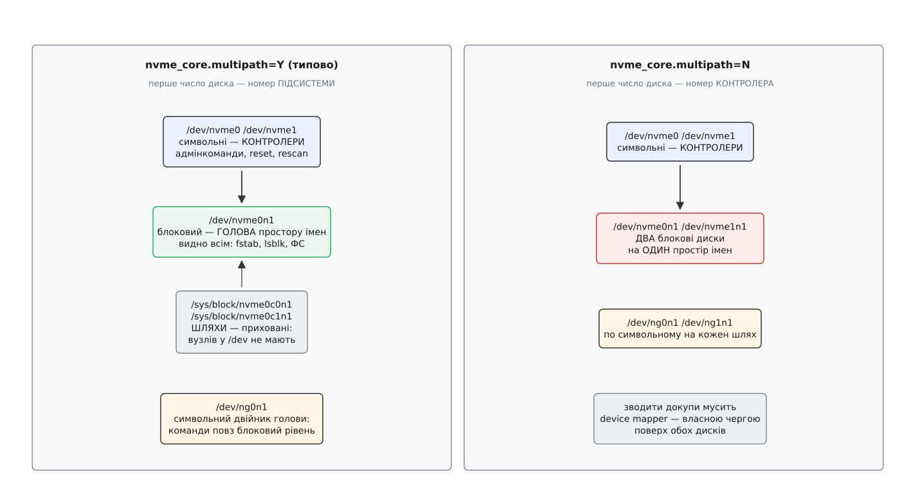

# 📋 NVMe назовні: вузли, sysfs, параметри модулів, `nvme-cli` та `ioctl`

Драйвер NVMe показує себе назовні чотирма способами — вузлами в `/dev`, гілками в `/sys`, параметрами двох модулів і наскрізними `ioctl`; `nvme-cli` поверх них нічого свого не вигадує, а лише складає команди протоколу й віддає їх тим самим `ioctl`. Тут усе це зведено в таблиці: як називається, що означає число в назві, чи пишеться і що зміниться від запису.

## Вузли в `/dev`

| Вузол | Клас | Що це |
|---|---|---|
| `/dev/nvme0` | символьний | **контролер**: адмінкоманди, скидання, повторний обхід просторів імен |
| `/dev/nvme0n1` | блоковий, старший номер 259 | **простір імен**; при ввімкненій багатошляховості — голова, спільна для всіх шляхів |
| `/dev/nvme0n1p1` | блоковий | розділ усередині простору імен — звичайна таблиця розділів, до NVMe стосунку не має |
| `/dev/ng0n1` | символьний | той самий простір імен, але повз блоковий рівень: команди протоколу без черги запитів |
| `nvme0c1n1` | блоковий, **прихований** | окремий шлях до спільного простору імен: видно лише в `/sys/block`, вузла в `/dev` немає, розділів на ньому не шукають |

Числа в назвах виглядають однорідно, а означають різне — і саме тут найлегше помилитися:

- `nvmeX` — порядковий номер **контролера**;
- `nvmeXnY` при ввімкненій багатошляховості: X — номер **підсистеми**, Y — номер простору імен;
- `nvmeXnY` при вимкненій: X — номер **контролера**, тож той самий простір імен з'явиться під двома різними іменами;
- `nvmeXcYnZ` — підсистема X, контролер Y, простір імен Z;
- `ngXnY` — ті самі числа, що й у відповідного блокового вузла.



*Перемикач `nvme_core.multipath` міняє не лише кількість дисків, а й значення першого числа в їхніх іменах.*

Через це будь-яка автоматика чіпляється не за `/dev/nvme*`, а за стійке ім'я від ідентифікатора простору імен: `/dev/disk/by-id/nvme-eui.0025385a71b1c4f2`. Його будує [udev](topic:sys-unix/udev-rules) — служба, що на кожну появу пристрою звіряє подію з правилами й розставляє символьні посилання; ім'я від ідентифікатора не залежить ні від порядку появи контролерів, ні від режиму багатошляховості.

Символьний двійник `ngXnY` існує не для симетрії. Блоковий вузол може з'явитися лише для простору імен, який ядро вміє показати як масив однакових секторів; простір імен із набором команд, що в цю картину не вкладається, блокового вузла не дістане взагалі — а подавати йому команди протоколу однаково треба. Символьний вузол таких обмежень не має: ні черги запитів, ні розділів, ні сторінкового кешу — самі двері до простору імен. Через нього ж подають асинхронні наскрізні команди.

## Гілки sysfs

Драйвер тримає три власні класи плюс звичайний блоковий пристрій ([модель sysfs](topic:sys-unix/sysfs-device-model): ядро показує свої об'єкти каталогами, а поля — текстовими файлами, які читає `cat` і пише `echo`).

| Гілка | Про що |
|---|---|
| `/sys/class/nvme/nvmeX/` | контролер — те, що вміє розмовляти протоколом |
| `/sys/class/nvme-subsystem/nvme-subsysX/` | підсистема — те, що володіє сховищем; усередині символьні посилання на свої контролери |
| `/sys/class/nvme-generic/ngXnY/` | символьний вузол простору імен |
| `/sys/block/nvmeXnY/` | блоковий пристрій простору імен |

**Контролер** — `/sys/class/nvme/nvme0/`:

| Файл | Запис | Що каже |
|---|---|---|
| `model`, `serial`, `firmware_rev` | — | рядки з відповіді Identify Controller |
| `cntlid` | — | номер контролера всередині підсистеми — саме він стоїть після `c` в імені прихованого шляху |
| `cntrltype` | — | `io`, `discovery` або `admin` |
| `subsysnqn` | — | NQN підсистеми, до якої належить цей контролер |
| `transport` | — | `pcie`, `tcp`, `rdma`, `fc`, `loop` |
| `address` | — | адреса на транспорті: для PCIe — `0000:01:00.0`, для TCP — `traddr=…,trsvcid=…` |
| `state` | — | `live`, `resetting`, `connecting`, `deleting` — стан із погляду хоста, а не заліза |
| `queue_count` | — | скільки пар черг створено насправді, разом з адміністративною |
| `numa_node` | — | вузол NUMA, до якого прив'язаний контролер |
| `reset_controller` | **так** | запис `1` перезапускає контролер |
| `rescan_controller` | **так** | запис `1` змушує перечитати перелік просторів імен |
| `delete_controller` | **так** | від'єднати контролер (має сенс на мережевих транспортах) |
| `ctrl_loss_tmo`, `reconnect_delay`, `fast_io_fail_tmo` | **так** | скільки триматися за втрачений контролер і як часто пробувати з'єднатися знову — теж лише для мережевих |

**Підсистема** — `/sys/class/nvme-subsystem/nvme-subsys0/`: `subsysnqn`, `subsystype` (`nvm` або `discovery`), `model`, `serial`, `firmware_rev` і єдиний файл, який тут пишеться, — `iopolicy`.

**Простір імен** — `/sys/block/nvme0n1/`:

| Файл | Що каже |
|---|---|
| `nsid` | номер простору імен у своєму контролері |
| `wwid` | єдиний рядок-ідентифікатор, який ядро вибрало як головний: `eui.…`, `nguid.…` або `uuid.…` |
| `eui`, `nguid`, `uuid` | ті самі ідентифікатори окремо, як їх оголосив пристрій; порожньо, якщо пристрій цього не дає |
| `csi` | набір команд: `0` — звичайний NVM, `2` — зонований |
| `nuse` | скільки логічних блоків справді використано (має сенс для розріджених просторів імен) |
| `ana_grpid`, `ana_state` | група ANA цього простору імен і її стан |
| `queue_depth` | скільки команд просто зараз у польоті цим шляхом — те, за чим вибирає політика `queue-depth` |
| `numa_nodes` | вузли NUMA, з яких цей шлях вважається найближчим |

Коли пристрій не оголосив жодного унікального ідентифікатора, ядро складає `wwid` із того, що має: `nvme.<vid>-<серійний номер>-<модель>-<nsid>`. Таке ім'я вже нічого не гарантує між різними пристроями — і саме воно виказує накопичувач, на якому багатошляховість не запрацює, бо зшивати шляхи не буде за чим.

Поруч лежать дві звичні для будь-якого диска гілки: `queue/` з межами запиту, глибиною й вибором планувальника ([властивості черги](topic:sys-unix/block-device-model/api-queue-attributes.md) — той самий набір файлів, що й у будь-якого блокового пристрою) і `mq/` — по теці на кожну апаратну чергу.

## Параметри модулів

Модулів два, і розділені вони не випадково: `nvme_core` — та частина драйвера, що однакова для будь-якого транспорту, тож її ручки діють і на накопичувачі в роз'ємі, і на підсистемі, до якої ходять мережею; `nvme` — суто PCIe. Значення видно в `/sys/module/<модуль>/parameters/`, задають їх або рядком ядра при завантаженні, або файлом у `/etc/modprobe.d/` ([модулі ядра](topic:sys-unix/kernel-modules): параметр, узятий із рядка ядра, має форму `<модуль>.<параметр>=<значення>`, а у файлі `modprobe.d` — `options <модуль> <параметр>=<значення>`).

`nvme_core`:

| Параметр | Типово | Що робить |
|---|---|---|
| `multipath` | `Y` | вмикає власну багатошляховість. Файл **лише для читання**: змінити можна тільки до завантаження модуля |
| `iopolicy` | `numa` | типова політика вибору шляху для нових підсистем: `numa`, `round-robin`, `queue-depth`. Живу підсистему перемикає її власний файл `iopolicy` |
| `io_timeout` | `30` | секунд, після яких запит вводу-виводу визнають завислим |
| `admin_timeout` | `60` | те саме для адміністративних команд |
| `shutdown_timeout` | `5` | скільки чекати на впорядковане вимкнення контролера |
| `max_retries` | `5` | скільки разів повторювати команду, що повернулася з відновлюваною помилкою |
| `default_ps_max_latency_us` | `100000` | найбільша затримка виходу зі сну, яку дозволено новим пристроям; `0` вимикає економію живлення |
| `force_apst` | `N` | дозволити автоматичні стани живлення навіть на пристроях, яким їх заборонено списком відомих вад |

`nvme` (PCIe):

| Параметр | Типово | Що робить |
|---|---|---|
| `io_queue_depth` | `1024` | глибина черги; приймає від 2 до 4095 |
| `write_queues` | `0` | скільки черг віддати окремо під запис; `0` — читання й записи ділять одні кільця |
| `poll_queues` | `0` | скільки черг зробити без переривань, із чеканням на фазовому біті |
| `sgl_threshold` | `32768` | від якого середнього розміру сегмента вживати списки розсіювання замість списків сторінок; `0` вимикає |
| `use_cmb_sqes` | `Y` | класти черги подань у пам'ять самого контролера, якщо він таку має |
| `max_host_mem_size_mb` | `128` | скільки МіБ оперативної пам'яті віддати контролерові під його власні потреби |
| `use_threaded_interrupts` | `0` | обробляти завершення в потоці, а не в контексті переривання |

Число черг і глибина беруться при ініціалізації контролера, тож запис у ці файли на живій системі діє лише з наступного скидання (`echo 1 > /sys/class/nvme/nvme0/reset_controller`).

## Стани ANA

| Код | Ім'я в ядрі | Рядок у `ana_state` | Що робить драйвер |
|---|---|---|---|
| `0x01` | `NVME_ANA_OPTIMIZED` | `optimized` | перший вибір; лише серед таких шляхів працює політика |
| `0x02` | `NVME_ANA_NONOPTIMIZED` | `non-optimized` | вживає, тільки якщо жодного оптимізованого не лишилося |
| `0x03` | `NVME_ANA_INACCESSIBLE` | `inaccessible` | шляхом не подає нічого |
| `0x04` | `NVME_ANA_PERSISTENT_LOSS` | `persistent-loss` | те саме, але масив каже, що це надовго |
| `0x0f` | `NVME_ANA_CHANGE` | `change` | стан саме зараз міняється; хост перечитує журнал ANA |

## Команди `nvme-cli`

| Команда | Кому адресована | Що дає |
|---|---|---|
| `nvme list` | — | усі простори імен системи однією таблицею |
| `nvme list-subsys` | — | дерево «підсистема → контролери», з транспортом, станом і ANA кожного шляху |
| `nvme id-ctrl /dev/nvme0 -H` | контролеру | Identify Controller у людському вигляді: модель, NQN, `cmic` (чи буває контролерів кілька), `oacs` (які адмінкоманди підтримано) |
| `nvme id-ns /dev/nvme0n1 -H` | простору імен | місткість, чинний формат і весь перелік доступних форматів `LBAF` |
| `nvme list-ns /dev/nvme0 --all` | контролеру | номери просторів імен: і приєднаних, і лише створених |
| `nvme ana-log /dev/nvme0` | контролеру | журнал ANA: групи, їхні стани й перелік просторів імен у кожній |
| `nvme smart-log /dev/nvme0` | контролеру | температура, зношення, лічильники помилок і прочитаних та записаних одиниць |
| `nvme format /dev/nvme0n1 -l 1 -s 1` | простору імен | переформатувати: `-l` — номер формату з `id-ns`, `-s` — стирання (`0` — без нього, `1` — стерти дані, `2` — знищити ключ шифрування) |
| `nvme create-ns /dev/nvme0 -s <блоків> -c <блоків> -f 0 -m 1` | контролеру | створити простір імен: розмір і місткість у **логічних блоках**, `-f` — формат, `-m 1` — зробити його спільним |
| `nvme attach-ns /dev/nvme0 -n 1 -c 0x41` | контролеру | приєднати створений простір імен до контролерів зі списку; без цього кроку його не видно |
| `nvme connect -t tcp -a 10.0.0.1 -s 4420 -n <NQN>` | — | під'єднати мережеву підсистему |
| `nvme disconnect -n <NQN>` | — | від'єднати всі контролери цієї підсистеми |

Дві останні команди мають сенс лише там, де NVMe їздить не по PCIe, а по мережі — [NVMe поверх мереж](topic:sys-unix/nvme-of-model-and-client-connect) додає до протоколу власні команди встановлення зв'язку, а решта набору лишається тією самою. Стирання в `format` — це не перезапис нулями, а те, що робить сам контролер ([стирання й санітизація носія](topic:sf-data/secure-erase-and-sanitize): знищення ключа шифрування прибирає всі копії даних одразу, зокрема ті, до яких хост не має доступу).

## `ioctl`

Усі вони визначені в `<linux/nvme_ioctl.h>` з магічною літерою `'N'` ([інтерфейс ioctl](topic:sys-unix/ioctl-interface) — механізм «команда з довільною структурою в обидва боки», де номер команди кодує ще й напрямок та розмір структури).

| Команда | Номер | Структура | На яких вузлах |
|---|---|---|---|
| `NVME_IOCTL_ID` | `_IO('N', 0x40)` | — | `nvmeXnY`, `ngXnY`; повертає NSID **як значення**, а не через буфер |
| `NVME_IOCTL_ADMIN_CMD` | `_IOWR('N', 0x41)` | `nvme_passthru_cmd` | усі три |
| `NVME_IOCTL_SUBMIT_IO` | `_IOW('N', 0x42)` | `nvme_user_io` | `nvmeXnY`, `ngXnY` — спрощене читання-запис |
| `NVME_IOCTL_IO_CMD` | `_IOWR('N', 0x43)` | `nvme_passthru_cmd` | усі три |
| `NVME_IOCTL_RESET` | `_IO('N', 0x44)` | — | `nvmeX`; потрібен `CAP_SYS_ADMIN` |
| `NVME_IOCTL_SUBSYS_RESET` | `_IO('N', 0x45)` | — | `nvmeX`; потрібен `CAP_SYS_ADMIN` |
| `NVME_IOCTL_RESCAN` | `_IO('N', 0x46)` | — | `nvmeX`; потрібен `CAP_SYS_ADMIN` |
| `NVME_IOCTL_ADMIN64_CMD` | `_IOWR('N', 0x47)` | `nvme_passthru_cmd64` | усі три |
| `NVME_IOCTL_IO64_CMD` | `_IOWR('N', 0x48)` | `nvme_passthru_cmd64` | `nvmeXnY`, `ngXnY` |
| `NVME_IOCTL_IO64_CMD_VEC` | `_IOWR('N', 0x49)` | `nvme_passthru_cmd64` | те саме, але `addr` вказує на масив `iovec` |

Пари 32/64 різняться однією річчю: у старій структурі поле `result` має 32 біти, у новій — 64, бо частина команд повертає повний восьмибайтовий результат. Через `io_uring` ті самі команди подають асинхронно — `NVME_URING_CMD_IO`, `NVME_URING_CMD_ADMIN` і векторні варіанти ([io_uring](topic:sys-unix/io-uring-rings-model): подання й завершення лежать кільцями в спільній із ядром пам'яті, тож команда не коштує системного виклику).

Структура наскрізної команди — це просто ті самі 64 байти протоколу, розкладені по полях, плюс адреса буфера з боку хоста:

```c
struct nvme_passthru_cmd {
    __u8  opcode, flags;  __u16 rsvd1;
    __u32 nsid, cdw2, cdw3;
    __u64 metadata, addr;            /* вказівники простору користувача */
    __u32 metadata_len, data_len;
    __u32 cdw10, cdw11, cdw12, cdw13, cdw14, cdw15;
    __u32 timeout_ms;
    __u32 result;                    /* заповнює ядро */
};
```

Права на це не «все або нічого»: без `CAP_SYS_ADMIN` ядро пропускає лише команди без побічних дій, а вендорські, мережеві та все, що змінює стан пристрою, відхиляє ([можливості процесу](topic:sys-unix/capabilities) — права root розібрані на окремі дозволи, і саме `CAP_SYS_ADMIN` тут за головного).

**Мінімальний виклик: узяти сторінку журналу SMART.** Get Log Page має код операції `0x02`; ідентифікатор потрібного журналу й розмір буфера їдуть у `cdw10`, причому розмір — у чотирибайтових словах **мінус одиниця**. У SMART ідентифікатор журналу теж `0x02` — збіг, який легко сплутати з кодом операції:

```
NUMDL = 512 / 4 − 1 = 127
cdw10 = (127 << 16) | 0x02 = 0x007F0002
```

```c
#include <fcntl.h>
#include <stdint.h>
#include <stdio.h>
#include <sys/ioctl.h>
#include <linux/nvme_ioctl.h>

int main(void) {
    uint8_t log[512];
    struct nvme_passthru_cmd cmd = {
        .opcode     = 0x02,                 /* Get Log Page          */
        .nsid       = 0xffffffff,           /* журнал усього контролера */
        .addr       = (uint64_t)(uintptr_t)log,
        .data_len   = sizeof log,
        .cdw10      = (127u << 16) | 0x02,  /* NUMDL = 127, LID = 0x02 */
        .timeout_ms = 5000,
    };

    int fd = open("/dev/nvme0", O_RDONLY);
    if (fd < 0) return 1;

    int rc = ioctl(fd, NVME_IOCTL_ADMIN_CMD, &cmd);
    if (rc < 0)  return 2;              /* виклик не дійшов: дивись errno    */
    if (rc > 0)  return 3;              /* дійшов, але контролер відмовив:   */
                                        /* rc — це статус із черги завершень */

    printf("температура %u K, зношення %u %%\n",
           (unsigned)(log[1] | (log[2] << 8)), log[5]);
    return 0;
}
```

Три різні результати одного виклику розрізняти обов'язково: `-1` означає, що команда не дійшла до пристрою (причина в `errno`), нуль — що дійшла й виконалася, а додатне число — що дійшла, і пристрій її відхилив; саме це число є кодом статусу з комірки завершення. Найчастіша помилка тут — перевірити лише `< 0`: тоді відмова контролера виглядає як успіх, а програма розбирає буфер, у якому нічого немає.
