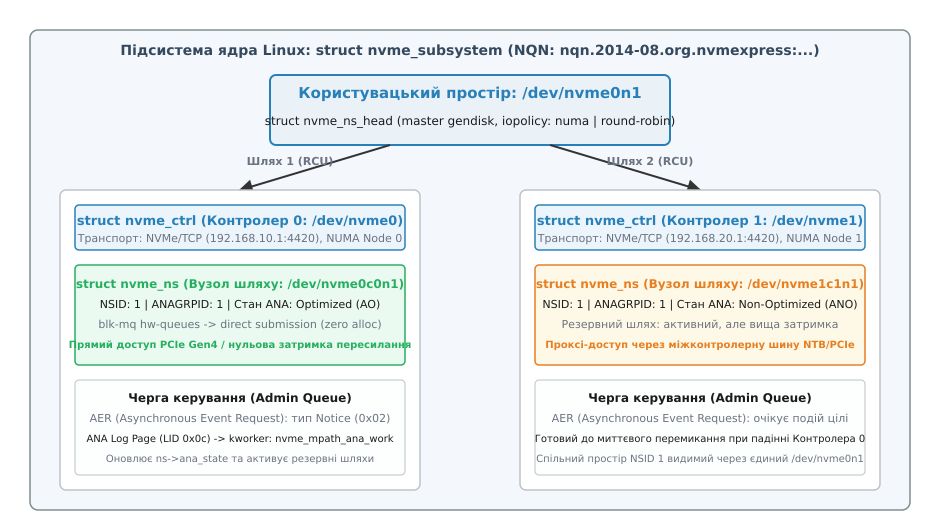
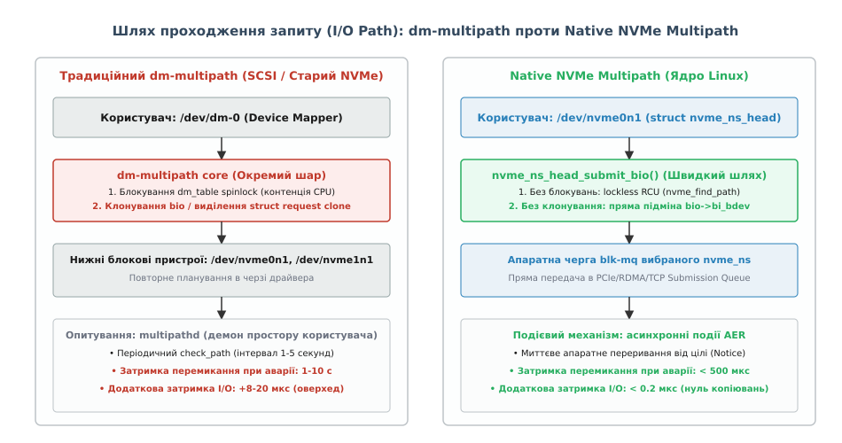
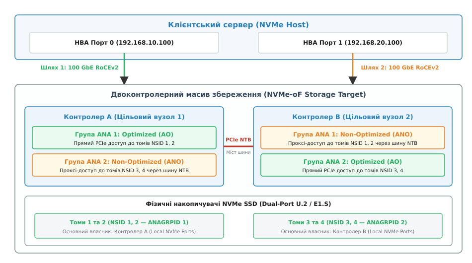
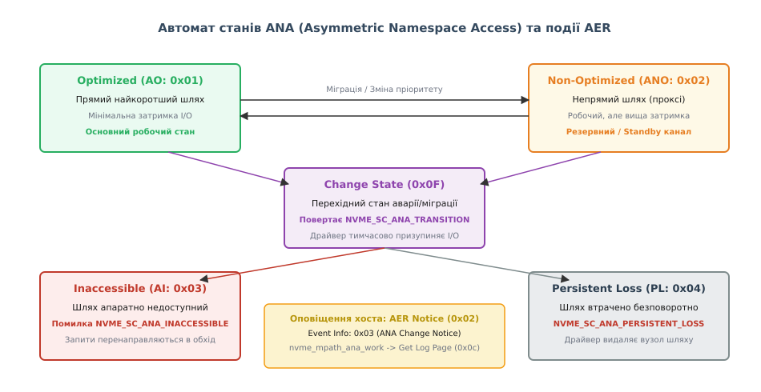

# Нативний мультипасинг NVMe та стани ANA у ядрі Linux

<preknowlist>
- [NVMe у Linux: черги SQ/CQ, механізм Doorbell та модель блокового пристрою](root:sys-unix/nvme-in-linux) — архітектура черг відправки та завершення (SQ/CQ), прямий доступ до пам'яті (DMA) та регістри сповіщення Doorbell.
- [Мережевий доступ до блочних пристроїв NVMe over Fabrics (RDMA/TCP)](root:sys-unix/nvme-of-fabrics-deployment-security-and-offload) — протокол мережевого транспортування командних капсул NVMe через стек RDMA (RoCEv2/InfiniBand) та TCP/IP.
- [ALUA: асиметричний доступ і стани портів цілі](root:sys-unix/scsi-alua) — класична модель асиметричного доступу SCSI (SPC-3/4), цільові групи портів та механізм команд RTPG/STPG.
- [Multipath: кілька шляхів до одного сховища](root:sys-unix/dm-multipath) — підсистема Device Mapper Multipath, віртуальні пристрої `/dev/dm-X`, черги повтору та демон простору користувача `multipathd`.
- [Блоковий пристрій: сектори, блоки й черга запитів](root:sys-unix/block-device-model) — життєвий цикл структури `struct bio`, багаторівнева черга `blk-mq`, планування та адресація LBA.
- [Механізм RCU: читання без блокувань та безпечне звільнення пам'яті](root:sys-unix/rcu-read-copy-update) — блокування Read-Copy-Update, критичні секції `rcu_read_lock()` та атомарне оновлення вказівників у ядрі.
</preknowlist>

## Двоконтролерний масив і криза затримок Device Mapper

Високонавантажений кластер баз даних підключено двома оптичними інтерфейсами 100 GbE RoCEv2 до корпоративного дискового масиву All-Flash NVMe over Fabrics. Масив містить два незалежні процесорні вузли (Контролер A та Контролер B), які одночасно виставляють у мережеву фабрику логічний том NVMe обсягом 10 ТБ. З погляду операційної системи Linux на хості з'являються два мережеві контролери — `/dev/nvme0` та `/dev/nvme1`, кожен з яких надає доступ до одного й того самого простору назв (Namespace 1).

Для забезпечення відмовостійкості системний адміністратор налаштовує традиційну підсистему багатошляховості `dm-multipath`, об'єднуючи вузли `/dev/nvme0n1` та `/dev/nvme1n1` у віртуальний блоковий пристрій `/dev/dm-0`. Навантажувальне тестування випадкового читання блоками по 4 КБ демонструє парадоксальний результат:
- При прямому зверненні до окремого вузла `/dev/nvme0n1` накопичувач видає 1.2 мільйона операцій введення-виведення на секунду (IOPS) із середньою затримкою 18 мікросекунд, споживаючи близько 8% процесорного часу одного ядра.
- Під час роботи через шар `dm-multipath` сумарна продуктивність падає до 450 тисяч IOPS, середня затримка зростає до 42 мікросекунд (понад 130% додаткових накладних витрат), а 64-ядерний сервер демонструє 100% завантаження кількох ядер у стані очікування блокувань ядра (*kernel spinlock contention*).
- При штучному вимиканні оптичного порту Контролера A передача даних повністю зависає на 4–8 секунд, доки фоновий демон простору користувача `multipathd` не виявить обрив лінку через черговий інтервал синхронного опитування.

Причина цієї кризи криється в архітектурній невідповідності. Механізм `dm-multipath` створювався для повільних жорстких дисків та протоколу SCSI, де час доступу вимірювався мілісекундами, а операційна система могла дозволити собі витрачати десятки мікросекунд на клонування структур `struct bio`, виділення додаткових `struct request` із пулу пам'яті та захоплення глобальних блокувань таблиці відображення `dm_table`. Для надшвидких накопичувачів NVMe, де апаратна затримка становить менше 10 мікросекунд, накладні витрати Device Mapper перетворюються на головне вузьке місце системи.



*Ієрархія структур ядра Linux: підсистема nvme_subsystem об'єднує контролери через спільний master gendisk nvme_ns_head, маршутизуючи bio безпосередньо в черги blk-mq вибраного nvme_ns.*

Щоб подолати це обмеження, у драйвер ядра Linux було інтегровано підсистему **нативного мультипасингу NVMe** (`CONFIG_NVME_MULTIPATH`, параметр завантаження `nvme_core.multipath=Y`), а робоча група NVM Express розробила апаратний стандарт **Asymmetric Namespace Access (ANA)** (від грецького *ἀ-*, «не» + *συμметрія*, «співмірність»). Цей механізм виключає шар Device Mapper, переносить маршрутизацію запитів безпосередньо у внутрішні черги `blk-mq` драйвера NVMe та забезпечує перемикання каналів за частки мілісекунди на основі асинхронних апаратних переривань.

Детальний перебіг дискусій в інженерній спільноті щодо відмови від Device Mapper викладено в історичному нарисі [еволюція від Device Mapper до нативного мультипасингу NVMe](root:sys-unix/nvme-native-multipath-ana/hist-from-dm-to-nvme-multipath.md).

---

## Архітектура та об'єктна модель ядра Linux

Нативний мультипасинг NVMe будується навколо природної ієрархії об'єктів специфікації NVM Express, представлених у ядрі структурами підсистеми `drivers/nvme/host/`:

```
+──────────────────────────────────────────────────────────────────────────+
|           ОБ'ЄКТНА МОДЕЛЬ НА ТИВНОГО МУЛЬТИПАСИНГУ NVMe У ЯДРІ          |
+──────────────────────────────────────────────────────────────────────────+
| struct nvme_subsystem                                                    |
| ├── subsysnqn (NQN підсистеми, наприклад: nqn.2014-08.org.nvmexpress:...) |
| ├── lock (м'ютекс синхронізації списків контролерів і просторів назв)    |
| ├── ctrl_list (список усіх підключених контролерів struct nvme_ctrl)    |
| └── nsheads (список спільних логічних голів struct nvme_ns_head)         |
|     │                                                                    |
|     └── struct nvme_ns_head (представляє /dev/nvme0n1)                   |
|         ├── disk (головний екземпляр struct gendisk, видимий у системі)   |
|         ├── list (список фізичних шляхів struct nvme_ns через різні ctrl)|
|         ├── current_path[] (масив активних шляхів для NUMA-вузлів)       |
|         ├── iopolicy (політика вибору шляху: NUMA, Round-Robin)          |
|         └── requeue_list (черга запитів для повторного надсилання)       |
|             │                                                            |
|             ├── struct nvme_ns (Шлях 1 через Контролер 0: nvme0c0n1)     |
|             │   ├── ctrl -> вказівник на struct nvme_ctrl (/dev/nvme0)   |
|             │   ├── queue -> апаратний tagset черг blk-mq                |
|             │   ├── anagrpid = 1 (група ANA)                             |
|             │   └── ana_state = NVME_ANA_OPTIMIZED (прямий доступ)       |
|             │                                                            |
|             └── struct nvme_ns (Шлях 2 через Контролер 1: nvme0c1n1)     |
|                 ├── ctrl -> вказівник на struct nvme_ctrl (/dev/nvme1)   |
|                 ├── queue -> апаратний tagset черг blk-mq                |
|                 ├── anagrpid = 1 (група ANA)                             |
|                 └── ana_state = NVME_ANA_NONOPTIMIZED (проксі-доступ)    |
+──────────────────────────────────────────────────────────────────────────+
```

### Призначення та життєвий цикл ключових структур

1. **`struct nvme_subsystem` (Підсистема NVMe):** об'єднує всі контролери, що належать до одного фізичного або віртуального сховища. Ідентифікується унікальним рядком NQN (*NVMe Qualified Name*). Підсистема створюється в пам'яті ядра під час встановлення першого з'єднання і захищається внутрішнім лічильником посилань `kref`. Коли підключається новий контролер, ядро перевіряє його NQN; якщо підсистема з таким ім'ям уже існує, новий контролер додається до її списку `ctrl_list`.
2. **`struct nvme_ctrl` (Контролер NVMe):** представляє окремий транспортний канал до масиву (з'єднання PCIe, сокет TCP або пару черг RDMA QP). Кожен контролер має власну чергу адміністративних команд (Admin Queue), власний набір апаратних черг введення-виведення (`blk-mq tagset`) та реєструється як символьний пристрій `/dev/nvme0`, `/dev/nvme1`. Контролер відповідає за обробку низькорівневих помилок лінку та надсилання команд Keep-Alive (`kato`).
3. **`struct nvme_ns_head` (Логічна голова простору назв):** створюється один раз для кожного унікального логічного тому в межах підсистеми на основі його глобального ідентифікатора NGUID (*Namespace Globally Unique Identifier*) або EUI-64. Саме `nvme_ns_head` володіє екземпляром `struct gendisk`, який експортується у простір користувача як стандартний блоковий пристрій `/dev/nvme0n1`. Голова не має власних черг обробки — вона слугує легковагим комутатором вхідних запитів. Вона містить масив `current_path[]` для кешування вибраного шляху для кожного NUMA-сокета.
4. **`struct nvme_ns` (Фізичний шлях до простору назв):** екземпляр простору назв, прив'язаний до конкретного контролера. Якщо том доступний через чотири незалежні мережеві порти, ядро створить чотири структури `struct nvme_ns`, пов'язані двозв'язним списком `head->list`. Кожен `nvme_ns` містить поточний стан групи `ana_state` та номер групи `anagrpid`.

### Топологія імен пристроїв у devfs

Коли нативний мультипасинг увімкнено (`multipath=Y`):
- Додаткам та файловим системам надається єдиний стабільний блоковий вузол `/dev/nvmeXn1` (де `X` — індекс підсистеми `subsystem instance`).
- Окремі шляхи через конкретні контролери приховуються від автоматичного монтування або відображаються як спеціальні вузли контролерів вигляду `/dev/nvme0c0n1` (контролер 0, підсистема 0, простір назв 1) та `/dev/nvme1c0n1` (контролер 1, підсистема 0, простір назв 1).
- Адміністративні утиліти керування працюють із символьними пристроями контролерів `/dev/nvme0` та `/dev/nvme1`.

Якщо мультипасинг вимкнено (`multipath=N`), ядро створює незалежні блокові пристрої `/dev/nvme0n1` та `/dev/nvme1n1` для кожного з'єднання, змушуючи адміністратора вручну налаштовувати `dm-multipath`.

---

## Швидкісна маршрутизація вводу-виводу без виділення пам'яті

Головна перевага нативного мультипасингу NVMe над Device Mapper полягає в принциповій відмові від клонування блокових запитів на шляху виконання введення-виведення (*I/O fast path*).



*Порівняння стеку: dm-multipath вимагає виділення пам'яті, клонування bio і блокувань dm_table, тоді як Native NVMe Multipath виконує lockless RCU підміну bio->bi_bdev безпосередньо в чергу blk-mq.*

### Алгоритм функції `nvme_ns_head_submit_bio()`

Коли верхній шар ядра (файлова система або додаток через Direct I/O) надсилає запит `struct bio` на пристрій `/dev/nvme0n1`, керування передається функції драйвера `nvme_ns_head_submit_bio()`:

```c
/* Спрощена логіка швидкого шляху маршрутизації у ядрі Linux */
blk_qc_t nvme_ns_head_submit_bio(struct bio *bio)
{
    struct nvme_ns_head *head = bio->bi_bdev->bd_disk->private_data;
    struct nvme_ns *ns;
    
    /* 1. Критична секція RCU: пошук працездатного шляху без блокувань */
    rcu_read_lock();
    ns = nvme_find_path(head);
    if (likely(ns)) {
        /* 2. Підміна цільового пристрою безпосередньо у вхідному bio */
        bio_set_dev(bio, ns->disk->part0);
        bio->bi_opf |= REQ_NVME_MPATH;
        rcu_read_unlock();
        
        /* 3. Пряме передавання запиту в апаратну чергу вибраного контролера */
        return submit_bio_noacache(bio);
    }
    rcu_read_unlock();
    
    /* 4. Якщо всі шляхи недоступні — запит ставиться у чергу повтору */
    return nvme_mpath_requeue_bio(head, bio);
}
```

Послідовність операцій на швидкому шляху:
1. **Безблокувальний вибір шляху (Lockless RCU):** функція відкриває секцію `rcu_read_lock()`. Пошук активного контролера у функції `nvme_find_path()` переглядає вказівники на `struct nvme_ns` без захоплення м'ютексів чи спінлоків, гарантуючи нульову конкуренцію між процесорними ядрами.
2. **Підміна вказівника на блоковий пристрій:** адреса цільового диска вхідної структури `bio->bi_bdev` атомарно замінюється на `ns->disk->part0` обраного фізичного шляху.
3. **Нульове виділення пам'яті (Zero Memory Allocation):** на відміну від `dm-multipath`, драйвер не викликає `kmalloc()` або `mempool_alloc()`, не створює копій списків сторінок пам'яті (*bio vectors*) і не ініціалізує проміжних структур.
4. **Пряме потрапляння в чергу `blk-mq`:** виклик `submit_bio_noacache()` негайно спрямовує модифікований `bio` в чергу відправки (Submission Queue) конкретного контролера, де запит отримує апаратний тег безпосередньо з per-CPU кешу.

### Логіка перевірки працездатності шляху у `nvme_find_path()`

Функція `nvme_find_path()` не просто зчитує вказівник зі списку, а виконує багаторівневу валідацію стану фізичного контролера через допоміжну функцію `nvme_path_is_disabled()`:

```c
/* Критерії виключення шляху з активної маршрутизації */
static bool nvme_path_is_disabled(struct nvme_ns *ns)
{
    /* 1. Контролер має перебувати у стані LIVE */
    if (ns->ctrl->state != NVME_CTRL_LIVE)
        return true;
        
    /* 2. Стан ANA не повинен бути Inaccessible або Persistent Loss */
    if (ns->ana_state == NVME_ANA_INACCESSIBLE ||
        ns->ana_state == NVME_ANA_PERSISTENT_LOSS)
        return true;
        
    /* 3. Перевірка, чи не заморожено чергу введення-виведення */
    if (test_bit(NVME_NS_REMOVING, &ns->flags))
        return true;
        
    return false;
}
```

Якщо для певного контролера `nvme_path_is_disabled()` повертає `true`, драйвер негайно виключає його з циклу вибору, не намагаючись надіслати `bio`, що усуває затримки на очікування тайм-аутів апаратного рівня.

### Механізм апаратної відправки команд у черги blk-mq

Після того як `bio` було перенаправлено до обраного `struct nvme_ns`, підсистема `blk-mq` упаковує його у внутрішній запит `struct request`. Функція драйвера `nvme_queue_rq()` будує 64-байтний елемент черги відправки (Submission Queue Entry, SQE):
- Команді призначається унікальний 16-бітний ідентифікатор `command_id`, що відповідає індексу виділеного тегу в апаратному наборі тегів (`tagset`).
- Поля LBA (початковий сектор) та розмір блоку записуються в командні слова `cdw10` та `cdw11`.
- Списки фізичних сторінок пам'яті перетворюються на дескриптори SGL (*Scatter Gather List*) для транспорту NVMe-oF (RDMA або TCP) або PRPs (*Physical Region Pages*) для локальної шини PCIe.
- Драйвер записує новий індекс у регістр сповіщення Doorbell контролера (або надсилає пакет капсули команди через мережевий сокет), завершуючи цикл надсилання менш ніж за 200 наносекунд процесорного часу.

### Обробка збоїв і прозорий повтор (Failover Requeue)

Якщо під час виконання запиту на фізичному контролері виникає апаратна помилка (наприклад, обрив кабелю або відхилення команди цільовим масивом через зміну стану), завершення запиту перехоплюється функцією `nvme_complete_rq()`:

1. Драйвер перевіряє статус відповіді. Якщо повертається один із кодів асиметричного доступу (`NVME_SC_ANA_INACCESSIBLE`, `NVME_SC_ANA_TRANSITION`, `NVME_SC_ANA_PERSISTENT_LOSS`) або транспортна помилка `NVME_SC_HOST_PATH_ERROR`:
2. Команда **не завершується помилкою** для простору користувача (`-EIO` не повертається).
3. Функція `nvme_failover_req()` вилучає `bio` з черги контролера, що зазнав збою, очищає кешований вказівник `head->current_path` для цього вузла NUMA та переміщує запит у список `head->requeue_list`.
4. Драйвер ініціює позачергове оновлення карти станів через чергу задач ядра `kworker` і негайно повторно надсилає накопичені запити через альтернативний працездатний контролер.

---

## Специфікація Asymmetric Namespace Access (ANA)

У двоконтролерних дискових масивах обидва керуючі процесори з'єднані з кошиками накопичувачів NVMe, проте внутрішній стан кешування та володіння метаданими розділено між контролерами.



*Двоконтролерний масив: томи NSID 1, 2 належать Контролеру A (Optimized), а для Контролера B є Non-Optimized (проксі через шину NTB). Для томів NSID 3, 4 ситуація дзеркальна.*

Коли запит надходить на контролер, який є прямим власником тому (Контролер A для Namespace 1), він записується в локальний енергонезалежний кеш і надсилається до накопичувачів через прямі лінії PCIe. Цей шлях забезпечує мінімальну затримку (близько 10–15 мкс).

Якщо той самий запит надходить на партнерський вузол (Контролер B), процесор не може модифікувати том напряму. Він змушений інкапсулювати команду у внутрішній транспортний пакет, передати її через міжконтролерну шину (міст PCIe NTB або інтерфейс CMI) на Контролер A, дочекатися завершення операції та повернути відповідь клієнту. Такий **проксі-доступ** збільшує затримку до 35–80 мкс і споживає пропускну здатність внутрішньої шини масиву.

Протокол Asymmetric Namespace Access стандартизує мову, за допомогою якої масив повідомляє хосту, які контролери забезпечують прямий доступ, а які — проксі-доступ.

### Групи ANA (ANA Groups)

Корпоративний дисковий масив може містити тисячі окремих просторів назв (LUN/Namespace). Окремий опис стану для кожного з них створював би величезні накладні витрати на передачу службових журналів.

Специфікація NVMe вводить поняття **групи ANA** (`ANAGRPID`):
- Група об'єднує множину просторів назв, які мають однакові характеристики доступності та спільно перемикаються між контролерами в разі аварії.
- Кожен простір назв у структурі `Identify Namespace` (байти `3844:3847`) містить 32-бітне поле `ANAGRPID`.
- Цільовий масив транслює зміну стану цілої групи однією атомарною операцією, що зменшує розмір журналу стану в тисячі разів.



*Автомат станів ANA: переходи між Optimized, Non-Optimized, Change State та Inaccessible, що супроводжуються сповіщеннями AER Notice.*

### П'ять фундаментальних станів ANA

Специфікація NVM Express визначає п'ять станів групи ANA:

```
+──────────────────────────────────────────────────────────────────────────+
|                        СТАНИ ДОСТУПНОСТІ ГРУПИ ANA                       |
+──────────────────────────────────────────────────────────────────────────+
| 1. ANA Optimized (AO) — Код 0x01:                                        |
|    Прямий, найкоротший шлях до флешпам'яті. Мінімальна затримка I/O,      |
|    максимальна пропускна здатність. Хост спрямовує сюди всі основні I/O. |
+──────────────────────────────────────────────────────────────────────────+
| 2. ANA Non-Optimized (ANO) — Код 0x02:                                   |
|    Непрямий шлях (проксі через міжконтролерну шину NTB). Працездатний,   |
|    але має підвищену затримку. Використовується як гарячий резерв.       |
+──────────────────────────────────────────────────────────────────────────+
| 3. ANA Inaccessible (AI) — Код 0x03:                                     |
|    Контролер втратив зв'язок із носієм даних (обрив внутрішнього каналу, |
|    перезавантаження ноди). Команди повертають NVME_SC_ANA_INACCESSIBLE.  |
+──────────────────────────────────────────────────────────────────────────+
| 4. ANA Persistent Loss (PL) — Код 0x04:                                  |
|    Шлях втрачено назавжди (демонтаж полиці, конфігураційне видалення).   |
|    Команди повертають NVME_SC_ANA_PERSISTENT_LOSS. Ядро видаляє вузол.   |
+──────────────────────────────────────────────────────────────────────────+
| 5. ANA Change State — Код 0x0F:                                          |
|    Перехідний стан під час аварійного перемикання або міграції тому.     |
|    Команди повертають NVME_SC_ANA_TRANSITION. Ядро призупиняє чергу.     |
+──────────────────────────────────────────────────────────────────────────+
```

### Динаміка переходу та захист цілісності даних

Під час аварії основного контролера дисковий масив виконує багатоетапну процедуру переходу:
1. **Ізоляція вузла (Fencing):** масив застосовує механізм NVMe Reservations (`NVME_PR_RESERVE`) для відсікання аварійного контролера від доступу до накопичувачів.
2. **Переведення у стан Change State:** на обох портах стан відповідної групи `ANAGRPID` перемикається у `0x0F` (*Change State*). Якщо клієнтський хост надсилає команду в цей момент, вона повертається зі статусом `NVME_SC_ANA_TRANSITION`. Драйвер ядра Linux тимчасово блокує відправку нових запитів, запобігаючи пошкодженню метаданих файлової системи.
3. **Оновлення кешів та завершення міграції:** резервний вузол (Контролер B) ініціалізує журнали транзакцій, переводить групу у стан `0x01` (*Optimized*) та генерує переривання AER Notice.
4. **Розблокування черг хоста:** драйвер ядра Linux зчитує новий журнал, оновлює таблиці маршрутизації та миттєво відновлює передачу даних без генерації жодної помилки у простір додатків.

---

## Подієва синхронізація: AER та журнал ANA Log Page

На відміну від підсистеми SCSI, яка змушена періодично опитувати стан цільових портів за допомогою синхронних команд `RTPG` (*Report Target Port Groups*), протокол NVMe базується на суто подійній моделі **Asynchronous Event Request (AER)**.

### Механізм асинхронного сповіщення

1. **Попереднє зведення черги (Arming):** під час ініціалізації контролера драйвер ядра Linux надсилає в чергу керування кілька команд `NVME_ADMIN_ASYNC_EVENT`. Контролер масиву не відповідає на них одразу, а тримає їх у спеціальному списку очікування подій.
2. **Виникнення події на масиві:** коли на цільовому вузлі змінюється стан маршрутизації (наприклад, Контролер A виходить з ладу і томи групи 1 переходять на Контролер B у стан Optimized), масив негайно завершує одну з команд AER:
   - Тип події (*Event Type*): `0x02` (Notice — повідомлення про зміну конфігурації).
   - Інформація про подію (*Event Information*): `0x03` (*Asymmetric Namespace Access Change Notice*).
   - Ідентифікатор журналу (*Log Page Identifier*): `0x0C` (ANA Log Page).
3. **Обробка переривання хостом:** отримавши переривання черги завершення AER, функція `nvme_handle_aen_notice()` планує виконання відкладеної задачі `nvme_mpath_ana_work()` у системному потоці `kworker`.
4. **Зчитування журналу ANA:** драйвер надсилає адміністративну команду `Get Log Page` (LID `0x0C`) для отримання оновленої двійкової карти станів.

### Структура журналу ANA Log Page (LID 0x0C)

Журнал починається з 16-байтного заголовка:

```c
struct nvme_ana_log {
    __le64  chgcnt;     /* 64-бітний глобальний лічильник змін масиву */
    __le16  ngrps;      /* Кількість дескрипторів груп у журналі */
    __u8    rsvd10[6];  /* Зарезервовано */
};
```

Безпосередньо за заголовком слідує масив дескрипторів змінної довжини `struct nvme_ana_group_desc`:

```c
struct nvme_ana_group_desc {
    __le32  grpid;      /* Номер групи ANAGRPID */
    __le32  nnsids;     /* Кількість просторів назв у цій групі */
    __le64  chgcnt;     /* Локальний лічильник змін групи */
    __u8    state;      /* Стан: 0x01 (AO), 0x02 (ANO), 0x03 (AI), 0x04 (PL), 0x0F (Change) */
    __u8    rsvd17[15]; /* Зарезервовано */
    __le32  nsids[];    /* Масив ідентифікаторів NSID розміром nnsids * 4 байти */
};
```

Глобальний лічильник `chgcnt` дозволяє драйверу ядра атомарно перевірити, чи не змінилася топологія масиву під час зчитування журналу частинами, якщо розмір даних перевищував максимальний розмір блоку передавання (MDTS).

Повний довідник двійкових зміщень полів, структур системних викликів `ioctl` та параметрів модуля зібрано у довіднику [специфікація двійкових дескрипторів журналу ANA та інтерфейси sysfs](root:sys-unix/nvme-native-multipath-ana/api-ana-log-and-sysfs.md).

Практичну реалізацію утиліти зчитування та розбору журналу ANA мовами C та C++ наведено у практикумі [розробка власного парсера журналу ANA через ioctl](root:sys-unix/nvme-native-multipath-ana/proj-ana-log-parser.md).

---

## Внутрішня реалізація оновлення станів: `nvme_mpath_update_group()`

Коли системний потік `kworker` отримує завантажений буфер журналу ANA, ядро викликає функцію `nvme_mpath_update_group()` для кожного дескриптора.

Цей процес реалізує таку послідовність дій:
1. **Пошук просторів назв:** функція перебирає масив ідентифікаторів `nsids[]` дескриптора та знаходить відповідні структури `struct nvme_ns` у списку контролера.
2. **Атомарне оновлення поля стану:** значення `ns->ana_state` оновлюється під захистом блокування `head->lock` або механізму RCU.
3. **Очищення кешу активних шляхів:** якщо попередній оптимізований шлях перейшов у стан `Inaccessible` або `Change State`, ядро скидає покажчики `head->current_path[node] = NULL` для всіх вузлів NUMA, що змушує наступний виклик `nvme_find_path()` негайно обрати новий активний контролер.
4. **Пробудження черг (Unquiesce):** якщо стан групи стабілізувався (перейшов у `Optimized` або `Non-Optimized`), функція викликає `blk_mq_unquiesce_queue()`, розблоковуючи очікуючі запити, та запускає спорожнення черги повтору `head->requeue_list`.

---

## Політики вибору шляху (`iopolicy`) та взаємодія з NUMA

Коли простір назв доступний через кілька працездатних контролерів, драйвер ядра повинен обрати конкретний шлях для кожного вхідного запиту. Поведінка вибору визначається параметром `iopolicy`, який можна налаштовувати як глобально для модуля ядра, так і індивідуально для кожної підсистеми через `sysfs`:

```bash
# Перегляд поточної політики для підсистеми 0
cat /sys/class/nvme-subsystem/nvme-subsys0/iopolicy

# Зміна політики наживо на round-robin
echo "round-robin" > /sys/class/nvme-subsystem/nvme-subsys0/iopolicy
```

### 1. Політика `numa` (За замовчуванням)

Сучасні багатопроцесорні сервери мають асиметричну архітектуру оперативної пам'яті (NUMA — *Non-Uniform Memory Access*). Мережеві адаптери PCIe (HBA) фізично підключені до ліній PCIe конкретного процесорного сокета (NUMA Node 0 або NUMA Node 1). Якщо потік виконання, що працює на ядрі Socket 1, надсилає команду введення-виведення через адаптер, підключений до Socket 0, кожен пакет змушений перетинати повільну міжсокетну шину зв'язку (Intel UPI або AMD Infinity Fabric), збільшуючи затримку доступу на 2–5 мкс та навантажуючи шину пам'яті.

Політика `numa` мінімізує міжсокетний трафік:
1. Під час надсилання `bio` драйвер визначає номер поточного процесорного вузла через виклик `cpu_to_node(smp_processor_id())`.
2. Драйвер шукає контролер у стані `NVME_ANA_OPTIMIZED`, фізичний пристрій якого (`ctrl->dev`) прив'язано до того самого вузла NUMA (`ctrl->numa_node == current_numa_node`).
3. Якщо локальний оптимізований шлях знайдено, запит спрямовується через нього.
4. Якщо локальний оптимізований шлях відсутній, запит надсилається на будь-який доступний віддалений оптимізований шлях.
5. Якщо всі оптимізовані шляхи недоступні, драйвер повторює процедуру для шляхів у стані `NVME_ANA_NONOPTIMIZED`.

### 2. Політика `round-robin` (Круговий перебір)

Політика `round-robin` рівномірно розподіляє навантаження між усіма контролерами, які перебувають у стані `NVME_ANA_OPTIMIZED`:
- Драйвер використовує атомарний лічильник `atomic_inc_return(&head->rr_index)`.
- Кожен наступний запит послідовно передається до наступного за списком оптимізованого шляху.
- Ця політика є ідеальною для агрегації пропускної здатності, коли один хост оснащено кількома однаковими мережевими картами 100 GbE, підключеними до різних комутаторів фабрики, і необхідно утилізувати сумарну смугу пропускання всіх лінків.

### 3. Політика `queue-depth` (За глибиною черги)

У новіших версіях ядра Linux (починаючи з версії 5.17) додано динамічну політику `queue-depth`:
- Драйвер відстежує кількість незавершених запитів у польоті (*inflight requests*) для кожної черги `blk-mq`.
- Новий запит спрямовується до того оптимізованого контролера, який має найменшу поточну чергу.
- Це запобігає перекосам навантаження, коли один із мережевих портів зазнає тимчасових затримок через втрату пакетів або перевантаження комутатора.

---

## Діагностика та трасування нативного мультипасингу у ядрі

Для системного моніторингу та діагностики роботи нативного мультипасингу ядро Linux надає багатий інструментарій трасування та налагодження.

### 1. Трасування через ftrace та tracepoints ядра

Підсистема NVMe містить набір вбудованих точок трасування в каталозі `/sys/kernel/debug/tracing/events/nvme/`:
- `nvme_ana_state`: фіксує переходи станів для кожної групи ANA.
- `nvme_sq`: фіксує надсилання запитів у черги конкретних контролерів.
- `nvme_req_completion`: фіксує статус завершення та час виконання кожного запиту.

Приклад увімкнення трасування подій ANA наживо:

```bash
# Увімкнення запису подій зміни станів ANA
echo 1 > /sys/kernel/debug/tracing/events/nvme/nvme_ana_state/enable

# Перегляд журналу подій у реальному часі
cat /sys/kernel/debug/tracing/trace_pipe
```

Зразок виводу трасування під час аварійного перемикання:

```
kworker/u128:2-1420  [004] ....  1842.105421: nvme_ana_state: subsys0: ctrl1, grpid 1, state non-optimized -> optimized, chgcnt 42
kworker/u128:2-1420  [004] ....  1842.105435: nvme_ana_state: subsys0: ctrl0, grpid 1, state optimized -> inaccessible, chgcnt 42
```

### 2. Діагностика топології через утиліту `nvme-cli`

Пакет `nvme-cli` надає спеціалізовані команди для огляду зв'язків між підсистемами, контролерами та логічними просторами назв:

```bash
# Вивід повної топології підсистем та шляхів
nvme list-subsys

# Вивід карти станів груп ANA для контролера
nvme ana-log /dev/nvme0
```

Приклад виводу `nvme list-subsys`:

```
nvme-subsys0 - NQN=nqn.2014-08.org.nvmexpress:uuid:4a2f8c12-9b34-4a5e-8b1a-9c7f2e1a3b4c
\
 +- nvme0 tcp traddr=192.168.10.1,trsvcid=4420 live (Optimized)
 +- nvme1 tcp traddr=192.168.20.1,trsvcid=4420 live (Non-Optimized)
```

---

## Взаємодія з кластерними резервуваннями NVMe Reservations

У високодоступних кластерах (наприклад, Red Hat Pacemaker, Oracle RAC або Kubernetes CSI) критично важливо гарантувати монопольний доступ одного вузла до спільного дискового тому для запобігання пошкодженню файлової системи (*Split-Brain*).

Традиційний протокол SCSI використовував механізм SCSI-3 Persistent Reservations (PR). Специфікація NVMe стандартизувала еквівалентний апаратний набір команд **NVMe Reservations**:
- Реєстрація ключа хоста (`NVME_PR_REGISTER`).
- Захоплення монопольного або спільного резервування (`NVME_PR_RESERVE`).
- Примусове перехоплення резервування при аварії партнера (`NVME_PR_PREEMPT`).

Нативний мультипасинг NVMe повністю підтримує команди резервування через спільний вузол `nvme_ns_head`:
1. Усі контролери однієї підсистеми на хості мають спільний 64-бітний ідентифікатор хоста `Host ID` та `Host NQN`.
2. Коли додаток виконує команду резервування над пристроєм `/dev/nvme0n1`, драйвер транслює її на активний контролер.
3. Цільовий масив автоматично синхронізує стан реєстрації ключів між усіма внутрішніми контролерами підсистеми, що гарантує збереження резервування навіть у разі повного перемикання шляхів через ANA.

---

## Відмінності обробки збоїв транспорту RDMA, TCP та Fibre Channel

Різні мережеві транспорти NVMe over Fabrics мають специфічні апаратні ознаки виявлення аварій, які нативний мультипасинг Linux транслірує в єдину модель перемикання:

1. **Транспорт NVMe/RDMA (RoCEv2 / InfiniBand):** апаратний мережевий адаптер HCA фіксує помилки передавання на рівні черги з'єднання (Queue Pair). Помилки типу `IB_WC_RETRY_EXC_ERR` (перевищення ліміту повторів) або `IB_WC_WR_FLUSH_ERR` викликають негайний виклик функції `nvme_rdma_error_recovery()`, яка переводить контролер у стан `RESETTING` менш ніж за 100 мікросекунд і форсує перенаправлення `bio` на альтернативний шлях.
2. **Транспорт NVMe/TCP:** втрата лінку або перезавантаження порту комутатора викликає надсилання сегмента `TCP RST` або спрацьовування тайм-ауту повторної передачі TCP. Драйвер `nvme-tcp` перериває сокет і запускає процедуру відновлення з'єднання, перемикаючи активний трафік на резервний TCP-контролер.
3. **Транспорт NVMe/FC (Fibre Channel):** протокол спирається на апаратні сповіщення фабрики FC-LS (*Link Service*) та кадри `RSCN` (*Registered State Change Notification*). При втраті сигналу оптичного трансивера драйвер адаптера (qla2xxx або lpfc) негайно інформує рівень NVMe, мінімізуючи затримку реакції.

---

## Порівняльний аналіз: Native NVMe проти dm-multipath та SCSI ALUA

Нативний мультипасинг NVMe та механізм ANA є результатом глибокої еволюції технологій зберігання даних. Нижче наведено порівняльний аналіз ключових архітектурних характеристик:

| Характеристика | Традиційний SCSI ALUA + dm-multipath | Нативний NVMe Multipath + ANA |
| :--- | :--- | :--- |
| **Рівень реалізації в ядрі** | Окремий віртуальний шар Device Mapper (`/dev/dm-X`) над драйвером `sd`. | Інтегровано всередину підсистеми `nvme-core` (`nvme_ns_head`) на рівні `blk-mq`. |
| **Виділення пам'яті на запит (I/O Path)** | Обов'язкове виділення клону `struct bio` та створення окремого `struct request`. | **Нульове виділення пам'яті:** пряма підміна `bio->bi_bdev` без клонування. |
| **Конкуренція за блокування (Lock Contention)** | Захоплення спінлоків таблиці `dm_table`, деградація масштабування при > 32 ядрах CPU. | **Lockless RCU:** безблокувальне читання вказівників, лінійне масштабування на 128+ ядер. |
| **Виявлення збоїв каналу** | Періодичне опитування (polling) демоном простору користувача `multipathd` (інтервал 1–5 с). | **Апаратні події AER (Notice):** миттєве сповіщення через переривання контролера (< 500 мкс). |
| **Протокол передачі станів** | Синхронні важкі команди SCSI `RTPG` (0xA3) та `STPG` (0xA4). | Легковажний двійковий журнал `ANA Log Page` (0x0C) з 64-бітним лічильником `chgcnt`. |
| **Модель перемикання (Failover Model)** | Явне (Explicit STPG) або неявне (Implicit). Ризик "пінг-понгу" LUN між хостами. | Суто **неявне (Target-managed Implicit):** масив централізовано контролює переходи. |
| **Накладні витрати затримки (Latency Overhead)** | Додаткові **+12–25 мікросекунд** на кожен запит. | Менше **+0.2 мікросекунди** (нехтовно мала на рівні похибки вимірювання). |
| **Балансування вводу-виводу** | Загальне балансування без урахування архітектури процесора. | Вбудована апаратна підтримка **NUMA-локальності** та глибини черг `blk-mq`. |

---

## Практичні рекомендації з налаштування продуктивності

Для досягнення максимальної продуктивності та надійності в корпоративних середовищах рекомендується застосовувати такий комплекс параметрів:

1. **Конфігурація параметрів завантаження ядра (`/etc/default/grub`):**
   ```text
   nvme_core.multipath=Y nvme_core.default_ps_max_latency_us=0
   ```
   Вимкнення станів енергозбереження контролера (`default_ps_max_latency_us=0`) усуває затримки виходу з режиму сну при сплесках навантаження.

2. **Оптимізація розміру черг для транспорту NVMe/TCP та NVMe/RDMA:**
   У файлі `/etc/modprobe.d/nvme.conf`:
   ```text
   options nvme_tcp queue_size=128
   options nvme_rdma queue_size=128
   ```
   Збільшення глибини черги запобігає переповненню черг контролера при високій паралельності запитів від баз даних.

3. **Правила udev для автоматичного призначення політики NUMA:**
   У файлі `/etc/udev/rules.d/99-nvme-multipath.rules`:
   ```text
   ACTION=="add", SUBSYSTEM=="nvme-subsystem", ATTR{iopolicy}="numa"
   ```

4. **Налаштування таймерів відключення мережі (Keep-Alive):**
   При підключенні через утиліту `nvme connect` рекомендується явно вказувати параметри контролю втрати зв'язку:
   ```bash
   nvme connect -t tcp -n nqn.2014-08.org.nvmexpress:subsys0 -a 192.168.10.1 -s 4420 --ctrl-loss-tmo=60 --fast-io-fail-tmo=5 --kato=8
   ```
   Параметр `fast-io-fail-tmo=5` забезпечує швидке переведення черги в стан failover через 5 секунд після зникнення зв'язку, не чекаючи вичерпання загального тайм-ауту видалення контролера `ctrl-loss-tmo=60`.

5. **Узгодження максимального розміру блоку передавання (`max_sectors_kb`):**
   Для уникнення фрагментації великих запитів введення-виведення на рівні мережевого стеку рекомендується налаштовувати атрибут черги відповідно до ліміту MDTS контролера:
   ```bash
   echo 1024 > /sys/block/nvme0n1/queue/max_sectors_kb
   ```
   Це дозволяє передавати блоки розміром до 1 МБ за одну транзакцію капсули NVMe-oF без додаткового подрібнення.

6. **Автоматизований моніторинг асинхронних подій через udev:**
   Під час промислової експлуатації рекомендується налаштувати системний сервіс, що слухає події `uevent` підсистеми `nvme-subsystem` та реєструє випадки перемикання станів ANA у журналі моніторингу, дозволяючи команді експлуатації завчасно виявляти приховану деградацію мережевих портів до настання повної аварії.

---

## Синтез

Нативний мультипасинг NVMe та стани ANA усунули історичне протиріччя між вимогами високої доступності (High Availability) та наднизькими затримками твердотільних накопичувачів All-Flash.

Поєднання безблокувальної RCU-маршрутизації на рівні `blk-mq`, нульового копіювання структур запитів, асинхронних апаратних сповіщень AER та врахування архітектури NUMA перетворило операційну систему Linux на високопродуктивну платформу для мережевих сховищ наступного покоління, здатну обслуговувати десятки мільйонів IOPS на одному серверному вузлі з субмікросекундною реакцією на апаратні збої мережевої фабрики.
