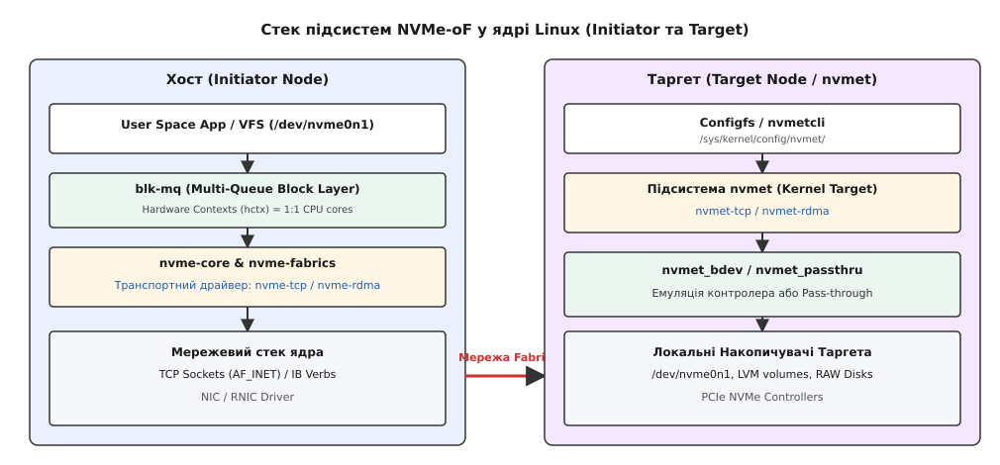
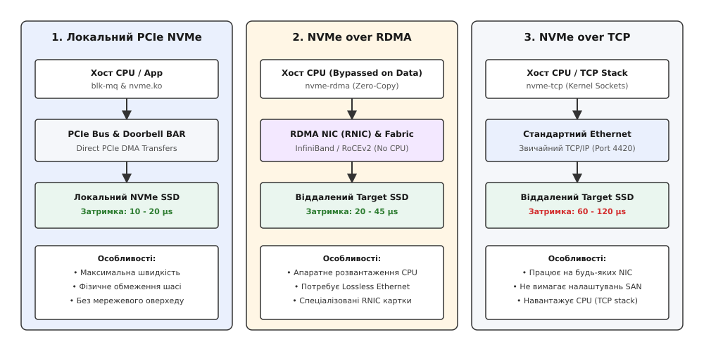
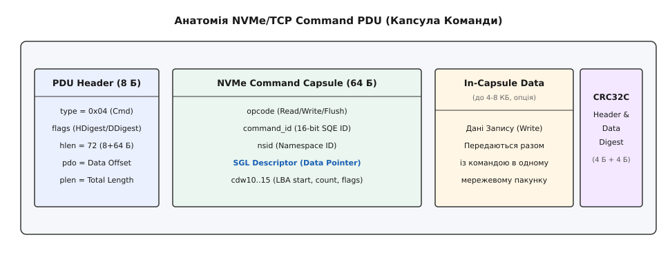

# NVMe over Fabrics (NVMe-oF)

<preknowlist>
- [Символьні та блочні пристрої](topic:sys-unix/character-and-block-devices) — блочна модель ядра Linux, черги запитів вводу-виводу (request_queue) та біо-структури (struct bio).
- [Підсистема PCI Express](topic:sys-unix/pcie-fabric-msix-and-aer) — шина PCIe, прямий доступ до пам'яті (DMA), регістри BAR та переривання MSI-X у локальному NVMe.
</preknowlist>

У сучасних дата-центрах із тисячами обчислювальних вузлів локальні накопичувачі NVMe SSD виявляються жорстко прив'язаними до фізичних корпусів серверів: один сервер вичерпує свої 4 ТБ дискового простору та мільйон IOPS, тоді як у трьох сусідніх серверів NVMe-диски простоюють майже без навантаження. Фізичне перепідключення накопичувачів через PCIe-корзини вимагає вимкнення живлення, а PCIe-комутатори обмежені декількома метрами відстані. Спроба транслювати дискові команди через застарілі мережеві протоколи на зразок iSCSI розбивається об продуктивність: інкапсуляція команд SCSI над TCP вимагає трансляції структур даних між моделями NVMe та SCSI, зайвого проходу через SCSI-шар ядра й додаткового копіювання буферів, що з'їдає помітну частку виграшу від надшвидкої флеш-пам'яті.

## 1. Від шини PCIe до мережевої фабрики

Локальний протокол Non-Volatile Memory Express (NVMe) створювався як заміна застарілому інтерфейсу AHCI (SATA). Замість однієї черги команд завглибшки в 32 елементи з обов'язковим глобальним спінлоком, локальний NVMe запропонував паралельну архітектуру: до 64 000 черг вводу-виводу (Submission Queue, SQ / Completion Queue, CQ), кожна з яких здатна вмістити до 64 000 команд. У ядрі Linux це ідеально лягло на модель `blk-mq` (Multi-Queue Block Layer), де кожне процесорне ядро отримує власну персональну чергу до накопичувача, усуваючи міжядерну конкуренцію.

Однак локальний NVMe жорстко зав'язаний на апаратну шину PCI Express: команди записуються в оперативну пам'ять хоста, а контролер сповіщається через регістри дзвоника (Doorbell BAR registers), після чого виконує прямий доступ до пам'яті (PCIe DMA).

Специфікація **NVMe over Fabrics (NVMe-oF)**, вперше опублікована консорціумом NVM Express у 2016 році, поставила за мету винести цю безблокувальну архітектуру за межі фізичної шини PCIe у мережеву фабрику (Ethernet, InfiniBand, Fibre Channel). Головне завдання NVMe-oF — забезпечити віддалений доступ до блочного пристрою з додатковою затримкою не більше ніж 10–20 мікросекунд порівняно з локальним PCIe SSD, зберігши нативні NVMe-команди без жодної трансляції в SCSI.


*Стек підсистем NVMe-oF у ядрі Linux від шару blk-mq на хості до підсистеми nvmet на таргеті.*

## 2. Ключові концепти архітектури NVMe-oF

Абстрагування від фізичної шини вимагало заміни регістрів PCIe BAR та шинних переривань на мережеві повідомлення та унікальну адресацію.

### 2.1. NQN (NVMe Qualified Name)

Для глобальної ідентифікації хостів (ініціаторів) та віддалених підсистем (таргетів) у NVMe-oF використовується формат **NQN**. Він гарантує унікальність у межах глобальної мережі та аналогічний IQN з iSCSI. Специфікація визначає дві форми запису NQN:

1. **На основі UUID** (використовується за замовчуванням у більшості систем Linux):
   `nqn.2014-08.org.nvmexpress:uuid:f81d4fae-7dec-11d0-a765-00a0c91e6bf6`
2. **На основі домену та дати** (зазвичай для корпоративних СЗД):
   `nqn.1992-08.com.netapp:sn.1234567890ab`

Host NQN зберігається у файлі `/etc/nvme/hostnqn`, який створює не ядро, а користувацький інструментарій: пакет `nvme-cli` генерує його командою `nvme gen-hostnqn` під час встановлення. Якщо файлу немає, ядро при підключенні бере NQN, побудований з UUID хоста. Своєю чергою, сервер зберігання (Target) публікує один або декілька Target NQN.

### 2.2. Капсули команд та відповідей (Capsules)

Оскільки хост більше не може записати елемент черги безпосередньо у виділений PCIe-буфер накопичувача, команди інкапсулюються у мережеві пакунки — **Капсули**:

- **Command Capsule:** Містить 64-байтний елемент SQE (Submission Queue Entry), який описує операцію (Read, Write, Flush), та описувачі SGL (Scatter-Gather List). Опціонально Command Capsule може містити дані запису — так звані **In-Capsule Data**. Якщо розмір запису не перевищує поріг (наприклад, 4 KiB), дані відправляються в одному мережевому кадрі разом із командою, заощаджуючи цілий мережевий RTT (Round Trip Time).
- **Response Capsule:** Містить 16-байтний елемент CQE (Completion Queue Entry), який повертається таргетом після виконання операції і містить статус виконання, ID команди та можливі помилки.

### 2.3. Структура SGL (Scatter-Gather List) у мережевому NVMe

На відміну від локального NVMe, де для адресації пам'яті використовуються PRPs (Physical Region Pages), специфікація NVMe-oF вимагає використання описувачів **SGL** (Scatter-Gather List). Кожен SGL-описувач займає 16 байт у командній капсулі і визначає тип буфера:

- **SGL Data Block Descriptor:** Вказує 64-бітну фізичну/віртуальну адресу пам'яті та її довжину.
- **SGL Segment Descriptor:** Посилання на наступний блок SGL-описувачів, якщо дані розкидані по багатьох несуміжних фрагментах пам'яті.
- **In-Capsule Data SGL Descriptor:** Спеціальний тип описувача, який вказує контролеру, що дані розміщені безпосередньо всередині Command Capsule за певним зміщенням.
- **Keyed SGL Data Block Descriptor:** Використовується в RDMA, містить 64-бітну віддалену адресу пам'яті та 32-бітний ключ доступу `rkey`.

### 2.4. Модель черг та підсистем

У NVMe-oF зберігається суворе розділення на **Admin Queue** (одна черга на контролер для керування: ідентифікація, створення черг I/O, отримання логів) та **I/O Queues** (черги передачі даних).

Кожна I/O-черга NVMe-oF відображається 1:1 на окреме мережеве з'єднання (TCP-сокет або RDMA Queue Pair). Драйвер `blk-mq` ядра Linux прив'язує апаратний контекст черги (`hctx`) до поточного CPU-ядра. Коли процес виконує системний виклик `write()`, ядро формує NVMe-команду у контексті цього ж ядра і надсилає її у відповідний TCP-сокет без захоплення глобальних м'ютексів.

Розділення черг по сокетах виключає проблему міжпроцесорного Head-of-Line Blocking: затримка або втрата пакета в TCP-сокеті одного ядра ніяк не блокує обробку вхідних та вихідних кадрів на інших процесорних ядрах.

## 3. Транспортні протоколи: RDMA проти TCP

Специфікація NVMe-oF розроблена транспортно-незалежною. Спеціальний шар абстракції `nvme-fabrics` у ядрі Linux транслює виклики вищого рівня у конкретні реалізації мережевих транспортів.


*Порівняння шляху даних у локальному PCIe NVMe, мережевому NVMe/RDMA із прямим доступом до пам'яті та універсальному NVMe/TCP.*

### 3.1. NVMe over RDMA (NVMe/RDMA)

RDMA (Remote Direct Memory Access) дозволяє мережевому адаптеру однієї машини зчитувати або записувати дані безпосередньо з/в оперативну пам'ять іншої машини без залучення операційної системи та процесора на стороні таргету.

У NVMe/RDMA використовується класична модель RDMA Verbs із прямими операціями `RDMA Read` та `RDMA Write`. Драйвери ядра (`nvme-rdma`, `nvmet-rdma`) звертаються до ядерного API — `ib_post_send()`, `ib_post_recv()`, `ib_reg_mr()`; однойменні `ibv_*` — це їхні відповідники з бібліотеки `libibverbs` для користувацького простору. Процес взаємодії складається з таких етапів:

1. **Реєстрація пам'яті:** Драйвер хоста реєструє буфери пам'яті в RNIC (`ib_reg_mr`), отримуючи локальний ключ (`lkey`) та віддалений ключ пам'яті (`rkey`).
2. **Передача команди:** Хост надсилає Command Capsule в RDMA Send Queue. Капсула містить `rkey` та віртуальну адресу буфера хоста.
3. **Прямий доступ до пам'яті:** При виконанні команди читання (Read) таргет за допомогою свого апаратного RNIC виконує операцію `RDMA Write` безпосередньо в буфер пам'яті хоста за наданим `rkey`. Процесор таргету взагалі не бере участі в копіюванні байтів.
4. **Завершення:** Таргет надсилає Response Capsule через RDMA, повідомляючи про успішне закінчення операції.

Транспорт RDMA підтримується трьома мережевими технологіями:
- **InfiniBand:** Спеціалізована комутована фабрика з апаратно гарантованою доставкою без втрат (Lossless Fabric) та затримками порядку одиниць мікросекунд.
- **RoCEv2 (RDMA over Converged Ethernet):** Передача RDMA-кадрів усередині пакунків UDP/IP (UDP-порт 4791) через Ethernet. Вимагає суворого налаштування мережі на комутаторах: PFC (Priority Flow Control) та ECN (Explicit Congestion Notification) для запобігання втратам пакетів.
- **iWARP:** RDMA поверх класичного TCP/IP. Не вимагає Lossless Ethernet, але має вищу затримку через стек TCP.

**Переваги RDMA:** Додаткова затримка порівняно з локальним PCIe-накопичувачем — 10–25 мкс, навантаження на CPU таргету й хоста близьке до нуля (Zero-Copy та CPU Bypass).
**Недоліки:** Висока вартість обладнання, потреба у спеціальних RNIC та надзвичайна складність налаштування мережевих комутаторів.

### 3.2. NVMe over TCP (NVMe/TCP)

Стандартизований наприкінці 2018 року (TP 8000), NVMe/TCP зробив мережевий NVMe доступним для будь-якої інфраструктури. Він працює поверх стандартного стеку TCP/IP (порт за замовчуванням 4420) і не вимагає жодних спеціалізованих мережевих карт чи налаштувань Lossless Ethernet.

Усі дані в NVMe/TCP передаються у формі структурованих блоків — **PDU (Protocol Data Unit)**.


*Внутрішнє розбиття PDU пакунка NVMe/TCP на заголовок, капсулу команди SQE та вкладені дані.*

#### Структура PDU NVMe/TCP

Кожен PDU починається з 8-байтного загального заголовка:

```
 0                   1                   2                   3
 0 1 2 3 4 5 6 7 8 9 0 1 2 3 4 5 6 7 8 9 0 1 2 3 4 5 6 7 8 9 0 1
+-+-+-+-+-+-+-+-+-+-+-+-+-+-+-+-+-+-+-+-+-+-+-+-+-+-+-+-+-+-+-+-+
|    pdu_type   |     flags     |      hlen     |      pdo      |
+-+-+-+-+-+-+-+-+-+-+-+-+-+-+-+-+-+-+-+-+-+-+-+-+-+-+-+-+-+-+-+-+
|                          plen (32-bit)                        |
+-+-+-+-+-+-+-+-+-+-+-+-+-+-+-+-+-+-+-+-+-+-+-+-+-+-+-+-+-+-+-+-+
```

Поля заголовка:
- `pdu_type`: Тип пакунка (`0x00` = ICReq, `0x01` = ICResp, `0x04` = Cmd, `0x05` = Rsp, `0x06` = H2CData, `0x07` = C2HData, `0x09` = R2T).
- `flags`: Прапори контрольних сум (`HDIGEST_EN` — контрольна сума заголовка CRC32C, `DDIGEST_EN` — контрольна сума даних).
- `hlen`: Довжина заголовка PDU (в байтах).
- `pdo`: Data Offset — зміщення до блоку даних від початку PDU.
- `plen`: Повна довжина PDU включно з заголовком, даними та контрольними сумами.

#### Послідовність передачі при записі (Write Sequence)

1. Хост формує `Command PDU` (з SQE всередині). Якщо увімкнено In-Capsule Data і обсяг малий, дані додаються в цей же PDU.
2. Якщо дані великі, таргет обробляє команду і надсилає `R2T PDU` (Ready to Transfer), вказуючи зміщення та дозволений розмір буфера.
3. Хост у відповідь надсилає один або декілька `H2CData PDU` (Host-to-Controller Data).
4. Після успішного запису на дисковий носій таргет повертає `Response PDU` із фінальним статусом виконання.

#### Порівняння затримок та накладних витрат при In-Capsule Data

Для малих блоків даних (наприклад, 4 KiB запис СУБД) вибір між передачею даних усередині капсули (`In-Capsule Data`) та окремим кадром `H2CData` визначає кількість мережевих затримок (RTT):

- **Режим 1: 4 KiB запис із In-Capsule Data (1 RTT):**
  - **Хост -> Таргет:** Відправляється єдиний `Command PDU` розміром `8 (Header) + 64 (SQE) + 4096 (Data) + 8 (Digest) = 4176` байт.
  - **Таргет -> Хост:** Повертається `Response PDU` розміром 24 байти.
  - *Загальний час:* 1 RTT + час запису на флеш-пам'ять.

- **Режим 2: 64 KiB запис без In-Capsule Data (2 RTT):**
  - **RTT 1 (Хост -> Таргет):** `Command PDU` (72 байти з SGL).
  - **RTT 1 (Таргет -> Хост):** `R2T PDU` (24 байти), де таргет виділяє свій DMA-буфер.
  - **RTT 2 (Хост -> Таргет):** `H2CData PDU` (24 байти заголовка + 65 536 байтів даних = 65 560 байтів).
  - **RTT 2 (Таргет -> Хост):** `Response PDU` (24 байти).
  - *Загальний час:* 2 RTT + час запису на накопичувач.

#### Оптимізація Zero-Copy в ядрі Linux

Для оптимізації продуктивності модуля `nvme-tcp` ядро Linux використовує декілька підходів:
- **Передача даних:** Шлях відправки (`nvme_tcp_try_send_data()`) передає сторінки `struct page` із запиту `blk-mq` просто в сокет, без проміжного копіювання: до ядра 6.5 — через `kernel_sendpage()`, від 6.5 — через `sendmsg()` із прапорцем `MSG_SPLICE_PAGES`.
- **Прийом даних:** Модуль зв'язується з мережевим сокетом через колбек `sk_data_ready`. При надходженні пакетів ядро розбирає PDU просто зі списку сокетних буферів `skb` і копіює дані в цільові сторінки самого запиту — сторінки кеша сторінок або, за прямого вводу-виводу, закріплені сторінки процесу — без проміжного буфера драйвера.
- **Busy Polling:** Налаштування `SO_BUSY_POLL` дозволяє підсистемі вводу-виводу опитувати кільцеві буфери мережевої карти без очікування переривань, зменшуючи затримку на кілька мікросекунд ціною повного завантаження одного CPU-потоку.

## 4. Безпека: Автентифікація та Шифрування TLS 1.3

Передача блочних даних по публічній або загальній мережі Ethernet вимагає надійних механізмів автентифікації та захисту даних.

### 4.1. Внутрішньосмугова автентифікація (DH-HMAC-CHAP)

Специфікація NVMe-oF стандартизує протокол **DH-HMAC-CHAP** (Diffie-Hellman HMAC Challenge Handshake Authentication Protocol). Під час встановлення з'єднання на стадії Admin Queue хост і таргет обмінюються випадковими числами (challenges) та обчислюють HMAC-хеші із залученням спільних секретних ключів. Схема підтримує односторонню або взаємну (mutual) автентифікацію, унеможливлюючи підключення неавторизованого ініціатора.

### 4.2. Шифрування каналів через TLS 1.3 у NVMe/TCP

Окремою технічною пропозицією до транспорту NVMe/TCP було додано нативну підтримку шифрування трафіку через **TLS 1.3** (Transport Layer Security).

У ядрі Linux взаємодія реалізована за допомогою користувацького демона `tlshd` (пакет `ktls-utils`, який виконує сам handshake) та ядерного модуля `kTLS` (Kernel TLS); ядро має бути зібране з `CONFIG_NVME_TCP_TLS` і `CONFIG_NVME_TARGET_TCP_TLS`:
1. Модуль `nvme-tcp` ініціює TCP-з'єднання.
2. Ядро через Netlink-інтерфейс передає сокет у користувацький демон `tlshd` для виконання handshake TLS 1.3 із використанням PSK (Pre-Shared Keys) або сертифікатів X.509.
3. Після погодження симетричних ключів AES-GCM сокет повертається ядру, і драйвер `nvme-tcp` прозоро шифрує/дешифрує всі PDU на рівні ядра за допомогою криптографічних інструкцій процесора (AES-NI).

## 5. Стек ядра Linux: nvme-core, nvme-fabrics та nvmet

Підтримка NVMe-oF в ядрі Linux розділена на дві незалежні частини: Ініціатор (Host) та Ціль (Target).

### 5.1. Драйвер Ініціатора (Host Subsystem)

На хості за взаємодію з мережевими NVMe-пристроями відповідає шар `nvme-fabrics`. Коли адміністратор виконує команду підключення, цей шар:
1. Створює Admin-чергу та виконує ідентифікацію контролера через транспортний модуль (`nvme-tcp` або `nvme-rdma`).
2. Отримує список доступних Namespaces та створює для кожного з них блочний пристрій ядра `/dev/nvmeXnY`.
3. Ініціалізує I/O-черги `blk-mq`, розподіляючи їх між онлайн-процесорами системи.

Для користувацьких застосунків блочний пристрій `/dev/nvme1n1` нічим не відрізняється від локального PCIe NVMe SSD: на ньому можна створювати файлові системи (ext4, xfs), монтувати їх або передавати безпосередньо у віртуальні машини KVM/QEMU.

### 5.2. Підсистема NVMe Target (nvmet)

Серверна частина ядра Linux називається **`nvmet`**. Вона дозволяє перетворити будь-який Linux-сервер на високопродуктивну СЗД. Підсистема `nvmet` здатна експортувати:
- Реальні локальні NVMe-накопичувачі у наскрізному режимі (**Pass-through**): команди передаються на локальний контролер без перезбирання.
- Будь-які блочні пристрої ядра (**Block Device Mode**): LVM-томи, mdraid масиви, файли-образи або SATA SSD експортуються через емуляцію NVMe-контролера.

Конфігурація `nvmet` здійснюється динамічно через віртуальну файлову систему **configfs** (монтується в `/sys/kernel/config/nvmet/`). Дерево configfs містить такі основні елементи:

- `/sys/kernel/config/nvmet/subsystems/`: Директорії підсистем із їхніми NQN. Кожна підсистема містить параметри `attr_allow_any_host`, `attr_cntlid_min`, `attr_cntlid_max`, а також піддиректорії `namespaces/` та `allowed_hosts/`.
- `/sys/kernel/config/nvmet/ports/`: Конфігурація мережевих портів та прив'язка транспорту (`addr_trtype`, `addr_traddr`, `addr_trsvcid`).
- `/sys/kernel/config/nvmet/hosts/`: Список дозволених NQN хостів для авторизації доступу (ACL).

## 6. Нативна багатошляховість (Multipathing) та ANA

У корпоративних мережах для забезпечення відмовостійкості сервер з'єднують із системою зберігання через кілька незалежних мережевих карт та комутаторів.

У класичному SCSI для об'єднання дубльованих шляхів використовувався підмодуль `dm-multipath`. У випадку з NVMe розробники ядра реалізували **Native NVMe Multipathing** (умикається параметром ядра `nvme_core.multipath=Y`), який функціонує безпосередньо на рівні `nvme-core`, без додаткового шару Device Mapper.

### 6.1. Head Node та Контролери

Якщо хост підключається до одного і того ж Target NQN через два різні мережеві інтерфейси (наприклад, `192.168.10.1` та `192.168.20.1`), ядро створює два контролери — `nvme0` і `nvme1`, — а для кожного шляху заводить окремий пристрій простору імен `nvme0c0n1` і `nvme0c1n1`. Ці пристрої позначені як приховані, тож видно їх лише в `/sys/block/`, вузлів у `/dev` вони не мають.

Проте для системи створюється один віртуальний блочний пристрій **Head Node** — `/dev/nvme0n1`. Усі операції вводу-виводу спрямовуються на `/dev/nvme0n1`, а ядро самостійно балансує навантаження між фізичними шляхами за політикою `iopolicy` (типово `numa` — найближчий за топологією контролер; доступні також `round-robin` і `queue-depth`).

### 6.2. Стан шляхів ANA (Asymmetric Namespace Access)

Аналог ALUA у SCSI, специфікація **ANA** дозволяє таргету динамічно повідомляти хосту про стан доступності кожного простору імен через кожен із портів:

- **Optimized:** Найкращий шлях з найменшою затримкою (основний контролер СЗД).
- **Non-Optimized:** Робочий шлях, але з підвищеною затримкою (резервний контролер, що передає дані через внутрішню шину СЗД).
- **Inaccessible:** Шлях тимчасово недоступний (аварія мережевого кабелю або перезавантаження порту).
- **ANA Change State:** Таргет перебуває у процесі переключання ресурсів.

Хост автоматично перенаправляє трафік I/O на шляхи `Optimized`, а при їх відмові одразу перемикається на `Non-Optimized`.

## 7. Практична реалізація: Побудова PDU NVMe/TCP

Для глибшого розуміння роботи мережевого транспорту розглянемо приклад побудови та обробки капсули команди `Command PDU` мовами C та ідіоматичною C++.

:::tabs
```c
/* c */
#include <stdio.h>
#include <stdlib.h>
#include <string.h>
#include <stdint.h>
#include <endian.h>
#include <unistd.h>
#include <sys/socket.h>
#include <netinet/in.h>
#include <arpa/inet.h>

/* Структури заголовків за специфікацією NVMe/TCP */
#pragma pack(push, 1)

struct nvme_tcp_hdr {
    uint8_t  type;       /* 0x04 = Command PDU */
    uint8_t  flags;      /* Прапори (HDigest, DDigest) */
    uint8_t  hlen;       /* Довжина заголовка (72 байти) */
    uint8_t  pdo;        /* Зміщення даних */
    uint32_t plen;       /* Повна довжина PDU */
};

struct nvme_tcp_cmd_pdu {
    struct nvme_tcp_hdr hdr;
    uint8_t  cmd[64];    /* 64-байтна капсула SQE NVMe */
};

#pragma pack(pop)

int send_nvme_read_command(int sock_fd, uint32_t nsid, uint64_t lba, uint16_t count) {
    struct nvme_tcp_cmd_pdu pdu;

    /* NVMe кодує кількість блоків як «N-1», тож нуль блоків — недійсний запит */
    if (count == 0) {
        return -1;
    }

    memset(&pdu, 0, sizeof(pdu));

    /* Налаштування PDU Header */
    pdu.hdr.type = 0x04; /* Command PDU */
    pdu.hdr.flags = 0;   /* Без хешів для спрощення */
    pdu.hdr.hlen = sizeof(struct nvme_tcp_cmd_pdu);
    pdu.hdr.pdo = 0;
    pdu.hdr.plen = htole32(sizeof(struct nvme_tcp_cmd_pdu));

    /* Заповнення 64-байтної SQE команди NVMe Read (Opcode 0x02) */
    pdu.cmd[0] = 0x02;                           /* Opcode: NVMe Read */
    *(uint16_t*)(pdu.cmd + 2) = htole16(0x1001);  /* Command ID */
    *(uint32_t*)(pdu.cmd + 4) = htole32(nsid);    /* Namespace ID */
    *(uint64_t*)(pdu.cmd + 40) = htole64(lba);    /* Starting LBA (CDW10/11) */
    *(uint16_t*)(pdu.cmd + 48) = htole16(count - 1); /* Number of Blocks (CDW12) */

    /* Байти 24..39 SQE — SGL-описувач буфера даних; тут він лишається нульовим,
       бо приклад показує лише формування самого PDU. */

    ssize_t sent = send(sock_fd, &pdu, sizeof(pdu), MSG_NOSIGNAL);
    if (sent < 0) {
        perror("Помилка відправки NVMe/TCP PDU");
        return -1;
    }
    if ((size_t)sent != sizeof(pdu)) {
        fprintf(stderr, "Часткова відправка PDU: %zd з %zu байт\n", sent, sizeof(pdu));
        return -1;
    }
    printf("Відправлено NVMe/TCP Read Command PDU: %zd байт\n", sent);
    return 0;
}
```
```cpp
// cpp
#include <iostream>
#include <vector>
#include <array>
#include <cstdint>
#include <cstring>
#include <expected>
#include <system_error>
#include <cerrno>
#include <concepts>
#include <span>
#include <bit>
#include <unistd.h>
#include <sys/socket.h>
#include <netinet/in.h>
#include <arpa/inet.h>

namespace nvme_of {

// Поля NVMe/TCP — little-endian. На LE-платформі перетворення нічого не міняє,
// на BE-платформі байти треба переставити; std::byteswap наосліп псував би LE.
template <std::integral T>
[[nodiscard]] constexpr T to_le(T value) noexcept {
    if constexpr (std::endian::native == std::endian::big) {
        return std::byteswap(value);
    } else {
        return value;
    }
}

#pragma pack(push, 1)
struct Header {
    std::uint8_t  type{0x04};
    std::uint8_t  flags{0};
    std::uint8_t  hlen{72};
    std::uint8_t  pdo{0};
    std::uint32_t plen{72};
};

struct CommandPdu {
    Header header{};
    std::array<std::uint8_t, 64> sqe{};
};
#pragma pack(pop)

class NvmeSocket {
private:
    int fd_{-1};

public:
    explicit NvmeSocket(int fd) noexcept : fd_(fd) {}
    ~NvmeSocket() {
        if (fd_ >= 0) {
            ::close(fd_);
        }
    }

    NvmeSocket(const NvmeSocket&) = delete;
    NvmeSocket& operator=(const NvmeSocket&) = delete;
    NvmeSocket(NvmeSocket&& other) noexcept : fd_(other.fd_) {
        other.fd_ = -1;
    }
    NvmeSocket& operator=(NvmeSocket&& other) noexcept {
        if (this != &other) {
            if (fd_ >= 0) ::close(fd_);
            fd_ = other.fd_;
            other.fd_ = -1;
        }
        return *this;
    }

    [[nodiscard]] std::expected<std::size_t, std::error_code> send_pdu(const CommandPdu& pdu) const noexcept {
        std::span<const std::byte> bytes{
            reinterpret_cast<const std::byte*>(&pdu), sizeof(CommandPdu)
        };

        ssize_t res = ::send(fd_, bytes.data(), bytes.size(), MSG_NOSIGNAL);
        if (res < 0) {
            return std::unexpected(std::error_code(errno, std::generic_category()));
        }
        if (static_cast<std::size_t>(res) != bytes.size()) {
            return std::unexpected(std::make_error_code(std::errc::message_size));
        }
        return static_cast<std::size_t>(res);
    }
};

[[nodiscard]] std::expected<CommandPdu, std::error_code>
build_read_pdu(std::uint32_t nsid, std::uint64_t lba, std::uint16_t blocks) noexcept {
    // NVMe кодує кількість блоків як «N-1», тож нуль блоків — недійсний запит
    if (blocks == 0) {
        return std::unexpected(std::make_error_code(std::errc::invalid_argument));
    }

    CommandPdu pdu{};
    pdu.header.plen = to_le(static_cast<std::uint32_t>(sizeof(CommandPdu)));

    pdu.sqe[0] = 0x02; // NVMe Read Opcode

    const auto cmd_id = to_le<std::uint16_t>(0x1001);
    std::memcpy(&pdu.sqe[2], &cmd_id, sizeof(cmd_id));

    const auto nsid_le = to_le(nsid);
    std::memcpy(&pdu.sqe[4], &nsid_le, sizeof(nsid_le));

    const auto lba_le = to_le(lba);
    std::memcpy(&pdu.sqe[40], &lba_le, sizeof(lba_le));

    // Байти 24..39 SQE — SGL-описувач буфера даних; приклад лишає його нульовим
    const auto count_le = to_le(static_cast<std::uint16_t>(blocks - 1));
    std::memcpy(&pdu.sqe[48], &count_le, sizeof(count_le));

    return pdu;
}

} // namespace nvme_of
```
:::

## 8. Практичне налаштування та діагностика в Linux

Розглянемо практичні кроки з розгортання та адміністрування NVMe-oF у ядрі Linux.

### 8.1. Конфігурація Таргета (Target) через configfs

Створимо NVMe/TCP Target з одним підключеним блочним пристроєм `/dev/sdb`:

```bash
# 1. Завантаження потрібних модулів ядра
sudo modprobe nvmet
sudo modprobe nvmet-tcp

# 2. Створення підсистеми NVMe Target
sudo mkdir /sys/kernel/config/nvmet/subsystems/nqn.2026-08.com.example:nvme-storage01
cd /sys/kernel/config/nvmet/subsystems/nqn.2026-08.com.example:nvme-storage01

# 3. Дозвіл підключення будь-яким хостам (без обмеження ACL)
echo 1 | sudo tee attr_allow_any_host

# 4. Створення Namespace 1 та прив'язка блочного пристрою
sudo mkdir namespaces/1
echo -n "/dev/sdb" | sudo tee namespaces/1/device_path
echo 1 | sudo tee namespaces/1/enable

# 5. Створення мережевого порту NVMe/TCP (порт 4420)
sudo mkdir /sys/kernel/config/nvmet/ports/1
cd /sys/kernel/config/nvmet/ports/1
echo "tcp" | sudo tee addr_trtype
echo "ipv4" | sudo tee addr_adrfam
echo "192.168.122.10" | sudo tee addr_traddr
echo "4420" | sudo tee addr_trsvcid

# 6. Зв'язування підсистеми з портом
sudo ln -s /sys/kernel/config/nvmet/subsystems/nqn.2026-08.com.example:nvme-storage01 \
  /sys/kernel/config/nvmet/ports/1/subsystems/
```

Замість ручного маніпулювання файлами `configfs` у виробничому середовищі використовують високорівневу утиліту `nvmetcli`, яка зберігає конфігурацію у JSON-файл `/etc/nvmet/config.json`.

### 8.2. Управління Хостом (Initiator) через nvme-cli

На стороні клієнта використовується стандартний інструмент `nvme-cli`.

**Крок 1. Discovery (Виявлення підсистем):**
Запит до віддаленого порту виявлення повертає список усіх опублікованих Target NQN:

```bash
sudo nvme discover -t tcp -a 192.168.122.10 -s 4420
```

*Приклад виводу:*
```text
Discovery Log Number of Records 1, Generation counter 2
=====Discovery Log Record 0=====
trtype:  tcp
adrfam:  ipv4
subtype: nvme subsystem
treq:    not specified
traddr:  192.168.122.10
trsvcid: 4420
subnqn:  nqn.2026-08.com.example:nvme-storage01
```

**Крок 2. Connect (Підключення):**

```bash
sudo nvme connect -t tcp -a 192.168.122.10 -s 4420 \
  -n nqn.2026-08.com.example:nvme-storage01
```

Після виконання цієї команди ядро створює контролер `nvme0` та блочний пристрій `/dev/nvme0n1`.

**Крок 3. Перевірка статусу підсистем та multipath:**

```bash
sudo nvme list-subsys
```

*Приклад виводу з увімкненим нативним Multipathing:*
```text
nvme-subsys0 - NQN=nqn.2026-08.com.example:nvme-storage01
\
 +- nvme0 tcp traddr=192.168.122.10,trsvcid=4420 live optimized
 +- nvme1 tcp traddr=192.168.123.10,trsvcid=4420 live non-optimized
```

### 8.3. Опитування стану через sysfs та перепідключення при збоях

Драйвер ядра Linux експортує топологію підключених віддалених контролерів у файлову систему `/sys/class/nvme/`:

- `/sys/class/nvme/nvme0/state`: Поточний стан контролера (`live`, `resetting`, `reconnect`, `deleting`).
- `/sys/class/nvme/nvme0/transport`: Тип транспорту (`tcp`, `rdma`).
- `/sys/class/nvme/nvme0/address`: Мережева адреса та порт.

У разі тимчасового обриву мережевого зв'язку модуль `nvme-fabrics` переводить контролер у стан `reconnect` і намагається відновити з'єднання через кожні `reconnect_delay` секунд (за замовчуванням 10 с). Якщо з'єднання не відновлюється протягом таймауту `ctrl_loss_tmo` (за замовчуванням 600 с), ядро видаляє контролер та завершує всі підвішені біо-запити з помилкою I/O.

### 8.4. Трейсинг та аналіз затримок у ядрі

Для аналізу внутрішньої обробки команд NVMe-oF в ядрі Linux використовується підсистема `ftrace` та точки трасування tracepoints:

```bash
# Увімкнення трейсингу команд NVMe
echo 1 | sudo tee /sys/kernel/tracing/events/nvme/enable
cat /sys/kernel/tracing/trace_pipe
```

Вивід покаже точний час формування SQE, відправку у мережевий сокет та отримання відповіді від таргету:

```text
kworker/u16:2-1205  [003] ....  14205.123456: nvme_sq_cmd: nvme0: qid=1, cmdid=4097, nsid=1, flags=0x0, meta=0x0, cmd=(nvme_cmd_read slba=8192, len=7, ctrl=0x0, dsmgmt=0, reftag=0)
```

Для вимірювання затримок на рівні мережевого транспорту використовується утиліта `bpftrace`, яка дозволяє виміряти час між викликом `nvme_tcp_queue_rq()` та надходженням `nvme_tcp_recv_pdu()`.

## 9. Продуктивність та оптимізація

Вибір між NVMe/RDMA та NVMe/TCP визначається архітектурними вимогами до інфраструктури:

| Параметр / Характеристика | NVMe/RDMA (RoCEv2) | NVMe/TCP |
| :--- | :--- | :--- |
| **Додаткова затримка (Network RTT)** | 10 – 25 мкс | 50 – 100 мкс |
| **Навантаження на CPU (на 100k IOPS)** | ~ 1–2% одного ядра | ~ 15–25% одного ядра |
| **Вимоги до мережевого обладнання** | SmartNIC / RNIC, Lossless Ethernet (PFC/ECN) | Звичайні 10/25/100G Ethernet NIC та комутатори |
| **Складність розгортання** | Висока (налаштування DCB/PFC на комутаторах) | Низька (стандартна IP-маршрутизація) |
| **Сценарії застосування** | High-Performance Computing, In-Memory DB | Хмарні дата-центри, Kubernetes (CSI), SAN |

### Рекомендації з оптимізації NVMe/TCP:
1. **Jumbo Frames (MTU 9000):** Збільшення розміру кадрів Ethernet знижує кількість переривань NIC і перезбирання пакетів на CPU при великих блоках вводу-виводу (32k–128k).
2. **CPU Core Affinity (Прив'язка переривань):** За допомогою `ethtool -X` та `set_irq_affinity` прив'яжіть черги мережевої карти до тих самих фізичних ядер, на яких працюють I/O черги `blk-mq`.
3. **Сокетні буфери ядра:** Налаштуйте sysctl-параметри `net.core.rmem_max` та `net.core.wmem_max` до 16 MiB для запобігання скиданню вікна TCP при високому навантаженні.
