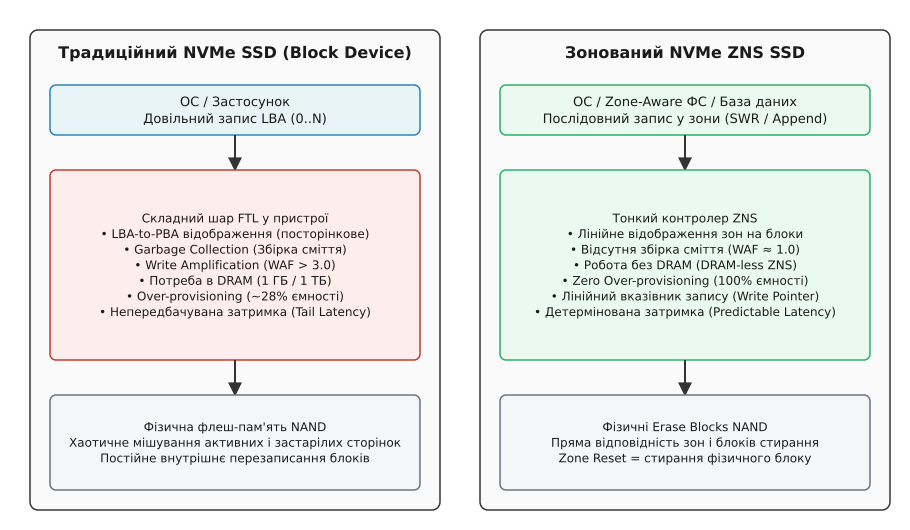
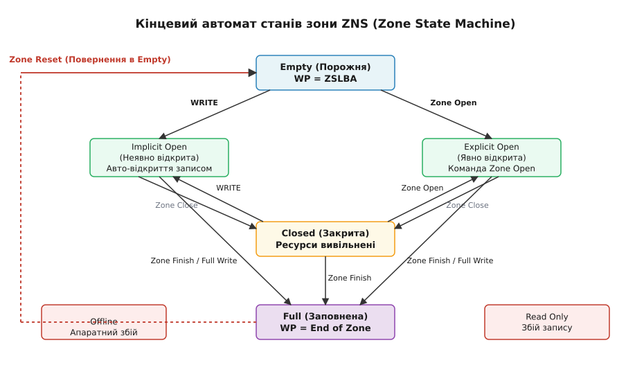
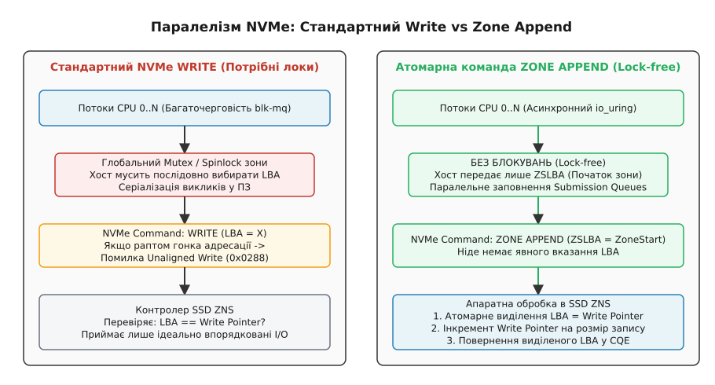

# Зонований простір імен NVMe (ZNS)

<preknowlist>
- [Символьні та блочні пристрої](topic:sys-unix/character-and-block-devices) — базові відмінності між пристроями побайтового та блочного доступу.
- [Модель блочних пристроїв](topic:sys-unix/block-device-model) — функціонування шару блочного I/O у ядрі Linux та мультичерговості `blk-mq`.
- [Підсистема NVMe у ядрі Linux](topic:sys-unix/nvme-in-linux) — драйвер NVMe, Submission/Completion Queues та обробка команд.
</preknowlist>

Зонований простір імен NVMe (ZNS, Zoned Namespaces) — це розширення специфікації NVMe 2.0 (стандартизоване у специфікації NVMe TP 4053), яке вирішує проблему деградації продуктивності, сплесків затримок та прискореного зносу флеш-пам'яті у твердотільних накопичувачах. У традиційних SSD операційна система надсилає сектор запису, передбачаючи, що сектор буде перезаписано прямо на тому самому фізичному місці носія. Однак фізика напівпровідникової флеш-пам'яті NAND забороняє модифікацію окремих бітів на місці: комірки пам'яті групуються у сторінки (розміром від 4 КБ до 16 КБ) для читання й запису, але стиратися можуть лише величезними блоками (Erase Blocks, розміром від кількох мегабайт до десятків мегабайт). Щоб змінити бодай один байт у вже записаній сторінці, накопичувач мусить записати модифікований варіант у нове, порожнє місце, а стару сторінку позначити як застарілу (invalid).

Для приховування цієї фізичної невідповідності від операційних систем у традиційних SSD використовується складний мікропрограмний шар — Flash Translation Layer (FTL). FTL веде динамічну таблицю трансляції адресації, яка відображає логічні блоки ОС (LBA, Logical Block Addressing) на фізичні сторінки пам'яті (PBA, Physical Block Addressing). Оскільки хост пише дані в довільному порядку, фізичні блоки накопичувача швидко перетворюються на хаотичне місиво з актуальних та застарілих сторінок. Щоб звільнити місце під нові записи, контролер SSD змушений постійно виконувати внутрішній процес збірки сміття (Garbage Collection): він читає фізичний блок, копіює збережені в ньому актуальні сторінки у новий порожній блок, після чого виконує апаратне стирання старого блоку.

Збірка сміття на рівні FTL створює критичні проблеми у високонавантажених серверних системах: високе підсилення запису (WAF досягає 3–5), величезні витрати DRAM (1 ГБ DRAM на 1 ТБ NAND), перевитрату ємності на резервування (10–28% Over-provisioning) та непрогнозовані сплески затримок (Tail Latency). **Механізм ZNS** розв'язує ці проблеми шляхом скасування фонового FTL та передачі керування геометрією накопичувача операційній системі. ZNS розбиває простір імен на зони фіксованого розміру та вимагає від хосту суворо послідовного запису (Sequential Write Required) всередині кожної зони, що прямо відповідає фізичним блокам стирання NAND і повністю виключає фонову збірку сміття на рівні SSD.

Нижче детально розкрито чотири ключові проблеми традиційного FTL, які усуває ZNS:

1. **Підсилення запису (Write Amplification Factor, WAF):** Через фонове копіювання актуальних сторінок накопичувач фізично записує у флеш-пам'яті значно більше даних, ніж йому надіслав хост. Значення WAF у реальних робочих навантаженнях часто досягає 3–5, що прискорює деградацію та фізичне зношування кристалів NAND.
2. **Витрати оперативної пам'яті DRAM:** Посторінкова таблиця відображення LBA-to-PBA є гігантською. Для зберігання цієї таблиці в контролері SSD вимагається приблизно 1 ГБ дорогої та енергозалежної DRAM-пам'яті на кожен 1 ТБ ємності накопичувача.
3. **Надлишкове резервування (Over-provisioning):** Щоб FTL мав простір для маневру під час збірки сміття, виробники приховують від користувача від 10% до 28% фізичної ємності NAND (прихований резервний простір).
4. **Непрогнозовані сплески затримок (Tail Latency):** Якщо хостовий запит читання потрапляє на фізичний кристал NAND, який у цей самий момент зайнятий довгим фоновим стиранням або копіюванням сторінок при збірці сміття, затримка відповіді зростає у сотні разів (сплески затримок на 99.9-му перцентилі).

Історію розвитку зонованого збереження даних — від черепичного запису в жорстких дисках (SMR) та низькорівневих експериментів Open-Channel SSD до офіційного стандарту NVMe ZNS — розкрито у вставці [Еволюція зонованого збереження](topic:sys-unix/nvme-zoned-namespaces-zns/hist-zns-from-smr-to-nvme.md).


*Архітектурне порівняння традиційного NVMe SSD із високонакладним FTL та зонованого NVMe ZNS SSD з прямим відображенням зон на блоки стирання.*

## Архітектура ZNS: Перенесення керування на хост

Фундаментальний принцип ZNS полягає у скасуванні довільного перезапису на рівні окремих LBA. Простір імен (Namespace) ZNS розбивається на фіксовані зони однаковій місткості, які прямо відповідають фізичним блокам стирання NAND (Erase Blocks) або їхнім об'єднанням (Superblocks).

Головним правилом роботи із зоною є вимога послідовного запису — Sequential Write Required (SWR).

Для кожної SWR-зони діють такі правила:
- Накопичувач підтримує вказівник запису — **Write Pointer (WP)**, який зберігає LBA наступного вільного блоку для запису.
- Команда запису вважається дійсною лише тоді, коли її початковий LBA точно збігається з поточним значенням Write Pointer (`LBA == WP`).
- Спроба записати дані зі зсувом, який відрізняється від Write Pointer, негайно відхиляється контролером SSD з апаратною помилкою `Unaligned Write Command` (код статусу `0x0288`).
- Повторний перезапис вже записаного LBA всередині зони заборонений.
- Єдиним способом очистити зону і повернути можливість запису є виконання спеціальної апаратної команди **Zone Reset**, яка миттєво стирає весь фізичний блок NAND і скидає Write Pointer на початок зони.

### Геометрія зони: Zone Size та Zone Capacity

У специфікації ZNS чітко розмежовуються два поняття геометрії зони:
- **Zone Size (Розмір зони):** Логічний інтервал адресації LBA, виділений під зону. Розмір зони є константним для всього простору імен і завжди дорівнює ступеню двійки (наприклад, 128 МБ або 256 МБ).
- **Zone Capacity (Місткість зони):** Фактична кількість логічних блоків у зоні, доступна для запису даних користувача.

Місткість зони завжди менша або дорівнює розміру зони (`Zone Capacity <= Zone Size`). Ця різниця виникає через фізичні особливості флеш-пам'яті: розмір фізичного блоку стирання NAND (наприклад, 96 МБ або 180 МБ у сучасних 3D TLC/QLC NAND) може не відповідати двійковому розміру адресації (128 МБ або 256 МБ). Невикористані LBA між `Zone Capacity` та `Zone Size` формують "діру адресації" (LBA gap), у яку заборонено писати. Коли Write Pointer досягає межі `Zone Capacity`, зона автоматично вважається повністю заповненою.

```
+-------------------------------------------------------------------+
|                     Zone Size (наприклад, 128 MB)                  |
+------------------------------------------+------------------------+
|   Zone Capacity (наприклад, 96 MB)       |  LBA Gap (Недоступно)  |
|   Запис від ZSLBA до WP                  |  Запис заборонено      |
+------------------------------------------+------------------------+
▲                                          ▲                        ▲
ZSLBA                                      WP (у заповненій зоні)   Початок наступної зони
```

### Наслідки переходу на ZNS

Завдяки впровадженню вимоги SWR та спрощенню FTL накопичувач досягає таких показників:
- **Нульова збірка сміття на накопичувачі:** Оскільки хост пише в зони послідовно і повністю стирає зони через Zone Reset, контролеру SSD більше не потрібно шукати та копіювати актуальні сторінки між блоками.
- **WAF наближається до 1.0:** Накопичувач записує у флеш-пам'ять лише ті дані, які надійшли від операційної системи.
- **Робота без DRAM (DRAM-less ZNS):** Замість зберігання мільйонів посторінкових відображень LBA-to-PBA контролеру ZNS достатньо зберігати лінійне відображення зон на фізичні блоки (Zone-to-Block mapping). Це зменшує обсяг необхідної пам'яті контролера у тисячі разів, дозволяючи виготовляти дешеві та енергоефективні накопичувачі.
- **Усунення Over-provisioning:** Хост отримує доступ до 100% фізичної ємності NAND.
- **Детермінована затримка:** Час відповіді накопичувача стає передбачуваним, оскільки відсутні фонові процеси GC, які спричиняли сплески затримок.

## Машина станів зони (Zone State Machine)

Кожна зона у ZNS-просторі імен керується строго формалізованим кінцевим автоматом (State Machine). Стан зони визначає, які типи команд (читання, запис, скидання) дозволено виконувати, і як контролер SSD розподіляє свої внутрішні ресурси буферизації.


*Кінцевий автомат станів зони NVMe ZNS та дозволені транзакційні переходи під дією команд хоста.*

### Основні стани зони

1. **Empty (Порожня):** Зона не містить даних. Write Pointer перебуває на початку зони (ZSLBA, Zone Start LBA). Зона готова приймати нові записи.
2. **Implicit Open (Неявно відкрита):** Зона переходить у цей стан автоматично, коли хост надсилає команду запису у зону, яка перебувала у стані `Empty` або `Closed`, без попереднього виклику команди відкриття. Контролер SSD виділяє внутрішні апаратні ресурси (буфери запису, дескриптори) для цієї зони.
3. **Explicit Open (Явно відкрита):** Хост явно надсилає команду `Zone Management Send` з дією `Zone Open`. Це дозволяє завчасно зарезервувати апаратні ресурси накопичувача до початку інтенсивного потоку даних.
4. **Closed (Закрита):** Якщо запис у зону тимчасово припинено, хост може надіслати команду `Zone Close`. Також контролер SSD може автоматично перевести неявно відкриту зону у стан `Closed`, якщо хост відкрив занадто багато зон одночасно. У закритому стані Write Pointer зберігає свою поточну позицію, але контролер вивільняє активні ресурси буферизації.
5. **Full (Заповнена):** Стан, коли Write Pointer досяг межі `Zone Capacity`, або хост надіслав команду `Zone Finish`. Запис у заповнену зону заборонено. Зону можна лише читати або виконувати `Zone Reset`.
6. **Read Only (Лише для читання):** Апаратний аварійний стан. Перехід відбувається, якщо кристали флеш-пам'яті у цій зоні вичерпали свій ресурс P/E (Program/Erase cycles) або виникли невідновні апаратні помилки запису. Дані залишаються доступними для зчитування, але запис або скидання зони стають неможливими.
7. **Offline (Відключена):** Критичний збій зони через фізичний дефект носія. Читання та запис заборонені.

### Апаратні обмеження накопичувача: MOR та MAR

Контролер ZNS має обмежену кількість фізичних ресурсів (статичної пам'яті SRAM, регістрів та відкритих блоків пам'яті). Тому специфікація вводить два ключових апаратних обмеження:

- **Maximum Open Zones (MOR / Max Open Resources):** Максимальна кількість зон, які можуть одночасно перебувати у відкритих станах (`Implicit Open` + `Explicit Open`).
- **Maximum Active Zones (MAR / Max Active Resources):** Максимальна кількість зон, які можуть перебувати в активному стані (сума відкритих та закритих зон, у яких `WP > ZSLBA`).

Якщо хост намагається відкрити нову зону або записати у закриту зону при досягненні ліміту MOR або MAR, контролер SSD відхиляє команду з апаратною помилкою `Zone Resources Exceeded` (код статусу `0x0289`). Хост зобов'язаний самостійно стежити за станами зон, явно закриваючи (`Zone Close`) або завершуючи (`Zone Finish`) неактивні зони.

## Конфлікт мультичерговості `blk-mq` та команда Zone Append

Сучасні пристрої NVMe будуються на основі паралельної мультичергової архітектури. Драйвер `nvme` у ядрі Linux використовує підсистему `blk-mq` (Block Multi-Queue), яка виділяє окремі черги Submission Queue (SQ) та Completion Queue (CQ) для кожного ядра CPU. Це дозволяє паралельно надсилати сотні тисяч I/O операцій без міжядерних блокувань.

Однак вимога суворо послідовного запису (SWR) вступає у прямий конфлікт із цією багаточерговою архітектурою.

Уявімо ситуацію, коли два паралельних потоки на різних ядрах CPU хочуть записати дані у одну й ту саму відкриту зону ZNS:

```
Потік A (Ядро CPU 0)                  Потік B (Ядро CPU 1)
  │                                     │
  ├─ Читає WP = 100                     ├─ Читає WP = 100
  ├─ Формує WRITE(LBA=100, 4KB)         ├─ Формує WRITE(LBA=101, 4KB)
  └─ Кладне в SQ 0                      └─ Кладне в SQ 1
         │                                     │
         └───────────────┬─────────────────────┘
                         ▼
        Асинхронний контролер NVMe SSD
                         │
      Команда з SQ 1 надійшла першою!
      Контролер бачить: поточний WP = 100,
      а надійшов WRITE на LBA = 101.
                         │
                         ▼
    ПОМИЛКА: Unaligned Write Command (0x0288)
```

Щоб запобігти цій гонці адресації, операційній системі довелося б запровадити глобальні блокування (spinlock або mutex) для кожної зони в програмному забезпеченні хоста. Потоки змушені були б чекати один одного, формуючи єдину послідовну чергу. Це повністю усунуло б переваги багаточерговості `blk-mq`, створивши критичне пляшкове горлечко (bottleneck) на багатоядерних серверах.

### Механізм Zone Append

Для вирішення цієї проблеми специфікація NVMe ZNS ввела революційну асинхронну команду — **Zone Append** (Opcode `0x7d`).

При використанні команди `Zone Append`:
1. Хост **не вказує точний LBA** для запису. Замість цього він вказує лише початкову адресу зони — **Zone Start LBA (ZSLBA)**.
2. Команда надсилається через будь-яку чергу Submission Queue будь-якого ядра CPU без жодних хостових блокувань.
3. Контролер SSD ZNS приймає команди паралельно, а потім **на апаратному рівні** атомарно серіалізує їх: він виділяє поточне значення Write Pointer для запиту, записує дані та інкрементує Write Pointer.
4. Фактично виділений LBA контролер повертає хосту у відповідному повідомленні Completion Queue Entry (CQE) у полі `result64`.


*Схема блокувального вузького місця при стандартному WRITE та безблокового масштабування через атомарний Zone Append.*

### Обмеження ZASL

Для команди Zone Append вводиться апаратний ліміт на максимальний розмір одного запиту — **Zone Append Size Limit (ZASL)**. Розмір ZASL експортується в ідентифікаторі простору імен (поле `ZASL`) і зазвичай становить від 32 КБ до 128 КБ. Якщо застосунок намагається надіслати Zone Append розміром більше ZASL, ядро Linux розбиває запит або повертає помилку `EINVAL`.

Практичну реалізацію паралельного безблокового дозапису в зони мовами C та C++ наведено у вставці [Паралельний дозапис через io_uring](topic:sys-unix/nvme-zoned-namespaces-zns/proj-zns-append-io-uring.md).

## Ініціалізація та обробка ZNS у драйвері ядра Linux

Під час ініціалізації блокового пристрою драйвер ядра `drivers/nvme/host/zns.c` запитує атрибути простору імен через командний ідентифікатор `Identify Namespace` (команда Admin Command з розширеними полями ZNS).

Основні кроки розпізнавання накопичувача в ядрі:
1. Драйвер перевіряє код типу простору імен Command Set Identifier (CSI). Значення `CSI = 0x02` відповідає Zoned Namespaces Command Set.
2. Драйвер зчитує структуру `struct nvme_id_ns_zns`, витягуючи розмір зони, значення ZASL та обмеження MOR/MAR.
3. Викликається функція ядра `blk_revalidate_disk_zones()`, яка ініціалізує бітову карту станів зон і реєструє блоковий пристрій у шарі Linux ZBD.
4. Драйвер встановлює прапорець `QUEUE_FLAG_ZONE_APPEND` у структурі `request_queue`.

Коли застосунок надсилає системний виклик запису або ioctl, підсистема `block` ядра перетворює об'єкт `bio` у структуру `request` з операцією `REQ_OP_ZONE_APPEND`. Нижній шар драйвера NVMe транслює цей об'єкт безпосередньо в апаратну команду `nvme_zns_cmd_append` і розміщує її у Submission Queue відповідного ядра CPU.

Для налагодження та простеження (tracing) операцій ZNS ядро Linux надає стандартні точки відстеження (tracepoints) у підсистемі ftrace:
`/sys/kernel/debug/tracing/events/block/block_zone_report/` та `/sys/kernel/debug/tracing/events/block/block_zone_mgmt/`.

Моніторинг цих tracepoints дозволяє розробникам відстежувати точний час виконання операцій `Zone Reset` та аналізувати затримки апаратного дозапису під реальним серверним навантаженням. Завдяки цьому системні інженери можуть виявляти аномалії в обробці I/O запитів на ранніх стадіях тестування.

При роботі із зонованими блоковими пристроями шар ядра Linux надає також додатковий інтерфейс `sysfs` для аналізу внутрішнього стану черг запитів та параметрів вирівнювання секторів під конкретні апаратні носії.

## Керування ZNS у ядрі Linux

Починаючи з версії ядра 5.9, Linux підтримує ZNS у складі загального шару Zoned Block Device (ZBD). Драйвер NVMe автоматично розпізнає зонований простір імен і реєструє блоковий пристрій (наприклад, `/dev/nvme0n1`) із прапорцем `QUEUE_FLAG_ZONE_APPEND`.

### Системні утиліти: `nvme-cli` та `blkzone`

Для перегляду геометрії та управління станом зон у консолі використовується утиліта `nvme-cli` з підкомандами `zns`:

```bash
# 1. Перегляд геологічних атрибутів ZNS простору імен
nvme zns id-ns /dev/nvme0n1

# 2. Отримання звіту про стан зон (Zone Report)
nvme zns report-zones /dev/nvme0n1

# 3. Виконання дій над зонами (Zone Management Send)
# Відкрити зону (ZSA = 3)
nvme zns zone-mgmt-send /dev/nvme0n1 --slba=0x0 --zsa=3

# Закрити зону (ZSA = 1)
nvme zns zone-mgmt-send /dev/nvme0n1 --slba=0x0 --zsa=1

# Завершити зону (ZSA = 2)
nvme zns zone-mgmt-send /dev/nvme0n1 --slba=0x0 --zsa=2

# Скинути зону (ZSA = 4)
nvme zns zone-mgmt-send /dev/nvme0n1 --slba=0x0 --zsa=4

# Скинути ВСІ зони накопичувача однією командою
nvme zns zone-mgmt-send /dev/nvme0n1 --zsa=4 --select-all
```

Також можна використовувати універсальну утиліту `blkzone`, яка працює через шар Linux ZBD:

```bash
# Перегляд звіту про зони
blkzone report /dev/nvme0n1

# Скидання першої зони (offset у 512-байтових секторах)
blkzone reset -o 0 -c 1 /dev/nvme0n1
```

Повний довідник системних викликів, команд ioctl та системних файлів `sysfs` для роботи з ZNS міститься у вставці [Інтерфейси ioctl та sysfs для ZNS](topic:sys-unix/nvme-zoned-namespaces-zns/api-zns-ioctl-and-sysfs.md).

## Екосистема застосування ZNS: Файлові системи та бази даних

Традиційні файлові системи (ext4, XFS, NTFS) створювалися з розрахунком на носії довільного доступу. Вони постійно перезаписують метадані (суперблоки, журнальні транзакції, таблиці інодів) на фіксованих адресах LBA. Спроба змонтувати ext4 безпосередньо на пристрій ZNS призведе до миттєвих помилок `Unaligned Write` та відмови системи.

Для використання переваг ZNS у сучасній інфраструктурі застосовуються три основні підходи.

### 1. Зоновані файлові системи (Zone-Aware File Systems)

- **F2FS (Flash-Friendly File System):** F2FS використовує архітектуру Log-Structured File System (LFS). Накопичувач розбивається на сегменти, і всі нові записи (як дані, так і метадані) завжди додаються послідовно у вільні сегменти. F2FS має вбудовану підтримку ZBD: вона мапить свої внутрішні сегменти на зони ZNS і керує очищенням застарілих зон через власний фоновий процес LFS GC.
- **Btrfs (Zoned Mode):** З версії ядра 5.12 Btrfs підтримує роботу на зонованих накопичувачах. Вона групує дані у послідовні екстенти і використовує механізм Copy-on-Write (CoW), що ідеально узгоджується з вимогами SWR та команди Zone Append. При досягненні кінця ємності екстента Btrfs автоматично викликає функцію `btrfs_zone_finish()`, звільняючи активний дескриптор зони.

### 2. Шар відображення `dm-zoned`

Модуль ядра `dm-zoned` (Device Mapper Zoned) дає змогу емулювати звичайний блоковий пристрій довільного доступу поверх ZNS. Він розділяє зони на два типи: зони прямого запису та зони кешу. Перезаписи LBA спрямовуються у зони кешу, а спеціальний фоновий потік ядра утилізує та перепаковує дані у зони прямого запису.

Це дозволяє форматувати пристрій у будь-яку традиційну ФС (ext4, XFS), однак `dm-zoned` повертає частину проблем FTL (фонову збірку сміття та витрати ресурсів CPU хоста), знижуючи підсумковий виграш від ZNS.

### 3. Прямий доступ користувацького рівня (SPDK та RocksDB/ZenFS)

Найвищий рівень продуктивності досягається тоді, коли застосунок працює з ZNS напряму, минаючи шар VFS та системний кеш сторінок ядра Linux.

Яскравим прикладом є вбудована база даних **RocksDB** із плагіном **ZenFS**. RocksDB зберігає дані у вигляді структури LSM-tree (Log-Structured Merge-tree). Дані спочатку акумулюються в пам'яті (MemTable), а потім скидаються на диск у вигляді незмінних послідовних файлів SSTable (Sorted String Table).

```
+-------------------------------------------------------------------+
|                        RocksDB + ZenFS                            |
+-------------------------------------------------------------------+
|  SSTable File 1 (Read-Only)  -->  Зона ZNS 1 (Full)               |
|  SSTable File 2 (Read-Only)  -->  Зона ZNS 2 (Full)               |
|  Active MemTable Flush       -->  Зона ZNS 3 (Zone Append)        |
+-------------------------------------------------------------------+
```

ZenFS розпізнає життєвий цикл файлів SSTable і виділяє окремі зони ZNS під різні рівні LSM-дерева (Level 0, Level 1 тощо). Коли база даних виконує процедуру компакції (Compaction), старі SSTable-файли видаляються одночасно. ZenFS видаляє відповідні файли і надсилає єдину команду `Zone Reset` на SSD.

У результаті збірка сміття на рівні SSD повністю відсутня (WAF = 1.0), затримки читання та запису стають стабільними, а термін служби накопичувачів зростає у 3–5 разів.

### Роль високорівневих бібліотей управління (libnvme)

Розробники сучасних баз даних рідко викликають `ioctl()` вручну. Замість цього вони спираються на стандартизовані C/C++ бібліотеки, такі як **`libnvme`** або **`libzbd`**. Бібліотека `libnvme` надає зручні функції обгортки (`nvme_zns_mgmt_send`, `nvme_zns_mgmt_recv`, `nvme_zns_append`), які автовизначають тип дескриптора (нативний NVMe пристрій чи `io_uring` passthrough) та автоматично заповнюють відповідні структури команд. Завдяки цьому створення додатків для ZNS стає стандартним завданням прикладного програмування.

Застосування високорівневих абстракцій дозволяє будувати масштабовані розподілені системи збереження даних, які поєднують переваги апаратної швидкості NVMe із гнучкістю програмного керування на рівні користувацького простору.

## Синтез

NVMe Zoned Namespaces (ZNS) є фундаментальним архітектурним зрушенням у технологіях збереження даних. Передавши контроль за розміщенням даних та послідовністю дій операційній системі й прикладним застосункам, ZNS усуває головні фізичні болі флеш-пам'яті — підсилення запису, потребу у величезних обсягах DRAM та непрогнозовані сплески затримок. Інтеграція ZNS у ядро Linux, підтримка у log-structured файлових системах (F2FS, Btrfs) та пряма робота через ZenFS/SPDK перетворюють цю технологію на базовий стандарт високопродуктивних баз даних та хмарних дата-центрів.
