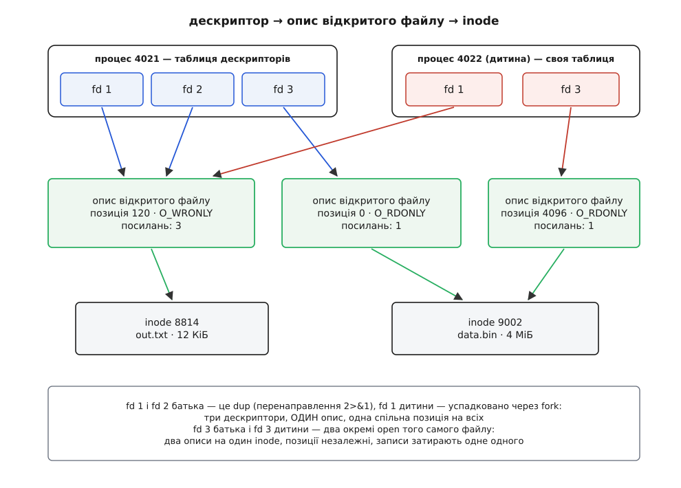
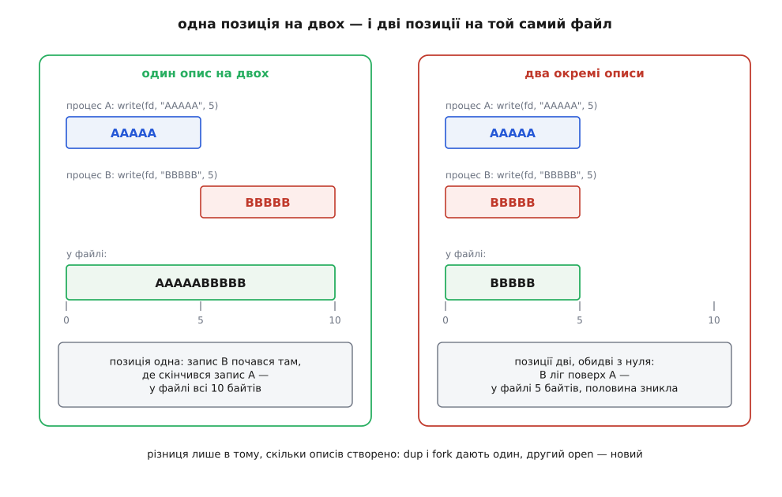
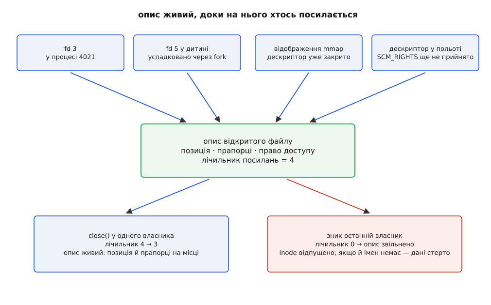

# Опис відкритого файлу: що спільне після fork

<preknowlist>
- [Файловий дескриптор](topic:sys-unix/file-descriptor) — мале ціле число, індекс у таблиці процесу, через яке процес читає й пише.
- [fork: розмноження процесу](topic:sys-unix/fork-semantics) — дитина дістає копію таблиці дескрипторів батька.
- [Inode: файл без імені](topic:sys-unix/inode-model) — вміст файлу й метадані живуть окремо від імені в каталозі.
- [Системний виклик](topic:sys-unix/syscall-mechanics) — як програма передає керування ядру й чим це відрізняється від виклику функції.
- [Підрахунок посилань](topic:sf-lang/reference-counting) — об'єкт живе доти, доки на нього хтось посилається, і зникає, коли останній відпустив.
</preknowlist>

Дві команди оболонки, які на позір роблять те саме — складають увесь вивід програми в один файл:

```sh
prog > out.txt 2>&1
prog > out.txt 2> out.txt
```

Перша складає в `out.txt` увесь вивід — і звичайний, і помилки — рядок за рядком, нічого не гублячи. Друга дає покалічений файл: шматки тексту затирають одне одного, кінець рядка обривається серединою іншого, а сумарний розмір менший за те, що програма насправді написала. При цьому обидві команди відкривають той самий файл, обидві пишуть у нього з тієї самої програми, обидві використовують ті самі два дескриптори — 1 і 2.

Отже, різниця не в файлі й не в дескрипторах. Різниця в тому, **що саме стоїть між ними** — і скільки цього «між» створено.

## Що ядро мусить пам'ятати після open

Розберімо, що взагалі відбувається під час `open`. Програма подає ядру шлях і набір побажань, ядро розбирає шлях, знаходить [inode](topic:sys-unix/inode-model), перевіряє права — і повертає невелике ціле число, [дескриптор](topic:sys-unix/file-descriptor). Далі програма каже `read(fd, buf, 100)`, і ядро мусить звідкись знати щонайменше три речі, яких у самому виклику немає.

**Перше — з якого місця читати.** У `read` немає позиції: є дескриптор, буфер і кількість байтів. Значить, позицію пам'ятає ядро, і кожне читання її посуває.

**Друге — чи взагалі можна читати.** Права перевіряють один раз, під час `open`, а не на кожному `read`. Це не економія, а свідоме рішення з наслідками: якщо файл відкрито, а потім у нього забрали права або й саме ім'я, читання далі працює. Отже, ядро мусить пам'ятати, **на що саме дозвіл дано** — на читання, на запис, чи на те й те.

**Третє — як поводитися при роботі.** Чи дописувати завжди в кінець (`O_APPEND`), чи повертати помилку замість очікування, коли даних немає (`O_NONBLOCK`), чи обходити кеш сторінок (`O_DIRECT`). Це не властивості файлу — це властивості **цього відкриття**: та сама програма може відкрити той самий файл двічі, один раз для неквапливого послідовного читання, другий — неблокуючим.

Усі три речі з'явилися в момент `open`, живуть рівно доти, доки триває це відкриття, і зникають із його закриттям. Питання лише одне: **де саме їх тримати**.

## Три можливі місця — і чому годиться лише третє

Місць, куди можна покласти позицію й прапорці, рівно три, і кожне дає свою систему.

**Місце перше — в елементі таблиці дескрипторів.** Тоді позиція належить дескрипторові й нікому більше. `dup` створив другий дескриптор — у нього своя позиція; `fork` скопіював таблицю — у дитини свої позиції. Виглядає охайно, аж поки не спробуєш злити два потоки в один файл. Саме це й показує друга команда з початку: дескриптори 1 і 2 отримали по власній позиції, обидві на нулі, і кожен запис одного лягає поверх записаного іншим. Схема, у якій **два потоки виводу неможливо звести в один файл**, неприйнятна для системи, побудованої на складанні програм із дрібних частин.

**Місце друге — в inode.** Тоді позиція одна на файл, і всі, хто його відкрив, її ділять. Тепер `prog > out.txt 2> out.txt` працює — але ціною значно гіршою. Два цілком незнайомі процеси, що незалежно відкрили один журнал для читання, зрушували б позицію одне одному; редактор, який перечитує файл із початку, збивав би читання чужій програмі. Стан **одного** відкриття протікав би в **усі** інші.

Обидві крайності хибні тим самим: вони прив'язують стан не до того, чого він насправді стосується. Позиція — це не властивість процесу (інакше `dup` був би марний) і не властивість файлу (інакше сторонні заважали б одне одному). Позиція — властивість **акту відкриття**: одного конкретного «я відкрив цей файл ось так».

Звідси й третє місце, єдине правильне: **окремий об'єкт у ядрі, який створює кожен `open` і на який можуть посилатися кілька дескрипторів**. Він народжується під час відкриття, зберігає позицію, режим доступу й прапорці, тримає зв'язок з inode — і вмирає, коли на нього перестали посилатися. У POSIX його називають **описом відкритого файлу** (англ. *open file description*), у коді Linux — `struct file`.

Тут одразу треба розвести два слова, бо їх плутають постійно і плутають небезпідставно: «дескриптор» і «опис» походять від того самого латинського кореня (*describere* — описувати). Але позначають вони різні поверхи. **Дескриптор** — мале число, індекс у таблиці процесу; він належить процесові й нічого в собі не тримає, крім посилання. **Опис** — структура в ядрі, спільна на всіх, хто на неї посилається; саме в ній лежать позиція й прапорці. Дескриптор — це не файл і не опис, це **ім'я посилання на опис**.

Середній поверх не є пізнішим ускладненням: він стоїть у системі від самого початку — в Unix шостої редакції це була таблиця на сотню записів на всю машину, з лічильником посилань і позицією в кожному. Звідки вона там узялася й чому назва «опис відкритого файлу» з'явилася лише зі стандартом, розказано окремо: [історія таблиці файлів](topic:sys-unix/open-file-description/hist-file-table.md).

## Три поверхи

Виходить триповерхова будівля, і кожен поверх відповідає на своє питання.



*Дескриптор належить процесові, позиція — відкриттю, вміст — файлу; стрілки «багато до одного» на обох переходах і дають усю поведінку.*

**Елемент таблиці дескрипторів** належить процесові й містить дві речі: покажчик на опис і прапорець `FD_CLOEXEC`. Більше нічого. Те, що цей прапорець живе тут, а не поверхом нижче, — не дрібниця: він каже «закрити **цей** дескриптор під час [заміни образу](topic:sys-unix/exec-semantics)», тобто стосується запису в таблиці, а не самого відкриття. Один дескриптор може бути позначений на закриття, а другий, що веде на той самий опис, — ні.

**Опис відкритого файлу** належить відкриттю. У ньому: поточна позиція; режим доступу (читання, запис або обидва) — незмінний від народження до смерти опису; прапорці стану — `O_APPEND`, `O_NONBLOCK`, `O_DIRECT`, `O_SYNC` та інші; лічильник посилань; покажчик на inode (точніше, на елемент каталогу й точку монтування, через які файл дістали); набір операцій, яким його обслуговує конкретна файлова система чи драйвер; знімок повноважень того, хто відкривав.

Знімок повноважень варто зрозуміти окремо, бо він пояснює, чому режим доступу незмінний. Права перевірено один раз — під час `open`, за облікового запису й можливостей того, хто відкривав. Опис відтоді **сам є доказом** цього дозволу: тримати опис із режимом на запис означає мати право писати, і жодна пізніша зміна прав файлу цього не скасує. Якби режим доступу можна було переставити викликом на вже відкритому описі, дозвіл на читання перетворювався б на дозвіл на запис без жодної перевірки. Тому `fcntl(F_SETFL)` у Linux уміє змінити лише `O_APPEND`, `O_ASYNC`, `O_DIRECT`, `O_NOATIME` і `O_NONBLOCK` — тобто те, що описує **поведінку** роботи, а не **право** на неї.

**Inode** належить файловій системі. Вміст, розмір, часи, права, лічильник імен — усе, що є в файлі незалежно від того, відкривав його хтось чи ні.

Розкладка «що на якому поверсі» має точну межу, і плутанина в ній коштує дорого: `F_SETFD` працює з елементом таблиці, `F_SETFL` — з описом, `fstat` — з inode, і кожен виклик відповідно зачіпає різне коло тих, хто це побачить. Повний перелік — прапорці, операції, поля `fdinfo` — зібрано в довідці: [контракт дескриптора й опису](topic:sys-unix/open-file-description/api-fd-vs-ofd.md).

> 🔧 **Навіщо це.** Знімок повноважень в описі — механізм, на якому тримається спуск привілеїв: службова програма стартує з правами root, відкриває журнал і порт, а потім переходить у непривілейованого користувача. Відкриті описи лишаються дійсними, бо дозвіл уже вбудований у них; при цьому програма більше не може відкрити нічого нового. З того самого механізму виростає й передача дескриптора між процесами — разом з описом мандрує саме право, а не шлях, який одержувач мусив би відкривати сам.

## Хто з ким ділиться описом

Тепер відповідь на питання «що спільне» стає механічною. Досить пам'ятати одне: **новий опис створює лише відкриття**. Усі інші дії тільки додають посилання на вже наявний.

- `open`, `creat`, `socket`, `pipe`, `accept`, `openat` — **новий опис**. Двічі відкрив той самий файл — два незалежні описи, дві незалежні позиції.
- `dup`, `dup2`, `dup3`, `fcntl(F_DUPFD)` — **той самий опис**, новий елемент таблиці. Саме це робить `2>&1`.
- [`fork`](topic:sys-unix/fork-semantics) — таблиця дескрипторів копіюється поелементно, але копіюються **покажчики**. Дитина ділить з батьком усі описи, які були відкриті на момент розгалуження.
- [`exec`](topic:sys-unix/exec-semantics) — таблиця переживає заміну образу цілком, крім позначених `FD_CLOEXEC`. Описи ті самі: нова програма прокидається з уже налаштованим виводом.
- [Потоки](topic:sys-unix/threads-as-tasks) одного процесу ділять саму таблицю дескрипторів, а отже — і всі описи.
- Передача дескриптора через [сокет домену Unix](topic:sys-unix/unix-domain-sockets) повідомленням `SCM_RIGHTS` дає **той самий опис** двом процесам, які не мають між собою жодної родинної спорідненості. Одержувач дістає інший номер дескриптора, але ту саму позицію, ті самі прапорці й те саме право доступу.

Останній пункт добре показує, чим опис є насправді: не «спадком від батька», а самостійним об'єктом ядра, посилання на який можна передати кому завгодно.

## Спільна позиція

Найпомітніший наслідок — один на всіх покажчик читання-запису. Побачмо його на байтах.

**Умова: два процеси пишуть по 5 байтів у той самий щойно створений файл.** Ліворуч — спільний опис (одержаний через `dup2` або успадкований після `fork`), праворуч — два незалежні `open` того самого файлу.

```
спільний опис                     два описи
────────────────                  ──────────────
позиція = 0                       позиція A = 0, позиція B = 0
A пише "AAAAA" → позиція = 5      A пише "AAAAA" → позиція A = 5
B пише "BBBBB" → позиція = 10     B пише "BBBBB" → позиція B = 5

файл: AAAAABBBBB   (10 байтів)    файл: BBBBB   (5 байтів)
```

Праворуч запис B ліг поверх запису A, бо його позиція нічого не знала про чужий запис. Розмір файлу — 5 байтів замість 10; половина даних просто зникла. Це і є доля другої команди з початку.



*Позиція — не властивість того, хто пише, а властивість відкриття; коли відкриттів два, писарі не бачать одне одного.*

Той самий дослід у коді — його можна запустити й перевірити самому. Дитина після розгалуження успадковує опис, тому її запис лягає за батьковим, а не поверх:

```c
#include <fcntl.h>
#include <stdio.h>
#include <sys/wait.h>
#include <unistd.h>

int main(void) {
    int fd = open("shared.txt", O_WRONLY | O_CREAT | O_TRUNC, 0644);
    if (fd < 0) {
        perror("open");
        return 1;
    }
    write(fd, "AAAAA", 5);          /* позиція опису: 0 → 5 */

    pid_t pid = fork();
    if (pid == 0) {
        write(fd, "BBBBB", 5);      /* та сама позиція: 5 → 10 */
        printf("дитина бачить позицію %lld\n", (long long)lseek(fd, 0, SEEK_CUR));
        fflush(stdout);             /* _exit не зливає буфери stdio */
        _exit(0);
    }
    wait(NULL);
    printf("батько бачить позицію %lld\n", (long long)lseek(fd, 0, SEEK_CUR));
    return 0;
}
```

Обидва рядки надрукують `10`, хоч батько після розгалуження нічого не писав: `lseek` питає позицію не в процеса, а в описі, а опис один. Замініть `fork` на другий `open` того самого файлу — і позиції розійдуться, а файл стане коротшим. Повний набір таких вимірів — з `dup`, з двома відкриттями, з передачею дескриптора через сокет і з перевіркою спільности описів у ядра — зібрано в досліді [хто з ким ділить позицію](topic:sys-unix/open-file-description/proj-shared-offset.md).

Спільна позиція — не побічний ефект, а робочий інструмент. На ній тримається все перенаправлення в оболонці: `2>&1` тому й пише обидва потоки в один файл без плутанини, що ставить дескриптор 2 на **той самий опис**, який уже має дескриптор 1. Так само два процеси можуть по черзі вичерпувати один вхідний потік без жодної домовленості між собою — кожне читання посуває спільну позицію, тож ніхто не прочитає той самий байт двічі ([перенаправлення як робота з дескрипторами](topic:sys-unix/redirection-model)).

Постає розумний сумнів: якщо позиція одна, а писати можуть двоє одночасно, чи не зіпсують вони її самі — прочитавши одне значення й записавши поверх іншого? Ядро цього не допускає: з 2014 року (ядро 3.14) `read`, `write` і `lseek` беруть на час роботи окремий замок позиції в описі, якщо на опис посилається більш ніж один дескриптор. Тобто позиція оновлюється **атомарно**, і після двох одночасних записів по 5 байтів у файлі буде рівно 10 байтів, а не 5 і не 15. Проте атомарність позиції — не атомарність самого запису: великий `write` у звичайний файл ядро може виконати не за один прийом, і два таких записи здатні перемішатися вмістом. Гарантії тут різні для різних об'єктів — у каналу свій поріг неподільного запису ([канали й іменовані канали](topic:sys-unix/pipe-and-fifo)).

## Прапорці теж спільні

Позиція — очевидна частина опису, прапорці — менш очевидна й тому підступніша. `fcntl(fd, F_SETFL, ...)` міняє прапорці **опису**, а не дескриптора, отже — для всіх дескрипторів у всіх процесах, що на нього посилаються.

Класична пастка виглядає так. Програма хоче читати з термінала не блокуючись і ставить `O_NONBLOCK` на дескриптор 0. Дескриптор 0 їй дала оболонка — успадкованим через `fork`, тобто це той самий опис, яким користується сама оболонка й усі інші програми в цьому терміналі. Програма завершується, не знявши прапорця; оболонка читає рядок, дістає замість очікування помилку `EAGAIN`, не знає, що з нею робити, і в найкращому разі виводить щось на кшталт «read error», а в гіршому виходить, закриваючи сеанс. Виправлення — не в кмітливості обробки помилок, а в тому, щоб узагалі не міняти чужий опис: зробити `dup` не досить (це той самий опис), потрібне **власне відкриття** — наприклад, `open("/dev/tty", O_RDONLY | O_NONBLOCK)` ([блокуючий і неблокуючий режим](topic:sys-unix/blocking-and-nonblocking)).

> 🔧 **Навіщо це.** Правило для бібліотек, які дістають дескриптор ззовні: **прапорці опису — не твої**. Бібліотека, що ставить `O_NONBLOCK` на переданий їй дескриптор, міняє поведінку коду, про який нічого не знає, — і в іншому процесі теж. Якщо режим потрібен саме тобі, відкривай своє; якщо мусиш змінити чуже — знімай зміну перед поверненням і пам'ятай, що між зміною та зняттям чужий код може встигнути прочитати.

## Скільки живе опис

Опис не належить нікому окремо, тому його час життя визначає лічильник посилань: він зникає, коли зникло **останнє** посилання, і не раніше.



*Закриття одного дескриптора не закриває файл — воно лише зменшує лічильник; поки хтось посилається, опис живий разом із позицією та прапорцями.*

Посилання дають: кожен елемент таблиці дескрипторів, що на нього вказує (у будь-якому процесі); [відображення пам'яті](topic:sys-unix/mmap-model), зроблене з цього опису, — воно тримає його навіть після `close`; повідомлення `SCM_RIGHTS`, яке вже надіслано, але ще не прийнято, — дескриптор «у польоті» рахується. Тому `close(fd)` не означає «файл закрито». Означає рівно одне: цей номер у цьому процесі більше не веде на опис. Файл закрито тоді, коли лічильник опису впав до нуля.

Нижче стоїть другий лічильник — уже в inode, і саме сполучення двох дає найвідомішу властивість Unix. Файл зникає з диска, коли **і** імен на нього не лишилося (`i_nlink` = 0), **і** описів немає. Тому `rm` на відкритому файлі прибирає ім'я, а не дані: програма далі читає й пише в inode, якого вже немає в жодному каталозі, а місце звільниться тільки після її завершення. Звідси й типове здивування адміністратора, коли `du` каже, що місце вільне, а `df` — що диска немає: десь живе процес із відкритим описом на видалений журнал ([жорсткі й символьні посилання](topic:sys-unix/hard-and-symbolic-links)).

Кількість описів у системі не безмежна: скільки їх усього відкрито й яка стеля, показує `/proc/sys/fs/file-nr`, а верхню межу задає `fs.file-max`. Це стеля **на всю систему**, окрема від межі кількости дескрипторів на процес ([ліміти ресурсів](topic:sys-unix/resource-limits)).

## Як не ділити позицію, коли ділити не треба

Спільна позиція корисна, коли писарі свідомо йдуть в один потік. Коли ні — потрібен спосіб її обійти, і способів рівно три, кожен зі своєю ціною.

**Окреме відкриття.** Найпростіше: свій `open` — свій опис — своя позиція. Ціна — повторна перевірка прав і повторний розбір шляху, а ще ризик, що за цей час шлях уже вказує на інший файл.

**`O_APPEND`.** Прапорець опису, який каже: перед кожним записом перевести позицію в кінець файлу, і зробити це **неподільно з самим записом**. Неподільність тут забезпечує ядро на рівні inode, тому вона працює й між незалежними описами: десять процесів, кожен зі своїм `open(..., O_APPEND)`, дописують у спільний журнал, не затираючи одне одного. Саме тому `prog >> out.txt 2>> out.txt` дає цілий файл, тоді як варіант з `>` — покалічений. Межі гарантії варто знати: вона тримається на локальній файловій системі й ламається на [мережевій](topic:sys-unix/network-filesystems), де «перевести в кінець і записати» стають двома окремими зверненнями до сервера.

**`pread` і `pwrite`.** Тут позиція взагалі не бере участи: її передають аргументом, а позиція опису лишається незрушеною. Це єдиний спосіб для кількох потоків одного процесу читати різні частини файлу через один дескриптор — `lseek` плюс `read` тут не годяться, бо між ними інший потік встигне переставити спільну позицію.

```c
/* безпечно з кількох потоків: позиція опису не зачеплена */
ssize_t n = pread(fd, buf, len, offset);
```

У `pwrite` є одна відома пастка, специфічна для Linux: якщо опис відкрито з `O_APPEND`, `pwrite` **ігнорує переданий зсув** і все одно дописує в кінець. POSIX вимагає протилежного, у документації Linux це зафіксовано як розбіжність. Тому дескриптор, яким користуються через `pwrite`, не відкривають з `O_APPEND`.

## Опис як особа: замки

Найкращий доказ того, що опис — самостійний об'єкт, а не технічна дрібниця, дає історія файлових замків. Замків у Linux три види, і різняться вони саме тим, **до чого прив'язані**.

`flock` прив'язує замок до **опису**. Отже, замок переходить дитині через `fork` і копії через `dup`, а знімається, коли зникає останнє посилання на опис. Два незалежні `open` того самого файлу — два описи — можуть блокувати одне одного навіть усередині одного процесу.

Замки записів `fcntl(F_SETLK)`, ті, що прийшли зі стандарту POSIX, прив'язані до пари «процес + inode» — і саме тут стандарт помилився так, що це стало підручниковим прикладом. Замок знімається, щойно процес закриє **будь-який** дескриптор на цей файл, навіть той, яким замок не брали й який відкрила чужа бібліотека для одного `stat`. Крім того, потоки одного процесу не можуть блокувати одне одного: для замка вони — один власник.

Латка з'явилася 2014 року: Джефф Лейтон (Red Hat) додав у ядро 3.15 замки, прив'язані до **опису відкритого файлу** — `F_OFD_SETLK` і його родичі. Вони поводяться передбачувано: успадковуються через `fork`, переживають закриття інших дескрипторів, знімаються з останнім посиланням на опис. Показово навіть те, як їх назвали: у першій версії патча вони звалися «file-private locks», і саме під час обговорення назву змінили на «open file description locks» — бо об'єкт, до якого вони прив'язані, уже мав ім'я в стандарті. Порівняння трьох видів замків, їхніх гарантій і поведінки в мережевих файлових системах — окрема тема: [блокування файлів](topic:sys-unix/file-locking).

## Як побачити описи на живій системі

Модель перевіряється, а не береться на слово. Каталог `/proc/<pid>/fdinfo/` показує вміст опису з погляду конкретного дескриптора: рядок `pos` — поточна позиція, `flags` — прапорці вісімковим числом, `mnt_id` — точка монтування ([/proc: процеси як файли](topic:sys-unix/proc-reading-process-and-kernel-state)).

```sh
$ cat /proc/self/fdinfo/1
pos:    0
flags:  0100002
mnt_id: 28
```

Однакові числа в двох дескрипторів, однак, **не доводять**, що опис спільний: два незалежні відкриття щойно створеного файлу дадуть однакову нульову позицію й ті самі прапорці. Питання «це один опис чи два» має точну відповідь лише від ядра: системний виклик `kcmp` з типом порівняння `KCMP_FILE` (з'явився в ядрі 3.5) відповідає саме на нього — для двох дескрипторів у двох процесах.

Є ще одна тонкість, на якій легко спіткнутися. Шлях `/proc/<pid>/fd/N` виглядає як «той самий дескриптор», і `ls -l` навіть показує його як посилання на файл. Але `open` цього шляху — це **звичайне нове відкриття**: виходить новий опис із власною позицією, а не доступ до чужого. Дістати саме той опис можна лише посиланням — успадкуванням, `dup` або передачею через сокет. Читання ж `/proc/<pid>/fd/N` без відкриття (`readlink`) віддає ім'я файлу, до якого веде опис, — і це, серед іншого, спосіб побачити ім'я вже видаленого файлу з позначкою `(deleted)`.

Незручність тут не випадкова, і причина в самій будові: **опис не має імені у просторі користувача**. Процес називає його номером у своїй таблиці, ядро тримає його вказівником, стандарт дає йому термін — але окремого способу «звернутися до опису номер такий-то» не існує, бо він не належить нікому, крім тих, хто на нього посилається.

## Три поверхи — три власники

Три рівні існують не тому, що комусь захотілося зайвої непрямої адресації, а тому, що в грі три різні власники з трьома різними часами життя. Дескриптором володіє процес — і дескриптор зникає з `close` або з `exec`. Описом володіє **акт відкриття** — і опис живе, доки бодай хтось на нього посилається, байдуже в якому процесі. Вмістом володіє файлова система — і inode живе, доки є ім'я або відкриття.

Звідси й спосіб міркувати про будь-яку несподіванку з файлами: спитати, **на якому поверсі живе те, про що йдеться**, і хто ще має до нього посилання. Позиція поїхала сама собою — шукай, хто ще посилається на цей опис. Прапорець вплинув на чужу програму — той самий пошук. Місце на диску не звільнилося — шукай опис, що тримає inode без імені. А поведінка, у якій дві сусідні команди оболонки різняться цілістю файлу, перестає бути химерією: `2>&1` дає одне посилання на один опис, `2> out.txt` — два описи, і далі все виходить саме.
