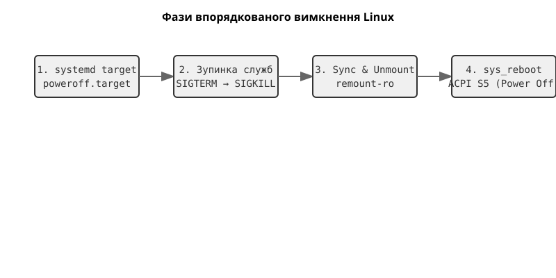

# Впорядковане вимкнення: як система зупиняється

<preknowlist>
- [Модель сигналів](root:sys-unix/signal-model) — процесові надсилають номерне сповіщення; `SIGTERM` можна перехопити й обробити, `SIGKILL` — ні.
- [Тривкість page cache](root:sys-unix/page-cache-durability) — записані дані спершу лежать брудними сторінками в пам'яті, а на носій потрапляють пізніше.
- [Роль init і особливість PID 1](root:sys-unix/init-and-pid1) — процес номер 1 є предком усіх служб і живе стільки ж, скільки система.
</preknowlist>

Натискання кнопки живлення на корпусі комп'ютера або введення команди `poweroff` у терміналі здається миттєвою та простою дією. Однак під капотом розгортається складна і критично важлива драма. Уявіть сучасну серверну систему: працюють сотні демонів, відкриті тисячі мережевих з'єднань, а в оперативній пам'яті лежать гігабайти незбережених даних баз даних і системних буферів. Якщо просто вимкнути живлення, файлові системи будуть пошкоджені, транзакції баз даних обірвані, а незбережені конфігурації втрачені назавжди. Тому операційна система не просто "вимикається" — вона виконує **впорядковане вимкнення** (orderly shutdown), складний багатоетапний процес, який гарантує збереження консистентності даних та безпечне відключення апаратури.

У цій статті ми розберемо анатомію процесу вимкнення Linux, від моменту ініціалізації до апаратного відключення живлення (ACPI S5).



*Вимкнення проходить чотирма фазами зліва направо: systemd активує `poweroff.target`, зупиняє служби парою `SIGTERM` → `SIGKILL`, потім скидає кеші на диск і відмонтовує файлові системи, і лише тоді передає керування ядру, яке гасить живлення. Порядок незворотний: кожна наступна фаза припускає, що попередня вже завершилася.*

## Ініціатор вимкнення та цілі systemd

Процес вимкнення зазвичай ініціюється командою користувача (`shutdown`, `poweroff`, `halt`, `reboot`) або апаратною подією (натискання кнопки ACPI або сигнал від ДБЖ). У сучасних Linux-системах, що використовують systemd, ці команди насправді є символічними посиланнями на утиліту `systemctl`, яка передає запит процесу PID 1 (самому systemd). Запит не обов'язково виконується негайно: програма, яка робить щось непереривне (пише образ на диск, шиє прошивку), може заздалегідь взяти в `systemd-logind` блокування й відкласти вимкнення — [як це робиться](root:sys-unix/orderly-shutdown/proj-shutdown-inhibitor.md).

Коли systemd отримує команду на вимкнення, він активує спеціальну ціль — `poweroff.target` (або `reboot.target` у разі перезавантаження). Ця ціль має жорстко задані конфлікти (Conflicts) з майже всіма працюючими службами. Оскільки `poweroff.target` не може співіснувати з працюючими сервісами, systemd починає агресивно, але впорядковано, зупиняти їх.

Зупинка відбувається у **зворотному порядку** відносно їхнього запуску. Наприклад, якщо під час завантаження веб-сервер стартував після бази даних (бо залежить від неї), то під час вимкнення веб-сервер буде зупинено першим, щоб він міг коректно закрити з'єднання з базою, перш ніж та буде зупинена.

Так було не завжди: у класичному SysVinit вимкнення виконував лінійний набір скриптів, які йшли один за одним і вбивали процеси за іменами, тож один завислий скрипт зупиняв усю процедуру. Звідки systemd узяв нинішній порядок — [окремо](root:sys-unix/orderly-shutdown/hist-sysvinit-to-systemd-shutdown.md).

## Фаза завершення процесів: SIGTERM та SIGKILL

Коли systemd вирішує зупинити конкретну службу (unit), він керується її конфігурацією. Процес зупинки демона складається з кількох етапів:

1. **М'яка зупинка (`SIGTERM`)**: systemd надсилає головному процесу служби (і, за замовчуванням, усій контрольній групі `cgroup`) сигнал `SIGTERM`. Цей сигнал каже процесу: "Будь ласка, заверши свою роботу". Коректно написані демони перехоплюють цей сигнал, припиняють приймати нові запити, зберігають стан на диск, закривають мережеві з'єднання і завершуються (exit).

2. **Очікування (`TimeoutStopSec`)**: PID 1 не чекатиме вічно. Якщо процес "завис" або ігнорує `SIGTERM`, systemd чекає певний час, визначений параметром `TimeoutStopSec` (зазвичай 90 секунд за замовчуванням).

3. **Жорстке вбивство (`SIGKILL`)**: Якщо таймаут сплив, а процес усе ще живий, systemd надсилає всім залишкам `cgroup` сигнал `SIGKILL`. Цей сигнал неможливо перехопити або проігнорувати — ядро негайно видаляє процес із пам'яті. Це запобігає нескінченному "зависанню" системи під час вимкнення.

Приклад конфігурації юніта systemd, що керує поведінкою зупинки:

```ini
[Service]
ExecStart=/usr/bin/my-critical-db
# Спеціальна команда для зупинки (опціонально)
ExecStop=/usr/bin/my-critical-db-admin shutdown
# Час очікування перед SIGKILL
TimeoutStopSec=120
# Який сигнал надсилати для м'якої зупинки (за замовчуванням SIGTERM)
KillSignal=SIGINT
```

## Фаза ядра та файлових систем: Sync та Unmount

Після того як усі процеси користувацького простору (user space) завершено, залишається лише сам PID 1 та ядро. Тепер настає критичний момент забезпечення цілісності даних.

1. **Синхронізація (Sync)**: Усі дані, що знаходяться в оперативній пам'яті (page cache) і очікують на запис на диск (dirty pages), повинні бути негайно скинуті на фізичні носії. Виконується системний виклик `sync()`.
2. **Відмонтування (Unmount)**: Усі примонтовані файлові системи відмонтовуються (`umount`). Це гарантує, що журнали файлових систем закриті чисто і не потребуватимуть відновлення (fsck) при наступному завантаженні.
3. **Перехід у Read-Only (Remount RO)**: Деякі файлові системи (наприклад, коренева `/`) не завжди можливо відмонтувати повністю, оскільки на них знаходяться бінарники, потрібні для самого процесу вимкнення. У такому разі PID 1 перемонтовує їх у режим "тільки для читання" — викликом `mount()` із прапорцем `MS_RDONLY`. Будь-які спроби запису блокуються.

## Апаратне вимкнення: системний виклик `reboot` і ACPI

Останній крок виконується самим ядром. Коли PID 1 закінчує підготовку, він робить системний виклик `reboot()` із [магічними числами](root:sys-unix/orderly-shutdown/api-reboot-syscall.md) — двома константами, без яких ядро відмовиться виконувати виклик, — та відповідною командою (наприклад, `LINUX_REBOOT_CMD_POWER_OFF`).

Цей системний виклик наказує ядру припинити планування завдань і звернутися до апаратного забезпечення:

1. Драйвери пристроїв отримують сповіщення про вимкнення і переводять пристрої в енергоощадний або вимкнений стан (вимкнення жорстких дисків, зупинка мережевих карт).
2. Ядро через інтерфейс ACPI (Advanced Configuration and Power Interface) надсилає материнській платі команду перейти в стан `S5` (Soft Off). 
3. Материнська плата фізично вимикає лінії живлення ATX (відключає сигнал PS_ON), і вентилятори зупиняються. Комп'ютер вимкнено.

```c
#include <unistd.h>
#include <sys/reboot.h>

int main() {
    // В ідеальному світі це єдине, що робить система наприкінці
    // Для виклику потрібні root-права (CAP_SYS_BOOT)
    sync(); // Скинути кеші
    reboot(RB_POWER_OFF); // Апаратне вимкнення
    return 0; // Сюди виконання ніколи не дійде
}
```

## Висновок

Процес вимкнення — це складно зрежисована послідовність дій, спрямована від високорівневих служб користувача до низькорівневих апаратних контролерів. Розуміння цього процесу дозволяє адміністраторам налаштовувати правильні таймаути для баз даних, а розробникам — писати демони, які коректно реагують на `SIGTERM`, зберігаючи дані користувачів у безпеці під час кожної зупинки сервера.
