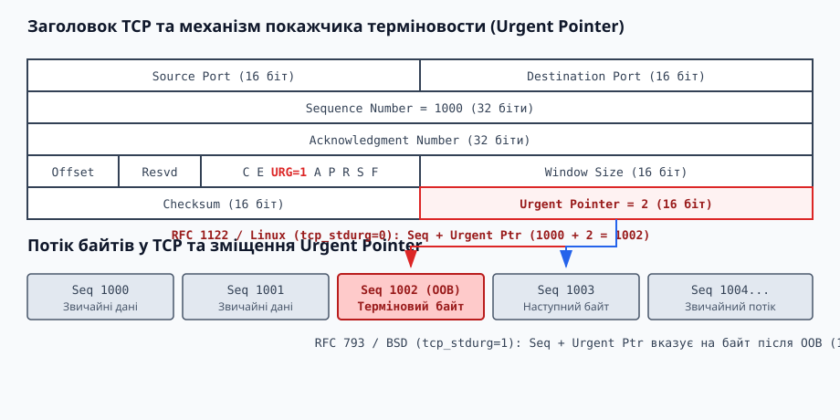
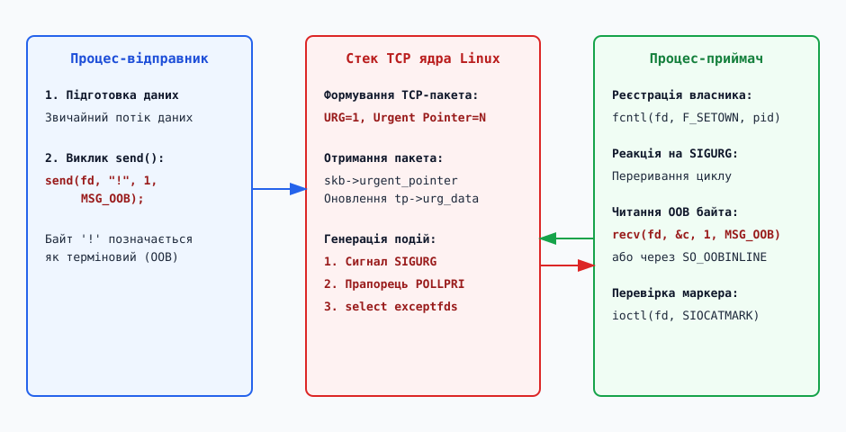

# Термінові дані TCP: покажчик терміновости, MSG_OOB і SIGURG

<preknowlist>
- [Стек мережі Linux: від NIC до сокета](root:sys-unix/network-stack-architecture) — шлях мережевого пакета через драйвер, NAPI та буфери `sk_buff`.
- [Сокетний API у Linux](root:sys-unix/socket-api-linux) — створення сокетів, системні виклики `send`/`recv` та опції сокетів.
</preknowlist>

Передача великого файла через мережу заповнює сокетні буфери ядра тисячами пакетів. Якщо користувач у цей момент натискає комбінацію клавіш скасування або надсилає команду аварійної зупинки сервера, ця команда потрапляє в кінець вхідної черги сокета. У класичному потоковому протоколі TCP, де всі байти обробляються суворо послідовно (First-In, First-Out), програма-приймач прочитає команду скасування лише після того, як вичитає й обробить усі попередні мегабайти даних.

Для розв'язання цієї проблеми в опису протоколів зв'язку виникла концепція *позасмугової передачі даних* (out-of-band data, OOB). Вона передбачає існування логічного або фізичного "швидкісного каналу", який дозволяє передати сигнальне повідомлення вбік від основного потоку. У цій статті ми детально розглянемо, як протокол TCP реалізує позасмугові дані через *покажчик терміновости* (Urgent Pointer), як ядро Linux керує цим станом у структурі `struct tcp_sock`, як працює сокетний API (`MSG_OOB`, `SO_OOBINLINE`, `SIOCATMARK`), чому асинхронне сповіщення через сигнал `SIGURG` вимагає призначення власника сокета та чому специфікація RFC 6093 визнала цей механізм застарілим у сучасних мережевих архітектурах.

---

## 1. Проблема позасмугового сигналу: чому потоковий сокет потребує тривожної кнопки

У телекомунікаціях сигнали управління традиційно ділять на внутрішньосмугові (in-band) та позасмугові (out-of-band). При внутрішньосмуговій сигналізації команди й користувацькі дані ділять один і той самий канал і чергу; при позасмуговій — керуючі команди проходять окремим фізичним провідником або логічним високоешелонованим пріоритетом.

Історичним прикладом позасмугової сигналізації у дротовому зв'язку є інтерфейс RS-232, де для передачі даних використовувалися лінії `TXD` та `RXD`, а для апаратного управління потоком виділялися окремі фізичні провідники `RTS` (Request to Send) та `CTS` (Clear to Send). На відміну від програмного управління потоком за допомогою управляючих символів `XON`/`XOFF` (внутрішньосмугова сигналізація), зміна напруги на провіднику `RTS` зупиняла передачу миттєво, незалежно від заповнення буферів прийому. Схожий принцип використовувався у телефонних мережах загального користування (SS7 — Signaling System No. 7), де службовий трафік встановлення та розриву з'єднання проходив окремими виділеними мережами.

TCP (Transmission Control Protocol) є байт-орієнтованим потоковим протоколом. З точки зору додатка, сокет являє собою дві незахищені черги байтів — вхідну та вихідну. Коли клієнт відправляє дані викликом `send()`, ядро копіює їх у буфер надсилання сокета (`sk_write_queue`). Мережевий стек розбиває цей потік на TCP-сегменти, присвоює кожному байту послідовний номер (Sequence Number) і відправляє їх мережею. На стороні приймача ядро збирає сегменти у вхідному буфері (`sk_receive_queue`) і віддає їх додатку під час викликів `read()` або `recv()`.

```
Звичайний потік TCP (FIFO черга у буфері sk_receive_queue):
+-------+-------+-------+-------+-------+-------+
| Byte1 | Byte2 | Byte3 | Byte4 | Byte5 | Byte6 | ---> Read Queue (Користувач)
+-------+-------+-------+-------+-------+-------+
```

Якщо додаток генерує критичний сигнал (наприклад, термінал Telnet надсилає переривання `IAC IP` при натисканні `Ctrl+C`, або клієнт FTP відправляє команду `ABOR` для зупинки передачі файла), відправка цього сигналу як звичайного байта у кінець черги не спрацює. Якщо буфер приймача містить 2 мегабайти невичитаних даних (налаштування `/proc/sys/net/ipv4/tcp_rmem`), команда зупинки чекатиме, поки процес прочитає всі 2 мегабайти.

Справжній позасмуговий канал вимагав би відкриття окремого мережевого з'єднання або виділення окремого порту. Проте розробники TCP обрали гібридний шлях: замість створення окремого TCP-з'єднання вони впровадили в існуючий заголовок TCP механізм **позначення терміновості** (Urgent Mechanism).

---

## 2. Анатомія TCP-заголовка: прапорець URG та покажчик терміновости (Urgent Pointer)

Заголовок TCP має мінімальний розмір 20 байтів. Серед його полів є 6 класичних управляючих бітів (прапорців) та 16-бітне поле, присвячене терміновим даним.

```
 0                   1                   2                   3
 0 1 2 3 4 5 6 7 8 9 0 1 2 3 4 5 6 7 8 9 0 1 2 3 4 5 6 7 8 9 0 1
+-+-+-+-+-+-+-+-+-+-+-+-+-+-+-+-+-+-+-+-+-+-+-+-+-+-+-+-+-+-+-+-+
|          Source Port          |        Destination Port       |
+-+-+-+-+-+-+-+-+-+-+-+-+-+-+-+-+-+-+-+-+-+-+-+-+-+-+-+-+-+-+-+-+
|                        Sequence Number                        |
+-+-+-+-+-+-+-+-+-+-+-+-+-+-+-+-+-+-+-+-+-+-+-+-+-+-+-+-+-+-+-+-+
|                     Acknowledgment Number                     |
+-+-+-+-+-+-+-+-+-+-+-+-+-+-+-+-+-+-+-+-+-+-+-+-+-+-+-+-+-+-+-+-+
|  Data | Resv  |C|E|U|A|P|R|S|F|          Window Size          |
| Offset|       |W|C|R|C|S|S|Y|I|                               |
|       |       |R|E|G|K|H|T|N|N|                               |
+-+-+-+-+-+-+-+-+-+-+-+-+-+-+-+-+-+-+-+-+-+-+-+-+-+-+-+-+-+-+-+-+
|            Checksum           |         Urgent Pointer        |
+-+-+-+-+-+-+-+-+-+-+-+-+-+-+-+-+-+-+-+-+-+-+-+-+-+-+-+-+-+-+-+-+
```

Для активації термінового режиму використовуються два елементи заголовка:

1. **Прапорець URG (Urgent Flag):** 1-бітне поле в управляючому байті. Значення `1` вказує приймачу, що сегмент містить термінові дані і поле `Urgent Pointer` є дійсним.
2. **Покажчик терміновости (Urgent Pointer):** 16-бітне беззнакове ціле число. Воно виражає **позитивне зміщення** (offset) від порядкового номера (`Sequence Number`) цього TCP-сегмента до байта термінових даних.


*Структура заголовка TCP: прапорець URG активує поле Urgent Pointer, яке задає зміщення в потоці sequence numbers.*

Коли стековий модуль TCP приймає сегмент із прапорцем `URG = 1`, він негайно обчислює абсолютний порядковий номер термінового байта в загальному потоці sequence numbers:

```
Urgent_Sequence_Number = Segment_Sequence_Number + Urgent_Pointer
```

Розглянемо числовий приклад. Нехай поточний TCP-сегмент має порядковий номер `Sequence Number = 5000`. Усередині корисного навантаження пакета розміром 100 байтів відправник позначив останній байт як терміновий команду переривання. Заголовок містить `URG = 1` та `Urgent Pointer = 100`. 

Модуль TCP ядра приймача обчислює:
```
Urgent_Sequence_Number = 5000 + 100 = 5100
```

Коли сегмент із `URG = 1` прибуває до ядра приймача, стек TCP інформує прикладну програму про те, що в потоці з'явився маркер терміновості. Сам байт продовжує рухатися в загальному потоці, але ядро запам'ятовує його позицію і переводить сокет у спеціальний стан сповіщення.

---

## 3. Архітектурний розкол специфікацій: RFC 793 проти RFC 1122 та параметр `tcp_stdurg`

Найбільшою практичною проблемою механізму термінових даних TCP стала розбіжність у тексті двох основоположних специфікацій IETF щодо того, на що саме вказує `Urgent Pointer`.

У первинному стандарті **RFC 793** (1981 р.) було написано:

> "The urgent pointer points to the sequence number of the octet following the urgent data."

Згідно з цим первинним формулюванням (RFC 793), якщо порядковий номер сегмента дорівнює `1000`, а терміновий байт знаходиться за зміщенням `2` (тобто байт з номером sequence `1002`), значення `Urgent Pointer` має дорівнювати `3` (вказуючи на перший байт *після* термінових даних, тобто `1003`).

Проте під час створення реалізації сокетів у BSD UNIX (4.2BSD) інженери припустилися помилки і витлумачили специфікацію так, ніби `Urgent Pointer` повинен вказувати безпосередньо **на останній байт самих термінових даних**. Тобто для термінового байта з порядковим номером `1002` у BSD-стеку відправлялося значення `Urgent Pointer = 2` (`1000 + 2 = 1002`).

У 1989 році специфікація **RFC 1122** спробувала стандартизувати поведінку і підтвердила чітку інструкцію: покажчик має вказувати на байт *після* термінових даних (RFC 793). Проте на той час код 4.2BSD вже був скопійований у більшість комерційних операційних систем (SunOS, HP-UX, Windows Sockets). Виправлення помилки зламало б мережеву сумісність між різними ОС.

```
Обчислення Urgent Pointer для байта Seq=1002 (при Segment Seq=1000):

Стандарт RFC 793 / RFC 1122:   Urgent Pointer = 3  (вказує на Seq 1003, після OOB)
Реалізація BSD / Windows:       Urgent Pointer = 2  (вказує на Seq 1002, на OOB)
```

З детальною хронологією цієї стандартизаційної війни та її наслідками для безпеки мереж можна ознайомитися у матеріалі [📜 Еволюція термінових даних TCP: від RFC 793 до RFC 6093](root:sys-unix/out-of-band-data/hist-rfc-793-to-6093.md).

### Системне налаштування Linux: `tcp_stdurg`

Щоб забезпечити сумісність із масовим ПЗ BSD-походження і водночас відповідати строгим вимогам RFC, ядро Linux підтримує глобальний параметр у файловій системі procfs:

```
/proc/sys/net/ipv4/tcp_stdurg
```

- `0` **(значення за замовчуванням):** Стек Linux використовує інтерпретацію **BSD**. Покажчик терміновости розглядається як зміщення безпосередньо до останнього байта термінових даних.
- `1` **(строгий режим RFC 1122):** Покажчик розглядається як зміщення до байта, що йде за терміновими даними.

Зміна значення здійснюється утилітою `sysctl`:

```bash
sysctl net.ipv4.tcp_stdurg=1
```

У вихідному коді ядра Linux (`net/ipv4/tcp_input.c`) обчислення зміщення виглядає наступним чином:

```c
/* Обчислення urg_seq у ядрі Linux */
static void tcp_urg(struct sock *sk, struct sk_buff *skb, const struct tcphdr *th)
{
    struct tcp_sock *tp = tcp_sk(sk);
    u32 ptr = ntohs(th->urg_ptr);

    if (ptr && !sock_net(sk)->ipv4.sysctl_tcp_stdurg)
        ptr--; // Зсув на 1 байт для режиму BSD (tcp_stdurg=0)

    tp->urg_seq = TCP_SKB_CB(skb)->seq + ptr;
    tp->urg_data = TCP_URG_VALID;
}
```

---

## 4. Внутрішня механіка ядра Linux: `struct tcp_sock` та обробка `sk_buff`

Усередині ядра Linux мережевий сокет TCP описується структурою `struct tcp_sock` (яка розширює базові `struct inet_connection_sock` та `struct sock`). Обробка термінових даних спирається на кілька спеціальних полів у цієї структурі:

```c
struct tcp_sock {
    /* ... */
    u32    urg_seq;     /* Порядковий номер (Sequence Number) OOB-байта */
    u32    copied_seq;  /* Порядковий номер останнього вичитаного додатком байта */
    u16    urg_data;    /* Прапорець валидності та значення байта (TCP_URG_VALID / TCP_URG_NOTVAL) */
    u8     urg_mode;    /* 1 якщо сокет перебуває в режимі обробки термінових даних */
    /* ... */
};
```

Коли мережевий пакет прибуває до системи, нижній шар стека загортає його в структуру `struct sk_buff`. Якщо заголовок TCP містить прапорець `URG = 1`, функція ядра `tcp_urg()` виконує наступні кроки:

1. **Обчислення абсолютного порядкового номера:** Ядро вираховує `urg_seq = seq + ptr - !sysctl_tcp_stdurg`.
2. **Перевірка відносно вже прочитаного:** Якщо `urg_seq` менше за `copied_seq`, це означає, що терміновий байт вже пройдено і прочитано як звичайні дані. Прапорець ігнорується.
3. **Оновлення маркера сокета:** Якщо `urg_seq` знаходиться попереду поточного прочитання, ядро зберігає нове значення `urg_seq` у структурі `struct tcp_sock`, встановлює `urg_mode = 1` і зберігає терміновий байт у полі `urg_data`.
4. **Сповіщення підсистеми I/O:** Ядро відправляє сигнал `SIGURG` процесу-власнику сокета та пробуджує потоки, які очікують подій на сокеті в `poll()` або `select()`.

```
Вхідна черга сокета (sk_receive_queue) у ядрі Linux:
+-------------------+----------------+--------------------+
|  Normal Data Skb  | Urgent Data    |  Normal Data Skb   |
|  Seq: 1000..1001  | Seq: 1002 (U)  |  Seq: 1003..2000   |
+-------------------+----------------+--------------------+
                           ^
                           |
                   tp->urg_seq = 1002
```

### Обмеження єдиного маркера (Overwrite Limitation)

Важливим обмеженням архітектури TCP є те, що структура `struct tcp_sock` зберігає **лише один маркер терміновості** (`urg_seq`). 

Якщо відправник викликає `send(fd, "A", 1, MSG_OOB)`, а потім негайно викликає `send(fd, "B", 1, MSG_OOB)` до того, як приймач вичитав перший байт, ядро оновлює `urg_seq` на порядковий номер байта `'B'`. Байт `'A'` втрачає статус термінового і залишається у вхідному буфері як звичайний байт. 

Таким чином, механізм OOB у TCP підходить лише для поодиноких сигнальних команд, а не для потокової передачі пріоритетних масивів.

---

## 5. Інтерфейс системних викликів: MSG_OOB, SO_OOBINLINE та SIOCATMARK

Простір користувача взаємодіє з позасмуговими даними за допомогою трьох механізмів: прапорців викликів `send`/`recv`, опції сокета `SO_OOBINLINE` та команди `ioctl(SIOCATMARK)`.

### 5.1. Відправлення та приймання через MSG_OOB

Для відправки термінових даних додаток викликає `send()` із прапорцем `MSG_OOB`:

:::tabs
```c
char cmd = 'C'; // Команда скасування (Cancel)
ssize_t res = send(sockfd, &cmd, 1, MSG_OOB);
if (res < 0) {
    perror("send MSG_OOB");
}
```
```cpp
#include <sys/socket.h>
#include <system_error>

char cmd = 'C';
if (::send(sockfd, &cmd, 1, MSG_OOB) < 0) {
    throw std::system_error(errno, std::generic_category(), "send MSG_OOB failed");
}
```
:::

За замовчуванням (`SO_OOBINLINE = 0`) терміновий байт вилучається із загального вхідного потоку і зберігається в буфері `urg_data`. Для його вичитання приймач повинен викликати `recv()` із прапорцем `MSG_OOB`:

:::tabs
```c
char oob_byte;
ssize_t n = recv(sockfd, &oob_byte, 1, MSG_OOB);
if (n > 0) {
    printf("Отримано терміновий байт: %c\n", oob_byte);
} else if (n < 0) {
    if (errno == EAGAIN || errno == EWOULDBLOCK) {
        // OOB байт ще не дістався ядра
    }
}
```
```cpp
#include <sys/socket.h>
#include <system_error>
#include <iostream>

char oob_byte = 0;
ssize_t n = ::recv(sockfd, &oob_byte, 1, MSG_OOB);
if (n > 0) {
    std::cout << "Отримано терміновий байт: " << oob_byte << "\n";
} else if (n < 0 && (errno != EAGAIN && errno != EWOULDBLOCK)) {
    throw std::system_error(errno, std::generic_category(), "recv MSG_OOB failed");
}
```
:::

### 5.2. Режим SO_OOBINLINE

Якщо додаток не бажає обробляти термінові байти окремим викликом `recv(MSG_OOB)`, він може увімкнути опцію сокета `SO_OOBINLINE`:

:::tabs
```c
int optval = 1;
setsockopt(sockfd, SOL_SOCKET, SO_OOBINLINE, &optval, sizeof(optval));
```
```cpp
int optval = 1;
if (::setsockopt(sockfd, SOL_SOCKET, SO_OOBINLINE, &optval, sizeof(optval)) < 0) {
    throw std::system_error(errno, std::generic_category(), "setsockopt SO_OOBINLINE failed");
}
```
:::

При ввімкненому `SO_OOBINLINE` терміновий байт **залишається у звичайному потоці даних**. Програма вичитає його звичайним викликом `read()` або `recv()` без прапорця `MSG_OOB`. Якщо при цьому спробувати викликати `recv(..., MSG_OOB)`, ядро поверне помилку `EINVAL`.

### 5.3. Перевірка позиції маркера: ioctl(SIOCATMARK)

При вичитанні звичайного потоку даних (особливо в режимі `SO_OOBINLINE`) програмі важливо знати, чи дійшло читання безпосередньо до термінового байта. Для цього використовується системний виклик `ioctl()` із командою `SIOCATMARK`:

:::tabs
```c
#include <sys/ioctl.h>

int atmark = 0;
if (ioctl(sockfd, SIOCATMARK, &atmark) == 0) {
    if (atmark) {
        printf("Наступний байт є терміновим маркером OOB!\n");
    }
}
```
```cpp
#include <sys/ioctl.h>
#include <system_error>
#include <iostream>

int atmark = 0;
if (::ioctl(sockfd, SIOCATMARK, &atmark) < 0) {
    throw std::system_error(errno, std::generic_category(), "ioctl SIOCATMARK failed");
}
if (atmark != 0) {
    std::cout << "Наступний байт є терміновим маркером OOB!\n";
}
```
:::

З повним довідником системних викликів, опцій сокета та повернених помилок можна ознайомитися у матеріалі [📋 Довідник системних викликів, опцій сокета та прапорців OOB](root:sys-unix/out-of-band-data/api-oob-socket-options.md).

---

## 6. Асинхронне сповіщення процесу: сигнал SIGURG та процес-власник F_SETOWN

Прибуття термінових даних має переривати нормальну роботу програми. Для цього ядро Linux генерує асинхронний сигнал `SIGURG` (Signal Urgent).

Проте після створення сокета ядро не знає, якому саме процесу надсилати сигнал `SIGURG`, оскільки дескриптор сокета може бути дубльований через `fork()` чи переданий між процесами через UNIX-сокет.


*Послідовність подій: відправник формує пакет з URG=1, ядро сповіщає процес-власник через SIGURG та POLLPRI, після чого приймач вичитає OOB байт.*

### 6.1. Призначення власника сокета через fcntl(F_SETOWN)

Щоб ядро знало адресата сигналу `SIGURG`, процес повинен зареєструвати свій PID як власника сокета за допомогою `fcntl()`:

:::tabs
```c
#include <fcntl.h>
#include <unistd.h>

// Встановлюємо поточний процес власником сокета
if (fcntl(sockfd, F_SETOWN, getpid()) < 0) {
    perror("fcntl F_SETOWN");
}
```
```cpp
#include <fcntl.h>
#include <unistd.h>
#include <system_error>

if (::fcntl(sockfd, F_SETOWN, ::getpid()) < 0) {
    throw std::system_error(errno, std::generic_category(), "fcntl F_SETOWN failed");
}
```
:::

Якщо передати від'ємне значення PID (наприклад, `-pgid`), ядро надсилатиме сигнал `SIGURG` усій групі процесів.

### 6.2. Внутрішньоядерне відправлення сигналів

Коли стек TCP обробляє сегмент із `URG = 1`, викликається внутрішня функція ядра `sk_send_sigurg()`:

```c
void sk_send_sigurg(struct sock *sk)
{
    if (sk->sk_socket && sk->sk_socket->file) {
        if (fown_empty(&sk->sk_socket->file->f_owner))
            return;
        /* Надсилання SIGURG процесу чи групі процесів, зареєстрованих у f_owner */
        send_sigurg(&sk->sk_socket->file->f_owner);
    }
}
```

### 6.3. Обережність у сигнальних обробниках (Async-Signal Safety)

Обробник сигналу `SIGURG` запускається асинхронно, перериваючи виконання основної програми у довільній точці. Усередині обробника дозволено викликати лише асинхронно-безпечні функції (Async-Signal-Safe Functions).

Усі виклики функцій форматованого виводу (`printf`, `std::cout`), виділення пам'яті (`malloc`, `operator new`) або складні сокетні операції усередині обробника `SIGURG` можуть призвести до взаємного блокування (deadlock) чи пошкодження кучі. Правильний підхід полягає у вичитанні OOB-байта за допомогою низькорівневого виклику `recv()` і встановленні атомарного прапорця (`volatile sig_atomic_t` або `std::atomic`).

---

## 7. Мультиплексування вхідних подій: select, poll (POLLPRI) та epoll (EPOLLPRI)

У сучасних високопродуктивних серверах використання асинхронних сигналів вважається небажаним через складність їх безпечної обробки у багатопотокових середовищах. Замість сигналів прибуття термінових даних відстежують через стандартні системні виклики мультиплексування I/O.

| Виклик I/O | Прапорець / Набір | Опис реакції на термінові дані |
| :--- | :--- | :--- |
| `select()` | `exceptfds` (третій масив дескрипторів) | Сокет додається у маску `exceptfds`. При отриманні сегмента `URG=1` виклик `select()` повертає готовність дескриптора в цьому наборі. |
| `poll()` | `events = POLLPRI` | Прибуття OOB-даних повертає прапорець `POLLPRI` (Priority Data) у полі `revents`. |
| `epoll()` | `events = EPOLLPRI` | Цикл подій `epoll_wait()` отримує подію `EPOLLPRI`. |

Використання `poll()` дозволяє обробляти як звичайні дані (`POLLIN`), так і термінові байти (`POLLPRI`) в єдиному циклі подій event-loop:

:::tabs
```c
#include <poll.h>

struct pollfd fds[1];
fds[0].fd = sockfd;
fds[0].events = POLLIN | POLLPRI;

int ret = poll(fds, 1, -1);
if (ret > 0) {
    if (fds[0].revents & POLLPRI) {
        char oob_byte;
        recv(sockfd, &oob_byte, 1, MSG_OOB);
        printf("Отримано OOB через poll(POLLPRI): %c\n", oob_byte);
    }
    if (fds[0].revents & POLLIN) {
        // Читання звичайних даних
    }
}
```
```cpp
#include <poll.h>
#include <array>
#include <iostream>

std::array<pollfd, 1> fds{};
fds[0].fd = sockfd;
fds[0].events = POLLIN | POLLPRI;

int ret = ::poll(fds.data(), fds.size(), -1);
if (ret > 0) {
    if (fds[0].revents & POLLPRI) {
        char oob_byte = 0;
        ::recv(sockfd, &oob_byte, 1, MSG_OOB);
        std::cout << "Отримано OOB через poll(POLLPRI): " << oob_byte << "\n";
    }
    if (fds[0].revents & POLLIN) {
        // Читання звичайних даних
    }
}
```
:::

Повний приклад обробки OOB-даних у реальному TCP-сервері та клієнті розібрано у практичному матеріалі [⚙️ Практикум: обробка OOB даних за допомогою SIGURG та poll()](root:sys-unix/out-of-band-data/proj-oob-handling.md).

---

## 8. Мережева безпека, обхід IDS/IPS та уразливості

Позасмугові дані TCP стали джерелом численних проблем безпеки в історії мережевих систем.

### 8.1. Обхід систем виявлення вторгнень (NIDS Evasion)

У 1990-х та 2000-х роках аналізатори мережевого трафіку (NIDS Snort, брандмауери) перехоплювали TCP-пакети і відновлювали потік для пошуку сигнатур атак.

Оскільки NIDS часто реалізовували суворий стандарт RFC 1122, а цільові сервери під управлінням Linux або BSD працювали у режимі BSD (`tcp_stdurg = 0`), виникав розкол у трактуванні даних. Зловмисник відправляв пакет із прапорцем `URG`, де терміновий байт містив "сміття".

- NIDS вважав терміновим байт №3 і вважав, що сервер його пропустить.
- Сервер Linux вважав терміновим байт №2 і вилучав саме його.

У результаті потік байтів, відтворений у пам'яті NIDS, відрізнявся від потоку байтів, прочитаного цільовим додатком на 1 байт. Це дозволяло безперешкодно проводити експлойти повз будь-які брандмауери.

```
Потік байтів у мережі: [A] [B] [C] [D] [E]
Зміщення URG:          Ptr = 2

Сприйняття NIDS (RFC 1122):    Вилучає байт 'C' (Seq+3) -> Залишок: A B D E
Сприйняття Linux (BSD style):   Вилучає байт 'B' (Seq+2) -> Залишок: A C D E
```

### 8.2. Атаки WinNuke та приховані канали (Covert Channels)

У 1997 році була виявлена знаменита уразливість **WinNuke** у мережевому стеку Windows 95 / NT 4.0. Відправка одного TCP-пакета з прапорцем `URG` на порт NetBIOS (139) викликала паніку ядра операційної системи й миттєвий "синій екран смерті" (BSOD). Причиною була відсутність перевірки меж буфера при обробці покажчика терміновості у драйвері `TCPIP.SYS`.

Крім того, 16-бітне поле `Urgent Pointer` при `URG = 0` інколи використовувалося для створення прихованих каналів витоку даних (Covert Channels): стеганографія ховала тайні ключі або команди стеження у невідображувані поля TCP-заголовків.

---

## 9. Чому OOB застарів: аналіз RFC 6093 та сучасні альтернативи

Після 30 років експлуатації стало очевидно, що механізм Urgent Pointer у TCP виявився невдалим інженерним рішенням.

### 9.1. Причини деградації механізму

1. **Тупик закритого вікна (Zero-Window Deadlock):** Якщо приймач вичерпав буфер читання, він відправляє ACK із `Window Size = 0`. Згідно зі специфікацією TCP, відправник **не має права надсилати нові байти даних**, навіть якщо вони позначені `MSG_OOB`. Отже, терміновий сигнал не може пробитися крізь заблокований TCP-потік.
2. **Нівелювання Middlebox-пристроями:** Сучасні мережеві маршрутизатори, NAT-шифрувальники та брандмауери часто обнуляють прапорець `URG` або очищають `Urgent Pointer` для захисту від NIDS-атак.
3. **Обмеження одного байта:** Неможливість надіслати структуру або командний рядок через OOB без ризику перезапису маркера.

### 9.2. Офіційне визнання застарілим: RFC 6093

У травні 2011 року IETF випустила документ **RFC 6093** (*"On the Implementation of the TCP Urgent Mechanism"*), який підбив риску під історією `MSG_OOB`:

- **Нові протоколи:** Суворо заборонено використовувати TCP Urgent Pointer у нових прикладних протоколах.
- **Існуючі протоколи:** Рекомендовано відмовлятися від `MSG_OOB` на користь альтернативних архітектурних рішень.
- **Розробники ОС:** Рекомендовано зберігати код `tcp_urg` виключно як спадщину для зворотної сумісності зі старими утилітами Telnet/FTP.

### 9.3. Сучасні альтернативні паттерни

У сучасній розробці розподілених систем замість позасмугових даних TCP застосовують наступні підходи:

1. **Окреме керуюче з'єднання (Control Plane Connection):** Створення двох незалежних TCP-сокетів — один для масивного потоку даних (Data Channel), другий для команд управління (Control Channel). Цей підхід використовується в прохідних протоколах, базах даних та gRPC.
2. **Фреймінг та мультиплексування потоків:** Протоколи вищого рівня, такі як **HTTP/2**, **HTTP/3** та **QUIC**, розбивають потік на логічні кадри (Frames) із пріоритетами. Керуючі кадри (`PING`, `SETTINGS`, `RST_STREAM`) передаються всередині того самого з'єднання, але обробляються з найвищим пріоритетом на рівні парсера протоколу.

---

## 10. Підсумкове порівняння та висновки

Порівняльний аналіз механізмів передачі термінових сигналів у мережевих протоколах:

| Критерій | TCP Urgent Pointer (`MSG_OOB`) | Окреме TCP-з'єднання (Control Socket) | Мультиплексування HTTP/2 / QUIC |
| :--- | :--- | :--- | :--- |
| **Рівень реалізації** | Транспортний шар (L4, ядро ОС) | Прикладний шар (L7, сокети) | Прикладний / Транспортний шар (QUIC) |
| **Обсяг термінових даних** | Фактично 1 байт | Необмежений | Необмежений (кадри `RST_STREAM`/`PRIORITY`) |
| **Проходження Zero-Window** | Блокується при Window=0 | Проходить (окреме вікно TCP) | Проходить (окремий код потоку) |
| **Безпека та NIDS** | Схильний до NIDS Evasion атак | Повністю прозорий для аналізу | Захищений TLS-шифруванням |
| **Статус стандартизації** | **Застарілий (RFC 6093)** | Стандартна практика | Сучасний стандарт (RFC 9113 / RFC 9000) |

Механізм термінових даних TCP (`MSG_OOB`, `SIGURG`, `SO_OOBINLINE`) є важливою віхою в історії мережевого програмування UNIX. Він продемонстрував спробу реалізувати позасмугове управління на рівні транспортного стека ядра. Розуміння роботи покажчика терміновості, сигнальної системи `F_SETOWN` та виклику `SIOCATMARK` необхідне для підтримки системного коду та розуміння архітектурних компромісів ядра Linux. Проте в сучасній розробці надійне позасмугове управління будується шляхом розділення керуючих і інформаційних каналів на окремі TCP-з'єднання або використання протоколів із мультиплексованими потоками.
