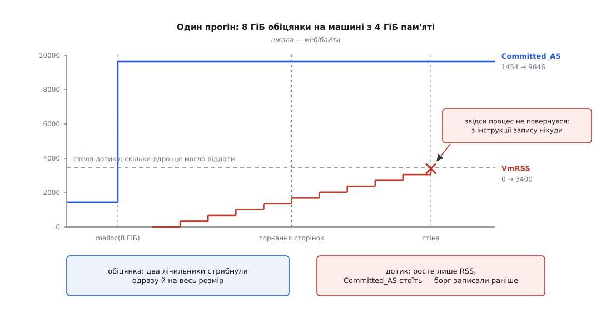

# ⚙️ Помацати обіцянку: лабораторія на власній машині

Одна програма на C, яка бере вісім гігабайтів на чотиригігабайтній машині, а потім крок за кроком перетворює цю обіцянку на справжні сторінки — щоб щілину між «дали адреси» і «дали пам'ять» ви побачили в числах, які зняли самі, а не прочитали в чужій статті.

Читати про те, що `malloc` роздає неіснуюче, легко. Повірити в це по-справжньому вдається тоді, коли на екрані стоїть свіжий вказівник на вісім гігабайтів, поруч нуль резидентних сторінок, а машина навіть не помітила запиту. І остаточно — коли той самий прогін через півхвилини уривається на середині рядка, і після нього в консолі лишається одне слово `Killed`.

## Де це запускати, щоб не втратити роботу

Програма свідомо доводить систему до вичерпання пам'яті. Глобальний OOM-killer шукає жертву по всій машині за розміром, і ваш редактор, що тримає півтора гігабайти, — цілком гідний кандидат; загинути може не лабораторія, а сеанс.

Тому: або віртуалька, яку не шкода, або — і це краще — контрольна група зі стелею, у якій вибір жертви обмежений самою групою:

```sh
$ systemd-run --user --scope -p MemoryMax=1G -p MemorySwapMax=0 ./promise wall --size 8
```

Усередині такої групи катастрофа локальна: гине те, що в ній запущено, решта машини події не помічає ([що таке контрольні групи й чому облік ведеться на групу](root:sys-unix/cgroups-resource-model)). Якщо ж ви все-таки на голій машині — запускайте з `--adj 1000`, це піднімає власний бал програми так, що обрати когось іншого ядро вже не зможе.

## П'ять чисел, з яких усе видно

Уся лабораторія тримається на п'яти лічильниках, і кожен тут не випадковий.

Три перші — про сам процес, із `/proc/self/status` ([як `/proc` віддає стан ядра текстом](root:sys-unix/proc-reading-process-and-kernel-state)). `VmSize` — увесь адресний простір, тобто сума обіцянок цього процесу. `VmRSS` — резидентні сторінки, тобто те, що справді видано. `VmSwap` — сторінки, які вже виперли на диск.

Два інші — про машину, з `/proc/meminfo`. `Committed_AS` — сума обіцянок усіх процесів разом. `MemAvailable` — оцінка ядра, скільки пам'яті ще можна віддати новій програмі, не заганяючи систему у своп.

Пари підібрані навмисно. `VmSize` і `Committed_AS` рухаються на роздачі адрес; `VmRSS` і `MemAvailable` — на дотику до сторінок. Якщо тримати їх в одному рядку, різницю між обіцянкою і платежем видно без жодних пояснень.

```c
/* promise.c — лабораторія overcommit: обіцянка, дотик, стіна.
   Збірка:  cc -O2 -std=gnu11 -o promise promise.c
   Запуск:  ./promise <режим> [опції]

   режими   reserve   узяти обіцянку й спинитися
            touch     торкатися шматками з паузою
            wall      торкатися без пауз — до кінця

   опції    --size G      розмір обіцянки, ГіБ      (типово 8)
            --step M      крок торкання, МіБ        (типово 256)
            --pause MS    пауза між кроками, мс     (типово 0)
            --noreserve   mmap із MAP_NORESERVE замість malloc
            --calloc      calloc замість malloc
            --read        читати замість писати
            --release     після кожного кроку віддавати щойно взяте
            --limit-as G  RLIMIT_AS перед обіцянкою, ГіБ
            --adj N       записати N у /proc/self/oom_score_adj          */
#define _GNU_SOURCE
#include <errno.h>
#include <fcntl.h>
#include <stdint.h>
#include <stdio.h>
#include <stdlib.h>
#include <string.h>
#include <time.h>
#include <unistd.h>
#include <sys/mman.h>
#include <sys/resource.h>

#define MIB (1024UL * 1024)
#define GIB (1024UL * MIB)

static size_t pgsz;               /* справжній розмір сторінки цієї машини */

/* Значення рядка «Ключ:  ЧИСЛО kB» у /proc-файлі; -1, якщо ключа нема. */
static long field_kb(const char *path, const char *key)
{
    FILE *f = fopen(path, "re");           /* 'e' — O_CLOEXEC, розширення glibc */
    if (!f) return -1;
    const size_t klen = strlen(key);
    char line[256];
    long val = -1;
    while (fgets(line, sizeof line, f))
        if (!strncmp(line, key, klen) && line[klen] == ':') {
            val = strtol(line + klen + 1, NULL, 10);   /* пробіли strtol з'їсть сам */
            break;
        }
    fclose(f);
    return val;
}
```

Окремо — три числа групи, якщо ми в ній і стеля скінченна. Свій шлях у ієрархії процес знаходить сам: у `/proc/self/cgroup` для другої версії стоїть єдиний рядок вигляду `0::/шлях`, і цей шлях достатньо приклеїти до точки монтування.

```c
static char cgdir[512];                    /* порожньо — стелі групи нема */

static void cg_find(void)
{
    FILE *f = fopen("/proc/self/cgroup", "re");
    if (!f) return;
    char line[448];
    while (fgets(line, sizeof line, f))
        if (!strncmp(line, "0::", 3)) {                 /* «0::» — це cgroup v2 */
            line[strcspn(line, "\n")] = '\0';
            snprintf(cgdir, sizeof cgdir, "/sys/fs/cgroup%s", line + 3);
            break;
        }
    fclose(f);
}

/* Перше число з файла групи. -1, якщо файла нема або там слово «max». */
static long cg_num(const char *file)
{
    if (!cgdir[0]) return -1;
    char path[640];
    snprintf(path, sizeof path, "%s/%s", cgdir, file);
    FILE *f = fopen(path, "re");
    if (!f) return -1;
    long v;
    if (fscanf(f, "%ld", &v) != 1) v = -1;
    fclose(f);
    return v;
}

/* Лічильник із memory.events — рядки вигляду «ключ ЧИСЛО».
   Пробіл після ключа обов'язковий: інакше «oom» злапає «oom_kill». */
static long cg_event(const char *key)
{
    if (!cgdir[0]) return -1;
    char path[640], line[128];
    snprintf(path, sizeof path, "%s/memory.events", cgdir);
    FILE *f = fopen(path, "re");
    if (!f) return -1;
    const size_t klen = strlen(key);
    long v = -1;
    while (fgets(line, sizeof line, f))
        if (!strncmp(line, key, klen) && line[klen] == ' ') {
            v = strtol(line + klen + 1, NULL, 10);
            break;
        }
    fclose(f);
    return v;
}

static void cg_show(void)
{
    long max = cg_num("memory.max");       /* слово «max» → -1: стелі нема */
    if (max < 0) return;
    printf("  ||%8.1f/%.0f МіБ  впер=%ld oom=%ld",
           cg_num("memory.current") / (double) MIB, max / (double) MIB,
           cg_event("max"), cg_event("oom"));
}

/* Один рядок стану. Підпис стоїть ОСТАННІМ навмисно: printf рівняє поля
   за байтами, а не за знаками, і кирилиця в «%-16s» зсунула б колонки. */
static void snap(const char *tag)
{
    printf("%9.1f %9.1f %9.1f  ||%11.1f %11.1f",
           field_kb("/proc/self/status", "VmSize")     / 1024.0,
           field_kb("/proc/self/status", "VmRSS")      / 1024.0,
           field_kb("/proc/self/status", "VmSwap")     / 1024.0,
           field_kb("/proc/meminfo",     "Committed_AS") / 1024.0,
           field_kb("/proc/meminfo",     "MemAvailable") / 1024.0);
    cg_show();
    printf("   %s\n", tag);
}
```

## Крок перший: обіцянка

Тепер сама обіцянка. Вісім гігабайтів `malloc` у glibc бере не з купи, а прямим `mmap` — усе, що більше за поріг `M_MMAP_THRESHOLD`, іде в ядро окремим відображенням ([звідки алокатор бере пам'ять](root:sys-unix/allocator-and-kernel)). Тому різниця між нашими режимами `--noreserve` і звичайним `malloc` зводиться рівно до одного прапорця.

```c
enum how { H_MALLOC, H_CALLOC, H_NORESERVE };

static void *promise(size_t bytes, enum how how)
{
    void *p;
    if (how == H_NORESERVE)
        p = mmap(NULL, bytes, PROT_READ | PROT_WRITE,
                 MAP_PRIVATE | MAP_ANONYMOUS | MAP_NORESERVE, -1, 0);
    else
        p = (how == H_CALLOC) ? calloc(1, bytes) : malloc(bytes);

    if (!p || p == MAP_FAILED) {
        printf("обіцянка НЕ вдалася: %s\n", strerror(errno));
        return NULL;
    }
    printf("обіцянка = %p\n", p);
    return p;
}
```

Прогін на віртуалці з 4 ГіБ пам'яті, без свопу, з типовим `vm.overcommit_memory=0`:

```sh
$ ./promise reserve --size 8
сторінка 4096 Б, обіцянка 8.00 ГіБ, крок 256.00 МіБ
   VmSize     VmRSS    VmSwap  ||  Committed    MemAvail   подія
      4.6       1.2       0.0  ||     1454.3      3390.2   до обіцянки
обіцянка = 0x7f4c9e400010
   8196.6       1.2       0.0  ||     9646.3      3390.1   після обіцянки
```

Один рядок різниці, і в ньому все. `VmSize` виріс на 8192 МіБ, `Committed_AS` — рівно на стільки ж. `VmRSS` не змінився зовсім. `MemAvailable` не змінився теж — точніше, ворухнувся на десяту частку мебібайта, і то через сам процес читання.

Отже, обіцянка — це запис у двох бухгалтеріях: у власній книзі процесу й у спільній книзі машини. Жодна з них не є фізичною пам'яттю. Ядро не витратило нічого, крім кількох сотень байтів на опис нової ділянки, і машина з чотирьох гігабайтів пам'яті щойно погодилася на дев'ять з половиною роздачі.

Варто затримати погляд на `Committed_AS`: він виріс навіть у режимі 0, де жодної перевірки суми немає. Ядро веде рахунок обіцянкам завжди — питання лише в тому, чи дивиться воно в цей рахунок, коли вирішує.

## Крок другий: дотик

Тепер платимо. Обходимо буфер шматками по 256 МіБ, записуючи по одному байту в кожну сторінку, і після кожного шматка знімаємо ті самі п'ять чисел.

```c
static unsigned long sink;        /* щоб читання не виглядало марним */

static void touch(void *base, size_t bytes, size_t step, unsigned pause_ms,
                  int read_only, int release)
{
    volatile unsigned char *p = base;      /* без volatile запис можуть викинути */
    unsigned long acc = 0;
    char tag[48];

    for (size_t off = 0; off < bytes; off += step) {
        size_t end = off + step < bytes ? off + step : bytes;

        printf("%s @%.2f ГіБ …\n", read_only ? "читаю" : "пишу", off / (double) GIB);

        for (size_t i = off; i < end; i += pgsz)
            if (read_only) acc += p[i];    /* читання сторінки НЕ народить */
            else           p[i] = 0xA5;    /* запис — ось тут народить      */

        snprintf(tag, sizeof tag, "+%.2f ГіБ", end / (double) GIB);
        snap(tag);

        if (release) {                     /* madvise хоче адресу, вирівняну */
            uintptr_t a = ((uintptr_t) base + off + pgsz - 1) & ~(uintptr_t)(pgsz - 1);
            uintptr_t b = ((uintptr_t) base + end)            & ~(uintptr_t)(pgsz - 1);
            if (b > a) madvise((void *) a, b - a, MADV_DONTNEED);
        }
        if (pause_ms) {
            struct timespec ts = { pause_ms / 1000,
                                   (long)(pause_ms % 1000) * 1000000L };
            nanosleep(&ts, NULL);
        }
    }
    sink = acc;
}
```

Рядок «пишу @… ГіБ …» друкується **перед** дотиком навмисно — саме він стане останнім свідком, коли прогін урветься.

```sh
$ ./promise touch --size 8 --step 256 --pause 300
   VmSize     VmRSS    VmSwap  ||  Committed    MemAvail   подія
      4.6       1.2       0.0  ||     1454.3      3390.2   до обіцянки
обіцянка = 0x7f13aa000010
   8196.6       1.2       0.0  ||     9646.3      3390.1   після обіцянки
пишу @0.00 ГіБ …
   8196.6     257.4       0.0  ||     9646.3      3134.0   +0.25 ГіБ
пишу @0.25 ГіБ …
   8196.6     513.5       0.0  ||     9646.3      2878.2   +0.50 ГіБ
пишу @0.50 ГіБ …
   8196.6     769.6       0.0  ||     9646.3      2622.3   +0.75 ГіБ
пишу @0.75 ГіБ …
   8196.6    1025.7       0.0  ||     9646.3      2366.1   +1.00 ГіБ
```

Дивимося, що рухається. `VmRSS` росте рівно на крок. `MemAvailable` падає рівно на стільки ж. А `Committed_AS` **стоїть як укопаний** — і це головне спостереження всього досліду.

Обіцянку записали в борговій книзі один раз, при `malloc`. Дотик до сторінок нічого туди не додає: борг уже врахований, зараз його просто виплачують. Тому `Committed_AS` — не показник спожитої пам'яті й ніколи ним не був; це сума того, що система дозволила собі пообіцяти. Спожите міряють іншими числами, і кожне з них має свої вади ([VSZ, RSS і PSS: чим і що саме міряти](root:sys-unix/memory-accounting)).



*Дві криві одного прогону: синя стрибнула раз і завмерла, червона повзе вгору, і саме вона зустрічає стелю.*

Ще одна дрібниця, помітна вже тут: 256 мебібайтів «торкання» — це шістдесят п'ять тисяч записів по одному байту, і кожен коштує [збою сторінки](root:sf-os/page-fault). На око кроки виходять помітно повільніші за просте копіювання тієї ж кількості пам'яті — вартість тут не в байтах, а в переходах у ядро.

## Крок третій: стіна

Прибираємо паузи й доводимо до кінця.

```sh
$ ./promise wall --size 8 --step 256 --adj 1000
...
   8196.6    2818.9       0.0  ||     9646.3       571.4   +2.75 ГіБ
пишу @2.75 ГіБ …
   8196.6    3075.0       0.0  ||     9646.3       315.3   +3.00 ГіБ
пишу @3.00 ГіБ …
Killed
$ echo $?
137
```

Останній рядок виводу — «пишу @3.00 ГіБ …». Після нього нема нічого: ні повідомлення про помилку, ні коду повернення, ні рядка стану. Програма зайшла в цикл запису й не вийшла з нього.

Це і є та властивість, заради якої вся лабораторія затіяна. Помилку немає куди повернути: збій стався на інструкції `mov`, а не на системному виклику, і жодного каналу для «не вдалося» в неї не передбачено. Ядро не могло сказати «ні» — воно могло тільки вбити. Код `137` в оболонці — це `128 + 9`, тобто `SIGKILL`, сигнал, який [не можна ні перехопити, ні заблокувати](root:sys-unix/signal-model).

Вирок видно в журналі ядра:

```sh
$ journalctl -k -n 5 --no-hostname
kernel: promise invoked oom-killer: gfp_mask=0x140dca(...), order=0, oom_score_adj=1000
kernel: Out of memory: Killed process 1877 (promise) total-vm:8393872kB, anon-rss:3148800kB,
        file-rss:1408kB, shmem-rss:0kB, UID:1000 pgtables:6288kB oom_score_adj:1000
kernel: oom_reaper: reaped process 1877 (promise), now anon-rss:0kB, file-rss:0kB
```

`total-vm` — 8 ГіБ обіцянки; `anon-rss` — 3 ГіБ, які встигли матеріалізуватися. Різниця між цими двома числами і є та щілина, якою живе overcommit. А рядок `oom_reaper` каже, що сторінки забрали, не чекаючи, доки процес фактично помре.

Якщо `journalctl` мовчить, а `dmesg` без `sudo` каже «Operation not permitted» — увімкнено `kernel.dmesg_restrict`; читати доведеться з правами ([як журнал збирає повідомлення ядра](root:sys-unix/journald-structured-entry-model)).

## Ручки, що змінюють кінець тієї самої програми

Код нижче не міняється жодним рядком. Міняється система навколо нього — і кінець прогону щоразу інший.

**Суворий облік.** Перемикаємо ядро в режим 2, де сума обіцянок не сміє перевищити стелю:

```sh
$ sudo sysctl -w vm.overcommit_memory=2 vm.overcommit_ratio=90
$ ./promise reserve --size 8
обіцянка НЕ вдалася: Cannot allocate memory
$ sudo sysctl -w vm.overcommit_memory=0
```

Помилка прийшла з `malloc`, тобто в той єдиний момент, коли її взагалі є кому повернути. Повертати перемикач назад варто одразу: на машині з 4 ГіБ і без свопу стеля виходить близько 3.5 ГіБ, а роздано вже 1.45 — новим програмам стає тісно, і система починає відмовляти в найнесподіваніших місцях, аж до неможливости відкрити нове вікно термінала.

**Той самий ефект без прав root.** `RLIMIT_AS` ріже адресний простір одного процесу, і спрацьовує він там само — на воротах ([ліміти ресурсів на процес](root:sys-unix/resource-limits)):

```c
static void set_limit_as(size_t bytes)
{
    struct rlimit rl = { .rlim_cur = bytes, .rlim_max = bytes };
    if (setrlimit(RLIMIT_AS, &rl) < 0) perror("setrlimit(RLIMIT_AS)");
}
```

```sh
$ ./promise reserve --size 8 --limit-as 2
обіцянка НЕ вдалася: Cannot allocate memory
```

Дві незручності цього ліміту варто знати заздалегідь. Він рахує **весь** адресний простір, разом із бібліотеками, стеками потоків і аренами алокатора, — тому ставити його впритул до розміру буфера безглуздо, програма не встигне народитися. І він однаково ріже внутрішні виділення самої libc, тож після відмови навіть надрукувати повідомлення про помилку може не вдатися, якщо форматування вимагатиме пам'яті. Поруч живе `RLIMIT_DATA`, який від Linux 4.7 покриває вже й приватні анонімні відображення, а не самий лише `brk`, — тож на старших ядрах той самий ліміт поводиться інакше.

**Прохання не резервувати.** `MAP_NORESERVE` каже ядру: карта свідомо розріджена, не витрачай на неї стелю.

```sh
$ ./promise reserve --size 8 --noreserve
   8196.6       1.2       0.0  ||     1454.4      3390.1   після обіцянки
```

`VmSize` виріс, `Committed_AS` — ні. Обіцянку взято поза бухгалтерією. Але спробуйте те саме в режимі 2 — і `mmap` провалиться так само, як звичайний `malloc`: у режимі суворого обліку прапорець ігнорують. Прохання чинне доти, доки система й так роздає в борг.

**Вибір жертви.** Запустімо два примірники: маленький із максимальною поправкою і великий зі звичайним балом. Маленькому даємо паузи, щоб він дожив до розв'язки, а не встиг завершитися сам:

```sh
$ ./promise touch --size 1 --step 64 --pause 500 --adj 1000 &   # маленький
$ ./promise wall  --size 8 --step 256                           # великий
```

Гине маленький, хоч тримає він утричі менше. Поправка задана в проміле від усієї пам'яті машини, тож `+1000` додає до бала цілу машину — жоден чесний розмір цього не переважить. Запис у файл робиться так:

```c
/* Підняти значення може будь-хто; ЗНИЗИТИ — лише з CAP_SYS_RESOURCE. */
static void set_adj(int adj)
{
    char buf[16];
    int n = snprintf(buf, sizeof buf, "%d\n", adj);
    int fd = open("/proc/self/oom_score_adj", O_WRONLY | O_CLOEXEC);
    if (fd < 0) { perror("open oom_score_adj"); return; }
    if (write(fd, buf, (size_t) n) != n) perror("write oom_score_adj");
    close(fd);
}
```

Асиметрія прав тут не примха: піднімати власну вбиванність безпечно завжди, а знижувати — це просити систему пожертвувати кимось замість тебе.

**Стеля групи.** Найцікавіший із прогонів, бо в ньому видно те, чого не видно більше ніде: як група впирається в межу **до** вбивства.

```sh
$ systemd-run --user --scope -p MemoryMax=1G -p MemorySwapMax=0 \
      ./promise wall --size 8 --step 64
Running scope as unit: run-r91c4….scope
   8196.6      65.4       0.0  ||     9646.3      3324.7  ||    68.1/1024 МіБ  впер=0 oom=0   +0.06 ГіБ
   8196.6     641.2       0.0  ||     9646.3      2748.9  ||   644.0/1024 МіБ  впер=0 oom=0   +0.62 ГіБ
   8196.6     961.6       0.0  ||     9646.3      2428.4  ||   964.4/1024 МіБ  впер=3 oom=0   +0.94 ГіБ
пишу @0.94 ГіБ …
Killed
```

Лічильник `впер` — це поле `max` у `memory.events`: скільки разів група вже мала ось-ось перевищити стелю. Він почав рахувати за кілька кроків до смерті, поки ядро ще встигало відбирати сторінки в самої групи. Це вікно, у якому наглядач іще міг би зреагувати.

Після прогону лічильники лишаються в групі — але scope від `systemd-run` зникає разом із процесом, тож для розтину зручніша власноруч зроблена група:

```sh
$ sudo mkdir /sys/fs/cgroup/lab
$ echo 1G | sudo tee /sys/fs/cgroup/lab/memory.max
$ echo 0  | sudo tee /sys/fs/cgroup/lab/memory.swap.max
$ sudo sh -c 'echo $$ > /sys/fs/cgroup/lab/cgroup.procs; exec ./promise wall --size 8'
Killed
$ cat /sys/fs/cgroup/lab/memory.events
low 0
high 0
max 47
oom 1
oom_kill 1
```

`oom` — скільки разів група дійшла до стану, коли виділення мало провалитися; `oom_kill` — скільки задач у ній убито. Числа різні тому, що одна подія може вбити не одну задачу: з увімкненим `memory.oom.group` гине вся група разом.

## Пастки, через які дослід бреше

**`calloc` не торкається сторінок.** Спробуйте `--calloc` — і побачите, що після виділення восьми гігабайтів «занулених» байтів `VmRSS` лишився там само, де був. Свіже анонімне відображення від ядра й так приходить нульовим, тож glibc для великих запитів просто не викликає `memset`. Пам'ять «уже нульова», а сторінок під нею жодної.

**Компілятор має право викинути ваш запис.** Цикл, що пише в буфер, який ніхто потім не читає, не змінює нічого спостережуваного — а отже, за правилами мови його наче й не було, і оптимізатор цим правом користується ([що саме дозволено оптимізаторові](root:sf-lang/compiler-optimizations)). Приберіть `volatile` з оголошення `p`, зберіть із `-O2` — і прогін пролетить до кінця, не зачепивши жодної сторінки. Це найпідступніша пастка всієї лабораторії, бо програма не падає й не помиляється, вона просто нічого не робить.

**Читання не народжує сторінки.** Ключ `--read` дає несподіваний для багатьох результат: обходимо всі вісім гігабайтів, `VmRSS` майже не росте. На читання зі свіжого анонімного відображення ядро підставляє одну спільну сторінку нулів, і то тільки для читання. Справжня сторінка з'являється лише при записі. Тому «прогріти» буфер читанням неможливо — і тому будь-який замір, у якому ви читаєте, коли хотіли писати, показує неправду.

**Великі сторінки збивають крок.** Якщо `/sys/kernel/mm/transparent_hugepage/enabled` стоїть на `always`, ядро на перший дотик віддає не чотири кілобайти, а цілі два мебібайти [великою сторінкою](root:sys-unix/huge-pages-tlb-reach). Один запис — і `VmRSS` стрибає на 2048 КіБ; поле `AnonHugePages` у `/proc/self/status` це підтвердить. Для нашого крокового обходу різниці мало, а от для досліду «одна сторінка — один дотик» це руйнівно.

**Повернути сторінки й повернути обіцянку — різні дії.** Ключ `--release` віддає щойно зачеплене через `madvise(MADV_DONTNEED)`:

```
   8196.6       1.3       0.0  ||     9646.3      3389.8   +0.25 ГіБ
   8196.6       1.3       0.0  ||     9646.3      3389.7   +0.50 ГіБ
```

`VmRSS` не росте — сторінки повертаються одразу. Але `Committed_AS` і `VmSize` не зрушили: відображення нікуди не поділося, обіцянка чинна, і наступний запит на пам'ять ядро розглядатиме з урахуванням цих восьми гігабайтів. Зняти обіцянку може тільки `munmap` або `free`. Сусідній `MADV_FREE` (з Linux 4.5) поводиться інакше: він лише позначає сторінки як непотрібні, а забирає їх [відбирач](root:sys-unix/swap-and-reclaim) уже під тиском — тому `VmRSS` після нього падає не одразу, а іноді не падає зовсім.

**Своп розтягує все в часі.** На машині зі свопом стіни не буде — буде схил. `VmSwap` почне рости, кожен наступний крок ітиме дедалі повільніше, і замість раптової смерті ви отримаєте довге буксування. Щоб побачити чистий дослід, своп треба або вимкнути, або відрізати групі через `MemorySwapMax=0`.

**Останній рядок може не доїхати.** `SIGKILL` не дає процесові доробити нічого, зокрема й злити буфер `stdout`. Якщо вивід іде в файл або в конвеєр, він повнобуферний, і хвіст у кілька кілобайтів згине разом із процесом — саме той хвіст, заради якого все й робилося. Лікується одним рядком на початку `main`:

```c
setvbuf(stdout, NULL, _IOLBF, 0);   /* рядковий буфер: кожен '\n' — злив */
```

## Складання всього докупи

Лишилася обв'язка: розбір ключів і порядок дій.

```c
int main(int argc, char **argv)
{
    setvbuf(stdout, NULL, _IOLBF, 0);
    pgsz = (size_t) sysconf(_SC_PAGESIZE);

    if (argc < 2) { fprintf(stderr, "режим: reserve | touch | wall\n"); return 2; }
    const char *mode = argv[1];

    size_t size = 8 * GIB, step = 256 * MIB, limit_as = 0;
    unsigned pause_ms = 0;
    enum how how = H_MALLOC;
    int read_only = 0, release = 0, adj = 0, has_adj = 0;

    for (int i = 2; i < argc; i++) {
        const char *a = argv[i];
        int more = i + 1 < argc;
        if      (!strcmp(a, "--size")     && more) size     = (size_t)(atof(argv[++i]) * GIB);
        else if (!strcmp(a, "--step")     && more) step     = (size_t)(atof(argv[++i]) * MIB);
        else if (!strcmp(a, "--pause")    && more) pause_ms = (unsigned) atoi(argv[++i]);
        else if (!strcmp(a, "--limit-as") && more) limit_as = (size_t)(atof(argv[++i]) * GIB);
        else if (!strcmp(a, "--adj")      && more) { adj = atoi(argv[++i]); has_adj = 1; }
        else if (!strcmp(a, "--noreserve")) how = H_NORESERVE;
        else if (!strcmp(a, "--calloc"))    how = H_CALLOC;
        else if (!strcmp(a, "--read"))      read_only = 1;
        else if (!strcmp(a, "--release"))   release   = 1;
        else { fprintf(stderr, "не знаю опції %s\n", a); return 2; }
    }
    if (step < pgsz) step = pgsz;

    cg_find();
    if (has_adj)  set_adj(adj);
    if (limit_as) set_limit_as(limit_as);   /* ліміт — ДО обіцянки, інакше марно */

    printf("сторінка %zu Б, обіцянка %.2f ГіБ, крок %.2f МіБ\n",
           pgsz, size / (double) GIB, step / (double) MIB);
    printf("%9s %9s %9s  ||%11s %11s   %s\n",
           "VmSize", "VmRSS", "VmSwap", "Committed", "MemAvail", "подія");
    snap("до обіцянки");

    void *p = promise(size, how);
    if (!p) return 1;
    snap("після обіцянки");

    if (!strcmp(mode, "reserve")) return 0;
    if (strcmp(mode, "touch") && strcmp(mode, "wall")) {
        fprintf(stderr, "невідомий режим %s\n", mode);
        return 2;
    }
    touch(p, size, step, strcmp(mode, "wall") ? pause_ms : 0, read_only, release);
    snap("кінець");
    return 0;
}
```

Порядок у `main` має одну обов'язкову умову: `setrlimit` мусить відпрацювати **до** `promise`, бо ліміт перевіряють на роздачі адрес, і виставлений після вже нічого не змінить. Усе інше в цій програмі можна переставляти вільно.

## Чого ця лабораторія не покаже

Дві речі лишаються за її межами, і про них варто знати, щоб не переносити висновки задалеко.

Перше — вона показує **чисту** стіну. Один процес, одне велике відображення, лінійний обхід. Справжнє вичерпання пам'яті на завантаженому сервері виглядає інакше: спершу десятки секунд буксування, коли ядро вже викидає з кеша виконуваний код самих програм, машина перестає відповідати, а формально пам'ять іще «витісняється» і OOM не оголошується. Наша лабораторія проскакує цю фазу за секунду саме тому, що в ній нема чого витісняти.

Друге — вона показує **передбачувану** жертву. Ми самі виставили собі поправку або замкнулися в групі. На живій машині бал рахують усім, і найбільшим виявляється не той, хто просив пам'ять останнім, а той, хто просто найбільший. Побачити це власноруч можна тим самим інструментом: запустіть `promise` без поправки поруч із чимось справді великим — і подивіться в журнал, чиє ім'я там опиниться.
