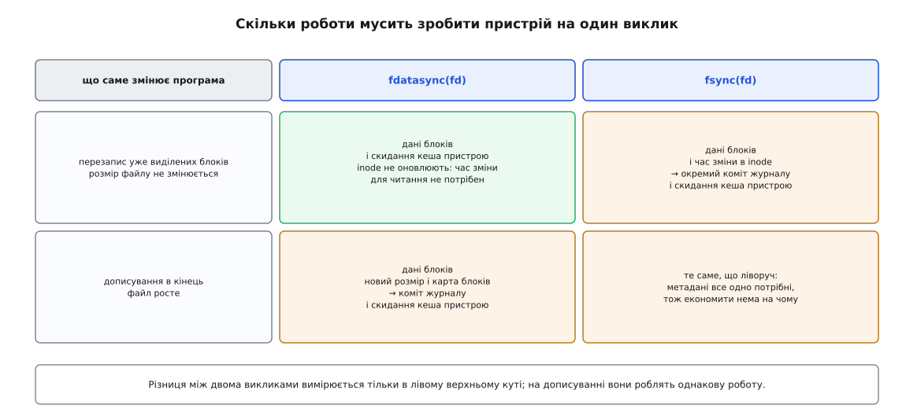
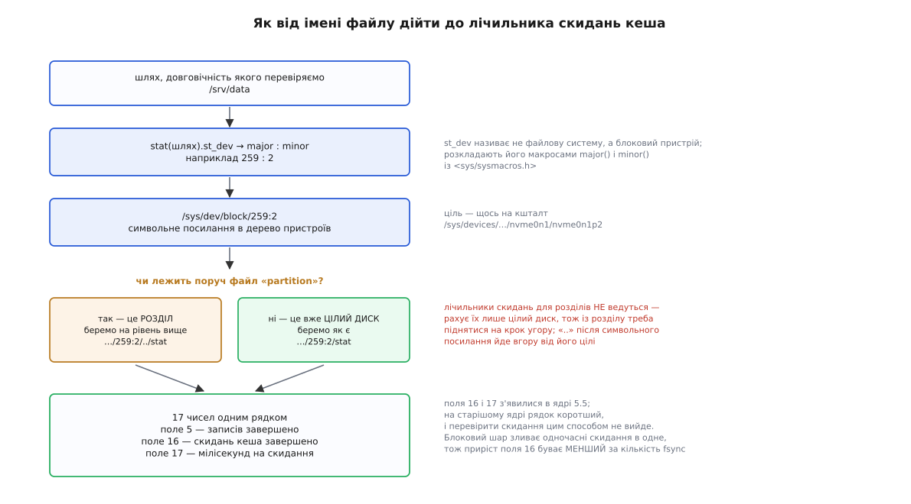

# ⚙️ Надійна заміна файлу: код, секундомір і лічильник скидань

Ланцюжок «тимчасовий файл → `fsync` → `rename` → `fsync` каталогу» легко переказати й напрочуд легко зіпсувати: кожен із чотирьох кроків має щонайменше один спосіб мовчки не спрацювати. Тут він зібраний як готова функція мовою C — із поверненням номера помилки, обробкою часткових записів і прибиранням за собою, — а поруч стоїть стенд, що міряє ціну кожного кроку й через лічильники ядра перевіряє головне: чи накопичувач справді скидав власний кеш, чи лише вдавав.

## Що функція мусить пообіцяти

Спершу випишемо контракт, бо інакше не видно, який саме рядок коду що закриває.

**Після повернення нуля** новий вміст лежить на носії, і ім'я вказує саме на нього. **Після повернення помилки** старий файл цілий і незайманий — програма, яка не змогла зберегти налаштування, не має права зіпсувати наявні. **Після раптового зникнення живлення** в будь-який момент роботи функції на диску лишається або цілий старий вміст, або цілий новий; проміжного стану не існує. **Права нового файлу** такі самі, як у старого, бо служба, що читає цей файл під іншим користувачем, після заміни не повинна раптом дістати «доступ заборонено». І, нарешті, **номер помилки повертається значенням**, а не лишається в глобальному `errno` — причина суто механічна: на шляху виходу функція закриває дескриптори й прибирає тимчасовий файл, а кожен із цих викликів має право переписати `errno` своїм.

Останнє з першого погляду виглядає дрібницею, а насправді це найчастіша помилка в коді такого роду. Функція сумлінно виявляє `ENOSPC`, іде на мітку прибирання, викликає там `close`, той успішно спрацьовує — і викликачеві дістається `errno`, який уже нічого не означає. Тому номер помилки треба забрати в локальну змінну тієї ж миті, коли він з'явився.

## Каталог — інструмент, а не рядок

Перший рядок функції відкриває не файл, а **каталог**, і далі всі кроки йдуть через його дескриптор: `openat` замість `open`, `renameat` замість `rename`, `fstatat` замість `stat`. Причин три, і кожна самостійна.

Дескриптор каталогу все одно потрібен наприкінці — саме через нього просять про довговічність запису імені. Відкривши каталог першим, ми просто не тримаємо двох різних уявлень про те, де працюємо.

Далі — тимчасовий файл гарантовано опиняється в тому самому каталозі, що й цільовий. Це не стилістика: `rename` відмовляється переносити ім'я між різними точками монтування, і найпоширеніша поломка всієї схеми — тимчасовий файл, покладений у `/tmp`.

І третє — стійкість до підміни. Між кроками каталог можуть перейменувати або перемонтувати; дескриптор указує на конкретний inode, і після такої підміни всі операції підуть у той самий каталог, який ми відкрили, а не в новий об'єкт із тим самим іменем ([родина викликів із каталожним дескриптором](topic:sys-unix/at-family-syscalls) — `openat`, `renameat`, `fstatat`, `unlinkat` і чому шлях, розібраний один раз, надійніший за шлях, розібраний чотири рази).

## Функція

:::tabs
```c
/* durable-replace.c — заміна вмісту файлу, що переживає збій.
   збірка: cc -O2 -Wall -Wextra -o durable-replace durable-replace.c */
#define _GNU_SOURCE
#include <errno.h>
#include <fcntl.h>
#include <limits.h>
#include <stdio.h>
#include <string.h>
#include <sys/stat.h>
#include <unistd.h>

/* write має право взяти менше, ніж просили, і має право повернутися
   ні з чим, якщо його перервав сигнал. Обидва випадки — не помилки. */
static int write_all(int fd, const void *buf, size_t len)
{
    const char *p = (const char *) buf;
    while (len > 0) {
        ssize_t n = write(fd, p, len);
        if (n < 0) {
            if (errno == EINTR) continue;
            return errno;
        }
        if (n == 0) return EIO;    /* для звичайного файлу не буває;
                                      краще помилка, ніж вічний цикл */
        p   += (size_t) n;
        len -= (size_t) n;
    }
    return 0;
}

/* Єдиний errno, після якого fsync можна кликати вдруге, — EINTR.
   Будь-який інший означає, що дані втрачено, і повторний виклик
   поверне облудний нуль: скидати вже нічого.                      */
static int fsync_checked(int fd)
{
    while (fsync(fd) != 0)
        if (errno != EINTR) return errno;
    return 0;
}

/* Замінити вміст файлу name у каталозі dir на buf/len.
   Повертає 0 або номер помилки (значення з errno.h).              */
int durable_replace(const char *dir, const char *name,
                    const void *buf, size_t len)
{
    int dfd = -1, fd = -1, rc = 0, have_tmp = 0;
    char tmp[NAME_MAX + 1];
    struct stat st;

    dfd = open(dir, O_RDONLY | O_DIRECTORY | O_CLOEXEC);
    if (dfd < 0) return errno;

    /* Тимчасове ім'я — у ЦЬОМУ ж каталозі. Крапка на початку ховає його
       від ls, номер процесу з лічильником розводять два одночасні
       виклики, а O_EXCL робить перевірку «чи вільне ім'я» неподільною. */
    for (unsigned attempt = 0; ; attempt++) {
        int k = snprintf(tmp, sizeof tmp, ".%s.%ld.%u.tmp",
                         name, (long) getpid(), attempt);
        if (k < 0 || (size_t) k >= sizeof tmp) { rc = ENAMETOOLONG; goto out; }

        fd = openat(dfd, tmp, O_WRONLY | O_CREAT | O_EXCL | O_CLOEXEC, 0600);
        if (fd >= 0) break;
        if (errno != EEXIST || attempt >= 1000) { rc = errno; goto out; }
    }
    have_tmp = 1;

    /* Права — від старого файлу. Свіжостворений має 0600 за вирахуванням
       umask, і після заміни конфіг раптово стає нечитним для служби.    */
    if (fstatat(dfd, name, &st, 0) == 0) {
        if (fchmod(fd, st.st_mode & 07777) != 0) { rc = errno; goto out; }
    } else if (errno != ENOENT) {
        rc = errno; goto out;
    }

    if ((rc = write_all(fd, buf, len)) != 0) goto out;

    /* Найдорожчий рядок функції: тут програма справді чекає на пристрій. */
    if ((rc = fsync_checked(fd)) != 0) goto out;

    /* close теж уміє провалитися — на мережевій файловій системі й на
       системах із відкладеним виділенням саме тут спливає ENOSPC.      */
    if (close(fd) != 0) { fd = -1; rc = errno; goto out; }
    fd = -1;

    /* Підміна імені. Неподільна: чужий процес бачить або старий файл,
       або новий, і ніколи — відсутність файлу.                        */
    if (renameat(dfd, tmp, dfd, name) != 0) { rc = errno; goto out; }
    have_tmp = 0;                       /* тимчасового імені більше нема */

    /* Запис у каталозі — теж дані в кеші сторінок, і власного дескриптора
       він не має. Просимо про його довговічність через сам каталог.     */
    rc = fsync_checked(dfd);

out:
    if (fd >= 0) close(fd);
    if (have_tmp) unlinkat(dfd, tmp, 0);
    if (dfd >= 0) close(dfd);
    return rc;         /* errno тут уже затоптаний прибиранням — тому rc */
}

int main(int argc, char **argv)
{
    if (argc < 4) {
        fprintf(stderr, "вжиток: %s <каталог> <ім'я> <рядок>\n", argv[0]);
        return 2;
    }
    int rc = durable_replace(argv[1], argv[2], argv[3], strlen(argv[3]));
    if (rc != 0) {
        fprintf(stderr, "заміна не вдалася: %s\n", strerror(rc));
        return 1;
    }
    return 0;
}
```
```cpp
/* durable-replace.cpp — заміна вмісту файлу, що переживає збій.
   збірка: g++ -O2 -Wall -Wextra -std=c++20 -o durable-replace durable-replace.cpp */
#define _GNU_SOURCE
#include <cerrno>
#include <climits>
#include <cstdio>
#include <cstring>
#include <fcntl.h>
#include <sys/stat.h>
#include <unistd.h>
#include <string>
#include <string_view>
#include <span>
#include <system_error>
#include <utility>

class ScopedFd {
    int fd_ = -1;
public:
    explicit ScopedFd(int fd = -1) noexcept : fd_(fd) {}
    ~ScopedFd() { if (fd_ >= 0) ::close(fd_); }
    ScopedFd(const ScopedFd&) = delete;
    ScopedFd& operator=(const ScopedFd&) = delete;
    ScopedFd(ScopedFd&& o) noexcept : fd_(std::exchange(o.fd_, -1)) {}
    ScopedFd& operator=(ScopedFd&& o) noexcept {
        if (this != &o) {
            if (fd_ >= 0) ::close(fd_);
            fd_ = std::exchange(o.fd_, -1);
        }
        return *this;
    }
    [[nodiscard]] int get() const noexcept { return fd_; }
    [[nodiscard]] explicit operator bool() const noexcept { return fd_ >= 0; }
    int release() noexcept { return std::exchange(fd_, -1); }
};

static int write_all(int fd, std::span<const std::byte> data) {
    const char* ptr = reinterpret_cast<const char*>(data.data());
    size_t len = data.size();
    while (len > 0) {
        ssize_t n = ::write(fd, ptr, len);
        if (n < 0) {
            if (errno == EINTR) continue;
            return errno;
        }
        if (n == 0) return EIO;
        ptr += static_cast<size_t>(n);
        len -= static_cast<size_t>(n);
    }
    return 0;
}

static int fsync_checked(int fd) {
    while (::fsync(fd) != 0)
        if (errno != EINTR) return errno;
    return 0;
}

int durable_replace(std::string_view dir, std::string_view name,
                    std::span<const std::byte> data) {
    std::string dir_str(dir);
    std::string name_str(name);

    ScopedFd dfd(::open(dir_str.c_str(), O_RDONLY | O_DIRECTORY | O_CLOEXEC));
    if (!dfd) return errno;

    char tmp[NAME_MAX + 1];
    ScopedFd fd;
    bool have_tmp = false;

    for (unsigned attempt = 0; ; attempt++) {
        int k = std::snprintf(tmp, sizeof(tmp), ".%s.%ld.%u.tmp",
                              name_str.c_str(), static_cast<long>(::getpid()), attempt);
        if (k < 0 || static_cast<size_t>(k) >= sizeof(tmp)) return ENAMETOOLONG;

        fd = ScopedFd(::openat(dfd.get(), tmp, O_WRONLY | O_CREAT | O_EXCL | O_CLOEXEC, 0600));
        if (fd) break;
        if (errno != EEXIST || attempt >= 1000) return errno;
    }
    have_tmp = true;

    auto cleanup = [&]() {
        if (have_tmp) ::unlinkat(dfd.get(), tmp, 0);
    };

    struct stat st{};
    if (::fstatat(dfd.get(), name_str.c_str(), &st, 0) == 0) {
        if (::fchmod(fd.get(), st.st_mode & 07777) != 0) {
            int err = errno; cleanup(); return err;
        }
    } else if (errno != ENOENT) {
        int err = errno; cleanup(); return err;
    }

    if (int rc = write_all(fd.get(), data); rc != 0) {
        cleanup(); return rc;
    }

    if (int rc = fsync_checked(fd.get()); rc != 0) {
        cleanup(); return rc;
    }

    int raw_fd = fd.release();
    if (::close(raw_fd) != 0) {
        int err = errno; cleanup(); return err;
    }

    if (::renameat(dfd.get(), tmp, dfd.get(), name_str.c_str()) != 0) {
        int err = errno; cleanup(); return err;
    }
    have_tmp = false;

    return fsync_checked(dfd.get());
}

int main(int argc, char** argv) {
    if (argc < 4) {
        std::fprintf(stderr, "вжиток: %s <каталог> <ім'я> <рядок>\n", argv[0]);
        return 2;
    }
    std::string_view text(argv[3]);
    auto bytes = std::span(reinterpret_cast<const std::byte*>(text.data()), text.size());
    int rc = durable_replace(argv[1], argv[2], bytes);
    if (rc != 0) {
        std::fprintf(stderr, "заміна не вдалася: %s\n", std::strerror(rc));
        return 1;
    }
    return 0;
}
```
:::

Три рядки в цьому коді варті окремого слова, бо кожен закриває поломку, що інакше відбувається найтихіше з усіх.

**Цикл навколо `write`.** Спокуса написати `if (write(fd, buf, len) != (ssize_t) len) помилка;` велика, і на звичайному файлі на локальному диску такий рядок працюватиме роками. Але записати все за раз `write` ніде не зобов'язувався. Він законно бере менше, коли посеред запису закінчується місце на диску, коли обсяг упирається в ліміт `RLIMIT_FSIZE`, коли виклик перериває сигнал уже після часткової передачі, і майже завжди — на мережевій файловій системі. Цикл із просуванням покажчика коштує три рядки й прибирає цілий клас помилок, який виявляється тільки в бою. Окремо про повернення `-1` з `EINTR`: це не помилка, а повідомлення «мене перервали, спробуй ще» ([EINTR: перервані виклики й перезапуск](topic:sys-unix/eintr-and-restart) — які виклики ядро повертає з цим кодом, коли надходить сигнал, і чому обробляти його доводиться в кожному циклі вводу-виводу).

**Перевірка `close`.** Звичка `close(fd);` без перевірки походить із локального диска, де закриття справді нічого не робить. Але на файлових системах із відкладеним виділенням і на NFS саме закриття запускає останню порцію роботи, і `ENOSPC` приходить із неї. Тут перевірка дешева, бо `fsync` уже пройшов і закриття майже напевно порожнє, — але це «майже» нам і потрібно ловити.

**Прапорець `have_tmp`.** Він відповідає рівно на одне питання: чи існує ще тимчасове ім'я. Після вдалого `renameat` тимчасового імені вже немає — воно **стало** цільовим, — і спроба прибрати його на шляху виходу стерла б щойно збережений файл. Тому прапорець скидається саме там і саме тоді.

## Скільки коштує кожен крок

Ланцюжок працює, і тепер важить його ціна: усі рішення про те, як часто синхронізуватися, приймають, дивлячись саме на це число.

Міряємо секундоміром навколо самого виклику, монотонним годинником — тим, що не стрибає від переведення системного часу й не зупиняється ([час у ядрі: тики й джерела часу](topic:sys-unix/kernel-timekeeping) — чим `CLOCK_MONOTONIC` відрізняється від `CLOCK_REALTIME` і чому тривалості міряють тільки першим). Беремо **медіану**, а не середнє: одна затримка на сотню мілісекунд від сусіда по диску зіпсує середнє й нічого не скаже про типову ціну.

Питань до стенда чотири. Скільки коштує `fsync` над файлом, у якому нічого не змінювали? Скільки — після 64 мебібайтів у кеші? Наскільки `fdatasync` дешевший за `fsync` при дописуванні в кінець і при перезаписі вже виділених блоків? І — головне — чи справді при цьому відбувається скидання кеша пристрою?

Різницю між двома викликами робить не їхня назва, а кількість різних місць на носії, які мусять оновитися.



*Економія `fdatasync` існує тільки там, де inode взагалі не треба чіпати; щойно файл росте, обидва виклики роблять однакову роботу.*

## Стенд

:::tabs
```c
/* sync-cost.c — ціна кожного різновиду синхронізації і перевірка,
   чи скидав при цьому пристрій власний кеш.
   збірка: cc -O2 -Wall -Wextra -o sync-cost sync-cost.c
   запуск: ./sync-cost /каталог/на/справжньому/диску            */
#define _GNU_SOURCE
#include <errno.h>
#include <fcntl.h>
#include <stdio.h>
#include <stdlib.h>
#include <string.h>
#include <sys/stat.h>
#include <sys/sysmacros.h>
#include <time.h>
#include <unistd.h>

enum { BLK = 4096, REPS = 200, PREFILL = 64, BIG = 64 << 20 };

static char blk[BLK];
static const char *DSTAT;                 /* шлях до лічильників диска */

static void die(const char *what) { perror(what); exit(1); }

static double now_ms(void)
{
    struct timespec ts;
    if (clock_gettime(CLOCK_MONOTONIC, &ts) != 0) die("clock_gettime");
    return ts.tv_sec * 1e3 + ts.tv_nsec / 1e6;
}

static int cmp_double(const void *a, const void *b)
{
    double x = *(const double *) a, y = *(const double *) b;
    return (x > y) - (x < y);
}

static double median(double *v, int n)
{
    qsort(v, n, sizeof *v, cmp_double);
    return (n & 1) ? v[n / 2] : (v[n / 2 - 1] + v[n / 2]) / 2;
}

/* Знайти файл лічильників ЦІЛОГО диска, на якому лежить шлях.
   Скидання кеша для розділів не рахуються, тому з розділу
   треба піднятися на крок угору.                                */
static int disk_stat_path(const char *path, char *out, size_t outsz)
{
    struct stat st;
    if (stat(path, &st) != 0) return errno;

    char node[128], probe[160];
    snprintf(node, sizeof node, "/sys/dev/block/%u:%u",
             major(st.st_dev), minor(st.st_dev));
    snprintf(probe, sizeof probe, "%s/partition", node);

    /* «..» після символьного посилання йде вгору від його ЦІЛІ:
       від …/nvme0n1p2 до …/nvme0n1, тобто до цілого диска.       */
    snprintf(out, outsz, "%s%s/stat", node,
             (access(probe, F_OK) == 0) ? "/.." : "");
    return 0;
}

struct dstat { unsigned long long writes, flushes, flush_ms; int fields; };

/* Рядок із сімнадцяти чисел:
     1 читань   2 злито  3 секторів  4 мс
     5 записів  6 злито  7 секторів  8 мс
     9 у роботі 10 мс вводу-виводу   11 зважені мс
    12–15 discard        16 скидань кеша    17 мс на скидання     */
static int read_dstat(const char *p, struct dstat *d)
{
    unsigned long long v[17] = { 0 };
    int n = 0;
    FILE *f = fopen(p, "r");
    if (!f) return errno;
    while (n < 17 && fscanf(f, "%llu", &v[n]) == 1) n++;
    fclose(f);

    d->fields   = n;
    d->writes   = (n >=  5) ? v[4]  : 0;
    d->flushes  = (n >= 16) ? v[15] : 0;
    d->flush_ms = (n >= 17) ? v[16] : 0;
    return (n >= 5) ? 0 : EINVAL;
}

/* Друкуємо не тільки час, а й приріст обох лічильників: скидання без
   жодного запису — це і є доказ, що fsync розмовляє з пристроєм навіть
   тоді, коли передавати нема чого.                                     */
static void report(const char *tag, double *t, int n,
                   const struct dstat *a, const struct dstat *b)
{
    printf("%-32s медіана %8.3f мс   записів: %-5llu скидань: %-5llu (на %d)\n",
           tag, median(t, n),
           b->writes - a->writes, b->flushes - a->flushes, n);
    fflush(stdout);
}

/* REPS разів «зміна + синхронізація». append: дописувати в кінець
   чи перезаписувати вже виділені блоки; datasync: fdatasync чи fsync. */
static void series(const char *tag, int fd, int append, int datasync)
{
    static double t[REPS];
    struct dstat a, b;

    read_dstat(DSTAT, &a);
    for (int i = 0; i < REPS; i++) {
        blk[0] = (char) i;                    /* щоб вміст справді мінявся */
        if (append) {
            if (write(fd, blk, BLK) != (ssize_t) BLK) die("write");
        } else {
            off_t off = (off_t) (i % PREFILL) * BLK;
            if (pwrite(fd, blk, BLK, off) != (ssize_t) BLK) die("pwrite");
        }
        double t0 = now_ms();
        int rc = datasync ? fdatasync(fd) : fsync(fd);
        double t1 = now_ms();
        if (rc != 0) die("sync");
        t[i] = t1 - t0;
    }
    read_dstat(DSTAT, &b);
    report(tag, t, REPS, &a, &b);
}

int main(int argc, char **argv)
{
    const char *dir = (argc > 1) ? argv[1] : ".";
    char dstat[512], path[4096];
    struct dstat probe, a, b;
    double t[REPS];

    if (disk_stat_path(dir, dstat, sizeof dstat) != 0) die("stat каталогу");
    DSTAT = dstat;
    if (read_dstat(DSTAT, &probe) != 0) {
        fprintf(stderr, "лічильники недоступні (%s): tmpfs, складений том "
                        "або каталог не на блоковому пристрої\n", dstat);
        return 1;
    }
    printf("лічильники: %s (%d полів%s)\n\n", dstat, probe.fields,
           probe.fields >= 17 ? "" : "; скидання НЕ рахуються — ядро до 5.5");

    snprintf(path, sizeof path, "%s/sync-cost.dat", dir);
    int fd = open(path, O_RDWR | O_CREAT | O_TRUNC, 0600);
    if (fd < 0) die(path);

    /* Псевдовипадковий вміст, а не нулі: на файловій системі зі
       стисненням блок із нулів до носія майже не доходить, і міряти
       не було б чого.                                  (xorshift64) */
    unsigned long long s = 88172645463325252ULL;
    for (size_t i = 0; i < sizeof blk; i++) {
        s ^= s << 13; s ^= s >> 7; s ^= s << 17;
        blk[i] = (char) s;
    }

    /* А. fsync над файлом, у якому від попереднього fsync не змінилося
          нічого. Роботи для носія тут немає — лишається сама розмова
          з пристроєм.                                                 */
    if (fsync(fd) != 0) die("fsync");
    read_dstat(DSTAT, &a);
    for (int i = 0; i < REPS; i++) {
        double t0 = now_ms();
        if (fsync(fd) != 0) die("fsync");
        t[i] = now_ms() - t0;
    }
    read_dstat(DSTAT, &b);
    report("fsync без жодної зміни", t, REPS, &a, &b);

    /* Б. fsync після 64 МіБ у кеші: тут ціна — це швидкість носія. */
    for (int r = 0; r < 5; r++) {
        if (ftruncate(fd, 0) != 0) die("ftruncate");
        if (lseek(fd, 0, SEEK_SET) < 0) die("lseek");
        for (int i = 0; i < BIG / BLK; i++)
            if (write(fd, blk, BLK) != (ssize_t) BLK) die("write");
        double t0 = now_ms();
        if (fsync(fd) != 0) die("fsync");
        t[r] = now_ms() - t0;
    }
    printf("%-32s медіана %8.3f мс\n", "fsync після 64 МіБ у кеші",
           median(t, 5));

    /* В. Перезаписові потрібен файл, у якому блоки вже виділені. */
    if (ftruncate(fd, 0) != 0) die("ftruncate");
    if (lseek(fd, 0, SEEK_SET) < 0) die("lseek");
    for (int i = 0; i < PREFILL; i++)
        if (write(fd, blk, BLK) != (ssize_t) BLK) die("write");
    if (fsync(fd) != 0) die("fsync");

    series("перезапис 4 КіБ + fdatasync",   fd, 0, 1);
    series("перезапис 4 КіБ + fsync",       fd, 0, 0);

    if (lseek(fd, 0, SEEK_END) < 0) die("lseek");
    series("дописування 4 КіБ + fdatasync", fd, 1, 1);
    series("дописування 4 КіБ + fsync",     fd, 1, 0);

    close(fd);
    unlink(path);
    return 0;
}
```
```cpp
/* sync-cost.cpp — ціна кожного різновиду синхронізації і перевірка,
   чи скидав при цьому пристрій власний кеш.
   збірка: g++ -O2 -Wall -Wextra -std=c++20 -o sync-cost sync-cost.cpp
   запуск: ./sync-cost /каталог/на/справжньому/диску            */
#define _GNU_SOURCE
#include <cerrno>
#include <cmath>
#include <cstdio>
#include <cstdlib>
#include <cstring>
#include <fcntl.h>
#include <sys/stat.h>
#include <sys/sysmacros.h>
#include <unistd.h>
#include <algorithm>
#include <chrono>
#include <array>
#include <string>
#include <vector>
#include <iostream>
#include <fstream>

constexpr size_t BLK = 4096;
constexpr int REPS = 200;
constexpr int PREFILL = 64;
constexpr size_t BIG = 64 << 20;

static std::array<char, BLK> blk;
static std::string DSTAT;

[[noreturn]] static void die(const char* what) {
    std::perror(what);
    std::exit(1);
}

static double now_ms() {
    using namespace std::chrono;
    auto now = steady_clock::now();
    return duration<double, std::milli>(now.time_since_epoch()).count();
}

static double median(std::vector<double>& v) {
    std::sort(v.begin(), v.end());
    size_t n = v.size();
    return (n % 2 != 0) ? v[n / 2] : (v[n / 2 - 1] + v[n / 2]) / 2.0;
}

static int disk_stat_path(const char* path, char* out, size_t outsz) {
    struct stat st{};
    if (::stat(path, &st) != 0) return errno;

    char node[128], probe[160];
    std::snprintf(node, sizeof(node), "/sys/dev/block/%u:%u",
                  major(st.st_dev), minor(st.st_dev));
    std::snprintf(probe, sizeof(probe), "%s/partition", node);

    std::snprintf(out, outsz, "%s%s/stat", node,
                  (::access(probe, F_OK) == 0) ? "/.." : "");
    return 0;
}

struct dstat {
    unsigned long long writes = 0;
    unsigned long long flushes = 0;
    unsigned long long flush_ms = 0;
    int fields = 0;
};

static int read_dstat(const std::string& p, dstat& d) {
    std::ifstream f(p);
    if (!f) return errno;
    std::vector<unsigned long long> v;
    unsigned long long val;
    while (v.size() < 17 && (f >> val)) {
        v.push_back(val);
    }
    d.fields = static_cast<int>(v.size());
    d.writes = (v.size() >= 5) ? v[4] : 0;
    d.flushes = (v.size() >= 16) ? v[15] : 0;
    d.flush_ms = (v.size() >= 17) ? v[16] : 0;
    return (v.size() >= 5) ? 0 : EINVAL;
}

static void report(const char* tag, std::vector<double>& t,
                   const dstat& a, const dstat& b) {
    std::printf("%-32s медіана %8.3f мс   записів: %-5llu скидань: %-5llu (на %zu)\n",
                tag, median(t),
                b.writes - a.writes, b.flushes - a.flushes, t.size());
    std::fflush(stdout);
}

static void series(const char* tag, int fd, bool append, bool datasync) {
    std::vector<double> t(REPS);
    dstat a{}, b{};

    read_dstat(DSTAT, a);
    for (int i = 0; i < REPS; i++) {
        blk[0] = static_cast<char>(i);
        if (append) {
            if (::write(fd, blk.data(), BLK) != static_cast<ssize_t>(BLK)) die("write");
        } else {
            off_t off = static_cast<off_t>(i % PREFILL) * BLK;
            if (::pwrite(fd, blk.data(), BLK, off) != static_cast<ssize_t>(BLK)) die("pwrite");
        }
        double t0 = now_ms();
        int rc = datasync ? ::fdatasync(fd) : ::fsync(fd);
        double t1 = now_ms();
        if (rc != 0) die("sync");
        t[i] = t1 - t0;
    }
    read_dstat(DSTAT, b);
    report(tag, t, a, b);
}

int main(int argc, char** argv) {
    const char* dir = (argc > 1) ? argv[1] : ".";
    char dstat_buf[512], path[4096];
    dstat probe{}, a{}, b{};
    std::vector<double> t(REPS);

    if (disk_stat_path(dir, dstat_buf, sizeof(dstat_buf)) != 0) die("stat каталогу");
    DSTAT = dstat_buf;
    if (read_dstat(DSTAT, probe) != 0) {
        std::fprintf(stderr, "лічильники недоступні (%s): tmpfs, складений том "
                             "або каталог не на блоковому пристрої\n", DSTAT.c_str());
        return 1;
    }
    std::printf("лічильники: %s (%d полів%s)\n\n", DSTAT.c_str(), probe.fields,
                probe.fields >= 17 ? "" : "; скидання НЕ рахуються — ядро до 5.5");

    std::snprintf(path, sizeof(path), "%s/sync-cost.dat", dir);
    int fd = ::open(path, O_RDWR | O_CREAT | O_TRUNC, 0600);
    if (fd < 0) die(path);

    unsigned long long s = 88172645463325252ULL;
    for (size_t i = 0; i < blk.size(); i++) {
        s ^= s << 13; s ^= s >> 7; s ^= s << 17;
        blk[i] = static_cast<char>(s);
    }

    if (::fsync(fd) != 0) die("fsync");
    read_dstat(DSTAT, a);
    for (int i = 0; i < REPS; i++) {
        double t0 = now_ms();
        if (::fsync(fd) != 0) die("fsync");
        t[i] = now_ms() - t0;
    }
    read_dstat(DSTAT, b);
    report("fsync без жодної зміни", t, a, b);

    std::vector<double> t_big(5);
    for (int r = 0; r < 5; r++) {
        if (::ftruncate(fd, 0) != 0) die("ftruncate");
        if (::lseek(fd, 0, SEEK_SET) < 0) die("lseek");
        for (size_t i = 0; i < BIG / BLK; i++)
            if (::write(fd, blk.data(), BLK) != static_cast<ssize_t>(BLK)) die("write");
        double t0 = now_ms();
        if (::fsync(fd) != 0) die("fsync");
        t_big[r] = now_ms() - t0;
    }
    std::printf("%-32s медіана %8.3f мс\n", "fsync після 64 МіБ у кеші",
                median(t_big));

    if (::ftruncate(fd, 0) != 0) die("ftruncate");
    if (::lseek(fd, 0, SEEK_SET) < 0) die("lseek");
    for (int i = 0; i < PREFILL; i++)
        if (::write(fd, blk.data(), BLK) != static_cast<ssize_t>(BLK)) die("write");
    if (::fsync(fd) != 0) die("fsync");

    series("перезапис 4 КіБ + fdatasync",   fd, false, true);
    series("перезапис 4 КіБ + fsync",       fd, false, false);

    if (::lseek(fd, 0, SEEK_END) < 0) die("lseek");
    series("дописування 4 КіБ + fdatasync", fd, true, true);
    series("дописування 4 КіБ + fsync",     fd, true, false);

    ::close(fd);
    ::unlink(path);
    return 0;
}
```
:::

## Що показує секундомір

Ось вивід із однієї конкретної машини: споживчий NVMe-накопичувач без конденсаторного захисту, ext4 із типовими параметрами, ядро 6.8.

```
лічильники: /sys/dev/block/259:2/../stat (17 полів)

fsync без жодної зміни           медіана    0.034 мс   записів: 0     скидань: 200   (на 200)
fsync після 64 МіБ у кеші        медіана  138.100 мс
перезапис 4 КіБ + fdatasync      медіана    0.209 мс   записів: 201   скидань: 200   (на 200)
перезапис 4 КіБ + fsync          медіана    0.731 мс   записів: 604   скидань: 200   (на 200)
дописування 4 КіБ + fdatasync    медіана    0.718 мс   записів: 601   скидань: 200   (на 200)
дописування 4 КіБ + fsync        медіана    0.742 мс   записів: 603   скидань: 200   (на 200)
```

Читається це чотирма окремими висновками.

**Порожнього `fsync` не буває.** Перший рядок вартий того, щоб на нього подивитися двічі: записів **нуль**, скидань **двісті**. Тобто пристроєві не передали жодного байта — і все ж двісті разів наказали спорожнити кеш. Причина в тому, що ядро не веде обліку того, що саме накопичувач уже встиг покласти на носій; воно знає лише, чого не встигло віддати **само**. Спитати пристрій нема як, тож на кожне прохання ядро відповідає єдиним чесним способом — надсилає команду скидання й чекає на підтвердження. Тридцять чотири мікросекунди на такий обмін — це приблизна вартість однієї подорожі команди до NVMe й назад; на обертовому диску вона на два порядки більша. Практичний наслідок: `fsync` «про всяк випадок» у циклі — не безкоштовна обережність. Наскільки саме він у вас не безкоштовний і чи не оптимізує ваша файлова система цей випадок по-своєму — стенд відповідає для **вашої** машини, а не для абстрактної, і саме тому він і потрібен.

**Велике злиття міряє швидкість носія, а не системи.** Перевірмо, чи сходиться:

```
обсяг                    = 64 МіБ = 67.11 МБ
виміряна затримка        = 138.1 мс = 0.1381 с
пропускна здатність      = 67.11 / 0.1381 ≈ 486 МБ/с
```

Це паспортна швидкість послідовного запису такого накопичувача — отже, у цьому вимірі `fsync` не «коштує» нічого власного, він просто чекає, доки залізо перекачає дані. Скорочувати саме це очікування безглуздо: воно і є передача даних. Скорочують кількість таких очікувань, а не тривалість кожного.

**`fdatasync` виграє тільки на перезаписі.** Перезапис уже виділеного блока з `fdatasync` коштує 0.209 мс, а з `fsync` — 0.731 мс, тобто в три з половиною рази більше. Стовпчик записів показує, звідки береться ця різниця: 201 проти 604. Двісті записів — це наші двісті блоків по чотири кілобайти, і в дешевшому випадку більше нічого й не було. У дорожчому до них додалося ще чотириста, і всі вони службові: `fsync` зобов'язаний винести на носій час останньої зміни файлу, а це запис в inode, який лежить зовсім в іншому місці диска й проходить через журнал — приблизно по два додаткові блоки на кожен коміт, блок опису й блок-підтвердження. `fdatasync` усе це пропускає, бо без часу зміни файл однаково прочитається правильно.

**На дописуванні різниці немає.** 0.718 проти 0.742 — це шум, і записів у обох по шістсот. Щойно файл росте, у inode змінюються розмір і карта блоків, а без них дописане просто не прочитається; `fdatasync` зобов'язаний винести їх нарівні з `fsync`, тож коміт журналу відбувається в обох випадках, і економити стає нема на чому. Звідси конкретна порада для журналів записування: файл варто **виділяти наперед** — записати потрібний обсяг, синхронізувати один раз, а далі класти дані через `pwrite` у вже виділені блоки. Тоді кожен запис у журналі потрапляє в ліву верхню клітинку таблиці й коштує втричі дешевше.

Два з цих рядків на обертовому диску 7200 обертів за хвилину виглядають інакше за абсолютними числами, але з тією самою будовою:

```
перезапис 4 КіБ + fdatasync   ≈  6.4 мс
перезапис 4 КіБ + fsync       ≈ 14.8 мс

пів оберту при 7200 об/хв     = 60000 / 7200 / 2 ≈ 4.2 мс
```

Половина оберту — це просто час, доки потрібний сектор під'їде під голівку, і менше за нього фізично не буває. Друга поїздка до inode додає ще й переїзд голівки, звідси стрибок більш ніж удвічі. Практична стеля виводиться одразу:

```
одна транзакція = запис у журнал + один fsync
NVMe:            1000 / 0.72 ≈ 1390 транзакцій за секунду
обертовий диск:  1000 / 14.8 ≈   68 транзакцій за секунду
```

Двадцятикратний розрив — це і є відповідь на питання, чому бази даних переїжджають на твердотільні накопичувачі й чому кількість `fsync` на транзакцію є першим числом, яке в них дивляться.

## Чи справді пристрій скидав кеш

Усе виміряне досі — затримка, а затримка буває й без жодного скидання. Якщо скидання прибрано з черги пристрою, `fsync` поверне успіх, витративши мікросекунди: числа вийдуть чудові, а гарантувати не будуть нічого. Тому потрібен свідок, незалежний від секундоміра, — і він у ядра є.



*Ключовий поворот — передостанній: розділ власних скидань не рахує, тому з нього треба піднятися до цілого диска.*

Свідок — два числа в кінці рядка `/sys/block/<диск>/stat`, які з'явилися в ядрі 5.5: **скидань кеша завершено** й **мілісекунд, витрачених на скидання**. Ті самі числа стоять і в `/proc/diskstats`, тільки там перед ними ще три поля — старший номер пристрою, молодший і назва, — тож там це поля 19 і 20 ([/proc: ядро як файлова система](topic:sys-unix/proc-reading-process-and-kernel-state) — чому статистику ядра читають звичайним `read`, і що це означає для її атомарності).

У документації ядра про перше з них сказано точно, і в цьому реченні захована пастка: «Block layer combines flush requests and executes at most one at a time» — блоковий шар зливає скидання докупи й виконує щонайбільше одне за раз. Тобто лічильник рахує скидання, які **дійшли до пристрою**, а не виклики `fsync`. У нашому однопотоковому стенді ці числа збігаються, бо кожен `fsync` чекає на попередній. А от десять потоків, які синхронізуються одночасно, можуть дати одне спільне скидання на всіх — і це не втрата гарантії, а саме та оптимізація, заради якої зливання й зроблено.

Друга пастка простіша й трапляється щоразу: для розділів ці поля **не ведуться** взагалі. У `/sys/block/nvme0n1p2/stat` рядок коротший, і шістнадцятого числа в ньому просто немає — `awk` мовчки віддасть порожнє поле, а програма прочитає нуль і зробить неправильний висновок. Саме тому в коді стенда стоїть перевірка на файл `partition`, підйом через `..` і звірка кількості прочитаних чисел.

Без програми те саме робиться двома командами:

```sh
$ df --output=source /srv/data | tail -1
/dev/nvme0n1p2
$ awk '{print "скидань:", $16, "  мс на скидання:", $17}' /sys/block/nvme0n1/stat
скидань: 481203   мс на скидання: 3915
```

Якщо між двома такими знімками ви зробили сотню `fsync`, а число не зрушило — ланцюжок десь обірвано. Перше місце, куди дивитися:

```sh
$ cat /sys/block/nvme0n1/queue/write_cache
write back
```

`write back` означає «кеш увімкнено, скидання потрібні й мають надсилатися». `write through` означає, що пристрій оголосив себе таким, що підтверджує запис лише після носія, — і тоді ядро скидань не надсилає **законно**, а нульовий приріст лічильника не є поломкою. Розрізняти ці дві ситуації обов'язково, бо однаковий на вигляд нуль означає в них протилежне.

> 🔧 **Навіщо це.** Це перевірка, яку варто робити один раз на кожному новому типі машини, перш ніж покласти на неї щось важливе. У віртуалці з режимом `cache=writeback` гість чесно надсилає скидання, лічильник гостя чесно росте — а хост усе одно тримає дані в пам'яті; у такому разі свідчить лише той самий лічильник **на хості**. На складеному томі (LVM, dm-crypt, програмний RAID) `st_dev` вкаже на верхній віртуальний пристрій, і рахуватиме той свої власні скидання, а не залізні; щоб дійти до фізичних дисків, спускайтеся через каталог `slaves` — `/sys/block/dm-0/slaves/` перелічує посиланнями всіх, на кому цей том стоїть ([sysfs: дерево пристроїв як файли](topic:sys-unix/sysfs-device-model) — як ядро показує пристрої каталогами й посиланнями і чому одна й та сама річ видима в цьому дереві з кількох боків).

Коли лічильника мало й хочеться бачити кожен окремий запит, у справу йдуть трасувальні точки блокового шару ([ftrace і трасувальні точки ядра](topic:sys-unix/ftrace-kernel-tracing) — заздалегідь розставлені в коді ядра місця, до яких можна причепитися без перезбирання). Найдешевший спосіб подивитися, що взагалі відправляється пристроєві:

```sh
# розкладка всіх запитів за прапорцями, поки не натиснуто Ctrl+C
$ bpftrace -e 'tracepoint:block:block_rq_issue { @[str(args->rwbs)] = count(); }'
@[R]: 118
@[W]: 8640
@[WS]: 402
@[F]: 200
```

Рядок прапорців — та сама нотація, якою послуговується `blktrace`: `R` — читання, `W` — запис, `S` — синхронний запит, `F` — скидання кеша. Двісті рядків із самим `F` — це наші двісті `fsync`, побачені з протилежного боку системи, незалежно від лічильника в sysfs ([eBPF: програми, які виконує ядро](topic:sys-unix/ebpf-programming-model-and-toolchain) — як `bpftrace` перетворює однорядковий вираз на перевірену програму всередині ядра). Якщо трасувальна точка чомусь недоступна, лишається кріплення просто до функції: спершу переконатися, що символ не вбудували в місце виклику (`grep -w blkdev_issue_flush /proc/kallsyms`), а тоді почепити на нього `kprobe`.

## Пастки

**Тимчасовий файл в іншій файловій системі.** Класична поломка: програма кладе тимчасовий файл у `/tmp`, а цільовий лежить у `/srv/data`. `rename` у відповідь дає `EXDEV`, і в довіднику це сказано без пом'якшень: «oldpath and newpath are not on the same mounted filesystem», причому — окремо підкреслено — виклик не працює між різними точками монтування навіть тоді, коли **на обох змонтовано ту саму файлову систему**. Спокуса «раз не переносить — скопіюємо й зітремо» руйнує всю схему: копіювання не є неподільним, і саме під час нього читач побачить половину файлу. Єдиний правильний вихід — тимчасовий файл поруч із цільовим, у тому самому каталозі; ця вимога й змусила код працювати через дескриптор каталогу ([модель монтування](topic:sys-unix/mount-model) — чому одне дерево каталогів складається з багатьох незалежних файлових систем і де проходять їхні межі).

**Забутий `fsync` каталогу.** Найпоширеніше виправдання звучить розумно: «`rename` журналюється, а журнал надійний». Журнал справді робить перейменування **неподільним** — після збою воно або є цілком, або його немає зовсім. Але неподільність не означає негайності: транзакція чекає на коміт, а ext4 типово комітить журнал раз на п'ять секунд (параметр монтування `commit=`). П'ять секунд — це саме те вікно, у якому програма вже намалювала «Збережено», а на диску ще стара картина ([журналювання й узгодженість після збою](topic:sys-unix/journaling-consistency) — що саме журнал обіцяє, а що ні). `fsync` на дескрипторі каталогу примушує коміт відбутися зараз, і довідник каже те саме прямо: «Calling fsync() does not necessarily ensure that the entry in the directory containing the file has also reached disk».

**Спроба повторити `fsync` після `EIO`.** Найдорожча пастка з усіх, бо вона перетворює виявлену втрату на невиявлену. Помилку зворотного запису ядро запам'ятовує при inode, і кожен дескриптор має право побачити її **рівно один раз** — довідник формулює це так: «Since Linux 4.13, errors from write-back will be reported to all file descriptors that might have written the data which triggered the error». Один раз означає один: другий `fsync` на тому самому дескрипторі поверне нуль. І це не помилка обліку, а правда — просто відповідь на інше питання. Сторінку, яку не вдалося записати, більшість файлових систем уже позначили чистою, тож у ядра не лишилося ні наміру повторювати, ні даних для повтору; нуль означає «мені нема чого робити», а зовсім не «дані на диску». Тому `fsync_checked` вище перезапускає виклик рівно при `EINTR` і при жодному іншому коді. Єдина коректна реакція на `EIO` — вважати весь вміст після останньої вдалої синхронізації втраченим і відновлюватися з тієї точки. Те саме стосується `ENOSPC` і `EDQUOT`: повторний виклик на них теж поверне облудний нуль.

**Буфер бібліотеки, про який ядро не знає.** Якщо файл пишеться через `FILE *`, то `fsync(fileno(f))` синхронізує лише те, що вже дійшло до ядра, а решта тихо лежить у буфері бібліотеки й гине без сліду. Спершу `fflush`, і тільки потім `fsync` ([буферизація stdio](topic:sys-unix/stdio-buffering) — свій буфер бібліотеки поверх ядерного, з трьома режимами й правилами, коли він спорожняється сам).

**Цільове ім'я — символьне посилання.** Схема замінює саме те ім'я, яке ви назвали. Якщо `/etc/config` є посиланням на `/etc/config.d/current`, то `renameat` замінить **посилання**, а не файл, на який воно вказує, — і зв'язок із каталогом налаштувань обірветься. Перед заміною варто перевірити тип через `fstatat` із `AT_SYMLINK_NOFOLLOW` і вирішити свідомо.

**Права скопійовано, а решту атрибутів — ні.** `fchmod` переносить біти доступу, і на цьому все. Власник у нового файлу — той, хто його створив; розширені атрибути й списки контролю доступу новий inode не успадковує, і після заміни мітка SELinux теж буде типова для каталогу, а не колишня ([ACL і розширені атрибути](topic:sys-unix/acl-and-xattr) — другий, необов'язковий шар прав поверх дев'яти бітів, і як він переживає копіювання). Для конфігів це майже завжди неважливо; для файлів під обов'язковим контролем доступу — критично, і тоді атрибути треба переносити явно.

**Сміття після вбитого процесу.** Якщо процес загинув між створенням тимчасового файлу й `rename`, у каталозі лишиться `.name.1234.0.tmp`. Прибирання в самій функції тут не поможе — його просто нікому виконати. Правильне місце для мітли — старт програми: пройти каталог і зняти свої тимчасові файли, чиї номери процесів уже не існують.

**`O_TMPFILE` тут не рятує.** Виникає природна думка: узяти файл, у якого імені немає від народження, і тим позбутися сміття зовсім. Не вийде: дати ім'я такому inode можна лише через `linkat`, а `linkat` відмовляється перезаписувати наявне ім'я — поверне `EEXIST`. Тобто спершу все одно доведеться зв'язати його з тимчасовим іменем, а потім робити `rename`; вікно, у якому тимчасове ім'я видиме, скорочується, але не зникає, а кроків стає більше.

**І остання, від якої не рятує жодний код.** Лічильник скидань зростає рівно тоді, коли ядро **надіслало** команду. Чи виконав її пристрій насправді, ядро перевірити не може. Накопичувачі, які підтверджують `FLUSH CACHE`, не дочекавшись носія, існують — і ззовні вони не відрізняються від чесних. Єдиний прилад, який ловить таке, — розетка: пишемо потік із номерами, синхронізуючись після кожного, вимикаємо живлення фізично, після ввімкнення дивимося, чи всі підтверджені номери на місці. Усе інше вимірює намір, а не результат.
