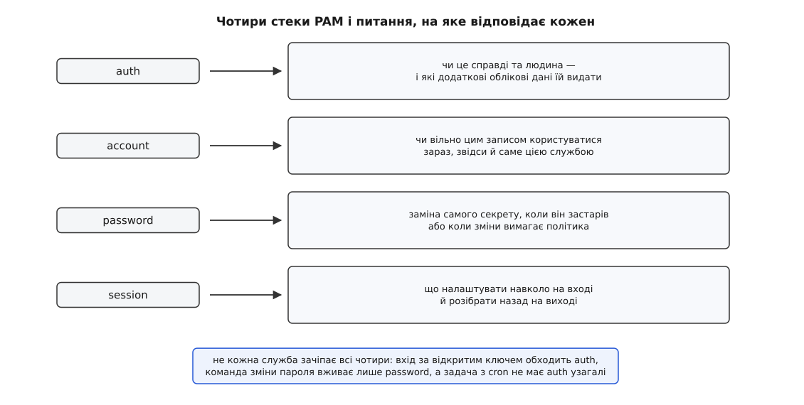
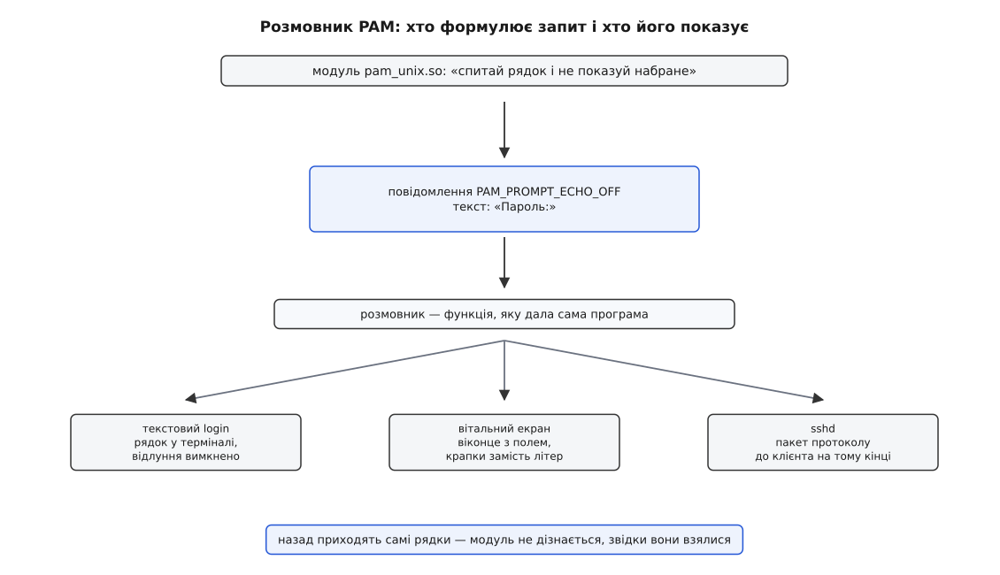
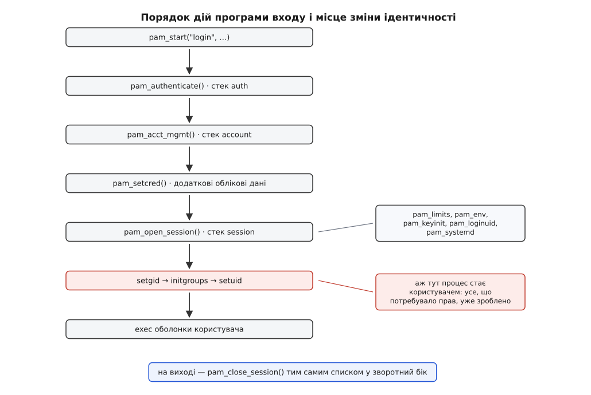

# PAM: стек модулів автентифікації

<preknowlist>
- [Користувачі, групи й ідентичність процесу](topic:sys-unix/uid-gid-identity-model) — UID і GID як знімок у самому процесі, з яким ядро звіряється на кожній перевірці.
- [База облікових записів](topic:sys-unix/user-database-nss) — `/etc/passwd`, `/etc/group`, `/etc/shadow` і шар NSS, що вміє брати ті самі записи з мережевого каталогу.
- [Динамічний завантажувач](topic:sys-unix/dynamic-loader) — як програма підвантажує спільний об'єкт (`.so`) уже під час роботи й бере з нього символи за іменем.
- [setuid і підвищення прав](topic:sys-unix/setuid-and-privilege) — біт на файлі, що дає програмі при запуску діяти від імені власника файлу, а не того, хто її запустив.
- [Хешування паролів](topic:sf-security/password-hashing) — чому в базі лежить не пароль, а результат повільної однобічної функції із сіллю.
- [Автентифікація](topic:sf-security/authentication) — межа між «доведи, що це ти» і «тобі це можна»: два різні питання з різними відповідями.
</preknowlist>

## Один пароль у чотирьох чужих одна одній програмах

Ви вводите той самий пароль у чотирьох місцях, у яких немає нічого спільного. Текстова консоль питає його рядком без відлуння. `ssh` питає його з іншої машини, через мережу. `sudo` питає посеред роботи, нікуди вас не впускаючи. Заставка робочого столу питає його у графічному віконці. Це чотири різні програми, написані різними людьми в різні десятиліття, і всі чотири отримують ту саму відповідь «так».

А тепер в установі вмикають апаратні ключі. Наступного ранку всі чотири просять ще й торкнутися ключа. Жодну з них не перезбирали й навіть не перезапускали.

Отже, знання про те, **як** перевіряють людину, лежить не в цих програмах. Далі — де воно лежить, як воно туди потрапило і чому конструкція вийшла саме такою.

## Чому перевірка не може жити всередині програми

У ранньому Unix вона таки жила всередині. Програма `login` читала рядок із `/etc/passwd`, пропускала введений пароль через функцію `crypt()` разом із дволітерною сіллю з того ж рядка й порівнювала два рядки. Десяток рядків коду, і жодної потреби в чомусь складнішому.

Дірка в цій конструкції відкрилася сама. Хеші лежали у файлі, який мусив бути читабельним для всіх, бо з нього ж брали імена й домашні каталоги, — тож будь-хто міг забрати їх усі й підбирати офлайн. Хеші винесли в окремий файл `/etc/shadow`, доступний тільки `root`. Виправлення дрібне на вигляд, але воно змінило **кожну** програму, що питала пароль.

Далі змін ставало більше, і всі вони були такого самого роду. Пароль почав старіти й вимагати заміни через N днів. Обліковий запис почав вимикатися до дати. Записи поїхали з локального файлу в мережевий каталог. З'явилися одноразові коди, потім смарт-картки, потім апаратні ключі. І кожна така зміна — це правка всіх програм, що питають пароль, з наступним перезбиранням і роздачею.

Тепер порахуйте, чого це коштує. Список таких програм не сталий: цього року з'являється новий графічний вітальний екран, наступного — новий агент для віддаленого доступу. Кожна з них працює з правами `root` — бо мусить читати `shadow`, — тож кожна копія коду перевірки є повноцінною поверхнею атаки. А самі копії неминуче розходяться: одна вже вміє старіння пароля, друга ще ні, і поводяться вони по-різному в тому самому питанні.

І головне: **те, що саме треба перевірити, — узагалі не знання програми.** Це рішення того, хто адмініструє машину, і воно міняється з іншою швидкістю, ніж код.

## Програма називає не перевірку, а себе

Розділити треба так, щоб на боці програми лишилося тільки те, що вона справді знає.

А знає вона рівно дві речі: чого хоче («мушу впевнитися, що це та людина, перш ніж пустити її далі») і **хто вона сама** («я — `sshd`»). Ані переліку перевірок, ані їхнього порядку, ані того, звідки беруться записи, вона знати не може й не мусить.

Тому інтерфейс збудовано навиворіт проти очікуваного. Програма не каже «перевір пароль» — вона каже: *я служба з іменем `sshd`, зроби для мене автентифікацію ось цього користувача*. Ім'я служби — це ключ у наборі файлів налаштувань, `/etc/pam.d/sshd`. Що означає «зробити автентифікацію для `sshd`», написано там, і пише це адміністратор.

Виконує написане бібліотека `libpam`, з якою програма злінкована. Самі ж перевірки живуть в окремих спільних об'єктах — **модулях**, які бібліотека підвантажує на місці через `dlopen()` за іменем із файлу налаштувань. Звідси й назва: **PAM** (англ. *Pluggable Authentication Modules* — змінні модулі автентифікації); «змінний» тут у прямому сенсі змінної деталі, яку виймають і вставляють іншу, не чіпаючи машини навколо.

Народилося це в SunSoft: пропозиція «Unified Login with Pluggable Authentication Modules» подана до Open Software Foundation як RFC 86.0 в жовтні 1995 року, а до Linux прийшла окремою реалізацією Andrew G. Morgan, яку вперше поклали в Red Hat Linux 3.0.4 у серпні 1996-го. Чому спроба звести це в спільний стандарт провалилася і чому через це налаштування PAM у Linux і у FreeBSD виглядають по-різному — [окремою розповіддю](topic:sys-unix/pam-stack/hist-pam-birth.md).

## Чотири стеки, а не один

Тепер придивіться, що насправді відбувається у мить входу. Питань там не одне, а кілька, і вони різні за суттю.

«Чи це справді та людина» — питання про доказ. «Чи цим обліковим записом узагалі вільно зараз користуватися» — питання про стан запису: він може бути замкнений, прострочений, дозволений лише з певних терміналів. «Чи не час замінити сам пароль» — питання про заміну облікових даних. «Що треба підготувати навколо, щоб робота стала можливою» — питання про оточення.

Ці питання ставлять у різні моменти й **не завжди всі чотири**. `sshd`, що впустив за відкритим ключем, доказу паролем не питав узагалі — але чи не замкнений запис, з'ясувати мусить, і оточення підготувати мусить. `passwd` не впускає нікуди й нічого не готує — їй потрібна тільки заміна. Служба `cron` запускає задачу тоді, коли ніхто нікуди не входив: доказу немає й бути не може, а стан запису й оточення потрібні.

Тому списків перевірок не один, а чотири, і вони незалежні:

| тип | на яке питання відповідає |
|---|---|
| `auth` | чи це справді та людина (і які додаткові облікові дані їй видати) |
| `account` | чи вільно цим записом користуватися зараз, звідси, цією службою |
| `password` | заміна самого секрету |
| `session` | що налаштувати на вході й розібрати на виході |

Програма викликає їх окремими викликами й у порядку, який диктує її власна логіка: `pam_authenticate()`, `pam_acct_mgmt()`, `pam_setcred()`, `pam_open_session()` — а наприкінці, симетрично, `pam_close_session()`. Пропустити непотрібний виклик — нормально, і саме тому стеки розділені.

Що означає друге питання на практиці, видно з того, чим наповнюють стек `account`. `pam_unix` дивиться на дати старіння в `/etc/shadow`. `pam_faillock` веде лічильник невдалих спроб: кілька хибних паролів поспіль замикають запис на визначений час, і правильний пароль на наступній спробі вже не поможе. `pam_time` звіряється з розкладом у `/etc/security/time.conf`, де сказано, кому, з якого термінала й о котрій годині вільно заходити. Жоден із них пароля не бачив — вони відповідають на питання, яке лишається осмисленим і тоді, коли доказу не питали взагалі.

Один із чотирьох викликів стоїть окремо: `pam_chauthtok()` проходить стек `password` **двічі**. Перший прогін нічого не міняє, а питає: чи готовий цей модуль узагалі змінювати секрет — чи досяжна база, чи не замкнена вона іншим, — і чи годиться запропонований новий пароль, бо саме тут `pam_pwquality` бракує надто коротке чи словникове. Аж коли всі відповіли «готовий», іде другий прогін, який справді пише новий хеш. Причина в тому, що секрет часто лежить не в одному місці: якби модулі писали по черзі, перший устиг би змінити пароль у локальному файлі, а другий відмовився б у мережевому каталозі — і людина лишилася б із двома різними паролями, не знаючи, який із них де діє.



*Не кожна служба зачіпає всі чотири: вхід за ключем обходить `auth`, зміна пароля живе тільки в `password`, а завдання з `cron` не має доказу взагалі.*

## Стек — це список, а керівне слово каже, що означає результат

Кожен стек — рядки у файлі служби, які виконуються зверху вниз. Рядок має три обов'язкові частини: тип стеку, **керівне слово** й ім'я модуля (далі — його власні аргументи).

Модуль повертає код: успіх, невдачу, «мене це не стосується» та ще з десяток окремих станів. Сам по собі цей код нічого не вирішує — вирішує керівне слово, яке каже бібліотеці, що з ним робити.

Найважливіше й найменш очевидне тут — поведінка слова `required`. Модуль із ним провалився — і стек уже приречений на невдачу, **але виконання не зупиняється**: усі решта рядків однаково відпрацюють, і тільки потім користувач почує «ні». Причина не в акуратності, а в тому, що інакше зовнішній спостерігач читав би стек із поведінки: різна затримка або різна мить відмови видали б, **яка саме** перевірка не пройшла, а це вже підказка тому, хто підбирає.

Протилежне слово — `requisite`: провал повертає керування негайно. Воно потрібне там, де продовжувати шкідливо. Класичний випадок — не пускати завідомо хибний пароль далі по стеку до мережевого каталогу, який його десь запише або на ньому заблокує запис.

Раз провалений `required` обходу не спиняє, бібліотека мусить пам'ятати про нього до кінця списку. І пам'ятає вона дві різні речі. Перша — накопичена оцінка: код, який стане відповіддю стека, якщо далі нічого не зміниться. Друга — окрема позначка «цей стек уже приречений»: її ставить перший провал, і зняти її не може ніщо. У сирцях `libpam` вони звуться `impression` і `must_fail`, живуть рівно стільки, скільки триває обхід, і в дескрипторі розмови не зберігаються — наступний виклик починає з чистого.

Друга позначка існує заради третього керівного слова. `sufficient` каже: успіх цього модуля закриває стек із «так» негайно, решту рядків не виконувати — але **тільки якщо `must_fail` порожній**. Інакше вийшло б, що модуль, який стоїть нижче за провалений `required`, скасовує його вирок, і будь-яка обов'язкова перевірка знецінювалася б одним рядком під нею. Провал самого `sufficient` не значить нічого: код просто не враховують і йдуть далі.

Четверте слово, `optional`, — майже завжди про дію, а не про перевірку: показати банер, поновити лічильник, дописати рядок у журнал. На відповідь воно впливає лише тоді, коли впливати більше нічому: жоден інший модуль стека не висловився, тобто всі повернули «мене це не стосується». Той самий рядок сам у порожньому стеку вирішує все, а поруч із `pam_unix` не важить нічого.

Ці слова — лише скорочення. Справжня форма керування загальніша: у квадратних дужках перелічують пари «код повернення = дія», і серед дій є не тільки «добре», «погано», «зупинись», а й **стрибок через N рядків уперед**. `required` — це рівно `[success=ok new_authtok_reqd=ok ignore=ignore default=bad]`, а `requisite` відрізняється від нього одним словом `default=die`. Є там і дія `reset` — забути накопичену оцінку разом із позначкою провалу й рахувати стек наново з наступного рядка; вона потрібна там, де в один файл зшито дві незалежні гілки входу і невдача першої не має тягнутися в другу. Повна таблиця кодів, дій, включень чужих файлів і домовленостей про аргументи модулів — у [довідці з формату](topic:sys-unix/pam-stack/api-pam-config.md).

Стрибки — не екзотика, вони в кожній системі Debian просто на очі не потрапляють. Ось як насправді виглядає стек `auth`, зведений до суті:

```
auth  requisite                    pam_nologin.so
auth  [success=1 default=ignore]   pam_unix.so   nullok
auth  requisite                    pam_deny.so
auth  required                     pam_permit.so
```

**Пароль правильний.** `pam_nologin.so` не знаходить файлу `/etc/nologin` і повертає успіх. `pam_unix.so` звіряє хеш і повертає успіх — за таблицею це `success=1`, тобто «перескочити один рядок». Перескочений рядок — саме `pam_deny.so`, той, що завжди відмовляє. Далі `pam_permit.so`, що завжди дозволяє, і стек закінчується успіхом.

**Пароль хибний.** `pam_unix.so` повертає невдачу, а для неї в таблиці стоїть `default=ignore` — результат просто не враховують і йдуть далі. Наступним рядком стоїть `pam_deny.so`; він відмовляє, і слово `requisite` обриває стек негайно.

Звідси видно, навіщо в стеку два модулі, які нічого не перевіряють. `pam_deny` — це підлога: якщо жоден із справжніх модулів не спрацював, впасти треба саме сюди, а не «дійти до кінця списку без заперечень». А додати ще одну перевірку — апаратний ключ — означає вставити один рядок і поправити число в стрибку. Жодна програма про це не дізнається.

## Модуль не має права торкатися терміналу

Тепер найтонше місце конструкції. `pam_unix` мусить дістати від людини рядок. Але він не має жодного уявлення, що таке «людина» в цьому запуску: чи то термінал, де треба вимкнути відлуння, чи графічне вікно, чи пакет протоколу SSH, чи взагалі агент, який сам покаже діалог на чужому екрані.

Тому модуль не читає нічого сам. Разом із першим викликом програма передає бібліотеці **функцію-розмовника** (`struct pam_conv`) — свій зворотний виклик. Модулю треба запитати — він складає масив повідомлень, кожне з позначкою типу: `PAM_PROMPT_ECHO_OFF` (спитай і не показуй набране), `PAM_PROMPT_ECHO_ON` (спитай і показуй), `PAM_TEXT_INFO` (просто скажи людині), `PAM_ERROR_MSG` (скажи як про помилку). Масив іде в розмовника, а назад повертається масив відповідей.

Домовленість тут дуже вузька навмисно: модуль каже **що** спитати й **чи можна показувати набране**, і не каже, як це намалювати. Тому той самий бінарний файл `pam_unix.so`, не перезібраний і не переналаштований, працює і в текстовому `login`, і у графічному вітальному екрані, і в сеансі `ssh`.



*Три різні програми показують те саме запитання трьома різними способами; модуль про ці способи не знає нічого.*

> 🔧 **Навіщо це.** Правило має зворотний бік, на якому спотикаються, пишучи власний модуль: модуль, що сам відкрив `/dev/tty` і надрукував запит туди, працює бездоганно при вході з консолі — і намертво зависає в графічному сеансі або під `sudo` з-під скрипта, бо запит пішов у нікуди, а відповіді нема звідки взятися. Ознака зламаного модуля — саме така: «у мене працює, на сервері вішається».

З тієї самої причини в PAM є спільна пам'ять на всю розмову — **елементи** (`pam_get_item`/`pam_set_item`). Найважливіший із них — `PAM_AUTHTOK`, куди перший модуль, що отримав пароль, кладе його для наступних. Саме тому аргументи `try_first_pass` і `use_first_pass` існують: із ними другий модуль бере вже введений рядок замість того, щоб питати те саме вдруге. Там же лежать `PAM_USER`, `PAM_RHOST` (звідки під'єднання), `PAM_TTY` — те, на що спираються модулі обмежень.

Із боку програми вся ця конструкція виглядає як десяток функцій: `pam_start()` заводить розмову й читає файл служби, чотири виклики проходять по своєму стеку, `pam_end()` закриває розмову й дає модулям прибрати за собою. Підписи, прапорці цих викликів, повний перелік елементів і те, хто в розмовнику виділяє й хто звільняє пам'ять, — у [довіднику бібліотеки](topic:sys-unix/pam-stack/api-pam-library.md), разом із робочим прикладом на C і C++.

## PAM працює всередині програми, з її правами

PAM — не служба й не окремий процес. Це бібліотека, і код модулів виконується прямо в тому процесі, що покликав, з його ідентичністю. Наслідки з цього виходять цілком практичні, і знати їх варто наперед.

**Перший.** Модуль може прочитати тільки те, що може прочитати сам процес. `/etc/shadow` доступний лише `root`, а заставка робочого столу працює від звичайного користувача — і жодного `root` у неї немає. Тому `pam_unix`, побачивши, що прямо прочитати хеш не вдається, запускає через `fork()` і `execve()` окрему маленьку програму-помічника `unix_chkpwd`, на якій стоїть біт підвищення прав (у різних дистрибутивах — `set-user-ID` на `root` або `set-group-ID` на групу `shadow`). Пароль іде помічникові конвеєром — не аргументом командного рядка, який видно всім у `/proc`. Помічник читає хеш, порівнює й повертає назовні рівно один біт: збіглося чи ні. Сам хеш назовні не виходить — а отже, непривілейований процес отримує відповідь, не отримавши даних, з яких її можна було б підбирати офлайн.

**Другий.** Модуль — це довільний код, що потрапляє всередину процесу з правами `root`. Ім'я файлу для `dlopen()` береться з текстового файлу налаштувань. Отже, право на запис у `/etc/pam.d` або в каталог модулів дорівнює повній владі над машиною — не «доступу до паролів», а саме владі: чужий код виконається під `root` при першому ж вході.

**Третій.** Немає нікого, хто б наглядав за стеком збоку. Якщо модуль пішов у мережевий каталог, а той не відповідає, зависає **програма входу**, і ніхто її не врятує. Звідси звичка ставити мережеві модулі з явним обмеженням часу очікування й лишати локальний `pam_unix` у стеку як запасний шлях — інакше збій каталогу залишить вас без входу на власний сервер.

**Четвертий** б'є вже по тому, хто модуль пише. Усе, що модуль зробить із процесом, лишиться процесові. Розіменований нульовий вказівник — це не падіння модуля, а падіння `sshd`, тобто відмова в обслуговуванні для всіх, хто зараз заходить. Глобальна статична змінна — це спільна змінна на всі нитки багатопотокового демона, і два одночасні входи затруть її один одному. Відкритий сокет без прапорця `FD_CLOEXEC` переживе `execve()` і дістанеться оболонці користувача разом із доступом до того, з чим модуль розмовляв. Ці три вимоги — не стиль, а те, чим модуль відрізняється від звичайної програми: своєї пісочниці в нього немає, він живе в чужій.

## Стек `session` нічого не перевіряє — він робить

Три стеки ставлять питання, а четвертий виконує роботу. І робить він її не тому, що більше нікуди було подіти, а тому, що потрапляє в єдину слушну мить: **людину вже впізнано, але процес ще не став нею**. Ані раніше, ані пізніше цієї миті в системі немає.

`pam_limits` виставляє [обмеження ресурсів](topic:sys-unix/resource-limits) для майбутнього сеансу — після зміни ідентичності підняти їх було б уже нікому. `pam_env` кладе змінні [оточення](topic:sys-unix/session-environment). `pam_mkhomedir` створює домашній каталог тому, хто заходить уперше з мережевого каталогу, а `pam_mount` монтує домашній або зашифрований розділ — і те, і те доступне лише з правами, яких за мить не стане. `pam_keyinit` заводить сеансове [кільце ключів](topic:sys-unix/kernel-keyrings) — місце, де ядро триматиме секрети саме цього сеансу. `pam_lastlog` дописує час і адресу входу в `wtmp`, звідки їх потім читає `last`. `pam_systemd` надсилає повідомлення [D-Bus](topic:sys-unix/dbus) до [`systemd-logind`](topic:sys-unix/logind-sessions-seats), і вже той заводить для сеансу окрему область у дереві контрольних груп — `/sys/fs/cgroup/user.slice/user-1000.slice/session-2.scope` — і переносить туди процес. Через цю область сеанс потім і прибирають: при виході гине не лише оболонка, а все, що вона нащадила, включно з демонами, які встигли відв'язатися від термінала.

Найточніше «єдину слушну мить» показує `pam_selinux`. Змінити [контекст безпеки](topic:sys-unix/selinux-type-enforcement) вже запущеному процесові не можна — ядро таких переходів на льоту не робить. Тому модуль контексту не встановлює: він **записує** обраний рядок (щось на кшталт `user_u:user_r:user_t:s0`) у файл `/proc/self/attr/exec`, тобто каже наперед, ким процес має стати. Перехід виконує ядро — при наступному `execve()`, тому самому, що запускає оболонку користувача, і виконує одним неподільним кроком. Проміжку, у якому оболонка вже запущена, а контекст іще старий, не існує.

Окремо варто знати `pam_loginuid`. Він записує у `/proc/self/loginuid` число — того, хто **увійшов**, — і це число успадковують усі нащадки процесу. Далі людина може стати `root` через `sudo`, змінити ім'я, зробити що завгодно — а в записах [підсистеми аудиту](topic:sys-unix/audit-framework) лишиться, з-під чийого входу це робилося; ядро налаштовують так, щоб переписати це число вже не вдалося. Це єдиний слід, який зв'язує дію в системі з конкретним входом, і кладе його саме PAM.

І симетрія: `pam_close_session` розбирає те саме назад. Тому вихід із сеансу — не просто завершення оболонки, а прохід тим самим списком у зворотний бік.

## Чого PAM не робить

Дві речі приписують PAM найчастіше, і обидві він не робить.

**Він не міняє ідентичність процесу.** `pam_setcred` попри назву не викликає `setuid()`; він видає *додаткові* облікові дані — квиток [Kerberos](topic:sf-security/kerberos-authentication), додаткові групи від `pam_group` — і на UID процесу не впливає. Послідовність `setgid()` → `initgroups()` → `setuid()` виконує сама програма, власним кодом, після того як стеки відпрацювали, і саме в такому порядку: скинувши UID першим, вона втратила б право чіпати групи. Отже, «PAM мене впустив» і «я тепер користувач 1000» — два різні факти, і роблять їх різні шматки коду.

**Він не відповідає на питання «чи можна мені оцю дію».** З'ясувати, що такий обліковий запис узагалі є, і дістати його UID — робота NSS через `getpwnam()`, окремий шар, який часто вказує на той самий сервер, що й PAM, і саме тому їх плутають. Чи вільно **вже запущеному** процесові змонтувати диск або перезапустити службу — вирішує [polkit](topic:sys-unix/polkit). Чи вільно йому відкрити файл — [біти прав](topic:sys-unix/permission-bits). PAM відповідає рівно на три речі: чи це та людина, чи вільно їй заходити і що зробити на вході.

## Де на цьому спотикаються

Найдорожча помилка — правка на живій машині. Зіпсований `/etc/pam.d/sudo` або спільний фрагмент, що включається у все, замикає вас іззовні миттєво й без попередження. Правило одне: перед правкою відкрити другий сеанс із правами `root` і **не закривати його**, поки новий не перевірено з третього. Служба без власного файлу дістає `/etc/pam.d/other`, і здоровий `other` — це `pam_deny` у всіх чотирьох стеках: невідома служба мусить не заходити нікуди, а не заходити куди завгодно.

Друге — спільні фрагменти дистрибутивів. У Debian це `common-auth`, `common-account`, `common-password`, `common-session`, які **генерує** `pam-auth-update`; у Red Hat — `system-auth` і `password-auth` під керуванням `authselect`. Правка згенерованого файлу руками живе рівно до наступного оновлення пакета.

Третє — різниця між `@include` і `substack`. З `@include` вміст чужого файлу просто вклеюється, і слово `sufficient` усередині нього завершує **весь** стек. З `substack` включене виконується як окремий підстек, і успіх у ньому повертає керування лише до місця включення. Переплутати їх легко, а наслідок буває рівно протилежний задуманому — стек, що мав перевіряти далі, мовчки впускає.

Живцем це видно у стеку `auth` файлу `/etc/pam.d/sudo`:

```
auth  sufficient  pam_rootok.so
auth  substack    system-auth
```

Перший рядок питає одну-єдину річ: чи той, хто викликав `sudo`, і так уже `root`. Якщо так — доводити нічого, стек закінчується успіхом без жодного запитання, і саме тому `sudo` з-під `root` пароля не питає. Якщо ні, `pam_rootok` повертає невдачу, під словом `sufficient` вона не важить нічого, і робота йде в спільний фрагмент дистрибутива. Ось тут і вирішує вибір слова: усередині `system-auth` теж є свої `sufficient`, і при вклеюванні перший із них закінчив би **весь** стек `sudo` — разом із рядками, які адміністратор дописав нижче й на які розраховував. З `substack` фрагмент згортається в один результат і повертає його сюди, у рядок включення.

Найпростіший спосіб побачити все це в русі, не ризикуючи входом, — завести окрему тестову службу з власним файлом у `/etc/pam.d` і ганяти її через `pamtester` — він є в пакунках більшості дистрибутивів. Свій модуль пишуть тоді, коли потрібного немає серед готових: одноразовий код за власним алгоритмом, апаратний ключ, запит до внутрішньої служби видачі особи по HTTP. Як такий модуль улаштований усередині — у [збірці з кодом](topic:sys-unix/pam-stack/proj-pam-module.md).



*Зміна UID стоїть після стеку `session` — бо все, що готує сеанс, потребує прав, яких після зміни вже не буде.*

PAM не є механізмом захисту: сам він нічого не перевіряє й нікого не пускає. Він є **швом** — місцем, де програму розрізали навпіл, щоб половини можна було міняти окремо. Уся сила перевірки живе в модулях і в тому, як їх скомпонував адміністратор. І плата за цей шов рівно така сама, як користь: текстовий файл, який хтось редагує, вирішує, чий код виконається всередині процесу з правами `root`.
