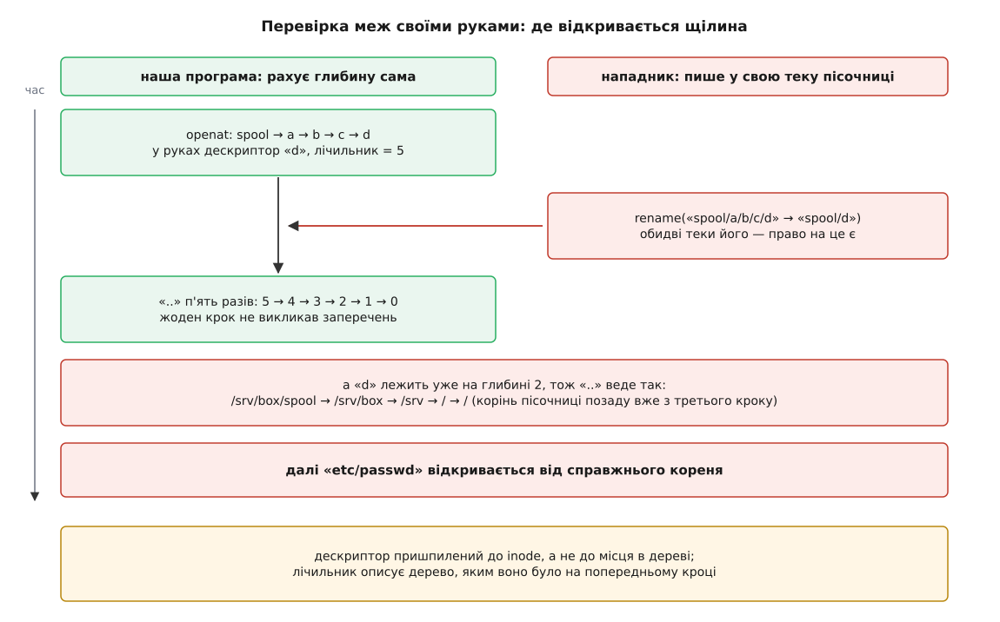

# ⚙️ Пройти шлях руками: програма, яка каже, на чому саме стало

Ядро, відмовляючи, називає причину й ніколи не називає місця: `EACCES` на шлях із шести складників не каже, котрий із шести відмовив. Ця програма каже. Вона проходить шлях так само, як його проходить ядро — по одному складнику за виклик, — і друкує кожен крок разом із типом знайденого, номером inode, номером пристрою і вмістом кожного посилання, яке трапилося дорогою. Друга її половина — спроба втримати обхід усередині заданої теки власними руками; вона потрібна не заради самої утиліти, а щоб побачити, чому така спроба приречена й чому по цю перевірку врешті довелося йти в ядро.

## Один крок обходу — один виклик

Усе стоїть на одному спостереженні: виклики сімейства `*at` приймають дескриптор каталогу й **одне ім'я** — тобто рівно той крок, який ядро всередині себе повторює по колу. Про саме це сімейство є [окрема тема](topic:sys-unix/at-family-syscalls); коротко, замість «шляху від кореня» такий виклик бере пару «дескриптор каталогу плюс шлях відносно нього», і якщо в цьому шляху немає жодної скісної риски, ядро робить рівно один пошук в одній таблиці імен.

Робочим інструментом це роблять три прапорці.

`O_PATH` каже: «мені потрібне місце в дереві, а не доступ до вмісту». Такий дескриптор не читається й не пишеться, зате відкривається без права на читання і працює на **будь-якому** типі файлу. Без нього обхід спіткнувся б на першому ж іменованому каналі, який ніхто не відкрив із іншого боку: звичайний `open()` на FIFO чекає, доки канал відкриють з іншого боку, і програма просто повисла б посеред шляху.

`O_NOFOLLOW` разом із `O_PATH` дає дескриптор на **саме посилання**, а не на його ціль. Це якраз те, чого нам треба: ми хочемо посилання побачити, а не проскочити крізь нього.

Порожній рядок як ім'я — `fstatat(fd, "", &st, AT_EMPTY_PATH)` і `readlinkat(fd, "", buf, n)` — означає «той об'єкт, на який дивиться сам дескриптор». Це дозволили в ядрі 2.6.39, разом із самим `O_PATH`; без цього про здобутий крок довелося б питати кружним шляхом — за іменем у батьківському каталозі, тобто ще раз тим самим пошуком, який ми щойно зробили.

## Програма

```c
/* walk.c — прохід шляхом покомпонентно, зі звітом про кожен крок.
   складання: cc -O2 -o walk walk.c
   вжиток:    ./walk <шлях> [точка-відліку]                        */
#define _GNU_SOURCE
#include <errno.h>
#include <fcntl.h>
#include <limits.h>
#include <stdio.h>
#include <string.h>
#include <sys/stat.h>
#include <sys/sysmacros.h>
#include <unistd.h>

#define MAX_SUBST 40      /* стільки ж підстановок рахує ядро, далі — ELOOP */

static const char *kind(mode_t m)
{
    if (S_ISDIR(m))  return "каталог";
    if (S_ISLNK(m))  return "посилання";
    if (S_ISREG(m))  return "звичайний файл";
    if (S_ISCHR(m))  return "символьний пристрій";
    if (S_ISBLK(m))  return "блоковий пристрій";
    if (S_ISFIFO(m)) return "іменований канал";
    if (S_ISSOCK(m)) return "сокет";
    return "щось інше";
}

/* Проходить path від start_fd (абсолютний — від root_fd), друкуючи кожен крок.
   Повертає O_PATH-дескриптор кінцевого об'єкта або -1 із виставленим errno.  */
static int walk(int start_fd, int root_fd, const char *path)
{
    char bufs[2][PATH_MAX];        /* пінг-понг: нерозібраний залишок шляху */
    int  cur = 0, dir = -1, substitutions = 0, step = 0;

    if (strlen(path) >= PATH_MAX) { errno = ENAMETOOLONG; return -1; }
    strcpy(bufs[cur], path);
    char *rest = bufs[cur];

    dir = dup(path[0] == '/' ? root_fd : start_fd);
    if (dir < 0) return -1;

    for (;;) {
        while (*rest == '/') rest++;          /* «//» — те саме, що «/» */
        if (*rest == '\0') return dir;        /* складники скінчилися */

        char  *slash = strchr(rest, '/');
        size_t len   = slash ? (size_t)(slash - rest) : strlen(rest);
        char   comp[NAME_MAX + 1];

        if (len > NAME_MAX) { errno = ENAMETOOLONG; goto fail; }
        memcpy(comp, rest, len);
        comp[len] = '\0';
        rest = slash ? slash + 1 : rest + len;      /* нерозібраний хвіст */

        int next = openat(dir, comp, O_PATH | O_NOFOLLOW | O_CLOEXEC);
        if (next < 0) {
            int e = errno;                    /* printf псує errno — рятуємо */
            printf("  ✗ став на складнику «%s»: %s (errno %d)\n",
                   comp, strerror(e), e);
            errno = e;
            goto fail;
        }

        struct stat st;
        if (fstatat(next, "", &st, AT_EMPTY_PATH) < 0) { close(next); goto fail; }

        printf("  %2d. %-20s → %s, dev %u:%u, inode %llu\n",
               ++step, comp, kind(st.st_mode),
               major(st.st_dev), minor(st.st_dev),
               (unsigned long long)st.st_ino);

        if (!S_ISLNK(st.st_mode)) {
            close(dir);
            dir = next;              /* знайдене стає новою точкою відліку */
            continue;
        }

        /* Посилання: залишок відкладаємо, на його місце стає вміст. */
        char    target[PATH_MAX];
        ssize_t n = readlinkat(next, "", target, sizeof target - 1);
        close(next);
        if (n < 0) goto fail;
        if ((size_t)n == sizeof target - 1) {  /* readlink мовчки обрізає */
            errno = ENAMETOOLONG;
            goto fail;
        }
        target[n] = '\0';                      /* і нуля не дописує */
        printf("        вміст «%s»; залишок «%s» відкладено\n", target, rest);

        if (++substitutions > MAX_SUBST) { errno = ELOOP; goto fail; }

        char *nb = bufs[cur ^ 1];
        if (snprintf(nb, PATH_MAX, "%s/%s", target, rest) >= PATH_MAX) {
            errno = ENAMETOOLONG;
            goto fail;
        }
        cur ^= 1;
        rest = nb;

        if (target[0] == '/') {          /* абсолютний вміст — знову від кореня */
            close(dir);
            dir = dup(root_fd);
            if (dir < 0) return -1;
        }
        /* відносний вміст: dir лишається каталогом, де лежить саме посилання */
    }

fail:
    { int e = errno; if (dir >= 0) close(dir); errno = e; }
    return -1;
}

int main(int argc, char **argv)
{
    if (argc < 2) {
        fprintf(stderr, "вжиток: %s <шлях> [точка-відліку]\n", argv[0]);
        return 2;
    }
    const char *base = (argc > 2) ? argv[2] : ".";

    int root_fd  = open("/", O_PATH | O_DIRECTORY | O_CLOEXEC);
    int start_fd = open(base, O_PATH | O_DIRECTORY | O_CLOEXEC);
    if (root_fd < 0 || start_fd < 0) { perror("точка відліку"); return 1; }

    printf("шлях «%s», відлік від %s\n", argv[1],
           argv[1][0] == '/' ? "кореня процесу" : base);

    int fd = walk(start_fd, root_fd, argv[1]);
    if (fd < 0) return 1;
    printf("  ✓ дійшли\n");
    close(fd);
    return 0;
}
```

Сорок підстановок і ганяння залишку туди-сюди між двома буферами — це та сама механіка, яку виконує ядро, тільки грубіше. Ядро не склеює вміст посилання із залишком в один рядок: воно кладе залишок на стек кадром і йде далі вмістом, а склеювання коштувало б копіювання й могло б вилізти за `PATH_MAX` там, де насправді все гаразд. Наша версія на цьому справді помиляється в бік суворості — довгий ланцюжок посилань вона відкине з `ENAMETOOLONG` раніше, ніж це зробило б ядро.

## Що вона показує

Каталог `/var/log/app` — посилання на `/srv/logs`, а `/srv/logs` до того ж є точкою монтування окремого тому.

```
$ ./walk /var/log/app/current.log
шлях «/var/log/app/current.log», відлік від кореня процесу
   1. var                  → каталог, dev 8:2, inode 262145
   2. log                  → каталог, dev 8:2, inode 262402
   3. app                  → посилання, dev 8:2, inode 262403
        вміст «/srv/logs»; залишок «current.log» відкладено
   4. srv                  → каталог, dev 8:2, inode 131073
   5. logs                 → каталог, dev 8:17, inode 2
   6. current.log          → звичайний файл, dev 8:17, inode 5019
  ✓ дійшли
```

Крок 5 варто прочитати уважно. Номер пристрою змінився з `8:2` на `8:17`, а номер inode — рівно `2`. Це не збіг: у файлових системах сімейства ext корінь має саме другий inode. Тобто ми не просто зайшли в каталог `logs` — ми перетнули [межу монтування](topic:sys-unix/mount-model) й опинилися в корені зовсім іншої файлової системи, зі своєю нумерацією. Того каталогу `logs`, поверх якого це змонтували, ми не бачимо взагалі: `O_NOFOLLOW` стримує посилання, а не монтування, і жодним прапорцем `openat()` до накритого каталогу не дістатися.

Тепер відмови. Той самий шлях, але останніх складників не існує:

```
$ ./walk /var/log/app/archive/2026.log
   ...
   5. logs                 → каталог, dev 8:17, inode 2
  ✗ став на складнику «archive»: No such file or directory (errno 2)
```

Тут уже видно те, чого не каже `open()`: помилка сталася не «десь у шляху», а після переходу через посилання, вже на іншому томі. Шукати `archive` треба в `/srv/logs`, а не в `/var/log/app`, хоч писали ми друге.

```
$ ./walk /home/ana/public/readme.txt
   1. home                 → каталог, dev 8:2, inode 131074
   2. ana                  → каталог, dev 8:2, inode 393217
  ✗ став на складнику «public»: Permission denied (errno 13)
```

І тут одна тонкість, через яку звіт легко прочитати навпаки. У рядку названо складник, якого **не вдалося знайти**, а відмовив каталог **рядком вище**: пошук `public` іде в таблиці каталогу `ana`, тож це `ana` не дав права шукати всередині себе. Правило просте: при `EACCES` винен не той складник, що в рядку про помилку, а каталог рядком вище — той, у чиїй таблиці шукали.

Так само читається й `ENOTDIR`:

```
$ ./walk /etc/hosts/conf
   1. etc                  → каталог, dev 8:2, inode 262146
   2. hosts                → звичайний файл, dev 8:2, inode 262880
  ✗ став на складнику «conf»: Not a directory (errno 20)
```

Рядок вище вже все пояснив: `hosts` — звичайний файл, шукати в ньому нема де.

## Утримати шлях усередині кореня — своїми руками

Тепер друге завдання, і воно з іншого світу. Програма дістає шлях із чужих рук — з архіву, з запиту, з конфігурації — і мусить гарантувати, що вона нічого не відкриє поза відведеною їй текою. Це [гонка між перевіркою й використанням](topic:sf-security/toctou-race) у чистому вигляді: перевірити рядок наперед не можна, бо між перевіркою й відкриттям дерево встигне змінитися, — тож перевіряти доводиться прямо під час обходу, крок за кроком.

Правила, які напрошуються, такі: жодного переходу за посиланням; жодного перетину монтування; провідні скісні риски ігноруємо, бо для нас коренем є заданий дескриптор; `..` дозволене доти, доки не виводить назовні — а щоб це знати, тримаємо лічильник глибини.

```c
/* Утримати обхід усередині root_fd — власними руками. */
static int walk_beneath(int root_fd, const char *path)
{
    struct stat root_st;
    if (fstatat(root_fd, "", &root_st, AT_EMPTY_PATH) < 0) return -1;

    int dir = dup(root_fd);
    if (dir < 0) return -1;
    int depth = 0;                 /* скільки складників углиб від кореня */

    char buf[PATH_MAX];
    if (strlen(path) >= sizeof buf) { errno = ENAMETOOLONG; goto fail; }
    strcpy(buf, path);
    char *rest = buf;

    for (;;) {
        while (*rest == '/') rest++;
        if (*rest == '\0') return dir;

        char  *slash = strchr(rest, '/');
        size_t len   = slash ? (size_t)(slash - rest) : strlen(rest);
        char   comp[NAME_MAX + 1];

        if (len > NAME_MAX) { errno = ENAMETOOLONG; goto fail; }
        memcpy(comp, rest, len);
        comp[len] = '\0';
        rest = slash ? slash + 1 : rest + len;

        if (strcmp(comp, ".") == 0) continue;

        if (strcmp(comp, "..") == 0) {
            if (depth == 0) { errno = EXDEV; goto fail; }   /* уперлися в корінь */
            int up = openat(dir, "..", O_PATH | O_CLOEXEC);
            if (up < 0) goto fail;
            close(dir);
            dir = up;
            depth--;
            continue;
        }

        int next = openat(dir, comp, O_PATH | O_NOFOLLOW | O_CLOEXEC);
        if (next < 0) goto fail;

        struct stat st;
        if (fstatat(next, "", &st, AT_EMPTY_PATH) < 0) { close(next); goto fail; }
        if (S_ISLNK(st.st_mode))         { close(next); errno = ELOOP; goto fail; }
        if (st.st_dev != root_st.st_dev) { close(next); errno = EXDEV; goto fail; }

        close(dir);
        dir = next;
        depth++;
    }

fail:
    { int e = errno; if (dir >= 0) close(dir); errno = e; }
    return -1;
}
```

Перевірка `st_dev` тут робить одразу дві роботи. Вона відрізає монтування — бо перехід на інший том змінює номер пристрою. І вона ж закриває найгидкіший різновид посилань: [«чарівні» записи в procfs](topic:sys-unix/proc-reading-process-and-kernel-state) на кшталт `/proc/<pid>/fd/3` виглядають як посилання, але замість тексту стрибають просто на об'єкт, який тримає дескриптор, — тобто куди завгодно. Щоб на таке натрапити, обхід спершу мусить зайти в `/proc`, а це окрема файлова система з іншим номером пристрою; перевірка `st_dev` туди й не пускає.

Код виглядає ретельним. Він і є ретельний. І він зламаний.

## Чому ця перевірка приречена

Лічильник `depth` — не факт про світ, а **наша модель** дерева, побудована з того, що ми бачили на попередніх кроках. Дескриптор, який ми тримаємо, пришпилений до inode, а не до місця в дереві: він переживе будь-яке перейменування й не змінить свого значення. Тобто дерево під ногами може рухатися, а лічильник про це не дізнається.

Далі — арифметика нападника.



*Перейменування не зачепило жодного дескриптора — воно лише зробило хибною нашу модель.*

Хай коренем пісочниці буде `/srv/box`, а всередині є тека `spool`, куди нападник має право писати, — це не недогляд, а сенс пісочниці: заради цієї теки все й будували. Він заздалегідь створює в ній ланцюжок `spool/a/b/c/d` і підсовує нам шлях `spool/a/b/c/d/../../../../../etc/passwd`.

Ми заходимо: `spool`, `a`, `b`, `c`, `d` — лічильник п'ять, у руках дескриптор на `d`. У цю мить нападник робить `rename("spool/a/b/c/d", "spool/d")`. Права в нього на це є: обидві теки — його власні. Наш дескриптор і оком не змигнув, але той самий inode лежить тепер на глибині два, а не п'ять.

Далі п'ять разів `..`. Лічильник слухняно йде `5 → 4 → 3 → 2 → 1 → 0`, жоден крок не викликає заперечень — а обхід тим часом іде `/srv/box/spool` → `/srv/box` → `/srv` → `/` → `/`. З третього кроку ми вже поза пісочницею. Останній складник `etc/passwd` відкривається від справжнього кореня системи.

Головне тут не сам сценарій, а те, що жодною доробкою його не закрити. Замінити лічильник чеснішою перевіркою — після кожного кроку підійматися дескрипторами вгору, доки не впізнаємо корінь за парою `st_dev`/`st_ino`, — можна, але це перетворює обхід на квадратичний за кількістю викликів і **не рятує**: доки перевірка йде, дерево так само рухається, і відповідь «щойно було всередині» приходить уже застарілою. Будь-яка перевірка, написана в просторі користувача, відповідає на питання про минуле, а діяти доводиться в теперішньому.

> 🔧 **Навіщо це.** Найкращий доказ безнадійності — те, що ядро, яке тримає всі потрібні замки, у цій самій ситуації теж не вдає впевненості. Коли `openat2()` з обмеженням області бачить, що просто під час обходу сталося перейменування чи монтування, він не вгадує — він відмовляє з `EAGAIN`, і повторити спробу має вже програма. Якщо навіть звідти, зсередини, відповідь інколи «не знаю», то перевірка ззовні, між викликами, не має шансів у принципі. Тому єдиний правильний висновок із цього коду такий: писати його в бойову програму не треба.

## Те саме одним викликом

Виклик `openat2()` (ядро 5.6, 2020 рік) відрізняється від `openat()` не набором можливостей, а тим, **коли** застосовуються правила: не до й не після обходу, а на кожному його кроці, зсередини, під тими самими замками, що й сам пошук. Написав його Алекса Сараї — супровідник runC і бібліотеки `libpathrs`, тобто саме тієї програмної родини, яка роками наступала на все описане вище й доти обходилася власними хиткими перевірками.

Обгортки в glibc для нього немає — доводиться викликати ядро самотужки.

```c
#define _GNU_SOURCE
#include <errno.h>
#include <fcntl.h>
#include <sys/syscall.h>
#include <unistd.h>

#if __has_include(<linux/openat2.h>)
#  include <linux/openat2.h>
#else                                  /* заголовки старіші за ядро 5.6 */
#  include <linux/types.h>
struct open_how { __u64 flags, mode, resolve; };
#  define RESOLVE_NO_XDEV       0x01
#  define RESOLVE_NO_MAGICLINKS 0x02
#  define RESOLVE_NO_SYMLINKS   0x04
#  define RESOLVE_BENEATH       0x08
#  define RESOLVE_IN_ROOT       0x10
#  define RESOLVE_CACHED        0x20
#endif
#ifndef __NR_openat2
#  define __NR_openat2 437     /* x86, x86-64, ARM, ARM64, RISC-V */
#endif

/* Відкрити path так, ніби root_fd — корінь файлової системи.
   Усе, що з нього виводить, замикається всередині. */
static int open_in_root(int root_fd, const char *path, unsigned long long flags)
{
    struct open_how how = { .flags = flags, .resolve = RESOLVE_IN_ROOT };

    for (int tries = 0; tries < 16; tries++) {
        long fd = syscall(__NR_openat2, root_fd, path, &how, sizeof how);
        if (fd >= 0 || errno != EAGAIN)
            return (int)fd;
        /* EAGAIN: просто під час обходу хтось перейменував каталог або
           щось змонтував, і ядро відмовилося вгадувати. Пробуємо ще. */
    }
    errno = EAGAIN;
    return -1;
}
```

Три дрібниці, на яких спотикаються при першій зустрічі. Структура `open_how` мусить бути занулена **повністю**: ядро перевіряє кожен біт, і випадкове сміття в полі `resolve` дасть `EINVAL` замість очікуваного відкриття. Іменовані ініціалізатори (`.flags = …`) зануляють решту полів самі — а от структура, оголошена окремим рядком і заповнена присвоєннями, лишиться зі сміттям зі стека. Розмір передають окремим аргументом: так ядро розрізняє старі й нові програми, і якщо передати більший розмір із ненульовими полями, яких ядро не знає, воно відмовить із `E2BIG`. І цикл повторів обов'язково має межу — інакше нападник, який у циклі перейменовує теку, підвісить вам потік назавжди.

Тепер той самий шлях, що пробив пісочницю:

```c
int root = open("/srv/box", O_PATH | O_DIRECTORY | O_CLOEXEC);

open_in_root(root, "spool/a/b/c/d/../../../../../etc/passwd", O_RDONLY);
/* → /srv/box/etc/passwd, скільки б «..» там не було */

open_in_root(root, "/etc/passwd", O_RDONLY);
/* → /srv/box/etc/passwd: абсолютний шлях відлічують від нашого кореня */
```

Прапорців обмеження шість, і вибирати між ними треба свідомо, бо двоє найпотрібніших поводяться протилежно.

`RESOLVE_IN_ROOT` **замикає**: заданий каталог стає коренем, `..` у ньому веде в нього самого, абсолютні посилання розбирають від нього. Це поведінка [chroot](topic:sys-unix/chroot), тільки без окремого процесу й без привілеїв. Саме її хоче розпакувальник архівів: усередині архіву цілком законно трапляється і `../`, і посилання на `/etc/passwd`, і все це має лягти всередину цільової теки, а не викликати помилку.

`RESOLVE_BENEATH` **відмовляє**: якщо хоч один складник опинився поза заданим каталогом, виклик повертає `EXDEV`. Це поведінка для сервера, який приймає шлях від клієнта: підозрілий шлях краще відкинути з гучною помилкою, ніж тихо перетлумачити.

Решта чотири вимикають окремі різновиди стрибків: `RESOLVE_NO_SYMLINKS` — жодних посилань узагалі (і, як наслідок, жодних чарівних теж); `RESOLVE_NO_MAGICLINKS` — самі лише чарівні посилання `/proc`; `RESOLVE_NO_XDEV` — жодного перетину монтувань, включно з прив'язними; `RESOLVE_CACHED` (з ядра 5.12) — відмовитися з `EAGAIN`, якщо шлях не в кеші, замість того щоб іти на диск, що дає програмі змогу відкласти повільне відкриття в окремий потік.

Одну дрібницю варто тримати в голові: `RESOLVE_IN_ROOT` **наразі** заодно вимикає й чарівні посилання, але документація прямо каже, що це може змінитися. Тож коли вам потрібна саме ця заборона — додавайте `RESOLVE_NO_MAGICLINKS` явно, не покладаючись на побічний ефект.

## Ціна кроку

Порахуймо, у що обходиться ручний обхід того шляху, з якого починали.

```
шлях «/var/log/app/current.log»
складників після підстановки посилання — 6, посилань — 1

уручну:   1 (open точки відліку)
        + 6 · (openat + fstatat)
        + 1 · readlinkat
        = 14 переходів у ядро

openat2:  1 перехід
```

Кожен перехід у ядро й назад коштує сотні наносекунд на сам лише перехід, а `openat` понад те робить справжній пошук імені. Для діагностичної утиліти, яка запускається раз, чотирнадцять викликів замість одного — ніщо. Для сервера, який відкриває тисячі файлів за секунду, це вже різниця між гарячим шляхом і вузьким місцем. Саме тому `openat2()` — не просто зручність: він повертає ціну одного виклику, не втрачаючи гарантії, заради якої ручний обхід і писали.

## Де воно ламається

**Розбиття рядка ковтає значуще.** Спокуса взяти `strtok()` велика, і вона хибна відразу з трьох боків: він переписує переданий буфер (дайте йому незмінний рядок просто з коду — дістанете аварію), він не має власного стану на потік (у бібліотеці треба `strtok_r`), і — найважливіше — він мовчки склеює порожні складники, тобто стирає різницю між `a/b` і `a/b/`. Кінцева скісна риска в ядрі значуща: вона вимагає, щоб останній складник виявився каталогом. Наша програма її теж губить, і це чесно треба знати, читаючи її звіт. Так само вона розходиться з ядром на порожньому рядку: ядро дає `ENOENT`, а наш обхід просто повертає точку відліку.

**`O_PATH`-дескриптор не годиться для читання.** Спроба `read()` дасть `EBADF` — і це не помилка в коді, а сенс прапорця. Щоб дочитатися до вмісту, дескриптор перевідкривають через `/proc/self/fd/N`; отже, така програма мовчазно залежить від змонтованого `/proc`, чого в мінімальному контейнері може й не бути. Гірше того: `/proc/self/fd/N` — саме те «чарівне» посилання, яке `RESOLVE_NO_MAGICLINKS` забороняє, тож у суворому режимі ваш власний спосіб перевідкриття теж перестане працювати.

**`readlink` не дописує нуля й мовчки обрізає.** Він повертає кількість байтів і на цьому все: нуль ставите ви самі, а якщо повернуте число дорівнює розмірові буфера, ви не знаєте, чи вміст був рівно такий, чи його підрізали. Тому в програмі буфер просять на байт менший, а рівність вважають підозрою на обрізання. Дізнатися розмір наперед із `st_size` теж не вихід: на деяких файлових системах, зокрема в procfs, там нуль.

**Між кроками минає час.** Кожен окремий крок неподільний, послідовність кроків — ні. Усе, що ви перевірили на кроці `n`, до кроку `n+1` уже застаріло; тому робочий висновок із цієї програми — діагностичний, а не архітектурний. Коли потрібна гарантія, а не звіт, — місце обмеженням у ядрі.

**Монтування проходять непомітно.** `openat()` перетинає межу файлової системи без жодного розголосу, `O_NOFOLLOW` тут не стримує нічого, а накритий каталог стає недосяжним на ім'я взагалі. Єдина ознака переходу — зміна `st_dev`; на неї й опирається перевірка. І пам'ятайте, що номер inode унікальний лише в межах свого тому, тож порівнювати об'єкти можна тільки парою `st_dev` разом зі `st_ino`: той самий номер inode легко трапляється на різних томах.

**`errno` треба рятувати перед друком.** `printf` та `strerror` цілком мають право його змінити, і звіт про помилку тоді назве геть іншу причину, ніж була. У коді вище значення знімають у локальну змінну першим же рядком — дрібниця, яка коштує довгих годин, коли її забути.
