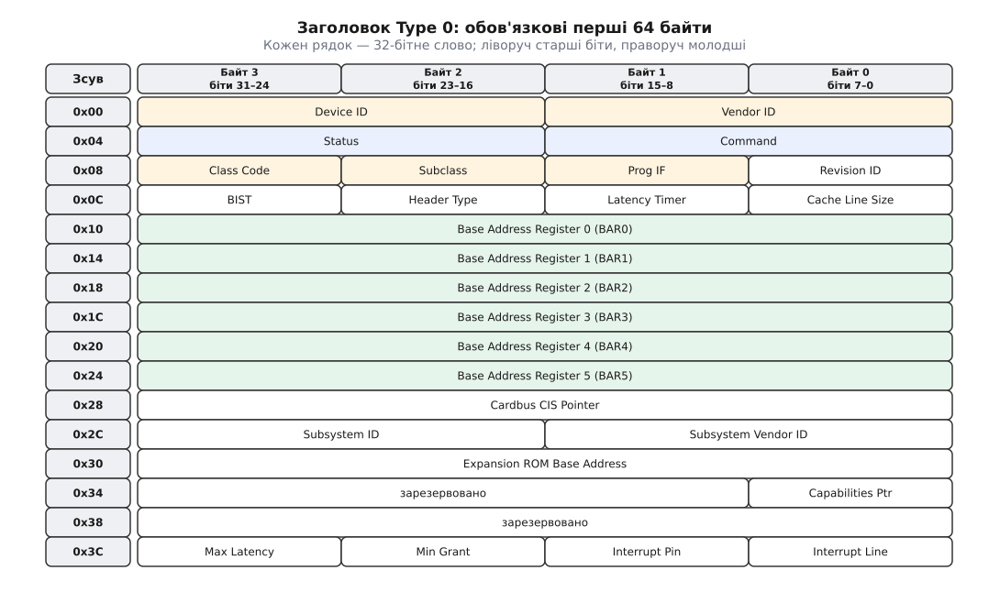
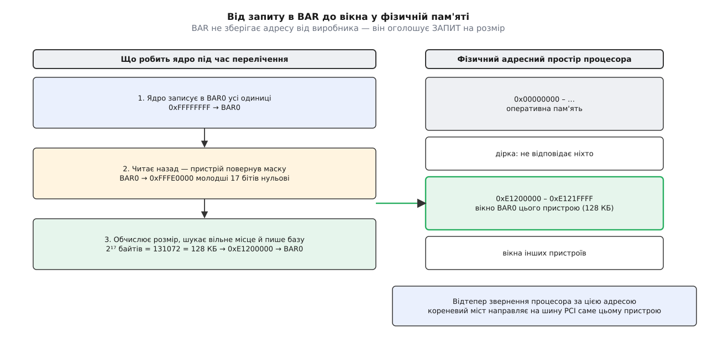

<preknowlist>
- [Регістри пристрою в пам'яті: ioremap](topic:sys-unix/mmio-and-ioremap) — регістри мікросхеми відповідають на ті самі транзакції шини, що й комірки пам'яті, і живуть у спільному фізичному адресному просторі.
- [Модулі ядра](topic:sys-unix/kernel-modules) — драйвер може бути завантажений і вивантажений на ходу, а не лише вкомпільований у ядро.
- [Прив'язка драйвера до пристрою](topic:sys-unix/driver-probe-and-binding) — ядро тримає окремо список пристроїв і список драйверів, а зводить їх функція `probe()`.
- [Переривання та нижні половини](topic:sys-unix/interrupts-bottom-halves) — як пристрій повідомляє процесор, що щось сталося, і що таке номер IRQ.
</preknowlist>

Уяви, що ти додаєш нову мережеву карту чи відеоадаптер у свій комп'ютер. Раніше, у часи шини ISA, тобі доводилося б вручну виставляти джампери на платі, щоб обрати переривання (IRQ) та адреси портів вводу/виводу, уникаючи конфліктів з іншими пристроями. Операційна система мала бути жорстко сконфігурована під це апаратне забезпечення. Проте сьогодні ядро Linux самостійно знаходить нові пристрої, автоматично виділяє їм ділянки фізичного адресного простору й підвантажує потрібні драйвери без жодного хардкоду адрес. Як саме ядро дізнається, що ти вставив у слот материнської плати, і як воно налаштовує цей пристрій для роботи? Відповідь криється в архітектурі шини PCI (та її спадкоємиці PCIe) і механізмі конфігураційного простору.

Шина PCI (Peripheral Component Interconnect) створювалася з ідеєю Plug and Play: система повинна вміти сама перелічити (enumerate) усі підключені пристрої, прочитати їхні ідентифікатори та налаштувати ресурси. Щоб це стало можливим, кожен PCI-пристрій має стандартизовану апаратну структуру, яка називається конфігураційним простором (Configuration Space). Це невелика ділянка пам'яті безпосередньо на самому пристрої (256 байтів для класичного PCI, 4 КБ для PCIe), яку ядро може прочитати ще до того, як драйвер пристрою буде завантажений.

## Адресація BDF: Як знайти пристрій
Перш ніж ядро зможе прочитати конфігураційний простір, йому потрібно знати, як звернутися до пристрою. У світі PCI кожен пристрій має унікальну фізичну адресу, яка складається з трьох компонентів: Bus (Шина), Device (Пристрій) та Function (Функція), скорочено **BDF**.
- **Bus (Шина):** 8-бітне число (0-255). Система може мати кілька шин (наприклад, через мости PCI-to-PCI).
- **Device (Пристрій):** 5-бітне число (0-31). Фізичний слот або мікросхема на шині.
- **Function (Функція):** 3-бітне число (0-7). Один фізичний пристрій може виконувати кілька логічних функцій (наприклад, комбінована карта Wi-Fi + Bluetooth матиме дві функції).

Коли ядро Linux завантажується, підсистема PCI обходить ці адреси: на кожній відомій шині опитує всі 32 позиції пристроїв, а решту функцій перевіряє лише там, де функція 0 позначила себе багатофункціональною. Якщо за адресою відповідає пристрій (Vendor ID не `0xFFFF`), ядро читає його конфігураційний простір.

## PCI Configuration Space: Паспорт пристрою
Конфігураційний простір — це, по суті, апаратний «паспорт» пристрою. Перші 64 байти мають жорстко стандартизований формат (Configuration Header). Саме звідси ядро дізнається, що це за пристрій і який драйвер йому потрібен.



*Формат цих 64 байтів однаковий для будь-якого PCI-пристрою будь-якого виробника — саме тому ядро читає їх ще до того, як знає, що це за пристрій.*

Найважливіші поля цього заголовка:
1. **Vendor ID (16 біт) та Device ID (16 біт):** Унікальні ідентифікатори виробника та самої моделі пристрою. Наприклад, Vendor ID `0x8086` завжди означає Intel. Пара цих значень дозволяє ядру знайти відповідний драйвер.
2. **Class Code (24 біти):** Визначає загальний тип пристрою (мережевий контролер, відеокарта, контролер накопичувача тощо). Завдяки цьому ядро може використовувати стандартні драйвери, навіть якщо точна модель (Device ID) невідома.
3. **Command & Status:** Регістри керування (увімкнення доступу до пам'яті, I/O, переривань) та статусів пристрою.
4. **Base Address Registers (BAR):** Найскладніший і найважливіший механізм для роботи з пристроєм, який відповідає за виділення адресного простору.

Кожне з цих полів лежить за жорстко визначеним зсувом, і драйвер читає його саме звідти. Повна мапа заголовка — які байти під яке поле відведено, які біти в `Command` вмикають пам'ять і Bus Master, як із `Class Code` складається тип пристрою — у довідці «PCI Configuration Space: заголовок і регістри» до цієї теми.

## Вікна BAR: Реєстрація ресурсів
Драйверу потрібно спілкуватися з пристроєм (наприклад, читати буфери мережевих пакетів). Це робиться через читання/запис фізичної пам'яті (Memory-Mapped I/O, MMIO) або через порти вводу/виводу. Але де саме у фізичній пам'яті комп'ютера знаходяться ці регістри пристрою?

Тут у гру вступають BAR (Base Address Registers). У стандартному заголовку є 6 вікон BAR (BAR0–BAR5). BAR не містить жорсткої адреси, зашитої виробником. Натомість це механізм **запиту ресурсів**.

Коли ядро сканує пристрій, воно:
1. Записує в BAR усі одиниці (`0xFFFFFFFF`).
2. Читає значення назад. Пристрій повертає маску, де молодші біти скинуті в 0, що вказує на розмір потрібного вікна пам'яті.
3. Ядро обчислює розмір, знаходить вільне місце у фізичному адресному просторі процесора (яке не зайняте RAM чи іншими пристроями) і записує цю стартову адресу в BAR.



*Адресу вибирає ядро, а не виробник: пристрій називає лише розмір, який йому потрібен.*

Відтепер, коли процесор звертається до цієї фізичної адреси, кореневий міст (host bridge) направляє запит прямо на шину PCI до цього конкретного пристрою.

## Перелічення (Enumeration) ядром Linux
Коли Linux стартує, підсистема PCI виконує перелічення шини. Цей процес виглядає так:
1. Сканування шини 0 (Root Complex).
2. Якщо знайдено пристрій, читається Vendor/Device ID.
3. Якщо пристрій є мостом (PCI-to-PCI bridge), ядро рекурсивно сканує шину за цим мостом, призначаючи їй новий номер (Bus Number).
4. Зчитування вимог BAR і розподіл глобального фізичного адресного простору. Ядро стежить, щоб вікна різних пристроїв не перетиналися.
5. Налаштування переривань (IRQ) і заповнення структур `struct pci_dev` у пам'яті ядра.

Увесь цей процес відбувається автоматично. Користувач може побачити результат сканування за допомогою утиліти `lspci`:

```bash
$ lspci -vvv
00:1f.6 Ethernet controller: Intel Corporation Ethernet Connection (2) I219-V (rev 31)
        Subsystem: ASUSTeK Computer Inc. Device 8672
        Control: I/O- Mem+ BusMaster+ SpecCycle- MemWINV- VGASnoop- ParErr- Stepping- SERR- FastB2B- DisINTx+
        Status: Cap+ 66MHz- UDF- FastB2B- ParErr- DEVSEL=fast >TAbort- <TAbort- <MAbort- >SERR- <PERR- INTx-
        Latency: 0
        Interrupt: pin A routed to IRQ 125
        Region 0: Memory at e1200000 (32-bit, non-prefetchable) [size=128K]
        Capabilities: [c8] Power Management version 3
        Kernel driver in use: e1000e
        Kernel modules: e1000e
```

Тут ми бачимо BDF-адресу `00:1f.6`, ідентифікатори пристрою, призначене переривання (`IRQ 125`), виділене вікно пам'яті (`Region 0: Memory at e1200000 [size=128K]`, що відповідає BAR0) та драйвер, який обробляє цей пристрій (`e1000e`).

## Підсистема pci_driver: Як драйвер знаходить пристрій
Ядро склало список усіх `struct pci_dev`. З іншого боку, модулі драйверів (які можуть бути завантажені пізніше або вкомпіловані в ядро) реєструють свої `struct pci_driver`. 

Драйвер повинен сказати ядру, які пристрої він підтримує. Це робиться через таблицю ідентифікаторів `pci_device_id`. 

```c
#include <linux/module.h>
#include <linux/pci.h>

/* Таблиця підтримуваних пристроїв */
static const struct pci_device_id my_pci_ids[] = {
    { PCI_DEVICE(0x8086, 0x10d3) }, /* Конкретний Vendor ID та Device ID */
    { 0, } /* Завершення таблиці */
};
MODULE_DEVICE_TABLE(pci, my_pci_ids);

/* Функція, що викликається, коли ядро знаходить сумісний пристрій */
static int my_pci_probe(struct pci_dev *pdev, const struct pci_device_id *id)
{
    int err;

    /* Вмикаємо пристрій (пробуджуємо з D3hot, вмикаємо BAR) */
    err = pci_enable_device(pdev);
    if (err) return err;

    /* Запитуємо регіони пам'яті (щоб інший драйвер їх не зайняв) */
    err = pci_request_regions(pdev, "my_driver");
    if (err) goto err_disable;

    /* ... тут мапимо BAR у віртуальну пам'ять — pci_iomap(pdev, 0, 0) —
       і працюємо з регістрами через ioread32()/iowrite32() ... */

    pr_info("my_driver: Знайдено пристрій!\n");
    return 0;

err_disable:
    pci_disable_device(pdev);
    return err;
}

/* Функція відключення (видалення модуля або гаряче витягання) */
static void my_pci_remove(struct pci_dev *pdev)
{
    pci_release_regions(pdev);
    pci_disable_device(pdev);
    pr_info("my_driver: Пристрій відключено\n");
}

static struct pci_driver my_pci_driver = {
    .name     = "my_driver",
    .id_table = my_pci_ids,
    .probe    = my_pci_probe,
    .remove   = my_pci_remove,
};

module_pci_driver(my_pci_driver);
MODULE_LICENSE("GPL");
```

Коли ядро бачить, що є `pci_dev` із Vendor/Device ID, який збігається з записом у таблиці `pci_device_id` зареєстрованого `pci_driver`, воно викликає функцію `probe`. Саме в `probe` драйвер:
1. Викликає `pci_enable_device()`, що дозволяє пристрою відповідати на запити до його BAR.
2. Резервує ресурси `pci_request_regions()`, щоб ядро не віддало їх комусь іншому.
3. Отримує віртуальну адресу для фізичного BAR за допомогою `pci_iomap(pdev, bar, maxlen)`. Це обгортка PCI-рівня над загальним відображенням: вона сама бере базу й довжину вікна (`pci_resource_start()` / `pci_resource_len()`), і далі для memory-BAR викликає `ioremap()`, а для I/O-BAR — `__pci_ioport_map()`; нуль у `maxlen` означає «відобразити вікно цілком» (функція `pci_iomap_range()`; історично цей код лежав у `lib/pci_iomap.c`, у новіших ядрах його перенесли до `drivers/pci/`). Саме тому доступ до отриманої адреси йде не розіменуванням звичайного вказівника, а через `ioread32()` / `iowrite32()` — вони однаково правильно спрацюють і для MMIO, і для портів.

Якщо пристрій відключається (або вивантажується драйвер), ядро викликає функцію `remove`, де драйвер зобов'язаний звільнити всі ресурси. 

Завдяки такій архітектурі Linux досягає повної абстракції: ядро самостійно розв'язує конфлікти фізичних адрес, а драйвер лише запитує «дай мені мій простір» і спокійно працює зі своїм апаратним забезпеченням.
