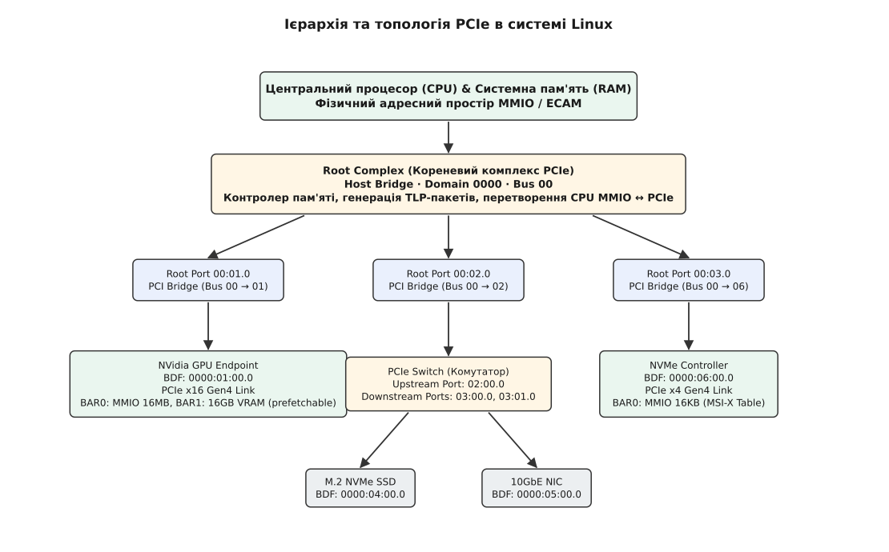
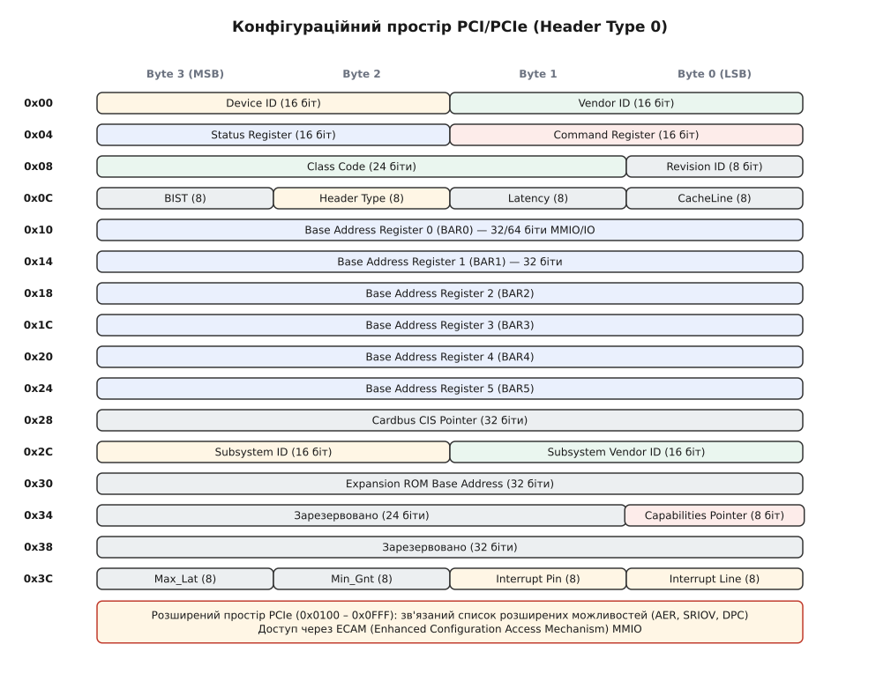
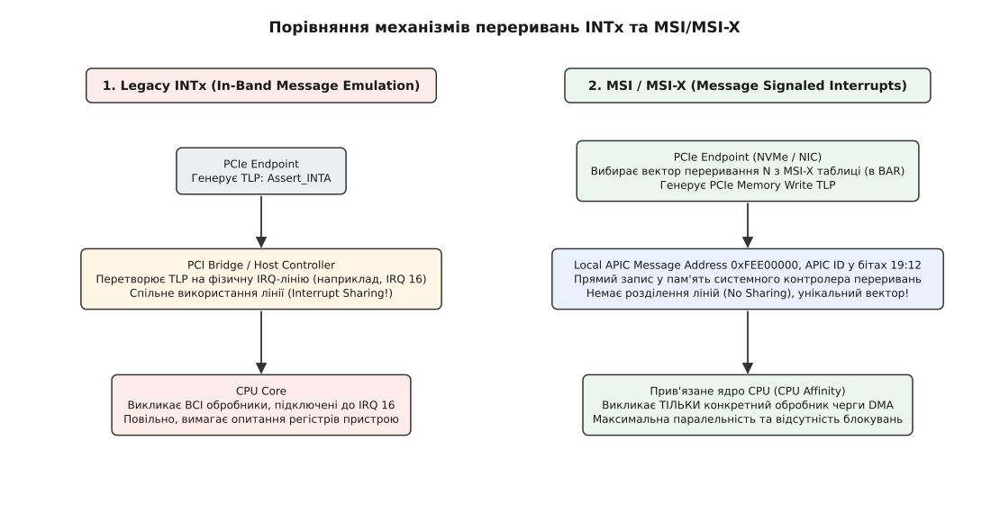

# Підсистема PCI Express

<preknowlist>
- [Модель драйверів та прив'язка probe](topic:sys-unix/driver-probe-and-binding) — механізм збігу `struct device_driver` та `struct device`, життєвий цикл реєстрації та вивантаження.
- [Прямий доступ до пам'яті DMA](topic:sys-unix/dma-and-buffers) — принцип когерентного та потокового відображення RAM для периферійних пристроїв.
- [Обробка переривань у ядрі](topic:sys-unix/interrupts-bottom-halves) — лінії IRQ, обробники топ-хав та нижні половинки (tasklets, workqueues).
</preknowlist>

Коли сучасний сервер ініціалізує NVMe-накопичувач на швидкості 7 ГБ/с або передає кадри на відеокарту, центральний процесор не бере участі в пересиланні кожного байта даних. Натомість операційна система мусить за частки мілісекунди під час завантаження виявити апаратний пристрій, прочитати його фізичні вимоги, виділити діапазони фізичних адрес пам'яті (MMIO), налаштувати вектори переривань та дозволити контролеру самостійно читати й писати в оперативну пам'ять (DMA). Головним архітектурним фундаментом, який забезпечує цю взаємодію в сучасних обчислювальних системах, є підсистема PCI Express (PCIe).

Історично PCIe виникла як еволюційна відповідь на фізичні обмеження паралельної шини PCI (детальніше див. [📜 Еволюція шини PCI: від паралельних дротів до послідовних пакетів PCIe](topic:sys-unix/pcie-fabric-msix-and-aer/hist-pci-to-pcie.md)). Зберігши програмну сумісність із концепціями конфігураційного простору та регістрів BAR, PCIe кардинально змінила фізичну природу з'єднання: замість спільної паралельної шини було впроваджено високошвидкісні послідовні точкові лінки з комутацією пакетів.

Повний ланцюжок ініціалізації пристрою PCIe 4.0 (наприклад, NVMe SSD з адресою BDF `0000:04:00.0`) розпочинається зі зчитування 4096-байтного розширеного конфігураційного простору (ECAM), звідки ядро зчитує `Vendor ID` (`0x144d` для Samsung) та `Device ID` (`0xa808`), після чого відображає 16-кілобайтний Memory BAR0 в MMIO, виділяє 32 вектори MSI-X для черг I/O та реєструє обробник помилок AER.

---

## 1. Архітектура та топологія PCIe в ядрі Linux

Фізично з'єднання PCIe являє собою повнодуплексну мережу «точка-точка» (Point-to-Point). Кожен пристрій підключається до системи через один або декілька послідовних каналів (Lanes — позначуваних як x1, x2, x4, x8, x16, x32). Кожен канал складається з двох диференційних пар дротів: однієї для передачі (TX) та однієї для прийому (RX). Сигнали передаються низьковольтною диференційною парою: приймач реагує на різницю напруг між двома провідниками, тому синфазна завада, що діє на обидва дроти однаково, взаємно знищується.

На логічному рівні стек протоколу PCIe розбито на три рівні:
1. **Транзакційний рівень (Transaction Layer):** Формує пакети TLP (Transaction Layer Packets), які несуть операції читання/запису пам'яті (MMIO), портів введення-виведення (I/O), конфігураційного простору та повідомлень (Interrupts/Messages).
2. **Канальний рівень (Data Link Layer):** Додає до пакетів послідовні номери та контрольні суми LCRC, гарантуючи надійну доставку пакетів через механізм повторних спроб (ACK/NAK protocol) та керування потоком на основі кредитів (Credit-Based Flow Control).
3. **Фізичний рівень (Physical Layer):** Відповідає за лінійне кодування (8b/10b у Gen1/Gen2, 128b/130b у Gen3–Gen5), перетворення паралельних даних у послідовний потік бітів та вирівнювання тактової частоти.


*Ієрархія та топологія PCIe в системі Linux*

### 1.1 Ієрархічна структура та адресація BDF

Операційна система Linux бачить апаратуру PCIe у вигляді ієрархічного дерева, в основі якого лежать наступні компоненти:

* **Root Complex (Кореневий комплекс):** Модуль системної логіки (інтегрований у процесор або північний міст), який з'єднує процесор та системну RAM із фабрикою PCIe. Root Complex генерує транзакції PCIe у відповідь на командні інструкції CPU і перетворює відповіді PCIe на переривання та операції запису в RAM.
* **PCI Bridge (Міст):** Пристрій, що з'єднує дві шини. Кожен порт Root Complex (Root Port) логічно є мостом PCI-to-PCI.
* **PCIe Switch (Комутатор):** Пристрій, що розгалужує один порт на декілька. Містить один висхідний порт (Upstream Port), звернений до Root Complex, внутрішню віртуальну шину з мостами та кілька низхідних портів (Downstream Ports) — під кожним з них з'являється власна шина.
* **Endpoint (Кінцевий пристрій):** Периферійний контролер (відеокарта, NVMe SSD, мережева карта), який є кінцевим споживачем або ініціатором транзакцій TLP.

Для унікальної ідентифікації кожного пристрою в системі використовується потрійна адресація **BDF (Bus : Device : Function)**, до якої в сучасних багатопроцесорних системах додається ідентифікатор сегмента/домену (**Domain**):

```text
Domain:Bus:Device.Function (наприклад, 0000:01:00.0)
```

* **Domain (Segment):** 16-бітне число (0x0000..0xFFFF). Дозволяє об'єднувати до 65536 незалежних доменів PCIe, усуваючи обмеження в 256 шин на систему.
* **Bus Number:** 8-бітне число (0..255). Номер шини в межах домену. Шина 00 зазвичай закріплена за Root Complex.
* **Device Number:** 5-бітне число (0..31). Номер слота або пристрою на шині.
* **Function Number:** 3-бітне число (0..7). Номер логічної функції всередині пристрою (багатофункціональні пристрої, наприклад, відеокарта зі вбудованим аудіоконтролером, мають `00.0` для GPU та `00.1` для Audio).

---

## 2. Конфігураційний простір PCI (Configuration Space)

Причиною, чому пристрої PCI/PCIe не вимагають апріорних знань операційної системи про номери портів чи фізичні адреси в RAM, є наявність у кожного пристрою **конфігураційного простору (Configuration Space)**. Це стандартизований масив регістрів апаратури, доступ до якого здійснюється до того, як пристрою будуть призначені будь-які адреси в пам'яті.

Класичний PCI має 256 байтів конфігураційного простору. Специфікація PCIe розширила його до **4096 байтів** (PCI Express Extended Configuration Space).

Перші 64 байти утворюють стандартний заголовок пристрою. Існує два основних типи заголовка:
* **Header Type 0 (0x00):** Використовується для кінцевих пристроїв (Endpoints).
* **Header Type 1 (0x01):** Використовується для мостів (PCI Bridges та Root Ports) і містить регістри діапазонів шин (Primary, Secondary, Subordinate Bus Numbers).


*Структура заголовка PCI Configuration Space Header Type 0*

### 2.1 Ключові поля заголовка Header Type 0

1. **Vendor ID (0x00, 16 біт):** Унікальний ідентифікатор компанії-виробника апаратури (видається консорціумом PCI-SIG). Наприклад, `0x10DE` — Nvidia, `0x8086` — Intel, `0x1022` — AMD. Значення `0xFFFF` вказує на відсутність пристрою за вказаною BDF-адресою.
2. **Device ID (0x02, 16 біт):** Ідентифікатор конкретної моделі пристрою, визначений виробником.
3. **Command Register (0x04, 16 біт):** Бітове маскове поле, що відповідає за активацію апаратних можливостей:
   * `Bit 0 (IO Space Enable):` Дозволяє пристрою відповідати на операції I/O Port.
   * `Bit 1 (Memory Space Enable):` Дозволяє пристрою відповідати на транзакції пам'яті (MMIO).
   * `Bit 2 (Bus Master Enable):` Дозволяє пристрою виступати ініціатором транзакцій DMA на шині.
4. **Status Register (0x06, 16 біт):** Відображає апаратний стан пристрою. Біт 4 (`Capabilities List`) вказує на наявність зв'язаного списку додаткових можливостей.
5. **Class Code (0x08, 24 біти):** Визначає функціональне призначення пристрою. Складається з трьох байтів: Base Class (наприклад, `0x01` — Storage, `0x03` — Display), Subclass (у класі Storage `0x08` — NVM-контролер, а `0x06` — SATA/AHCI; у класі Display `0x00` — VGA) та Programming Interface (Prog IF). Завдяки Class Code ядро Linux може підключити універсальний драйвер (наприклад, драйвер `nvme` або `ahci`) навіть до невідомого пристрою.
6. **Capabilities Pointer (0x34, 8 біт):** Вказівник на перший елемент однозв'язаного списку розширених можливостей (Capabilities) у діапазоні адрес `0x40`..`0xFF`.

### 2.2 Механізми доступу: Port I/O проти ECAM

У застарілих архітектурах x86 доступ до 256 байтів конфігураційного простору здійснювався через два 32-бітних порти I/O: `0xCF8` (`CONFIG_ADDRESS`) та `0xCFC` (`CONFIG_DATA`).

Щоб прочитати регістр, BIOS або ядро описували BDF-адресу у порту `0xCF8`:

```text
CONFIG_ADDRESS Bit Format:
[31]    : Enable Bit (1)
[23..16]: Bus Number (0-255)
[15..11]: Device Number (0-31)
[10..8] : Function Number (0-7)
[7..2]  : Register Offset (aligned to 4 bytes)
```

Цей метод мав два недоліки: він вимагав блокування спільного порту при атомарних операціях і не дозволяв адресувати розширений 4-кілобайтний простір PCIe.

У сучасних системах PCIe доступ здійснюється через **ECAM (Enhanced Configuration Access Mechanism)**. Під час завантаження системи ACPI (через таблицю `MCFG`) або Device Tree повідомляє ядру базову фізичну адресу пам'яті, у яку відображається весь конфігураційний простір усіх шин.

Формула обчислення фізичної адреси конкретного регістра в ECAM:

```text
Physical_Address = ECAM_Base_Address + (Bus << 20) + (Device << 15) + (Function << 12) + Register_Offset
```

Завдяки ECAM читання будь-якого конфігураційного регістра пристрою зводиться до звичайного читання комірки віртуальної пам'яті ядра за допомогою `readl()`.

---

## 3. Базові адресні регістри (BARs) та відображення пам'яті (MMIO)

Центральний процесор взаємодіє з регістрами периферійного пристрою (наприклад, чергами команд мережевої карти або командними буферами GPU) через фізичний адресний простір. **Base Address Registers (BARs)** — це регістри у заголовку конфігураційного простору (зсуви `0x10`..`0x24`), які слугують для узгодження між пристроєм та системним ПЗ щодо розміру та розташування цих регістрів.

Кінцевий пристрій Header Type 0 має **6 регістрів BAR** (BAR0..BAR5), кожен шириною 32 біти.

### 3.1 Алгоритм визначення розміру BAR (BAR Sizing)

Під час ініціалізації пристрій знає, скільки адресного простору йому потрібно, але не знає, які ділянки фізичного адресного простору вільні (вікна BAR не лежать в оперативній пам'яті — вони лише займають адреси поряд із нею). Ядро Linux (або UEFI) виконує діагностичний алгоритм визначення розміру для кожного BAR:

1. **Читання початкового значення:** Ядро зчитує поточне значення BAR.
2. **Запис усіх одиниць:** Ядро записує значення `0xFFFFFFFF` у BAR.
3. **Читання маски:** Апаратура пристрою маскує біти, які вона не здатна змінити, і повертає значення, в якому молодші N бітів обнулені.
4. **Обчислення розміру:** Кількість обнулених молодших бітів визначає необхідний розмір пам'яті як `2^N`.
5. **Призначення адреси:** Ядро знаходить вільну ділянку у фізичному адресному просторі відповідного розміру та вирівнювання, записує призначену базову фізичну адресу назад у BAR і відновлює прапорці.

```text
Приклад обчислення розміру BAR:
1. Запис у BAR:       0xFFFFFFFF
2. Прочитано назад:    0xFFF00000
3. Інверсія бітів:    ~0xFFF00000 = 0x000FFFFF
4. Додавання 1:        0x000FFFFF + 1 = 0x00100000 (1 МБ)
Висновок: Пристрою потрібен блок пам'яті розміром 1 Мегабайт, вирівняний по межі 1 МБ.
```

### 3.2 Типи BAR та 64-бітна адресація

Молодші біти BAR мають спеціальне призначення і вказують на тип ресурсу:

* **Memory BAR (Bit 0 = 0):** Вказує, що регістри пристрою будуть відображені у фізичну пам'ять (Memory-Mapped I/O, MMIO).
  * `Bit 1..2 (Type):` `00` — 32-бітна базова адреса; `10` — 64-бітна базова адреса. Для формування 64-бітної адреси використовуються два сусідніх 32-бітних BAR (наприклад, BAR0 містить молодші 32 біти, а BAR1 — старші 32 біти).
  * `Bit 3 (Prefetchable):` Якщо встановлено у `1`, це означає, що прочитання даних з цього регіону не має побічних ефектів (No side-effects), і процесор або міст PCIe може використовувати кешування, об'єднання записів (Write Combining) та попередню вибірку. Поле `Prefetchable` зазвичай встановлюється для буферів кадру відеокарт (VRAM).
* **I/O BAR (Bit 0 = 1):** Застарілий режим для доступу через адресний простір портів x86 (інструкції `in`/`out`). У сучасних специфікаціях PCIe використання I/O BAR наполегливо не рекомендується і збережено лише для сумісності з застарілим обладнанням.

---

## 4. Механізми переривань: INTx, MSI та MSI-X

Коли периферійний пристрій завершує виконання апаратного завдання (наприклад, мережева карта отримала пакет даних або NVMe SSD зчитав блок з флеш-пам'яті), він повинен повідомити процесор про подію. В архітектурі PCI/PCIe розвинулися три покоління механізмів переривань.


*Порівняння механізмів переривань: Legacy INTx проти MSI / MSI-X*

### 4.1 Legacy Interrupts (INTx)

У класичній шині PCI використовувалися 4 фізичні лінії переривань: INTA#, INTB#, INTC#, INTD#. У шині PCIe фізичних дротів немає, тому стан цих ліній емулюється за допомогою спеціальних TLP-повідомлень In-Band (`Assert_INTx` та `Deassert_INTx`).

Головний дефект INTx — **Interrupt Sharing (спільне використання ліній)**. Оскільки апаратних ліній IRQ в системі мало, ядро змушене підключати декілька пристроїв до одного вектора переривань. Коли виникає переривання, ядро Linux змушене послідовно викликати обробники всіх пристроїв, що розділяють цю лінію, і опитувати їхні регістри, з'ясовуючи, хто саме згенерував подію. Це призводить до високих затримок та блокувань.

### 4.2 Message Signaled Interrupts (MSI)

Специфікація PCI 2.2 представила механізм **MSI (Message Signaled Interrupts)**. Замість емуляції фізичних ліній пристрій генерує звичайну транзакцію запису в пам'ять (PCIe Memory Write TLP) за спеціальною фізичною адресою контролера переривань (Local APIC у x86 — `0xFEE00000`).

Переваги MSI:
* Відсутність спільного використання (No Line Sharing). Кожен вектор унікальний.
* Можливість виділення до 32 векторів переривань для одного пристрою (кількість векторів повинна бути ступенем двійки: 1, 2, 4, 8, 16, 32).
* Усунення стану «гонки» (Race Condition): оскільки MSI-повідомлення передається тим самим каналом TLP, що й дані DMA, прибуття переривання гарантує, що всі попередні операції запису DMA вже завершилися і потрапили в системну RAM.

### 4.3 MSI-X (Extended Message Signaled Interrupts)

Для сучасних високопродуктивних пристроїв (100GbE мережеві карти, NVMe SSD з сотнями апаратних черг) 32 векторів MSI виявилося недостатньо. Специфікація PCIe ввела розширення **MSI-X**.

Основні відмінності MSI-X:
1. **До 2048 векторів переривань** на один пристрій.
2. **Незалежні налаштування для кожного вектора:** Адреса (`Message Address`) та дані (`Message Data`) для кожного вектора зберігаються в спеціальній MSI-X Таблиці (MSI-X Table), яка розміщується в одному з BAR пристрою (MMIO).
3. **Маскування векторів на рівні апаратури:** Кожен запис MSI-X Table має власний біт маскування у полі Vector Control, а окрема структура Pending Bit Array (PBA) показує, які із замаскованих векторів уже мають відкладене переривання.
4. **Прив'язка до ядер CPU (CPU Affinity):** У високонавантажених серверах кожна черга DMA (Ring Buffer) прив'язується до окремого вектора MSI-X, а кожен вектор MSI-X спрямовується на конкретне ядро процесора. Так кожну чергу обробляє своє ядро, і черги не змагаються за спільні блокування.

---

## 5. Advanced Error Reporting (AER)

У класичній шині PCI апаратні збої сигналізувалися лініями PERR# (Parity Error) та SERR# (System Error), що призводило до негайного виклику NMI (Non-Maskable Interrupt) та фатальної паніки ядра (Kernel Panic).

У PCIe впроваджено розширений механізм **AER (Advanced Error Reporting)**, який описується окремою базовою структурою в розширеному конфігураційному просторі (Extended Capability ID `0x0001`). AER класифікує помилки за ступенем тяжкості та дозволяє ядру Linux ізолювати або відновлювати пристрій без зупинки всієї системи.

### 5.1 Класифікація помилок AER

1. **Correctable Errors (Виправні помилки):** Помилки, які апаратура PCIe здатна виправити самостійно без втрати даних (наприклад, помилка контрольної суми LCRC, виправлена автоматичним повтором TLP на канальному рівні). Драйвер повідомляється для ведення статистики телеметрії.
2. **Uncorrectable Non-Fatal Errors (Невиправні нефатальні помилки):** Транзакція була пошкоджена або відхилена (наприклад, `Poisoned TLP` або `Completer Abort`), але сам лінк PCIe перебуває в робочому стані. Драйвер може скинути внутрішній стан пристрою та повторити операцію.
3. **Uncorrectable Fatal Errors (Невиправні фатальні помилки):** Втрата фізичного зв'язку (Link Down), пошкодження кодування або збій передачі даних. Вимагає апаратного скидання лінку (Hardware Link Reset) або слота.

### 5.2 Інтерфейс відновлення в ядрі (`struct pci_error_handlers`)

Драйвер ядра Linux підтримує обробку AER через реєстрацію функції зворотного виклику у структурі `pci_error_handlers`:

```c
static const struct pci_error_handlers my_pci_err_handlers = {
    .error_detected = my_pci_error_detected,
    .mmio_enabled   = my_pci_mmio_enabled,
    .slot_reset     = my_pci_slot_reset,
    .resume         = my_pci_resume,
};
```

Колбек `link_reset` існував у давніх ядрах і був прибраний — сучасний ланцюжок відновлення обходиться без нього. Коли підсистема AER ядра виявляє помилку, вона призупиняє операції I/O та викликає `error_detected`. Якщо драйвер відповідає `PCI_ERS_RESULT_NEED_RESET`, ядро виконує скидання слота і викликає `slot_reset`, після чого драйвер заново ініціалізує регістри та продовжує роботу в `resume`.

---

## 6. Архітектура драйвера пристрою PCI в ядрі Linux

Розробка драйвера пристрою PCI у просторі ядра заснована на реєстрації структури `struct pci_driver` у підсистемі PCI Core. Детальний довідник функцій та структур даних наведено в [📋 Довідник PCI API ядра Linux](topic:sys-unix/pcie-fabric-msix-and-aer/api-pci-kernel-interface.md).

> ℹ️ **Специфіка реалізації в ядрі (C-only):** Код драйверів ядра виконується без стандартної бібліотеки C (libc) та без підтримки C++. Використання мови C тут є архітектурним вибором ядра Linux.

### 6.1 Етапи виконання функції `probe()`

Коли ядро знаходить пристрій, чий Vendor ID та Device ID збігаються з таблицею `id_table` зареєстрованого драйвера, підсистема викликає колбек `probe()`. Послідовність дій драйвера у `probe()` є суворо визначеною:

1. **Активація пристрою:** Виклик `pci_enable_device(pdev)`. Підсистема вмикає декодування адрес у Command Register та виділяє IRQ.
2. **Запит ресурсів:** Виклик `pci_request_regions(pdev, "my_driver")`. Захищає BAR-адреси пристрою від повторного використання іншими драйверами.
3. **Налаштування DMA:** Виклик `dma_set_mask_and_coherent(&pdev->dev, DMA_BIT_MASK(64))`. Вказує ядру, що пристрій здатний адресувати 64-бітну оперативну пам'ять.
4. **Увімкнення Bus Master:** Виклик `pci_set_master(pdev)`. Встановлює біт `Bus Master Enable` у Command Register.
5. **Відображення MMIO:** Виклик `pci_iomap(pdev, 0, 0)`. Перетворює фізичну адресу BAR0 у віртуальну адресу ядра `void __iomem *`.
6. **Налаштування переривань:** Виклик `pci_alloc_irq_vectors(pdev, 1, nvec, PCI_IRQ_MSIX | PCI_IRQ_MSI)` та прив'язка обробника через `request_irq()`.
7. **Реєстрація у цільовій підсистемі:** Передача структури до `register_netdev()`, `nvme_register_ctrl()` або створення вузла символьного пристрою `cdev`.

Нижче наведено зразок скелета драйвера ядра PCI:

```c
#include <linux/module.h>
#include <linux/kernel.h>
#include <linux/pci.h>
#include <linux/interrupt.h>

#define MY_VENDOR_ID 0x8086
#define MY_DEVICE_ID 0x100e

struct my_driver_priv {
    void __iomem *hw_addr;
    int irq_vec;
};

static irqreturn_t my_pci_interrupt_handler(int irq, void *dev_id) {
    struct my_driver_priv *priv = dev_id;
    u32 status = readl(priv->hw_addr + 0x08); /* Читання статусного регістра */
    if (!status) return IRQ_NONE;
    
    writel(status, priv->hw_addr + 0x08); /* Очищення переривання (Write-1-to-Clear) */
    return IRQ_HANDLED;
}

static int my_pci_probe(struct pci_dev *pdev, const struct pci_device_id *id) {
    struct my_driver_priv *priv;
    int err;

    err = pci_enable_device(pdev);
    if (err) return err;

    err = pci_request_regions(pdev, "my_pci_driver");
    if (err) goto err_disable;

    pci_set_master(pdev);

    priv = kzalloc(sizeof(*priv), GFP_KERNEL);
    if (!priv) {
        err = -ENOMEM;
        goto err_release;
    }

    priv->hw_addr = pci_iomap(pdev, 0, 0);
    if (!priv->hw_addr) {
        err = -EIO;
        goto err_free_priv;
    }

    err = pci_alloc_irq_vectors(pdev, 1, 1, PCI_IRQ_MSIX | PCI_IRQ_MSI);
    if (err < 0) goto err_iounmap;

    priv->irq_vec = pci_irq_vector(pdev, 0);
    err = request_irq(priv->irq_vec, my_pci_interrupt_handler, 0, "my_pci_driver", priv);
    if (err) goto err_free_irq;

    pci_set_drvdata(pdev, priv);
    dev_info(&pdev->dev, "Пристрій PCI успішно ініціалізовано\n");
    return 0;

err_free_irq:
    pci_free_irq_vectors(pdev);
err_iounmap:
    pci_iounmap(pdev, priv->hw_addr);
err_free_priv:
    kfree(priv);
err_release:
    pci_release_regions(pdev);
err_disable:
    pci_disable_device(pdev);
    return err;
}

static void my_pci_remove(struct pci_dev *pdev) {
    struct my_driver_priv *priv = pci_get_drvdata(pdev);

    free_irq(priv->irq_vec, priv);
    pci_free_irq_vectors(pdev);
    pci_iounmap(pdev, priv->hw_addr);
    kfree(priv);
    pci_release_regions(pdev);
    pci_disable_device(pdev);
    dev_info(&pdev->dev, "Пристрій PCI вивантажено\n");
}

static const struct pci_device_id my_pci_ids[] = {
    { PCI_DEVICE(MY_VENDOR_ID, MY_DEVICE_ID) },
    { 0, }
};
MODULE_DEVICE_TABLE(pci, my_pci_ids);

static struct pci_driver my_driver = {
    .name = "my_pci_driver",
    .id_table = my_pci_ids,
    .probe = my_pci_probe,
    .remove = my_pci_remove,
};

module_pci_driver(my_driver);

MODULE_LICENSE("GPL");
MODULE_AUTHOR("Unix-Linux Reference Author");
MODULE_DESCRIPTION("Приклад базового драйвера PCI для Linux");
```

---

## 7. Користувацькі інструменти та дослідження через `sysfs`

Для системного адміністрування, діагностики апаратури та розробки утиліт у користувацькому просторі підсистема PCI ядра Linux експонує повну інформацію через віртуальну файлову систему `sysfs` за шляхом `/sys/bus/pci/`.

Практичний проект із власного парсингу `sysfs` та читання бінарного конфігураційного простору з прикладами на C та C++20 наведено в [⚙️ Практика: Дослідження пристроїв PCIe через sysfs та дамп конфігураційного простору](topic:sys-unix/pcie-fabric-msix-and-aer/proj-pcie-sysfs-explorer.md).

### 7.1 Стандартна утиліта `lspci`

Утиліта `lspci` (із пакета `pciutils`) є основним інструментом аналізу шини PCI в Linux. Вона зчитує дані з `/sys/bus/pci/devices/`.

Ключові прапори `lspci`:

* `lspci -nn`: Виводить короткий список пристроїв із відображенням числових Vendor ID та Device ID у hex-форматі (наприклад `[10de:2484]`).
* `lspci -v`, `-vv`, `-vvv`: Збільшує рівень деталізації. Виводить розміри BAR, розподіл IRQ, активний режим LNKCAP/LNKSTA (наприклад, `Speed 16GT/s, Width x16`), налаштування MSI-X та AER.
* `lspci -t`: Відображає пристрої у вигляді рекурсивного дерева (Tree view), що дозволяє візуалізувати топологію шин, мостів Root Port та комутаторів.
* `lspci -s 0000:01:00.0 -xxxx`: Виводить шістнадцятковий дамп усіх 4096 байтів розширеного конфігураційного простору вказаного пристрою (`-xxx` показує лише стандартні 256 байтів; обидва режими доступні тільки з правами root).

### 7.2 Динамічне керування гарячим підключенням (Hotplug & Rescan)

Операційна система Linux дозволяє відключати пристрої та повторно сканувати шину PCIe під час роботи без перезавантаження системи:

```bash
# Примусове вивантаження пристрою з дерева ядра
echo 1 > /sys/bus/pci/devices/0000:01:00.0/remove

# Повторне перерахування (rescan) усієї шини PCIe для виявлення нового пристрою
echo 1 > /sys/bus/pci/rescan
```

Під час запису `1` у `/sys/bus/pci/rescan` ядро надсилає запити конфігураційного простору до всіх портів Root Complex і мостів, виявляє нові пристрої, виконує алгоритм BAR Sizing, розподіляє номери шин і вікна MMIO та викликає функції `probe()` відповідних драйверів — вектори переривань замовляє вже сам драйвер усередині `probe()`.

---

## Висновок

Підсистема PCI Express в Linux забезпечує уніфікований і високопродуктивний шар абстракції між фізичним кремнієм та програмними драйверами. Завдяки стандартизованому конфігураційному простору, механізмам MMIO BAR, векторизованим перериванням MSI-X та протоколам відновлення AER, ядро Linux здатне ефективно масштабуватися від компактних вбудованих систем до масивних суперкомп'ютерних серверів із сотнями високошвидкісних пристроїв.
