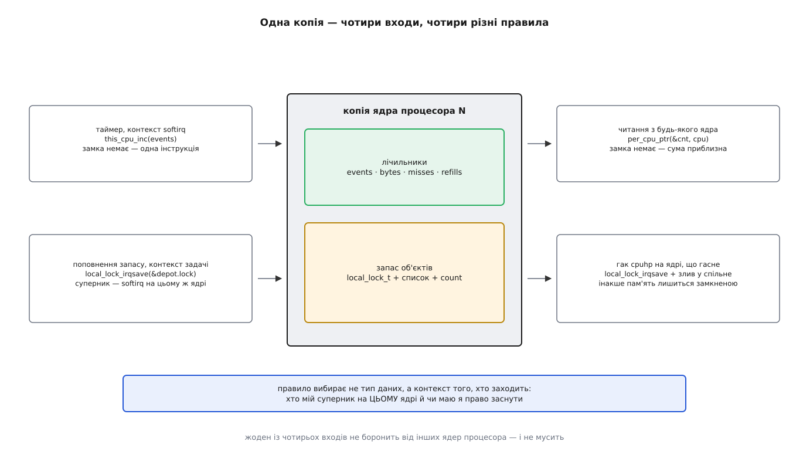
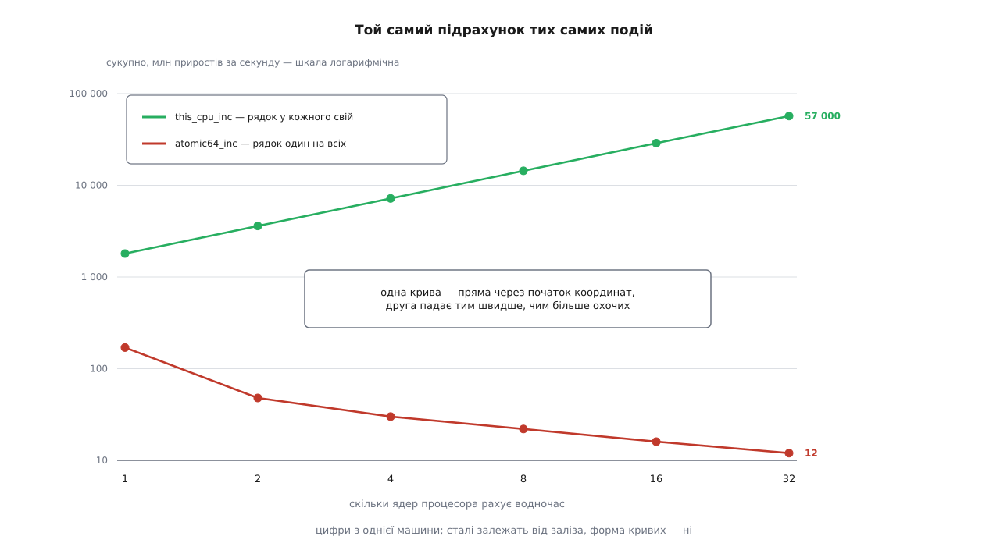

# ⚙️ Модуль зі статистикою per-CPU: лічильники, запас під local_lock і гак на вимикання ядра

Нижче — робочий [модуль ядра](root:sys-unix/kernel-modules), який рахує події без жодного спільного рядка кеша, тримає при цьому невеликий запас об'єктів на кожному ядрі процесора й сам міряє, у скільки разів це дешевше за `atomic64_t`. Уся складність тут не в лічильниках, а в тому, що до тих самих даних приходять чотири різні відвідувачі — і кожному потрібне своє правило.

## Задача

Написати модуль, який:

- рахує події в змінних per-CPU з гарячого шляху, де ані спати, ані брати спільний замок не можна;
- тримає на кожному ядрі процесора запас готових об'єктів під `local_lock_t`, щоб гарячий шлях не ходив по пам'ять до розподілювача;
- віддає зібране назовні через `debugfs` — сумою по всіх ядрах;
- не губить нічого, коли ядро процесора [вимикають на ходу](root:sys-unix/cpu-hotplug);
- на команду ззовні виконує однакове навантаження двома способами й друкує цифри.

Потрібні заголовки поточного ядра (`linux-headers-$(uname -r)` чи `kernel-devel`) і право робити `insmod`. Право це не звичайне: воно дає виконати будь-який код у найпривілейованішому режимі процесора, тож усі досліди — у віртуальній машині зі знімком стану. Кілька розібраних нижче пасток кінчаються псуванням чужої пам'яті, і краще, щоб псувалася не ваша робоча система.

## Ідея: одні дані, чотири входи

Спокуса написати такий модуль виглядає так: «дані per-CPU — значить, синхронізації не треба». Це напівправда, і саме на ній ламаються. Захист не зникає, він стає локальним: боронитися треба не від інших процесорів, а від того, хто може влізти **на цьому самому ядрі процесора**, — і хто це, залежить від того, звідки ви прийшли.

У нашому модулі до однієї й тієї самої копії заходять із чотирьох місць, і в кожного з них інший набір суперників:



*Чотири входи — чотири різні правила. Спільного в них лише те, чого не робить жоден: не боронить від інших ядер процесора.*

Це й є весь план модуля. Далі — код, у порядку цих чотирьох дверей.

## Лічильники: гарячий шлях

```c
/* pcstat.c — статистика per-CPU: лічильники, запас, гак на вимикання ядра */
#define pr_fmt(fmt) KBUILD_MODNAME ": " fmt

#include <linux/module.h>
#include <linux/init.h>
#include <linux/percpu.h>
#include <linux/local_lock.h>
#include <linux/list.h>
#include <linux/slab.h>
#include <linux/timer.h>
#include <linux/jiffies.h>
#include <linux/debugfs.h>
#include <linux/seq_file.h>
#include <linux/kstrtox.h>
#include <linux/cpu.h>
#include <linux/cpuhotplug.h>
#include <linux/spinlock.h>

struct pcstat_counters {
    u64 events;      /* скільки разів спрацював гарячий шлях      */
    u64 bytes;       /* скільки байтів він при цьому «обробив»    */
    u64 misses;      /* скільки разів запас виявився порожнім     */
    u64 refills;     /* скільки об'єктів довелося виділити наново */
};

static DEFINE_PER_CPU(struct pcstat_counters, pcstat_cnt);
```

Чотири числа в одній структурі, а не чотири окремі змінні — і це не косметика. Змінні per-CPU одного ядра процесора лежать поруч у його копії блоку, тож зібрані в структуру вони майже напевно опиняться в одному рядку кеша. Гарячий шлях, який чіпає два-три з них поспіль, платить за один промах, а не за три.

Роль гарячого шляху грає звичайний таймер. Його зворотний виклик виконується в контексті softirq: спати не можна, витіснення заборонене, а [переривання](root:sys-unix/interrupts-bottom-halves) — навпаки, дозволені.

```c
static struct timer_list pcstat_timer;
static unsigned int period_ms = 10;

static void pcstat_tick(struct timer_list *t)
{
    struct pcstat_obj *o;

    this_cpu_inc(pcstat_cnt.events);

    o = depot_pop();                 /* спати не можна — беремо лише те, що вже є */
    if (o) {
        o->payload = (u32)jiffies;
        this_cpu_add(pcstat_cnt.bytes, sizeof(*o));
        depot_push(o);
    } else {
        this_cpu_inc(pcstat_cnt.misses);
    }

    mod_timer(t, jiffies + msecs_to_jiffies(READ_ONCE(period_ms)));
}
```

(Далі код іде в порядку розповіді, а не в порядку файлу: `struct pcstat_obj`, `depot_pop`, `depot_push` і смітник у `pcstat.c` стоять вище за таймер, інакше компілятор про них не знав би.)

`this_cpu_inc(pcstat_cnt.events)` тут — уся синхронізація. Витіснення в softirq і так заборонене, а переривання, яке прийде посеред приросту, не зашкодить: на x86-64 це одна інструкція з сегментним префіксом, і переривання приходить **між** інструкціями, ніколи не всередині. На архітектурі без такої адресації той самий макрос розгорнеться в заборону переривань, приріст і відновлення — домовленість не зміниться, зміниться ціна.

`READ_ONCE(period_ms)` навколо звичайного `unsigned int` — тому що це число редагують ззовні, з іншого ядра процесора, поки таймер біжить. Без `READ_ONCE` компілятор має право прочитати змінну двічі й дістати два різні значення там, де в коді написано одне.

## Запас об'єктів: чому саме `local_lock_irqsave`

```c
struct pcstat_obj {
    struct list_head node;
    u32              payload;
};

struct pcstat_depot {
    local_lock_t     lock;
    struct list_head free;
    unsigned int     count;
};

static DEFINE_PER_CPU(struct pcstat_depot, pcstat_depot) = {
    .lock = INIT_LOCAL_LOCK(lock),
};

#define DEPOT_HIGH  16      /* більше не тримаємо — віддаємо розподілювачу */
#define DEPOT_WARM   4      /* стільки кладемо ядру процесора при вмиканні */
```

Замок лежить **усередині** структури per-CPU, а не поруч із нею. Це важливо: макрос дістає свою копію сам, тож у коді ви пишете шлях до поля в кресленні — `&pcstat_depot.lock`, — і кожне ядро процесора візьме свій примірник.

`INIT_LOCAL_LOCK(lock)` — це статичний ініціалізатор, і він виглядає зайвим доти, доки не стане потрібним. На звичайному ядрі без діагностики замків він розгортається в порожні дужки, тож модуль без нього збереться й працюватиме. Із `CONFIG_DEBUG_LOCK_ALLOC` він заповнює `dep_map`, без якого [перевіряльник замків](root:sys-unix/kernel-locking) вашого замка просто не бачить. А на ядрі з `PREEMPT_RT` `local_lock_t` — це справжній спін-замок, і неініціалізований він поводитиметься як завгодно. Ініціалізатор, що нічого не робить у найпоширенішій збірці, — рівно той різновид коду, який забувають.

> 🔧 **Навіщо це.** Статичний ініціалізатор у `DEFINE_PER_CPU` спрацьовує для **кожної** копії, і це не збіг. Секцію `.data..percpu` під час підняття системи побайтно копіюють у блок кожного ядра процесора — отже, усе, що ви написали в ініціалізаторі, опиняється в кожній копії. Для замка це саме те, що треба. Для голови списку — пастка, до якої ми ще дійдемо.

Тепер дві дії з запасом:

```c
static struct pcstat_obj *depot_pop(void)
{
    struct pcstat_depot *d;
    struct pcstat_obj *o = NULL;
    unsigned long flags;

    local_lock_irqsave(&pcstat_depot.lock, flags);
    d = this_cpu_ptr(&pcstat_depot);        /* вказівник беремо ВСЕРЕДИНІ ділянки */
    if (d->count) {
        o = list_first_entry(&d->free, struct pcstat_obj, node);
        list_del(&o->node);
        d->count--;
    }
    local_unlock_irqrestore(&pcstat_depot.lock, flags);

    return o;
}

static void depot_push(struct pcstat_obj *o)
{
    struct pcstat_depot *d;
    bool overflow = false;
    unsigned long flags;

    local_lock_irqsave(&pcstat_depot.lock, flags);
    d = this_cpu_ptr(&pcstat_depot);
    if (d->count < DEPOT_HIGH) {
        list_add(&o->node, &d->free);
        d->count++;
    } else {
        overflow = true;
    }
    local_unlock_irqrestore(&pcstat_depot.lock, flags);

    if (overflow)
        kfree(o);            /* звільняємо ПІСЛЯ виходу з ділянки */
}
```

Чому `local_lock_irqsave`, а не дешевший `local_lock`? Тому що список чіпають і з контексту задачі, і з таймера, тобто з softirq. А `local_lock` на звичайному ядрі — це рівно `preempt_disable()`, і softirq цим не спиняється: на виході з переривання ядро питає `in_interrupt()`, а звичайне витіснення в цю маску не входить. Отже, softirq може влізти всередину ділянки, узятої `local_lock`, і застати список наполовину перебудованим.

Правило, яке з цього випливає, коротке — суперник визначає варіант:

| хто ще заходить у ці дані на цьому ж ядрі | що брати |
|---|---|
| тільки задачі | `local_lock()` — заборона витіснення |
| ще й softirq: таймер, tasklet, мережа | `local_lock_irqsave()`, або `local_bh_disable()` з `local_lock_nested_bh()` |
| ще й обробник апаратного переривання | тільки `local_lock_irqsave()` |

Наш випадок — середній рядок; `irqsave` тут молот трохи важчий за потрібний, зате однозначно правильний. І зверніть увагу на `kfree(o)` **після** `local_unlock`: усередині ділянки переривання заборонені, а звільнення пам'яті — дія, якій там не місце.

Поповнення запасу — єдине місце, де можна спати, і воно навмисно винесене з гарячого шляху:

```c
static int depot_refill(void)
{
    struct pcstat_obj *o = kmalloc(sizeof(*o), GFP_KERNEL);   /* може заснути */

    if (!o)
        return -ENOMEM;

    o->payload = 0;
    depot_push(o);                    /* а вже тут — під замком, без сну */
    this_cpu_inc(pcstat_cnt.refills);
    return 0;
}
```

Порядок тут — уся суть. Пам'ять виділяємо **до** входу в ділянку, а не всередині. Побічний наслідок: `kmalloc` міг заснути, задачу могли перенести, тож `depot_push` покладе об'єкт, можливо, вже іншому ядру процесора. Для запасу це байдуже — об'єкт нічий, і `this_cpu_inc` теж не помиляється, бо він неподільний щодо того ядра, на якому виконується цієї миті, хай яке воно.

Кликати поповнення ззовні дозволяє найкоротший можливий файл у `debugfs`:

```c
/* запис числа в /sys/kernel/debug/pcstat/refill — «поклади N об'єктів у запас» */
static ssize_t pcstat_refill_write(struct file *f, const char __user *ubuf,
                                   size_t len, loff_t *ppos)
{
    unsigned int n, i;
    int err;

    err = kstrtouint_from_user(ubuf, len, 10, &n);
    if (err)
        return err;

    for (i = 0; i < min(n, 4096u); i++) {
        err = depot_refill();
        if (err)
            return err;
    }
    return len;
}

static const struct file_operations pcstat_refill_fops = {
    .owner  = THIS_MODULE,
    .write  = pcstat_refill_write,
    .llseek = noop_llseek,
};
```

## Читання: сума по `possible`

```c
static int pcstat_stats_show(struct seq_file *m, void *v)
{
    struct pcstat_counters total = { };
    unsigned int stashed = 0;
    int cpu;

    seq_puts(m, "cpu      events        bytes    misses   refills  depot\n");

    for_each_possible_cpu(cpu) {
        struct pcstat_counters *c = per_cpu_ptr(&pcstat_cnt, cpu);
        struct pcstat_depot *d = per_cpu_ptr(&pcstat_depot, cpu);
        u64 ev = READ_ONCE(c->events);
        unsigned int n = READ_ONCE(d->count);

        total.events  += ev;
        total.bytes   += READ_ONCE(c->bytes);
        total.misses  += READ_ONCE(c->misses);
        total.refills += READ_ONCE(c->refills);
        stashed       += n;

        if (cpu_online(cpu) || ev)
            seq_printf(m, "%-4d %10llu %12llu %9llu %9llu %6u%s\n",
                       cpu, ev, READ_ONCE(c->bytes), READ_ONCE(c->misses),
                       READ_ONCE(c->refills), n,
                       cpu_online(cpu) ? "" : "  (вимкнене)");
    }

    seq_printf(m, "разом %9llu %12llu %9llu %9llu %6u\n",
               total.events, total.bytes, total.misses, total.refills, stashed);
    seq_printf(m, "у смітнику: %u\n", READ_ONCE(pcstat_attic_count));
    seq_printf(m, "possible: %u  online: %u\n",
               num_possible_cpus(), num_online_cpus());
    return 0;
}
DEFINE_SHOW_ATTRIBUTE(pcstat_stats);
```

`for_each_possible_cpu`, а не `online`. Копії блоку виділяють на всі ядра процесора, які **можуть** з'явитися, і не звільняють, коли ядро гасять; його лічильники доживають до вивантаження модуля з останніми значеннями. Обхід лише ввімкнених мовчки загубив би їх — і саме таку помилку найважче помітити, бо на машині, де ядра ніколи не вимикають, вона не виявляється взагалі.

Замка на читанні немає, і це свідомо. Поки цикл доходить до останнього ядра процесора, перші вже нарахували собі ще — отриманий рядок не дорівнює стану системи в жодну конкретну мить. Для статистики це прийнятна ціна; узяти тут `local_lock` було б не тільки марно (він не боронить від чужих ядер), а й шкідливо — читач почав би сповільнювати всі гарячі шляхи одразу.

`READ_ONCE` навколо кожного поля — не забобон: без нього компілятор має право перечитати те саме поле кілька разів у різних вітках. А от повної правди `READ_ONCE` для `u64` не дає: на 32-бітній машині таке читання розпадається на два, і сусіднє ядро процесора може вклинитися між ними — вийде число, якого ніколи не було. У ядрі для цього є `u64_stats_sync`; у нашому модулі 32-бітну збірку просто не розглядаємо, але промовчати про це було б нечесно.

`DEFINE_SHOW_ATTRIBUTE` розгортається у пару «функція відкриття плюс `file_operations`» поверх `single_open` — найкоротший спосіб мати текстовий файл у [debugfs](root:sys-unix/pseudo-filesystems), не пишучи нічого зайвого.

## Ядро процесора гасне

Лічильники вимкнене ядро процесора зберігає, а запас — ні: об'єкти в його списку опиняться замкненими в копії, до якої більше ніхто не зайде. Тому запас треба здати.

```c
/* Смітник для об'єктів із вимкнених ядер: тут суперник справжній,
   з інших процесорів, — тому й замок справжній. */
static DEFINE_SPINLOCK(pcstat_attic_lock);
static LIST_HEAD(pcstat_attic);
static unsigned int pcstat_attic_count;

static int pcstat_cpu_online(unsigned int cpu)
{
    int i;

    /* Гак ONLINE-секції виконується в потоці cpuhp/N на самому ядрі,
       витіснення й переривання дозволені — тобто ТУТ спати можна. */
    for (i = 0; i < DEPOT_WARM; i++)
        if (depot_refill())
            break;           /* нема пам'яті — гріємо як вийде, вмикання не зриваємо */
    return 0;
}

static int pcstat_cpu_offline(unsigned int cpu)
{
    struct pcstat_depot *d;
    LIST_HEAD(drained);
    unsigned long flags;
    unsigned int n;

    /* cpu == smp_processor_id(): гак біжить на тому ядрі, що йде геть.
       Воно ще онлайн, таймери й переривання на ньому ще працюють. */
    local_lock_irqsave(&pcstat_depot.lock, flags);
    d = this_cpu_ptr(&pcstat_depot);
    list_splice_init(&d->free, &drained);
    n = d->count;
    d->count = 0;
    local_unlock_irqrestore(&pcstat_depot.lock, flags);

    spin_lock(&pcstat_attic_lock);
    list_splice_init(&drained, &pcstat_attic);
    pcstat_attic_count += n;
    spin_unlock(&pcstat_attic_lock);

    pr_info("ядро %u гасне: здано об'єктів — %u\n", cpu, n);
    return 0;
}
```

Два рішення тут не очевидні, і обидва випливають із того, **де саме** біжить гак.

Стан `CPUHP_AP_ONLINE_DYN` належить до ONLINE-секції машини станів гарячого підключення, а її зворотні виклики ядро виконує на самому підключеному процесорі, у контексті прибитого до нього потоку `cpuhp/N`, з дозволеними перериваннями й витісненням. Звідси перше: у цьому гаку **можна спати**, тож `GFP_KERNEL` при вмиканні законний. І звідси ж друге: ядро процесора ще живе, на ньому ще спрацьовують таймери, — отже замок брати треба, попри те що конкурентів «ззовні» вже майже немає.

Порівняйте з іншим підходом, який теж трапляється в ядрі: стан із суфіксом `DEAD` виконується на **чужому** керівному процесорі вже після того, як цільовий помер. Там `this_cpu_ptr` і `local_lock` — груба помилка, бо «своя» копія в того, хто прибирає, зовсім інша; там пишуть `per_cpu_ptr(&var, cpu)` і не беруть локального замка взагалі, бо на мертвому ядрі процесора змагатися нема з ким.

І `spin_lock` на смітник — уже справжній: у нього одночасно можуть здавати запас кілька ядер, що гаснуть, а до того ж туди зазирає `rmmod`.

## Збирання докупи

```c
static struct dentry *pcstat_dir;
static int pcstat_hp_state = -1;

static int __init pcstat_init(void)
{
    int cpu, ret;

    for_each_possible_cpu(cpu) {
        struct pcstat_depot *d = per_cpu_ptr(&pcstat_depot, cpu);

        INIT_LIST_HEAD(&d->free);   /* статично цього зробити НЕ можна — пастка 4 */
        d->count = 0;
    }

    pcstat_dir = debugfs_create_dir("pcstat", NULL);
    debugfs_create_file("stats",  0444, pcstat_dir, NULL, &pcstat_stats_fops);
    debugfs_create_file("refill", 0200, pcstat_dir, NULL, &pcstat_refill_fops);
    debugfs_create_file("bench",  0200, pcstat_dir, NULL, &pcstat_bench_fops);
    debugfs_create_u32("period_ms", 0644, pcstat_dir, &period_ms);

    ret = cpuhp_setup_state(CPUHP_AP_ONLINE_DYN, "pcstat:online",
                            pcstat_cpu_online, pcstat_cpu_offline);
    if (ret < 0) {
        debugfs_remove_recursive(pcstat_dir);
        return ret;
    }
    pcstat_hp_state = ret;

    timer_setup(&pcstat_timer, pcstat_tick, 0);
    mod_timer(&pcstat_timer, jiffies + msecs_to_jiffies(period_ms));

    pr_info("завантажено; possible=%u online=%u\n",
            num_possible_cpus(), num_online_cpus());
    return 0;
}

static void __exit pcstat_exit(void)
{
    struct pcstat_obj *o, *tmp;
    int cpu;

    timer_shutdown_sync(&pcstat_timer);    /* 1. більше не вистрелить і не переозброїться */
    debugfs_remove_recursive(pcstat_dir);  /* 2. зовнішній вхід зачинено                  */
    cpuhp_remove_state(pcstat_hp_state);   /* 3. кличе гак на КОЖНОМУ ввімкненому ядрі    */

    /* 4. тепер не біжить ніхто — замки вже не потрібні */
    for_each_possible_cpu(cpu) {
        struct pcstat_depot *d = per_cpu_ptr(&pcstat_depot, cpu);

        list_for_each_entry_safe(o, tmp, &d->free, node) {
            list_del(&o->node);
            kfree(o);
        }
    }
    list_for_each_entry_safe(o, tmp, &pcstat_attic, node) {
        list_del(&o->node);
        kfree(o);
    }
    pr_info("вивантажено\n");
}

module_init(pcstat_init);
module_exit(pcstat_exit);

MODULE_LICENSE("GPL");
MODULE_DESCRIPTION("Статистика per-CPU: this_cpu_*, local_lock, гак cpuhp");
```

Чотири кроки вивантаження стоять саме в цьому порядку, і кожен закриває одного з тих, хто ще може прийти. `timer_shutdown_sync` — не просто зупинка: він ще й запобігає переозброєнню, тобто гарантує, що зворотний виклик, який зараз доживає, не поставить таймер знову (стара назва `del_timer_sync` такої гарантії не дає й у свіжих ядрах уже не існує). `cpuhp_remove_state` — на відміну від версії з суфіксом `_nocalls` — виконує гак вимикання на всіх ввімкнених ядрах, тобто зливає їхні запаси у смітник; лишається обійти `possible` про всяк випадок і звільнити все.

`Makefile` — звичайний для зовнішнього модуля:

```makefile
obj-m += pcstat.o

KDIR ?= /lib/modules/$(shell uname -r)/build

all:
	$(MAKE) -C $(KDIR) M=$(CURDIR) modules

clean:
	$(MAKE) -C $(KDIR) M=$(CURDIR) clean
```

(Відступи в рецептах — табуляція.)

## Що видно на машині

```console
$ make && sudo insmod pcstat.ko
$ sudo mount -t debugfs none /sys/kernel/debug 2>/dev/null
$ sudo cat /sys/kernel/debug/pcstat/stats | head -4
cpu      events        bytes    misses   refills  depot
0             0            0         0         4      4
1          1934        46416         0         4      4
2             0            0         0         4      4
```

Події зібралися на одному ядрі процесора — і це правильна поведінка, а не збій. Таймер переозброюється з власного зворотного виклику, тобто щоразу лягає в чергу того ядра, де щойно спрацював, і живе там, доки ядро не вимкнуть. Запас же роздано всім по чотири — його при вмиканні клав гак `pcstat_cpu_online`, який відпрацював на кожному ядрі під час завантаження модуля.

Тепер найцікавіше — погасити ядро процесора, на якому таймер не сидить:

```console
$ echo 0 | sudo tee /sys/devices/system/cpu/cpu2/online > /dev/null
$ dmesg | tail -1
pcstat: ядро 2 гасне: здано об'єктів — 4
$ sudo grep -E '^(2 |у смітнику|possible)' /sys/kernel/debug/pcstat/stats
2             0            0         0         4      0  (вимкнене)
у смітнику: 4
possible: 32  online: 31
```

Лічильники ядра 2 лишилися на місці разом із його історією, а запас із нього зник — рівно те, чого ми домагалися. Якби гака не було, чотири об'єкти лежали б у пам'яті до `rmmod`, і ніхто б цього не помітив; на машині, де ядра гасять по колу, за годину так витікає стільки, скільки треба.

## Замір: `atomic64_t` проти `this_cpu_inc`

Тепер друга частина модуля — той самий підрахунок двома способами. Щоб міряти чесно, треба щоб усі ядра процесора били одночасно, тож на кожне ввімкнене ядро заводимо прибитий до нього [потік ядра](root:sys-unix/kernel-threads) і стартуємо їх за спільною командою. До заголовків додаються `<linux/kthread.h>`, `<linux/ktime.h>` і `<linux/math64.h>`.

```c
static atomic64_t bench_shared = ATOMIC64_INIT(0);
static DEFINE_PER_CPU(u64, bench_own);
static DEFINE_PER_CPU(u64, bench_ops);

static unsigned int bench_ms = 200;
static bool bench_atomic;

#define BENCH_CHUNK 4096

struct bench_ctl { atomic_t ready, go; };

static int bench_worker(void *arg)
{
    struct bench_ctl *c = arg;
    u64 t0, now, deadline, ops = 0;
    int i;

    atomic_inc(&c->ready);
    while (!atomic_read(&c->go))
        cpu_relax();

    t0 = ktime_get_ns();
    deadline = t0 + (u64)bench_ms * NSEC_PER_MSEC;
    do {
        if (bench_atomic)
            for (i = 0; i < BENCH_CHUNK; i++)
                atomic64_inc(&bench_shared);
        else
            for (i = 0; i < BENCH_CHUNK; i++)
                this_cpu_inc(bench_own);
        ops += BENCH_CHUNK;
        now = ktime_get_ns();
        cond_resched();
    } while (now < deadline);

    this_cpu_write(bench_ops, ops);

    /* Самі не виходимо: на нас чекатиме kthread_stop() */
    while (!kthread_should_stop()) {
        set_current_state(TASK_IDLE);
        if (kthread_should_stop())
            break;
        schedule();
    }
    __set_current_state(TASK_RUNNING);
    return 0;
}

static u64 bench_run(bool use_atomic, unsigned int *nr_out)
{
    struct bench_ctl c = { .ready = ATOMIC_INIT(0), .go = ATOMIC_INIT(0) };
    struct task_struct **t;
    unsigned int n, i = 0;
    u64 total = 0;
    int cpu;

    cpus_read_lock();                     /* поки міряємо, ядра нікуди не дінуться */
    n = num_online_cpus();
    t = kcalloc(n, sizeof(*t), GFP_KERNEL);
    if (!t) {
        cpus_read_unlock();
        return 0;
    }

    bench_atomic = use_atomic;
    for_each_online_cpu(cpu) {
        per_cpu(bench_ops, cpu) = 0;
        t[i] = kthread_create(bench_worker, &c, "pcbench/%d", cpu);
        if (IS_ERR(t[i]))
            break;
        kthread_bind(t[i], cpu);          /* лише доки задача ще не бігала */
        wake_up_process(t[i]);
        i++;
    }
    n = i;

    while (atomic_read(&c.ready) < n)
        schedule_timeout_uninterruptible(1);
    atomic_set(&c.go, 1);

    for (i = 0; i < n; i++)
        kthread_stop(t[i]);               /* чекає, доки потік договорить */

    for_each_online_cpu(cpu)
        total += per_cpu(bench_ops, cpu);

    kfree(t);
    cpus_read_unlock();
    *nr_out = n;
    return total;
}
```

Друкує результат той самий спосіб — запис у файл:

```c
static ssize_t pcstat_bench_write(struct file *f, const char __user *ubuf,
                                  size_t len, loff_t *ppos)
{
    unsigned int n = 0;
    u64 ops_a, ops_p, ns;

    ops_a = bench_run(true,  &n);
    ops_p = bench_run(false, &n);
    if (!n || !ops_a || !ops_p)
        return -EAGAIN;

    ns = (u64)bench_ms * NSEC_PER_MSEC;          /* тривалість одного проходу */

    pr_info("замір: ядер %u, по %u мс на прохід\n", n, bench_ms);
    pr_info("atomic64_inc: %12llu приростів, %8llu тис/с, %8llu пс на приріст\n",
            ops_a, div64_u64(ops_a, bench_ms), div64_u64(ns * n * 1000, ops_a));
    pr_info("this_cpu_inc: %12llu приростів, %8llu тис/с, %8llu пс на приріст\n",
            ops_p, div64_u64(ops_p, bench_ms), div64_u64(ns * n * 1000, ops_p));
    pr_info("перевага this_cpu_inc — у %llu разів\n", div64_u64(ops_p, ops_a));
    return len;
}

static const struct file_operations pcstat_bench_fops = {
    .owner  = THIS_MODULE,
    .write  = pcstat_bench_write,
    .llseek = noop_llseek,
};
```

Обидва ділення — через `div64_u64` з `<linux/math64.h>`, а не звичайним знаком: ділити 64-бітні числа безпосередньо на 32-бітній машині ядро не вміє, і компонувальник скаже про це аж наприкінці збірки незрозумілим `undefined reference to __udivdi3`.

Цикл заміру обмежений не кількістю обертів, а часом: за фіксованої кількості приростів прохід з `atomic64_inc` на тридцяти двох ядрах тривав би хвилини. Годинник питаємо раз на 4096 обертів — його виклик коштує близько двадцяти наносекунд, тобто розмазані на обертах це п'ять тисячних наносекунди, менше за відсоток навіть від найдешевшого варіанта. `kthread_bind` до першої побудки прибиває потік до ядра процесора — тільки тому в циклі й дозволено `cond_resched()`: задачу можуть витіснити, але перенести вже нікуди, тож `this_cpu_inc` увесь прохід влучає в ту саму копію. Без прибиття замір лишився б правильним (макрос неподільний щодо будь-якого ядра, на якому опиниться), але цифри стали б сумішшю кількох ядер процесора й уже нічого не важили б.

Ось що це друкує на тридцятидвохядерній машині:

```console
$ echo 1 | sudo tee /sys/kernel/debug/pcstat/bench > /dev/null
$ dmesg | tail -4
pcstat: замір: ядер 32, по 200 мс на прохід
pcstat: atomic64_inc:      2400256 приростів,    12001 тис/с,  2666382 пс на приріст
pcstat: this_cpu_inc:  11402215424 приростів, 57011077 тис/с,      561 пс на приріст
pcstat: перевага this_cpu_inc — у 4750 разів
```

Той самий замір, повторений із різною кількістю учасників, дає повну картину:

| ядер процесора | `atomic64_inc`, млн/с | `this_cpu_inc`, млн/с | різниця |
|---:|---:|---:|---:|
| 1  | 170 | 1 800  | 11× |
| 2  | 48  | 3 600  | 75× |
| 4  | 30  | 7 200  | 240× |
| 8  | 22  | 14 400 | 650× |
| 16 | 16  | 28 800 | 1 800× |
| 32 | 12  | 57 000 | 4 750× |



*Цифри з однієї машини, і сталі на вашій будуть інші. Незмінне тут інше: одна крива — пряма, друга не просто не росте, а спадає.*

Читати цю таблицю варто по рядках, бо кожен пояснює своє.

**Один учасник — уже одинадцятикратна різниця**, хоча суперників немає взагалі. `atomic64_inc` бере 5.9 нс, `this_cpu_inc` — 0.56 нс. Платимо ми тут не за змагання, а за префікс `lock`: він змушує процесор довести операцію до кінця як неподільну щодо всієї машини, а це між іншим і бар'єр упорядкування. Приріст у власному рядку кеша нічого не впорядковує й нікому нічого не доводить.

**Другий учасник обвалює все більш ніж утричі**, з 170 до 48 млн/с. Це і є мить, коли рядок кеша перестає жити на місці:

```
48·10⁶ приростів/с  →  1 с / 48·10⁶ = 20.8·10⁻⁹ с ≈ 21 нс на приріст
```

Двадцять одна наносекунда — рівно стільки коштує передати володіння рядком між двома ядрами одного кристала. Роботи від додавання другого ядра не побільшало нітрохи; побільшало поїздок.

**Далі крива не сідає на полицю, а повзе вниз.** Тридцять два учасники дають 12 млн/с, тобто 83 нс на кожен приріст. Причин дві: що більше охочих, то далі в середньому мандрує рядок — між групами ядер, між сокетами; і що більше охочих, то більше з них щоразу програють змагання й починають наново. Тобто додавання ядер процесора не просто не допомагає — воно шкодить.

**Друга колонка — пряма через початок координат.** Кожне додане ядро процесора додає рівно свою пропускну здатність, бо не забирає нічого ні в кого. Це і є визначення масштабованості, і воно тут не як гасло, а як результат заміру.

І одразу чесна межа цих цифр. Цикл не робить нічого, крім приросту, тож 4750× — це верхня межа різниці **між самими примітивами**, а не між двома драйверами. У справжньому гарячому шляху на подію припадає ще й корисна робота, і відношення просяде. Але з таблиці треба виносити не відношення, а абсолютну величину: **2666 нс процесорного часу на подію** на тридцяти двох ядрах. Це число не зменшиться від того, що поруч з'явиться корисна робота, — воно просто додасться до неї. Мережевий шлях, який мусить упоратися за сотню наносекунд, від такого лічильника просто зупиняється.

## Пастки

### 1. `smp_processor_id()` у витісненому контексті

```c
    int cpu = smp_processor_id();                         /* ← так не можна */
    struct pcstat_depot *d = per_cpu_ptr(&pcstat_depot, cpu);
```

Якщо [витіснення](root:sys-unix/kernel-preemption) дозволене, відповідь може застаріти ще до того, як її отримають: між обчисленням номера й його використанням задачу переносять, і `d` веде в чужу копію. Ядро, зібране з `CONFIG_DEBUG_PREEMPT`, ловить це відразу:

```
BUG: using smp_processor_id() in preemptible [00000000] code: tee/4471
caller is depot_refill+0x2c/0xf0 [pcstat]
```

Той самий крик дає й `this_cpu_ptr()` у витісненому контексті, і на перший погляд це дивно — там же немає виклику `smp_processor_id`. Насправді є: із `CONFIG_DEBUG_PREEMPT` макрос `my_cpu_offset`, з якого `this_cpu_ptr` бере базу копії, визначено як `per_cpu_offset(smp_processor_id())` замість швидкого архітектурного варіанта. Тобто діагностику вбудовано в самий доступ, і саме тому вона з'являється в кожній збірці, де ввімкнено цю опцію, — і зникає в тій, де вимкнено.

Перевірка має два законні винятки, і обидва варто знати. Витіснення вже заборонене — тоді номер змінитися не може. І задачі дозволено рівно одне ядро процесора: саме тому наш гак `pcstat_cpu_offline` може питати номер вільно — він біжить у потоці `cpuhp/N`, прибитому до свого ядра.

Правильних відповідей три, і вибір між ними — це вибір, навіщо вам номер. Треба стійкий номер на кілька дій — `get_cpu()` / `put_cpu()`, які додають до нього заборону витіснення. Треба працювати зі своєю копією — беріть замок і аж потім `this_cpu_ptr` усередині ділянки, як у `depot_pop`. А коли номер справді потрібен лише як підказка — скажімо, вибрати чергу, і промах нічим не загрожує, — тоді пишуть `raw_smp_processor_id()`, і це не спосіб замовкнути діагностику, а спосіб сказати наступному читачеві, що промах передбачено.

### 2. Вказівник, що пережив сплячий виклик

```c
    d = get_cpu_ptr(&pcstat_depot);
    put_cpu_ptr(&pcstat_depot);        /* вказівник щойно протух */

    mutex_lock(&some_mutex);           /* тут можна заснути — і засинаємо */
    d->count++;                        /* ← пишемо в копію, яка вже не наша */
```

`get_cpu_ptr` — це `preempt_disable()` разом із `this_cpu_ptr()`, а `put_cpu_ptr` — зворотне до нього. Найпідступніше тут те, що вказівник узято цілком законно: ділянка була, номер був стійкий, діагностика мовчить — бо мовчати їй і належить. Злочин стається пізніше й виглядає як звичайне розіменування звичайного вказівника, нічим не відмінне від тисяч інших.

Гарантія `this_cpu_ptr` коротша, ніж здається: вказівник дійсний **рівно доти, доки задача лишається на цьому ядрі процесора**. Будь-що, здатне заснути, — `kmalloc(GFP_KERNEL)`, `mutex_lock`, копіювання в простір користувача, `cond_resched()` — цю гарантію обриває. Наслідок не «трохи неточна статистика»: у список однієї копії пишуть двоє з різних ядер, кожен тримаючи свій власний замок, тож замки не перетинаються й не рятують. Виявиться це геть в іншому місці й через невизначений час — рядком `list_del corruption. prev->next should be ...` десь у третьому ядрі процесора.

Звичка, яка закриває всю сім'ю цих помилок, дешева: **не заводити змінну під вказівник на копію, яка живе довше за ділянку**. Обчислювати `this_cpu_ptr` усередині, як у `depot_pop` і `depot_push`, і не переносити його через жодний виклик, у якому не впевнені.

На ядрі з `PREEMPT_RT` тонкість інша, але висновок той самий: `local_lock` там витіснення не забороняє, зате прибиває задачу до ядра процесора — тому вказівник, узятий усередині ділянки, лишається дійсним і там, а винесений за неї — ні.

### 3. `GFP_KERNEL` під `local_lock`

```c
    local_lock_irqsave(&pcstat_depot.lock, flags);
    o = kmalloc(sizeof(*o), GFP_KERNEL);       /* ← помилка */
    list_add(&o->node, &this_cpu_ptr(&pcstat_depot)->free);
    local_unlock_irqrestore(&pcstat_depot.lock, flags);
```

`GFP_KERNEL` означає буквально «дозволяю тобі заснути, щоб добути пам'ять». Розподілювач цим правом користується: він може взятися за пряме вивільнення, писати сторінки на диск, чекати вводу-виводу, зрештою розбудити вбивцю за браком пам'яті. А ділянка `local_lock_irqsave` на звичайному ядрі — це заборона витіснення й переривань, тобто атомарний контекст, з якого викликати планувальник не можна.

Підступність цієї помилки в тому, що вона майже завжди «працює». Швидкий шлях розподілювача бере сторінку зі свого запасу й повертається, не заснувши жодного разу, — і так тисячу разів поспіль на порожній машині. Із `CONFIG_DEBUG_ATOMIC_SLEEP` ядро скаже про це відразу, ще на першому виклику:

```
BUG: sleeping function called from invalid context at mm/page_alloc.c:...
in_atomic(): 1, irqs_disabled(): 1, non_block: 0, pid: 1811, name: tee
```

Без цієї опції перше повідомлення ви побачите тоді, коли пам'яті стане мало, тобто в найгіршу можливу мить, і виглядатиме воно вже як `BUG: scheduling while atomic` із планувальника — з місця, яке нічого не скаже про справжнього винуватця.

Окремо варто знати, що на `PREEMPT_RT` ця сама ділянка стає сплячим спін-замком, і виділяти під ним пам'ять із `GFP_KERNEL` формально дозволено. Це не привід так писати: код мусить бути правильним в обох складаннях, а правильним в обох він буде лише за суворішим правилом.

І головне — `GFP_ATOMIC` тут не є полагодженням. Це інша угода: менший доступний запас і цілком реальний `NULL` у відповідь, тобто ви міняєте гарантований збій на випадковий. Правильна відповідь — та, що в нашому модулі: виділяти **поза** ділянкою й заздалегідь. Запас per-CPU для того й існує, щоб гарячий шлях ніколи не питав пам'яті.

### 4. Статичний ініціалізатор, що не переживає копіювання

```c
static DEFINE_PER_CPU(struct pcstat_depot, pcstat_depot) = {
    .lock = INIT_LOCAL_LOCK(lock),
    .free = LIST_HEAD_INIT(pcstat_depot.free),   /* ← мовчазна катастрофа */
};
```

Компілюється. Виглядає симетрично до сусіднього рядка. І ламає все.

Річ у природі списків ядра: порожня голова списку вказує сама на себе. `LIST_HEAD_INIT` записує туди адресу — але адресу **в кресленні**, у секції `.data..percpu`, бо іншої на час компонування не існує. Далі це креслення побайтно копіюють у блок кожного ядра процесора, і кожна копія дістає голову, яка вказує не на себе, а на те саме одне місце в кресленні. Тридцять два списки, які вважають себе порожніми й показують в одну спільну точку, — далі перший же `list_add` веде куди завгодно.

Різниця між двома рядками рівно в цьому: `INIT_LOCAL_LOCK` не містить жодного посилання на самого себе, тож копіювання йому байдуже, а `LIST_HEAD_INIT` — це і є посилання на себе, більше в ньому нічого немає. Правило звідси загальне: **у змінній per-CPU статично можна ініціалізувати лише те, що не знає власної адреси**. Усе решта — списки, черги очікування, таймери, лічильники посилань — заводять у циклі `for_each_possible_cpu` під час завантаження, як і зроблено в `pcstat_init`.

Той самий цикл, до речі, — єдина правильна форма й для пам'яті з `alloc_percpu`: вона повертається обнуленою, а не ініціалізованою, тож `INIT_LIST_HEAD` і `local_lock_init` там треба кликати руками для кожного можливого ядра процесора.

## Коли цього всього не треба

Наприкінці варто спитати, чи не забагато ми написали заради чотирьох чисел.

Якщо все, що вам потрібно, — це лічильники, і читають їх лише люди, то ядро вже має готове: `percpu_counter` для наближеної суми з керованим порогом похибки і `percpu_ref` для підрахунку посилань, який уміє в потрібну мить перемкнутися в точний режим. Обидва — десяток рядків замість усього нашого модуля.

Своя механіка починає окупатися рівно тоді, коли per-CPU тримає не число, а **стан**: список, буфер, кеш об'єктів. Саме тоді з'являються всі чотири двері з першого малюнка, а з ними `local_lock`, гак на вимикання ядра процесора й питання, кого саме ви боїтеся на своєму ядрі. І тоді ж стає видно головне: складність тут не в тому, що даних багато копій, а в тому, що коду, який до них ходить, теж багато — і в кожного свій контекст.
