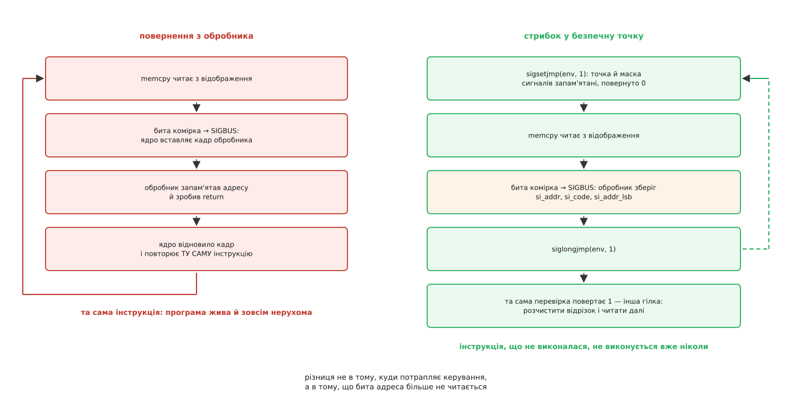

# ⚙️ Пережити збійну комірку: SIGBUS, безпечна точка й розчищення відрізка

Це програма мовою C, яка відображає файл на постійній пам'яті й не вмирає, коли процесор натрапляє на невиправну помилку носія: вона дізнається адресу збою, знаходить биту ділянку в списку ядра, розчищає її й читає далі. Потрібна вона там, де падіння коштує дорожче за втрачений кілобайт — а це майже всюди, де постійну пам'ять узагалі беруть: база даних із власними копіями, кеш, який можна перебудувати, індекс, що відбудовується з журналу.

## Чому тут немає гілки з errno

Програма, яка читає з диска, обробляє помилку носія майже несвідомо: `read()` повернув `-1`, `errno` дорівнює `EIO`, гілка на цей випадок уже написана, бо її вимагає сам вигляд виклику. Помилка їде назад тим самим шляхом, яким ішов запит.

Відображений файл на постійній пам'яті цього шляху не має. Читання — це інструкція `mov`, у якої немає місця під код помилки: результат вона кладе в регістр, і жодного другого регістра «а тут чи все гаразд» апаратний контракт не передбачає ([mmap: файл і пам'ять як одне](topic:sys-unix/mmap-model) — сторінки файлу стають частиною адресного простору, і звертання до них перестає бути викликом). Отже, повідомити програму можна лише збоку від її потоку керування — сигналом.

Звідси й уся конструкція: якщо єдиний канал — сигнал, то програма мусить уміти три речі, яких звичайний код не вміє. Дізнатися з сигналу, *де* саме зламалося. Повернутися після сигналу в осмислене місце, а не туди, звідки її вибило. І полагодити носій так, щоб наступний прохід не впав на тому самому місці.

## Що приносить сигнал

Обробник, поставлений через `sigaction` із прапорцем `SA_SIGINFO`, дістає структуру `siginfo_t`, і з неї потрібні три поля.

`si_addr` — віртуальна адреса, на якій усе сталося. Оскільки відображення почалося з відомої адреси, зсув у файлі виходить простим відніманням.

`si_code` розрізняє два зовсім різні приводи. `BUS_MCEERR_AR` — «дія обов'язкова»: помилку вже спожито, і наштовхнулася на неї саме та інструкція, що не виконалася. `BUS_MCEERR_AO` — «дія необов'язкова»: ядро виявило зіпсовану сторінку фоном, ніхто в неї ще не заглядав, і сигнал приходить наперед. Другий випадок сам собою не трапляється — його треба замовити викликом `prctl(PR_MCE_KILL, PR_MCE_KILL_SET, PR_MCE_KILL_EARLY, 0, 0)`, інакше система працює в типовому режимі й сповіщає лише того, хто справді торкнувся ([апаратна помилка пам'яті](topic:sys-unix/memory-failure-hwpoison) — як ядро отруює сторінку з невиправною помилкою й кого воно про це сповіщає).

`si_addr_lsb` — номер молодшого значущого біта адреси, тобто розмір зіпсованої ділянки як степінь двійки. Для сторінки в 4 КіБ там буде 12. Це не дрібниця: адреса вказує на байт, а недоступною стала вся ділянка `1 << si_addr_lsb`, і розчищати доведеться саме її.

## Чому повернутися з обробника не можна

Спокуса очевидна: обробник запам'ятав адресу, поставив прапорець і зробив `return` — далі розберемося у звичайному коді. Так робити не можна, і причина не в стилі.

Сигнал від апаратного збою синхронний: ядро вставило кадр обробника перед тією самою інструкцією, що не виконалася. Повернення з обробника відновлює кадр і повторює її ([сигнальний кадр і rt_sigreturn](topic:sys-unix/signal-frame-and-sigreturn) — де саме ядро зберігає перерваний стан і як його відновлює). Комірка та сама, помилка та сама — і програма крутиться в петлі, жива й зовсім нерухома. POSIX формулює це прямо: поведінка процесу після нормального повернення з обробника `SIGBUS`, `SIGSEGV`, `SIGILL` чи `SIGFPE`, породженого не викликом `kill`, невизначена.

Отже, з обробника треба піти в інше місце — те, яке заздалегідь позначили як безпечне. Це і є пара `sigsetjmp` / `siglongjmp`.



*Стрибок відрізняється від повернення не тим, куди потрапляє керування, а тим, що інструкція, яка не виконалася, більше не виконується ніколи.*

Чому саме `sigsetjmp` з одиницею другим аргументом, а не звичайний `setjmp`. Поки працює обробник, ядро тримає `SIGBUS` заблокованим — щоб обробник не перервав сам себе. Звичайний `longjmp` у glibc маску сигналів не відновлює, тож після стрибка `SIGBUS` лишається заблокованим назавжди. Наступна бита комірка породить сигнал, а доставити його вже нікуди: заблокований сигнал від апаратного збою ядро не відкладає в чергу, а примусово розблоковує, скидає обробник і вбиває процес типовою дією. Програма падає на другій помилці, і виглядатиме це як загадкова невідтворюваність.

## Код

Одна одиниця трансляції, жодних залежностей:

```sh
cc -Wall -Wextra -O2 -o pmsafe pmsafe.c
./pmsafe /mnt/pmem/data.bin           # прочитати, а на збоях розчистити й повторити
```

Мова тут не випадкова: половина програми — `siginfo_t`, вирівнювання адрес, `ioctl` із структурою змінної довжини й арифметика секторів. Обгортка, яка все це ховає, забрала б рівно той матеріал, заради якого програму варто читати.

Почнімо з обробника й безпечної точки.

```c
/* pmsafe.c — читати файл на постійній пам'яті й пережити збійну комірку. */
#define _GNU_SOURCE          /* BUS_MCEERR_*, si_addr_lsb, FALLOC_FL_PUNCH_HOLE */

#include <stdio.h>
#include <stdlib.h>
#include <string.h>
#include <stdint.h>
#include <errno.h>
#include <fcntl.h>
#include <unistd.h>
#include <setjmp.h>
#include <signal.h>
#include <sys/mman.h>
#include <sys/stat.h>
#include <sys/ioctl.h>
#include <sys/sysmacros.h>
#include <linux/fs.h>
#include <linux/fiemap.h>

/* Безпечна точка — своя на кожен потік: сигнал від апаратного збою приходить
   саме тому потокові, який торкнувся комірки, і стрибати він мусить у свій
   кадр, а не в чужий. */
static __thread sigjmp_buf safe_point;
static __thread volatile sig_atomic_t guarded;  /* вікно відкрите */
static __thread volatile sig_atomic_t f_code;   /* si_code */
static __thread volatile sig_atomic_t f_lsb;    /* si_addr_lsb */
static __thread void *volatile        f_addr;   /* si_addr */

static void on_sigbus(int sig, siginfo_t *si, void *uc)
{
    (void)sig; (void)uc;

    if (!guarded) {
        /* Збій поза охоронюваним вікном: стрибати нікуди, а повертатися не
           можна. write і _exit — з переліку дозволеного в обробнику. */
        static const char m[] = "pmsafe: SIGBUS поза вікном\n";
        ssize_t r = write(2, m, sizeof m - 1);
        (void)r;
        _exit(135);                       /* 128 + SIGBUS */
    }

    /* Звичайні присвоєння тут безпечні не тому, що вони атомарні, а тому, що
       перерваний код більше не виконуватиметься: читати ці поля будуть уже
       після стрибка, у звичайному контексті того самого потоку. */
    f_addr = si->si_addr;
    f_code = si->si_code;
    f_lsb  = si->si_addr_lsb ? si->si_addr_lsb : 12;
    guarded = 0;
    siglongjmp(safe_point, 1);
}

static int arm_sigbus(void)
{
    struct sigaction sa;
    memset(&sa, 0, sizeof sa);
    sa.sa_sigaction = on_sigbus;
    sa.sa_flags = SA_SIGINFO;   /* без нього не буде ні si_addr, ні si_code */
    sigemptyset(&sa.sa_mask);
    return sigaction(SIGBUS, &sa, NULL);
}

/* Копія з відображення під охороною: 0 — прочитано, -1 — збій, і тоді в f_*
   лежить усе, що приніс сигнал.

   Те, що sigsetjmp стоїть у крихітній окремій функції, — не косметика.
   Локальні змінні функції, яка кликала sigsetjmp, після стрибка мають
   невизначені значення, якщо їх міняли й не позначили volatile. Тут міняти
   нічого: стрибок веде в кадр pm_copy, а той одразу повертає -1 звичайним
   поверненням — і цикл нагорі бачить просто невдалий виклик. */
static int pm_copy(void *dst, const void *src, size_t n)
{
    guarded = 1;
    if (sigsetjmp(safe_point, 1) != 0)  /* 1 — маску сигналів теж відновити */
        return -1;
    memcpy(dst, src, n);
    guarded = 0;
    return 0;
}
```

Далі — переклад адреси збою в координати, у яких ведеться список збійних ділянок. Тут ховається головне непорозуміння теми: `badblocks` рахує сектори від початку **блокового пристрою**, а не від початку файлу й навіть не від початку файлової системи.

```c
/* Зсув у файлі → фізичний зсув на блоковому пристрої. Відповідає файлова
   система: вона одна знає, якими екстентами розкладено файл. */
static int file_off_to_phys(int fd, off_t off, uint64_t *phys)
{
    struct { struct fiemap m; struct fiemap_extent e; } q;

    memset(&q, 0, sizeof q);
    q.m.fm_start        = (uint64_t)off;
    q.m.fm_length       = 4096;
    q.m.fm_flags        = FIEMAP_FLAG_SYNC;  /* спершу висадити на носій */
    q.m.fm_extent_count = 1;

    if (ioctl(fd, FS_IOC_FIEMAP, &q.m) < 0) return -1;
    if (q.m.fm_mapped_extents != 1) { errno = ENOENT; return -1; }  /* діра */

    *phys = q.e.fe_physical + ((uint64_t)off - q.e.fe_logical);
    return 0;
}

/* Де шукати список і на скільки секторів зсунуто розділ від початку пристрою.
   Файл «start» є лише в розділу; список badblocks — завжди в цілого. */
static int find_device(int fd, char *bb, size_t sz, unsigned long long *part)
{
    struct stat st;
    char dir[96], p[160], buf[64];
    int f;

    if (fstat(fd, &st) < 0) return -1;
    snprintf(dir, sizeof dir, "/sys/dev/block/%u:%u",
             major(st.st_dev), minor(st.st_dev));

    *part = 0;
    snprintf(p, sizeof p, "%s/start", dir);
    f = open(p, O_RDONLY);
    if (f >= 0) {
        ssize_t k = read(f, buf, sizeof buf - 1);
        close(f);
        if (k > 0) { buf[k] = '\0'; *part = strtoull(buf, NULL, 10); }
        snprintf(bb, sz, "%s/../badblocks", dir);
    } else {
        snprintf(bb, sz, "%s/badblocks", dir);
    }
    return 0;
}

/* Рядок списку — «початок довжина» у 512-байтових секторах. */
static int in_badblocks(const char *path, unsigned long long sector,
                        unsigned long long *s0, unsigned long long *len)
{
    unsigned long long s, n;
    int hit = 0;
    FILE *f = fopen(path, "r");

    if (!f) return -1;
    while (fscanf(f, "%llu %llu", &s, &n) == 2)
        if (sector >= s && sector < s + n) { *s0 = s; *len = n; hit = 1; break; }
    fclose(f);
    return hit;
}
```

Тепер розчищення — і воно навмисно не робить того, що першим спадає на думку.

```c
/* Вирізати дірку й перезаписати. Обидва рухи йдуть ЧЕРЕЗ ДРАЙВЕР — і лише
   тому носій дізнається, що ділянку час прибрати зі списку. */
static int repair(int fd, off_t off, size_t len)
{
    void *zeros;
    int rc;

    if (fallocate(fd, FALLOC_FL_PUNCH_HOLE | FALLOC_FL_KEEP_SIZE,
                  off, (off_t)len) < 0)
        return -1;

    zeros = calloc(1, len);
    if (!zeros) return -1;

    /* Виділяючи блоки під цей запис, файлова система зануляє їх через
       драйвер, а драйвер, побачивши в діапазоні биту ділянку, замовляє
       прошивці планки очищення й викидає ділянку зі списку. */
    rc = (pwrite(fd, zeros, len, off) == (ssize_t)len) ? 0 : -1;
    free(zeros);
    return rc ? rc : fsync(fd);
}
```

І збірка докупи: прохід по файлу вікнами, а на збої — розбір, розчищення й рівно одна повторна спроба.

```c
int main(int argc, char **argv)
{
    char bb[192], *map, *buf;
    unsigned long long part = 0;
    struct stat st;
    off_t off, bad_off, aligned;
    size_t gran, win = 4096;
    long long good = 0, healed = 0, lost = 0;
    int fd, rc = 0;

    if (argc != 2) { fprintf(stderr, "вжиток: %s файл\n", argv[0]); return 2; }
    if (arm_sigbus() < 0) { perror("sigaction"); return 1; }

    fd = open(argv[1], O_RDWR);
    if (fd < 0) { perror(argv[1]); return 1; }
    if (fstat(fd, &st) < 0) { perror("fstat"); return 1; }
    if (find_device(fd, bb, sizeof bb, &part) < 0) { perror("sysfs"); return 1; }

    map = mmap(NULL, (size_t)st.st_size, PROT_READ, MAP_SHARED, fd, 0);
    if (map == MAP_FAILED) { perror("mmap"); return 1; }
    buf = malloc(win);
    if (!buf) { fprintf(stderr, "бракує пам'яті\n"); return 1; }

    for (off = 0; off < st.st_size; off += (off_t)win) {
        size_t n = win;
        if ((off_t)n > st.st_size - off) n = (size_t)(st.st_size - off);

        if (pm_copy(buf, map + off, n) == 0) { good += (long long)n; continue; }

        /* Сюди керування приходить лише стрибком з обробника. */
        bad_off = (off_t)((char *)f_addr - map);
        gran    = (size_t)1 << f_lsb;
        aligned = bad_off & ~(off_t)(gran - 1);

        fprintf(stderr, "збій: адреса %p, зсув у файлі %lld, ділянка %zu Б, %s\n",
                f_addr, (long long)bad_off, gran,
                f_code == BUS_MCEERR_AR ? "BUS_MCEERR_AR (спожито)" :
                f_code == BUS_MCEERR_AO ? "BUS_MCEERR_AO (виявлено фоном)" :
                                          "BUS_ADRERR (ядро до 6.5 або інша причина)");

        uint64_t phys;
        if (file_off_to_phys(fd, aligned, &phys) == 0) {
            unsigned long long sec = phys / 512 + part, s0, len;
            int hit = in_badblocks(bb, sec, &s0, &len);
            fprintf(stderr, "  сектор пристрою %llu — %s\n", sec,
                    hit == 1 ? "у списку badblocks" :
                    hit == 0 ? "у списку немає (свіжа помилка чи інший носій)"
                             : "список недоступний");
            if (hit == 1)
                fprintf(stderr, "  запис списку: %llu %llu\n", s0, len);
        }

        if (repair(fd, aligned, gran) < 0) {
            perror("  розчищення"); rc = 1;
        } else if (pm_copy(buf, map + off, n) == 0) {
            healed++; lost += (long long)gran;
        } else {
            fprintf(stderr, "  ділянка не піддалася\n"); rc = 1;
        }
    }

    printf("прочитано без збоїв %lld Б\n", good);
    printf("розчищено ділянок   %lld (втрачено %lld Б — брати з копії)\n",
           healed, lost);
    free(buf);
    munmap(map, (size_t)st.st_size);
    close(fd);
    return rc;
}
```

## Чому запис у відображення не лікує комірку

Природний рефлекс — «зіпсована комірка? запишу туди нулі» — хибний тут із двох різних причин.

По-перше, писати нікуди: щойно ядро визнало сторінку отруєною, запис у таблиці сторінок замінено на позначку отруєння, і будь-яке звертання — читання чи запис — знову дає збій, а не доходить до заліза.

По-друге, навіть якби store дійшов, він не сказав би про себе нікому. Процесор пише в постійну пам'ять повз усі драйвери — на те вона й пам'ять. Список збійних ділянок веде ядро, а прибрати запис із нього має право лише драйвер, і лише замовивши прошивці планки очищення отруєння. Тому лікування мусить пройти шляхом, на якому драйвер є: вирізання дірки звільняє блоки, а наступне виділення файлова система супроводжує занулюванням через драйвер. Документація ядра про DAX радить рівно два виходи — видалити файл і відновити з резервної копії або вирізати дірку в зіпсованому місці, — і уточнює гранулярність: вирізати треба щонайменше цілий вирівняний сектор, хоча цілий блок файлової системи не обов'язково ([розріджені файли](topic:sys-unix/sparse-files) — дірка не «створюється», а лишається там, куди нічого не записали).

## Скільки коштує охорона

`sigsetjmp` з одиницею — це не запис двох регістрів у пам'ять, а системний виклик: маску сигналів знає ядро, і питати доводиться його.

```
sigsetjmp(env, 1)      ≈ 90 нс   (rt_sigprocmask + збереження кадру)
memcpy 4 КіБ з pmem    ≈ 1.4 мкс
охорона на вікно 4 КіБ ≈ 90 / 1400 ≈ 6 %

те саме, але охорона на кожні 8 Б:
memcpy 8 Б             ≈ 12 нс
охорона                ≈ 90 / 12 ≈ у 7.5 раза дорожче за саме читання
```

**Висновок.** Вікно охорони має збігатися не з окремим доступом, а з одиницею, яку програма й так уміє переграти: сторінка, запис, транзакція. Ставити `sigsetjmp` навколо кожного розіменування — це заплатити порядок величини за гарантію, яку не збираєшся використати дрібніше.

> 🔧 **Навіщо це.** Найважливіше в цій програмі — рядок `lost += gran`. Вона не відновила дані: вона повернула собі *місце*, на якому даних більше немає, і чесно про це сказала. Постійна пам'ять із розчищеною ділянкою — це чисті нулі там, де були ваші структури. Тому обробник `SIGBUS` без власної надлишковості — контрольних сум, дзеркала, журналу — не рятує програму, а лише міняє гучну аварію на тиху втрату. Саме через це бібліотеки на кшталт PMDK за замовчуванням не ловлять сигнал узагалі: вони відмовляються відкривати сховище, у якому є відомі биті ділянки, і віддають рішення тому, хто знає, звідки взяти копію.

## Перевірка

Битої комірки чекати не треба — прошивка вміє її вигадати:

```sh
$ sudo ndctl inject-error --block=20480 --count=1 namespace0.0
$ sudo ndctl start-scrub && sudo ndctl wait-scrub
$ cat /sys/block/pmem0/badblocks
16384 1

$ sudo ./pmsafe /mnt/pmem/data.bin
збій: адреса 0x7f3a12c04000, зсув у файлі 4194304, ділянка 4096 Б, BUS_MCEERR_AR (спожито)
  сектор пристрою 16384 — у списку badblocks
  запис списку: 16384 1
прочитано без збоїв 268431360 Б
розчищено ділянок   1 (втрачено 4096 Б — брати з копії)

$ cat /sys/block/pmem0/badblocks
$
```

Числа розходяться навмисно, і це ще одна пастка координат: `--block` рахує 512-байтові блоки від початку **простору імен**, а список — від початку **блокового пристрою**. Між ними лежать службовий блок і масив описувачів сторінок, які при `--map=dev` з'їдають перші два мебібайти; різниця 20480 − 16384 = 4096 секторів — це рівно вони.

Порожній `badblocks` наприкінці і є доказ, що лікував саме драйвер: якби ділянку «полагодив» запис у відображення, файл читався б, а рядок у списку лишився б на місці й повернувся б після наступної перевірки носія.

## Пастки

**В обробнику можна дуже мало.** `printf` бере внутрішній замок потоку; `malloc` — свій. Збійна комірка може трапитися й у ту мить, коли програма вже тримає один із цих замків, — тоді обробник спробує взяти його вдруге й повисне намертво. Відтворити таке практично неможливо: усе залежить від того, куди саме впала помилка. Дозволено `write`, `_exit`, `siglongjmp` і читання-запис `volatile sig_atomic_t`; усе інше — після стрибка ([що взагалі можна робити в обробнику](topic:sys-unix/async-signal-safety) — звідки береться перелік і чому він такий короткий).

**Помилку в контексті ядра сигналом не спіймати.** Охорона працює рівно для звертань із коду програми. Якщо ту саму комірку читає ядро — `read()` із файлу, `sendfile`, DMA пристрою в закріплений буфер, — сигналу не буде: у кращому разі виклик поверне `EIO`, у гіршому машина зупиниться, бо невиправну помилку спожив код, якому нікуди падати.

**`si_code` не завжди `BUS_MCEERR_*`.** Розрізняти отруєння серед причин `SIGBUS` обробник DAX-збою навчився лише в ядрі 6.5 (серія Jane Chu з Oracle, `VM_FAULT_HWPOISON` для DAX). До того збій на відомій битій ділянці приходив як `BUS_ADRERR` без `si_addr_lsb`, тож гранулярність доводилося брати за розміром сторінки — саме тому в коді стоїть запасне `12`.

**Координати не збігаються тричі.** `si_addr` — віртуальна адреса; зсув у файлі дає віднімання; фізичний зсув на пристрої знає лише файлова система, і питати треба `FIEMAP` ([розміщення блоків файлу](topic:sys-unix/file-block-allocation) — екстенти й те, чому логічний зсув не дорівнює фізичному); а сектор для списку — це фізичний зсув, поділений на 512 і зсунутий на початок розділу ([розділи диска](topic:sys-unix/disk-partitions) — таблиця розділів і зміщення від початку пристрою). Пропустити останній доданок легко, а помітити важко: на тестовому стенді без розділів він нульовий.

**Вирізання дірки — операція над файлом, а не над вашим відображенням.** Після `PUNCH_HOLE` сторінки того діапазону з відображення знімають, і наступне звертання за тією самою віртуальною адресою породжує новий сторінковий збій — уже на свіжих блоках. Перевідображати нічого не треба, але дані читати заново треба обов'язково: буфер, у який `memcpy` устиг покласти половину вікна до збою, містить сміття.

**На ядрах від 6.0 є коротший шлях.** Звичайний `pwrite` у файл на fsdax, натрапивши на отруєний діапазон, більше не повертає `EIO`: ядро переходить у режим відновлювального запису, очищає отруєння й пише дані. Тобто перезапис уже лікує і без вирізання дірки. Пара «дірка плюс запис» лишається переносною й документованою, а `pwrite` навпростець — швидшим там, де ви точно знаєте версію ядра під собою.
