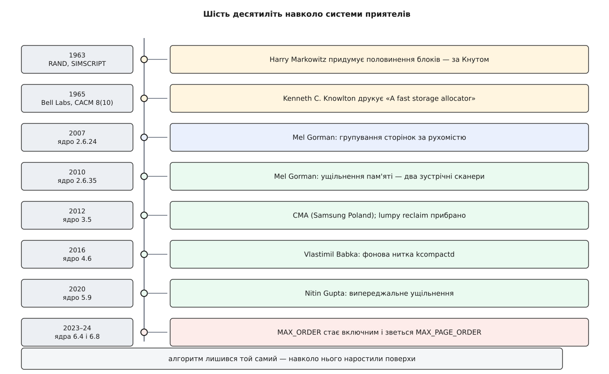

# 📜 Приятелі, яких придумав економіст: шістдесят років боротьби з фрагментацією

Алгоритм, за яким Linux роздає фізичні кадри, старший за Unix, старший за C і придуманий не для операційної системи взагалі. Його ядро — половинення блоку й обчислення партнера одним бітом — з 1963 року не змінилося ні на крок. Змінилося все навколо: за останні двадцять років ядро наростило над цим незмінним центром цілий поверх машинерії, яка існує тільки тому, що сама система приятелів із фрагментацією нічого вдіяти не може. Ця історія варта переказу, бо в ній добре видно рідкісну річ: алгоритм може бути правильним і незамінним — і водночас саме він створювати проблему, яку потім десятиліттями латають ззовні.



*Ліворуч — рік і місце, праворуч — що саме сталося. Центр шкали порожній: власне алгоритм жодного разу не змінювався.*

## Економіст, який писав симулятор

Гаррі Марковіц (Harry Markowitz) відомий зовсім не тим. Він — американський економіст, автор теорії портфеля, за яку 1990 року отримав Нобелівську премію з економіки. Але в шістдесяті він працював у RAND Corporation і робив там річ суто інженерну: мову моделювання **SIMSCRIPT** — систему, у якій можна описати чергу в аеропорту, потік деталей у цеху чи бойові дії й прокрутити це в часі.

Симулятор дискретних подій має дуже характерну поведінку в пам'яті. Він безперервно народжує й убиває дрібні об'єкти — сутність з'явилася, стала в чергу, обслужилася, зникла. Мільйони разів за прогін, об'єкти кількох різних розмірів, порядок народжень і смертей перемішаний. Для такого навантаження класичний розподільник, що тримає список вільних шматків і шукає в ньому придатний, — приреченість: список довшає, пошук довшає, а вільна пам'ять розсипається на друзки.

Звідси й вихід, який Марковіц застосував 1963 року: не шукати нічого взагалі. Дозволити тільки розміри — степені двійки, і тоді при звільненні партнер, з яким блок може злитися назад, не шукається, а обчислюється. За це платимо округленням угору й тим, що зливаються лише «законні» пари, — але платимо сталу, дуже малу ціну на кожній операції замість зростаючої.

## Друкований опис: Ноултон, Bell Labs, жовтень 1965-го

Перший **формальний опис** алгоритму в літературі — стаття «A fast storage allocator» Кеннета Ч. Ноултона (Kenneth C. Knowlton), *Communications of the ACM*, том 8, число 10, жовтень 1965 року. Ноултон — американський дослідник із Bell Telephone Laboratories, більше відомий пізнішими роботами з комп'ютерної графіки; розподільник він робив як службу пам'яті для власної мови роботи зі списками L⁶, опис якої надрукував там-таки наступного року.

Саме з цієї статті світ дізнався і про сам метод, і про те, як його зручно реалізувати: масив списків вільних блоків, по одному на порядок, і два-три рядки арифметики на злиття. Усе, що сьогодні лежить у `mm/page_alloc.c`, — це та сама конструкція.

## Кому це приписувати

Тут варто назвати статус атрибуції прямо, бо він неочевидний.

Дональд Кнут у «Мистецтві програмування» пише, що систему приятелів уперше застосував Марковіц у SIMSCRIPT 1963 року, а Ноултон відкрив її **незалежно** і надрукував. Тобто первинність ідеї — свідчення Кнута про незадокументовану публічно роботу; первинність публікації — твердий бібліографічний факт із датою й номером сторінок.

Це дві різні речі, і плутати їх не варто. Розрізнення тут стандартне для історії алгоритмів: **мати ідею** й застосувати її всередині свого продукту — не те саме, що **описати** її так, щоб нею скористалися інші. Марковіцу належить перше, Ноултону — друге, і жодне з двох не робить іншого зайвим. Ніякої суперечки про пріоритет між ними, до речі, не було: обидва займалися своїми справами, а зшив цю пару докупи вже історик — Кнут.

Далі алгоритм жив звичайним життям академічного класика: з'явилися варіації, що ділили блок не навпіл, а в іншій пропорції — фібоначчієва й зважена системи приятелів, — щоб зменшити втрати на округленні вгору. Жодна з них у Linux не прижилася: виграш у пам'яті не покривав того, що обчислення партнера переставало бути одним виключним «або».

## Чому сорок років ніхто не смикався

Дивна річ: між 1965-м і серединою двохтисячних навколо системи приятелів у ядрах не відбувається майже нічого. Linux бере її з ранніх версій і живе так роками.

Пояснення просте: **фрагментація нікому не боліла**. Переважна більшість виділень у ядрі — це один кадр або кілька, а такі знаходяться завжди, навіть коли форма вільної пам'яті геть розсипана. Великі суцільні блоки потрібні були рідко й здебільшого при завантаженні, коли пам'ять іще ціла. Систему приятелів критикували за втрати на округленні — але не за форму.

Зламали цю рівновагу дві незалежні події, що збіглися в часі.

Перша — [великі сторінки](root:sys-unix/huge-pages-tlb-reach): один запис таблиці замість п'ятисот дванадцяти, помітно менше промахів у кеші перекладу адрес. Але великій сторінці потрібні 512 кадрів поспіль із вирівняної адреси, і потрібні вони не при завантаженні, а тоді, коли база даних чи віртуальна машина цього захотіла — на місяць працюючій машині. Друга — мобільні системи: телефон із камерою, дисплеєм і відеокодеком, де кожен із цих пристроїв вимагає суцільного буфера на десятки мегабайтів, [IOMMU](root:hw-arch/iommu) — окремого блока перекладу адрес для периферії — на дешевому чипі немає, а всієї пам'яті два гігабайти.

Обидві потреби вперлися в те саме: система приятелів чудово віддає те, що є, але **не вміє зробити так, щоб великі блоки були**. Вона взагалі не має важеля впливу на форму — тільки облік.

## Поверх перший: сортувати наперед (2007)

Мел Ґорман (Mel Gorman) — ірландський розробник, автор книжки «Understanding the Linux Virtual Memory Manager» (2004), що виросла з його роботи в Університеті Лімерика, — зайшов з боку профілактики. Ідея: кадри не рівноцінні, бо одні можна перенести, а інші ні; тож не змішувати їх, а роздавати з різних областей. Так з'явилося **групування сторінок за рухомістю** — позначка рухомості на блоці сторінок і окремі списки вільних блоків на кожну пару «порядок × рухомість».

Ці латки не влетіли в ядро з першого разу — суперечка тяглася роками, і заперечення були по суті: складність у найгарячішому коді ядра заради єдиного споживача, великих сторінок, які тоді резервували при завантаженні й яким динаміка була не дуже потрібна. Аргументом «за» стало число. У примітках до випуску 2.6.24 воно записане так: на звичайній машині після кількох діб роботи в старому ядрі під великі сторінки вдавалося виділити менш ніж один відсоток фізичної пам'яті, а з групуванням за рухомістю — шістдесят-сімдесят відсотків. Це не покращення на відсотки, це різниця між «не працює» і «працює».

Групування злили в ядро 2.6.24, випущене 24 січня 2008 року (влилося воно у вікні злиття восени 2007-го).

## Поверх другий: переставляти те, що вже лягло (2010)

Профілактика не лікує вже зіпсоване. Тут у ядрі був попередній засіб — **lumpy reclaim**: коли бракувало великого блоку, витіснення переставало вибирати жертв за холодністю й починало виганяти всіх підряд у потрібному діапазоні адрес, аби звільнити суцільний шматок. Працювало це грубо: щоб зібрати дві мегабайти форми, з пам'яті викидали гарячі сторінки, які за секунду доводилося читати назад.

Ґорман запропонував замість викидання **переставляння**: сторінка нікуди не дівається, вона просто переїжджає в інший кадр, а всі записи таблиць, що на неї вказували, переписують. Два зустрічні сканери, один збирає зайняте знизу, другий вільне згори. Так у ядро 2.6.35, випущене 1 серпня 2010 року, увійшло **ущільнення пам'яті**.

Показово, що lumpy reclaim не прибрали одразу: він прожив паралельно з ущільненням іще два роки й пішов у ядрі 3.5 із формулюванням, що він більше не вкладається в чинну модель пам'яті. Це нормальний спосіб ядра змінювати механізми — новий мусить спершу довести себе на живих машинах, і аж потім прибирають старий.

## Поверх третій: резервувати заздалегідь (2012)

Того самого ядра 3.5, випущеного 21 липня 2012 року, з'явився **CMA** — розподільник суцільної пам'яті. Його зробили Марек Шипровський (Marek Szyprowski) і Міхал Назаревич (Michał Nazarewicz), польські інженери дослідницького центру Samsung у Варшаві; Назаревич того ж року надрукував у LWN докладний розбір «A deep dive into CMA» (14 березня 2012).

Походження тут суто мобільне, і воно пояснює конструкцію. Камері, дисплеєві й кодеку на телефоні потрібні великі суцільні буфери, і потрібні **іноді**. Класичний вихід — зарезервувати область при завантаженні й тримати її під ці пристрої — марнує десятки мегабайтів на пристрої, де їх і так обмаль: коли камера мовчить, пам'ять просто лежить. CMA вирішує це так: область резервують, але позначають окремим типом рухомості й пускають туди звичайні рухомі виділення. Пам'ять працює. А коли драйвер попросив — усе, що там живе, виселяють тим самим ущільненням, і область віддають цілком.

Тобто CMA — це не окремий механізм, а **надбудова над двома попередніми поверхами**: без позначок рухомості нікуди було б класти умову «сюди тільки рухоме», без міграції сторінок нікуди було б виселяти. Три роботи трьох різних команд склалися в одну конструкцію.

## Поверх четвертий: не змушувати чекати того, хто попросив (2016 і 2020)

Перша реалізація ущільнення мала неприємну властивість: платив за нього той, хто попросив великий блок. Він сам, у своєму потоці, ущільнював зону — і його затримка ставала видимою.

Властимил Бабка (Vlastimil Babka), чеський розробник із SUSE, виніс цю роботу у фонову нитку **`kcompactd`**, по одній на вузол пам'яті, — ядро 4.6, випущене 15 травня 2016 року. Формулювання в примітках до випуску пряме: забрати ущільнення в `kcompactd` із `kswapd`, щоб воно не сиділо на шляху витіснення.

Наступний крок зробив Нітін Ґупта (Nitin Gupta) — **випереджальне ущільнення** в ядрі 5.9, випущеному 11 жовтня 2020 року, з регулятором `vm.compaction_proactiveness`. Логіка тут остання можлива: якщо ущільнювати за запитом — хтось усе одно чекає, хай і фоново; тож треба ущільнювати **без запиту**, тримаючи форму вільної пам'яті в заданих межах постійно.

Зверніть увагу на напрямок усього руху: 2007 — не допустити безладу, 2010 — прибрати безлад на вимогу, 2016 — прибирати його осторонь, 2020 — прибирати до того, як хтось помітить. Це та сама еволюція, якою в системах проходить будь-яка дорога робота: із гарячого шляху у фон, із фону — у профілактику.

## Постскриптум: одна стала, десятиліття багів

Остання подія в цій історії — не алгоритм і навіть не механізм. Це виправлення означення сталої, і воно варте окремої згадки, бо показує ціну недбалого імені.

Стеля порядків у Linux звалася `MAX_ORDER` і означала **кількість** порядків. Тобто найбільший **дозволений** порядок був `MAX_ORDER - 1`:

```
MAX_ORDER = 11        ← «одинадцять порядків: 0…10»
найбільший блок = 2¹⁰ = 1024 кадри = 4 МіБ на x86-64

правильний обхід:   for (order = 0; order <  MAX_ORDER; order++)
природний обхід:    for (order = 0; order <= MAX_ORDER; order++)   ← читає за межу free_area[]
```

Ім'я каже «максимальний порядок», а значення означає «кількість порядків» — і кожен, хто вперше бачив цю сталу, писав `<=` замість `<`. Кирило Шутьомов (Kirill A. Shutemov), що працює над пам'яттю ядра в Intel, переробив це двома кроками. Спершу — ядро 6.4 (червень 2023), комміт «mm, treewide: redefine MAX_ORDER sanely»: значення зробили включним, і в поясненні сказано без евфемізмів, що старе означення суперечило інтуїції й породило чимало багів по всьому ядру.

Але тут виникла друга біда, тонша за першу. Стала лишилася з тим самим іменем і новим змістом — а отже, будь-який код поза деревом ядра, написаний за старим змістом, зібрався б із новим **мовчки**, без жодного попередження, і давав би блоки вдвічі менші за очікувані. Тому другим кроком, у ядрі 6.8 (березень 2024), сталу перейменували на `MAX_PAGE_ORDER` — наскрізною правкою по всьому дереву, від документації до драйверів. Сенс перейменування рівно один: зробити мовчазну помилку гучною. Старе ім'я зникло, старий код тепер не збирається взагалі.

Шістдесят років алгоритм, у якому нічого не змінилося, — і найдовше в ньому прожила помилка не в коді, а в тому, як назвали число. Це, мабуть, найкращий підсумок усієї історії: сама конструкція приятелів виявилася настільки правильною, що витримала все, зокрема й чотири поверхи, які довелося надбудувати навколо неї, і одну лічильну неохайність, що тихо збирала свій урожай баґів довше, ніж прожила більшість механізмів у цьому переліку.

Хто хоче побачити систему приятелів у ширшому ряду — поруч зі списками вільних шматків, розподільниками за розмірними класами й тим, чому кожен із них псує пам'ять по-своєму, — це [внутрішня будова розподільників пам'яті](root:sf-lang/memory-allocator-internals).
