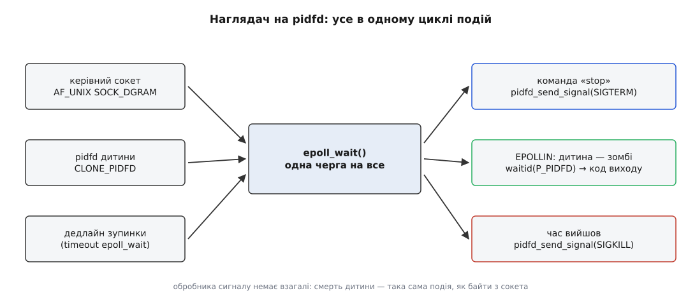
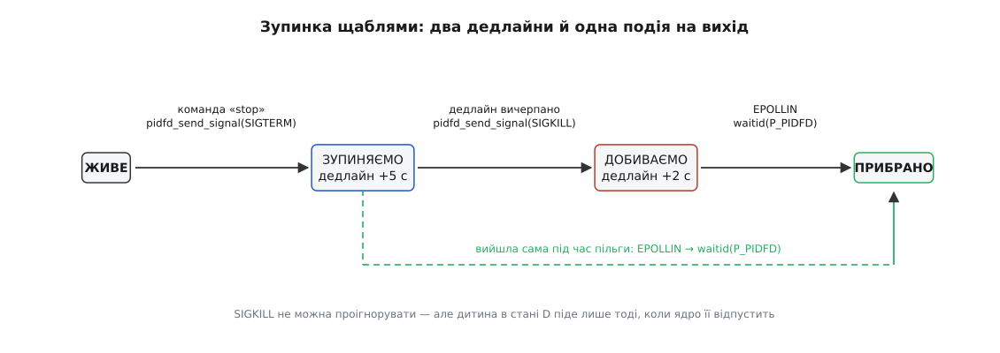

# ⚙️ Наглядач, який не влучає в сусіда

Тут зібрано повний код наглядача на C: він запускає робочий процес, ловить його смерть у тому самому циклі подій, що й команди з керівного сокета, і зупиняє його щаблями SIGTERM → SIGKILL так, що жоден із цих сигналів принципово не може прилетіти сторонній програмі. Поруч — той самий наглядач у звичному наївному вигляді, з pid-файлом і `kill(pid)`, з точним розрахунком, у яку саме мить і з якою ймовірністю він стріляє в чужого.

## Умова

Наглядач мусить уміти чотири речі:

- запустити задану команду й далі за нею стежити;
- приймати команди ззовні (мінімум — «зупинись»), не блокуючись на них;
- дізнатися про завершення дитини **тоді ж**, коли воно сталося, і забрати код виходу;
- на команду зупинки надіслати SIGTERM, дати пільговий час, а якщо не подіяло — добити SIGKILL.

І одна жорстка умова понад усе: жоден сигнал, надісланий наглядачем, не має шансу влучити в процес, який наглядачеві не належить. Не «майже не має» — не має взагалі.

Керівний сокет тут — датаграмний сокет домену Unix ([сокети домену Unix](root:sys-unix/unix-domain-sockets) — той самий інтерфейс сокета, але адреса є іменем у файловій системі, а не парою «адреса + порт»). Він у прикладі присутній не для повноти, а тому, що саме через нього видно головну вигоду: смерть дитини й байти з мережі стають подіями одного роду.

## Наївний варіант і мить пострілу

Ось як це виглядає в переважній більшості скриптів запуску та в чималій кількості демонів:

```sh
# запуск
worker &
echo $! > /run/worker.pid

# зупинка, можливо через години й уже з іншого процесу
pid=$(cat /run/worker.pid)
kill -0 "$pid" 2>/dev/null || exit 0   # «перевірили, що живий»
kill -TERM "$pid"
sleep 5
kill -KILL "$pid" 2>/dev/null          # добиваємо
```

Виглядає обережно: є перевірка, є пільговий час, є придушені помилки. Насправді кожен крок цієї зупинки має власну ваду, і найгірша — в останньому рядку.

**Перевірка відповідає не на те питання.** `kill(pid, 0)` не шле сигналу, але виконує дві справжні перевірки ядра: чи зайнятий такий номер і чи маємо ми право надіслати за ним сигнал. Питання «чи це той самий процес, що ми запускали» тут не ставиться взагалі — і поставити його через цей інтерфейс неможливо, бо номер не несе жодного сліду тотожності. Тому перевірка чесно каже «так» і про наш процес, і про будь-який сторонній, який успів отримати те саме число.

**Пауза — це вікно.** П'ять секунд `sleep` минають без жодного зв'язку з реальністю: за цей час дитина майже напевно вже вийшла (добре виховані процеси відповідають на SIGTERM за десятки мілісекунд), номер повернувся в коло, і ядро роздає його далі.

**Добивання стріляє саме тоді, коли ціль найімовірніше вже мертва.** Це і є та точна мить. Рядок `kill -KILL "$pid"` виконується рівно в момент, коли ймовірність того, що номер уже вільний, максимальна за весь життєвий цикл служби. Крок, доданий заради надійності, — найнебезпечніший рядок усього сценарію.

Порахуймо, наскільки. Ядро роздає номери по колу: покажчик іде вперед від останнього виданого й повертається до початку, дійшовши до `pid_max`. Отже, звільнене число не дістанеться комусь одразу — воно чекає, доки покажчик обійде коло й дійде до нього. Якщо в системі створюють `r` процесів за секунду, а вільних номерів у колі `N`, то покажчик проходить будь-яке задане число раз на `N / r` секунд. Звідси й береться ймовірність того, що за вікно `w` він устигне пройти саме наше число — доки `w` менше за повний оберт, вона просто дорівнює частці кола, яку покажчик здолав за цей час.

**Умова: складальна машина, `pid_max` = 32768, приблизно 600 короткоживучих процесів за секунду; дитина вийшла на SIGTERM за 100 мс, а `sleep 5` триває далі.**

```
вільних номерів у колі  N = 32768 − 300 − 500 ≈ 31968
вікно, коли номер вільний w = 5.0 − 0.1 = 4.9 с
оберт кола               N / r = 31968 / 600 ≈ 53 с
ймовірність влучити в чужого ≈ w·r / N = 4.9 · 600 / 31968 ≈ 0.092
```

Тобто приблизно одна зупинка з одинадцяти вбиває сторонню програму. Тепер система, де `pid_max` виставлено малим — скажімо, 4096 — а навантаження те саме (до ядра 6.14 таку межу можна було задати лише на весь хост, від 6.14 — окремо для простору імен контейнера):

```
N = 4096 − 300 ≈ 3800
ймовірність ≈ 4.9 · 600 / 3800 ≈ 0.77
```

Три зупинки з чотирьох. І `2>/dev/null` в останньому рядку прибирає єдиний натяк, що щось пішло не так: якщо номер вільний, `kill` провалиться з `ESRCH` мовчки, а якщо його встиг зайняти чужий — мовчки спрацює. Коли наглядач працює від root, «немає прав» його теж не спинить: він має право надіслати сигнал будь-кому.

Мікровікно між перевіркою й пострілом (ті самі десятки мікросекунд, за які встигають два системні виклики) тут майже ні до чого — коло не обертається так швидко. Небезпечна не мікросекунда, а **застарілість самого числа**: воно приходить із файлу, з журналу, з пам'яті процесу, який спав п'ять секунд, — і перевірка не вміє відрізнити застаріле число від свіжого.

> 🔧 **Навіщо це.** Звідси випливає правило, за яким видно проблемний наглядач із першого погляду: якщо в коді є `sleep` між сигналом і добиванням, а адресат — число, то це не «пільговий час», а вікно, ширину якого автор сам собі призначив. Розв'язок не в тому, щоб зробити вікно вужчим (воно потрібне — процес має встигнути вийти), а в тому, щоб адресат перестав бути числом.

## Ідея: три заміни

Весь наглядач нижче — це три заміни, зроблені послідовно.

**Замість числа — посилання.** Ядро дає програмі посилання на свої об'єкти єдиним способом: файловим дескриптором ([файловий дескриптор](root:sys-unix/file-descriptor) — мале число, за яким ядро тримає посилання на об'єкт, поки дескриптор відкритий). Для процесу такий дескриптор називається pidfd. Він запам'ятовує **конкретний процес**, а не номер: якщо процес помер і його прибрали, `pidfd_send_signal` поверне `ESRCH` замість того, щоб влучити в нового власника числа.

**Замість «створили, потім знайшли» — одна дія.** `clone3()` із прапорцем `CLONE_PIDFD` віддає готовий дескриптор у ту саму мить, коли дитина з'являється. Проміжку «дитина вже є, а посилання ще нема» не існує зовсім.

**Замість обробника сигналу — подія в циклі.** pidfd можна покласти в `epoll` поруч із сокетом: він стає читабельним, коли процес завершився ([select, poll, epoll](root:sys-unix/select-poll-epoll) — один виклик, що чекає на готовність багатьох дескрипторів одразу). Тобто `SIGCHLD` і весь тягар обробника сигналу зникають: не треба ні глобальних прапорців `volatile sig_atomic_t`, ні каналу, у який обробник пише байт, щоб цикл подій його помітив, ні дисципліни асинхронно-сигнальної безпеки ([що взагалі можна робити в обробнику сигналу](root:sys-unix/async-signal-safety) — обробник перериває програму в довільній точці, тому в ньому дозволено лише вузький перелік викликів).



*Смерть дитини входить у програму тим самим шляхом, що й байти з сокета, — звичайною подією готовності. Тому в наглядачі немає жодного обробника сигналу.*

## Народження дитини разом із посиланням

Обгорток для цих викликів glibc не дає — їх кличуть напряму через `syscall()`:

```c
#define _GNU_SOURCE
#include <linux/sched.h>      /* struct clone_args */
#include <sched.h>            /* CLONE_PIDFD */
#include <sys/syscall.h>

#include <errno.h>
#include <signal.h>
#include <stdint.h>
#include <stdio.h>
#include <string.h>
#include <sys/epoll.h>
#include <sys/socket.h>
#include <sys/un.h>
#include <sys/wait.h>
#include <time.h>
#include <unistd.h>

static long sys_clone3(struct clone_args *a, size_t sz)
{ return syscall(SYS_clone3, a, sz); }

static int sys_pidfd_open(pid_t pid, unsigned int flags)
{ return (int)syscall(SYS_pidfd_open, pid, flags); }

static int sys_pidfd_kill(int fd, int sig, unsigned int flags)
{ return (int)syscall(SYS_pidfd_send_signal, fd, sig, (siginfo_t *)NULL, flags); }

static long now_ms(void)
{
    struct timespec ts;
    clock_gettime(CLOCK_MONOTONIC, &ts);
    return ts.tv_sec * 1000L + ts.tv_nsec / 1000000L;
}
```

Сам запуск:

```c
/* Повертає pidfd. Номер потрібен тільки для журналу — діяти ним ми не будемо. */
static int spawn(char *const argv[], pid_t *pid_out)
{
    int pidfd = -1;
    struct clone_args a;
    memset(&a, 0, sizeof a);
    a.flags       = CLONE_PIDFD;
    a.pidfd       = (uint64_t)(uintptr_t)&pidfd;
    a.exit_signal = SIGCHLD;      /* інакше waitid() вимагав би __WALL */

    long rc = sys_clone3(&a, sizeof a);
    if (rc == 0) {                       /* ми — дитина */
        signal(SIGPIPE, SIG_DFL);        /* SIG_IGN переживає exec, скидаємо */
        setpgid(0, 0);                   /* власна група процесів */
        execvp(argv[0], argv);
        _exit(127);
    }
    if (rc > 0) { *pid_out = (pid_t)rc; return pidfd; }
    if (errno != ENOSYS) return -1;      /* справжня біда, а не старе ядро */

    /* Запасний шлях для ядер до 5.3: спершу народити, потім узяти посилання. */
    pid_t p = fork();
    if (p == 0) {
        signal(SIGPIPE, SIG_DFL);
        setpgid(0, 0);
        execvp(argv[0], argv);
        _exit(127);
    }
    if (p < 0) return -1;
    *pid_out = p;
    return sys_pidfd_open(p, 0);
}
```

Три рішення в цих трьох десятках рядків варті окремого слова.

`exit_signal = SIGCHLD` — не косметика. Ядро вважає дитину, яка при завершенні шле батькові щось інше (або нічого), «клонованою», і звичайний `wait` її не помічає: довелося б додавати `__WALL`. Ставимо `SIGCHLD` — і `waitid()` працює як завжди, хоча сам сигнал ми ніде не обробляємо.

`signal(SIGPIPE, SIG_DFL)` у дитині — виправлення класичної помилки. Заміна образу скидає **перехоплені** сигнали на типову дію, але **проігноровані** лишає проігнорованими ([exec: заміна образу](root:sys-unix/exec-semantics) — код і дані замінюються цілком, проте частина властивостей процесу переживає заміну). Наглядач ігнорує `SIGPIPE`, щоб не вмерти на записі в закритий сокет, — і без цього рядка успадкувала б це й дитина, а разом із тим і дивну поведінку конвеєрів усередині неї.

Запасний шлях із `fork()` виглядає так, ніби в нього є діра: між поверненням `fork()` і `pidfd_open()` дитина може встигнути вмерти. Діри немає, і причина точна: ми — батько, і ми ще не забирали код виходу. Доки батько не зробив `wait`, запис про померлу дитину лишається в системі, а разом із ним лишається зайнятим і номер ([завершення, wait і зомбі](root:sys-unix/exit-wait-zombies) — процес зникає не тоді, коли перестав виконуватися, а тоді, коли батько забрав результат). Тому в цьому вікні номер не може дістатися нікому іншому — `pidfd_open()` або відкриє посилання на нашу дитину, або на її зомбі, третього не дано. Гарантія тримається саме на власності й зникає тієї миті, коли ми викличемо `waitid()`.

## Один цикл на команди й на смерть

Керівний сокет — датаграмний, щоб не заводити окремий шлях для приймання з'єднань:

```c
static int control_socket(const char *path)
{
    int s = socket(AF_UNIX, SOCK_DGRAM | SOCK_CLOEXEC | SOCK_NONBLOCK, 0);
    if (s < 0) return -1;

    struct sockaddr_un sa;
    memset(&sa, 0, sizeof sa);
    sa.sun_family = AF_UNIX;
    strncpy(sa.sun_path, path, sizeof sa.sun_path - 1);
    unlink(path);
    if (bind(s, (struct sockaddr *)&sa, sizeof sa) < 0) { close(s); return -1; }
    return s;
}
```

Далі — сам цикл. Стан наглядача — чотири значення й один дедлайн:

```c
enum { ST_RUN, ST_TERM, ST_KILL, ST_DONE };

/* Тіла — нижче; у файлі вони стоять перед main(). */
static void on_command(int sock, int pidfd, int *state, long *deadline);
static void on_child_exit(int ep, int *pidfd, int *state);
static void escalate(int pidfd, int *state, long *deadline);

int main(int argc, char **argv)
{
    if (argc < 3) { fprintf(stderr, "usage: sup <sock> <cmd> [args…]\n"); return 2; }
    signal(SIGPIPE, SIG_IGN);

    pid_t pid = -1;
    int pidfd = spawn(&argv[2], &pid);
    if (pidfd < 0) { perror("spawn"); return 1; }

    int sock = control_socket(argv[1]);
    if (sock < 0) { perror("control_socket"); return 1; }

    int ep = epoll_create1(EPOLL_CLOEXEC);
    struct epoll_event ev;
    ev.events = EPOLLIN;
    ev.data.fd = sock;
    epoll_ctl(ep, EPOLL_CTL_ADD, sock, &ev);
    ev.data.fd = pidfd;
    epoll_ctl(ep, EPOLL_CTL_ADD, pidfd, &ev);

    int  state = ST_RUN;
    long deadline = 0;
    fprintf(stderr, "запущено: pid=%d pidfd=%d\n", pid, pidfd);

    while (state != ST_DONE) {
        int timeout = -1;                       /* ЖИВЕ: чекаємо скільки треба */
        if (state != ST_RUN) {
            long left = deadline - now_ms();
            timeout = left > 0 ? (int)left : 0;
        }

        struct epoll_event evs[4];
        int n = epoll_wait(ep, evs, 4, timeout);
        if (n < 0) {
            if (errno == EINTR) continue;
            perror("epoll_wait");
            break;
        }
        if (n == 0) { escalate(pidfd, &state, &deadline); continue; }

        for (int i = 0; i < n; i++) {
            if (evs[i].data.fd == sock)
                on_command(sock, pidfd, &state, &deadline);
            else if (evs[i].data.fd == pidfd)
                on_child_exit(ep, &pidfd, &state);
        }
    }

    unlink(argv[1]);
    return 0;
}
```

Дедлайн живе не окремим таймером, а **аргументом `epoll_wait`**: скільки лишилося до нього, стільки й дозволено спати. Повернення нуля означає рівно одне — дедлайн настав раніше за будь-яку подію. Окремий `timerfd` тут був би зайвим ускладненням: дедлайн у наглядача завжди один.

Перевірка `errno == EINTR` — не забобон, хоча власних обробників у наглядача немає. Виклик усе одно повернеться достроково, якщо процес зупинити й відновити (`Ctrl+Z`, потім `fg`), якщо до нього приєднається налагоджувач або якщо хтось згодом додасть у програму хоч один обробник. А `epoll_wait` — саме з тих викликів, які ядро ніколи не перезапускає само ([EINTR: перервані виклики й перезапуск](root:sys-unix/eintr-and-restart) — частину викликів після сигналу ядро продовжує, частину повертає з помилкою, і перелік цей треба знати).

## Забрати результат і не закрутитися

```c
static void on_child_exit(int ep, int *pidfd, int *state)
{
    siginfo_t info;
    memset(&info, 0, sizeof info);

    int rc = waitid(P_PIDFD, (id_t)*pidfd, &info, WEXITED | WNOHANG);
    if (rc < 0)
        perror("waitid");                          /* ECHILD: прибрали без нас */
    else if (info.si_pid == 0)
        fprintf(stderr, "подія без зміни стану\n"); /* сюди ми потрапити не мали */
    else if (info.si_code == CLD_EXITED)
        fprintf(stderr, "вийшла сама, код %d\n", info.si_status);
    else
        fprintf(stderr, "убита сигналом %d\n", info.si_status);

    epoll_ctl(ep, EPOLL_CTL_DEL, *pidfd, NULL);   /* саме до close() */
    close(*pidfd);
    *pidfd = -1;
    *state = ST_DONE;
}
```

Рядок із `EPOLL_CTL_DEL` — не прибирання за собою, а умова працездатності. `epoll` тут рівневий: він повідомляє про **стан**, а не про перехід. А смерть — це стан, і він назавжди: дескриптор лишається читабельним, скільки б разів ви його не опитали, а після `waitid()` до `EPOLLIN` додається ще й `EPOLLHUP`, бо запису про задачу більше немає. Лишивши такий дескриптор у наборі, ви дістанете `epoll_wait`, який повертається миттєво й нескінченно, тобто цикл на сто відсотків процесора.

`WNOHANG` разом із перевіркою `si_pid != 0` — обережність, яка нічого не коштує. Після `EPOLLIN` дитина вже зомбі, тож блокування не буде; але `waitid()` повертає нуль і тоді, коли нічого не сталося, і єдиний переносний спосіб відрізнити ці випадки — обнулити `si_pid` перед викликом і перевірити після.

## Зупинка щаблями

```c
static void on_command(int sock, int pidfd, int *state, long *deadline)
{
    char buf[64];
    ssize_t k = recv(sock, buf, sizeof buf - 1, 0);
    if (k <= 0) return;
    buf[k] = '\0';

    if (strncmp(buf, "stop", 4) == 0 && *state == ST_RUN) {
        if (sys_pidfd_kill(pidfd, SIGTERM, 0) < 0 && errno == ESRCH)
            fprintf(stderr, "уже мертва — сигнал нікуди не пішов\n");
        *state = ST_TERM;
        *deadline = now_ms() + 5000;
        fprintf(stderr, "SIGTERM надіслано, пільга 5 с\n");
    }
}

static void escalate(int pidfd, int *state, long *deadline)
{
    if (*state == ST_TERM) {
        fprintf(stderr, "пільга вичерпана — SIGKILL\n");
        sys_pidfd_kill(pidfd, SIGKILL, 0);
        *state = ST_KILL;
        *deadline = now_ms() + 2000;
    } else {
        fprintf(stderr, "SIGKILL не подіяв: дитина, найпевніше, у стані D\n");
        *deadline = now_ms() + 2000;
    }
}
```



*Пільговий час лишився тим самим, що й у наївному сценарії, — змінився адресат. У наївному він застаріває під час пільги, тут же дескриптор або влучає в свого, або чесно віддає `ESRCH`.*

Той самий `ESRCH`, який у наївній версії був мовчазним свідком біди, тут стає корисним повідомленням: «твоя дитина померла, поки ти складав команду». Це не помилка наглядача — це нормальний перебіг подій, і оброблено його як звичайну гілку.

Друга гілка `escalate()` виглядає безпорадною — вона такою і є. SIGKILL не можна ні перехопити, ні проігнорувати, але подіє він лише тоді, коли задачу взагалі можна зупинити; задача, що застрягла в непереривному очікуванні на ввід-вивід, не помре, доки ядро її не відпустить ([стани процесу і що означає стан D](root:sys-unix/process-states) — у цьому стані задача не приймає жодних сигналів). Єдине правильне, що тут може зробити наглядач, — сказати про це в журнал.

## Що з піддеревом

Дескриптор указує на **один** процес. Якщо робітник устиг наплодити власних дітей, SIGTERM крізь pidfd дістанеться лише йому, а внуки лишаться жити — і, втративши батька, перечепляться вгору по дереву ([сироти й перепідпорядкування](root:sys-unix/orphan-reparenting) — дитина ніколи не лишається без батька, її передають найближчому предкові-підбирачеві або PID 1).

З ядра 6.9 в цього є прямий розв'язок. Дитина в `spawn()` уже зробила `setpgid(0, 0)` й тому є лідером власної групи процесів — отже, її дескриптором можна адресувати всю групу:

```c
#include <linux/pidfd.h>     /* PIDFD_SIGNAL_PROCESS_GROUP, ядро 6.9+ */

if (sys_pidfd_kill(pidfd, SIGTERM, PIDFD_SIGNAL_PROCESS_GROUP) < 0 && errno == EINVAL)
    sys_pidfd_kill(pidfd, SIGTERM, 0);      /* старе ядро: тільки сам процес */
```

Старий спосіб зробити те саме — `kill(-pid, SIGTERM)` — повертає нас рівно до тієї гонки, від якої ми тікали: група теж називається числом. Єдине пом'якшення там таке: число групи звільняється пізніше, ніж число процесу, бо тримається, доки в групі лишається хоч один живий учасник. Вікно вужче, але воно є.

І принципова межа: група процесів — не огорожа. Учасник може вийти з неї власним `setpgid()` або `setsid()` і з-під сигналу втекти ([керування завданнями й термінальні сигнали](root:sys-unix/job-control) — той самий механізм груп, яким `Ctrl+C` зупиняє конвеєр). Коли треба гарантовано накрити ціле піддерево, потрібна межа, з якої не можна вийти зсередини, — cgroup ([cgroups: облік і обмеження ресурсів](root:sys-unix/cgroups-resource-model) — облікова межа, у яку процес потрапляє й з якої не має права себе вилучити). Саме тому менеджери служб зупиняють одиниці роботи за cgroup, а не за деревом процесів ([життєвий цикл служби й політика перезапуску](root:sys-unix/service-lifecycle)).

## Що це коштує

```
на дитину:      1 дескриптор + 1 запис у epoll
на подію:       1 виклик epoll_wait → 1 waitid, тобто O(1)
обробників сигналу: 0
глобального стану:  0
```

Останні два рядки важать більше, ніж перші два. Наглядач із `SIGCHLD` мусить мати обробник, а обробник — це код, який виконується в довільній точці програми: у ньому не можна ні виділяти пам'ять, ні писати в `stdio`, ні брати замки. Тому весь класичний рецепт — обробник виставляє прапорець, головний цикл його бачить, кличе `waitpid(-1, …, WNOHANG)` у циклі, розбирає, котра з дітей це була. І окремо — спосіб розбудити цикл подій, який саме спить у `epoll_wait`: або канал, у який обробник пише один байт, або `signalfd` ([маскування сигналів і signalfd](root:sys-unix/signal-mask-signalfd) — сигнал перетворюють на читання з дескриптора, попередньо його заблокувавши). З pidfd усього цього немає: подія приходить із зазначенням, **чия саме** вона, бо кожна дитина має свій дескриптор.

Ціна ж — один дескриптор на дитину. Наглядач на тисячу процесів витратить тисячу дескрипторів і впреться в `RLIMIT_NOFILE` раніше, ніж у щось інше; це єдина справжня плата.

## Пастки

**`ESRCH` — не помилка.** Для `pidfd_send_signal` він означає рівно «процес завершився й уже прибраний». У наглядача це очікувана гілка, а не збій.

**`waitid(P_PIDFD)` працює тільки з власною дитиною.** Дескриптор чужого процесу дозволяє надсилати йому сигнали й чекати на нього через `epoll`, але не забирати код виходу: буде `ECHILD`. Це не обмеження pidfd, а те саме правило власності — код виходу належить батькові.

**Не ставте `SIGCHLD` у `SIG_IGN`.** Тоді ядро прибирає дітей само, `waitid()` віддасть `ECHILD`, а код виходу зникне безслідно. Подію на дескрипторі ви при цьому все одно побачите — лише вже разом із `EPOLLHUP`, бо задачі не стало миттєво.

**Дескриптор закривається на `exec`.** І `CLONE_PIDFD`, і `pidfd_open()` віддають дескриптор із виставленим `FD_CLOEXEC`. Наглядач, який уміє перезапускати сам себе через `execve()`, мусить перед цим зняти прапорець і передати номер дескриптора новому образу — інакше після самооновлення він утратить посилання на всіх своїх дітей.

**`clone3()` і розмір структури.** Другим аргументом іде `sizeof(struct clone_args)`. Якщо заголовки новіші за ядро, структура більша, ніж ядро знає, — і воно поверне `E2BIG`, побачивши в незнайомому хвості ненульові байти. Тому структуру обов'язково обнуляють перед заповненням. На старих заголовках її може не бути зовсім — тоді або оголошують самі, або одразу йдуть запасним шляхом.

**Номерів системних викликів може не бути в заголовках.** `SYS_pidfd_open` і решта з'явилися в `<sys/syscall.h>` не одразу; на архітектурах зі спільною таблицею номерів це 424 (`pidfd_send_signal`), 434 (`pidfd_open`), 435 (`clone3`), 438 (`pidfd_getfd`). Але вписувати ці числа в код — поганий обмін: надійніше перевірити наявність імені під час збірки, а під час роботи відступати на запасний шлях за `ENOSYS`.

**Простори імен.** `pidfd_open()` приймає номер таким, яким його бачить **той, хто кличе**. Число, прочитане з журналу контейнера, на хості означає інше ([простори імен: ізоляція погляду на систему](root:sys-unix/namespaces) — той самий процес має власний номер у кожному просторі, до якого належить).

## Якщо ядро старіше

Порядок відступу, від кращого до гіршого:

- **5.3 і новіше** — усе описане працює як є.
- **5.2** — `clone3()` ще немає, але `CLONE_PIDFD` уже є в старому `clone()`: дескриптор кладеться за вказівником `parent_tid`, тому з `CLONE_PARENT_SETTID` цей прапорець несумісний.
- **5.1** — є тільки `pidfd_send_signal()`, і дескриптор для нього беруть звичайним відкриттям каталогу: `open("/proc/<pid>", O_RDONLY | O_DIRECTORY)`. Сигнали вже безпечні, а от чекати на такому дескрипторі через `epoll` чи `waitid()` не можна — ці два виклики приймають лише справжній pidfd.
- **до 5.1** — сигнал усе одно доведеться слати через `kill(pid)`, але тотожність можна перевірити чесно.

Останній варіант вартий точності, бо його досі багато де видно. Дескриптор, відкритий на каталозі `/proc/<pid>`, тримає посилання на ту саму внутрішню структуру процесу, що й pidfd ([/proc: процеси як файли](root:sys-unix/proc-reading-process-and-kernel-state) — каталоги-вікна у структури ядра). Тому він **ніколи** не почне вказувати на нового власника того самого числа: коли процес прибрано, звернення крізь цей дескриптор просто провалюються — `ENOENT` на відкритті файлу всередині або `ESRCH` на читанні, залежно від того, де саме ядро помітить смерть.

```c
#include <fcntl.h>          /* O_PATH вимагає _GNU_SOURCE */

int dir = open("/proc/4242", O_PATH | O_DIRECTORY | O_CLOEXEC);
/* …через якийсь час, перед самим пострілом: */
int st = openat(dir, "stat", O_RDONLY | O_CLOEXEC);
if (st < 0) {
    /* та сама задача вже мертва — стріляти нікуди */
} else {
    /* жива; звіряємо ще й час старту (поле 22) — і одразу kill(pid, SIGTERM) */
}
```

Це прибирає **застарілість** — головну причину пострілів у сусіда — і лишає тільки мікровікно між перевіркою й `kill()`. Підставмо в ту саму формулу `w` завдовжки в п'ятдесят мікросекунд:

```
ймовірність ≈ 0.00005 · 600 / 31968 ≈ 9.4·10⁻⁷
```

Одна зупинка з мільйона замість однієї з одинадцяти. Не нуль, але й не та сама задача. Заміняти цим pidfd там, де pidfd є, все одно сенсу немає: там вікна немає взагалі.

## Як запустити

```
cc -O2 -Wall -o sup sup.c
./sup /tmp/sup.sock sleep 300

# в іншому терміналі:
printf stop | socat - UNIX-SENDTO:/tmp/sup.sock
```

Виведення наглядача:

```
запущено: pid=51234 pidfd=3
SIGTERM надіслано, пільга 5 с
убита сигналом 15
```

А щоб побачити другий щабель, підставте замість `sleep` програму, яка ігнорує SIGTERM:

```
запущено: pid=51299 pidfd=3
SIGTERM надіслано, пільга 5 с
пільга вичерпана — SIGKILL
убита сигналом 9
```

У жодному з цих сценаріїв число `51234` не бере участі в діях — воно лише друкується. Саме в цьому й полягає весь виграш: наглядач не має чим влучити в чужого, навіть якби схотів.
