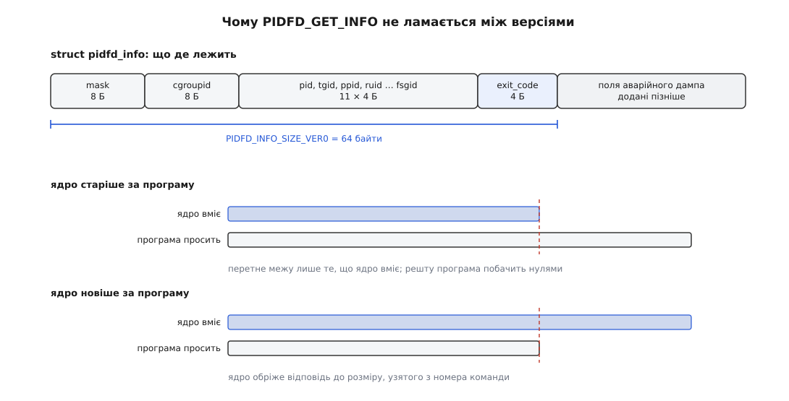

# 📋 Довідка: pidfs, PIDFD_GET_INFO і сталі pidfd

Тут зібрано ту частину контракту pidfd, яка з'явилася після переїзду дескриптора у власну файлову систему: як звірити тотожність двох дескрипторів, як розпитати дескриптор про процес, не переходячи назад на номер, і які сталі та опції з'явилися навколо цього. Базові виклики — `pidfd_open()`, `pidfd_send_signal()`, `pidfd_getfd()`, `CLONE_PIDFD` — з підписами й помилками лежать [у довідці іменування процесів](topic:sys-unix/pid-and-hierarchy/api-pid-interfaces.md); тут вони тільки згадуються.

## Дескриптор як вузол файлової системи (6.9)

До 6.9 pidfd був безіменним об'єктом ядра, як `eventfd` чи `signalfd`: питати його не було про що, бо за ним не стояло вузла. З 6.9 pidfd живе у власній крихітній псевдо-ФС `pidfs` ([псевдо-ФС](topic:sys-unix/pseudo-filesystems) — файлові системи без носія, які показують структури ядра як файли), і саме це відкрило все решту.

| що | до 6.9 | з 6.9 |
|---|---|---|
| `statx()` на дескрипторі | вузол спільний на всі анонімні об'єкти, `stx_ino` нічого не називає | власний вузол; `stx_ino` — 64-бітний номер, унікальний на весь час роботи системи |
| `ioctl()` на дескрипторі | нема команд | канал розпитування (нижче) |
| мітка безпеки | нема на чому тримати | вузол має власний контекст, і модулі безпеки бачать pidfd як об'єкт |

Звідси головна практична дія — звірити, чи два дескриптори вказують на той самий процес:

```c
#define _GNU_SOURCE
#include <fcntl.h>
#include <sys/stat.h>

static int same_process(int a, int b, int *same) {
    struct statx sa, sb;
    if (statx(a, "", AT_EMPTY_PATH, STATX_INO, &sa) < 0) return -1;
    if (statx(b, "", AT_EMPTY_PATH, STATX_INO, &sb) < 0) return -1;
    *same = (sa.stx_ino == sb.stx_ino);
    return 0;
}
```

`AT_EMPTY_PATH` з порожнім шляхом означає «сам цей дескриптор» ([statx](topic:sys-unix/statx-mask-and-unknown-values) — розширений запит атрибутів, у якому просять лише потрібні поля). Номер видає `pidfs` і не перевикористовує його до перезавантаження — на відміну від номера процесу, який обертається по кільцю ([inode](topic:sys-unix/inode-model) — вузол як справжня тотожність файлу, окрема від його імені).

Дві речі, які тут легко припустити хибно.

**Напис у `/proc/<pid>/fd` не змінився.** Символьне посилання на pidfd і далі читається як `anon_inode:[pidfd]`: `pidfs` навмисно лишив стару назву, щоб не поламати програми, які розбирають цей каталог. Номера вузла звідти не видно, його дає лише `statx()`. Хто саме за дескриптором — показує `/proc/<pid>/fdinfo/<fd>`: рядок `Pid:` (номер цілі так, як його бачить читач) і `NSpid:` (той самий номер по ланцюжку вкладених просторів імен).

**Дескриптор на `/proc/<pid>`, відкритий звичайним `open()`, — не мешканець `pidfs`.** Частина викликів приймає його як pidfd, але вузла з унікальним номером у нього немає, як немає ні `ioctl`-команд, ні готовності для `poll`.

## Розпитати дескриптор: `PIDFD_GET_INFO` (6.13)

```c
#include <linux/pidfd.h>
#include <sys/ioctl.h>

struct pidfd_info {
    __u64 mask;      /* на вході — що просимо; на виході — що справді заповнено */
    __u64 cgroupid;
    __u32 pid, tgid, ppid;
    __u32 ruid, rgid, euid, egid, suid, sgid, fsuid, fsgid;
    __s32 exit_code;
    /* далі — поля, додані пізнішими ядрами */
};

int ioctl(int pidfd, PIDFD_GET_INFO, struct pidfd_info *info);
```

Номери приходять у просторі імен процесів того, хто питає, права — у його просторі імен користувачів. На дескрипторі з `PIDFD_THREAD` поля `pid` і `tgid` розходяться: перше називає потік, друге — його групу.

| біт `mask` | що заповнює | з версії |
|---|---|---|
| `PIDFD_INFO_PID` | `pid`, `tgid`, `ppid` | 6.13 |
| `PIDFD_INFO_CREDS` | вісім полів `*uid`/`*gid` | 6.13 |
| `PIDFD_INFO_CGROUPID` | `cgroupid` — ідентифікатор контрольної групи ([cgroups](topic:sys-unix/cgroups-resource-model) — дерево груп для обліку й обмеження ресурсів) | 6.13 |
| `PIDFD_INFO_EXIT` | `exit_code` — чим скінчилася ціль | 6.15 |
| `PIDFD_INFO_COREDUMP` | чи дійшло до аварійного дампа й чим його припинили | 6.16 |

**Вірити можна лише вихідній масці.** Прохання — це побажання: ядро повертає в `mask` рівно ті біти, поля яких воно справді заповнило. Старіше ядро мовчки не поставить біта, якого не знає, а не поверне помилку — тому перевірка `info.mask & PIDFD_INFO_EXIT` після виклику обов'язкова, і саме вона, а не версія ядра в `uname`, є справжньою відповіддю на питання «чи є ці дані». У зворотний бік працює так само: частину полів (номери й права) ядро на практиці заповнює й без прохання, але спиратися на це не можна — читайте те, що дозволила маска.

**`PIDFD_INFO_SECURITY_CONTEXT` не існує.** У першій редакції латки в структурі був рядок `security_context[NAME_MAX]` і біт під нього, але до ядра вони не дійшли: структуру звели до полів сталого розміру, щоб вона лишалася простою для версіювання. Мітку обов'язкового контролю доступу й далі беруть окремо, через `/proc` ([SELinux і AppArmor](topic:sys-unix/mac-selinux-apparmor) — обов'язковий контроль доступу поверх звичайних прав).

### Як ця структура переживає зміну версій

Розмір ядро бере не з поля структури й не з прапорця, а **з самого номера команди**. `PIDFD_GET_INFO` визначено як `_IOWR(0xFF, 11, struct pidfd_info)`, а макрос `_IOWR` зашиває `sizeof` третього аргументу всередину числа. Тому програма, зібрана зі старим заголовком, шле буквально інший номер команди, і ядро дістає з нього `_IOC_SIZE(cmd)` — скільки байтів ця програма розуміє. Далі копіюється перетин: не більше, ніж уміє ядро, і не більше, ніж просить програма.

```
8 (mask) + 8 (cgroupid) + 11·4 (pid … fsgid) + 4 (exit_code) = 64 байти
PIDFD_INFO_SIZE_VER0 = 64 — коротший запит ядро відхиляє з EINVAL
```

У 6.13 останні чотири байти були зарезервовані під іменем `spare0`; у 6.15 на їхнє місце став `exit_code`. Розмір не змінився — тож номер команди лишився тим самим, і жодна вже зібрана програма не помітила заміни. Це і є ціна, яку платять наперед за правило «не ламати простір користувача»: перша ж версія структури має бути такою, щоб її можна було доростити з хвоста.



*Розмір, узятий із номера команди, і є тим, що не дає новому ядру записати в чужу пам'ять зайвого, а старому — збрехати про поля, яких воно не заповнювало.*

| помилка | коли |
|---|---|
| `EINVAL` | вказівник нульовий, або розмір із номера команди менший за `PIDFD_INFO_SIZE_VER0` |
| `EFAULT` | ядро не змогло прочитати `mask` із поданої пам'яті або записати туди відповідь |
| `EREMOTE` | ціль лежить поза ієрархією просторів імен процесів того, хто питає |
| `ESRCH` | ціль уже прибрано, а `PIDFD_INFO_EXIT` не просили; або номери цілі не вдалося зібрати цілком |
| `ENOTTY` | дескриптор чинний, але це не pidfd; або ядро старіше за 6.13 |
| `EBADF` | `pidfd` узагалі не є відкритим дескриптором |

## `PIDFD_INFO_EXIT` (6.15): порядок, який не переставити

Контракт сформульовано коротко: спершу треба **побачити `EPOLLHUP`**, і лише потім питати про підсумок. Причина проста — ядро записує підсумок у мить прибирання задачі, а `EPOLLHUP` на pidfd і означає «прибрано» ([select, poll, epoll](topic:sys-unix/select-poll-epoll) — очікування на багато джерел в одному циклі). Читабельність (`EPOLLIN`) настає раніше, на переході в зомбі, і в той момент `exit_code` ще не заповнений.

```c
struct pidfd_info info = { .mask = PIDFD_INFO_EXIT };

if (ioctl(pidfd, PIDFD_GET_INFO, &info) == 0 && (info.mask & PIDFD_INFO_EXIT)) {
    if (WIFEXITED(info.exit_code))
        printf("вийшов сам, код %d\n", WEXITSTATUS(info.exit_code));
    else if (WIFSIGNALED(info.exit_code))
        printf("вбитий сигналом %d\n", WTERMSIG(info.exit_code));
}
```

`exit_code` — це те саме число, яке ядро тримало в задачі, у тому самому кодуванні, що й `wstatus` у `waitpid()` ([завершення, wait і зомбі](topic:sys-unix/exit-wait-zombies) — як забирають результат дитини й хто має на це право). Розбирати його треба тими самими макросами: голе значення обманює, бо смерть від `SIGKILL` дасть `9`, а чесний вихід із кодом `9` дасть `9 · 256 = 2304`.

Три межі, про які варто знати наперед.

**Дескриптор мусив існувати заздалегідь.** Ядро зберігає підсумок лише для тих тотожностей, на які хтось уже брав pidfd. Якщо за життя процесу дескриптора не було, `pidfs` під час прибирання позначає тотожність як мертву, і взяти на неї pidfd після смерті вже не вийде. Дізнатися заднім числом неможливо — питати треба було раніше.

**Це читання, а не `wait`.** Прочитати підсумок може будь-хто, хто тримає дескриптор, і скільки завгодно разів; забрати результат і звільнити номер по-старому може лише батько. Одне іншого не заміняє.

**Без `PIDFD_INFO_EXIT` прибрана ціль дає `ESRCH`.** Тобто запит на номери чи права до вже прибраного процесу провалюється, а той самий запит із бітом виходу — ні.

## Простори імен просто з дескриптора (6.11)

Кожна команда повертає **новий дескриптор** на відповідний простір імен цілі — такий самий, як від `open("/proc/<pid>/ns/…")`, тільки без походу в каталог за номером; далі його подають у `setns()` ([простори імен](topic:sys-unix/namespaces) — ізольовані погляди на систему). Третій аргумент `ioctl()` тут мусить бути нулем.

| команда | простір імен |
|---|---|
| `PIDFD_GET_CGROUP_NAMESPACE` | cgroup |
| `PIDFD_GET_IPC_NAMESPACE` | взаємодії процесів (IPC) |
| `PIDFD_GET_MNT_NAMESPACE` | монтувань |
| `PIDFD_GET_NET_NAMESPACE` | мережевий |
| `PIDFD_GET_PID_NAMESPACE` | процесів, чинний для цілі |
| `PIDFD_GET_PID_FOR_CHILDREN_NAMESPACE` | процесів, який дістануть її майбутні діти |
| `PIDFD_GET_TIME_NAMESPACE` | часу |
| `PIDFD_GET_TIME_FOR_CHILDREN_NAMESPACE` | часу для майбутніх дітей |
| `PIDFD_GET_USER_NAMESPACE` | користувачів |
| `PIDFD_GET_UTS_NAMESPACE` | імен вузла (UTS) |

| помилка | коли |
|---|---|
| `EACCES` | не пройшла перевірка доступу — та сама, що для читання `/proc` цілі (`PTRACE_MODE_READ_FSCREDS`) |
| `EINVAL` | третій аргумент `ioctl()` не нульовий |
| `ESRCH` | ціль уже прибрано (або в неї вже немає набору просторів імен) |
| `EOPNOTSUPP` | цей різновид просторів імен не зібрано в ядрі |
| `ENOTTY` | ядро старіше за 6.11 або дескриптор не pidfd |

## Сталі замість дескриптора на себе (6.13)

| стала | значення | на що вказує |
|---|---|---|
| `PIDFD_SELF_THREAD` | `-10000` | сам потік, що кличе |
| `PIDFD_SELF` | те саме | коротке ім'я для попереднього |
| `PIDFD_SELF_THREAD_GROUP` | `-20000` | лідер власної групи потоків — те, що зазвичай звуть «процес» |
| `PIDFD_SELF_PROCESS` | те саме | коротке ім'я для попереднього |

Це не дескриптори, а від'ємні числа-сентинели: у таблиці дескрипторів їх немає, закривати їх не можна, і жодного вузла `pidfs` за ними не стоїть. Розпізнає їх спільна функція, якою ядро дістає задачу з pidfd, тож розуміють їх лише ті виклики, що крізь неї ходять — `pidfd_send_signal()`, `process_madvise()`, `process_mrelease()`. Там, де потрібен справжній запис у таблиці — `ioctl()`, `statx()`, `poll()`, передача сокетом, — від'ємне число дасть звичайний `EBADF`. Сенс сталих суто в економії: дія над собою більше не вимагає спершу відкрити дескриптор на себе, а потім його закрити.

## Прапорці одним місцем

| прапорець | де | чому дорівнює | з версії |
|---|---|---|---|
| `PIDFD_NONBLOCK` | `pidfd_open()` | `O_NONBLOCK` | 5.10 |
| `PIDFD_THREAD` | `pidfd_open()` | `O_EXCL` | 6.9 |
| `PIDFD_SIGNAL_THREAD` | `pidfd_send_signal()` | `1 << 0` | 6.9 |
| `PIDFD_SIGNAL_THREAD_GROUP` | `pidfd_send_signal()` | `1 << 1` | 6.9 |
| `PIDFD_SIGNAL_PROCESS_GROUP` | `pidfd_send_signal()` | `1 << 2` | 6.9 |

Збіг перших двох із прапорцями `open()` — не випадковість і не дрібниця: ті самі числа приймає `open_by_handle_at()`, коли pidfd відновлюють із ручки, тож режим («увесь процес» чи «окремий потік») задають однаково в обох дверях.

## Дескриптор від ядра як свідка: `SO_PEERPIDFD` (6.5)

```c
int peer = -1;
socklen_t len = sizeof peer;

if (getsockopt(conn, SOL_SOCKET, SO_PEERPIDFD, &peer, &len) == 0) {
    /* peer — pidfd на співрозмовника, закріплений ядром */
}
```

Опція лише для читання й лише на сокетах домену Unix ([сокети домену Unix](topic:sys-unix/unix-domain-sockets) — місцевий транспорт, яким передають і самі дескриптори). На з'єднаному потоковому сокеті вона віддає дескриптор на того, хто зробив `connect()`; на парі із `socketpair()` — на того, хто цю пару створив. Тотожність закріплено в мить установлення з'єднання, тобто раніше, ніж служба взагалі дійшла до перевірки прав, і взято її не зі слів прохача. Поруч живуть `SO_PASSPIDFD` і допоміжне повідомлення `SCM_PIDFD` (обидва теж 6.5): вони дають те саме на кожному прийнятому повідомленні, а не один раз на з'єднання. Сталі з'явилися в заголовках glibc з версії 2.39.

| помилка | коли |
|---|---|
| `ENODATA` | тотожність співрозмовника не закріплена: сокет не з'єднаний або не того різновиду |
| `ESRCH` | співрозмовника вже прибрано, дескриптор на нього створювати нема з чого |
| `ENOPROTOOPT` | ядро старіше за 6.5 — такої опції не існує |
| `EMFILE` / `ENFILE` | вичерпано ліміт дескрипторів процесу або системи |

## Ручка pidfs: посилання, що переживає закриття (6.14)

pidfd можна перетворити на файлову ручку й назад звичайними `name_to_handle_at()` / `open_by_handle_at()` ([стійке посилання на файл](topic:sys-unix/file-handles) — як зберегти посилання довше за відкритий дескриптор):

```c
struct { struct file_handle h; char body[16]; } fh = { .h.handle_bytes = sizeof fh.body };
int mount_id;

name_to_handle_at(pidfd, "", &fh.h, &mount_id, AT_EMPTY_PATH);
/* пізніше — назад у дескриптор: */
int again = open_by_handle_at(some_pidfd, &fh.h, PIDFD_THREAD);
```

Перший аргумент `open_by_handle_at()` — будь-який уже відкритий pidfd: він лише називає ядру файлову систему, у якій розкодовувати ручку, а кого саме шукати, сказано в самій ручці.

Тіло ручки — це рівно вісім байтів того самого унікального номера `pidfs` (тип `FILEID_KERNFS`). Звідси два наслідки, обидва корисні. По-перше, ручка — найнадійніше джерело самого номера: `statx()` віддає його через поле `stx_ino`, куди на 32-бітних системах повне 64-бітне значення не потрапляє (номер вузла ядро тримає там завширшки зі слово машини), а в ручці лежить повне число. По-друге, ручку можна покласти у файл і повернутися до неї через години: якщо процес живий, вийде дескриптор, якщо його вже прибрано — `ESTALE`. Розкодування ручки `pidfs` не вимагає `CAP_DAC_READ_SEARCH`, на відміну від ручок звичайних файлових систем: сам дескриптор не дає прав, тому й обмежувати його відновлення нема сенсу.

## Поріг версій одним поглядом

| з версії | що з'явилося |
|---|---|
| 5.10 | `PIDFD_NONBLOCK` |
| 6.5 | `SO_PEERPIDFD`, `SO_PASSPIDFD`, `SCM_PIDFD` (glibc 2.39) |
| 6.9 | `pidfs`; осмислений `stx_ino`; `PIDFD_THREAD`; прапорці обсягу сигналу |
| 6.11 | `PIDFD_GET_*_NAMESPACE` |
| 6.13 | `PIDFD_GET_INFO`; `PIDFD_SELF*` |
| 6.14 | ручки `pidfs` для `name_to_handle_at()` / `open_by_handle_at()` |
| 6.15 | `PIDFD_INFO_EXIT` |
| 6.16 | `PIDFD_INFO_COREDUMP` |

Перевіряти цю таблицю в коді не варто: майже всюди правильний спосіб — спробувати й подивитися на відмову (`ENOTTY`, `ENOPROTOOPT`, `EINVAL`) або на вихідну маску, бо дистрибутивні ядра переносять окремі шматки назад у старіші гілки, і номер із `uname` про це не скаже.
