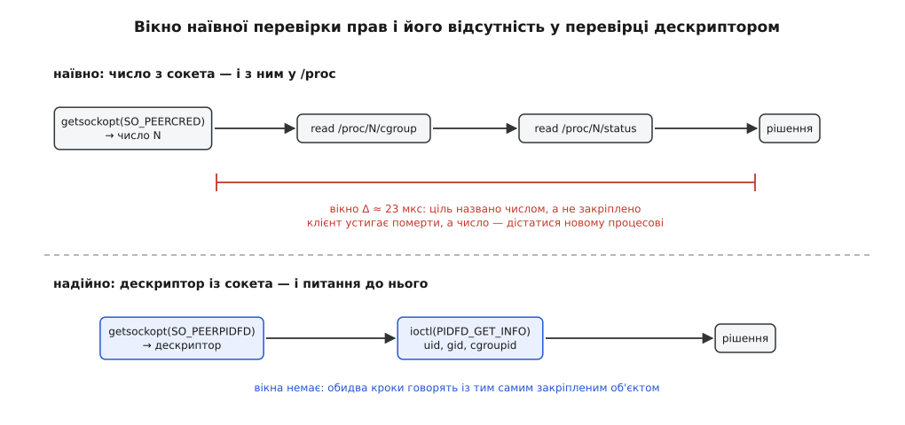

# ⚙️ Хто на тому кінці сокета

Служба чує прохання й мусить вирішити, чи виконувати його, — а для цього спершу з'ясувати, хто просить. Тут зібрано робочий сервер на C, який відповідає на це питання двічі: спершу так, як його пишуть у більшості демонів (узяти номер і піти з ним у `/proc`), з точним місцем розриву й розрахунком ширини вікна; потім так, що вікна немає зовсім.

## Умова

Служба слухає `/run/mountd.sock` — потоковий сокет домену Unix ([сокети домену Unix](root:sys-unix/unix-domain-sockets) — той самий інтерфейс сокета, але адреса є іменем у файловій системі, і ядро знає, який саме процес під'єднався з іншого боку). На кожне з'єднання вона мусить з'ясувати три речі, перш ніж робити те, чого просять:

- від імені якого користувача працює прохач;
- у якій одиниці systemd, тобто в якому cgroup, він живе — політика в нас на одиницю, а не на користувача ([cgroups](root:sys-unix/cgroups-resource-model) — дерево груп, у яких ядро обліковує й обмежує ресурси; кожен процес завжди рівно в одній групі, і саме за нею systemd відрізняє сеанс користувача від системної служби);
- чи він узагалі ще живий, бо відповідати мертвому нема кому.

Обидві версії сервера відповідають на ті самі три питання. Уся різниця — чим названо ціль між питанням і відповіддю.

## Наївний варіант

```c
/* peerauth.c — сервер, що з'ясовує, хто на іншому кінці сокета.
 * cc -O2 -Wall -o peerauth peerauth.c */
#define _GNU_SOURCE
#include <errno.h>
#include <fcntl.h>
#include <linux/pidfd.h>      /* struct pidfd_info, PIDFD_GET_INFO — ядро 6.13+ */
#include <poll.h>
#include <stdint.h>
#include <stdio.h>
#include <string.h>
#include <sys/ioctl.h>
#include <sys/socket.h>
#include <sys/un.h>
#include <unistd.h>

#ifndef SO_PEERPIDFD
#define SO_PEERPIDFD 77
#endif

struct verdict {
    uid_t uid;              /* хто просить */
    char  unit[128];        /* у якій одиниці systemd він живе */
};

static int probe_naive(int conn, struct verdict *v)
{
    struct ucred uc;
    socklen_t len = sizeof uc;
    if (getsockopt(conn, SOL_SOCKET, SO_PEERCRED, &uc, &len) < 0)
        return -1;
    v->uid = uc.uid;

    /* ↓↓↓ від цього рядка ціль названо ЧИСЛОМ і нічим більше ↓↓↓ */

    char path[64], line[512];
    v->unit[0] = '\0';

    snprintf(path, sizeof path, "/proc/%d/cgroup", uc.pid);
    FILE *f = fopen(path, "r");
    if (!f) return -1;
    while (fgets(line, sizeof line, f))
        if (!strncmp(line, "0::", 3)) {          /* cgroup v2 — рівно один рядок */
            line[strcspn(line, "\n")] = '\0';
            snprintf(v->unit, sizeof v->unit, "%s", line + 3);
        }
    fclose(f);

    snprintf(path, sizeof path, "/proc/%d/status", uc.pid);
    f = fopen(path, "r");
    if (!f) return -1;
    while (fgets(line, sizeof line, f)) {
        unsigned ruid, euid;
        if (sscanf(line, "Uid: %u %u", &ruid, &euid) == 2) {
            v->uid = euid;                       /* чинний uid — уже не з сокета */
            break;
        }
    }
    fclose(f);
    return 0;
}
```

Тут усе виглядає ретельно зробленим. Ядро назвало користувача, групу й номер — ми взяли їх у `struct ucred`, а не з чиїхось слів. Кожне відкриття перевірено, буфери обмежено, файли закрито. Саме тому такий код проходить огляд і живе роками.

## Мить, у якій число застаріває

Розрив — у рядку з коментарем. `SO_PEERCRED` віддає знімок, зафіксований ядром у мить `connect()`, і як знімок він чесний. Але далі з нього беруть **число** й ідуть із ним як з іменем. У виклику `openat("/proc/4242/cgroup")` ядро вже не знає, кого ми мали на увазі: воно виконує буквально «той, хто зараз під числом 4242», а не «той, хто до нас під'єднався». Номер процесу живе в скінченному кільці й після прибирання власника повертається в обіг ([PID і дерево процесів](root:sys-unix/pid-and-hierarchy) — ядро роздає номери по колу від `ns_last_pid` до `pid_max`, а потім починає спочатку). Це класична гонка між перевіркою й використанням ([TOCTOU](root:sf-security/toctou-race) — перевірили одну річ, а скористалися іншою, бо між двома діями світ змінився), з тією прикрою особливістю, що жодна з ланок не повертає помилки: каталог відкривається, дані в ньому справжні — просто про іншого.



*Обидва сервери роблять ту саму роботу. У верхньому між отриманням імені й рішенням є проміжок, у якому ім'я нічим не закріплене; у нижньому обидва кроки звертаються до того самого об'єкта, закріпленого ядром.*

Порахуймо, скільки цей проміжок триває і чого він вартий:

```
Ширина вікна (порядок величин, x86-64)
──────────────────────────────────────
  getsockopt(SO_PEERCRED)          ≈ 0.5 мкс   число на руках
  open+read+close /proc/N/cgroup   ≈ 8   мкс   ← вікно
  open+read+close /proc/N/status   ≈ 15  мкс   ← вікно, найдорожчий файл
                                   ─────────    у /proc: збирається з
                                Δ ≈ 23 мкс      десятка підсистем

Випадкове влучання
──────────────────
Покажчик роздачі номерів іде по колу довжиною pid_max зі
швидкістю f (створень процесів за секунду). Щоб число N
дісталося новому процесові саме в наше вікно, покажчик має
перетнути N за час Δ, тобто накрити одну позицію з pid_max:

    p ≈ f · Δ / pid_max

машина під навантаженням, pid_max за замовчуванням ядра (2¹⁵):
    f = 200 1/с   Δ = 23·10⁻⁶ с   pid_max = 32768
    p ≈ 200 · 23·10⁻⁶ / 32768 ≈ 1.4·10⁻⁷
    мільйон запитів на добу → 0.14 хибних рішень на добу,
    тобто приблизно раз на тиждень

та сама машина під systemd, який піднімає pid_max до 2²²:
    p ≈ 200 · 23·10⁻⁶ / 4194304 ≈ 1.1·10⁻⁹
    той самий мільйон запитів → раз на два з половиною роки
```

Підняття `pid_max` до 2²² — не здогад: systemd від версії 243 кладе `kernel.pid_max = 4194304` у `/usr/lib/sysctl.d/50-pid-max.conf` саме для того, щоб збіги номерів траплялися рідше. Тобто типова сучасна система вже зменшила ймовірність у сто двадцять вісім разів — і саме тому такі дірки не знаходять випробуваннями: раз на два роки не відтворюється.

А нападник узагалі не грає в лотерею. Покажчик роздачі лежить у `/proc/sys/kernel/ns_last_pid`, читати його може будь-хто (записувати — лише з `CAP_CHECKPOINT_RESTORE`), тож збіг влаштовують навмисно: дізнатися свій номер N, форкати порожні процеси, доки `ns_last_pid` не дійде до N−1, надіслати прохання й одразу вийти, а наступним викликом `fork()` запустити ту програму, яку сервер має побачити замість себе. Ніякої ймовірності — просто арифметика. Саме проти таких гонок із номером і латали `CVE-2013-4288` у polkit, після якого суб'єкт авторизації `unix-process`, що приймав голий номер, оголосили застарілим.

## Надійний варіант

```c
struct peer {
    uid_t    uid;         /* знімок миті connect() — від SO_PEERCRED */
    uid_t    euid_now;    /* чинний просто зараз — від дескриптора */
    uint64_t cgroupid;    /* ідентифікатор cgroup, не шлях */
    int      alive;
};

static int probe_pidfd(int conn, struct peer *p)
{
    struct ucred uc;
    socklen_t len = sizeof uc;
    if (getsockopt(conn, SOL_SOCKET, SO_PEERCRED, &uc, &len) < 0)
        return -1;
    p->uid = uc.uid;             /* права беремо СТАНОМ НА connect() */

    int pidfd;
    len = sizeof pidfd;
    if (getsockopt(conn, SOL_SOCKET, SO_PEERPIDFD, &pidfd, &len) < 0) {
        if (errno == ESRCH || errno == EINVAL) {   /* до 6.16 було EINVAL */
            p->alive = 0;                          /* прохача вже прибрали */
            return 0;
        }
        return -1;   /* ENOPROTOOPT — ядро до 6.5; ENODATA — не той сокет */
    }

    struct pidfd_info info = { .mask = PIDFD_INFO_CREDS | PIDFD_INFO_CGROUPID };
    int rc = ioctl(pidfd, PIDFD_GET_INFO, &info);
    int e = errno;
    close(pidfd);
    if (rc < 0) {
        if (e == ESRCH) { p->alive = 0; return 0; }
        return -1;
    }

    /* Ядро віддає лише те, що вміє, і каже про це тією самою маскою. */
    if (~info.mask & (PIDFD_INFO_CREDS | PIDFD_INFO_CGROUPID))
        return -1;

    p->euid_now = info.euid;
    p->cgroupid = info.cgroupid;
    p->alive    = 1;
    return 0;
}

/* Ідентифікатор cgroup за шляхом — раз на старті, поза гарячим шляхом. */
static uint64_t cgroup_id_of(const char *path)
{
    union {
        struct file_handle fh;
        char raw[sizeof(struct file_handle) + sizeof(uint64_t)];
    } u = { .fh = { .handle_bytes = sizeof(uint64_t) } };
    int mount_id;
    uint64_t id;

    if (name_to_handle_at(AT_FDCWD, path, &u.fh, &mount_id, 0) < 0)
        return 0;
    memcpy(&id, u.fh.f_handle, sizeof id);
    return id;
}

int main(void)
{
    const uint64_t allowed = cgroup_id_of("/sys/fs/cgroup/user.slice");
    struct sockaddr_un a = { .sun_family = AF_UNIX };
    strcpy(a.sun_path, "/run/mountd.sock");
    unlink(a.sun_path);

    int srv = socket(AF_UNIX, SOCK_STREAM | SOCK_CLOEXEC, 0);
    if (srv < 0 || bind(srv, (struct sockaddr *)&a, sizeof a) < 0
                || listen(srv, 16) < 0) {
        perror("сокет");
        return 1;
    }

    for (;;) {
        int c = accept4(srv, NULL, NULL, SOCK_CLOEXEC);
        if (c < 0) continue;

        struct peer p = { 0 };
        if (probe_pidfd(c, &p) < 0)
            dprintf(c, "тотожності не встановлено — відмова\n");
        else if (!p.alive)
            dprintf(c, "прохач уже завершився — робити нічого\n");
        else if (p.cgroupid == allowed)
            dprintf(c, "дозволено: uid=%u\n", p.uid);
        else
            dprintf(c, "відмовлено\n");
        close(c);
    }
}
```

Числа тут немає ніде — і це не стилістична охайність, а суть. `SO_PEERPIDFD` (ядро 6.5) віддає дескриптор на того, хто викликав `connect()`, а `ioctl(PIDFD_GET_INFO)` (ядро 6.13) питає **цей самий** дескриптор. Між двома викликами не лишається кроку, у якому ціль була б названа чимось, що можна перетлумачити.

`PIDFD_INFO_CGROUPID` віддає не шлях, а число — ідентифікатор вузла в `cgroupfs`. Шлях довелося б збирати з рядків, тобто знову вводити щось, що може змінитися між читанням і рішенням; число ж порівнюють з наперед відомим. Дістати його для потрібної групи можна `name_to_handle_at()` — тим самим викликом, яким беруть стійке посилання на файл ([стійке посилання на файл](root:sys-unix/file-handles) — ядро віддає непрозорий ідентифікатор, за яким об'єкт знаходять без розбору шляху); для `cgroupfs` ці вісім байтів і є ідентифікатор групи.

> 🔧 **Навіщо це.** Записуйте `cgroupid` у журнал поруч з іменем одиниці. Ім'я одиниці повторюється: перезапущена служба має те саме ім'я, а `cgroupid` — новий. Тож коли розбираєте, чому вночі стався дозвіл, ім'я показує, *що* просило, а ідентифікатор — *котрий саме запуск*, і дві події з різних запусків не зіллються в одну неіснуючу історію.

## Що робити на старших ядрах

Ядро без `SO_PEERPIDFD` (до 6.5) поверне `ENOPROTOOPT`. Тут єдиний чесний вихід — відмовити або виразно занизити довіру, а не тихо перемкнутися на число: мовчазний відкат на дірявий шлях гірший за відсутність шляху, бо в журналі виглядає однаково добре.

Проміжок 6.5–6.12 цікавіший: дескриптор уже є, а `PIDFD_GET_INFO` ще немає, тож у `/proc` доводиться йти за числом. Рятує те, що перевірку роблять **після** відкриття, а не до.

```c
/* Ядро 6.5…6.12: дескриптор є, ioctl немає. */
static int proc_dir_of(int pidfd)
{
    struct pollfd pfd = { .fd = pidfd, .events = POLLIN };
    char path[64], line[128];
    int pid = -1, dir;

    if (poll(&pfd, 1, 0) != 0)          /* уже мертвий — далі нема про що */
        return -1;

    snprintf(path, sizeof path, "/proc/self/fdinfo/%d", pidfd);
    FILE *f = fopen(path, "r");
    if (!f) return -1;
    while (fgets(line, sizeof line, f))
        if (sscanf(line, "Pid: %d", &pid) == 1)   /* −1 мертвий, 0 не видно */
            break;
    fclose(f);
    if (pid <= 0) return -1;

    snprintf(path, sizeof path, "/proc/%d", pid);
    dir = open(path, O_DIRECTORY | O_PATH | O_CLOEXEC);
    if (dir < 0) return -1;

    /* Дескриптор стає читабельним, щойно ціль вийшла, — тобто ЩЕ ДО того,
     * як її прибрали й номер міг комусь дістатися. Він і досі мовчить,
     * отже, номер весь цей час належав тому самому процесові,
     * отже, відкритий каталог — його. */
    if (poll(&pfd, 1, 0) != 0) { close(dir); return -1; }
    return dir;
}
```

Далі з `dir` працюють через `openat(dir, "cgroup", …)`, і жоден наступний крок числа вже не торкається. Прийом загальний: коли гонку не можна усунути, її можна **виявити** — узяти закріплене посилання, зробити роботу, а тоді спитати посилання, чи нічого не змінилося.

## Пастки

**Номер, який назвав сам клієнт, — не доказ.** Протокол, у якому прохач надсилає свій PID у тілі повідомлення, не перевіряє нічого: число вибирає той, кого перевіряють. Єдиний надійний свідок — ядро, і питати треба сокет, а не співрозмовника.

**Дескриптор — це відповідь на «хто», а не дозвіл на «можна».** У Linux pidfd не є повноваженням: він безпомилково називає процес, але жодних прав не надає й не переносить. Рішення ухвалює ваша політика, і його не можна замінити фактом, що дескриптор у вас на руках.

**Права беруть із моменту прохання, а не з «зараз».** У прикладі `p.uid` приходить із `SO_PEERCRED`, тобто станом на `connect()`, а `p.euid_now` — із дескриптора, тобто станом на цю мить, і це різні відповіді на різні питання. Процес може після з'єднання виконати `exec` файла з бітом підвищення прав ([setuid і підвищення прав](root:sys-unix/setuid-and-privilege) — виконання такого файла міняє чинного власника процесу на власника файла) і стати від того root, лишившись тим самим процесом із тим самим номером і тим самим дескриптором. Саме це, а не повторне використання номера, і було головним у polkit-івській дірці. Авторизуйте за знімком; чинні права дивіться хіба що для журналу.

**Мертвий прохач — звичайна гілка, а не збій.** `SO_PEERPIDFD` на вже прибраному клієнті повертає `EINVAL` до ядра 6.16 і `ESRCH` починаючи з нього; `PIDFD_GET_INFO` на прибраній цілі повертає `ESRCH`, якщо ви не просили `PIDFD_INFO_EXIT`. На зміні коду помилки свого часу спіткнувся `dbus-broker`, який перевіряв лише `EINVAL` і на ядрі 6.16 перестав розпізнавати цей випадок. Перевіряйте обидва й обробляйте це як «нема кому відповідати», а не як помилку.

**Маску відповіді треба перевіряти.** `PIDFD_GET_INFO` заповнює лише те, що вміє це ядро, і повідомляє про це тією самою маскою, яку ви подали. Не звірити її — значить прийняти рішення на нулях у полях, яких вам не дали. Розмір структури ядро бере з номера самої команди, тому свіжі заголовки на старому ядрі виклик не ламають — саме тому маска і є єдиним чесним джерелом про те, що ви справді отримали.

**Через межу просторів імен числа не працюють зовсім.** Якщо клієнт в іншому просторі імен процесів ([простори імен](root:sys-unix/namespaces) — ізольовані погляди на систему, у яких те саме число називає різні процеси), наївний шлях не просто ризикує — він **гарантовано** читає `/proc` про чужий процес зі своєї сторони межі. Дескриптор межі не має; поля `pid` і `tgid` у відповіді ядро перекладає у ваш простір і повертає `ESRCH`, коли перекласти нема як, а `uid`/`gid` перекладає у ваш простір користувачів і віддає `65534`, коли відповідника немає. Обидва випадки означають «не можу назвати», а не «нікому не можна» — розрізняйте їх у політиці.

**Ідентифікатор cgroup не є шляхом.** Зворотне перетворення робить `open_by_handle_at()`, і воно потребує `CAP_DAC_READ_SEARCH`; без цього права `ss -tulpne` показує «Failed to open cgroup2 by ID» замість імені одиниці. Для перевірки прав це не завада — порівнюйте числа з тими, що ви самі здобули на старті, — але для читаного журналу тримайте власну табличку «ідентифікатор → ім'я», а не сподівайтеся розкрити його з рядка.
