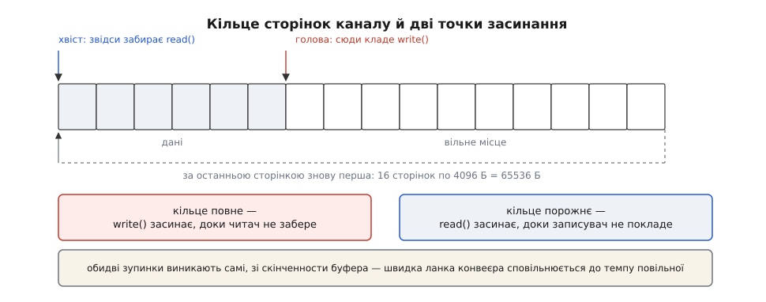
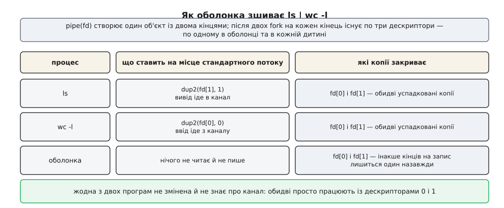
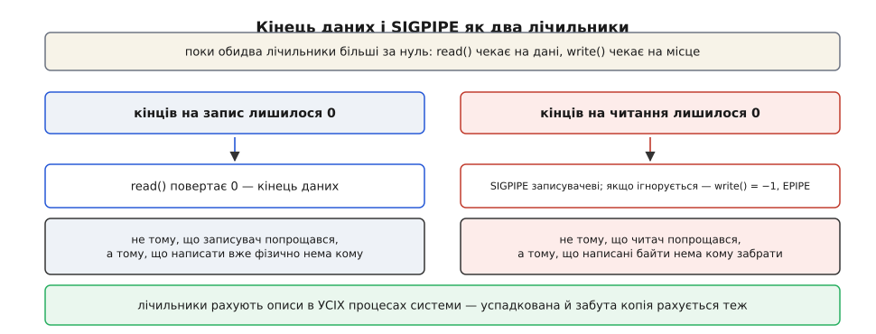
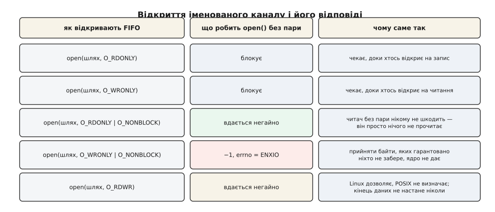

# Канали й іменовані канали

<preknowlist>
- [Файловий дескриптор](root:sys-unix/file-descriptor) — маленьке число, яким процес називає ядру вже відкритий об'єкт вводу-виводу.
- [Опис відкритого файлу](root:sys-unix/open-file-description) — структура в ядрі за дескриптором; кілька дескрипторів у різних процесах можуть указувати на один опис, і ядро рахує, скільки їх лишилося.
- [fork](root:sys-unix/fork-semantics) — дитина дістає копію таблиці дескрипторів батька, але самі описи лишаються спільними.
- [exec](root:sys-unix/exec-semantics) — заміна образу програми, при якій відкриті дескриптори переживають виклик.
- [«Усе є файлом»](root:sys-unix/everything-is-a-file) — один набір викликів `read`/`write`/`close` на об'єкти геть різної природи.
- [Блокуючий і неблокуючий режим](root:sys-unix/blocking-and-nonblocking) — що фізично означає «виклик чекає» і що змінює прапорець `O_NONBLOCK`.
- [Сигнал](root:sys-unix/signal-model) — асинхронне сповіщення від ядра до процесу, у якого є типова дія.
- [Inode](root:sys-unix/inode-model) — файл як об'єкт із типом і правами, окремо від імені в каталозі.
</preknowlist>

Є програма, яка видає рядки, і програма, яка ці рядки перебирає. Написані вони окремо, жодна не знає про існування другої, і переробляти їх не хочеться. Треба лише, щоб те, що виходить з першої, потрапляло до другої.

Найпростіший спосіб — через тимчасовий файл: перша пише, друга потім читає. Спосіб працює й коштує три речі. Друга програма не починає, доки перша не скінчила — жодної одночасности, хоч би скільки ядер було вільно. Увесь проміжний обсяг лягає на носій, хай це будуть гігабайти, з яких завтра не знадобиться жоден байт. І хтось мусить домовитися про ім'я файлу, а потім прибрати за собою — а якщо не прибере, сміття лишиться назавжди.

Придивімося, чого тут бракує насправді. Перша програма вже вміє писати: вона кладе байти в дескриптор 1 і не питає, куди він веде. Друга вже вміє читати з дескриптора 0. Отже, не бракує нічого, крім самого приймача — об'єкта, у який одна пише, а друга читає, і який живе рівно стільки, скільки триває розмова. Не сховища — просто тримача байтів між двома кінцями.

Саме такий об'єкт у Unix і зветься каналом (англ. *pipe* — труба).

## Труба з двома кінцями

Канал створюють одним викликом, і повертає він одразу два дескриптори:

```c
#include <unistd.h>

int fd[2];
if (pipe(fd) == -1)
    return -1;               /* канал не створено */

/* fd[0] — кінець на читання, fd[1] — кінець на запис */
```

Обидва числа вказують на один і той самий об'єкт у ядрі, але з різних боків: у `fd[1]` тільки пишуть, з `fd[0]` тільки читають. Спроба зробити навпаки повертає `EBADF` — напрямок вибрано раз і назавжди при створенні.

Усередині цей об'єкт — кільце сторінок пам'яті ядра. У Linux, починаючи з версії 2.6.11, типова ємність — 16 сторінок, тобто 65 536 байтів при звичайній сторінці в 4 КіБ; до того канал мав рівно одну сторінку. Записувач додає байти в голову, читач забирає з хвоста, і прочитаний байт зникає назавжди: другого разу його не візьме ніхто. Це не буфер із позицією, у який можна повернутися — `lseek` на каналі повертає `ESPIPE`, бо повертатися нема куди ([кільцевий буфер](root:sf-algorithms/ring-buffer) — сховище сталого розміру, де голова й хвіст ганяються одне за одним по колу, а «повний» і «порожній» відрізняються лічильником).



*Ємність каналу скінченна, тому обидва кінці мають, де зупинитися: записувач — на повному кільці, читач — на порожньому.*

І ще одна властивість, яка спершу видається дрібницею, а насправді визначає все подальше: у цього об'єкта **немає імені**. Він не лежить у жодному каталозі, його не можна відкрити за шляхом, його взагалі неможливо знайти — навіть знаючи про нього все. Він створюється дією, а не пошуком, і єдиний доступ до нього — дескриптор, який `pipe` щойно поклав вам у руки. Формально він таки має inode — у внутрішній файловій системі `pipefs`, невидимій ззовні ([псевдо-файлові системи](root:sys-unix/pseudo-filesystems) — файлові системи, які нічого не зберігають, а лише дають ядерним об'єктам вигляд файлів), — але жодного імені, за яким цей inode можна відкрити, не існує.

Звідси випливає питання, з якого починається вся механіка: якщо другий процес не може попросити канал за іменем, як він взагалі його дістане?

## Як другий процес дістає той самий канал

Відповідь одна: канал не передають — його **успадковують**.

`fork` віддає дитині копію таблиці дескрипторів. Копіюються самі числа, а описи відкритих файлів, на які вони вказують, лишаються спільними. Тому одразу після `fork` обидва процеси тримають той самий канал: у батька `fd[0]` і `fd[1]`, у дитини — теж `fd[0]` і `fd[1]`, і всі чотири дескриптори вказують на два кінці одного кільця.

Далі кожна сторона позбувається зайвого кінця, і на цьому розподіл ролей закінчено: хто пише — закриває `fd[0]`, хто читає — закриває `fd[1]`.

Лишається останній крок, і саме він робить канали тим, чим вони є. Програми `ls` і `wc` нічого не знають про канали; вони пишуть у дескриптор 1 і читають з дескриптора 0. Отже, потрібний кінець треба **поставити на місце стандартного потоку** — це робить `dup2`, який копіює дескриптор під заздалегідь заданим номером ([перенаправлення як робота з дескрипторами](root:sys-unix/redirection-model) — `dup2(fd, 1)` закриває старий дескриптор 1 і робить його другим іменем для `fd`; саме цим оболонка виконує і `>`, і `|`). Після цього `exec` заміняє образ програми, а таблиця дескрипторів переїзд переживає — і нова програма прокидається з каналом там, де очікує побачити термінал.



*Кожен процес після fork має власні копії обох кінців; працює конвеєр лише тоді, коли всі зайві копії закрито.*

Так виглядає весь механізм за рядком `ls | wc -l`: оболонка створює канал, двічі робить `fork`, у кожній дитині ставить потрібний кінець на місце стандартного потоку через `dup2`, закриває решту копій і робить `exec`. Ані `ls`, ані `wc` не змінено жодним рядком — і в цьому вся суть. Композиція програм тримається не на спільній бібліотеці й не на домовленості між авторами, а на тому, що обидві сторони працюють з дескриптором і не питають, що за ним ([конвеєр як композиція процесів](root:sys-unix/pipeline-composition) — чому оболонка запускає всі ланки одночасно, а не по черзі, і хто чекає на чий код виходу). Покроково зібраний уручну конвеєр, з тими самими викликами й з навмисно зробленою помилкою, розібрано окремо ([конвеєр власними руками](root:sys-unix/pipe-and-fifo/proj-pipeline-by-hand.md) — `pipe`, `fork`, `dup2`, `exec` у робочому коді, а далі те саме з одним забутим `close`, щоб побачити зависання на власні очі).

## Кінець даних — це лічильник, а не подія

Тепер найважливіший наслідок безіменности. Читач мусить якось дізнаватися, що даних більше не буде — інакше він чекатиме вічно. Файл має розмір, і кінець файлу очевидний; у каналу розміру немає. Що ж тоді означає «кінець»?

Ядро рахує, скільки описів на кожен кінець лишилося відкритими, і саме ці два лічильники дають усі граничні відповіді.

**Кінців на запис лишилося нуль** — читач дістає `read` == 0, тобто кінець даних. Не тому, що записувач «сказав, що скінчив», а тому, що більше нікому фізично нема чим написати: усі дескриптори на запис у всіх процесах системи закрито.

**Кінців на читання лишилося нуль** — записувачеві надсилається сигнал `SIGPIPE`, а якщо той сигнал заблоковано або ігнорується, `write` повертає −1 з `EPIPE`. Знову ж таки не тому, що читач «попрощався», а тому, що байти нема кому забрати.



*Кінець даних і SIGPIPE — не події, які хтось надсилає, а два наслідки того, що лічильник дійшов до нуля.*

Звідси випливає правило, на якому спотикається кожен, хто пише свій перший конвеєр: **зайві копії кінця треба закривати, і закривати всі**. Якщо оболонка створила канал, зробила `fork` і забула закрити власну копію `fd[1]`, то кінців на запис лишається один — її власний — навіть після того, як `ls` завершиться. Лічильник до нуля не дійде, `wc` не побачить кінця даних і чекатиме до кінця світу. Помилка тим підступніша, що видима частина коду виглядає бездоганно: канал є, дані течуть, обидві програми правильні. Зависає конвеєр через дескриптор, про який ніхто не згадував ([взаємне блокування](root:sf-tasks/deadlock) — кожен учасник чекає на дію, яку може зробити лише інший).

> 🔧 **Навіщо це.** Конвеєр, що завис і не їсть процесора, майже завжди зупинився саме тут. Подивіться `ls -l /proc/<pid>/fd` для всіх ланок і для оболонки чи служби, що їх запустила: якщо той самий канал (у виводі це `pipe:[12345]`) відкрито ще й у процесі, який до передачі даних не причетний, — ось він, зайвий кінець. Той самий номер каналу в кількох процесах — найшвидший спосіб побачити, хто саме тримає лічильник ненульовим. Прапорець `FD_CLOEXEC` рятує від половини таких випадків: дескриптор із ним не переживає `exec`, тож у чужу програму він не заповзе.

## Повний буфер і мертвий читач

Кільце скінченне, і це не вада, а другий інструмент.

Коли записувач заповнив канал, а читач не встигає забирати, `write` не має куди класти байти й засинає, доки місце не звільниться. Ефект з цього виходить точно такий, який потрібен: **швидка ланка конвеєра сама сповільнюється до темпу повільної**. Ніхто цим не керує, ніхто не міряє швидкостей — межа виникає з самої скінченности буфера ([керування потоком](root:com-transport/flow-control) — загальний принцип, за яким приймач стримує відправника; тут його роль виконує повне кільце). Саме тому `zcat велике.gz | grep щось` не з'їдає пам'ять: розпакувальник просто зупиняється щоразу, коли `grep` відстає ([протитиск](root:sf-tasks/backpressure-local) — передавати сигнал перевантаження назад до джерела замість того, щоб буферувати без кінця).

Дзеркальна ситуація — читач помер або більше не хоче слухати — розв'язується так само рішуче. `head -5` бере п'ять рядків і закриває свій кінець; наступний `write` того, хто пише в канал, наражається на `SIGPIPE`, а типова дія цього сигналу — завершити процес. Тому `yes | head -5` не крутиться вічно, хоч `yes` за задумом нескінченний: він гине від сигналу, і це нормальний, запланований спосіб завершення ланки конвеєра, а не аварія.

Обидві сторони цієї механіки треба тримати в голові, коли пишете власну програму, яка пише в канал. Якщо `SIGPIPE` не ігнорувати, програма тихо помре посеред роботи там, де ви цього не чекали (класика — служба, яка пише в закритий сокет; на сокетах діє те саме правило). Якщо ігнорувати — обов'язково обробіть `EPIPE`, інакше цикл запису крутитиметься на помилці, якої ніхто не читає ([диспозиція сигналу](root:sys-unix/signal-disposition) — три можливі долі сигналу: типова дія, ігнорування, власний обробник).

## Потік без меж і острівець неподільности

Канал передає байти й нічого, крім байтів. Він не знає ні про рядки, ні про повідомлення, ні про записи: сто викликів `write` по десять байтів і один виклик на тисячу байтів дають на іншому кінці однаковий потік, і жодним способом їх не розрізнити. Якщо вашому протоколові потрібні межі повідомлень, їх доводиться вигадувати самому — довжиною наперед або роздільником ([розмежування повідомлень у байтовому потоці](root:com-protocol/tcp-message-framing) — той самий клопіт і ті самі два способи, що й у TCP).

Але одну гарантію ядро таки дає, і вона рятує цілий клас програм. Запис розміром **не більше за `PIPE_BUF`** потрапляє в канал суцільним шматком: він або лягає весь, або чекає, доки звільниться місце на весь, — але ніколи не перемішується з чужим записом. У Linux `PIPE_BUF` дорівнює 4096 байтам; POSIX вимагає щонайменше 512, тож переносний код орієнтується на менше число.

Ось навіщо ця гарантія потрібна на практиці:

**Десять процесів пишуть рядки журналу в один канал, який читає збирач.**

```
рядок журналу              = 200 Б   ≤ PIPE_BUF (4096) → неподільний
один write на рядок цілком            → рядки чергуються, але не ріжуться

рядок із дампом            = 9000 Б  > PIPE_BUF        → ділиться на шматки
                                       між шматками може вклинитись чужий запис
```

Правило звідси просте й жорстке: **один запис — один виклик `write`, і не більший за `PIPE_BUF`**. Порушується воно найчастіше не свідомо, а через буферизацію бібліотеки: `printf` кладе байти у власний буфер stdio й віддає їх ядру тоді, коли вважає за потрібне, розрізаючи ваш рядок у довільному місці ([буферизація stdio](root:sys-unix/stdio-buffering) — чому та сама програма поводиться інакше, коли її вивід іде в канал, а не на термінал: у каналі буфер стає поблоковим).

## Скільки буфера й чому це важить

Ємність каналу можна змінити: `fcntl(fd, F_GETPIPE_SZ)` показує поточну, `fcntl(fd, F_SETPIPE_SZ, n)` задає нову. Непривілейований процес обмежений зверху значенням `/proc/sys/fs/pipe-max-size` — типово 1 МіБ; сумарний обсяг усіх каналів одного користувача обмежує `/proc/sys/fs/pipe-user-pages-soft` ([sysctl](root:sys-unix/sysctl-tunables) — параметри ядра, які читають і крутять на ходу).

Що саме купують за цю пам'ять, найкраще видно, коли перевести ємність у час:

**Скільки читач може відставати, не зупиняючи записувача.**

```
ємність каналу (типова)    = 65536 Б
темп записувача            = 100 МіБ/с = 104 857 600 Б/с
запас часу                 = 65536 / 104857600 ≈ 0.000625 с ≈ 625 мкс

ємність, піднята до 1 МіБ  = 1048576 Б
запас часу                 = 1048576 / 104857600 = 0.01 с = 10 мс
```

Отже, ємність каналу — це **час, на який ланки конвеєра можуть розійтися**, не спиняючи одна одну. Читач, який раз на кілька мілісекунд відволікається на щось інше, на типовому каналі гальмуватиме записувача, а на мегабайтному — ні. Плата — пам'ять ядра, яку канал може зайняти під зав'язку: сторінки ядро бере в міру наповнення, але на квоту користувача вся замовлена ємність лягає одразу, і в `RSS` жодного процесу вона не видна. Друга плата — той самий запас часу, обернений на затримку: байт, записаний у великий канал, дійде до читача не раніше, ніж той дочитає все попереднє. Для інтерактивної передачі це погано, для перекачування великих обсягів — добре.

Є ще одна причина, чому канал влаштований саме як кільце сторінок, а не як суцільний масив байтів. Оскільки вміст каналу — це сторінки, ядро вміє переставляти між каналом і файлом чи сокетом самі **посилання на сторінки**, не копіюючи вміст. Через це канал став обов'язковим посередником у механізмі передавання без копіювання: `splice` працює лише тоді, коли принаймні один з його кінців — канал ([передача без копіювання](root:sys-unix/zero-copy) — `sendfile`, `splice` і `vmsplice`: чому дані взагалі не мусять заходити в простір користувача).

> 🔧 **Навіщо це.** Коли конвеєр працює повільніше, ніж мала б найповільніша його ланка, спершу подивіться на розмір блоку, яким кожна ланка читає й пише: тисяча системних викликів по 64 байти коштує дорожче за один на 64 КіБ, і жодне збільшення ємности каналу цього не виправить. Ємність варто чіпати вже потім і лише тоді, коли ланки справді працюють ривками — наприклад, читач періодично надовго відходить обробляти накопичене.

## Дати каналу ім'я

Усе описане має одну межу: спільний канал дістається лише **спорідненим** процесам, бо єдиний шлях до нього — успадкування від батька. Два процеси, запущені незалежно, спільного предка з потрібним дескриптором не мають — і зустрітися не можуть.

Розв'язання очевидне рівно настільки, наскільки очевидна причина: якщо проблема в тому, що об'єкт безіменний, дамо йому ім'я.

```c
#include <sys/stat.h>
#include <errno.h>

if (mkfifo("/tmp/commands", 0600) == -1 && errno != EEXIST)
    return -1;               /* запису в каталозі створити не вдалося */
```

`mkfifo` створює в каталозі запис із inode особливого типу — FIFO (англ. *first in, first out* — «першим прийшов, першим вийшов»). Такий канал звуть іменованим. Далі його відкривають звичайним `open` за шляхом, і після цього він поводиться точно як безіменний: те саме кільце сторінок, той самий `PIPE_BUF`, той самий `SIGPIPE`, ті самі лічильники кінців.

Головне тут — зрозуміти, чим саме є цей запис у каталозі. Це **не файл із даними**. Байти, що течуть крізь іменований канал, не торкаються носія жодного разу: вони лежать у тих самих сторінках пам'яті ядра, а `ls -l` завжди показує розмір 0, скільки б через нього не пройшло. Ім'я тут — не сховище, а **місце зустрічі**: рядок, за яким два незнайомі процеси можуть знайти один і той самий об'єкт у ядрі. Права на цьому записі теж справжні й перевіряються при відкритті — тобто ім'я приносить із собою і звичайну модель доступу.

Через це «місце зустрічі» з'являється єдина справжня відмінність від безіменного каналу — **поведінка `open`**. Канал не має сенсу з одним кінцем, тому відкриття блокується, доки не з'явиться пара: `open` на читання чекає, поки хтось відкриє на запис, і навпаки. Ця зустріч і є синхронізацією; вона трапляється рівно один раз, на відкритті, і саме на ній найчастіше зависають програми, які її не очікували.



*Блокуюче відкриття чекає на пару; з O_NONBLOCK читач заходить одразу, а записувач без читача дістає ENXIO; O_RDWR заходить завжди — але кінця даних після нього не буде.*

`O_NONBLOCK` розводить ці випадки несиметрично, і несиметрія має причину. Відкриття **на читання** з цим прапорцем вдається негайно: читач, у якого ще нема співрозмовника, нікому не шкодить — він просто нічого не прочитає. Відкриття **на запис** без жодного читача натомість одразу провалюється з `ENXIO`: дозволити його означало б прийняти байти, яких гарантовано ніхто не забере.

Є ще третій спосіб — відкрити FIFO з `O_RDWR`. У Linux це вдається завжди й ніколи не блокує, тому прийом популярний; POSIX такої поведінки не визначає, тож переносність тут закінчується. Але важливіша не переносність, а побічний ефект: такий дескриптор сам тримає кінець на запис відкритим, отже лічильник записувачів ніколи не дійде до нуля й читач **ніколи не побачить кінця даних**. Іноді саме цього й хочуть — щоб служба, яка читає канал команд, не отримувала кінець файлу щоразу, коли черговий клієнт від'єднався. Але це свідомий вибір, а не спосіб позбутися блокування на відкритті. Точний перелік викликів, прапорців і кодів помилок для обох різновидів каналу зібрано окремо ([канал і FIFO: контракт](root:sys-unix/pipe-and-fifo/api-pipe-fifo.md) — `pipe`, `pipe2`, `mkfifo`, `mkfifoat`, прапорці, операції `fcntl` над ємністю, повна таблиця відповідей `open` на FIFO й усі коди помилок `read` і `write`).

## Де іменований канал закінчується

Ім'я знімає обмеження на спорідненість — і на цьому вичерпує свою силу. Далі починається територія, де іменований канал уже не підходить, і межу цю варто знати наперед, бо виявляється вона зазвичай пізно.

**Напрямок і досі один.** Двобічна розмова потребує двох FIFO, і кожен, хто це робив, стикався з блокуванням на відкритті в неправильному порядку: обидві сторони відкривають свій «на читання» першим і чекають одна на одну.

**Клієнтів не розрізнити.** Якщо в один іменований канал пишуть п'ятеро, читач дістає перемішаний потік і не має жодного способу дізнатися, від кого який шматок — окрім як домовитися вкласти відправника в самі дані. Відповісти конкретному клієнтові теж нема куди: канал не має зворотної адреси.

**Читачі не отримують копій.** Якщо той самий FIFO читають двоє, вони не бачать однакових даних — вони **розбирають** потік: кожен байт дістанеться комусь одному. Це черга, а не розсилка ([змагальні споживачі](root:sf-distributed/competing-consumers) — коли кілька читачів розбирають спільну чергу й кожне повідомлення обробляє рівно один).

**Кінець даних приходить після кожного клієнта.** Коли останній записувач закриває свій кінець, читач отримує `read` == 0 — і далі отримуватиме той самий нуль негайно, скільки б разів не питав, доки не з'явиться новий записувач. Чекати нема на чому: цикл «читати, доки більше нуля» перетворюється на порожнє крутіння процесора. Тому служба, яка читає FIFO, неминуче має цикл «читати до кінця даних — перевідкрити»: саме повторний `open` знову блокує до появи наступного клієнта. Виняток один — тримати власний кінець на запис відкритим, і тоді кінця даних не буде взагалі.

**І межа машини.** Ім'я лежить у файловій системі, а об'єкт — у пам'яті ядра. Тому FIFO на змонтованій мережевій файловій системі поєднає лише процеси **на одному вузлі**: віддалені побачать той самий запис у каталозі, але кожен матиме своє власне кільце.

Кожне з цих обмежень знімає наступний за складністю засіб — сокет домену Unix: він двобічний, розрізняє з'єднання, дає межі повідомлень у режимі датаграм і навіть уміє передавати сусідньому процесові відкриті дескриптори ([сокети домену Unix](root:sys-unix/unix-domain-sockets) — те саме локальне спілкування, але з адресуванням, окремим з'єднанням на клієнта й передачею дескрипторів). Ціна — складніший код: замість `open` і `read` там `socket`, `bind`, `listen`, `accept`.

Тому вибір між ними не про смак і не про сучасність. Канал робить рівно одну річ — з'єднує **вихід одного з входом одного** — і саме через цю вузькість він поміщається в один символ `|` і не вимагає від програм знати геть нічого. Історія цієї вузькости варта окремої розповіді ([як народився канал](root:sys-unix/pipe-and-fifo/hist-pipe-birth.md): службова записка Дуґа Макілроя 1964 року про програми, з'єднані як садові шланги, реалізація Кена Томпсона за один вечір на зламі 1972-го й 1973-го, незграбний перший синтаксис `>` у третій редакції Unix і поява іменованих каналів аж у System III 1982 року).

А глибша річ, яку канал показує наочніше за будь-який інший об'єкт ядра, — це те, що дескриптор не просто називає ресурс, а **тримає** його. Кінець даних, `SIGPIPE`, зупинка швидкої ланки — жодне з цих явищ ніхто не надсилає й не оголошує; усі три є лічильником посилань, який став видимим ззовні. Тому «закрити зайвий дескриптор» у роботі з каналами — не гігієна, а частина протоколу.
