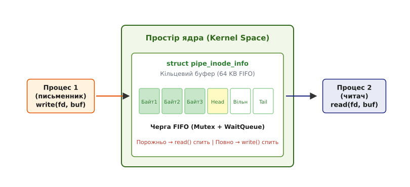
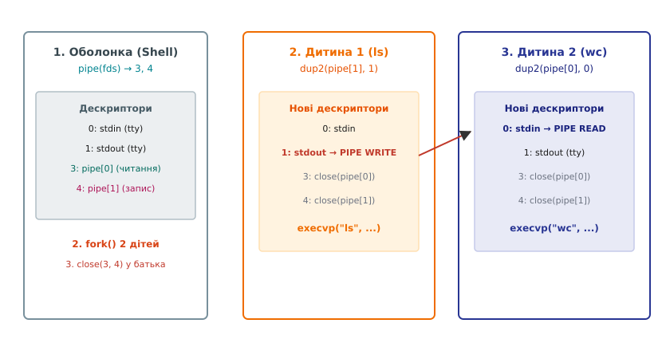
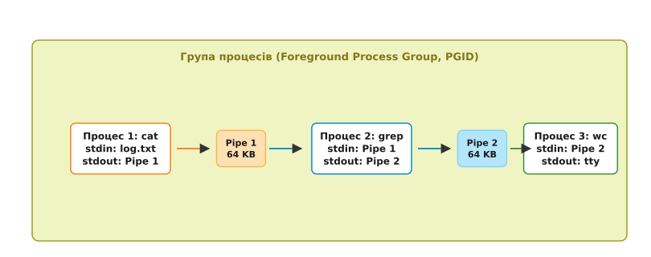

# Конвеєр: композиція процесів та міжпроцесні потоки даних

<preknowlist>
- [Модель перенаправлення](root:sys-unix/redirection-model) — відкриття файлів, дублювання дескрипторів та зв'язок таблиць процесів і ядра.
- [Стандартні потоки](root:sys-unix/standard-streams) — призначення дескрипторів 0 (stdin), 1 (stdout) та 2 (stderr).
- [Керування завданнями](root:sys-unix/job-control) — групи процесів, сесії та передній край (foreground) термінала.
</preknowlist>

За замовчуванням кожен процес в операційній системі живе в абсолютній ізоляції: він має власний віртуальний адресний простір, власну таблицю файлових дескрипторів та власні регістри процесора. Якщо для вирішення прикладної задачі потрібно послідовно застосувати п'ять різних алгоритмів обробки, найпростішим шляхом здається написання єдиної монолітної програми. Проте такий підхід вимагає постійного переписання коду під кожну нову комбінацію вимог.

Альтернативою є збереження проміжних результатів обробки на диск у тимчасові файли. Перша програма зчитує вхідний файл і записує результат у тимчасовий документ `/tmp/step1.txt`. Друга програма зчитує `/tmp/step1.txt` і створює `/tmp/step2.txt`. Подібний підхід створює важкі накладні витрати: кожна операція вимагає звернення до файлової системи, виділення дискових блоків, оновлення індексних вузлів (inodes) та очищення тимчасових файлів у разі збоїв.

Конвеєр (pipeline) Unix вирішує цю проблему, з'єднуючи стандартний вивід одного процесу зі стандартним входом іншого напряму в оперативній пам'яті через кільцевий буфер ядра. Операційна система перетворює два ізольовані процеси на єдину обчислювальну систему, де дані передаються у вигляді неперервного потоку байтів без проміжних файлів і дискового вводу-виводу.

---

## Першопричини та фізика потокового з'єднання

Базовою абстракцією операційної системи Unix для обміну даними є безструктурний потік байтів. Програмі, що читає зі стандартного входу (дескриптор 0), абсолютно байдуже, звідки надходять дані: з клавіатури термінала, з текстового файлу на SSD-накопичувачі чи з мережевого сокета. Аналогічно, програма, що пише у стандартний вивід (дескриптор 1), не знає і не повинна знати, куди саме потраплять виведені байти.

Ця властивість називається **взаємозамінністю потоків** (stream anonymity). Якщо підмінити дескриптор 1 першого процесу та дескриптор 0 другого процесу так, щоб вони вказували на спільний канал пам'яті у ядрі, програми почнуть співпрацювати без жодних змін у своєму вихідному коді.

Детальний опис того, як виникла ця концепція та як Дуг Макілрой переконав розробників Unix відмовитися від тимчасових файлів, наведено у матеріалі [📜 Виникнення концепції конвеєрів: записка Дуга Макілроя та народження pipe в Unix](root:sys-unix/pipeline-composition/hist-mcilroy-pipe.md).

---

## Анатомія каналу в ядрі Linux: `struct pipe_inode_info`

З точки зору ядра Linux, канал (pipe) — це специфічний об'єкт файлової системи, який живе виключно в оперативній пам'яті. Він не має запису в дереві каталогів (абсолютного шляху) і зникає одразу після закриття всіх файлових дескрипторів, що на нього посилаються.

Канал реалізований як кільцевий буфер (ring buffer), сформований з масиву сторінок пам'яті (`struct pipe_buffer`). У сучасному ядрі Linux буфер каналу за замовчуванням складається з 16 сторінок пам'яті. При стандартному розмірі сторінки 4096 байт (4 KB) на архітектурах x86-64 та ARM64 загальна ємність буфера каналу складає 65536 байт (64 KB).


*Кільцевий буфер каналу у просторі ядра: процес-письменник наповнює сторінки FIFO-черги через write(), а процес-читач вибирає байти через read().*

Ядро підтримує два основних індекси всередині структури `pipe_inode_info`:
- **`head`** — вказівник на позицію в буфері, куди буде записано наступний байт від процесу-письменника.
- **`tail`** — вказівник на позицію в буфері, звідки буде прочитано наступний байт процесом-читачем.

Коли процес викликає `write(fd_write, buf, count)`, ядро копіює байти з адресного простору користувача у поточну сторінку кільцевого буфера і зміщує індекс `head`. Коли інший процес викликає `read(fd_read, buf, count)`, ядро копіює байти з буфера ядра в буфер користувача і зміщує індекс `tail`.

### Синхронізація та неблокуючі режими

Буфер каналу працює за принципом FIFO (First-In, First-Out). Оскільки оперативна пам'ять обмежена, ядро забезпечує точну двосторонню синхронізацію:

1. **Порожній буфер (`head == tail`):** Якщо процес-читач викликає `read()`, а в буфері немає жодного байта, ядро не повертає 0 (це означало б EOF). Замість цього ядро переводить потік читача у стан сну (`TASK_INTERRUPTIBLE`) і додає його до черги очікування `pipe->wait`. Процес буде розбуджений лише тоді, коли процес-письменник запише хоча б один байт.
2. **Повний буфер (`head - tail == capacity`):** Якщо процес-письменник викликає `write()`, а буфер заповнений до межі 64 KB, ядро блокує процес-письменник. Він спатиме доти, доки читач не забере частину даних через `read()` і не звільнить місце у буфері.

Цей механізм автоматично регулює швидкість виконання двох програм. Якщо перший процес (наприклад, генератор логів) працює набагато швидше за другий (аналізатор логів), ядро призупиняє генератор при досягненні межі 64 KB, не дозволяючи йому вичерпати оперативну пам'яті системи.

---

## Системний виклик `pipe()` та створення файлових дескрипторів

Для створення нового каналу програма звертається до ядра за допомогою системного виклику `pipe()` або його розширеної версії `pipe2()`.

:::tabs
```c
#define _GNU_SOURCE
#include <stdio.h>
#include <stdlib.h>
#include <unistd.h>
#include <fcntl.h>

int create_basic_pipe(void) {
    int fds[2];
    
    // Створюємо канал: fds[0] - читання, fds[1] - запис
    if (pipe(fds) == -1) {
        perror("pipe failed");
        return -1;
    }
    
    printf("Read FD: %d, Write FD: %d\n", fds[0], fds[1]);
    return 0;
}
```
```cpp
#include <iostream>
#include <array>
#include <system_error>
#include <unistd.h>
#include <fcntl.h>

std::array<int, 2> create_cpp_pipe() {
    std::array<int, 2> fds{-1, -1};
    if (::pipe2(fds.data(), O_CLOEXEC) == -1) {
        throw std::system_error(errno, std::generic_category(), "pipe2 failed");
    }
    std::cout << "Read FD: " << fds[0] << ", Write FD: " << fds[1] << "\n";
    return fds;
}
```
:::

У разі успіху ядро створює новий об'єкт `struct pipe_inode_info`, виділяє для нього сторінки пам'яті і додає два нових записи до таблиці файлових дескрипторів поточного процесу:
- **`fds[0]`** відкритий виключно на **зчитування** (`O_RDONLY`).
- **`fds[1]`** відкритий виключно на **запис** (`O_WRONLY`).

Обидва дескриптори посилаються на той самий анонімний індексний вузол у віртуальній файловій системі (VFS). Повний перелік прапорців `O_CLOEXEC`, `O_NONBLOCK`, системних лімітів та викликів `fcntl(F_SETPIPE_SZ)` міститься у довіднику [📋 Системний інтерфейс каналів та маніпуляції файловими дескрипторами](root:sys-unix/pipeline-composition/api-pipe-syscalls.md).

---

## Побудова конвеєра: `pipe()`, `fork()`, `dup2()` та `exec()`

Створення каналу в межах одного процесу рідко має практичний сенс: якщо той самий процес буде писати у `fds[1]` і читати з `fds[0]`, він швидко переповнить буфер і заблокує сам себе. Справжня сила конвеєра розкривається при з'єднанні двох незалежних процесів.

Цей процес складається з п'яти послідовних кроків:

```text
[Батьківський процес (Shell)]
      │
      ├─ 1. pipe(fds)       ──► Створює fds[0] та fds[1] у ядрі
      │
      ├─ 2. fork()          ──► Дублює дескриптори у Дочірній 1 та Дочірній 2
      │
      ├─ 3. dup2() у дітях  ──► Перенаправляє stdout (1) та stdin (0) на pipe
      │
      ├─ 4. close() усюди   ──► Закриває оригінали fds у дітях та батьку
      │
      └─ 5. execve()        ──► Замінює образ процесів на утиліти (ls, wc)
```


*Послідовне розгалуження та підміна файлових дескрипторів: батьківська оболонка створює pipe, розгалужує процеси за допомогою fork() та підключає stdout/stdin через dup2().*

### Крок 1: Створення каналу батьківським процесом

Батьківський процес (командна оболонка `bash` чи `zsh`) викликає `pipe(fds)`. У його таблиці дескрипторів з'являються дві нові позиції, наприклад, дескриптор 3 (читання) та дескриптор 4 (запис).

### Крок 2: Розгалуження процесів через `fork()`

Оболонка викликає `fork()` два рази поспіль для створення першого і другого дочірніх процесів. Під час системного виклику `fork()` ядро копіює таблицю файлових дескрипторів батька в обидва дочірні процеси.

Це означає, що і Батько, і Дочірній 1, і Дочірній 2 тепер мають відкриті дескриптори 3 та 4, які посилаються на один і той самий кільцевий буфер ядра!

### Крок 3: Перенаправлення потоків через `dup2()`

Дочірні процеси повинні виконувати звичайні утиліти, які нічого не знають про дескриптори 3 і 4. Вони розраховують працювати виключно зі стандартними дескрипторами 0 (`stdin`) та 1 (`stdout`).

Дочірній 1 (процес-письменник, наприклад `ls`) викликає:

:::tabs
```c
#include <unistd.h>

void setup_writer_redirection(int write_fd) {
    // Атомарно робить дескриптор STDOUT_FILENO (1) копією write_fd
    dup2(write_fd, STDOUT_FILENO);
}
```
```cpp
#include <system_error>
#include <unistd.h>

void setup_cpp_writer_redirection(int write_fd) {
    if (::dup2(write_fd, STDOUT_FILENO) == -1) {
        throw std::system_error(errno, std::generic_category(), "dup2 stdout failed");
    }
}
```
:::

Тепер будь-який вивід у `stdout` (дескриптор 1) спрямовується безпосередньо в буфер каналу ядра.

Дочірній 2 (процес-читач, наприклад `wc`) викликає:

:::tabs
```c
#include <unistd.h>

void setup_reader_redirection(int read_fd) {
    // Атомарно робить дескриптор STDIN_FILENO (0) копією read_fd
    dup2(read_fd, STDIN_FILENO);
}
```
```cpp
#include <system_error>
#include <unistd.h>

void setup_cpp_reader_redirection(int read_fd) {
    if (::dup2(read_fd, STDIN_FILENO) == -1) {
        throw std::system_error(errno, std::generic_category(), "dup2 stdin failed");
    }
}
```
:::

Тепер будь-яке читання зі `stdin` (дескриптор 0) зчитує байти з того ж самого каналу ядра.

### Крок 4: Критичне закриття невикористовуваних дескрипторів

Це найважливіший етап, на якому припускаються помилок найчастіше. Оскільки дескриптори 3 і 4 були скопійовані у всі три процеси, в системі існує **три** записувальні дескриптори і **три** читальні дескриптори.

Кожен процес зобов'язаний закрити всі дескриптори каналу, якими він не користується безпосередньо:

- **Дочірній 1** закриває `fds[0]` (читання йому не потрібне) і оригінальний `fds[1]` після `dup2()`.
- **Дочірній 2** закриває `fds[1]` (запис йому не потрібен) і оригінальний `fds[0]` після `dup2()`.
- **Батьківський процес** закриває **обидва** дескриптори `fds[0]` та `fds[1]` одразу після завершення `fork()`.

### Чому незакритий дескриптор викликає deadlock

Ядро надсилає читачу сигнал кінця файлу (`EOF`, повернення 0 з виклику `read()`) **лише тоді, коли кількість відкритих дескрипторів на запис до даного каналу дорівнює нулю**.

Якщо батьківський процес забудькувато залишить дескриптор `fds[1]` відкритим у своїй таблиці:
1. Процес `ls` виконає свою роботу, запише дані у канал і завершиться (`exit()`). При цьому його дескриптор 1 закриється ядром автоматично.
2. Процес `wc` прочитає всі дані з бувера каналу.
3. Процес `wc` знову викличе `read()`, очікуючи на `EOF`.
4. Ядро перевірить лічильник посилань на записувальний кінець каналу. Лічильник дорівнюватиме 1, оскільки батьківський процес все ще тримає відкритим `fds[1]`!
5. Ядро зробить висновок, що в канал ще можуть надійти дані, і покладе процес `wc` спати назавжди.
6. Батьківський процес чекатиме завершення `wc` через `waitpid()`. Виникає класичне **взаємне блокування (deadlock)**: оболонка зависає назавжди.

### Крок 5: Заміна образу процесу через `execve()`

Після налаштування дескрипторів та закриття зайвих копій дочірні процеси викликають `execvp()`. Загальний виклик `execve()` повністю замінює код, дані та стек процесу на новий binary-образ, але **зберігає відкриті файлові дескриптори**. Нові програми починають виконуватися, навіть не здогадуючись, що їхні `stdin` та `stdout` з'єднані через канал ядра.

---

## Обробка сигналів та крайові випадки: `SIGPIPE` та `EPIPE`

Що станеться, якщо процес-читач завершиться раніше за процес-письменник?

Розглянемо класичний приклад командного рядка:
```bash
yes | head -n 5
```
Утиліта `yes` генерує нескінченний потік рядків `"y\n"`. Утиліта `head -n 5` зчитує перші 5 рядків і миттєво завершує свою роботу. Коли `head` завершується, ядро закриває її дескриптор `stdin` (який був єдиним дескриптором на читання з даного каналу).

У цей момент кількість читальних дескрипторів каналу стає рівною нулю. Наступна спроба процесу `yes` виконати системний виклик `write()` призведе до двох дій з боку ядра:

1. Ядро надсилає процесу-письменнику сигнал **`SIGPIPE`** ("Broken pipe").
2. Якщо процес ігнорує або перехоплює `SIGPIPE`, системний виклик `write()` повертає -1, а системна змінна `errno` набуває значення **`EPIPE`**.

За замовчуванням дія сигналу `SIGPIPE` полягає у **негайному завершенні процесу**. Завдяки цьому програма `yes` припиняє своє виконання і не витрачає процесорний час на генерацію даних, які більше нікому читати.

:::tabs
```c
#include <stdio.h>
#include <stdlib.h>
#include <unistd.h>
#include <signal.h>
#include <errno.h>

void handle_sigpipe_gracefully(int write_fd) {
    // Ігноруємо SIGPIPE, щоб write() повернув EPIPE замість падіння процесу
    signal(SIGPIPE, SIG_IGN);

    const char *msg = "Data packet\n";
    if (write(write_fd, msg, 12) == -1) {
        if (errno == EPIPE) {
            fprintf(stderr, "Reader closed the pipe! Stop writing.\n");
        }
    }
}
```
```cpp
#include <iostream>
#include <csignal>
#include <cerrno>
#include <system_error>
#include <unistd.h>

void handle_cpp_sigpipe(int write_fd) {
    // Ігноруємо SIGPIPE на рівні процесу
    std::signal(SIGPIPE, SIG_IGN);

    std::string data = "Data packet\n";
    ssize_t res = ::write(write_fd, data.data(), data.size());
    if (res == -1) {
        if (errno == EPIPE) {
            std::cerr << "Reader closed the pipe! EPIPE detected.\n";
        } else {
            throw std::system_error(errno, std::generic_category(), "write failed");
        }
    }
}
```
:::

---

## Атомарність записів та константа `PIPE_BUF`

Коли кілька процесів одночасно пишуть в один і той самий канал (наприклад, декілька робітників пишуть лог-файли у спільний потік), виникає загроза перемішування (interleaving) даних.

POSIX гарантує, що операція `write()` у канал є **атомарною**, якщо обсяг даних не перевищує значення константи **`PIPE_BUF`**.

- У Linux значення `PIPE_BUF` становить **4096 байт** (4 KB).
- Якщо процес записує менше або дорівнює 4096 байт за один виклик `write()`, ядро гарантує, що весь блок даних буде розміщено в буфері як один суцільний фрагмент. Дані від інших процесів не зможуть вклинитися всередину цього блоку.
- Якщо обсяг запису перевищує `PIPE_BUF` (наприклад, 8192 байти), ядро може розбити запис на кілька частин. Якщо в цей час інший процес також виконує `write()`, їхні байти перемішаються в буфері, пошкодивши структуру логів чи даних.

---

## Багаторівневі конвеєри (Multi-stage pipelines)

Командна оболонка дозволяє об'єднувати довільну кількість команд у ланцюжки:
```bash
cat /var/log/syslog | grep "FAIL" | awk '{print $5}' | sort | uniq -c
```

Для створення конвеєра з N процесів потрібно створити **N - 1 каналів**.


*Ланцюжок із трьох процесів у єдиній групі (PGID): дані передаються неперервно через два 64KB канали в ядрі під управлінням переднього плану термінала.*

Оболонка виконує алгоритм у циклі:
1. Створюється масив із N - 1 каналів `pipes[N-1][2]`.
2. У циклі для кожного індексу i від 0 до N - 1 створюється процес через `fork()`.
3. Якщо i > 0, процес підключає `stdin` до `pipes[i-1][0]`.
4. Якщо i < N - 1, процес підключає `stdout` до `pipes[i][1]`.
5. Дочірній процес закриває **абсолютно всі** дескриптори з масиву `pipes`.
6. Батьківський процес після завершення циклу закриває всі дескриптори `pipes` у своїй таблиці і очікує на виклики `waitpid()`.

Повний працюючий приклад N-ступеневого конвеєра з автоматичним управлінням ресурсами та RAII у C та C++ зведено у матеріалі [⚙️ Практикум: побудова N-рівневого конвеєра та керування процесами у Unix](root:sys-unix/pipeline-composition/proj-shell-pipeline.md).

---

## Внутрішня реалізація у VFS ядра Linux: `file_operations`

Всередині ядра Linux будь-який відкритий файловий дескриптор посилається на об'єкт `struct file`. Для звичайного файла на диску в цьому об'єкті записані вказівники на операції конкретної файлової системи (наприклад, `ext4_file_operations`).Для каналу ядро підставляє спеціальну структуру операцій `pipefifo_fops`.

```text
struct file (fd) ──► struct file_operations (pipefifo_fops)
                          ├── .read  = pipe_read
                          ├── .write = pipe_write
                          ├── .poll  = pipe_poll
                          └── .unlocked_ioctl = pipe_ioctl
```

Коли процес звертається до дескриптора каналу через виклик `read()`, ядро передає керування функції `pipe_read()`. Ця функція виконує такі кроки:

1. **Захоплення системного мутекса:** Отримує об'єкт `mutex_lock(&pipe->mutex)`, який захищає структури каналу від паралельного доступу інших ядер процесора.
2. **Перевірка наявності даних:** Обчислює обсяг доступних байтів як різницю `head - tail`.
3. **Очікування у разі порожнечі:** Якщо `head == tail` і є хоча б один відкритий записувальний дескриптор, функція вивільняє мутекс та переводить потік у стан очікування через `wait_event_interruptible()`.
4. **Копіювання сторінок:** Якщо дані є, ядро копіює їх із поточних сторінок `pipe->bufs` в адресний простір користувача за допомогою функції `copy_to_user()`.
5. **Звільнення прочитаних сторінок:** Якщо сторінка повністю зчитана, викликається оператор `ops->release()`, який повертає сторінку пам'яті у системний розподільник (page allocator).
6. **Сигнал очікуючим письменникам:** Функція розбуджує потоки, що спали в черзі `pipe->rd_wait` у чеканні вільного місця.

Аналогічно працює функція `pipe_write()`: вона отримує мутекс, копіює байти користувача через `copy_from_user()` у нові або існуючі сторінки буфера та розбуджує читачів у черзі `pipe->wr_wait`.

---

## Неблокуючий ввід-вивід та мультиплексування (`O_NONBLOCK`, `epoll`)

У складних мережевих серверах або інтерактивних середовищах один процес може обробляти десятки каналів одночасно. Блокуючий виклик `read()` на каналі, у якому зараз немає даних, заморозив би виконання всієї програми.

Для вирішення цієї проблеми канал переводять у неблокуючий режим за допомогою системного виклик `pipe2(fds, O_NONBLOCK)` або через `fcntl(fd, F_SETFL, O_NONBLOCK)`.

### Поведінка `read()` та `write()` у неблокуючому режимі

- **`read()` на порожньому каналі:** Негайно повертає значення -1. Системна змінна `errno` встановлюється в `EAGAIN` (або `EWOULDBLOCK`). Це сигналізує програмі, що даних наразі немає і слід спробувати пізніше.
- **`write()` на повному каналі:** Якщо буфер каналу заповнений, виклик негайно повертає -1 з `errno = EAGAIN`. Якщо у буфері є вільне місце, але його менше ніж запитуваний обсяг запису, ядро виконує **частковий запис** (partial write) — записує стільки байтів, скільки вміщається у буфер, і повертає фактичну кількість записаних байтів.

### Мультиплексування I/O за допомогою `epoll`

Щоб не опитувати неблокуючі канали у безкінечному циклі (що завантажило б процесор на 100%), процес реєструє дескриптори каналів у системі мультиплексування `epoll` або `poll`.

:::tabs
```c
#include <sys/epoll.h>
#include <stdio.h>
#include <unistd.h>

void monitor_pipe_events(int read_fd) {
    int epoll_fd = epoll_create1(0);
    struct epoll_event ev, events[1];

    ev.events = EPOLLIN | EPOLLET; // Читання + Edge-Triggered режим
    ev.data.fd = read_fd;
    epoll_ctl(epoll_fd, EPOLL_CTL_ADD, read_fd, &ev);

    printf("Waiting for data on pipe...\n");
    int nfds = epoll_wait(epoll_fd, events, 1, 5000); // 5 секунд таймаут
    if (nfds > 0) {
        printf("Data is ready to be read from pipe!\n");
    } else {
        printf("Timeout or no data.\n");
    }

    close(epoll_fd);
}
```
```cpp
#include <iostream>
#include <vector>
#include <system_error>
#include <sys/epoll.h>
#include <unistd.h>

void monitor_cpp_pipe(int read_fd) {
    int ep_fd = ::epoll_create1(0);
    if (ep_fd == -1) {
        throw std::system_error(errno, std::generic_category(), "epoll_create1 failed");
    }

    epoll_event ev{};
    ev.events = EPOLLIN | EPOLLET;
    ev.data.fd = read_fd;

    if (::epoll_ctl(ep_fd, EPOLL_CTL_ADD, read_fd, &ev) == -1) {
        ::close(ep_fd);
        throw std::system_error(errno, std::generic_category(), "epoll_ctl failed");
    }

    std::vector<epoll_event> events(1);
    int nfds = ::epoll_wait(ep_fd, events.data(), 1, 5000);
    if (nfds > 0) {
        std::cout << "Data ready on read_fd: " << events[0].data.fd << "\n";
    }

    ::close(ep_fd);
}
```
:::

---

## Двоспрямований обмін даними (Full-Duplex) та пастка переповнення

Канал в Unix є суворо односпрямованим (simplex). Для створення дуплексного обміну даними між двома процесами (наприклад, коли Батько і Дитина надсилають запити та відповіді один одному) необхідно створити **два окремих канали**:

- `pipe1` для передачі даних від Батька до Дитини.
- `pipe2` для передачі даних від Дитини до Батька.

```text
[ Процес А (Батько) ] ─── pipe1 (запис) ───► [ Процес Б (Дитина) ]
[ Процес А (Батько) ] ◄── pipe2 (читання) ─── [ Процес Б (Дитина) ]
```

### Пастка синхронного переповнення двох буферів

При реалізації двоспрямованої комунікації розробники часто стикаються з підступним різновидом взаємного блокування.

Розглянемо такий сценарій:
1. Процес А записує великий масив даних (понад 64 KB) у `pipe1`, плануючи прочитати відповідь із `pipe2` після завершення запису.
2. Процес Б одночасно записує великий масив даних (понад 64 KB) у `pipe2`, плануючи прочитати дані з `pipe1` після завершення запису.

**Результат:** Буфер `pipe1` заповнюється до межі 64 KB, і ядро блокує Процес А на виклику `write()`. Одночасно буфер `pipe2` заповнюється до межі 64 KB, і ядро блокує Процес Б на його виклику `write()`. Обидва процеси замкнені у стані сну: Процес А чекає, поки Процес Б прочитає дані з `pipe1`, але Процес Б не може дійти до виклику `read()`, оскільки застряг у виклику `write()` у `pipe2`.

**Вирішення:** Для двоспрямованої міжпроцесної взаємодії необхідно або використовувати неблокуючий ввід-вивід з мультиплексуванням `epoll`, або використовувати потоки (threads), або замість двох каналів застосовувати дуплексні сокети Unix Domain (`socketpair()`).

---

## Простеження каналів у працюючій системі

Для аналізу відкритих каналів у працюючій Linux-системі використовуються інструменти простору користувача та псевдофайлова система `procfs`.

### Інспектування через `/proc/[pid]/fd`

Кожен відкритий дескриптор процес показує як символічне посилання у каталозі `/proc/[pid]/fd/`.

```bash
ls -l /proc/$(pgrep -n bash)/fd
```

Коли утиліта підключена через конвеєр, посилання вказує на внутрішній номер індексного вузла у VFS, наприклад `pipe:[123456]`. Якщо утиліта `lsof` знаходить два процеси з однаковим номером `pipe:[123456]`, це беззаперечно доводить наявність конвеєрного зв'язку між ними.

### Трасування системних викликів за допомогою `strace`

Трасування процесів, з'єднаних у конвеєр, вимагає відстеження моментів створення процесів та маніпуляцій із дескрипторами:

```bash
strace -f -e trace=pipe2,dup2,close,write,read -p <PID_SHELL>
```

Аналіз трасограми дозволяє наочно побачити послідовність викликів `pipe2()`, повернені файлові дескриптори, їх підміни через `dup2()` у дочірніх гілках після `fork()`, а також остаточне закриття оригінальних дескрипторів через `close()`.

---

## Взаємодія з керуванням завданнями (Job Control)

Коли ви запускаєте конвеєр у терміналі, оболонка групує всі створені дочірні процеси в єдину **групу процесів** (Process Group).

1. **Ідентифікатор групи (PGID):** Оболонка призначає ідентифікатор PGID рівним PID першого процесу конвеєра за допомогою виклику `setpgid()`.
2. **Передній край термінала (Foreground Process Group):** Оболонка передає керування терміналом всій групі процесів за допомогою системного виклику `tcsetpgrp(0, pgid)`.
3. **Обробка комбінацій клавіш:** Якщо користувач натискає `Ctrl+C`, управляючий термінал (PTY) надсилає сигнал `SIGINT` не одному процесу, а **всім процесам у передній групі одночасно**. Всі ланки конвеєра отримують `SIGINT` і синхронно завершують роботу.
4. **Статус завершення конвеєра:** За замовчуванням статус повернення всього конвеєра у `bash` дорівнює коду виходу **останнього** процесу ланцюжка. Якщо ввімкнено опцію `set -o pipefail`, статус конвеєра буде ненульовим, якщо бодай одна з команд ланцюжка завершилася з помилкою.

---

## Порівняльна продуктивність та оцінка накладних витрат

Передача даних через конвеєр є однією з найшвидших форм міжпроцесної взаємодії у Linux. Оскільки дані передаються через оперативну пам'ять без залучення дисків чи мережевих стеків, пропускна здатність сучасного каналу може досягати кількох гігабайт на секунду (GB/s).

Для передачі супервеликих масивів даних (десятки гігабайтів відео- чи бінарних потоків) стандартні виклики `read()` та `write()` створюють накладні витрати через необхідність копіювання байтів між простором користувача та простором ядра. У таких сценаріях застосовують системні виклики "zero-copy" — `splice()`, `vmsplice()` та `tee()`, які перепідключають фізичні сторінки пам'яті ядра без безпосереднього копіювання їх вмісту.

---

## Підсумковий синтез механізму

Конвеєр Unix є взірцем того, як мінімалістичний набір системних викликів (`pipe`, `fork`, `dup2`, `exec`) створює потужну обчислювальну абстракцію. Завдяки ізоляції файлових дескрипторів та кільцевому буферу ядра досягається:

- **Нульове дискове навантаження:** Обмін даними відбувається зі швидкістю оперативної пам'яті.
- **Автоматична синхронізація:** Блокування `read()` та `write()` природно регулюють обсяги пам'яті без складних логічних замків у коді користувача.
- **Композиційність програм:** Маленькі утиліти стають цеглинами для побудови складних систем обробки інформації.
