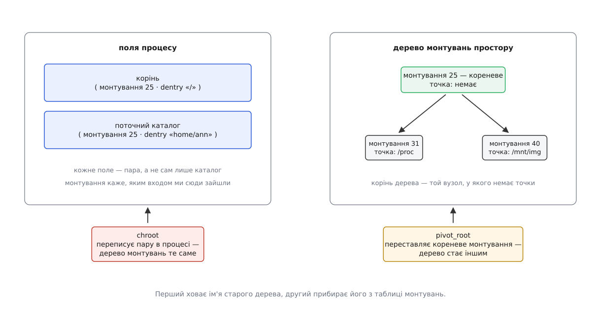
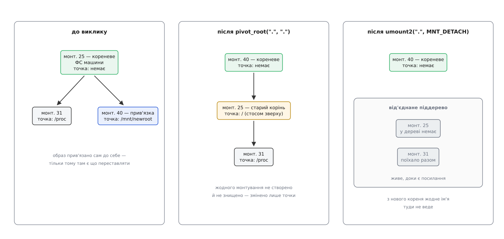
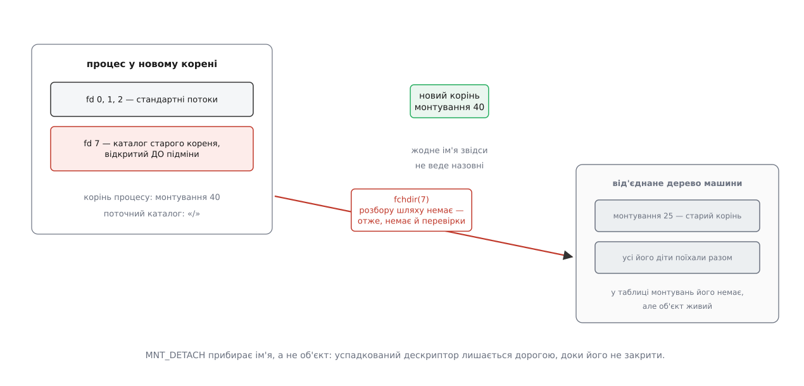

# pivot_root: підміна кореневого монтування

<preknowlist>
- [Монтування й дерево монтувань](topic:sys-unix/mount-model) — монтування є окремим об'єктом у пам'яті ядра з трьома складовими: суперблок, корінь монтування й точка; самі монтування шикуються в дерево, окреме від дерева каталогів.
- [Простори імен](topic:sys-unix/namespaces) — дерево монтувань належить групі процесів, а не машині, і його можна відгалузити собі викликом `unshare`.
- [Розбір шляху](topic:sys-unix/path-resolution) — ядро йде шляхом покомпонентно, а шлях від «/» відлічує від кореня цього процесу.
- [VFS](topic:sys-unix/vfs-layer) — dentry є внутрішнім представленням одного імені в каталозі, і саме на dentry, а не на текст шляху, посилаються структури ядра.
- [Файловий дескриптор](topic:sys-unix/file-descriptor) — відкритий об'єкт процес тримає числом, і цей зв'язок уже не проходить через імена.
- [chroot і його межі](topic:sys-unix/chroot) — виклик переписує в процесі поле, від якого відлічують абсолютні шляхи, і більше нічого не робить.
- [Можливості замість всесильного root](topic:sys-unix/capabilities) — повновладдя суперкористувача розбито на окремі дозволи, і привілейовані дії з деревом монтувань вимагають `CAP_SYS_ADMIN`.
</preknowlist>

Під час завантаження настає хвилина, коли треба поміняти підлогу під ногами. Ядро підняло крихітну тимчасову систему в оперативній пам'яті — рівно стільки коду, щоб упізнати контролер, зібрати масив, розшифрувати том і знайти справжній диск. Диск знайдено, файлову систему з нього змонтовано. Лишається дрібниця: зробити її коренем — і повернути машині пам'ять, яку займає тимчасова.

Друга половина й виявляється складною. Щоб повернути пам'ять, тимчасову систему треба відмонтувати. А відмонтувати її не вийде, доки вона є коренем: на ній стоїть той самий процес, який робить перехід, від неї відлічує шляхи кожен інший процес, і поки хоч хтось на неї покладається, ядро тримає її живою.

Та сама задача, лише іншими словами, стоїть перед кожним запуском контейнера. Процесові треба дати коренем розпакований образ — і зробити це так, щоб дерево машини після переходу стало для нього не «недоступним», а неіснуючим.

Зміна точки відліку тут не допомагає ні там, ні там. [`chroot`](topic:sys-unix/chroot) переписує в процесі одне поле — те, від якого починається розбір абсолютного шляху. Старе дерево після цього лишається змонтованим, живим і повністю робочим; воно просто перестає мати написання, яким його можна назвати. Для завантаження це означає, що пам'ять не звільнилася. Для контейнера — що дорога назад існує, а тримається обмеження на тому, що процесові забракло повноважень нею пройти.

Потрібна операція іншої природи: така, що чіпає не процес, а **склад дерева монтувань**.

## Дві речі, які звуться коренем

Щоб побачити, за що взятися, треба спершу побачити, чим корінь є всередині ядра. І тут виявляється, що слово «корінь» позначає дві різні речі, які легко переплутати.

Перша — **корінь процесу**. Ядро тримає його не як каталог, а як **пару**: монтування плюс dentry всередині нього. Поряд лежить друга така сама пара — поточний каталог. Пара, а не просто dentry, потрібна ось чому: один і той самий каталог може бути видний у дереві кілька разів, якщо на нього зроблено прив'язку, і тоді сам по собі dentry не відповідає на питання «де я стою». Відповідає лише пара — вона каже, **через яке монтування** ми до цього dentry дійшли. Саме тому `..` на корені змонтованої файлової системи вміє піднятися до батька її точки: ядро знає не лише, у якому каталозі воно стоїть, а й яким монтуванням туди зайшло.

Друга — **кореневе монтування простору**. Дерево монтувань має власний корінь: це той єдиний об'єкт, у якого немає точки, бо чіпляти його нема до чого. Усі інші монтування — його прямі чи непрямі діти.



*Обидві речі звуться коренем, але лежать у різних місцях: одна — поле процесу, друга — вузол дерева монтувань. Від того, яку з них міняти, залежить, чи лишиться старе дерево досяжним.*

Тепер різниця між двома викликами формулюється в одному реченні. `chroot` переписує **пару в процесі**: дерево монтувань лишається точно таким, як було, змінюється лише те, з якого місця в ньому починають читати імена. `pivot_root` переставляє **саме кореневе монтування**: дерево після нього має інший корінь, а старий корінь стає у ньому звичайним піддеревом — тобто чимось, що можна відмонтувати.

## Три дії одного виклику

Виклик має два аргументи — каталог, що стане новим коренем, і місце, куди переїде старий:

```c
syscall(SYS_pivot_root, "/mnt/newroot", "/mnt/newroot/old");
```

Обгортки в glibc для нього немає, тож кличуть за номером. Робить він рівно три речі, і кожну варто розібрати окремо, бо жодна не є очевидною.

**Перша: старе кореневе монтування перестає бути коренем і переїжджає під `put_old`.** Не копіюється, не приховується — саме переїжджає: той самий об'єкт монтування отримує нову точку. Разом із ним, як завжди в дереві монтувань, їде все, що під ним стояло.

**Друга: монтування, на яке вказує `new_root`, стає кореневим монтуванням простору.** Воно втрачає свою точку — коренева її не має — і опиняється на вершині дерева.

**Третя, найменш очевидна: ядро проходить усіма процесами й потоками цього простору монтувань і кожному, у кого корінь або поточний каталог указували на старий кореневий каталог, переставляє їх на новий.**



*Виклик не створює й не знищує жодного монтування — він переставляє точки в наявних об'єктах. Старий корінь після цього є звичайним піддеревом, і саме тому його вдається зняти окремим викликом.*

Третя дія на перший погляд виглядає надмірною: чому виклик не обмежується тим, хто його зробив? Причина цілком технічна. Мета всієї операції — щоб старий корінь можна було **відмонтувати**, а монтування не знімається, поки на нього хоч хтось покладається. Якби ядро переставило корінь лише викликачеві, старий об'єкт лишився б коренем для решти процесів простору — і зокрема для потоків ядра, у яких поточним каталогом стоїть «/» ([потоки ядра](topic:sys-unix/kernel-threads)). Кожен із них тримав би старе монтування зайнятим, і `umount` віддавав би `EBUSY` без жодного видимого винуватця.

З цієї ж третьої дії випливає й найгрубіша пастка виклику. `pivot_root` діє **на весь простір монтувань**, а не на процес. Якщо ви його не відгалузили, простір у вас спільний із рештою машини — і ви щойно переставили корінь усій системі. Тому в реальному коді виклику завжди передує `unshare(CLONE_NEWNS)` або `clone` з тим самим прапорцем ([простори імен](topic:sys-unix/namespaces)).

І остання дрібниця, яка коштує найбільше нервів: ядро переставляє поточний каталог лише тим, у кого він указував **точно на старий кореневий каталог**. Тому, хто стояв деінде — наприклад, усередині нового кореня, куди зайшов перед викликом, — поточний каталог лишають як є. Виклик про це не попереджає, а наслідок класичний: перший же відносний шлях розкривається не там, де очікували. Звідси правило — після `pivot_root` роблять `chdir("/")`, і не як гігієну, а тому, що інакше програма працює з чужим деревом.

## Чому виклик такий прискіпливий

`pivot_root` славиться тим, що віддає `EINVAL` на кожному другому виклику. Це не примхливість: у нього сім передумов, і кожна виводиться з того, що операція мусить лишити дерево цілим.

**Обидва аргументи — каталоги.** Найпростіша; монтування чіпляється до каталогу й нікуди більше.

**`new_root` мусить бути точкою монтування — і не «/».** Ось перша по-справжньому змістовна вимога, і вона прямо випливає з першої дії виклику: ядро переставляє **об'єкт монтування**, а не каталог. Якщо на `new_root` не стоїть монтування, переставляти нема чого. Тому розпакований у звичайну теку образ спершу прив'язують сам до себе — це не переносить жодного байта, а лише створює той об'єкт монтування, якого бракує:

```c
mount("/mnt/newroot", "/mnt/newroot", NULL, MS_BIND, NULL);
```

**Ні `new_root`, ні `put_old` не лежать на тому самому монтуванні, що й нинішній корінь.** Інакше вийшла б спроба перемістити монтування всередину самого себе — вузол дерева став би власним нащадком, і дерево перестало б бути деревом.

**`put_old` розташований у `new_root` або нижче.** Ця вимога виглядає довільною, доки не подумати, що буде після виклику. Новим коренем стане `new_root`, і все, що лежить поза ним, миттєво втратить будь-яке написання — простір імен звузиться до нового піддерева. А старий корінь нам ще потрібен назвати, щоб відмонтувати. Отже, місце під нього мусить лежати всередині майбутнього кореня — інакше ми отримали б монтування, яке є в дереві, але не має імені, і зняти його не змогли б ніколи.

**Нинішній корінь теж мусить бути точкою монтування.** Практично це виконується завжди, крім одного випадку, до якого ще дійдемо.

**Тип поширення не `MS_SHARED`** — ні в батька `new_root`, ні в батька нинішнього кореня, ні в самого `put_old`. Тут причина найглибша. Спільне поширення означає, що подія монтування повторюється в усіх членів групи ([поширення монтувань](topic:sys-unix/mount-model)). Але зміст `pivot_root` — «заміни **мій** корінь», і повторити таку подію в чужому просторі означало б переставити корінь і йому. Операція, чий сенс — ізоляція, не має права проходити крізь місток, побудований для спільності. Ядро не намагається вгадати, що ви мали на увазі, а просто відмовляє. Звідси перший рядок будь-якого коду, що ставить контейнер:

```c
mount(NULL, "/", NULL, MS_REC | MS_PRIVATE, NULL);   /* mount --make-rprivate / */
```

**Потрібна можливість `CAP_SYS_ADMIN`** — у тому просторі імен користувачів, який володіє цим простором монтувань. Саме тому безкореневі контейнери взагалі можливі: власний простір користувачів дає повний набір можливостей усередині себе, і `pivot_root` у своєму просторі монтувань дозволений, хоч ззовні процес лишається непривілейованим.

Повний перелік кодів помилок із прив'язкою до кожної вимоги, а заразом і сусідні виклики, зібрано окремо: [контракт chroot, pivot_root і openat2](topic:sys-unix/chroot/api-chroot-contract.md).

## Ідіома з двома крапками

Класичний рецепт вимагав завести всередині нового кореня порожню теку під старий — `mkdir /mnt/newroot/old`, а потім її ще й прибрати. Тека лишалася в образі, і кожен, хто його потім читав, дивувався, звідки вона.

Сучасні середовища запуску контейнерів роблять інакше:

```c
chdir("/mnt/newroot");
syscall(SYS_pivot_root, ".", ".");
umount2(".", MNT_DETACH);
chdir("/");
```

Обидва аргументи однакові, і працює це через те, що монтування вміють ставати **стосом в одній точці**. Розберімо по кроку.

Після `chdir` поточний каталог указує на новий корінь, і обидва аргументи `"."` розкриваються в нього. Виклик виконує свої три дії: `new_root` стає кореневим монтуванням, а старий корінь переїжджає на `put_old` — тобто рівно туди, куди щойно переїхав новий корінь. Ядро складає їх стосом: у точці «/» тепер два монтування, і верхнє з них — старий корінь.

Далі найтонше. Поточний каталог процесу — це пара, і після виклику вона показує на **новий** корінь; але розбір імені `"."` іде звідти вгору по стосу й дає верхній шар, тобто старий корінь. Саме його й знімає `umount2`. Лишається один шар — новий корінь.

Прапорець `MNT_DETACH` тут обов'язковий, бо звичайне зняття відмовиться працювати, поки всередині старого дерева хтось тримає відкриті файли, а їх там повно — уся машина. Відкладене від'єднання прибирає монтування з дерева негайно, а знищення відкладає до зникнення останнього посилання.

Заключний `chdir("/")` — не косметика, а страховка. Поточного каталогу виклик не переставляв: той не був «точно на старому кореневому каталозі», а стояв на майбутньому корені — тобто на тому самому монтуванні, яке щойно стало кореневим. Небезпека тонша: розбір імені від нього перед тим давав верхній шар стосу, тож на що саме показує `/proc/self/cwd` після підміни, ядро не обіцяє. Тому поточний каталог задають явно, а не покладаються на здогад.

> 🔧 **Навіщо це.** Дві однакові крапки — перше, що спантеличує в чужому коді рушія контейнерів; тепер видно, що це не хитрість заради краси, а спосіб не лишати в образі службової теки. Читаючи `runc`, `crun` чи `bubblewrap`, ви побачите рівно цю послідовність, іноді з `fchdir` замість `chdir` — коли новий корінь тримають дескриптором, відкритим наперед.

## Корінь, який не переставити

Лишилася одна передумова, яку ми відклали: нинішній корінь не має бути `rootfs`. І саме вона робить `pivot_root` непридатним для тієї задачі, заради якої його придумали.

`rootfs` — це початкова файлова система в пам'яті, яку ядро створює до всього іншого; у неї розпаковується [initramfs](topic:sys-unix/initramfs). Вона особлива тим, що є **останнім** коренем: під нею нічого немає, її неможливо відмонтувати, і зробити її піддеревом чогось іншого теж не вийде — бо тоді дерево лишилося б без опори. Ядро просто відмовляє.

Тому початковий образ користується не `pivot_root`, а командою `switch_root`, і всередині вона робить зовсім інше. Спершу переносить у новий корінь ті монтування, які вже потрібні й які шкода піднімати заново — `/dev`, `/proc`, `/sys`, `/run` — переміщенням монтування (`MS_MOVE`). Далі тим самим `MS_MOVE` переміщує сам новий корінь на місце «/», робить `chroot(".")` — так, звичайний `chroot` — і запускає справжній `init`. А пам'ять звільняє окремо й у лоб: рекурсивно видаляє **весь вміст** старої `rootfs`, попередньо переконавшись через `statfs`, що це справді ramfs або tmpfs, а не чийсь диск.

Виглядає як відступ від принципу, але тут він доречний. Заперечення проти `chroot` — що старе дерево лишається досяжним — на цій стадії не має ваги: на цій стадії, крім самого початкового `init`, у системі майже нікого немає — він же й видаляє вміст старого кореня, і після видалення там нема чого досягати. Порожня `rootfs` назавжди лишається під деревом, займаючи кілька кілобайтів, і на неї більше ніхто не дивиться.

Історія цієї заміни варта окремого погляду: виклик з'явився 2000 року саме для того, щоб звільняти пам'ять під ramdisk на завантаженні, за кілька років його з цієї ролі витіснили, а справжня його кар'єра почалася ще через десятиліття й зовсім в іншому місці — [звідки взявся pivot_root і чому пішов із завантаження](topic:sys-unix/pivot-root/hist-pivot-root-birth.md).

## Чи справді дороги більше немає

Тепер найважливіше питання, заради якого все й будувалося. Після підміни кореня й від'єднання старого дерева — чи існує з нового кореня дорога назовні?

У просторі імен її немає. Дерево монтувань цього простору складається з нового кореня й того, що під ним; старого кореня в таблиці не значиться, і жодне написання до нього не веде. Це не заборона, яку перевіряють, — це відсутність об'єкта, яку нема кому перевіряти.

Але **відкладене від'єднання прибирає ім'я, а не об'єкт**. Від'єднане монтування живе, доки на нього є посилання, і одне таке посилання буває успадкованим: [дескриптор](topic:sys-unix/file-descriptor) каталогу, відкритий до підміни кореня. Дескриптор указує на об'єкт напряму, імена в цьому зв'язку не беруть участі, і `fchdir` по ньому переносить поточний каталог у від'єднане дерево без жодного розбору шляху — а отже, без жодної перевірки.



*Нового кореня достатньо, щоб жодне ім'я не вело назовні. Успадкований дескриптор іменем не є — тому він і лишається дорогою.*

Наскільки далеко ця дорога веде, залежить від того, що саме від'єднали. `MNT_DETACH` знімає з дерева ціле піддерево — старий корінь разом з усіма його дітьми, — і всередині нього монтування лишаються з'єднані між собою як були. Тож дескриптор у старий корінь відчиняє практично всю машину. Підйом ще вище ядро таки зупиняє: із серпня 2015 року розбір `..` на шляху, який не досяжний від кореня свого монтування, повертає `ENOENT` (перевірка `path_connected` Еріка Бідермана — мейнлайн 4.3, звідти бекпорт у стабільні гілки; приводом стала історія з перейменуванням каталогу з-під прив'язки). Утіха слабка: підніматися вище старого кореня й не треба.

Це не теорія. Саме так виглядала вразливість `CVE-2024-21626` у `runc` — одна з набору «Leaky Vessels», оприлюдненого на початку 2024 року. Рушій лишав відкритим власний внутрішній дескриптор у файлову систему господаря і не закривав його перед запуском процесу контейнера. Образ, у якого в описі стояло `cwd: /proc/self/fd/7`, стартував із поточним каталогом у файловій системі машини — усередині ізольованого простору монтувань, з правильно підміненим коренем і без жодної помилки в самому `pivot_root`. Полагодили це у версії 1.1.12, і полагодили саме тим, чим таке лагодять: закриванням дескрипторів.

Звідси й практичний висновок: підміна кореня знімає дорогу через імена, а дорогу через дескриптори мусить закрити програма. Робиться це не переліком, а політикою — усе, що відкривають до переходу, відкривають із прапорцем `O_CLOEXEC`, і тоді `execve` закриває їх сам.

Побачити обидві половини в роботі простіше, ніж прочитати: [дослід із від'єднаним коренем](topic:sys-unix/pivot-root/proj-detached-root-probe.md) — коротка програма, яка робить підміну, показує дерево монтувань до й після, а потім виходить у від'єднане дерево через успадкований дескриптор і не виходить, коли той закрито.

І окремо варто назвати те, чого виклик не робить зовсім. Він не чіпає ні ідентичності процесу, ні набору можливостей, ні видимості чужих процесів, ні мережі. Він відповідає рівно на одне питання — з якого дерева цей процес читає імена, — і всі інші межі [контейнера](topic:sf-os/containers) ставлять інші механізми.

## Де це живе

Кожен рушій контейнерів робить ту саму послідовність, і тепер у ній немає жодного незрозумілого рядка: відгалузити простір монтувань, зробити корінь приватним, прив'язати образ сам до себе, зайти в нього, підмінити корінь двома крапками, зняти старий із `MNT_DETACH`, повернутися в «/», закрити зайве й запустити програму. Розгорнутий приклад із рештою просторів імен — [контейнер зі ста рядків](topic:sys-unix/namespaces/proj-mini-container.md).

Ту саму дію можна викликати й без програмування: `unshare --mount` дає власний простір монтувань, а команда `pivot_root` із набору util-linux — сам виклик. У [systemd](topic:sys-unix/systemd-model) за це відповідає директива `RootDirectory=`, і вона свідомо пробує спершу `pivot_root`, а `chroot` бере лише тоді, коли перший в оточенні не виходить.

> 🔧 **Навіщо це.** Три найчастіші помилки читаються за кодом однозначно. `EINVAL` одразу після старту — майже завжди корінь образу не є точкою монтування: забули прив'язку самого до себе. `EINVAL` при правильній прив'язці — корінь простору лишився спільним: забули `--make-rprivate`. `EPERM` — простір монтувань належить не тому простору користувачів, у якому ви маєте `CAP_SYS_ADMIN`. Жодна з цих помилок не каже, що саме не так, тому знання передумов економить години.

Уся конструкція тримається на рішенні, ухваленому задовго до контейнерів: **кореневе монтування не зробили особливим**. Це такий самий об'єкт, як монтування флешки, у нього просто немає точки. Якби корінь був вбудованою константою ядра, підміняти його довелося б окремим механізмом із власними правилами — і завантаження, і контейнери будувалися б зовсім інакше. А оскільки він звичайний вузол звичайного дерева, вистачило одного виклику, який переставляє точки в трьох об'єктах і проходиться списком процесів. Різниця між ним і `chroot` — не в силі заборони: один ховає ім'я, другий прибирає річ.
