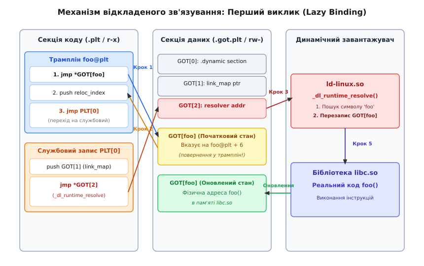
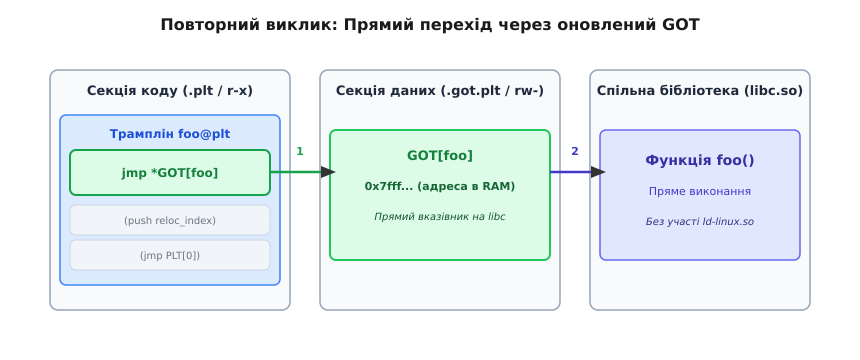

# PLT і GOT: як працює виклик через межу бібліотеки

<preknowlist>
- [Статичне та динамічне компонування](root:sys-unix/static-and-dynamic-linking) — відмінності між зв'язуванням бінарного файлу під час збірки та підвантаженням спільних бібліотек.
- [Позиційно-незалежний код PIC та PIE](root:sys-unix/position-independent-code) — принципи відносної адресації інструкцій та відсутність фіксованих адрес у пам'яті.
- [Двоїста структура ELF-файлу](root:sys-unix/elf-structure) — поділ бінарного об'єкта на логічні секції для компонувальника та завантажувальні сегменти для ядра.
- [Динамічний завантажувач ld-linux](root:sys-unix/dynamic-loader) — роль інтерпретатора у пошуку та завантаженні спільних об'єктів `.so` в адресний простір.
</preknowlist>

Коли операційна система Linux отримує команду виконати програму за допомогою системного виклику `execve()`, ядро створює для нового процесу ізольований віртуальний адресний простір. Проте перед виконанням першої інструкції програми виникає фундаментальна інженерна проблема: як забезпечити швидкий і безпечний виклик функцій із зовнішніх динамічних бібліотек, якщо точні віртуальні адреси цих функцій стають відомими лише в момент запуску?

У разі статичного компонування ця проблема відсутня. Компонувальник збирає код програми та системних бібліотек у єдиний монолітний бінарний файл на диску. Оскільки всі інструкції розміщуються за заздалегідь відомими зсувами, адреси переходів зашиваються безпосередньо у кодові інструкції `call`. Проте статичне зв'язування вимагає гігабайтів дискової та оперативної пам'яті для зберігання дублікатів коду й унеможливлює оперативне оновлення безпеки у системних бібліотеках.

Динамічне зв'язування розв'язує проблему дублювання пам'яті: такі бібліотеки, як `libc.so`, `libssl.so` чи `libgtk.so`, зберігаються на диску в єдиному екземплярі та відображаються операційною системою у віртуальну пам'яті багатьох процесів одночасно.

Проте використання спільних бібліотек створює суворе апаратне протиріччя між трьома вимогами сучасних операційних систем:

1. **Технологія ASLR (Address Space Layout Randomization):** Задля захисту від кібератак операційна система завантажує спільні бібліотеки за випадковими віртуальними адресами під час кожного нового запуску процесу. Віртуальна адреса функції `printf()` у пам'яті невідома ні компілятору, ні компонувальнику під час збірки бінарного файла.
2. **Апаратна ізоляція пам'яті та економія RAM (Принцип W^X — Write XOR Execute):** Секція коду програми (`.text`) та завантажених бібліотек має бути позначена прапорцями `PROT_READ | PROT_EXEC` (`r-x`). Сторінки коду є спільними для багатьох процесів у фізичній оперативній пам'яті. Операційна система суворо забороняє модифікувати інструкції коду під час виконання.
3. **Заборона модифікації виконуваних інструкцій `call`:** Компонувальник не може hardcode-дити абсолютну адресу `printf()` у коді програми під час збірки. Динамічний завантажувач ядра також не має права перезаписувати інструкції `call` у пам'яті під час запуску, оскільки це вимагало б надання секції коду тимчасових прав на запис (`rw-`), що зруйнувало б можливість спільного використання сторінок RAM між процесами й відкрило б критичний вектор для ін'єкції шкідливого коду.

Архітектурним рішенням цього протиріччя є принцип непрямої адресації (*indirection*). Замість намагання модифікувати виконуваний код у секції `.text`, розробники ELF-стандарту розділили механізм виклику між двома спеціалізованими таблицями: **GOT** (*Global Offset Table*) у секції даних та **PLT** (*Procedure Linkage Table*) у секції коду.

---

## 1. Філософія дуету: GOT проти PLT

Фундаментальна ідея підходу полягає в тому, що програма ніколи не робить виклик зовнішньої функції напряму. Замість цього виконуваний код звертається до посередника, який зчитує потрібну адресу зі спеціальної таблиці у записуваній пам'яті.

```
[Програма: call foo@plt] → [Секція коду: Трамплін foo@plt] → [Секція даних: Комірка GOT[foo]] → [libc.so: Функція foo()]
```

Ці дві структури мають строго розмежовані права доступу та призначення:

- **Глобальна таблиця зміщень (GOT — Global Offset Table):** Це масив віртуальних адрес (покажчиків), розташований у **секції даних** бінарного об'єкта (`.got` та `.got.plt`). Оскільки ця область завантажується в пам'ять із правами на читання та запис (`PROT_READ | PROT_WRITE`), динамічний завантажувач (`ld-linux.so`) має право модифікувати її комірки впродовж життя процесу.
- **Таблиця зв'язування процедур (PLT — Procedure Linkage Table):** Це масив невеликих виконуваних трамплінів (*stubs*), розташований у **секції коду** (`.plt` або `.plt.sec`) з правами `PROT_READ | PROT_EXEC`. Кожна зовнішня функція, яку викликає програма, отримує власний персональний трамплін у цій таблиці (наприклад, `printf@plt`).

Коли код програми робить виклик `call printf@plt`, керування передається не в `libc.so`, а на відповідний трамплін у секції `.plt`. Цей трамплін робить непрямий перехід за адресою, записаною в даний момент у відповідній комірці таблиці `GOT`.

Історичні передумови створення цієї системи та еволюцію від апаратних обмежень 1980-х років до вимог кібербезпеки XXI століття висвітлює вставка [📜 Від UNIX SVR4 до Full RELRO: еволюція відкладеного зв'язування](root:sys-unix/plt-and-got/hist-lazy-binding-evolution.md).

---

## 2. Ініціалізація пам'яті та роль інтерпретатора `ld-linux.so`

Під час виконання системного виклику `execve()` ядро Linux зчитує заголовок ELF-файлу та знаходить програмний заголовок типу `PT_INTERP`. У цьому заголовку вказано шлях до системного динамічного завантажувача (інтерпретатора), наприклад `/lib64/ld-linux-x86-64.so.2`.

Ядро відображає у віртуальну пам'ять сегменти виконуваного файла, завантажує інтерпретатор `ld-linux.so` і передає керування на точку входу завантажувача. Динамічний завантажувач виконує наступну послідовність дій з налаштування GOT:

1. **Читання секції `.dynamic`:** Завантажувач сканує динамічні теги виконуваного файла, витягує список залежних бібліотек (`DT_NEEDED`) та завантажує їх у пам'ять за допомогою викликів `mmap()`.
2. **Побудова списку `link_map`:** Завантажувач формує однозв'язний список структур `struct link_map`, де кожен елемент описує один завантажений `.so` модуль (його базову адресу завантаження, таблиці символів та релокацій).
3. **Ініціалізація службових комірок GOT:** Завантажувач знаходить секцію `.got.plt` за тегом `DT_PLTGOT` і прописує у комірку `GOT[1]` адресу побудованого списку `link_map`, а у комірку `GOT[2]` — віртуальну адресу власної внутрішньої функції `_dl_runtime_resolve`.
4. **Первинний патчинг `GOT[3..n]`:** Завантажувач записує в кожну комірку `GOT[i]` адресу інструкції `push reloc_index` відповідного трампліну `foo@plt`.
5. **Передача керування програмі:** Завантажувач завершує стартову підготовку й передає керування на точку входу програми `_start` у секції `.text`.

---

## 3. Анатомія Глобальної таблиці зміщень (GOT)

Глобальна таблиця зміщень формується компонувальником під час збірки програми. У сучасних 64-бітних ELF-файлах таблиця розбивається на дві незалежні секції:

1. **Секція `.got`:** Використовується для резолвінгу адрес **глобальних змінних**, імпортованих з інших модулів. Комірки цієї секції заповнюються завантажувачем негайно під час запуску програми (load-time relocations).
2. **Секція `.got.plt`:** Використовується виключно для обслуговування **викликів функцій** через PLT. Вона підтримує відкладене зв'язування (*lazy binding*), тобто комірки цієї таблиці заповнюються лише тоді, коли відповідна функція викликається уперше.

### Зарезервовані службові комірки `.got.plt`

Згідно зі стандартом System V AMD64 ABI, перші три 64-бітні комірки секції `.got.plt` (розміром по 8 байтів кожна) мають строго визначене службове призначення:

- **`GOT[0]`:** Зберігає віртуальну адресу секції `.dynamic`. Ця секція містить метадані бінарного об'єкта — списки необхідних бібліотек (`DT_NEEDED`), адресу таблиці символів `.dynsym` та таблиці релокацій.
- **`GOT[1]`:** Зберігає вказівник на внутрішню структуру `struct link_map` динамічного завантажувача. Ця структура описує зв'язаний список усіх завантажених у процес спільних бібліотек та порядок пошуку символів.
- **`GOT[2]`:** Зберігає точну віртуальну адресу функції-резолвера `_dl_runtime_resolve` всередині самого динамічного завантажувача `ld-linux.so`.

Починаючи з індексу `GOT[3]`, розташовуються комірки, закріплені за конкретними імпортованими функціями програми (`printf`, `malloc`, `free` тощо).

Точні специфікації структур релокацій `Elf64_Rela` та константи типів `R_X86_64_JUMP_SLOT` детально описує [📋 Релокації та внутрішні структури PLT і GOT](root:sys-unix/plt-and-got/api-plt-got-relocations.md).

---

## 4. Анатомія Таблиці зв'язування процедур (PLT)

Секція `.plt` складається з послідовності однакових за розміром асемблерних інструкцій. Перший запис у секції — `PLT[0]` — є загальним службовим трампліном для всієї програми. За ним ідуть персональні трампліни для кожної імпортованої функції: `PLT[1]` (`foo@plt`), `PLT[2]` (`bar@plt`) і так далі.

Розглянемо розмітку інструкцій на архітектурі x86-64.

### Службовий трамплін `PLT[0]`

```assembly
PLT0:
    push   QWORD PTR [rip + 0x2008]  ; Кладе на стек link_map (значення з GOT[1])
    jmp    QWORD PTR [rip + 0x2010]  ; Стрибок на функцію _dl_runtime_resolve (із GOT[2])
```

Завдання `PLT[0]` — підготувати ідентифікатор завантаженого модуля та передати керування на код резолвера в `ld-linux.so`.

### Персональний трамплін функції `foo@plt`

Кожна імпортована функція `foo` отримує свій трамплін у секції `.plt`:

```assembly
foo@plt:
    jmp    QWORD PTR [rip + GOT_FOO_OFFSET]  ; 1. Непрямий стрибок за адресою з GOT[foo]
    push   reloc_index                       ; 2. Заштовхування на стек індексу релокації
    jmp    PLT0                              ; 3. Перехід на службовий трамплін PLT0
```

Цей набір інструкцій працює за алгоритмом двох фаз: фази первинного резолвінгу та фази швидкого виконання.

---

## 5. Механізм відкладеного зв'язування (Lazy Binding)

Великі графічні додатки або серверні системи зкомпоновані з десятками динамічних бібліотек і потенційно можуть імпортувати тисячі різних функцій. Проте під час конкретного сеансу роботи виконується лише невелика частина з них. Якби динамічний завантажувач шукав адреси абсолютно всіх функцій під час виклику `execve()`, запуск програми вимагав би помітних затримок.

Механізм **відкладеного зв'язування** (*lazy binding*) вирішує цю проблему: адреса функції шукається й записується в GOT лише тоді, коли ця функція викликається **вперше**.

### Покроковий розбір першого виклику функції

Розглянемо етапи виконання, коли програма вперше робить виклик `call foo@plt`:


*Схема першого виклику зовнішньої функції у режимі Lazy Binding: перехід через неініціалізований GOT на службовий резолвер ld-linux.so з подальшим оновленням адреси.*

1. **Виклик трампліну:** Інструкція `call foo@plt` у коді програми передає керування на першу інструкцію трампліну `foo@plt`.
2. **Перший стрибок у GOT:** Трамплін виконує `jmp *GOT[foo]`.
3. **Початковий стан GOT (повернення у трамплін):** Під час завантаження програми динамічний завантажувач ініціалізує комірку `GOT[foo]` не адресою реальної функції у `libc.so`, а адресою **другої інструкції** того ж самого трампліну `foo@plt` (тобто на `push reloc_index`)!
4. **Підготовка ідентифікатора:** Оскільки `GOT[foo]` вказав назад у трамплін, процесор виконує другу інструкцію `push reloc_index`. Вона розміщує на стеку зміщення (або індекс) даного символу у таблиці релокацій `.rela.plt`. Це дозволяє завантажувачу дізнатися, ім'я якої саме функції потрібно знайти.
5. **Перехід на `PLT[0]`:** Третя інструкція трампліну виконує `jmp PLT0`.
6. **Виклик резолвера:** Запис `PLT[0]` кладе на стек значення `GOT[1]` (покажчик на `link_map` процесу) і здійснює перехід за адресою з `GOT[2]` — безпосередньо у функцію `_dl_runtime_resolve` динамічного завантажувача.

### Робота `_dl_runtime_resolve`

Функція `_dl_runtime_resolve` — це низькорівнева асемблерна процедура всередині `ld-linux.so`. Вона виконує такі критичні дії:

1. **Збереження контексту процесора:** Оскільки резолвер викликається проміжно у довільний момент виконання програми, він дбайливо зберігає у стек абсолютно всі регістри процесора, які використовуються для передачі аргументів ABI (включаючи загальні регістри `%rdi`, `%rsi`, `%rdx`, `%rcx`, `%r8`, `%r9`, а також векторні регістри XMM/YMM/ZMM).
2. **Пошук символу:** Використовуючи отримані зі стеку `link_map` та `reloc_index`, резолвер дістає ім'я символу (`"foo"`) і здійснює пошук його адреси у завантажених об'єктах `.so` за допомогою хеш-таблиць `DT_GNU_HASH` або `DT_HASH`.
3. **Патчинг GOT:** Знайшовши точну віртуальну адресу функції `foo()` у пам'яті (наприклад, `0x7ffff7e425a0`), резолвер **перезаписує** комірку `GOT[foo]` цією новою адресою.
4. **Відновлення контексту та перехід:** Резолвер відновлює всі регістри процесора зі стеку й робить перехід на знайдену адресу `foo()`.

---

## 6. Повторні виклики: Пряме виконання без накладних витрат

Головна краса PLT і GOT полягає у тому, що весь складний процес пошуку символу відбувається лише **один раз**.

Коли програма робить другий і всі наступні виклики `call foo@plt`, виконання проходить за принципово коротшим шляхом:


*Схема повторного виклику: оновлена комірка GOT містить пряму адресу у libc.so, повністю оминаючи резолвер та службовий PLT[0].*

1. Програма виконує інструкцію `call foo@plt`.
2. Перша інструкція трампліну виконує `jmp *GOT[foo]`.
3. Оскільки комірка `GOT[foo]` вже була оновлена процедурою `_dl_runtime_resolve` під час першого виклику, вона містить пряму адресу функції `foo()` у пам'яті `libc.so`.
4. Процесор миттєво переходить за цією адресою. Інструкції `push reloc_index`, `jmp PLT0` та сам динамічний завантажувач більше не задіюються взагалі.

Накладні витрати на всі наступні виклики динамічної функції зводяться лише до однієї додаткової інструкції непрямого переходу `jmp`, що практично не впливає на швидкодію процесора завдяки роботі апаратного блоку передбачення розгалужень (Branch Target Buffer).

Практичний приклад коду, який відстежує стан комірки `GOT[puts]` у пам'яті процесу до та після першого виклику, наведено у вставці [⚙️ Дослідження GOT та процес зрізу адреси під час виконання](root:sys-unix/plt-and-got/proj-plt-got-inspector.md).

---

## 7. Механізм GNU Indirect Functions (IFUNC)

Окремим потужним розширенням специфікації PLT та GOT у Linux є технологія **GNU Indirect Functions (IFUNC)**. Вона дозволяє розробникам системних бібліотек реалізувати динамічний вибір оптимальної версії функції залежно від апаратних можливостей поточного процесора (наприклад, наявності векторних інструкцій AVX2, AVX-512, NEON чи ARM SVE).

У разі використання IFUNC символ у таблиці `.dynsym` отримує спеціальний тип `STT_GNU_IFUNC`. Замість адреси звичайного коду функції значення символу вказує на так звану **функцію-селектор** (*resolver function*).

Процес резолвінгу IFUNC через GOT проходить за наступним сценарієм:

1. Під час завантаження програми або першого виклику динамічний завантажувач знаходить запис релокації `R_X86_64_IRELATIVE` у секції `.rela.dyn` або `.rela.plt`.
2. Завантажувач передає керування на функцію-селектор усередині бібліотеки `libc.so`.
3. Функція-селектор виконує інструкції `CPUID` чи перевіряє `auxiliary vector`, визначає наявність векторних розширень і повертає покажчик на найбільш оптимальну процедуру (наприклад, `__memcpy_avx512_unaligned` замість базової `__memcpy_sse2`).
4. Завантажувач перезаписує комірку `GOT[memcpy]` адресою поверненої процедури.

Завдяки цьому механізму абсолютно всі наступні виклики `memcpy()` у програмі переходять безпосередньо на високооптимізований векторний код без найменших накладних витрат на перевірку прапорів процесора під час кожного виклику.

---

## 8. Архітектурні особливості: x86-64 проти ARM64

Описана вище класична схема PLT варіюється залежно від апаратної архітектури та вимог до безпеки.

### Архітектура x86-64

На 64-бітних процесорах x86-64 для звернення до GOT використовується адресація відносно регістру вказівника інструкцій (`%rip`-relative addressing). Це дозволяє генерувати позиційно-незалежні інструкції переходу без потреби в абсолютних адресах:

```assembly
jmp QWORD PTR [rip + 0x200912]
```

### Архітектура ARM64 (AArch64)

На архітектурі ARM64 процесор не має прямої інструкції `push` для збереження окремих значень на стек усередині трампліну PLT. Замість цього ARM64 використовує паралельну пару інструкцій адресації `adrp` (Address Page) та `ldr` (Load Register), а для передачі ідентифікаторів релокацій у завантажувач застосовуються додаткові тимчасові регістри `x16` (IP0) та `x17` (IP1):

```assembly
foo@plt:
    adrp   x16, page_offset_got      ; Обчислення старшого адресної сторінки GOT
    ldr    x17, [x16, #:lo12:got_foo]; Завантаження адреси з GOT у регістр x17
    add    x16, x16, #:lo12:got_foo  ; Обчислення адреси запису GOT
    br     x17                       ; Непрямий стрибок за адресою з x17
```

### Сучасні оптимізації та захист: `.plt.got` та `.plt.sec`

У сучасних дистрибутивах Linux компілятори GCC та Clang генерують додаткові варіанти секції PLT:

- **Секція `.plt.got`:** Якщо програма зкомпонована з прапорцями примусового резолвінгу на старті (`-z now`), lazy binding відключається. Для таких функцій генеруються скорочені трампліни у секції `.plt.got`, які складаються з однієї інструкції `jmp *GOT[foo]` і не містять коду для виклику резолвера.
- **Секція `.plt.sec` (Захист Control Flow Integrity):** Для протидії атакам типу ROP/COP сучасні процесори (Intel CET та ARM BTI) вимагають наявності спеціальної інструкції підтвердження легітимного переходу (`endbr64` на x86-64 або `bti c` на ARM64) на початку будь-якого трампліну. Секція `.plt.sec` містить саме такі захищені трампліни.

---

## 9. Безпека: Атаки GOT Overwrite та механізм RELRO

Незважаючи на високу ефективність, класична реалізація відкладеного зв'язування містить суттєву вразливість із точки зору кібербезпеки.

### Загроза GOT Overwrite

Оскільки секція `.got.plt` повинна залишатися доступною для запису (`PROT_READ | PROT_WRITE`) протягом усього часу работы програми (щоб функція `_dl_runtime_resolve` мала змогу оновлювати адреси під час перших викликів), вона перетворюється на привабливу мішень для атакуючого.

Якщо в програмі існує вразливість запису в довільну область пам'яті (наприклад, переповнення буфера на купі або помилка у форматній стрічці `printf`), зловмисник може перезаписати комірку `GOT[free]` або `GOT[printf]` адресою власного шелл-коду або адресою функції `system()`. Наступний стандартний виклик `free(buf)` у коді програми замість звільнення пам'яті виконає `system("/bin/sh")`.

### Технологія RELRO (RELocation Read-Only)

Щоб назавжди ліквідувати цей клас атак, розробники компонувальників GNU винайшли захисний механізм **RELRO**:

| Рівень захисту | Прапорці компонувальника | Стан GOT під час виконання | Доступність Lazy Binding |
| :--- | :--- | :--- | :--- |
| **No RELRO** | `-Wl,-z,norelro` | Секції `.got` та `.got.plt` доступні для запису (`rw-`) протягом усього часу | Доступне повністю |
| **Partial RELRO** | `-Wl,-z,relro` | Секція `.got` (змінні) після завантаження захищається `mprotect()` (`r--`). Секція `.got.plt` залишається записуваною (`rw-`) | Доступне для функцій |
| **Full RELRO** | `-Wl,-z,relro,-z,now` | Усі секції `.got` та `.got.plt` переводяться в режим *Read-Only* (`r--`) до запуску `main()` | **Вимкнено повністю** |

При використанні **Full RELRO** динамічний завантажувач виконує такі дії:
1. Завантажує бінарний файл та всі залежні бібліотеки `.so`.
2. Одразу резолвить абсолютно всі символи функцій і заповнює комірки `.got.plt`.
3. Викликає системний виклик `mprotect(got_start, got_size, PROT_READ)`, переводячи сторінки пам'яті GOT у режим **Read-Only** (`r--`).
4. Передає керування на точку входу програми `main()`.

Після цього будь-яка спроба перезаписати комірку в GOT під час виконання програми негайно блокується апаратурою MMU процесора та викликає фатальну помилку `SIGSEGV` (*Segmentation Fault*).

Примусово ввімкнути режим Full RELRO для будь-якої програми без її перекомпіляції можна за допомогою змінної середовища:

```bash
$ LD_BIND_NOW=1 ./my_application
```

---

## 10. Інспекція PLT та GOT за допомогою системних утиліт

Для аналізу структури та поведінки PLT/GOT у реальних ELF-файлах використовуються стандартні утиліти розробки.

### 1. Перегляд релокацій через `readelf`

Утиліта `readelf -r` демонструє всі релокаційні записи, які завантажувач повинен обробити для GOT:

```bash
$ readelf -r /bin/ls

Relocation section '.rela.plt' at offset 0x roof contains 12 entries:
  Offset          Info           Type           Sym. Value    Sym. Name + Addend
000000003f00  000200000007 R_X86_64_JUMP_SLOT 0000000000000000 free@GLIBC_2.2.5 + 0
000000003f08  000500000007 R_X86_64_JUMP_SLOT 0000000000000000 __printf_chk@GLIBC_2.3.4 + 0
```

Колонка `Offset` показує точну віртуальну адресу запису в GOT, а `Type = R_X86_64_JUMP_SLOT` підтверджує, що цей запис обслуговується через PLT.

### 2. Дисасемблювання трамплінів через `objdump`

Переглянути інструкції трамплінів у секції `.plt` можна командою:

```bash
$ objdump -d -j .plt /bin/ls

0000000000001020 <.plt>:
    1020:	ff 35 e2 2f 00 00    	push   0x2fe2(%rip)        # GOT[1] (link_map)
    1026:	ff 25 e4 2f 00 00    	jmp    *0x2fe4(%rip)        # GOT[2] (resolver)
    102c:	0f 1f 40 00          	nopl   0x0(%rax)

0000000000001030 <free@plt>:
    1030:	endbr64
    1034:	ff 25 e2 2f 00 00    	jmp    *0x2fe2(%rip)        # GOT[free]
    103a:	68 00 00 00 00       	push   0x0
    103f:	e9 e0 ff ff ff       	jmp    1020 <.plt>
```

---

## Підсумок

Механізм дуету **PLT** та **GOT** є одним з найважливіших архітектурних рішень сучасних операційних систем Unix та Linux. Він дозволяє:

- Зберігати секцію коду `.text` строго незмінною (`r-x`) та спільною для багатьох процесів у фізичній пам'яті.
- Використовувати рандомізацію адресного простору (ASLR) для динамічних бібліотек без втрати продуктивності.
- Прискорювати запуск програм за допомогою відкладеного зв'язування (*lazy binding*).
- Забезпечувати максимальний рівень захисту від модифікації коду та атак на пам'яті завдяки сучасному режиму **Full RELRO**.
