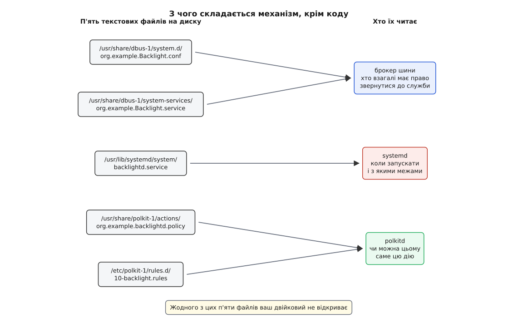

# ⚙️ backlightd: маленька служба, яка перед кожною дією питає полкіта

Зберімо механізм цілком — службу на кількадесят рядків, яка вміє рівно одну привілейовану річ (крутити підсвітку екрана) і жодного прохання не виконує, доки не дістане згоди від `polkitd`. Цікавих місць тут три: як дію оголошують назовні, звідки беруть особу прохача й що діється в проміжку між запитанням і відповіддю — саме в цьому проміжку ховається більшість помилок.

## Що тут привілейоване

Яскравість екрана — це число у файлі `/sys/class/backlight/intel_backlight/brightness`. Файл живе в [sysfs](topic:sys-unix/sysfs-device-model), належить root і має біти `0644`: читати може будь-хто, писати — тільки root. Повзунок у панелі працює з uid 1000, тож сам він туди не запише ніколи.

Дистрибутиви часто латають це [правилом udev](topic:sys-unix/udev-rules), яке віддає файл групі `video`; у сучасній системі яскравість і зовсім крутить `systemd-logind` методом `SetBrightness`, а вирішує за зашитим у код правилом — можна тому, чий [сеанс зараз активний](topic:sys-unix/logind-sessions-seats) на цьому місці, і тільки власникові сеансу. Обидві відповіді статичні: щоб їх змінити, доводиться або чіпати групи, або переписувати службу. Нам потрібна відповідь, яку адміністратор машини перепише одним файлом: за клавіатурою — мовчки, по ssh — пароль адміністратора.

## Демон — це шість файлів, і код серед них один



*Жодного з цих п'яти файлів двійковий файл служби не відкриває: кожен читає хтось інший і кожен відповідає на своє окреме питання.*

Порядок питань варто тримати в голові, бо їх легко переплутати. Брокер шини вирішує, **чи має право прохач узагалі постукати** в цю службу. `systemd` — **коли її запускати й що вона сама здатна зробити**. `polkitd` — **чи можна цьому прохачеві саме цю дію**. Три різні рівні; жоден не заміняє двох інших.

## Оголошення дії

Файл `/usr/share/polkit-1/actions/org.example.backlightd.policy` — це все, що служба каже про себе полкітові:

```xml
<?xml version="1.0" encoding="UTF-8"?>
<!DOCTYPE policyconfig PUBLIC "-//freedesktop//DTD polkit Policy Configuration 1.0//EN"
 "http://www.freedesktop.org/software/polkit/policyconfig-1.dtd">
<policyconfig>
  <action id="org.example.backlightd.set-brightness">
    <description>Змінити яскравість екрана</description>
    <message>Щоб установити яскравість $(brightness)%, потрібна автентифікація</message>
    <defaults>
      <allow_any>auth_admin</allow_any>
      <allow_inactive>auth_admin</allow_inactive>
      <allow_active>yes</allow_active>
    </defaults>
  </action>
</policyconfig>
```

Ключ `brightness` усередині `$(brightness)` — не магія й не назва аргументу методу: це подробиця, яку демон покладе в запит власноруч. Саме тому людина побачить у вікні не «SetBrightness», а речення про 70 %.

Типові відповіді варто писати найсуворішими з розумних. Послабити їх адміністратор може одним файлом у `/etc/polkit-1/rules.d/`, а от відкликати роздану наперед вольність важче: доки хтось помітить і допише правило, нею вже користуються.

## Двері шини

На [системній шині](topic:sys-unix/dbus) типово заборонено все, тож потрібен ще один файл — `/usr/share/dbus-1/system.d/org.example.Backlight.conf`:

```xml
<!DOCTYPE busconfig PUBLIC "-//freedesktop//DTD D-BUS Bus Configuration 1.0//EN"
 "http://www.freedesktop.org/standards/dbus/1.0/busconfig.dtd">
<busconfig>
  <policy user="root">
    <allow own="org.example.Backlight"/>
  </policy>
  <policy context="default">
    <allow send_destination="org.example.Backlight"
           send_interface="org.example.Backlight"/>
  </policy>
</busconfig>
```

Без `<allow own=…>` служба не візьме свого імені й помре одразу після старту. Без `<allow send_destination=…>` до неї ніхто не достукається. Найпоширеніша помилка тут — «про всяк випадок» дозволити надсилання лише root: тоді полкітове правило не спрацює **ніколи**, бо виклик помирає раніше, у брокера, і клієнт дістає `AccessDenied` зовсім не від механізму. Фільтр шини грубий — це питання «хто має право постукати»; тонке рішення «що саме цьому можна» лишають полкітові.

Решта — дрібниці: файл активації `/usr/share/dbus-1/system-services/org.example.Backlight.service` із рядками `Name=`, `Exec=` і `SystemdService=`, та [юніт systemd](topic:sys-unix/systemd-model) з `Type=dbus` і `BusName=org.example.Backlight`. Разом вони дають запуск на першу вимогу: доки ніхто не крутить яскравість, демона в пам'яті немає.

## Обробник: три кроки й жодного вгадування

Тіло механізму робить рівно три речі. Перевіряє аргументи — **до** будь-якої авторизації, бо питати пароль заради завідомо хибного числа безглуздо. Складає суб'єкта з **імені з'єднання**, яке віддала шина: цей рядок засвідчило ядро в мить, коли клієнт під'єднався до [сокета](topic:sys-unix/unix-domain-sockets), тож ані номер процесу, ані uid із аргументів методу тут не з'являються взагалі. І питає — асинхронно, одразу повертаючись у цикл подій.

:::tabs
```c
/* backlightd.c
   gcc backlightd.c -o backlightd $(pkg-config --cflags --libs gio-2.0 polkit-gobject-1) */
#include <gio/gio.h>
#include <polkit/polkit.h>
#include <fcntl.h>
#include <unistd.h>
#include <string.h>
#include <errno.h>

#define DEV    "/sys/class/backlight/intel_backlight"
#define ACTION "org.example.backlightd.set-brightness"

static PolkitAuthority *authority;

static const gchar *IFACE_XML =
  "<node><interface name='org.example.Backlight'>"
  "  <method name='SetBrightness'>"
  "    <arg type='u' name='percent' direction='in'/>"
  "  </method>"
  "</interface></node>";

typedef struct { GDBusMethodInvocation *inv; guint32 percent; } Request;

/* sysfs не терпить «атомарного» запису через тимчасовий файл і rename,
   тому g_file_set_contents() тут не годиться: значення йде одним write(). */
static gboolean apply_percent(guint32 percent, GError **err)
{
    g_autofree gchar *max_s = NULL;
    if (!g_file_get_contents(DEV "/max_brightness", &max_s, NULL, err))
        return FALSE;

    guint64 raw = g_ascii_strtoull(max_s, NULL, 10) * percent / 100;
    g_autofree gchar *out = g_strdup_printf("%" G_GUINT64_FORMAT, raw);

    int fd = open(DEV "/brightness", O_WRONLY | O_CLOEXEC);
    if (fd < 0) {
        g_set_error(err, G_IO_ERROR, g_io_error_from_errno(errno),
                    "brightness: %s", g_strerror(errno));
        return FALSE;
    }
    gboolean ok = write(fd, out, strlen(out)) > 0;
    int saved = errno;
    close(fd);
    if (!ok)
        g_set_error(err, G_IO_ERROR, g_io_error_from_errno(saved),
                    "write: %s", g_strerror(saved));
    return ok;
}

static void on_checked(GObject *src, GAsyncResult *res, gpointer data)
{
    Request *r = data;
    GError *err = NULL;
    PolkitAuthorizationResult *ar =
        polkit_authority_check_authorization_finish(POLKIT_AUTHORITY(src), res, &err);

    /* Одна гілка на «ні» і на «спитати не вдалося»: невідома особа — це відмова.
       Саме розділення цих двох випадків коштувало полкітові CVE-2021-3560. */
    if (ar == NULL || !polkit_authorization_result_get_is_authorized(ar)) {
        g_dbus_method_invocation_return_error(r->inv, G_DBUS_ERROR,
            G_DBUS_ERROR_ACCESS_DENIED, "Змінювати яскравість не дозволено (%s)",
            err ? err->message : "полкіт відповів «ні»");
    } else if (!apply_percent(r->percent, &err)) {
        g_dbus_method_invocation_return_gerror(r->inv, err);
    } else {
        g_dbus_method_invocation_return_value(r->inv, NULL);
    }

    g_clear_error(&err);
    g_clear_object(&ar);
    g_free(r);
}

static void handle_call(GDBusConnection *conn, const gchar *sender,
                        const gchar *path, const gchar *iface,
                        const gchar *method, GVariant *params,
                        GDBusMethodInvocation *inv, gpointer user_data)
{
    guint32 percent;

    if (g_strcmp0(method, "SetBrightness") != 0) {
        g_dbus_method_invocation_return_error_literal(inv, G_DBUS_ERROR,
            G_DBUS_ERROR_UNKNOWN_METHOD, method);
        return;
    }

    g_variant_get(params, "(u)", &percent);
    if (percent > 100) {                       /* пароль питати нема за що */
        g_dbus_method_invocation_return_error_literal(inv, G_DBUS_ERROR,
            G_DBUS_ERROR_INVALID_ARGS, "відсотки поза межами 0…100");
        return;
    }

    /* Особа — з імені з'єднання; клієнт про себе не каже нічого. */
    PolkitSubject *subject = polkit_system_bus_name_new(sender);
    PolkitDetails *details = polkit_details_new();
    g_autofree gchar *shown = g_strdup_printf("%u", percent);
    polkit_details_insert(details, "brightness", shown);

    Request *r = g_new0(Request, 1);
    r->inv = inv;
    r->percent = percent;

    polkit_authority_check_authorization(
        authority, subject, ACTION, details,
        POLKIT_CHECK_AUTHORIZATION_FLAGS_ALLOW_USER_INTERACTION,
        NULL /* GCancellable */, on_checked, r);

    g_object_unref(details);
    g_object_unref(subject);
}

static const GDBusInterfaceVTable VTABLE = { handle_call, NULL, NULL, { 0 } };

static void on_bus_acquired(GDBusConnection *conn, const gchar *name, gpointer u)
{
    GDBusNodeInfo *node = g_dbus_node_info_new_for_xml(IFACE_XML, NULL);
    g_dbus_connection_register_object(conn, "/org/example/Backlight",
                                      node->interfaces[0], &VTABLE,
                                      NULL, NULL, NULL);
}

int main(void)
{
    GError *err = NULL;

    authority = polkit_authority_get_sync(NULL, &err);
    if (authority == NULL) {
        g_printerr("немає арбітра: %s\n", err->message);
        return 1;              /* без полкіта ця служба не працює — і не мусить */
    }

    g_bus_own_name(G_BUS_TYPE_SYSTEM, "org.example.Backlight",
                   G_BUS_NAME_OWNER_FLAGS_NONE,
                   on_bus_acquired, NULL, NULL, NULL, NULL);
    g_main_loop_run(g_main_loop_new(NULL, FALSE));
    return 0;
}
```
```python
#!/usr/bin/env python3
# backlightd — той самий механізм; полкіт має інтроспекцію GObject,
# тож із Python доступний той самий libpolkit-gobject, що і з C.
import gi
gi.require_version("Polkit", "1.0")
from gi.repository import Gio, GLib, Polkit

DEV    = "/sys/class/backlight/intel_backlight"
NAME   = "org.example.Backlight"
ACTION = "org.example.backlightd.set-brightness"

NODE = Gio.DBusNodeInfo.new_for_xml("""
<node><interface name='org.example.Backlight'>
  <method name='SetBrightness'>
    <arg type='u' name='percent' direction='in'/>
  </method>
</interface></node>""")

authority = Polkit.Authority.get_sync(None)


def apply_percent(percent):
    with open(f"{DEV}/max_brightness") as f:
        raw = int(f.read()) * percent // 100
    # звичайний open("w") сюди годиться саме тому, що нічого розумного не робить:
    # не створює тимчасового файлу поруч, а кладе значення одним write()
    with open(f"{DEV}/brightness", "w") as f:
        f.write(str(raw))


def on_checked(auth, res, ctx):
    invocation, percent = ctx
    try:
        result = auth.check_authorization_finish(res)
    except GLib.Error as e:                     # спитати не вдалося = відмова
        invocation.return_dbus_error(f"{NAME}.Error.NotAuthorized", str(e))
        return
    if not result.get_is_authorized():
        invocation.return_dbus_error(f"{NAME}.Error.NotAuthorized",
                                     "полкіт відповів «ні»")
        return
    try:
        apply_percent(percent)
    except OSError as e:
        invocation.return_dbus_error(f"{NAME}.Error.Failed", str(e))
        return
    invocation.return_value(None)


def on_call(conn, sender, path, iface, method, params, invocation):
    if method != "SetBrightness":
        invocation.return_dbus_error(f"{NAME}.Error.Failed", "невідомий метод")
        return

    (percent,) = params.unpack()
    if percent > 100:                           # пароль питати нема за що
        invocation.return_dbus_error(f"{NAME}.Error.Failed",
                                     "відсотки поза межами 0…100")
        return

    subject = Polkit.SystemBusName.new(sender)  # особа — з імені з'єднання
    details = Polkit.Details()
    details.insert("brightness", str(percent))

    authority.check_authorization(
        subject, ACTION, details,
        Polkit.CheckAuthorizationFlags.ALLOW_USER_INTERACTION,
        None, on_checked, (invocation, percent))


def on_bus_acquired(conn, name):
    conn.register_object("/org/example/Backlight", NODE.interfaces[0],
                         on_call, None, None)


Gio.bus_own_name(Gio.BusType.SYSTEM, NAME, Gio.BusNameOwnerFlags.NONE,
                 on_bus_acquired, None, None)
GLib.MainLoop().run()
```
:::

Обидва варіанти влаштовані однаково не випадково: `libpolkit-gobject` має інтроспекцію GObject, тож із Python видно ті самі об'єкти, що з C. Різниця лише в тому, що помилку тут кидають винятком, а не повертають через параметр `GError **`.

Перевірити зібране можна ще до того, як з'явиться хоч якийсь клієнт. Команда `busctl call org.example.Backlight /org/example/Backlight org.example.Backlight SetBrightness u 70`, набрана в локальному сеансі, спрацює мовчки — `allow_active` каже `yes`. Та сама команда по ssh упреться в `auth_admin`, а якщо поруч запустити `pkttyagent`, пароль спитають просто в терміналі. Це найдешевший спосіб побачити, що політика читається саме так, як ви її написали, і що подробиця `brightness` справді потрапляє в текст запитання.

## Пастки

**Синхронний виклик убиває службу.** Документація полкіта попереджає прямо: перевірка може тривати секунди й навіть хвилини — усередині неї лежить увесь час, поки людина згадує та вводить пароль. Однонитковий демон, що чекає на відповідь усередині обробника, на весь цей час глухий до всіх інших клієнтів. Тому виклик асинхронний, а стан незавершеного прохання живе в купі (`Request`), а не в стеку: обробник закінчився, [цикл очікування подій](topic:sys-unix/select-poll-epoll) знову вільний.

**Клієнт здасться раніше, ніж людина введе пароль.** Типовий час очікування відповіді на шині — 25 секунд, і вікно з паролем легко його переживає. Клієнт дістане помилку таймауту, а механізм тим часом спокійно дочекається згоди й **виконає дію**: яскравість зміниться після того, як програма вже показала збій. Клієнт такої служби мусить піднімати власний таймаут явно, а механізм — уміти прийняти скасування.

**Прохач може зникнути.** Якщо клієнт відпав, а перевірка ще триває, вікно з паролем висить на екрані заради нікого. Тому у виклик передають `GCancellable` і смикають його, коли шина повідомить сигналом `NameOwnerChanged`, що ім'я клієнта зникло, — полкіт знімає запит і забирає вікно.

**`AllowUserInteraction` — лише для дій, що йдуть від людини.** Прапорець дозволяє полкітові покликати агента, тобто вивести вікно. Виклик за таймером чи з фонової служби мусить іти без нього — інакше вимога пароля з'явиться на екрані сама собою, без жодної дії користувача. Без прапорця відповідь буде «потрібна автентифікація, але її не пробували», і це нормальна відмова, а не збій.

**Дозвіл — не перевірка аргументів.** Полкіт відповідає на питання «чи можна цьому прохачеві дію `set-brightness`», а не «чи слушне це число». Механізм із дією «змонтувати» й неперевіреним шляхом дає дозволеному користувачеві змонтувати що завгодно куди завгодно — і формально полкіт не збрехав. Усе, що приходить від клієнта, лишається чужим введенням і після «так».

**Відповідь не кешують.** Спокуса запам'ятати «цьому вже можна» велика, надто коли повзунок надсилає десятки прохань підряд. Не треба: запам'ятовування — робота полкіта (`auth_admin_keep`), і воно вміє те, чого механізм не вміє, — забувати вчасно й слухатися відкликання. Механізм із власним кешем пускатиме й після того, як правило змінили.

**Арбітра може не бути.** Документація вимагає, щоб механізм пережив відсутність служби `org.freedesktop.PolicyKit1` на шині: на ранньому завантаженні її ще немає, та й `polkitd` може впасти. «Пережити» не означає «пустити» — означає обрати чесну поведінку заздалегідь. Службі робочого столу пасує відмовитися стартувати, як у коді вище: без арбітра вона однаково не має що робити. А тій, що мусить працювати з першої секунди, потрібен вбудований запасний висновок, і єдиний безпечний висновок тут — «дозволено лише root». Мовчазне «мабуть, можна» на цьому місці перетворює падіння арбітра на дірку в правах усієї системи.

**Root у демона має бути вузьким.** Полкіт вирішує, кому вільно питати; чого взагалі здатна ця служба — питання іншого рівня, і відповідають на нього в юніті. `CapabilityBoundingSet=CAP_DAC_OVERRIDE` лишає демонові рівно одну [можливість](topic:sys-unix/capabilities) — знехтувати бітами прав на файлі, — а `NoNewPrivileges=yes` не дає підняти щось понад це вже під час роботи. Решта всесилля root службі, яка пише одне число в один файл, просто ні до чого.

## Скільки це коштує

Одна перевірка — це похід на шину, робота `polkitd` (виконати всі правила по черзі, доки котресь не поверне відповідь) і похід назад. Коли пароля не питають, порядок — одиниці мілісекунд. Для дії, що починається з клацання людини, це непомітно; для циклу по тисячі елементів — катастрофа.

Звідси практичне правило: **одиниця дозволу має збігатися з одиницею прохання**. Якщо клієнт просить «застосуй увесь профіль», перевіряйте один раз на прохання, а не по разу на кожен параметр усередині — інакше платите тисячу разів за рішення, яке однакове й ухвалюється з тих самих даних. І навпаки: якщо всередині справді змішані різні за вагою речі, це знак, що замість однієї дії треба оголосити кілька — по одній на кожну вагу.
