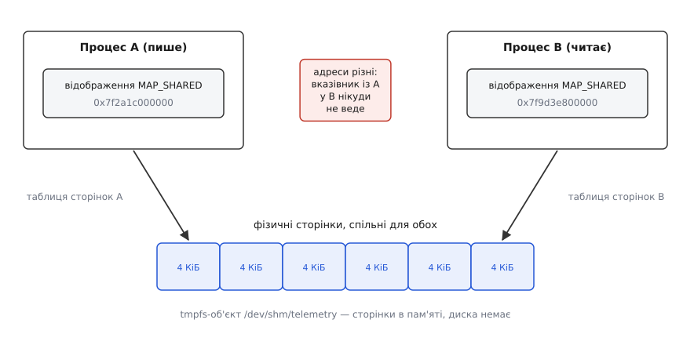
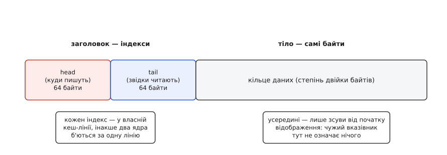
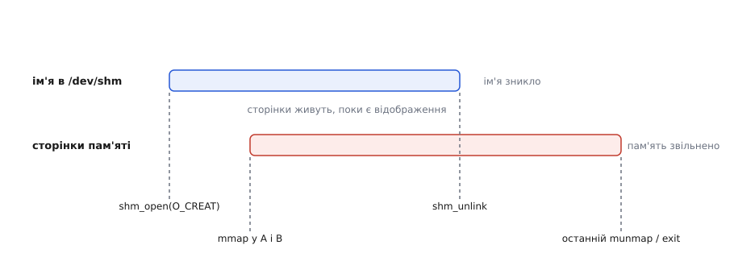

# Спільна пам'ять POSIX

<preknowlist>
- [Віртуальний адресний простір](topic:sf-os/virtual-address-space) — кожен процес бачить власні адреси, а ядро вирішує, на які фізичні сторінки вони вказують.
- [mmap: файл і пам'ять як одне](topic:sys-unix/mmap-model) — відображення об'єкта в адресний простір; різниця між MAP_SHARED і MAP_PRIVATE.
- [Файловий дескриптор](topic:sys-unix/file-descriptor) — число, за яким процес тримає відкритий об'єкт ядра.
- [Псевдо-файлові системи](topic:sys-unix/pseudo-filesystems) — tmpfs: файлова система, що цілком живе в пам'яті, без носія.
- [Сторінковий збій](topic:sf-os/page-fault) — сторінка виділяється не на відображенні, а на першому доторку до неї.
- [Когерентність кешів](topic:hw-arch/cache-coherence) — усі ядра процесора бачать в одній комірці одне значення; порядок подій — окреме питання.
</preknowlist>

Камера віддає кадр 1920×1080 у трьох байтах на піксель — 6.2 МБ. Шістдесят разів на секунду цей кадр треба передати сусідньому процесу, який його стискає. Найпростіший спосіб — канал: один пише, другий читає.

Порахуймо, у що це обходиться. Запис у канал копіює байти з буфера процесу в буфер ядра, читання копіює їх звідти в буфер другого процесу — дві копії на кожен байт. Це 746 МБ щосекунди чистого пересування пам'яті, яке нічого не обчислює. Гірше інше: кадр не проходить одним рухом — і той, хто пише, і той, хто читає, працюють буферами розміром із місткість каналу, типово 64 КіБ. Один кадр розпадається приблизно на сто записів і сто читань, і на секунду набігає близько дванадцяти тисяч системних викликів. Кожен виштовхує з кешу процесора корисні дані й замінює їх байтами, які через мить уже не потрібні.

Копіювання тут не побічний ефект, а сама суть механізму: канал, сокет, черга повідомлень передають **вміст**. А хотілося б передати не вміст, а доступ — щоб другий процес читав ті самі байти там, де їх поклав перший.

## Чому це взагалі можливо

Адреса в програмі — не адреса в мікросхемі пам'яті. Процесор звертається за віртуальною адресою, а таблиці сторінок перекладають її у фізичну. Ізоляція процесів тримається саме на цьому: у кожного власна таблиця, і немає віртуальної адреси, якою один процес дотягнувся б до сторінок другого.

Але це відображення — просто таблиця. Ніщо не забороняє зробити так, щоб запис у таблиці процесу A і запис у таблиці процесу B вказували на **одну й ту саму фізичну сторінку**. Тоді запис за адресою в A фізично змінює ту саму комірку, яку B бачить за своєю адресою. Ніякого копіювання не відбувається взагалі — його просто нема між чим і чим робити.



*Два процеси відображають один tmpfs-об'єкт: фізичні сторінки спільні, а віртуальні адреси в кожного свої.*

Один спосіб влаштувати таке спільне відображення дає [fork](topic:sys-unix/fork-semantics): якщо до розгалуження зробити `mmap` з прапорцями `MAP_SHARED | MAP_ANONYMOUS`, дитина успадкує відображення, і батько з дитиною ділитимуть ті самі сторінки. Але це працює тільки для родичів. Два незалежні процеси — знятий кадр камери й окремо запущений кодувальник — спільного предка не мають, і успадкувати їм нема від кого. Їм потрібно **домовитися про назву**: сказати ядру «дай мені ту саму пам'ять, що й тому, іншому».

А про назви в Unix домовляються через файлову систему. Звідси й весь інтерфейс: у пам'яті заводять іменований об'єкт, відкривають його за іменем, дістають дескриптор — і відображають дескриптор у свій адресний простір. Цей об'єкт і називають спільною пам'яттю POSIX; функція, що його відкриває, — `shm_open` (від *shared memory*).

## Як це виглядає в коді

У Linux `shm_open` не є окремим системним викликом: бібліотека просто робить `open` у каталозі `/dev/shm`, де змонтована [tmpfs](topic:sys-unix/pseudo-filesystems) — файлова система без носія, чиї «файли» і є сторінками пам'яті. Тому спільна пам'ять POSIX у Linux не має власної реалізації в ядрі: це звичайний файл у пам'яті, відображений з `MAP_SHARED`. Усе, що ви знаєте про файли — права, власника, `stat`, `ls` — до нього застосовне буквально.

Створення проходить у три кроки, і кожен потрібен.

```c
#include <fcntl.h>
#include <sys/mman.h>
#include <unistd.h>
#include <stdlib.h>

struct region {
    _Atomic unsigned long seq;   /* лічильник версій кадру */
    unsigned char frame[6220800];
};

struct region *r;
int fd = shm_open("/telemetry", O_CREAT | O_RDWR, 0600);
if (fd < 0) exit(1);
if (ftruncate(fd, sizeof *r) < 0) exit(1);          /* задати розмір */
r = mmap(NULL, sizeof *r, PROT_READ | PROT_WRITE,
         MAP_SHARED, fd, 0);
if (r == MAP_FAILED) exit(1);
close(fd);                                           /* більше не потрібен */
```

Ім'я починається зі скісної риски й далі не містить рисок узагалі — це вимога стандарту, бо ім'я має однаково лягати на різні реалізації; довжина обмежена так само, як у файлового імені, — 255 символів. Права `0600` означають рівно те саме, що для файлу: доступ до сегмента контролюють звичайні права Unix, і чужий користувач у вашу пам'ять не потрапить. Як і для файлу, ці біти ще й обрізає `umask` процесу.

Щойно створений об'єкт має **нульову довжину** — тому й потрібен `ftruncate`. Це не формальність: якщо відобразити більше, ніж об'єкт займає, доступ до сторінок за його межею дасть не помилку виділення, а сигнал `SIGBUS` посеред звичайного розіменування вказівника. Нові байти після `ftruncate` завжди нульові, тож на порожній сегмент можна покладатися як на обнулений.

Дескриптор після `mmap` уже не потрібен — відображення тримає об'єкт саме, тож закрити його варто одразу, щоб не тягти за собою зайвого. Другий процес відкриває той самий сегмент без `O_CREAT`, дізнається розмір через `fstat` і відображає його так само.

> 🔧 **Навіщо це.** Найчастіше спільна пам'ять потрібна не заради «швидко», а заради **сталої затримки**. Копіювання шести мегабайтів через ядро займає різний час залежно від навантаження й стану кешів; читання з уже відображеної сторінки — ні. Там, де кадр мусить дійти до кодувальника за передбачуваний час, важить саме друге.

Прапорець `MAP_SHARED` тут не оздоба, а власне суть. Той самий об'єкт можна відобразити й з `MAP_PRIVATE` — і все начебто працюватиме: читання покаже спільні дані. Але перший же ваш запис спрацює [копіюванням при записі](topic:sf-os/copy-on-write): ядро зробить особисту копію сторінки, і далі ви правитимете її, а сусід — оригінал, обидва в переконанні, що спілкуються. Помилка неприємна тим, що не дає жодної діагностики: дані просто тихо розходяться.

Відображення переживає [fork](topic:sys-unix/fork-semantics) — дитина дістає його як є, і спільне лишається спільним (саме тому `MAP_SHARED | MAP_ANONYMOUS` працює між родичами без жодного імені). А от [exec](topic:sys-unix/exec-semantics) знищує весь адресний простір разом з усіма відображеннями: після заміни образу пам'ять доведеться відкривати й відображати наново. Пережити `exec` може лише дескриптор — і то якщо з нього зняти `FD_CLOEXEC`, який `shm_open` ставить за замовчуванням.

## Адреси в двох процесах різні

`mmap` повертає адресу, яку ядро обрало у **вашому** адресному просторі. У сусіда та сама сторінка майже напевно ляже за іншою адресою: у нього інший набір відображень, а [рандомізація адресного простору](topic:sys-unix/address-space-randomization) навмисно розкидає їх щоразу по-новому.

Наслідок жорсткий: **у спільній пам'яті не можна зберігати вказівники**. Вказівник, записаний процесом A, у процесі B вказує в порожнечу або, що гірше, у щось чуже й цілком дійсне. Тому всередині сегмента посилаються лише **зсувами від його початку** — а справжню адресу кожен процес рахує сам, додавши зсув до власної бази.

Із того самого тягнеться решта обмежень на вміст. У сегменті не місце нічому, що всередині себе тримає вказівники: ні рядкам зі стандартної бібліотеки C++, ні структурам із таблицею віртуальних методів, ні деревам із динамічною пам'яттю. Кладуть туди тільки плоскі дані з наперед домовленим розкладом — фіксовані цілі, масиви, зсуви. Обидві програми мають однаково розуміти вирівнювання й розмір полів, інакше два боки читатимуть різні байти під одним іменем.



*Типовий сегмент: невеликий заголовок з індексами й велике тіло даних; індекси розводять по окремих кеш-лініях.*

Розкладка заголовка коштує більше, ніж здається. Два лічильники, оголошені поруч, потрапляють в одну кеш-лінію — і два ядра починають відбирати цю лінію одне в одного, хоч кожне торкається своєї змінної. Це [хибне спільне використання кеш-лінії](topic:hw-arch/false-sharing), і платять за нього десятками наносекунд на кожну операцію. Тому індекс запису й індекс читання розсувають на цілу лінію, навіть коли в них разом вісім байтів.

## Спільні байти — це ще не домовленість

Ядро гарантує, що обидва процеси бачать одні й ті самі байти. Воно **не** гарантує нічого про порядок, у якому ці байти з'являються.

Джерел безладу два, і вони різні. Перше — сам процесор: [когерентність кешів](topic:hw-arch/cache-coherence) дбає, щоб два ядра не бачили в одній комірці різних значень, але не про те, в якому порядку до чужого ядра дійдуть записи в **різні** комірки. Друге — компілятор, який має повне право переставити незалежні (з його погляду) записи місцями або взагалі тримати значення в регістрі, поки вважає за потрібне.

Тому послідовність «записав кадр — потім підняв лічильник» без спеціальних заходів не є послідовністю: читач цілком може побачити новий лічильник над старим кадром. Лікується це не хитрощами, а [впорядкуванням пам'яті](topic:sf-tasks/memory-ordering-barriers): запис лічильника роблять атомарним із семантикою випуску (*release*), читання — із семантикою захоплення (*acquire*). Тоді все, що записано **до** випуску, гарантовано видно тому, хто побачив нове значення при захопленні. Мова тут майже не важить: `_Atomic` у C, [`std::atomic`](topic:sys-plang-cpp/std-atomic) у C++ і атомарні операції ядра описують ту саму апаратну річ.

Другий поверх домовленості — взаємне виключення, коли структуру не можна оновити одним атомарним записом. М'ютекс для цього кладуть **усередину самого сегмента** і створюють із атрибутом `PTHREAD_PROCESS_SHARED` — інакше він придатний лише для потоків одного процесу. Тут же вилазить проблема, якої в потоках немає: процес може вмерти, тримаючи замок, і сегмент лишиться замкненим назавжди. Відповідь — «живучий» м'ютекс (`PTHREAD_MUTEX_ROBUST`): наступний охочий дістає з `pthread_mutex_lock` код `EOWNERDEAD` і зобов'язаний або полагодити структуру, або оголосити її непридатною. Іменовані семафори й спільні м'ютекси розібрано окремо — [синхронізація між процесами](topic:sys-unix/process-shared-sync).

І третій поверх — очікування. Спільна пам'ять сама по собі німа: у ній нема на чому заснути, і читач, який хоче дізнатися про новий кадр, може лише крутити цикл, спалюючи процесор. Тому поруч із сегментом майже завжди тримають окремий засіб сповіщення — [eventfd або futex](topic:sys-unix/eventfd-and-futex); перший ще й вставляється в `epoll` разом із рештою джерел подій. Робочий кільцевий буфер, де все це зведено докупи — атомарні індекси, розведення по кеш-лініях, пробудження читача й поведінка при переповненні, — розібрано у вставці [кільце на двох процесів](topic:sys-unix/posix-shared-memory/proj-shm-ring.md).

## Життя імені й життя пам'яті — різні

Це найчастіше джерело несподіванок. Ім'я в `/dev/shm` і самі сторінки живуть окремо.

`shm_unlink` прибирає **ім'я**: новий процес відкрити сегмент за ним уже не зможе. Сторінки при цьому не зникають — вони живуть, доки їх тримає хоч одне відображення або хоч один відкритий дескриптор, і звільняються після останнього `munmap` чи завершення останнього процесу. Це рівно та сама механіка, що й [жорсткі посилання](topic:sys-unix/hard-and-symbolic-links) зі звичайним файлом: видалили ім'я — вміст ще при тих, хто його відкрив.



*shm_unlink обриває ім'я, але сторінки живуть, поки їх хтось відображає.*

Із цього випливає дуже зручний прийом: щойно всі учасники відкрили сегмент за іменем, творець робить `shm_unlink`, не чекаючи кінця роботи. Ім'я зникає **одразу**, відображені сторінки живуть далі, а після виходу останнього учасника пам'ять піде сама. Так гасять головну ваду іменованих об'єктів: на відміну від анонімної пам'яті процесу, сегмент **переживає падіння** свого творця. Впала програма — а `/dev/shm/telemetry` лишився займати місце, і його там побачить `ls`, і при наступному запуску вона підхопить старий сегмент із залишками чужого стану замість чистого. Тому запуск або створює сегмент із `O_CREAT | O_EXCL` (щоб побачити, що він уже є, і свідомо це обробити), або починає з `shm_unlink` попереднього.

## Спільна пам'ять — це спільна довіра

Через канал сусід передає вам **копію**: прочитали — байти ваші, і ніхто їх уже не змінить. Спільна пам'ять цієї властивості не має принципово. Байт, який ви щойно перевірили, наступної миті може бути іншим — сусід пише в ту саму комірку паралельно.

Тому класична схема «перевірив довжину — потім за нею скопіював» тут ламається: між перевіркою і використанням значення встигає змінитися, і копіювання виходить за межі буфера. Правило одне: спочатку **зчитати значення до себе** (в локальну змінну, атомарним читанням), і далі перевіряти й використовувати вже свою копію, до спільної пам'яті більше не звертаючись.

Із цього тягнеться й архітектурний висновок. Спільну пам'ять розділяють лише з тим, кому довіряють як собі: сусід, який має право писати в сегмент, фактично має право псувати ваш стан. Через межу довіри дані передають механізмами з копіюванням — [сокетами домену Unix](topic:sys-unix/unix-domain-sockets) чи каналами, — а якщо конче потрібна швидкість, то сегментом **лише для читання** з боку меншого привілею: `shm_open` з `O_RDONLY` і `mmap` з `PROT_READ` дають саме таку однобічну домовленість.

## Скільки її можна взяти

Оскільки `/dev/shm` — це tmpfs, обмеження в неї файлово-системні. Типово Linux монтує її з межею в половину оперативної пам'яті, і `df /dev/shm` цю межу показує; вичерпали — `ftruncate` поверне `ENOSPC`. У контейнерах ця межа зазвичай значно менша (Docker типово дає 64 МіБ), і несподіваний `ENOSPC` там — звична пригода.

Сторінки tmpfs — звичайні сторінки кешу, тож вони **можуть піти у своп**, якщо своп є і система під тиском; це відрізняє їх від закріпленої пам'яті. В обліку сегмент видно як `shmem`; у кожного процесу, що його відобразив, спільні сторінки повністю входять у RSS, тому проста сума RSS по процесах рахує ту саму пам'ять кілька разів — правдиву картину дає PSS, який ділить спільні сторінки між тими, хто їх тримає ([як міряти пам'ять процесу](topic:sys-unix/memory-accounting)). І пам'ятайте, що `ftruncate` лише задає розмір: фізичні сторінки з'являться на [першому доторку](topic:sf-os/page-fault) до кожної з них, тож справжнє споживання росте поступово.

> 🔧 **Навіщо це.** Коли служба «тече пам'яттю», а сума по процесах не сходиться з `free`, перше, куди варто глянути, — `ls -l /dev/shm` і `df /dev/shm`. Забуті сегменти після падінь виглядають саме як пам'ять, що зникла нізвідки й нікому не належить.

## Родичі й альтернативи

Іменований об'єкт у `/dev/shm` — не єдиний спосіб. Коли учасники вміють обмінятися дескриптором (наприклад, через сокет домену Unix), ім'я взагалі не потрібне: `memfd_create` робить безіменний файл у пам'яті, який далі відображають так само, а «пломби» (*seals*) дозволяють ще й заборонити зміну розміру чи вмісту — щоб отримувач міг покластися на буфер, який йому дали. Саме так передають кадри Wayland і сучасні мультимедійні стеки; докладніше — [memfd_create і пломби](topic:sys-unix/memfd-create).

Якщо ж вміст має пережити перезавантаження, спільним відображенням може бути й **звичайний файл** на диску, відкритий і відображений з `MAP_SHARED`: механіка та сама, тільки сторінки належать кешу справжньої файлової системи, а не tmpfs.

Історично першим у Unix був зовсім інший інтерфейс — System V IPC з `shmget`, числовими ключами замість імен і власним простором об'єктів поза файловою системою. Він досі працює в Linux, досі показується в `ipcs` і досі трапляється в старому коді. Чому POSIX відмовився від ключів на користь дескрипторів і чим це обернулося на практиці — [дві спільні пам'яті: System V і POSIX](topic:sys-unix/posix-shared-memory/hist-sysv-vs-posix.md).
