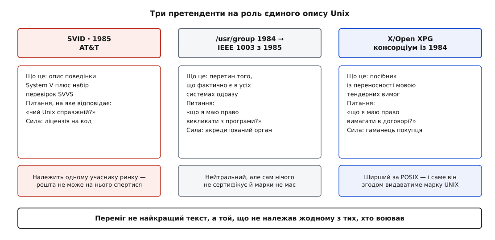
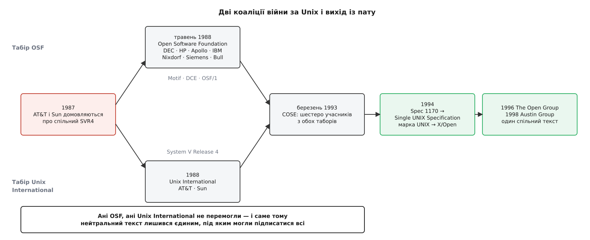

# 📜 Стандарт, писаний під час війни за Unix

POSIX читається як документ, що його склали спокійні інженери, аби навести лад. Насправді це мирна угода, і майже кожна її риса — слід комерційного протистояння, у якому жодна сторона не могла перемогти. Історія тут не прикраса: вона пояснює, чому текст описує наявне замість того, щоб приписувати належне, і звідки в ньому стільки місць, де він свідомо нічого не обіцяє.

## Спільнота, яка втомилася чекати

Перший текст написали не виробники й не інститут стандартизації, а користувачі.

1980 року в США виникла асоціація `/usr/group` — об'єднання компаній та інженерів, які будували продукти на Unix і щодня натикалися на те, що дві машини з написом «Unix» поводяться по-різному. Розходження мали цілком буденну причину: AT&T роздавала систему за ліцензією, кожен ліцензіат допилював її під своє залізо, а тексту, який казав би «ось на це можна покластися», не було ні в кого. Як саме Unix розійшовся на дві великі лінії — берклівську й AT&T-івську — і чому кожна з них обросла власними нащадками, розбирає [родовід Unix](topic:sys-unix/unix-lineage).

1981 року асоціація створила комітет зі стандартизації, а в січні 1984-го він видав текст, який так і звався — *`/usr/group` Standard*. Це був перелік системних викликів і бібліотечних функцій, які реально є всюди, з описом того, що вони роблять. Не проєкт ідеальної системи, а зріз спільного перетину практики. Спосіб мислення, який потім успадкує POSIX, з'явився вже тут: **стандарт — це не задум, а протокол про те, про що вже домовилися**.

Ось тільки асоціація користувачів не має влади. Її документ ні до чого не зобов'язував, і виробники могли просто його не помітити.

## Комітет, що успадкував чужий текст, і назва, яку дав чужинець

1985 року робота комітету `/usr/group` перейшла до Інституту інженерів електротехніки та електроніки (Institute of Electrical and Electronics Engineers, IEEE) — під номером проєкту 1003, звідси й уся подальша нумерація POSIX. Це була зміна не змісту, а ваги: IEEE — акредитований орган стандартизації, його документ можна вписати в державний тендер, і на нього можна послатися в суді. Текст лишився той самий, за ним стала стояти інституція.

Того ж 1985 року AT&T випустила свою відповідь — *System V Interface Definition* (SVID), опис того, як поводиться System V, з випробувальним набором *System V Verification Suite* (SVVS) на додачу. Логіка була прозора: справжній Unix — це наш Unix, ось його опис, ось перевірка, і за ліцензією на System V Release 3 виробник мусив цю перевірку пройти, перш ніж щось продавати. Ідеальний стандарт з погляду власника коду й нікчемний із погляду всіх інших, бо стандарт, який належить одному учаснику ринку, — це не стандарт, а [прив'язка до постачальника](topic:sys-bsystem/vendor-lock-in): правила пише той, у кого ви й так купуєте.

Тому саме нейтральність, а не якість, зробила лінію IEEE переможною. І тут же стався епізод, який добре показує, наскільки ця нейтральність була для всіх принциповою.

Комітет збирався назвати документ **IEEE-IX** — щоб натякнути на Unix, не називаючи марки. Річард Столлмен (Richard Stallman), який на той час уже кілька років будував [вільний інструментарій GNU](topic:sys-unix/gnu-userland) як заміну Unix, запропонував іншу назву: узяти початкові літери слів *portable operating system* і додати «ix» — вийшло **POSIX**. Комітет пристав. За власним свідченням Столлмена (інтерв'ю 2019 року — свідчення учасника, підтверджене матеріалами IEEE і The Open Group), мотивів було два: «IEEEIX» огидно вимовляється, «наче зойк жаху», а головне — таку назву люди все одно скорочували б до «Unix», а він робив систему, яка мала Unix замінити, а не рекламувати.

Дрібниця з назвою, але вона показова: у документі не мало лишитися нічиєї марки. Перше видання **IEEE Std 1003.1** вийшло 1988 року і описувало інтерфейси мовою C; редакція 1990 року (затверджена радою IEEE 28 вересня, видана 7 грудня 1990-го) стала міжнародним стандартом **ISO/IEC 9945-1:1990**; мову оболонки й утиліти окремим документом POSIX.2 видали 1992 року.

## Європейська лінія: стандарт з боку покупця

Паралельно й майже незалежно точилася друга лінія — і починалася вона не з інженерної, а з закупівельної проблеми.

1984 року кілька європейських виробників — Bull, ICL, Siemens, Olivetti та Nixdorf (за першими літерами їх називали BISON) — заснували консорціум **X/Open**; 1987 року він оформився як X/Open Company Ltd. Європейські компанії продавали техніку урядам і великим корпораціям, а ті ставили просте питання: якщо ми купимо ваші машини, чи зможемо ми потім купити чужі й не переписувати софт? Відповідь мала бути документом, який покупець може вписати в умови тендера.

Так з'явився *X/Open Portability Guide* (XPG) — посібник із переносності, що виходив редакціями: XPG1 1985 року (базові інтерфейси системи, C і COBOL), XPG2 1987-го (додано інтернаціоналізацію й міжпроцесову взаємодію), XPG3 на межі десятиліть, близько 1989–1990 років (точну дату джерела подають по-різному; суть та сама — зближення з POSIX), XPG4 у липні 1992-го. До 1988 року в X/Open було вже тринадцять учасників, серед них AT&T, Digital, Hewlett-Packard і Sun — тобто американські гіганти прийшли до європейського консорціуму, а не навпаки.

Різниця між двома лініями не в термінах, а в тому, чиє питання вони розв'язували. IEEE відповідав програмісту: **що я маю право викликати**. X/Open відповідав покупцеві: **що я маю право вимагати в договорі**. Тому XPG був ширший — він накривав POSIX і додавав те, чого покупцеві бракувало, — і тому саме він згодом виявився придатним для того, чого IEEE не робив ніколи: для видачі марки.

*Три тексти, три різні власники й три різні відповіді на питання «хто вирішує, що таке Unix».*

## Союз, від якого злякалися всі

Доти йшлося про папери. Війна почалася 1987 року, коли AT&T — власниця Unix — і Sun Microsystems — головний носій берклівської лінії — оголосили про спільну роботу над єдиною системою. Результатом мав стати (і став) System V Release 4: System V, у який вливають найкраще з BSD і з SunOS.

З інженерного боку це була добра новина: дві розбіжні лінії нарешті сходилися в одну. З комерційного — катастрофа для всіх інших. Виходило, що майбутній єдиний Unix визначатимуть удвох власник ліцензії й один із виробників заліза, а решта отримуватиме готове рішення й ліцензійні умови від прямого конкурента.

Реакція була швидкою. У січні 1988 року Digital Equipment Corporation скликала закриту нараду виробників у своєму офісі на Hamilton Avenue в Пало-Альто — за адресою учасників потім і називали «Hamilton Group»; ініціатором зустрічі документи називають Армандо Стеттнера (Armando Stettner) з DEC. У травні 1988-го з цієї наради виріс консорціум **Open Software Foundation** (OSF) — семеро засновників: Digital, Hewlett-Packard, Apollo Computer, IBM, Nixdorf, Siemens і Groupe Bull. Мета формулювалася прямо: збудувати Unix-подібне середовище, не залежне від коду AT&T.

Відповідь надійшла того ж 1988 року: AT&T і Sun разом із союзниками заснували **Unix International** (UI) — організацію, чиїм фактичним призначенням було просувати System V Release 4 і врівноважувати OSF.

Так на кілька років ринок отримав дві коаліції, кожна зі своїм «відкритим» майбутнім. OSF випустила віконний інструментарій Motif, середовище розподілених обчислень DCE й власне ядро OSF/1; UI просувала SVR4. Обидві називали себе відкритими, обидві звинувачували одна одну в захопленні ринку — і жодна не мала сили нав'язати свій варіант решті.

## Чому пат виявився кориснішим за перемогу

Тут — головна причинова ланка всієї історії, і її легко проґавити.

Якби перемогла AT&T, стандартом став би SVID — опис однієї реалізації, що належить одній компанії. Якби перемогла OSF, стандартом став би OSF/1 — те саме, тільки семеро власників замість одного. У будь-якому з цих двох світів «стандартом» звався б чийсь продукт, а незалежний текст був би нікому не потрібен.

Стандарт вижив саме тому, що ніхто не переміг. Поки коаліції нейтралізували одна одну, єдиним місцем, де всі могли підписатися під спільним текстом, лишалися IEEE та X/Open — структури, які не продавали систем. **POSIX став не результатом доброї волі, а єдиним доступним виходом із пату.**

Ціна такої позиції — форма самого документа. Комітет, у якому сидять представники ворожих таборів, не може постановити, що правильна поведінка `signal()` — берклівська: половина учасників представляє системи з іншою. Не може він і викинути обидві. Лишається третій хід, дипломатичний: записати, що поведінка **визначається реалізацією**, зобов'язати кожного її задокументувати — і поруч запропонувати новий, однозначний механізм, на який усі згодні перейти. Саме так у стандарті з'явилася `sigaction()`.

> 🔧 **Навіщо це.** Читаючи в стандарті «implementation-defined» чи «unspecified», корисно чути в цьому не інженерну недбалість, а протокол розбіжності: у цьому місці системи вже розійшлися до того, як текст писався, і комітет чесно зафіксував, що спільної відповіді немає. Тому такі місця не «виправлять у наступній редакції» — їх обходять новим механізмом, а старий лишають описаним.

Тим часом війна робила з ринком те, чого не хотіла жодна сторона. Поки виробники Unix ділили спадщину, Microsoft із Windows NT заходила саме туди, де Unix почувався вдома, — у робочі станції й корпоративні центри обробки даних. Це пояснення того, що сталося далі, не є формальним фактом із документа, але його одностайно наводять і тогочасні учасники, і пізніші історики галузі.

## 1170 викликів, яких ніхто не міг оскаржити

17 березня 1993 року Hewlett-Packard, IBM, The Santa Cruz Operation, Sun Microsystems, Univel і UNIX System Laboratories — тобто вчорашні супротивники з обох таборів — спільно оголосили ініціативу **COSE** (Common Open Software Environment, спільне відкрите програмне середовище). 1 вересня того ж року вони оголосили про роботу над єдиною специфікацією Unix за підтримки понад сімдесяти п'яти компаній.

Спосіб, у який COSE визначала зміст цієї специфікації, — найцікавіше місце всієї історії. Замість того, щоб сперечатися, чий інтерфейс правильніший, узяли велику вибірку **справжніх прикладних програм** і подивилися, що вони насправді викликають. Вийшло 1170 системних і бібліотечних викликів. Документ так і назвали робочою назвою — **Spec 1170**.

Прийом простий і безвідмовний. Питання «чий Unix кращий» не має відповіді, з якою погодяться обидва табори. Питання «що фактично вживає прикладний код» має рівно одну відповідь, і вона не належить нікому — її можна тільки виміряти. Стандарт вивели з поведінки користувачів, а не з позицій постачальників, і тому він виявився неоскаржуваним.

*Ані OSF, ані Unix International не перемогли: обидві розчинилися в структурах, які нічого не продавали.*

## Марка, відрізана від коду

Далі сталася річ, що остаточно змінила сенс слова UNIX.

Ліцензія й марка на той час належали Novell (яка придбала UNIX System Laboratories у AT&T). У жовтні 1993 року оголосили передачу торгової марки **UNIX** нейтральному X/Open; юридично її завершили в другому кварталі 1994-го. 1994 року X/Open видала на основі Spec 1170 **Single UNIX Specification**, а 1995-го запустила програму сертифікації під маркою **UNIX 95**.

Наслідок радикальний: **UNIX перестав бути назвою коду й став назвою відповідності**. Доти «справжній Unix» означало «походить від коду AT&T». Відтоді це означає «пройшов випробувальні набори на відповідність специфікації, хоч би з якого коду був зроблений». Марку відрізали від походження й прив'язали до поведінки — саме тому пізніше сертифікат UNIX змогли отримати системи, що не мають ані рядка коду AT&T.

Коаліції війни доживали свій вік уже без ролі. У березні 1994 року Unix International влилася в оновлену OSF, а 1996-го OSF і X/Open об'єдналися в **The Open Group** — організацію, яка володіє маркою UNIX і донині.

## Австін: два тексти сідають за один стіл

Лишалася остання розбіжність — не між компаніями, а між паперами. IEEE вів свій POSIX, The Open Group — свою Single UNIX Specification, і обидва описували те саме, розходячись у дрібницях. Тобто та сама хвороба, з якої все почалося, тільки на рівень вище.

Розмови про злиття почалися на початку 1998 року, а у вересні 1998-го відбулася перша зустріч — у приміщенні IBM в місті Остін, штат Техас. За містом групу й назвали: **Austin Group**. У липні 1999 року The Open Group та IEEE підписали формальну угоду, і робота пішла над одним текстом. Перший спільний результат — редакція 2001 року (Issue 6), вона ж POSIX.1-2001, вона ж SUSv3: рада IEEE-SA затвердила її 6 грудня 2001-го, друком вона вийшла 30 січня 2002 року.

З того часу текст пишуть один раз, а видають одночасно під трьома назвами: як стандарт IEEE, як стандарт The Open Group і як міжнародний ISO/IEC. Участь в Austin Group безкоштовна й відкрита, і чинних учасників близько п'ятисот.

## Що війна лишила в тексті

Кінець історії дає ключ до всього документа.

Стандарт **описовий, а не приписовий**, бо народився як фіксація перетину, а не як задум: спершу перетин практики в `/usr/group`, потім перетин реального вжитку в Spec 1170. Він **завжди позаду практики**, бо в нього беруть лише те, що вже пережило кілька незалежних реалізацій, — інакше комітет із учасників-конкурентів просто не дійде згоди. Він **щедрий на свідомо вільні зони**, бо кожна така зона — це місце, де двом таборам довелося зафіксувати незгоду замість того, щоб одному поступитися. І він **описує поведінку, а не будову**, бо жоден із учасників не погодився б стандартизувати чиюсь архітектуру — а зовнішній інтерфейс можна описати, не роблячи нікого переможцем.

Це не вади документа й не наслідок обережності його авторів. Це форма, яку може мати єдиний текст, під яким одночасно підписалися сторони, що воювали одна з одною десять років.
