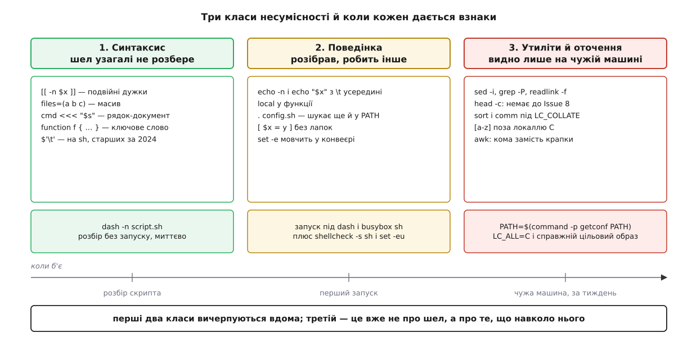
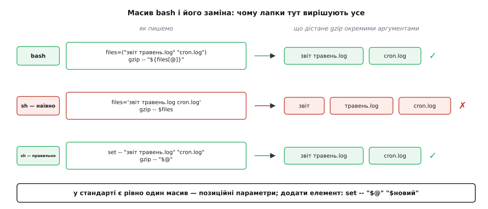

# ⚙️ Скрипт, що переживе переїзд: із bash у POSIX sh

> Тут ми беремо звичайний робочий bash-скрипт і рядок за рядком перетворюємо його на такий, що однаково працює під `dash`, `busybox sh` і на BSD-машині, — не заради чистоти, а тому що на цільовій системі bash може просто не бути. Заразом стане видно, скільки саме коштує кожна зручність bash і в який момент дешевше визнати, що задача переросла оболонку.

## Скрипт, який працює лише вдома

Ось `collect-logs.sh` — збирач журналів, який хтось написав на своєму Ubuntu й туди ж і поклав. Він проходить перелік служб, вибирає з їхніх журналів рядки про помилки, затирає токени й пакує все в архів:

```sh
#!/bin/bash
set -e
source ./collect.conf          # SERVICES=(nginx postgres), OUT_DIR=…

collect() {
    local svc=$1
    local dir=/var/log/$svc
    [[ -d $dir ]] || { echo "нема каталогу $dir"; return 1; }

    local files=()
    for f in "$dir"/*.log; do
        [[ -f $f ]] && files+=("$f")
    done

    echo -n "· $svc: ${#files[@]} файлів … "
    grep -P '^\d{4}-\d{2}-\d{2}.*\b(ERROR|FATAL)\b' "${files[@]}" \
        | sed -E 's/(token=)[^ ]+/\1***/g' \
        | sort > "$OUT_DIR/$svc.txt"
    echo "готово"
}

which zstd >/dev/null || { echo "нема zstd"; exit 1; }
OUT_DIR=$(readlink -f "$OUT_DIR")
for svc in "${SERVICES[@]}"; do collect "$svc"; done
tar cf - -C "$OUT_DIR" . | zstd -q -o "report-$(date +%Y-%m-%d).tar.zst"
```

Скрипт справний. Він падає рівно тоді, коли його кладуть кудись іще: у контейнер на Alpine, у складальник на FreeBSD, у initramfs рятувального образу, у зібраний із `busybox` образ, де вся оболонка — один аплет усередині єдиного двійкового файлу.

Перша спокуса — сказати «то нехай ставлять bash». Вона розв'язує менше, ніж здається. По-перше, рядок `#!/bin/bash` — це не прохання, а точний шлях: на BSD bash живе в `/usr/local/bin/bash`, і рядок просто не спрацює. По-друге, bash сам має версії, і найгірша з них та, що досі в обігу: Apple постачає останній випуск bash під ліцензією GPLv2 — версію 3.2, випущену ще 2006 року — і 2019-го (macOS Catalina) взагалі зробила типовою оболонкою zsh, щоб не тягнути новіший bash під GPLv3. Тож `#!/bin/bash` на маку означає мову середини двохтисячних: ні асоціативних масивів, ні `${var^^}` — і те, і те прийшло аж із bash 4.0 у 2009-му. Одне питання переносності перетворилося на два.

Другий шлях — писати те, що описано в стандарті, і покладатися на `#!/bin/sh`. Це не «спрощений bash»: це інша, менша мова, і перекласти скрипт з однієї на другу — робота, а не заміна кількох символів. Але робота скінченна, і вона розкладається на три різні за характером класи.

## Три класи несумісності

Різниця між класами не в тому, наскільки вони серйозні, а в тому, **коли й наскільки голосно** кожен дає про себе знати.



*Ліворуч — те, що знаходить сам шел за секунду; праворуч — те, що знаходить замовник за тиждень. Уся стратегія переносності зводиться до того, щоб зсувати помилки вліво.*

**Перший клас — синтаксис.** Стандартний шел не може навіть розібрати рядок: `[[`, круглі дужки масиву, `<<<` для нього не мова. Скрипт помирає на розборі, ще нічого не встигнувши зробити. Це найкращий вид помилки: безкоштовний і однозначний.

**Другий клас — поведінка.** Рядок розібрався, команда виконалася, результат інший. `echo -n` десь друкує `-n` як текст, `. config.sh` завантажує геть інший файл, `[ $x = y ]` без лапок валиться на пробілі в даних. Скрипт не падає — він тихо робить не те.

**Третій клас — усе, що поза шелом.** Мова оболонки може бути бездоганною, а `sed -i` не існувати, `grep -P` бути зібраним без PCRE, а `sort` видавати інший порядок, бо в користувача інша локаль. Тут ідеться вже не про синтаксис, а про те, які програми стоять навколо і в якому оточенні вони працюють.

Далі — по класах, на матеріалі нашого скрипта.

## Клас перший: чого стандартний шел не розбере

### `[[ ]]` проти `[ ]`

Це не два написання одного й того самого. `[[` — **ключове слово** шелу: він розбирає його сам, тому всередині не відбувається ні поділу на слова, ні розкриття шаблонів, а `&&`, `||` і `=~` мають сенс операторів.

`[` — **звичайна команда** на ім'я `test`; на багатьох системах є навіть виконуваний файл `/usr/bin/[`. Її аргументи проходять усі [звичайні розкриття](topic:sys-unix/expansion-and-quoting) до того, як вона їх побачить. Звідси наслідок, який і робить заміну небезпечною: **кожну підстановку треба брати в лапки**.

```sh
x=
[ -n $x ]      # шел розкрив $x у ніщо → команда бачить [ -n ]
               # test з одним аргументом істинний, якщо аргумент непорожній;
               # «-n» непорожнє → умова ІСТИННА. Мовчазна брехня.
[ -n "$x" ]    # команда бачить [ -n "" ] → хиба, як і треба

a="звіт травень"
[ $a = x ]     # [ звіт травень = x ] → «too many arguments», падіння
[ "$a" = x ]   # правильно
```

Заразом дві дрібниці: у `[` порівняння рядків — це `=`, а не `==` (`==` розуміє bash і ще дехто, стандарт — ні); а логічні `-a` й `-o` всередині дужок стандарт радить не вживати, бо з довільними даними розбір стає неоднозначним — якщо в змінній лежить сам символ `=`, `test` не може відрізнити оператор від операнда. Замість них — дві окремі команди:

```sh
[ "$a" = x -a "$b" = y ]        # ✗ неоднозначно
[ "$a" = x ] && [ "$b" = y ]    # ✓
```

Заміни для `=~` в `test` немає взагалі. Її роль перебирає `case` — і робить це краще, бо `case` теж ключове слово, тож слово в ньому не ділиться на частини й не розкривається як шаблон:

```sh
case $svc in
    ''|*[!a-z0-9_-]*) die "недобра назва служби: $svc" ;;
esac
```

Тут `[!…]` — стандартне заперечення в шаблоні шелу (саме `!`, не `^`), а порожній варіант `''` ловить порожній рядок окремо, бо шаблон `*[!…]*` порожньому рядку не відповідає.

### Масиви й `set --`

Масив у bash існує заради однієї речі: тримати перелік, у якому елемент може містити пробіл. Звичайний рядок цього не вміє — щойно ви його розкриєте без лапок, шел поділить його по пробілах і не спитає.

У стандарті масив теж є. Рівно один: **позиційні параметри**. Їх задає `set --`, а розкриття `"$@"` віддає їх поелементно, зберігаючи пробіли всередині елементів.



*Середній рядок — типова помилка перекладу: перелік звели до рядка, і файл «звіт травень.log» розпався на два аргументи. `set --` і `"$@"` дають те саме, що `"${files[@]}"`.*

Робочий набір прийомів невеликий:

```sh
set --                       # спорожнити
set -- "$@" "$f"             # додати елемент у кінець
[ "$#" -gt 0 ]               # скільки елементів
for f in "$@"; do … done     # обійти (лапки обов'язкові!)
first=$1; shift              # зняти з початку
gzip -- "$@"                 # передати все команді
```

Дві пастки. Перша: `set --` затирає аргументи самого скрипта — якщо вони ще потрібні, збережіть їх спершу. Друга, вона ж рятівна: **у функції позиційні параметри свої**, бо аргументи функції — це і є її `$1`, `$2`. Тож `set --` усередині функції не чіпає нічого назовні, і кожна функція фактично дістає власний одноразовий масив.

Чого немає й не буде — це індексації за змінною (`${files[$i]}`) і кількох масивів водночас. Обійти можна, але саме тут починається `eval` із іменами, зліпленими з рядків, — і це надійна ознака, що скрипт варто переписати іншою мовою.

> 🔧 **Навіщо це.** Відмова від масивів виглядає як самокатування, доки скрипт не треба запустити там, де bash немає **фізично**: в initramfs, зібраному з двох мегабайтів, у контейнері `alpine` (там `/bin/sh` — це busybox), на роутері з OpenWrt, у стадії складання образу до того, як поставлено пакунки. Ціна масиву — не рядок коду, а перелік машин, на яких скрипт узагалі запуститься.

### `<<<` і `$'…'`

Рядка-документа `<<<` у стандарті немає — серед операторів перенаправлення є `<<` і `<<-`, і на цьому все. Заміни дві, і вони **не рівноцінні**:

```sh
# ✗ конвеєр запускає цикл у ПІДоболонці — n назовні лишиться порожнім
printf '%s\n' "$list" | while read -r line; do n=$((n + 1)); done

# ✓ цикл лишається в поточному шелі, n доживає до кінця
n=0
while read -r line; do n=$((n + 1)); done <<EOF
$list
EOF
```

Причина в тому, що кожна ланка [конвеєра](topic:sys-unix/pipeline-composition) — окремий процес, і присвоєння в ньому вмирає разом із ним. Перенаправлення на `done` такого процесу не породжує. Заразом: `read` майже завжди треба з `-r`, інакше він з'їдає зворотні скісні риски в даних. Якщо всередині рядка-документа розкриття не потрібні, обмежувач беруть у лапки: `<<'EOF'`.

Запис `$'\t'` — окрема історія, і рідкісний випадок, коли новина добра: редакція стандарту 2024 року його **прийняла** (§2.2.4). Але Issue 8 вийшов у червні 2024-го, а `/bin/sh` на робочих машинах старший за нього на роки, тож поки цільовий перелік не звужено до свіжих систем, надійніше будувати такі рядки через `printf`:

```sh
tab=$(printf '\t')                 # табуляція — просто

nl=$(printf '\nx'); nl=${nl%x}     # перенос рядка — з хитрістю
```

Хитрість потрібна тому, що підстановка `$(…)` зрізає **всі** хвостові переноси рядка, тож `$(printf '\n')` дає порожній рядок. Друкуємо якір `x`, а тоді знімаємо його стандартним `${nl%x}`. Той самий перенос, до речі, можна просто написати в лапках буквально — це теж переносно:

```sh
IFS='
'
```

Решта першого класу — дрібниці однієї заміни: `function f { … }` → `f() { … }`; `((i++))` і `let` → `i=$((i + 1))` (сама арифметика `$(( ))` у стандарті є); `${var/a/b}` і `${var:2:3}` → `sed` або звичайні `${var#…}`, `${var%…}`, `${var:-…}`, `${#var}`, які стандартні.

## Клас другий: розібралося, робить інше

### `echo` не полагодити — його треба покинути

Стандарт про `echo` каже дві речі. Перша: «реалізації не повинні підтримувати жодних ключів». Друга: якщо перший операнд — дефіс із літерами `n`, `e` або `E`, результат визначає реалізація. А на системах з XSI `echo` ще й **сам обробляє зворотні скісні риски у своїх операндах**.

Практично це означає ось що:

```sh
p='C:\temp\new'
echo "$p"        # bash: C:\temp\new
                 # dash: C:  emp   ew  ← \t і \n стали табуляцією й переносом
```

Скрипт не падає. Він тихо псує дані, і винен у цьому не `-n`, а звичайнісіньке `echo "$змінна"` з даними, яких автор не передбачив. Стандарт на це відповідає прямо: «новим застосункам радимо вживати `printf` замість `echo`».

```sh
printf '%s\n' "$p"          # завжди буквально, завжди з переносом
printf '· %s: %d файлів … ' "$svc" "$#"      # замість echo -n
printf '%s\n' "$@"          # кожен елемент з нового рядка — задарма
```

Останній рядок — приємний побічний ефект: якщо аргументів більше, ніж місць у форматі, `printf` **повторює формат**, доки вони не скінчаться. Це готовий спосіб надрукувати «масив».

І одне залізне правило: формат ніколи не береться зі змінної. `printf "$msg"` — та сама діра, що й `printf(msg)` у C: досить, щоб у даних трапився `%s`, і команда полізе читати аргумент, якого немає. Дані йдуть **тільки** в `%s`.

### `local`: чесна відповідь складніша за «не можна»

`local` у стандарті немає, і це не недогляд. Робоча група Austin Group розглядала пропозицію додати його (звернення 767) і в серпні 2022-го **відхилила** з формулюванням, що згоди про область видимості локальних змінних немає й досягти її не видно як. Реалізації справді розходяться: чи бачить локальну змінну функція, викликана з цієї, чи успадковує `local x` попереднє значення, чи ділиться `local x=$y` на слова.

Цікава деталь: редакція 2024 року все ж згадує `local` — у переліку імен (там же `typeset`, `declare`, `let`, `source`, `history`), ужиток яких як імені команди лишає результат **неописаним**, тобто *unspecified*, а не забороненим (§2.9.1.4). Ім'я в тексті є, поведінка за ним не закріплена. З цього випливає щонайменше одне тверде правило: **не називайте свою функцію `local`**.

Прагматично майже кожен `/bin/sh` у природі `local` таки має — і dash, і busybox ash його документують. Тому в житті трапляється два розумні вибори, і треба свідомо стати на один із них.

Якщо цільовий перелік систем відомий і `local` там є — вживайте його в найпростішій формі `local x` окремим рядком, без присвоєння в тому ж рядку. Якщо ж хочеться триматися лише описаного, є прийом, який дає більше, ніж `local`, — **функція з тілом у круглих дужках**:

```sh
abspath() (              # ← дужки, а не фігурні: усе тіло — підоболонка
    d=$(dirname -- "$1")
    b=$(basename -- "$1")
    cd -- "$d" || exit 1
    printf '%s/%s\n' "$(pwd -P)" "$b"
)
```

Круглі дужки роблять тіло функції [підоболонкою](topic:sys-unix/fork-semantics) — окремим процесом. Назовні не витікає **нічого**: ні змінні, ні змінений робочий каталог, ні `set -C`, ні пастки. Тут це навіть головне: `cd` усередині `abspath` не зрушує каталог того, хто її викликав.

Плата за це двояка. По-перше, кожен виклик — це `fork`, тобто в циклі на десять тисяч ітерацій різниця вже помітна. По-друге, і це важливіше, **функція більше не може нічого повернути в змінній** — тільки текстом у стандартний вивід і [кодом виходу](topic:sys-unix/exit-status). Ба більше: `exit` усередині такої функції завершує лише підоболонку, тож той, хто викликає, мусить сам перевірити результат — `collect "$svc" || exit 1`.

### `source` → `.`, і пастка в самій крапці

`source` — спадок csh, який підхопив bash. Стандартна форма — крапка. Але проста заміна `source config.sh` → `. config.sh` лишає гострий край: **якщо операнд не містить скісної риски, шел шукає файл у `PATH`**, а не в поточному каталозі. Bash поза режимом POSIX, не знайшовши файл у [`PATH`](topic:sys-unix/session-environment), додатково зазирає в поточний каталог — тому вдома все працює; dash так не робить, і на цільовій машині скрипт скаржиться, що конфігурації немає, хоча вона лежить поруч. А в найгіршому разі в `PATH` знайдеться чужий `config.sh`, і його виконають.

Лікування — один символ:

```sh
. ./collect.conf         # ✓ скісна риска є → шукається саме тут
```

## Клас третій: утиліти й оточення

### `which` → `command -v`

`which` у стандарті не було ніколи. На одних системах це окрема програма, на інших — скрипт для csh, і поводяться вони по-різному: деякі версії завжди повертають нуль, деякі друкують повідомлення про невдачу в стандартний вивід, тобто в те саме місце, звідки ви чекаєте шлях.

`command -v` описано в стандарті й вбудовано в шел. Воно бачить не лише файли в `PATH`, а й функції, псевдоніми та вбудовані команди — тобто відповідає саме на те питання, яке ви насправді ставите: «чи можу я викликати це ім'я?». Через це вивід не завжди шлях: для вбудованої команди це просто її ім'я. Тому вживайте його як перевірку, а не як джерело шляху:

```sh
need() {
    command -v "$1" >/dev/null 2>&1 || die "нема потрібної команди: $1"
}
need zstd
need tar
```

### Утиліти, яких немає або які інші

**`sed -i`** у стандарті відсутній, і зайвих суперечок про синтаксис можна просто не мати: GNU вимагає суфікс, приліплений до ключа, BSD — окремим аргументом. Переносно — тимчасовий файл і перейменування, до того ж **у тому самому каталозі**, щоб `mv` лишався перейменуванням у межах однієї файлової системи, а не копіюванням:

```sh
tmp=$file.tmp.$$
(set -C; : > "$tmp") || die "тимчасовий файл уже існує"
trap 'rm -f "$tmp"' EXIT INT TERM
sed 's/\(token=\)[^ ][^ ]*/\1***/g' "$file" > "$tmp" && mv -- "$tmp" "$file"
```

`set -C` (заборона перезапису наявного файла) у круглих дужках увімкнено лише на час створення; `trap … EXIT` прибирає сміття за будь-якого виходу. Зверніть увагу й на сам вираз: у базових регулярних виразах групи екрануються (`\(…\)`), а `+` не оператор — «один і більше» пишеться як `[^ ][^ ]*`. Ключ `sed -E` став стандартним лише в редакції 2024 року, хоч GNU і BSD приймали його й раніше.

Про `mktemp` варто сказати окремо: його теж **немає в стандарті**, хоч він і є майже всюди. Ім'я з `$$` передбачуване, тож прийом вище безпечний лише в каталозі, який контролюєте ви; для `/tmp`, куди пише хто завгодно, потрібен саме `mktemp` — і це той випадок, коли залежність від нестандартної утиліти виправдана.

**`grep -P`** — розширення GNU, і навіть збірка GNU може бути без PCRE. Переносний варіант — `grep -E` (розширені регулярні вирази описано в стандарті), з ручним перекладом скорочень: `\d` → `[0-9]` або `[[:digit:]]`, `\s` → `[[:space:]]`, `\w` → `[[:alnum:]_]`, межа слова `\b` — перебудовою виразу, погляд уперед — двома проходами або `awk`.

**`readlink -f`** не існує в такому вигляді: редакція 2024 року додала `readlink`, але з єдиним ключем `-n`, і в поясненні прямо сказано, що `-f` не включили, бо ту саму роботу з вибором поведінки виконує окрема утиліта `realpath`. Обидві утиліти нові, тож на системі, старшій за 2024 рік, може не бути жодної — і саме тому вище написано `abspath` на `cd` та `pwd -P` (ключ `-P` — «фізичний шлях», з розкритими [символьними посиланнями](topic:sys-unix/hard-and-symbolic-links)). Одну відмінність варто знати: `pwd -P` розкриває посилання в **каталоговій** частині шляху, тож якщо останній складник сам є посиланням, `abspath` поверне його як є, а `readlink -f` пішов би далі. Для каталогу призначення, як у нашому скрипті, цього досить; якщо ж потрібне повне розкриття до кінця, доведеться крутити цикл із `readlink` без ключів або таки вимагати `realpath`.

**`head -c`** потрапив у стандарт аж у редакції 2024 року (звернення Austin Group 407). Спокуслива заміна `cut -c` **неправильна**: `cut -c` рахує символи, а не байти, і в UTF-8-локалі це різні речі — [один символ там займає від одного до чотирьох байтів](topic:sf-data/ascii-utf8). Якщо потрібні саме байти на старій системі, лишається `dd bs=1 count=N 2>/dev/null`.

**`stat`** у стандарті немає взагалі, а синтаксис GNU і BSD розходиться повністю. Розмір файла переносно дає `wc -c < file` (саме з перенаправленням — тоді `wc` не друкує імені), а порівняння за часом зміни — `find … -newer`.

**`tar`** — і тут доведеться зробити свідомий виняток, який варто назвати вголос. Стандартний архіватор — це `pax`: редакція 2001 року викинула з тексту і `tar`, і `cpio`, лишивши натомість одну утиліту, що вміє обидва формати, і в Issue 8 так само. Тільки в природі все навпаки: `tar` є всюди — у busybox, на BSD, у будь-якому мінімальному образі, — а `pax` часто немає взагалі, і заміна зробила б скрипт **менш** придатним до переїзду. Тому нижче `tar` лишається, але як така сама зовнішня залежність, як `zstd`: перевіряється через `need` і документується як нестандартна. Правило тут не «вживати лише описане», а «знати, за що платиш»: якщо цільовий перелік систем вузький і `pax` там є, вибір може бути й протилежним.

### Локаль: код правильний, відповідь інша

Останній і найтихіший клас. Тут ламається не скрипт, а припущення про те, що таке «порядок» і що таке «літера».

**Порядок сортування** визначає `LC_COLLATE`. У локалі `C` `sort` порівнює байти. У звичайній `en_US.UTF-8` чи `uk_UA.UTF-8` glibc порівнює за правилами мови: регістр і пунктуація на першому кроці ігноруються, тож `Ябко`, `ябко` і `я-бко` стають сусідами, а порядок геть інший, ніж байтовий. Само собою це ще не біда — біда в тому, що `comm`, `join` і `uniq` **вимагають входу, відсортованого в тому самому порядку**. Відсортували в одній локалі, порівняли в іншій — і `comm` спокійно повідомить про розбіжності, яких немає.

**Діапазони в дужках.** Стандарт про це не натякає, а каже прямо: в інших локалях, ніж `C`, поведінка виразу-діапазону не визначена — застосунок не має права покладатися ні на те, чи діапазон узагалі допустимий, ні на те, який набір символів він охопить. На практиці в glibc це означає, що `[a-z]` може зловити `B`, бо в порядку зіставлення великі й малі літери переплетено. Тому:

```sh
grep '^[a-z]'                  # ✗ залежить від локалі
grep '^[[:lower:]]'            # ✓ клас символів — завжди про те, що треба
tr 'a-z' 'A-Z'                 # ✗
tr '[:lower:]' '[:upper:]'     # ✓
```

**Десяткова крапка.** `LC_NUMERIC` визначає роздільник дробової частини. У локалі на кшталт `de_DE` `printf '%.2f'` і `awk` надрукують `3,14` — і наступна ланка конвеєра, яка чекала числа, зупиниться або, гірше, прочитає `3`.

Спільний вимикач усього цього — `LC_ALL=C`: він перекриває і `LANG`, і всі окремі `LC_*`. Для скрипта, який розмовляє з програмами, а не з людьми, рядок `export LC_ALL=C` на початку — звичайне правильне рішення. Але це не безкоштовно: разом з порядком він вимикає й розуміння UTF-8, тож `grep`, `sed` і `awk` бачитимуть байти замість символів, а повідомлення утиліт стануть англійськими. Якщо скрипт обробляє живий текст або щось показує людині, точніше пригвинтити лише те, що справді має бути детермінованим — `LC_COLLATE=C` перед `sort`, `LC_NUMERIC=C` перед `awk`. Що саме змінюють ці змінні й звідки шел бере їхні значення — окрема тема про [локаль і порядок зіставлення](topic:sys-unix/locale-and-collation).

## Що вийшло

```sh
#!/bin/sh
set -eu
export LC_ALL=C

. ./collect.conf                 # SERVICES='nginx postgres', OUT_DIR=…

die()  { printf '%s\n' "$*" >&2; exit 1; }
need() { command -v "$1" >/dev/null 2>&1 || die "нема команди: $1"; }

abspath() (
    d=$(dirname -- "$1")
    b=$(basename -- "$1")
    cd -- "$d" || exit 1
    printf '%s/%s\n' "$(pwd -P)" "$b"
)

collect() (                      # тіло в дужках: змінні нікуди не витікають
    svc=$1
    case $svc in
        ''|*[!a-z0-9_-]*) die "недобра назва служби: $svc" ;;
    esac
    dir=/var/log/$svc
    [ -d "$dir" ] || die "нема каталогу $dir"

    set --                       # у функції позиційні параметри свої
    for f in "$dir"/*.log; do
        [ -f "$f" ] || continue  # шаблон без збігів лишається собою
        set -- "$@" "$f"
    done
    [ "$#" -gt 0 ] || die "$svc: жодного .log"

    printf '· %s: %d файлів … ' "$svc" "$#"

    tmp=$OUT_DIR/.$svc.$$
    (set -C; : > "$tmp") || die "тимчасовий файл уже існує"
    trap 'rm -f "$tmp"' EXIT INT TERM

    grep -E '^[0-9]{4}-[0-9]{2}-[0-9]{2}.*(ERROR|FATAL)' -- "$@" \
        | sed 's/\(token=\)[^ ][^ ]*/\1***/g' \
        | sort > "$tmp"
    mv -- "$tmp" "$OUT_DIR/$svc.txt"

    printf 'готово\n'
)

need zstd
need tar
OUT_DIR=$(abspath "$OUT_DIR")
[ -d "$OUT_DIR" ] || die "нема каталогу $OUT_DIR"

for svc in $SERVICES; do         # без лапок свідомо: імена служб без пробілів
    collect "$svc" || exit 1     # exit у підоболонці нас не зупинить — перевіряємо
done

tar cf - -C "$OUT_DIR" . | zstd -q -o "report-$(date +%Y-%m-%d).tar.zst"
```

Одна втрата залишилася чесною: `SERVICES` тепер звичайний рядок, тож пробіл в імені служби зламає цикл. Якщо він там потрібен, конфігурація може сама виконати `set -- nginx "my service"`, а скрипт — узяти `"$@"`, попередньо зберігши власні аргументи. Прийом працює, але його треба свідомо задокументувати в конфігурації — інакше наступний читач не зрозуміє, звідки в скрипті взялися позиційні параметри.

## Як перевірити, що вийшло справді переносне

**Розбір без запуску.** Ключ `-n` каже шелові прочитати скрипт і не виконувати його. Весь перший клас помилок ловиться тут за частку секунди:

```sh
dash -n collect-logs.sh
busybox sh -n collect-logs.sh
```

**Статичний аналіз.** `shellcheck -s sh` (або просто `#!/bin/sh` у першому рядку — `shellcheck` сам обере діалект) дає окреме сімейство діагностик `SC3xxx` саме зі значенням «це не в стандарті». Знайте його межу: аналізатор відстає від стандарту, тому `$'…'` він досі позначає як `SC3003`, хоч редакція 2024 року цей запис прийняла. Друга думка — `checkbashisms` із пакунка Debian `devscripts`.

**Запуск під найсуворішим шелом.** `dash` строгий, `busybox ash` іще строгіший і приходить у комплекті з найпоширенішим маленьким образом:

```sh
docker run --rm -v "$PWD:/w" -w /w alpine sh ./collect-logs.sh
```

**Стерти власне оточення.** Найтихіші помилки третього класу живуть у тому, що на вашій машині в `PATH` є `~/bin`, а `LANG` — український. Це знімається одним рядком:

```sh
env -i PATH="$(command -p getconf PATH)" HOME=/tmp LC_ALL=C dash ./collect-logs.sh
```

`env -i` починає з порожнього оточення. `command -p` виконує `getconf` типовим шляхом, гарантовано знаходячи стандартну утиліту, а `getconf PATH` віддає системний `PATH`, у якому за стандартом знаходяться всі описані утиліти. Чесна межа прийому: він викидає **ваші** доповнення до `PATH`, але не перетворює GNU-утиліти на BSD-ові — щоб побачити другий діалект `sed`, потрібна машина з ним.

**`set -eu` — пасок, а не доказ.** Обидва ключі корисні: `-u` ловить одруковані імена змінних, `-e` завершує скрипт на першій невдалій команді. Але `-e` мовчить у чотирьох дуже звичайних місцях: в умовах `if`, `while`, `&&`, `||` і після `!`; для всіх ланок конвеєра, крім останньої (це лікує `set -o pipefail`, який став стандартним лише 2024 року, тож переносним ще не є); у функції, викликаній як умова, — там `-e` вимикається на весь її час; і в записі `export FOO=$(false)`, де невдачу з'їдає успішний `export` (без `export` присвоєння `FOO=$(false)` невдачу таки поверне). Тому там, де провал справді важить, стоїть явне `|| die …`.

## Що це коштує і коли не варто

Порахуймо ціну чесно. Масиви — перебудова логіки, іноді відчутна. `local` — або довіра до нестандартного, але повсюдного вбудованого, або підоболонка з `fork` на кожен виклик і поверненням значень лише через вивід. `[[ ]]` — дисципліна лапок у кожній перевірці. Регулярні вирази — переклад скорочень руками. Разом це десь пів дня на скрипт середнього розміру і трохи багатослівніший код.

Що куплено: скрипт запускається в initramfs, в образі `alpine`, на складальнику FreeBSD і на маку з bash 3.2 — і не з ласки того, хто збирав образ. Плюс дрібниця, яку рідко згадують: dash на порядок легший за bash, і коли система під час завантаження виконує сотні скриптів, це видно секундоміром — саме тому Ubuntu ще 2006 року, а Debian 2011-го зробили `/bin/sh` посиланням на dash.

І межа, за якою переносність — хибна мета. Якщо логіці потрібні асоціативні масиви, вкладені структури, дробові числа або справжня обробка помилок — це вже не проблема переносності, а проблема мови. Скрипт на триста рядків, у якому імена змінних складають із рядків і подають в `eval`, гірший за вісімдесят рядків на Python чи маленьку програму на Go, і переносніший він теж не буде: Python на цільовій машині може бути так само відсутній, як bash, а от статично зібраний двійковий файл — ні.

Робоча межа проста. Переносний `sh` — це клей: запустити процес, посунути файл, перевірити умову, зв'язати конвеєр. Щойно скрипт починає **тримати в собі дані**, а не проводити їх крізь себе, він виріс з [оболонки](topic:sys-unix/shell-role) — і найпереносніше, що можна зробити, це визнати це вчасно.
