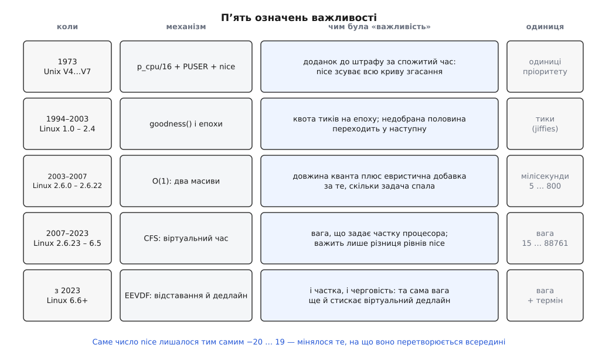

# 📜 Від ввічливості 1973 року до віртуальних дедлайнів

Число `nice` — одна з небагатьох ручок Unix, яка за пів століття не змінила ні назви, ні діапазону: як було −20…19 у 1973-му, так і лишилося донині. Змінювалося те, що під ним. У Linux змінилося чотири покоління планувальника, і щоразу разом із механізмом переписували саме поняття «ця задача важливіша» — так, що те саме число `nice 10` у різні роки означало різні речі й давало різну частку процесора. Ця історія цікава не як хроніка версій: кожне попереднє означення важливості зламалося з конкретної причини, і сучасні ваги виглядають саме так, бо є відповіддю на ті поломки.



*Одне й те саме число −20…19 п'ять разів отримувало новий сенс: доданок, квота тиків, довжина кванта, коефіцієнт частки, а тепер ще й множник черговості.*

## 1973: важливість як правило доброго тону

`nice` з'явився в Unix у Bell Labs у листопаді 1973 року, разом із четвертим виданням системи (дата походить із документованого випуску V4; частина джерел відносить першу появу до третього видання того ж року — розбіжність у місяцях, не в роках). Зберігся мануал сьомого видання, і він показує, чим це було задумано: керівництво радило ставити 10 тим, хто запускає довгі рахунки й не хоче нарікань від адміністрації. Не «щоб система працювала краще» — щоб не мати проблем із людьми. На PDP-11, яку ділив цілий факультет, `nice` був радше правилом доброго тону, ніж механізмом керування ресурсом.

І реалізований він був відповідно — найпростішим можливим способом. Ядро вело для кожного процесу лічильник нещодавно спожитого процесора `p_cpu`, а пріоритет рахувало так:

```
p_pri = p_cpu/16 + PUSER + p_nice        PUSER = 100
p_cpu += 1     кожен тик таймера, поки процес на процесорі
p_cpu -= 10    раз на секунду, для кожного процесу
```

Менше число означало важливіше. Процес, який довго рахував, набирав `p_cpu` і повільно з'їжджав донизу списку; процес, який спав, за секунду-дві скидав накопичене й спливав нагору. Це вже була автоматична перевага для інтерактивних програм — і зверніть увагу, що ніхто її не оголошував: вона просто випала з арифметики двох сталих, дільника 16 і згасання 10.

А `nice` у цій формулі — звичайний доданок. Він зсуває всю криву процесу на стільки одиниць, скільки ви попросили. Звідси головна вада, яку варто назвати прямо, бо вона прожила наступні тридцять чотири роки: **на питання «скільки процесора коштує nice 10» відповіді не існувало**. Не тому, що її не записали в мануал, а тому, що вона не була нічиїм рішенням — вона була побічним наслідком двох констант і того, скільки саме процесів зараз крутиться. Змініть частоту таймера — і сенс `nice` тихо поїде.

Тоді ж закріпилася й асиметрія, яку ми маємо досі: додатні прирости дозволені всім, від'ємні — лише суперкористувачеві. Ввічливість безкоштовна, нахабство — привілей. Сучасні `RLIMIT_NICE` і `CAP_SYS_NICE` — прямі нащадки цього рядка.

## Перше покоління Linux: епохи й goodness()

Linux від 1.0 до 2.4 рахував по-іншому, але з тією ж внутрішньою логікою. Кожна задача мала лічильник `counter` — скільки тиків їй ще належить. Щоб вибрати наступну, ядро проходило **весь** список готових задач і для кожної рахувало «доброту»:

```
goodness = counter + (20 − nice)      звичайна задача
goodness = 1000 + rt_priority         реальночасова задача
```

Стала 1000 тут — уже той самий ешелонний устрій, який живий і сьогодні: реальночасова задача виграє в будь-якої звичайної не тому, що її число більше на кілька одиниць, а тому, що між ними прірва, яку звичайним числом не перекрити.

Найцікавіше починалося, коли `counter` усіх готових задач добігали нуля. Тоді закінчувалася **епоха**, і ядро перераховувало лічильники всім задачам у системі — включно з тими, що спали:

```
counter = counter/2 + NICE_TO_TICKS(nice)
```

З цього однорядкового правила випливають дві речі, які варто розділити. Перша: `nice` тепер — **квота тиків на епоху**. Важливість почала вимірюватися в одиницях таймерного переривання, тобто її роздільність залежала від `HZ` — числа, яке взагалі про інше. Друга: задача, що проспала всю епоху, зберігала половину невитраченого й отримувала свіжу порцію зверху, тож накопичувала до подвійної квоти. Прокинувшись, вона мала найбільшу «доброту» й ішла на процесор першою.

Отже, підхоплення інтерактивних задач знову вийшло **побічним ефектом ділення навпіл**, а не спроєктованою властивістю. Поки машина мала один процесор і десятки процесів, цього вистачало. Вбило це покоління не означення важливості, а сам обхід списку: час вибору ріс лінійно з кількістю готових задач, і на серверах із сотнями потоків планувальник почав з'їдати помітну частку того, що розподіляв.

## 2002: O(1) і здогадки про наміри

3 січня 2002 року Інґо Молнар (Ingo Molnár, угорський розробник ядра) оприлюднив патч, який прибирав обхід списку: два масиви черг на кожен процесор — «активний» і «вичерпаний» — плюс бітова мапа непорожніх рівнів, тож вибір робився за сталий час незалежно від кількості задач. Патч ішов проти 2.5.2-pre6, у стабільне ядро потрапив із 2.6.0 у грудні 2003-го.

Разом зі структурою змінилося й означення важливості — і змінилося вдвічі, бо `nice` тепер впливав на дві різні речі. Перша — **довжина кванта**, яку рахували просто зі статичного пріоритету `static_prio = 120 + nice`:

```
static_prio < 120 :  квант = 400 мс · (140 − static_prio)/20
static_prio ≥ 120 :  квант = 100 мс · (140 − static_prio)/20

nice −20 → 800 мс        nice 0 → 100 мс        nice 19 → 5 мс
```

Друга — **місце в черзі**, і ось тут ядро вперше почало гадати про наміри програми. Кожна задача мала лічильник `sleep_avg`: він ріс, поки вона спала, і танув, поки вона рахувала. Із нього виводили добавку в межах ±5 рівнів до фактичного пріоритету, і задача, що багато спала, не тільки ставала важливішою, а й поверталася після кванта одразу в активний масив, замість чекати кінця кола.

Це і є головний урок покоління. Евристика не має означення — вона має лише поведінку, а поведінку можна ненароком підробити. Задача, що спить на власному блокуванні, виглядає інтерактивною. Компілятор, що читає з диска, виглядає інтерактивним. А справжній аудіопрогравач, який щомиті рахує без сну, — не виглядає. Довести, що конкретна програма отримає те, на що заслуговує, було неможливо: доводити не було чого, там не було правила, була вгадайка.

Сам Молнар пізніше зібрав претензії до `nice` тих років у трьох пунктах, і всі три ростуть із того самого кореня:

- **`nice 19` був заслабкий.** Ввічлива задача з'їдала від 3 до 9 % процесора — розкид залежав від `HZ`, бо квота вимірювалася в тиках.
- **Поведінка залежала від абсолютного рівня.** Пара (0, 5) ділила час не так, як пара (10, 15), — хоча сам інтерфейс `nice` завжди був про **зміну відносно теперішнього**, тобто про різницю.
- **Від'ємні рівні були недостатньо сильні.** Тому люди, яким потрібен був звук без тріску, тікали в `SCHED_FIFO` — і це найгірший наслідок із трьох: вада чесного класу виштовхувала звичайні настільні програми в ешелон, де одна помилка в циклі підвішує машину.

## Кон Колівас і зміна питання

Паралельно з цим у списках розсилки тривала своя історія. Кон Колівас (Con Kolivas) — австралійський анестезіолог, не професійний розробник ядра — роками доводив, що настільна чуйність не має бути наслідком вдалої евристики. У 2004-му він опублікував планувальник Staircase, у 2007-му — RSDL (Rotating Staircase Deadline), де замість здогадок про інтерактивність була **чесність за побудовою**: кожен рівень пріоритету отримував свою квоту, задачі спускалися сходинками, і те, що інтерактивні програми відповідали швидко, випливало з правила, а не з вгадування.

У квітні 2007-го Молнар відповів власним патчем — CFS, Completely Fair Scheduler, — і в листі з анонсом прямо назвав роботу Коліваса тим, що показало життєздатність чесного підходу. RSDL у ядро не взяли; Колівас пішов зі спільноти, а згодом повернувся з BFS (серпень 2009) і MuQSS (2016) — планувальниками, які він свідомо тримав поза деревом і в mainline не подавав.

Оцінка доказів тут така: те, що ідею чесності Молнар узяв із роботи Коліваса, задокументоване його власним анонсом і сумніву не підлягає; а от **наскільки** CFS успадкував RSDL — предмет суперечки донині, бо механіка в них принципово різна, спільним є лише вихідний принцип.

## 2007: nice стає вагою

CFS увійшов у 2.6.23 у жовтні 2007-го й прожив шістнадцять років. Він викинув і кванти, і евристики, і замінив їх однією величиною — **віртуальним часом**, який росте, поки задача на процесорі, але зі швидкістю, оберненою до її ваги.

Для поняття важливості це третя й найглибша переробка: `nice` перестав бути і квотою, і місцем у черзі — він став **коефіцієнтом**. Таблиця переводить рівень у вагу, де `nice 0` дорівнює 1024, а кожен наступний рівень приблизно в 1.25 раза легший. Крок обрали не з естетики: його підганяли так, щоб один рівень `nice` змінював частку приблизно на 10 %, а між двома сусідами виходила різниця близько чверті.

І три давні скарги закрилися разом, однією зміною:

- квота більше не вимірюється тиками, тож `nice 19` дає стабільні півтора відсотка за будь-якого `HZ`;
- частка є відношенням ваг, а відношення ваг залежить **лише від різниці рівнів** — інтерфейс нарешті став таким же відносним, як і його опис;
- від'ємні рівні стали справді сильними — це вийшло само собою з нової шкали, і потреба тікати в `SCHED_FIFO` заради звуку відпала.

Була й четверта, не заявлена перевага: коефіцієнт узагальнюється вгору так само легко, як застосовується вниз. Та сама арифметика ваг лягла на **групи** задач, тож чесний клас навчився ділити процесор спочатку між гілками [cgroups](topic:sys-unix/cgroups-resource-model), а вже потім усередині гілки — чого ні квотами тиків, ні евристиками зробити було б неможливо.

## Чого вага сказати не вміє

Але віртуальний час відповідає лише на питання «скільки», і жодним боком — на питання «коли». Задача, що прокинулася, має малий віртуальний час і буде вибрана — тільки нічого не сказано про те, за скільки мікросекунд це станеться і чи станеться до того, як мине сенс.

Наслідок був передбачуваний: евристики повернулися з чорного ходу. `sched_wakeup_granularity_ns`, `sched_min_granularity_ns`, прапорець `GENTLE_FAIR_SLEEPERS` і ще десяток крутилок у `debugfs` — усе це підкручування того, наскільки охоче планувальник переб'є поточну задачу заради щойно розбудженої. Тобто те саме вгадування, задля усунення якого CFS і робили, тільки тепер розсипане по налаштуваннях, які ніхто, крім авторів, не вмів пояснити. Цей тиск і породив четверте покоління.

## 2023: дедлайн усередині чесного класу

Петер Зейлстра (Peter Zijlstra) переписав чесний клас на EEVDF — Earliest Eligible Virtual Deadline First. Механізм узятий не з нової ідеї, а з технічного звіту 1995 року Йона Стойки (Ion Stoica) та Хусейна Абдель-Вахаба (Hussein Abdel-Wahab) з Університету Олд-Домініон у Норфолку, штат Вірджинія, — Стойка тоді працював там з Абдель-Вахабом, а докторат згодом здобув у Карнеґі-Меллоні; головний комміт «sched/fair: Implement an EEVDF-like scheduling policy» увійшов у 6.6 у жовтні 2023-го, а перехід доробили в 6.12. Між статтею й ядром — двадцять вісім років.

EEVDF додає до ваг два поняття. Перше — **відставання**: різниця між тим, скільки задача мала б отримати за ідеального ділення, і тим, скільки отримала. Задача з невід'ємним відставанням є «прийнятною» до вибору, задача, що вже забрала своє, — ні. Друге — **віртуальний дедлайн**: задача просить шматок певної довжини, і дедлайн виходить із довжини цього шматка, поділеної на вагу. З прийнятних біжить та, у кого дедлайн найближчий.

Тепер вага входить у рішення **двічі**: як і раніше — у швидкість накопичення віртуального часу, тобто в частку, і додатково — у довжину віртуального дедлайну, тобто в черговість. Уперше за пів століття `nice` став означати не тільки «скільки», а й «наскільки рано підхоплять» — причому арифметикою, а не вгадуванням. А з 6.12 задача може ще й попросити конкретний розмір свого шматка через `sched_setattr`: коротший шматок дає ближчий дедлайн і частіші, але дрібніші виходи на процесор — менше запізнення за тієї самої сумарної частки.

## Дві гілки, що народилися одного року

Того самого 1973-го, коли в Bell Labs з'явилося слово `nice`, у січневому числі Journal of the ACM вийшла стаття Чун Лаунг Лю (C. L. Liu) та Джеймса Лейланда (James W. Layland) про планування в системах жорсткого реального часу. Вона показала дві речі, які тримають усю теорію донині: фіксовані пріоритети, хоч як їх призначай, гарантують укладання в терміни лише десь до 69 % завантаження процесора, а призначення пріоритету за **найближчим терміном** дозволяє дійти до повних ста.

Тобто дві відповіді на питання «хто важливіший» народилися одночасно й у різних світах: одна — ручка етикету на факультетській PDP-11, друга — теорема про терміни. Зійшлися вони в одному ядрі аж у березні 2014-го, коли в 3.14 з'явився `SCHED_DEADLINE` із прямою заявою бюджету й терміну ([EDF-планування](topic:sf-os/edf-scheduling) — чому вибір за найранішим дедлайном оптимальний на одному процесорі й що з цією оптимальністю стається на кількох). А за дев'ять років по тому ідея терміну просочилася з реальночасового ешелону всередину чесного класу — і тепер стоїть за кожним звичайним процесом, який ви запускаєте без жодних прав і без жодного `chrt`.
