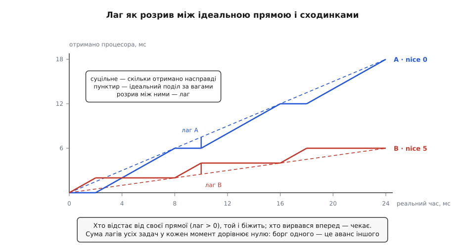
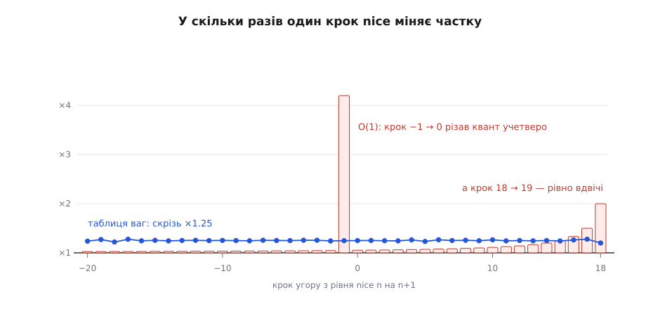
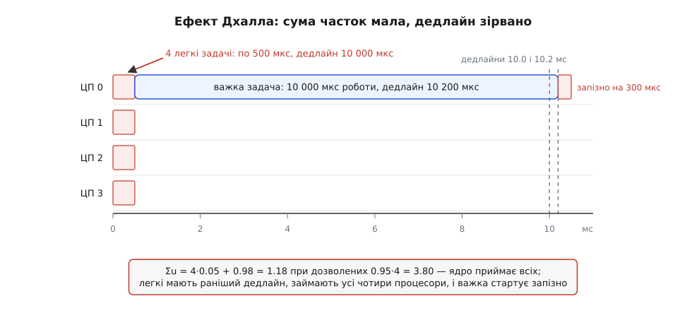

# 🧮 Частки, ваги й пропускна здатність

Три числа тримають увесь розподіл процесора в Linux: частка `w_i / Σw`, множник 1.25 між сусідніми рівнями nice і межа `0.95 · M`, за якою ядро відмовляє новій дедлайновій задачі. Жодне з них не взяте зі стелі — кожне є розв'язком конкретної вимоги, і саме з виведення видно, що ці числа обіцяють, а чого пообіцяти не можуть.

## Частка як розв'язок одного рівняння

Планувальник ніде не рахує відсотків. Він тримає для кожної задачі один лічильник — **віртуальний час** — і має одне правило вибору: на процесор іде задача з найменшим лічильником. Лічильник росте, поки задача виконується, але тим повільніше, чим більша її вага:

```
v̇_i = 1 / w_i        ⟹        v_i = s_i / w_i
```

де `s_i` — скільки реального процесорного часу задача вже отримала. У ядрі те саме записано з нормуванням на nice 0 (`Δv = Δt · 1024 / w`), тож у задачі з nice 0 віртуальний час іде рівно як реальний; сталий множник 1024 нічого не міняє в порівняннях і далі його опускаємо.

Тепер порахуймо, що з цього правила виходить на проміжку `[0, T]`, поки всі n задач готові й процесор не простоює. Правило «біжить найменший лічильник» не дає жодному лічильникові відірватися: щойно чийсь `v` вирвався вперед, задача перестає отримувати процесор, і решта її наздоганяє. Тож наприкінці проміжку всі лічильники стоять на спільному значенні `V`, і далі йде три рядки арифметики:

```
v_i = V                для кожної задачі
s_i = w_i · V          бо v_i = s_i / w_i

Σ s_i = T              процесор не простоював
V · Σ w_i = T     ⟹    V = T / Σ w_i

s_i = T · w_i / Σ w_i
```

Це і є формула частки. Виведення жодного разу не спитало, скільки задач у системі: воно однакове для двох і для двохсот, і однакове для будь-яких ваг. Заразом видно, що таке `V`: це час ідеального, нескінченно дрібного поділу — за `T` реальних секунд спільний віртуальний годинник просувається на `T / Σw`, і кожна задача бере з нього свою вагу.

**Три задачі, що постійно рахують, на одному процесорі: дві з nice 0 і одна з nice 5.**

```
w        = 1024, 1024, 335
Σw       = 2383

частка   = 1024 / 2383 = 0.4297   →  43.0 %
частка   = 1024 / 2383 = 0.4297   →  43.0 %
частка   =  335 / 2383 = 0.1406   →  14.1 %
перевірка: 0.4297 + 0.4297 + 0.1406 = 1.0000
```

Додаймо четверту задачу з nice 0, нікого не чіпаючи. `Σw` стає 3407, і частки самі собою переписуються: 30.1 %, 30.1 %, 30.1 % і 9.8 %. Задача з nice 5 втратила третину свого часу, хоч ніхто не змінював жодного її параметра — знаменник спільний, і він не належить нікому.

Але одна річ у цій формулі від складу конкурентів не залежить. Поділімо частки двох задач одна на одну:

```
s_i / s_j = w_i / w_j
```

`Σw` скорочується. Абсолютні частки плавають від кожного новоприбулого, а **відношення** двох задач тримається намертво. Саме на цьому — і тільки на цьому — можна будувати шкалу nice.

## Лаг: борг, сума якого завжди нульова

Виведення вище чесне для довгого проміжку, але живий планувальник дискретний: задача біжить цілим шматком, а не нескінченно малими порціями, тож лічильники ніколи не рівні точно. Щоб міряти, наскільки далеко реальність відійшла від ідеалу, потрібна величина, визначена в кожен момент, а не лише в кінці:

```
S_i(t) = w_i / Σw · t              скільки задача мала б отримати
lag_i(t) = S_i(t) − s_i(t)         борг ідеального поділу перед нею
```

Ядро тримає цю саму величину, але через свої лічильники: воно рахує зважене середнє віртуальних часів і бере відхилення від нього.

```
V = Σ (w_i · v_i) / Σ w_i          зважене середнє лічильників
lag_i = w_i · (V − v_i)
```

Два означення збігаються, і це видно в один крок. Оскільки `w_i · v_i = s_i`, зважене середнє є `V = Σ s_i / Σw = t / Σw` — той самий ідеальний годинник, що й у виведенні частки. Підставмо:

```
w_i · (V − v_i) = w_i · t / Σw − w_i · v_i = S_i(t) − s_i(t)
```

Тобто «зважене середнє лічильників» — це не окрема вигадка бухгалтерії, а рівно та точка, від якої міряється борг.

Далі — тотожність, яка пояснює, чому чесність тут узагалі можлива. Просумуймо лаги всіх задач:

```
Σ lag_i = Σ w_i·V − Σ w_i·v_i = V · Σw − Σ s_i = t − t = 0
```

Сума боргів завжди рівно нуль. Ніхто не може відставати без того, щоб хтось інший на стільки ж випереджав; ідеальний поділ не буває винен системі в цілому, він лише перерозподіляє борги між учасниками. Звідси й правило допуску: задача **придатна** бігти, коли `lag_i ≥ 0`, тобто коли її лічильник не обігнав спільне середнє (`v_i ≤ V`). Серед придатних планувальник бере ту, у якої найменший **віртуальний дедлайн** — лічильник плюс замовлений шматок, переведений у віртуальний час:

```
vd_i = v_i + r_i / w_i
```

За однакового шматка `r` важча задача дістає ближчий віртуальний дедлайн — тому вага впливає не лише на обсяг, а й на те, кого підхоплять першим. Ця конструкція (найраніший придатний віртуальний дедлайн, EEVDF) описана Йоном Стойкою та Хусейном Абдель-Вахабом 1995 року, а в ядро Linux її приніс Петер Зейлстра у версії 6.6 восени 2023 року, замінивши серцевину попереднього чесного планувальника.

Швидкість, з якою борг накопичується й погашається, теж виводиться прямо з означення. Поки задача біжить, `s_i` росте зі швидкістю 1, а `S_i` — зі швидкістю `w_i/Σw`; поки чекає — навпаки:

```
біжить:            lag спадає зі швидкістю  1 − w_i/Σw
чекає:             lag росте зі швидкістю      w_i/Σw
за один шматок r:  lag зменшується на  r · (1 − w_i/Σw)
```



*Задача A (nice 0) і задача B (nice 5) на одному процесорі; шматки по 6 і 2 мс дають відношення 3.0, а точне з ваг — 3.06, і в масштабі рисунка різниця непомітна. Кожен шматок гасить борг того, хто його взяв, і черга переходить до сусіда — чергування виникає само, ніхто його не призначав.*

За рисунком легко перевірити формулу: `6 · (1 − 0.75) = 1.5` мс — саме на стільки A відкидає себе назад кожним своїм шматком, і рівно на стільки ж, `2 · (1 − 0.25) = 1.5` мс, відкидає себе B. Звідси й головний практичний висновок про точність: відхилення від ідеалу обмежене розміром шматка. Дрібніші шматки тримають систему ближче до ідеальних часток, але кожен шматок закінчується [перемиканням контексту](root:sf-os/context-switch) — збереженням регістрів однієї задачі й відновленням регістрів іншої, — і ця плата росте рівно так само швидко.

## Чому крок мусить бути геометричним

Тепер до самої шкали. Від неї вимагають одного: щоб `nice +5` означало те саме, хоч би з якого рівня його дали. Записана формально, ця вимога стає рівнянням на таблицю ваг:

```
w(n) / w(n+k)  залежить лише від k, але не від n
```

Розв'язується воно негайно. Візьмімо `k = 1`: відношення сусідів `w(n)/w(n+1)` мусить бути тим самим числом `α` для кожного `n`. Але це вже рекурентність, і вона визначає всю таблицю:

```
w(n+1) = w(n) / α       ⟹      w(n) = w(0) · α^(−n)
w(n) / w(n+k) = α^k     — залежить лише від k, як і вимагалося
```

Геометрична таблиця тут не «зручний вибір» серед багатьох, а **єдиний** розв'язок вимоги: будь-яка інша форма — лінійна, квадратична, будь-яка — цю властивість ламає. Від таблиці лишається один вільний параметр `α`, і навіть він визначає не поведінку, а лише масштаб.

Що буває без цієї властивості, найкраще показує попередня шкала самого Linux. Планувальник O(1) з ядер 2.6 переводив nice не у вагу, а прямо в довжину кванта, і переводив лінійно:

```
static_prio = 120 + nice
квант = (140 − static_prio) · 20 мс,   якщо static_prio < 120
квант = (140 − static_prio) ·  5 мс,   якщо static_prio ≥ 120

nice −20 → 800 мс     nice −1 → 420 мс     nice 0 → 100 мс
nice  10 →  50 мс     nice 19 →   5 мс
```

Візьмімо ту саму різницю в п'ять рівнів у трьох місцях шкали:

```
O(1), квант часу                 сучасна таблиця ваг
nice  0 ↔  5 :  100 / 75 = 1.33      1024 / 335 = 3.06
nice 10 ↔ 15 :   50 / 25 = 2.00       110 /  36 = 3.06
nice 14 ↔ 19 :   30 /  5 = 6.00        45 /  15 = 3.00
```

Праворуч — те саме число з точністю до заокруглення, ліворуч — розкид у чотири з половиною рази. Один крок nice коштував по-різному залежно від того, звідки його роблять: перехід з −1 на 0 різав квант учетверо (420 → 100), сусідній перехід з −2 на −1 — на п'ять відсотків (440 → 420), а крок з 18 на 19 різав його рівно вдвічі. Документація ядра (`sched-nice-design`) називає наслідок прямо: поділ процесора між задачами з nice +1 і +2 залежав від того, з якою ввічливістю запустили батьківську оболонку.



*Стовпчики — у скільки разів мінявся квант O(1) за один крок nice; синя лінія — те саме для сучасної таблиці ваг. Вимога «важить лише різниця рівнів» — це і є вимога, щоб лінія була горизонтальною.*

## Скільки коштує один крок

Лишилося обрати `α`. Дуель двох задач з вагами `w` і `w/α` дає частки прямо з формули поділу:

```
частки:   α/(1+α)   і   1/(1+α)
```

Ядро хотіло, щоб один рівень nice коштував приблизно десяту частину власного часу задачі: той, хто зробив крок угору, віддає ~10 % свого, той, хто лишився, стільки ж додає. Відстань між ними стає `1.1 / 0.9 = 1.22` — звідки й узялося кругле 1.25, записане в коментарі до таблиці ваг. Перевіримо, що обіцянка справджується на реальних числах у двох далеких кінцях шкали:

```
nice 10 (110) ↔ nice 11 (87):     110 / 197  = 55.8 %    87 / 197  = 44.2 %
nice −5 (3121) ↔ nice −4 (2501): 3121 / 5622 = 55.5 %  2501 / 5622 = 44.5 %
```

Обидві пари ділять процесор як 55 до 45, різниця між ними — три десяті відсоткового пункту, і та лише від заокруглення. Ось уся таблиця, з якої ці числа беруться (`sched_prio_to_weight` у `kernel/sched/core.c`):

```
nice −20 …:   88761   71755   56483   46273   36291
nice −15 …:   29154   23254   18705   14949   11916
nice −10 …:    9548    7620    6100    4904    3906
nice  −5 …:    3121    2501    1991    1586    1277
nice   0 …:    1024     820     655     526     423
nice   5 …:     335     272     215     172     137
nice  10 …:     110      87      70      56      45
nice  15 …:      36      29      23      18      15
```

Це цілі числа, а не степені 1.25, тож варто знати, наскільки вони від ідеалу відходять:

```
w(n) ≈ 1024 · 1.25^(−n)

n = −20:  1024 · 1.25²⁰ = 88818   у таблиці 88761   (−0.06 %)
n =  19:  1024 / 1.25¹⁹ = 14.76   у таблиці 15      (+1.6 %)

розмах:   88761 / 15 = 5917   ≈   1.25³⁹ = 6019
```

Найбільша похибка — півтора відсотка на самому краю ввічливості, тобто властивість «важить лише різниця» справджується з точністю, якої ніхто ніколи не помітить. Заразом видно, чого коштувала б лінійна шкала: між крайніми рівнями тут майже шість тисяч разів, і розтягнути таку відстань лінійно на сорок кроків неможливо — або крок біля нуля стане мікроскопічним, або біля краю велетенським.

Цілі числа обрані не для краси. Ділити на вагу доводиться в найгарячішому місці ядра — на кожному оновленні лічильника, — а ділення дороге, тож поруч лежить друга таблиця, `sched_prio_to_wmult`, із заздалегідь порахованими оберненими: `⌊2³² / w⌋`. Замість ділення виходить множення й зсув.

```
2³² / 1024  =   4194304
2³² / 88761 =     48388
2³² / 15    = 286331153

Δv ≈ (Δt · 1024 · inv_w) >> 32
```

Це звичайна [арифметика з фіксованою комою](root:hw-arch/fixed-point) — цілі числа з домовленістю про те, де стоїть кома, замість дробових; ядро користується нею скрізь, де потрібна швидкість і передбачувана похибка.

## Множення часток крізь ієрархію

Коли задачі складено в дерево груп, формула не змінюється — вона просто застосовується на кожному поверсі окремо: група ділить час зі своїми сестрами за вагами, а всередині вже ділять її діти. Частка окремої задачі стає добутком уздовж шляху від кореня:

```
частка = Π ( вага вузла / сума ваг його сестер )   по дорозі згори вниз
```

**Дві групи однакової ваги; у першій одна задача, у другій десять.**

```
група A: 1024 / 2048 = 0.5      усередині: 1 задача  → 0.5    = 50.0 %
група B: 1024 / 2048 = 0.5      усередині: 10 задач  → 0.5/10 =  5.0 %
```

Множення — не деталь реалізації, а те, що робить облік узагалі можливим: сума часток на кожному поверсі дорівнює одиниці, тож і добуток по всьому дереву дає в сумі одиницю, скільки б поверхів не було. Механізм такого дерева — [cgroups](root:sys-unix/cgroups-resource-model), де кожен вузол має власну вагу й власний облік ресурсів.

## Скільки часу взагалі можна пообіцяти

Усе попереднє ділило те, що є. Прийом задачі — питання іншого роду: чи можна пообіцяти наперед, що вона встигне. Перевіряти тут узагалі є що лише тоді, коли задача заявила **обсяг**; фіксований пріоритет обсягу не містить, тож і арифметики прийому для нього не існує. Дедлайновий договір заявляє: `C` — процесорного часу за період, `P` — період, `D` — термін. Звідси одне число:

```
u_i = C_i / P_i        завантаження, яке задача забирає назавжди
```

На одному процесорі відповідь відома точно. Для періодичних задач з `D = P` вибір за найранішим дедлайном встигає **тоді й лише тоді**, коли `Σu ≤ 1`: необхідність очевидна (більше за сто відсотків не буває), а достатність — класична теорема ([EDF-планування](root:sf-os/edf-scheduling) — чому вибір за найранішим дедлайном оптимальний на одному процесорі й що з цією оптимальністю стається на кількох). Для фіксованих пріоритетів гарантія скромніша — `n·(2^(1/n) − 1)`:

```
n = 1  :  1.000
n = 2  :  0.828
n = 3  :  0.780
n = 4  :  0.757
n = 10 :  0.718
n → ∞  :  ln 2 = 0.693
```

Ось арифметична причина існування дедлайнового класу: там, де ієрархія пріоритетів гарантує 69 % процесора, договір із термінами гарантує всі 100 % ([системи реального часу](root:sf-tasks/real-time-systems) — модель періодичних задач, найгірший час виконання і межі планованості).

Що саме перевіряє Linux, коли надходить нова дедлайнова задача:

```
u_i = runtime_i / period_i          (якщо period не заданий — замість нього deadline)

Σ u_i  ≤  M · sched_rt_runtime_us / sched_rt_period_us
       =  M · 950000 / 1000000  =  0.95 · M
```

`M` — кількість процесорів у кореневому домені планування, тобто в тому наборі ядер, який задачі дозволено займати. Перевірка ціла: частку ядро тримає як `⌊runtime · 2²⁰ / period⌋`. Не пройшла — `sched_setattr` повертає `EBUSY`, і це не «зараз зайнято», а «сума обіцянок не влазить у смугу». Окремо перевіряється сам договір: `runtime ≤ deadline ≤ period`, інакше `EINVAL`.

**Машина на 4 ядра, до якої задачі додаються по черзі.**

```
3 контури керування:  1200 / 5000    →  u = 0.24 кожен   Σ = 0.72
відеоконвеєр:         8000 / 16667   →  u = 0.48         Σ = 1.20
аудіоланцюжок:         300 / 2667    →  u = 0.1125       Σ = 1.3125

дозволено:  0.95 · 4 = 3.80          →  усі приймаються

ще вісім потоків обробки:  4500 / 10000  →  u = 0.45 кожен
                                          Σ = 1.3125 + 3.60 = 4.9125  >  3.80
```

Останній запит завершиться `EBUSY` — навіть якщо в цю мить машина стоїть майже порожня.

> 🔧 **Навіщо це.** `runtime` у договорі — це не «скільки зазвичай треба», а «скільки треба в найгіршому разі», і водночас не «з десятикратним запасом про всяк випадок». Невитрачений залишок не пропадає — ядро віддає його іншим задачам, — але в арифметиці прийому ці мікросекунди зайняті постійно. Кожна зайва тисяча мікросекунд у вашому `runtime` — це шматок смуги, якого не дорахується наступний, хто прийде з чесним договором.

## Чому ця перевірка лише необхідна

`Σu ≤ M` виглядає як природний перенос одномашинного критерію на M машин, і на одному процесорі так і є. На кількох — ні, і причина проста: **задача не вміє бігти на двох ядрах одночасно**. Сума часток міряє загальну смугу, а окрема задача впирається в стелю одного процесора; ці дві речі перестають узгоджуватися, щойно з'являється задача, якій потрібне майже ціле ядро.

Класичний приклад цього розриву описали Сударшан Дхалл і Чун Лаунг Лю 1978 року — той самий Лю, чия стаття з Лейландом п'ятьма роками раніше дала межу для фіксованих пріоритетів. Ось він у числах, на чотирьох ядрах:

```
4 легкі задачі:  C =    500 мкс,  D = P = 10 000 мкс   →  u = 0.05
1 важка задача:  C = 10 000 мкс,  D = P = 10 200 мкс   →  u = 0.9804

Σu = 4 · 0.05 + 0.9804 = 1.1804    при дозволених  0.95 · 4 = 3.80
```

Ядро прийме всіх п'ятьох без вагань: заявлено менш ніж третину того, що дозволено. А тепер випустімо їх одночасно в момент 0. У легких дедлайн ближчий (10 000 проти 10 200), тому вибір за найранішим дедлайном віддає їм усі чотири процесори. Важка чекає 500 мкс, а тоді має до свого терміну лише 10 200 − 500 = 9 700 мкс на 10 000 мкс роботи — і запізнюється на 300.



*Легкі задачі забирають усі процесори на свої 500 мкс — і цього досить, щоб важка вже не встигла, хоча зайнято менш як третину машини.*

Найнеприємніше, що приклад не масштабується разом із машиною: скільки б ядер не було, беремо `M` легких задач з мізерним `C` і одну важку — сумарне завантаження лишається трохи більшим за одиницю. Тобто ніякий поріг, вищий за 1, не може бути достатнім на довільній кількості ядер.

Достатня умова для глобального EDF з `D = P` існує, але платить за строгість (Жоель Ґуссенс, Шелбі Фанк і Санджой Баруа, 2003):

```
Σ u_i  ≤  M − (M − 1) · u_max ,     де u_max = max u_i
```

На прикладі Дхалла вона дає `4 − 3 · 0.9804 = 1.0588`, і це менше за `1.1804` — умова за цей набір не ручається, що збігається з тим, що ми щойно порахували вручну. Але подивімося на неї уважніше: коли `u_max` наближається до одиниці, права частина наближається до `M − (M−1) = 1`. Чотири ядра гарантують не більше, ніж одне. Одна важка задача отруює весь набір.

Ліки — розділити машину. Якщо розбити ядра на неперетинні набори (`cpuset` створює окремі домени, кожен зі своєю арифметикою прийому), то всередині домену з одного процесора знову працює точний критерій `Σu ≤ 1`:

```
ЦП 0:  важка задача       u = 0.9804  ≤ 1   ✓
ЦП 1:  чотири легкі       u = 0.20    ≤ 1   ✓
```

Той самий набір, за який глобальний вибір за дедлайном ручатися не міг, після розділення проходить точний критерій — тому [прив'язка до процесорів](root:sys-unix/cpu-affinity) для дедлайнових задач не косметика, а частина розрахунку. Одне застереження до цих двох рядків: точний критерій — це теорія, а ядро й у кожному окремому домені лишає свої п'ять відсотків звичайним задачам, тож `u = 0.9804` на домені з одного процесора воно однаково відхилить (`0.95 · 1 = 0.95`). Щоб такий договір пройшов, доводиться або зменшувати `runtime`, або піднімати `sched_rt_runtime_us` — свідомо, розуміючи, чого позбувається система.

Тож перевірку ядра варто читати рівно так, як вона написана. `Σu ≤ 0.95·M` не каже «усі дедлайни буде витримано». Вона каже дві скромніші, але цілком конкретні речі: звичайні задачі не залишаться без процесора, бо п'ять відсотків смуги їм лишили назавжди, а запізнення дедлайнових задач мають скінченну верхню межу, а не ростуть без упину. Усе понад це — уже ваша арифметика: або один процесор на домен і точний критерій, або достатня умова з її суворою платою за найважчу задачу.
