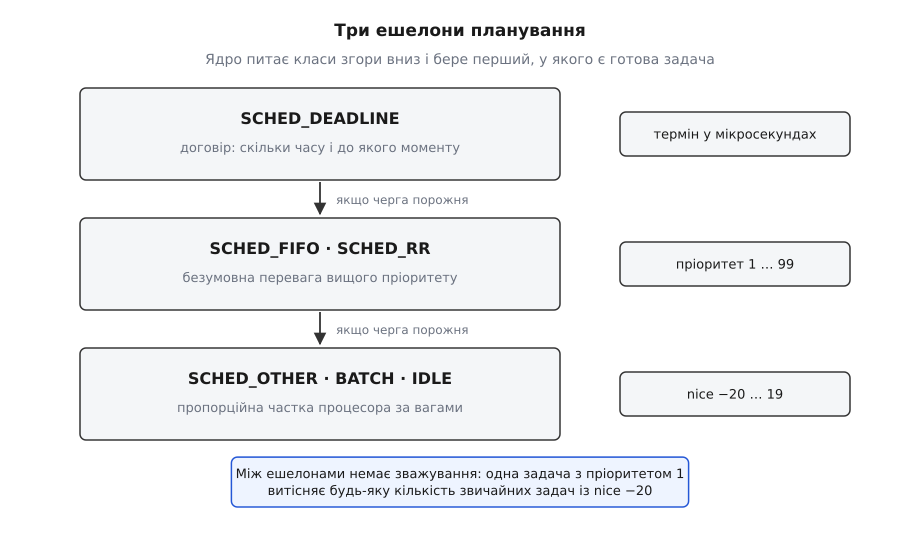
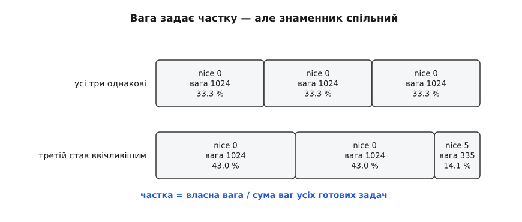
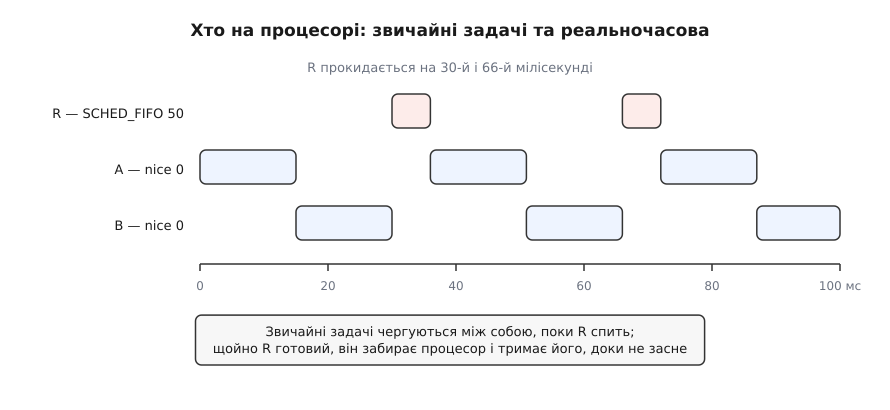
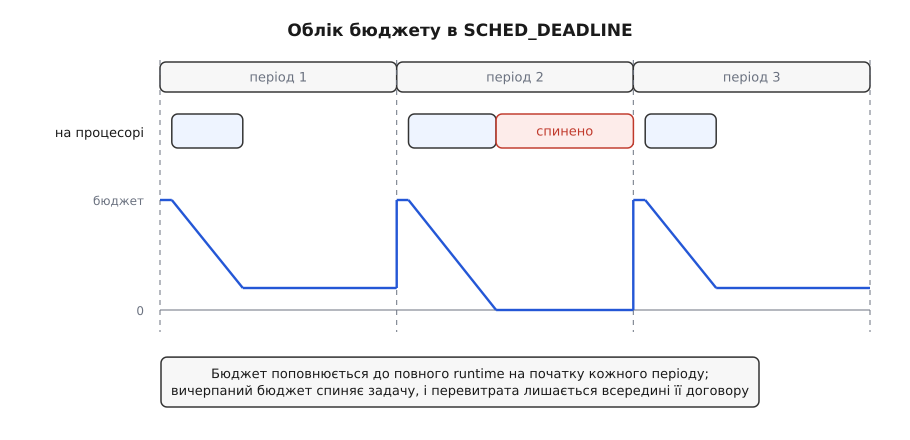

# Пріоритети, nice і реальночасові класи

<preknowlist>
- [Процес: що це насправді](root:sys-unix/process-model) — процес як увесь стан одного запуску програми, який ядро мусить зберегти, щоб виконання можна було спинити й продовжити.
- [Потоки в Linux: задача як одиниця планування](root:sys-unix/threads-as-tasks) — процесор роздається не процесам, а задачам (потокам): саме задача має власний пріоритет і власний клас.
- [Планувальник: як ядро ділить час](root:sys-unix/scheduler-model) — коли ядро взагалі вирішує змінити задачу на процесорі: тик таймера, пробудження, блокування.
- [Стани процесу](root:sys-unix/process-states) — різниця між «готова до виконання» і «спить»: за процесор змагаються лише готові.
- [Перемикання контексту](root:sf-os/context-switch) — щоб змінити задачу на процесорі, треба зберегти регістри однієї й відновити регістри іншої, і це коштує часу.
</preknowlist>

## Два прохання, які не зводяться в одне число

На ноутбуці одночасно збирається ядро в шістнадцять потоків і йде відеодзвінок. Обидві програми чогось хочуть від процесора — але хочуть різного, і різниця тут не в кількості.

Компіляція просить **обсяг**: чим більше процесорного часу за наступну хвилину, тим раніше вона скінчиться. Їй байдуже, коли саме цей час дадуть — хоч суцільним шматком, хоч тисячею уривків. Кодек відеодзвінка просить **момент**: кожні 20 мс приходить черговий пакет звуку, і його треба розкодувати до того, як програвач дійде до кінця буфера. Йому потрібно менше двох відсотків процесора — але потрібно **вчасно**, інакше буде тріск, а решта секунди вже нічого не виправить.

Спробуйте описати обидва прохання одним числом «пріоритет» — і воно розсиплеться. Дати кодекові дев'яносто відсотків процесора не можна назвати рішенням: він не з'їсть і двадцятої частини цього, а сама по собі велика частка не обіцяє, що його розбудять на третій мілісекунді після приходу пакета, а не на сімнадцятій. Частка — це властивість довгого проміжку, вона нічого не каже про окрему мить. Навпаки, дати компіляції «терміновість» — і машина стане непридатною: задача, яка ніколи не спить і завжди має що рахувати, з'їсть усе, щойно їй дозволять не поступатися.

Отже, ядро мусить уміти відповідати на два питання **окремо**: скільки часу задача отримає в середньому і наскільки рано її розбудять, коли настане її момент. Саме тому в Linux не одна шкала пріоритетів, а кілька **класів планування**, і кожен клас має власне поняття важливості з власною одиницею виміру. Число −5 у одному класі й число 50 у іншому — не «менше й більше», а величини різної природи, як градуси й кілограми.

## Три ешелони, а не одна шкала

Ядро тримає не одну чергу готових задач, а окремий набір черг на кожен клас. Коли треба вибрати, кого пустити на процесор, воно **перебирає класи в жорсткому порядку** й зупиняється на першому, у якого є хоч одна готова задача. Це не зважування й не лотерея з коефіцієнтами — це строгий пріоритет ешелонів.



*Ядро питає класи в незмінному порядку і віддає процесор першому, у якого є готова задача; між класами немає жодного зважування — нижчий ешелон отримує час лише тоді, коли вищі порожні.*

З цього одразу випливає наслідок, який важить більше за всі подальші подробиці: **реальночасова задача з найнижчим пріоритетом 1 витіснить будь-яку кількість звичайних задач із nice −20**. Не «отримає більше часу», а витіснить — звичайні задачі не отримають нічого, доки реальночасова готова бігти. Порівнювати −20 і 1 безглуздо: вони живуть у різних ешелонах.

Усередині ядра числа реального часу й nice усе ж зводяться в один лічильник `prio` в діапазоні 0–139, де менше означає важливіше: 0–99 віддано реальному часу, 100–139 — звичайним задачам, де `prio = 120 + nice`. (Дедлайновий клас і в цю шкалу не влазить: його задачам ядро дає від'ємний `prio`, тобто ставить їх поза всім переліком.) Це чиста бухгалтерія для внутрішніх порівнянь, і саме її сліди видно в стовпчику `PRI` у `ps`. Читати той стовпчик як єдину шкалу «хто важливіший» не варто: він змішує величини, які означають різні речі.

## nice: ввічливість, переведена у вагу

Найстаріший спосіб вплинути на розподіл процесора — `nice` (англ. *nice* — люб'язний, поступливий). Назва точна й не метафорична: число задає не те, скільки ти хочеш для себе, а **наскільки ти поступаєшся іншим**. Більше число — більше поступливості, менша частка. Тому шкала виглядає перевернутою відносно звички: −20 — найнахабніша задача, 19 — найввічливіша.

Механізм з'явився в Unix ще 1973 року й пережив усі перебудови планувальника, змінюючи по дорозі внутрішнє значення. Як саме воно змінювалося — від простої добавки до лічильника пріоритету до сучасної ваги — розказано окремо: [шлях від nice до дедлайнів](root:sys-unix/priority-nice-realtime/hist-nice-to-deadline.md) — чотири покоління планувальників Linux і те, що кожне з них зробило з поняттям «важливості».

Сучасний Linux не тримає nice як місце в черзі. Він перекладає nice у **вагу** за сталою таблицею, і вже ваги визначають, як ділиться процесор. Таблиця геометрична: кожен наступний рівень nice приблизно в 1.25 раза легший.

```
nice   −20     −10     −5      0      1      5     10     19
вага  88761    9548   3121   1024    820    335    110     15
```

Правило розподілу з цих ваг виводиться в один крок. Якщо на одному процесорі змагаються задачі з вагами w₁, w₂, …, то на довгому проміжку кожна отримує частку

```
частка_i = w_i / (w₁ + w₂ + … + w_n)
```

**Дві задачі, що постійно рахують: одна з nice 0, друга з nice 5.**

```
вага(0)      = 1024
вага(5)      = 335
сума         = 1024 + 335 = 1359
частка(0)    = 1024 / 1359 = 0.7535  →  75.3 %
частка(5)    =  335 / 1359 = 0.2465  →  24.7 %
відношення   = 1024 / 335  = 3.06    ≈ 1.25⁵ = 3.05
```

Задача з nice 5 отримує втричі менше процесора — і, що важливіше за саме число, відношення залежить **лише від різниці** рівнів nice, а не від їхніх абсолютних значень. Пара (0, 5) ділить час так само, як пара (10, 15). Це прямий наслідок геометричної таблиці: відношення ваг є 1.25 у степені різниці. Виведення частки для довільної кількості задач, пояснення, чому крок обрали геометричним, а не лінійним, і математика прийому нових реальночасових задач зібрані окремо: [частки, ваги й пропускна здатність](root:sys-unix/priority-nice-realtime/math-shares-and-bandwidth.md).

Але формула частки має другий бік, на якому спотикаються найчастіше: **знаменник залежить від усіх інших**. Ваша задача не має «своєї» частки — вона має частку відносно поточного складу конкурентів.



*Три задачі, що постійно рахують: коли одній підняти nice до 5, її вага падає з 1024 до 335, і звільнені відсотки розходяться між рештою пропорційно їхнім вагам, а не дістаються комусь одному.*

> 🔧 **Навіщо це.** `nice -n 10 make -j16` не «сповільнює збірку на десять одиниць» — воно робить збірку легшою за все решту приблизно вдесятеро, тож поки ви редагуєте код, редактор і браузер забирають процесор першими, а щойно ви відійшли — збірка займає всю машину сама. Саме тому nice майже нічого не коштує: він не обмежує згори, він лише впорядковує суперечку.

## Чому вага дає частку, але не дає моменту

Частка — це підсумок за проміжок. Щоб із ваг вийшов конкретний вибір «хто саме біжить наступні три мілісекунди», потрібен механізм, який перетворює бажані пропорції на послідовність рішень.

Сучасне ядро робить це через **віртуальний час**. Кожна задача має лічильник, який росте, поки вона на процесорі, але росте зі швидкістю, оберненою до її ваги: важка задача (мала nice) за одну реальну мілісекунду «старіє» на менше віртуальних мілісекунд, ніж легка. Планувальник намагається тримати віртуальні лічильники всіх задач якомога ближче один до одного — і цим автоматично видає їм реальний час пропорційно вагам, без жодних явних відсотків.

Понад те, чесний клас рахує для кожної задачі **відставання** — різницю між тим, скільки вона мала б отримати за ідеального ділення, і тим, скільки отримала насправді. Задача, яка щойно прокинулася після сну, має додатне відставання, і саме воно дає їй право бігти раніше за тих, хто вже своє взяв. З відставання й розміру шматка, який задача просить за раз, ядро рахує їй **віртуальний дедлайн**, і обирає задачу з найранішим. Тут ваги входять удруге: чим важча задача, тим менший її віртуальний дедлайн за того самого шматка, тож nice впливає не тільки на обсяг, а й на те, як швидко задачу підхоплять після пробудження.

Це і є межа можливостей чесного класу — і межу треба назвати чесно. Впливає, але **не гарантує**. Віртуальний дедлайн — величина внутрішньої бухгалтерії, а не обіцянка в мілісекундах; він каже «цю задачу візьмемо раніше за ту», а не «цю задачу візьмемо не пізніше ніж через 2 мс». Якщо на восьми ядрах готові чотириста задач, ваш nice −20 зробить вас першим у черзі — до наступного разу, коли ви заснете й прокинетеся, і все повториться. Ніде в цій конструкції немає поняття **терміну**, після якого результат уже не потрібен.

## Коли nice взагалі нічого не змінює

Перш ніж переходити до класів, які вміють обіцяти момент, варто розібрати три ситуації, у яких nice не дає нічого — не тому, що зламаний, а тому, що впливає на те, чого в цій ситуації немає.

**Задача не впирається в процесор.** nice розподіляє процесорний час між тими, хто його просить. Програма, яка 95 % часу спить на читанні з диска чи мережі, процесора майже не просить; зробити її «важчою» — це збільшити її частку в суперечці, у якій вона не бере участі. Пріоритет вводу-виводу — окрема шкала й окремий механізм.

**Задача не в тій групі.** Ядро вміє ділити час не між задачами напряму, а між **групами** — і лише всередині групи вже між задачами ([cgroups](root:sys-unix/cgroups-resource-model) — механізм обліку й обмеження ресурсів для дерева процесів). На звичайному робочому столі це вмикається саме собою: автогрупування, що з'явилося в ядрі 2.6.38 за патчем Майка Ґелбрейта (Mike Galbraith), складає задачі в групи за сеансами, тож кожен термінал і кожен графічний сеанс змагаються між собою як ціле. Наслідок неочевидний і болючий: `nice +19` на процесі в одному терміналі не віддасть його час процесові в іншому терміналі, бо між групами частка вже поділена порівну, а nice працює лише в межах своєї гілки. Під systemd те саме роблять зрізи й юніти служб.

**Ділити нічого.** Дві готові задачі на восьми ядрах не конкурують: обидві біжать. Ваги мають значення тільки тоді, коли готових задач більше, ніж процесорів.

## Реальний час: пріоритет як безумовна перевага

Реальночасові класи будують важливість на протилежному принципі. Ніяких часток і ніякого зважування: дев'яносто дев'ять окремих черг із номерами 1–99 (тут більше означає важливіше — шкала, зворотна до nice), ядро бере найвищу непорожню чергу й запускає задачу з неї. Задача нижчого пріоритету не отримає процесор, поки вища готова, — скільки б часу це не тривало.

Класів насправді два, і різняться вони однією деталлю — поведінкою **рівних**.

**SCHED_FIFO** — задача, отримавши процесор, тримає його, доки не зробить одне з трьох: заблокується (на вводі-виводі, семафорі, сні), сама віддасть процесор викликом `sched_yield`, або з'явиться готова задача **строго вищого** пріоритету. Рівний за пріоритетом не витіснить ніколи, скільки б не чекав. Звідси й назва: у межах одного рівня — чиста черга, хто перший став готовим, той перший і біжить до кінця.

**SCHED_RR** (англ. *round-robin* — по колу) відрізняється єдиним: серед задач одного пріоритету час ділиться квантами, типово по 100 мс (`/proc/sys/kernel/sched_rr_timeslice_ms`). Вичерпавши квант, задача йде в кінець своєї черги, і біжить наступна рівна. З задачами інших пріоритетів усе так само безумовно, як у FIFO.



*Дві звичайні задачі чергуються між собою, поки R спить; щойно реальночасова R прокидається, вона забирає процесор і тримає його, доки не засне сама, — і лише тоді звичайні дістають його назад.*

Тепер найважливіше застереження, без якого весь цей клас перетворюється на самообман. Слово «реального часу» тут означає **детермінований порядок вибору** — і рівно нічого понад це. Ядро обіцяє: якщо ваша задача готова й вона найвища, її поставлять на процесор. Скільки мікросекунд мине між подією та цим «поставлять», залежить від речей, до пріоритетів не причетних:

- чи можна витіснити ядро в тій точці, де воно зараз працює ([витісненість ядра](root:sys-unix/kernel-preemption) — від конфігурації PREEMPT_NONE до набору PREEMPT_RT залежить, чи має ядро право спинити саме себе посеред довгої операції);
- скільки часу з'їдять обробники переривань, які взагалі не є задачами й не мають пріоритету в цьому сенсі;
- чи не заблокується ваша задача на блокуванні, яке тримає задача з нижчим пріоритетом, — класична [інверсія пріоритетів](root:sf-os/priority-inversion), коли найважливіша задача чекає на найменш важливу, а середні за пріоритетом тим часом спокійно біжать; лікується успадкуванням пріоритету, яке в Linux дають м'ютекси з прапорцем `PTHREAD_PRIO_INHERIT` поверх [futex](root:sys-unix/eventfd-and-futex) ([протоколи пріоритету](root:sf-tasks/priority-protocols));
- чи не станеться в найгіршу мить [сторінковий збій](root:sf-os/page-fault) — тому реальночасові програми одразу після старту прибивають свою пам'ять викликом `mlockall`;
- на якій частоті зараз працює ядро процесора після енергозбереження.

Практичний бік — як створити такий потік, прибити пам'ять, розігріти стек і виміряти, що з цього вийшло, — розібрано з робочим кодом: [реальночасовий потік і вимірювання джитера](root:sys-unix/priority-nice-realtime/proj-realtime-thread.md).

## Запобіжник: чому ядро забирає п'ять відсотків

Реальночасовий пріоритет — це зброя, і ядро поводиться з ним відповідно. Програма з циклом без блокувань на `SCHED_FIFO` з пріоритетом 99 на одноядерній машині означала б кінець сеансу: вона не заснула б ніколи, витіснила б усе, включно з оболонкою, якою ви хотіли б її вбити.

Тому в ядрі є **обмеження смуги реального часу**: за кожен період 1 000 000 мкс реальночасові задачі можуть з'їсти щонайбільше 950 000 мкс (`/proc/sys/kernel/sched_rt_period_us` і `sched_rt_runtime_us`). Вичерпавши ці 95 %, увесь реальночасовий ешелон примусово спиняється до кінця періоду, і решта 5 % дістається звичайним задачам — зокрема вашій оболонці.

Запобіжник рятує систему, але створює власну пастку, і вона регулярно з'їдає дні на пошуки. Якщо реальночасова задача справді потребує понад 95 % процесора, вона отримає паузу на 50 мс раз на секунду — і це буде виглядати не як «спрацював захист», а як загадковий періодичний джитер незрозумілого походження. Симптом «рівно раз на секунду наш контур запізнюється на 50 мс» майже завжди означає саме це.

> 🔧 **Навіщо це.** Перед тим як писати `chrt -f 80` на робочому потоці, спитайте себе, скільки процесора він з'їсть у найгіршому випадку. Реальночасовий пріоритет виправдано лише для задач, які **швидко відпрацьовують і засинають**. Задача, що просто багато рахує, у цьому класі не пришвидшиться — вона лише поламає все навколо, а на 95 % однаково впреться в запобіжник.

## Пріоритет — це не термін

Фіксовані пріоритети вирішують питання «хто раніше», але не вирішують питання «чи встигнемо». Різниця стає видною, щойно періодичних задач більше однієї.

Нехай є контур керування на 200 Гц і фільтр давача на 50 Гц. Кому дати вищий пріоритет? Класична відповідь відома: тому, у кого коротший період, — і за такого призначення система з n періодичних задач гарантовано встигає, поки сумарне завантаження не перевищує n·(2^(1/n) − 1), тобто близько 69 % у границі ([системи реального часу](root:sf-tasks/real-time-systems) — модель періодичних задач, найгірший час виконання та умови планованості).

Тільки ця відповідь спирається на припущення, якого в універсальній операційній системі просто немає: **ви знаєте всі задачі системи наперед**. У Linux будь-яка інша програма з правом `CAP_SYS_NICE` може взяти пріоритет 90, і ваша ретельно збудована ієрархія перестане щось означати. Гірше того, фіксований пріоритет не містить у собі жодної інформації про **обсяг**: із запису «пріоритет 80» неможливо дізнатися, чи з'їсть ця задача півмілісекунди за період, чи чотири. Ядро не має чого перевіряти й нічим не може вам відмовити заздалегідь — воно дізнається про перевантаження тоді ж, коли й ви: коли щось запізниться.

Виходить, потрібен клас, у якому задача декларує не своє місце в ієрархії, а **договір**: скільки процесорного часу їй треба і до якого моменту.

## SCHED_DEADLINE: сказати термін прямо

Саме такий клас з'явився в ядрі 3.14 у березні 2014 року — робота Даріо Фаджолі та Юрі Леллі з лабораторії реального часу ReTiS у Вищій школі Святої Анни в Пізі, зроблена в межах європейського проєкту ACTORS.

Задача цього класу описується трьома числами замість одного пріоритету:

- **`runtime`** — скільки процесорного часу їй потрібно за один період (бюджет);
- **`period`** — як часто вона просинається;
- **`deadline`** — за який час від початку періоду цей бюджет має бути витрачено.

Правило вибору просте й не має жодних номерів пріоритетів: ядро рахує кожній задачі **абсолютний дедлайн** (момент початку її поточного періоду плюс `deadline`) і віддає процесор тій, у якої цей момент найближчий. Задача, якій горить, обганяє задачу, у якої ще є час, — і при зміні обставин вони міняються місцями самі, без жодного втручання.

Друга половина механізму важить не менше. Ядро **веде облік бюджету**: поки задача на процесорі, її залишок зменшується; вичерпала — задачу спиняють до наступного поповнення, скільки б роботи в неї не лишалося. На початку кожного періоду залишок відновлюється до повного `runtime`.



*Задача, яка в одному з періодів попросила більше, ніж заявила, не забирає час у сусідів — її спиняють до наступного поповнення, і наслідки лишаються всередині її власного договору.*

Це і є те, чого фіксовані пріоритети дати не могли: **ізоляція**. Задача, яка збрехала про свій найгірший час виконання або одного разу пішла довшою гілкою коду, псує розклад лише собі. Сусіди про це навіть не дізнаються.

І третя частина — **перевірка при прийомі**. Оскільки тепер кожна задача заявляє свій обсяг, ядро може порахувати суму й відмовити наперед: якщо сума часток `runtime/period` усіх дедлайнових задач перевищить дозволену смугу (за типових налаштувань — 95 % на кожен процесор домену), виклик просто не пройде.

**Контур керування на 200 Гц: період 5 мс, виміряний найгірший час обробки 900 мкс.**

```
period    = 5000 мкс
runtime   = 1200 мкс      (900 виміряних + запас на найгірший випадок)
deadline  = 2500 мкс      (результат треба віддати до половини періоду)

завантаження = runtime / period = 1200 / 5000 = 0.24  →  24 %
дозволено на 4 ядрах        = 4 · 0.95            = 3.80
разом із цією задачею       = 0.24  ≤  3.80       →  приймається
```

Коли одного разу обробка затягнеться до 1500 мкс, задача витратить свої 1200 і буде спинена — цей цикл вона програє, наступний почне з чистим бюджетом вчасно. Без обліку бюджету вона з'їла б чужі 300 мкс, і запізнився б хтось інший, кого ви навіть не підозрювали б.

Дедлайновий клас стоїть вище за FIFO і RR: коли дедлайнова задача готова, реальночасові чекають. За це доводиться платити обмеженнями — дедлайнова задача не може створювати нащадків тим самим класом, а її [прив'язку до процесорів](root:sys-unix/cpu-affinity) ядро контролює саме, бо від набору дозволених ядер залежить арифметика прийому. Спорідненість цього підходу з класичною теорією найранішого дедлайну розібрано окремо ([EDF-планування](root:sf-os/edf-scheduling) — оптимальність вибору за найранішим дедлайном на одному процесорі й що з нею стається на кількох).

## Два краї чесного класу

Крім звичайного `SCHED_OTHER`, у чесному класі живуть ще дві політики, і обидві — не про вагу, а про характер задачі.

**SCHED_BATCH** каже ядру: ця задача не інтерактивна, її не треба підхоплювати одразу після пробудження. Вага й nice лишаються ті самі, змінюється лише готовність планувальника переривати заради неї сусідів. Результат — менше перемикань контексту й трохи кращий загальний темп на пакетних обчисленнях.

**SCHED_IDLE** — інший край: задача отримує вагу 3 замість 1024, тобто приблизно в 340 разів меншу за звичайну. Назва трохи обманює: це **не** «бігти тільки коли процесор простоює», це «мати мізерну, але ненульову частку». Різниця важить: під повним навантаженням така задача все одно повзтиме вперед і не зависне назавжди.

## Одне питання, що вирішує вибір

Усі три ешелони відповідають на різні запитання, тож вибір між ними починається з одного питання про **вашу** задачу: чи існує момент, після якого її результат стає непотрібним?

Якщо ні — не чіпайте нічого, крім nice, і чіпайте його вниз, а не вгору: єдине чесне застосування nice — не заважати іншим. Якщо так, і ви знаєте період і найгірший час обробки — це `SCHED_DEADLINE`, бо тільки він дозволяє перевірити ваше припущення до запуску, а не після аварії. Якщо момент є, але задача аперіодична й керована зовнішньою подією, — `SCHED_FIFO` з **найнижчим** пріоритетом, якого досить, щоб обійти конкурентів: пріоритет 99 не робить задачу швидшою, він лише позбавляє вас усіх, хто міг би вас урятувати, коли щось піде не так.

Конкретні виклики, поля структур, права й типові помилки зібрані окремо: [інтерфейс класів планування](root:sys-unix/priority-nice-realtime/api-sched-interfaces.md) — `nice`, `setpriority`, `sched_setscheduler`, `sched_setattr`, обмеження `RLIMIT_NICE` й `RLIMIT_RTPRIO`, команди `nice`, `renice` і `chrt`.
