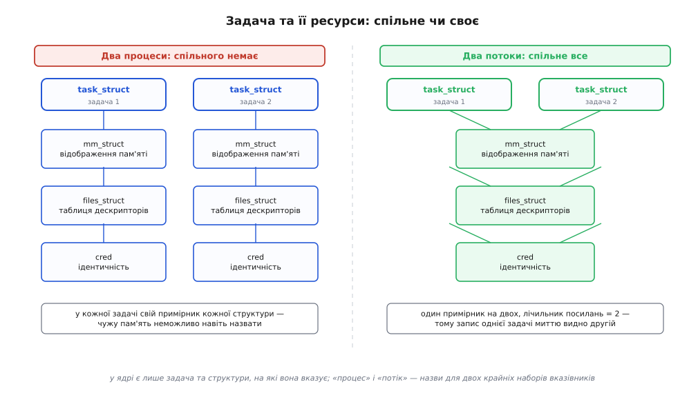
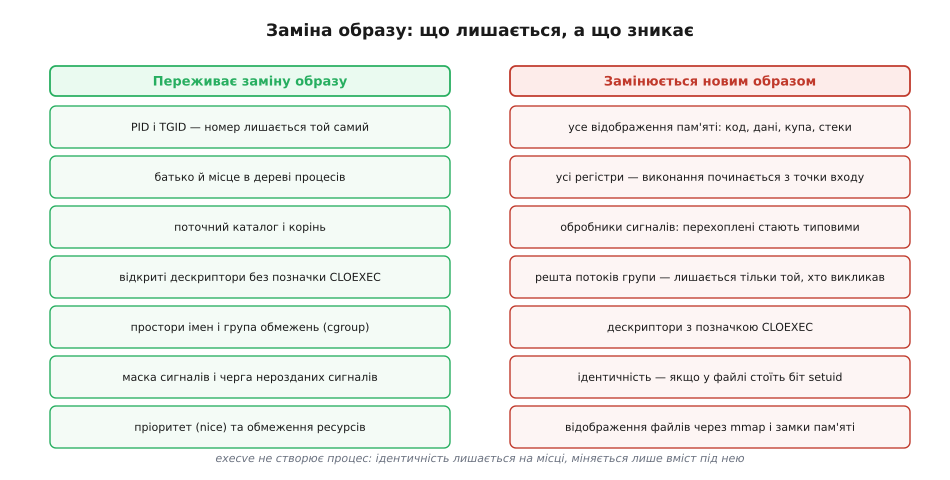
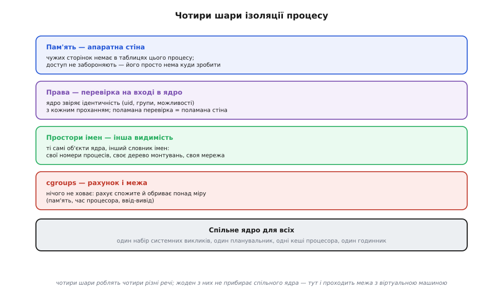

# Процес: що це насправді

<preknowlist>
- [Ядро й простір користувача](root:sys-unix/kernel-and-userspace) — програма не керує машиною сама: усе, що стосується заліза й чужих ресурсів, робить ядро, а програма лише просить.
- [Системний виклик](root:sys-unix/syscall-mechanics) — як саме програма переходить у режим ядра з проханням і повертається назад.
- [Віртуальна пам'ять](root:hw-arch/virtual-memory) — адреса в програмі не є адресою в мікросхемі пам'яті: між ними стоїть таблиця перекладу, яку веде ядро.
- [Файловий дескриптор](root:sys-unix/file-descriptor) — відкритий файл програма тримає не як об'єкт, а як маленьке ціле число.
- [Перемикання контексту](root:sf-os/context-switch) — щоб спинити виконання й потім продовжити, досить зберегти й відновити регістри процесора.
</preknowlist>

## Дві копії однієї програми

Запустіть той самий `grep` двічі — з двох терміналів, на двох різних файлах. На диску лежить один-єдиний виконуваний файл, і обидва запуски виконують з нього ті самі байти інструкцій. Але це, безперечно, дві різні речі: одну можна спинити, і друга біжить далі; одна може впасти, а друга цього навіть не помітить; кожна шукає у своєму файлі й нічого не знає про чужий шаблон пошуку.

Виходить, різниця між двома запусками лежить не в програмі. Файл дає те, що однакове для всіх запусків: інструкції й початкові дані. Різне — усе, що встигло змінитися відтоді, як запуск почався: значення змінних, місце в коді, куди дійшло виконання, які файли відкрито й на якому вони байті, скільки часу процесора вже витрачено.

Ось ця відмінність, зібрана докупи й названа одним словом, і є **процес** (лат. *processus* — просування, хід). Точніше кажучи: процес — це все, що ядро мусить тримати про один запуск програми, аби виконання можна було спинити будь-якої миті, а згодом продовжити так, наче паузи не було.

З цього визначення список складових виводиться сам: щоб дізнатися, з чого зроблено процес, досить чесно відповісти на питання «що саме треба зберегти, щоб потім продовжити».

## Інвентаризація: що ламається, якщо цього не зберегти

Уявіть, що ядро спиняє запуск посеред роботи і за годину пускає його далі. Пройдімося по тому, що мусить пережити цю годину — і в кожному пункті питаймо не «що буває в процесі», а «що зламається, якщо цього не буде».

**Місце в коді й проміжні значення.** Процесор нічого не пам'ятає: регістри — це весь його стан. Лічильник команд каже, яка інструкція наступна; вказівник стека — де лежать локальні змінні й адреси повернення; решта регістрів тримають те, що зараз рахується. Не збережеш їх — і продовжити нема з чого.

**Значення адрес.** Інструкція каже «прочитай за адресою 0x404018». Саме по собі це число нічого не означає: воно стає адресою лише разом із таблицею сторінок, яку ядро підсовує апаратному блоку перекладу — [MMU](root:hw-arch/mmu). У сусіднього процесу те саме число 0x404018 вказує на зовсім інші комірки. Отже, зберегти треба не «пам'ять», а **відображення** — набір записів «ця ділянка віртуальних адрес відповідає цим сторінкам фізичної пам'яті або цьому шматку файлу» ([віртуальний адресний простір](root:sf-os/virtual-address-space)).

**Значення дескрипторів.** Програма читає з файлу, вживаючи число 3. Це число теж нічого не означає само по собі: воно є індексом у таблиці, де запис 3 указує на конкретний [опис відкритого файлу](root:sys-unix/open-file-description) з поточною позицією читання. Втратиш таблицю — і цифра 3 в наступній інструкції вкаже деінде або в порожнечу.

**Де програма «стоїть».** Відносний шлях `data/log.txt` розкривається в різні файли залежно від поточного каталогу, а абсолютний `/etc/passwd` — залежно від того, що для цього процесу є коренем. Тож і корінь, і поточний каталог — теж пара посилань, які ядро мусить тримати для кожного процесу окремо.

**Ким програма є для перевірок.** Коли процес відкриває файл, ядро питає не «хто ти», а «який твій числовий ідентифікатор користувача і які групи» — плюс набір [можливостей](root:sys-unix/capabilities), якщо треба щось понад звичайні права ([користувачі й ідентичність процесу](root:sys-unix/uid-gid-identity-model)).

**Як реагувати на переривання ззовні.** [Сигнал](root:sys-unix/signal-model) — це асинхронне сповіщення, яке ядро доправляє процесові; на кожен номер сигналу процес має диспозицію (обробник, ігнорування або типова дія) і маску заблокованих. Це теж стан, який мусить пережити паузу.

**Ім'я і рідня.** У процесу є номер (PID), є батько, якому повідомлять про його смерть, і є [код виходу](root:sys-unix/exit-wait-zombies), який мусить кудись потрапити ([PID і дерево процесів](root:sys-unix/pid-and-hierarchy)).

**Рахунки.** Скільки часу процесора спожито, скільки сторінок зайнято, скільки вводу-виводу зроблено — це те, за що процес звітує й за чим його обмежують.

Список вийшов не однорідною купою, а набором **окремих груп**, кожна зі своєю природою: відображення пам'яті окремо, таблиця дескрипторів окремо, ідентичність окремо, обробники сигналів окремо. І тут напрошується питання, з якого починається все цікаве: якщо це окремі групи, то чи мусять вони завжди належати одному й тому самому запускові?

## У ядрі немає об'єкта «процес»

Найкоротша відповідь: не мусять — і саме на цьому побудований Linux.

У коді ядра марно шукати структуру `struct process`. Є `struct task_struct` — **задача**: одна нитка виконання, одна одиниця, яку планувальник ставить на процесор. Кожна така задача має свій набір регістрів і свій стек у ядрі (16 КіБ на x86-64 у сучасних ядрах). А вся решта переліченого лежить **не всередині** задачі, а в окремих структурах, на які задача лише **посилається**:

```
task_struct  →  mm_struct       відображення пам'яті
             →  files_struct    таблиця дескрипторів
             →  fs_struct       корінь і поточний каталог
             →  sighand_struct  обробники сигналів
             →  signal_struct   спільне на групу: рахунки, ліміти, черга сигналів
             →  nsproxy         набір просторів імен
             →  cred            ідентичність і можливості
```

Кожна з цих структур має лічильник посилань ([підрахунок посилань](root:sf-lang/reference-counting) — структура живе, поки на неї хтось указує). Дві задачі можуть указувати на **ту саму** `mm_struct` — тоді вони бачать однакову пам'ять, бо буквально користуються одним відображенням. Можуть указувати на різні — тоді жодна не має способу навіть назвати чужу пам'ять.



*Ліворуч — дві задачі з окремими відображеннями пам'яті й таблицями дескрипторів: ми звемо їх двома процесами. Праворуч — дві задачі, що вказують на ті самі структури: ми звемо їх двома потоками одного процесу. Різниця — не в типі об'єкта, а в тому, куди дивляться вказівники.*

Звідси випливає найважливіше: **процес у Linux — це не об'єкт ядра, а спосіб спільного володіння.** Процес — це група задач зі спільною ідентичністю, **ідентифікатором групи задач** (TGID); ядро вимагає від такої групи спільного відображення пам'яті й спільних обробників сигналів, а таблицю дескрипторів вони поділяють тому, що саме так їх створює бібліотека потоків. Те, що ми звемо потоком, — це задача всередині такої групи; те, що ми звемо процесом із одним потоком, — це група з однієї задачі.

Ця конструкція не абстракція заради краси: вона просвічує назовні. `getpid()` повертає не номер задачі, а TGID — той самий для всіх потоків; окремий номер задачі видає `gettid()`. Групи задач з'явилися в ядрі 2.4 разом із прапорцем `CLONE_THREAD`, і саме на них через кілька років сперлася бібліотека потоків NPTL (Ingo Molnár — з боку ядра, Ulrich Drepper — з боку glibc), яка від glibc 2.3.2 замінила старішу реалізацію.

Оскільки кожна група ресурсів окрема, ядру не потрібно два різні системні виклики «створити процес» і «створити потік». Потрібен один — з набором прапорців, де кожен прапорець каже про одну групу: спільна чи своя. Цей виклик зветься `clone()` (є й ширша його форма `clone3()` зі структурою параметрів). Ось той самий код, що створює то окремий процес, то задачу зі спільною пам'яттю — різниця в одному біті:

```c
#define _GNU_SOURCE
#include <sched.h>
#include <stdio.h>
#include <stdlib.h>
#include <unistd.h>
#include <sys/wait.h>

static int shared = 0;          /* глобальна змінна батька */

static int child(void *arg)
{
    (void)arg;
    shared = 42;                /* пишемо за тією самою адресою */
    _exit(0);
}

int main(int argc, char **argv)
{
    int vm = (argc > 1 && argv[1][0] == 'v') ? CLONE_VM : 0;
    char *stack = malloc(64 * 1024);

    pid_t pid = clone(child, stack + 64 * 1024, vm | SIGCHLD, NULL);
    waitpid(pid, NULL, 0);

    printf("shared = %d\n", shared);
    free(stack);
    return 0;
}
```

```
$ ./clone-demo        →  shared = 0     (CLONE_VM немає: своя mm_struct,
                                         запис дитини лишився в її копії)
$ ./clone-demo v      →  shared = 42    (CLONE_VM є: та сама mm_struct,
                                         запис дитини видно батькові)
```

Дитина в обох випадках має власний PID і власного батька — спільна пам'ять цього не змінює. Тобто «спільна пам'ять» і «спільна ідентичність» — незалежні осі, а не два прояви однієї. Повний дослід, де по черзі вмикають кожен прапорець і дивляться, що саме стало спільним — пам'ять, дескриптори, поточний каталог, ідентичність, — винесено в [розбір `clone()` за прапорцями](root:sys-unix/process-model/proj-clone-flags.md): там же видно, чому `pthread_create()` — це просто виклик `clone()` з певним набором бітів, і які пастки чекають того, хто спробує зробити потік вручну.

> 🔧 **Навіщо це.** Модель «задача плюс спільні ресурси» пояснює те, що інакше виглядає як набір випадкових дивацтв. Чому `kill -9 <pid>` вбиває всю програму, а не один потік — бо сигнал з номером групи доправляють групі задач. Чому в `top` програма показує 300 % завантаження на чотириядерній машині — бо це сума по задачах. Чому `/proc/1234/task/` містить підкаталоги — бо це і є задачі групи 1234. Чому витік в одному потоці «з'їдає» пам'ять усієї програми — бо `mm_struct` у них одна. Чому дескриптор, відкритий в одному потоці, миттю видно іншому, а після `fork()` дитина має свою копію таблиці — бо в першому випадку `files_struct` спільна, а в другому скопійована.

## Як процес народжується

У Unix немає системного виклику «створи процес із цієї програми». Це не недогляд, а наслідок щойно збудованої моделі: створити процес означає роздобути йому повний комплект структур — відображення пам'яті, таблицю дескрипторів, ідентичність, корінь, оточення. Узяти їх нема звідки, крім як у когось, хто вже їх має. Тому єдиний спосіб з'явитися — **відділитися від наявного процесу**.

Саме це робить `clone()` без прапорців спільності (і його класична обгортка `fork()`, чия назва — «розгалуження» — старша за сам Unix: [звідки взялися «процес» і «fork»](root:sys-unix/process-model/hist-process-and-fork.md)). Нова задача дістає власні структури, зроблені за зразком батькових. Копіювання гігабайтів пам'яті при цьому не відбувається — сторінки позначають лише для читання, а справжня копія робиться посторінково і лише тоді, коли хтось напише ([копіювання при записі](root:sf-os/copy-on-write)). Подробиці того, що саме успадковується, а що ні, розібрано окремо ([fork: розмноження процесу](root:sys-unix/fork-semantics)).

Новий процес поки що виконує ту саму програму, що й батько. Щоб він став іншою програмою, задача просить ядро замінити свій вміст: `execve()` бере виконуваний файл, будує з нього **нове** відображення пам'яті й ставить лічильник команд на точку входу ([exec: заміна образу](root:sys-unix/exec-semantics)).

І тут виявляється друга половина конструкції. `execve()` не створює процес — він **лишає ідентичність на місці** й міняє під нею вміст.



*Номер, батько, каталог, дескриптори без позначки «закрити при exec» і місце в ієрархії обмежень переживають заміну образу; відображення пам'яті, регістри, обробники сигналів і решта потоків — ні. Саме тому оболонка може налаштувати перенаправлення до заміни образу, а програма побачить його вже готовим.*

Наслідки цього поділу — щоденна практика Unix. Оболонка, запускаючи `ls > out.txt`, спершу відділяє від себе дитину, у ній спокійно переставляє дескриптор 1 на файл, і аж потім робить заміну образу — новій програмі вже нема чого налаштовувати, вона просто пише в дескриптор 1 ([перенаправлення як робота з дескрипторами](root:sys-unix/redirection-model)). А програма з правом підвищення (`setuid`) міняє ідентичність саме в момент заміни образу, бо новий образ — єдина мить, коли зміна прав не дає старому коду скористатися новими правами.

Ланцюг «відділився — замінив образ» замикається на своєму початку: перший процес нема кому відділити. Його виготовляє саме ядро наприкінці завантаження — це PID 1, від якого походять усі інші ([роль init і особливість PID 1](root:sys-unix/init-and-pid1)). Поряд із ним ядро тримає власні задачі — вони мають усе, що має задача, крім `mm_struct`. Своєї пам'яті користувача їм не треба, а лишати таблиці сторінок порожніми не можна — процесор мусить мати чинне відображення весь час. Тому така задача просто не міняє того, що вже стоїть: працює під відображенням тієї задачі, яку щойно змінила. Це ще один доказ, що «процес» — не монолітний тип: тут одного вказівника взагалі немає, а задача цілком жива.

## Як процес планується

Планувальник не бачить процесів. Він працює зі списком задач: кожна `task_struct` або готова бігти, або спить, чекаючи на подію, і планувальник обирає з готових ([стани процесу](root:sys-unix/process-states), [планувальник: як ядро ділить час](root:sys-unix/scheduler-model)).

З того, що одиницею планування є задача, а не процес, випливають три речі, які інакше здаються дивними.

**Перше: час дістає задача, а не програма.** Якщо процес має чотири потоки, планувальник бачить чотири претенденти, а не один.

**Дві програми змагаються за одне ядро процесора; перша має чотири потоки, друга — один:**

```
без групування (планувальник бачить окремі задачі):
  програма A: 4 задачі → 4 частки
  програма B: 1 задача → 1 частка
  частка A = 4/(4+1) = 0.8 = 80 % часу ядра
  частка B = 1/(4+1) = 0.2 = 20 % часу ядра

з групуванням (обидві в окремих групах з однаковою вагою):
  частка A = 1/2 = 50 %, усередині — по 12.5 % на кожен з її потоків
  частка B = 1/2 = 50 %
```

Тобто планувальник чесний саме щодо задач; щоб він став чесним щодо програм чи користувачів, задачі треба зібрати в групи — це роблять [cgroups](root:sys-unix/cgroups-resource-model) або ввімкнене типово автогрупування, яке зводить в одну групу всі задачі одного сеансу терміналу (Mike Galbraith, ядро 2.6.38). Сам алгоритм ділення часу мінявся — від «цілком чесного» CFS до EEVDF у ядрі 6.6, — але одиниця, яку він ділить, весь час та сама: задача.

**Друге: стан належить задачі, а не процесу.** Один потік може годинами висіти в непереривному сні на пристрої, поки решта потоків тієї самої програми спокійно рахують. Питання «у якому стані процес» узагалі не має однієї відповіді — `ps` показує зведення, а правду видно в `/proc/<pid>/task/<tid>/status` ([/proc: процеси як файли](root:sys-unix/proc-reading-process-and-kernel-state)).

**Третє: ціна перемикання залежить не від «типу» об'єкта, а від того, чи міняється вказівник на `mm_struct`.** Якщо наступна задача має те саме відображення пам'яті, ядро не чіпає регістр таблиці сторінок: переклад адрес лишається чинним, а вже накопичений у [TLB](root:hw-arch/tlb) переклад — придатним. Якщо відображення інше, доводиться перемкнути адресний простір, і частина напрацьованого перекладу знецінюється (сучасні процесори пом'якшують це, позначаючи записи TLB номером адресного простору, тож повного скидання зазвичай не відбувається).

Ось звідки береться відоме «потоки дешевші за процеси». Не тому, що потік — якийсь легший вид істоти: `task_struct` в обох однакова. А тому, що при перемиканні між задачами зі спільною `mm_struct` найдорожча частина роботи просто не потрібна ([потоки в Linux: задача як одиниця планування](root:sys-unix/threads-as-tasks)).

## Як процес ізолюється

Тепер найтонше. Слово «ізоляція» звучить як одна стіна, а насправді це чотири різні механізми, які роблять чотири різні речі. Плутанина між ними — джерело більшості хибних уявлень про безпеку контейнерів.



*Пам'ять відгороджена апаратно — чужа адреса просто не існує; права перевіряють на вході в ядро; простори імен міняють не доступ, а видимість; cgroups не ховають нічого, лише рахують і обмежують. Ядро під усіма чотирма шарами — спільне.*

**Пам'ять: відсутність, а не заборона.** Найсильніший шар працює не так, як здається. Ядро не перевіряє кожне звертання до пам'яті — воно фізично не встигало б. Замість перевірки діє відсутність: у таблицях сторінок цього процесу чужих сторінок просто немає, тож звертання за чужою адресою або влучає у власну сторінку, або не влучає нікуди й закінчується збоєм. Стіну тримає залізо (MMU), а ядро лише вирішує, що в таблицю записати ([розділення адресних просторів](root:hw-arch/address-space-separation)).

**Права: перевірка на вході.** Пам'ять — своя, але файли, пристрої й мережа спільні на всю систему. Тому другий шар працює інакше: коли процес переходить у ядро із проханням, ядро бере його `cred` і питає, чи цій ідентичності дозволено те, що вона просить. Це ворота, а не стіна: доступ дає перевірка, і поламана перевірка означає поламану ізоляцію.

**Простори імен: інша видимість.** Третій шар не додає ані стін, ані перевірок — він міняє **словник**. Об'єкти ядра ті самі, але процес із власним простором імен бачить лише свою частину відображення «ім'я → об'єкт»: інший набір номерів процесів, інше дерево монтувань, інший набір мережевих інтерфейсів ([простори імен](root:sys-unix/namespaces)). Процес у своєму просторі номерів не «не має права» бачити чужі процеси — він не має **імені**, яким їх назвати.

**cgroups: рахунок і межа.** Четвертий шар не ховає нічого. Він рахує спожите й обриває понад міру: стільки-то пам'яті, стільки-то часу процесора, стільки-то вводу-виводу. Це не про доступ, а про частку. Механізм виріс із роботи Paul Menage і Rohit Seth у Google над тим, що спершу звалося «контейнерами процесів», і потрапив у ядро 2.6.24 в січні 2008 року вже під нинішньою назвою — «групи керування».

І тепер головне про те, чого в цьому списку немає. Під усіма чотирма шарами лишається **одне спільне ядро**: один набір системних викликів, один планувальник, одні кеші процесора, один годинник. Контейнер — це процес із власними просторами імен, обмеженнями cgroups і врізаною ідентичністю, але з тим самим ядром, що й у решти системи; помилка в ядрі рівною мірою належить усім, кого воно обслуговує ([контейнери](root:sf-os/containers)). Саме тут проходить межа між контейнером і віртуальною машиною, яка приносить із собою власне ядро.

## Смерть як дзеркало моделі

Найвиразніше все це видно в момент, коли процес закінчується.

Коли задача завершується, вона відпускає свої посилання: зменшує лічильники на `mm_struct`, `files_struct`, `fs_struct`, `nsproxy`. Кожна структура звільняється тоді й лише тоді, коли її лічильник упав до нуля. Тому в багатопотоковій програмі вихід одного потоку не звільняє ані рядка пам'яті: на `mm_struct` іще вказують інші задачі. Адресний простір зникає тоді, коли з групи піде остання.

А от одна річ не зникає навіть тоді — ідентичність. Номер і код виходу мусять дочекатися, поки батько по них прийде, бо інакше повідомляти про смерть було б нікому й нічим. Тому після смерті останньої задачі лишається порожня оболонка запису: пам'яті немає, дескрипторів немає, виконувати нічого, а рядок у таблиці процесів є. Це і є зомбі — не помилка й не витік, а прямий наслідок того, що ідентичність процесу є окремою власністю з окремим власником ([завершення, wait і зомбі](root:sys-unix/exit-wait-zombies)).

Так само пояснюється й те, що станеться, якщо батько помре раніше: посилання на ідентичність мусить хтось тримати, тож сироту перебирає інший процес ([сироти й перепідпорядкування](root:sys-unix/orphan-reparenting)).

## Спектр замість двох слів

Звична пара «процес або потік» — це не два види сутностей, а дві крайні точки одного набору перемикачів. Нічого спільного — це те, що звемо процесом. Спільне все — те, що звемо потоком. Але між крайніми точками лежить уся середина, і система нею користується: задача зі спільною пам'яттю, але власною таблицею дескрипторів; задача з тією самою таблицею дескрипторів, але власним простором монтувань; програма-пісочниця, яка лишає собі пам'ять і скидає ідентичність, простір імен і половину дескрипторів перед тим, як узятися до чужих даних. Кожен такий випадок — не окремий механізм, а свій набір бітів у тому самому виклику.

Тому питання «скільки процесів у системі» насправді питає про те, скільки є **груп задач зі спільною ідентичністю**, — і `ps` збирає свою таблицю саме так: обходить `/proc`, бере лідерів груп і показує їх як рядки, ховаючи задачі всередині. Побачити те, з чим працює ядро, можна, попросивши `ps -eLf` або `top -H`: тоді фікція розсипається на справжні одиниці, і те, що на екрані зветься процесом, виявляється тим, чим воно є, — домовленістю про спільне майно.
